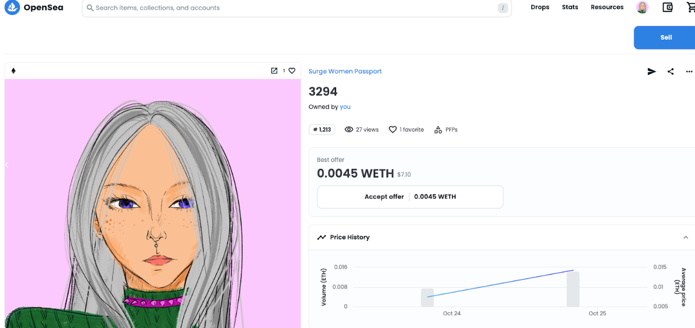
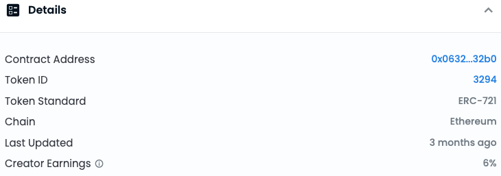
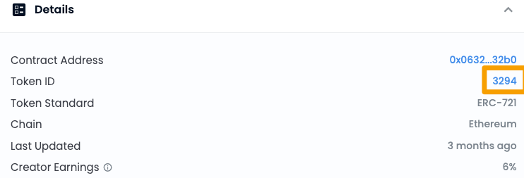
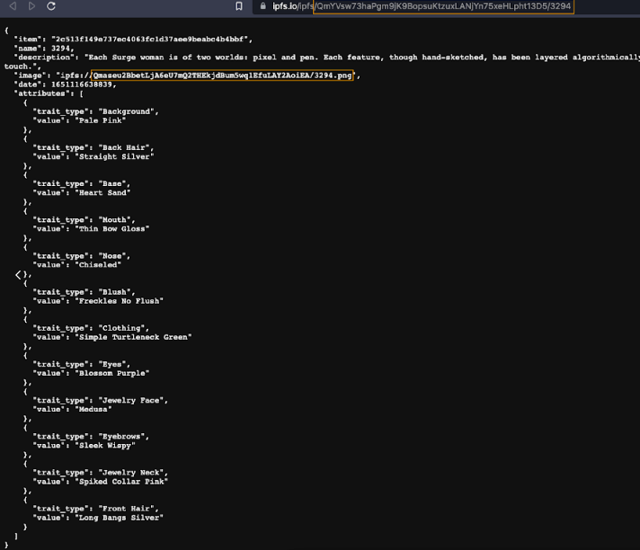

# IPFS 专用网关：检索您的 NFT
	了解如何使用 IPFS 专用网关检索 NFT 资产。
## 什么是 IPFS 专用网关？
IPFS 网关是一个 IPFS 对等体，它接受对 IPFS CID 的 HTTP 请求。专用网关为用户提供了一种访问 IPFS 内容的便捷方式，而无需自己运行 IPFS 节点。网关充当用户的 Web 浏览器或应用程序与 IPFS 网络之间的中介，代表用户检索和提供内容。

要深入了解 IPFS 网关及其工作原理，以及在 Filebase 上使用 IPFS 网关的完整演练，请在此处查看我们的文档：

- [IPFS 网关](https://docs.filebase.com/ipfs/ipfs-gateways)

IPFS 专用网关可用于检索和共享任何 IPFS CID，即使它们没有固定到您的 Filebase 帐户。一个示例可能是您从收藏中购买的 NFT。如果 NFT 的资产（例如它的图像）存储在 IPFS 上，您可以使用 Filebase IPFS 专用网关检索和共享它们。

1. 首先，导航到 NFT 市场，例如 OpenSea。

	查看您拥有的 NFT。此示例使用在以太坊上铸造的 NFT，但如果 NFT 的资产存储在 IPFS 上，则可以使用任何链。
	
	
2. 在OpenSea上，NFT的详细信息在屏幕左侧的NFT图像下方。

	此详细数据的位置将因市场而异。
	
	
3. 从此信息中，单击超链接的 Token ID 值。

	在 OpenSea 上，此 Token ID 会显示 NFT 的元数据文件。此工作流程可能因您使用的市场而异。
	
	
4. 单击后，将在新选项卡中打开存储在 IPFS 上的 JSON 文件。

	一些市场将使用“查看原始数据”或“查看元数据”按钮显示此信息。请注意，此工作流程适用于存储在 IPFS 上的 OpenSea 上的 NFT。如果 NFT 将其资产存储在 Arweave 等另一个平台上，则此工作流程将有所不同。
5. 从这个 JSON 文件中，记下元数据中“图像”字段列出的 IPFS CID。

	IPFS CID 将在 CID 值之后列出一个文件名（在此示例中为“/3294.png”）。

	
6. 接下来，导航到 Filebase Web 控制台上的网关页面

	Filebase IPFS 专用网关是一项仅对付费用户可用的功能。免费套餐的用户无法使用它们。
7. 选择右上角的“创建网关”按钮。

	
8. 将打开一个新窗口，提示您提供网关名称并选择“公共”作为网关的访问级别。

		网关名称受与存储桶名称相同的命名限制。所有网关名称必须是小写字母，介于 3-63 个字符之间，并且必须是唯一的。
		
		
9. 接下来，使用您的 IPFS 专用网关按以下格式导航到您的 NFT 图像的 IPFS CID：

		https://gateway-name.myfilebase.com/ipfs/IPFS_CID
	替换 gateway-name 为您的 IPFS 专用网关名称，IPFS CID 替换为您的 NFT 的 IPFS CID。
	
	
