# IPFS 网关
	了解 Filebase 的 IPFS 网关产品。
## IPFS HTTP 网关
IPFS HTTP 网关使用 HTTP 协议为托管在 IPFS 网络上的内容提供服务，弥合了两种不同协议之间的差距。这意味着您可以在大多数支持 HTTP 的代码片段或应用程序等情况下通过其 IPFS CID 访问 IPFS 上的内容。

简单地说，网关是一个 IPFS 对等体，它接受对 IPFS CID 的 HTTP 请求。

IPFS HTTP 网关格式遵循以下结构

## IPFS 公共网关
通过 Filebase 存储在 IPFS 上的所有内容都可以通过 Filebase 网关访问，响应时间比通过任何其他网关访问内容更快。这是因为 Filebase 网关与我们的 IPFS 节点对等。Filebase 网关还与其他固定服务的 IPFS 网关对等。

- Filebase 公共 IPFS 网关是：

		https://ipfs.filebase.io/ipfs/<CID>
- Filebase 公共 IPFS 网关的有效速率限制为 200 RPM（每分钟请求数）。

		Filebase 公共 IPFS 网关仅提供存储在 Filebase 上的内容。

网关可以提供文件夹的 CID，而不仅仅是单个文件。在这种情况下，它将返回一个文件目录树，其中包含位于文件夹中的文件。

例如，以下 IPFS 网关 URL 指向文件的文件夹目录：

	https://ipfs.filebase.io/ipfs/QmWTqpfKyPJcGuWWg73beJJiL6FrCB5yX8qfcCF4bHvane
网关也可用于为静态网站提供服务。以下 URL 指向一个静态网页，该网页托管在 IPFS 上，使用包含静态 HTML 文件和图像文件的文件夹：

	https://ipfs.filebase.io/ipfs/QmYRpH3myNKG2XeaBmdidec3R5HcF9PYBHUVHfks5ysTpq/

## 公共 IPFS 网关与私有 IPFS 网关
公共网关允许任何人使用 HTTP 从 IPFS 网络检索 CID。Filebase 提供了一个公共 IPFS 网关，地址如下：

	https://ipfs.filebase.io/ipfs/<CID>/
私有 IPFS 网关有两种形式：专用和自托管。

IPFS 固定服务提供专用网关，允许您通过固定服务通过您自己的私有专用网关访问固定在 IPFS 上的 CID。专用网关通常不限于公共网关的传统速率限制。

自托管网关是指您自己托管的 IPFS 节点，无论是在云中还是在本地计算机上，该节点都配置为充当 IPFS 网关。自托管网关也不限于速率限制，但需要 IPFS 由您运行和管理以实现功能。许多用户选择提供专用网关的 IPFS pinning 服务，这样他们就可以避免自己托管和维护 IPFS 节点。
### IPFS HTTP 网关流程
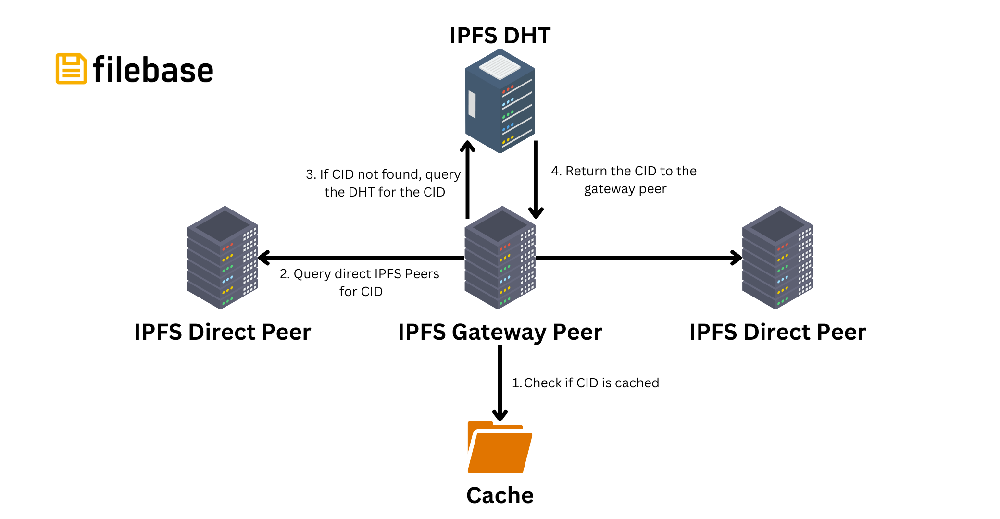

当使用 IPFS HTTP 网关发起 CID 请求时，会发生以下步骤：

1. 在尝试从 IPFS 网络检索 CID 之前，网关会检查 CID 是否已在本地缓存。缓存可以是本地的 HTTP 缓存，也可以是 IPFS 网关节点的缓存。
2. 如果尚未缓存 CID，则需要从 IPFS 网络中检索 CID。
3. IPFS 对等方将首先询问其直接对等方是否有任何托管所请求的 CID，然后它将查询 DHT 以查找当前托管或固定所请求的 CID 的对等方的对等 ID 和网络地址。
4. IPFS 网关节点将连接到具有 CID 的对等点之一，获取 CID 的内容，然后将响应中继到请求 CID 的客户端。

## IPFS 专用网关
与其他 IPFS 专用网关解决方案相比，Filebase 的 IPFS 专用网关是独一无二的。使用 Filebase，您可以创建公共、私有和范围内的网关。

- 公共：网关可以为任何公共 CID 提供服务，即使是那些没有被 Filebase 固定的。
- 私有：网关只能为 Filebase 固定的 CID 提供服务。
- 作用域：网关绑定到一个桶，只能提供来自该特定桶的内容。未存储在指定存储桶中的内容的任何 CID 都将返回 404 Not Found 消息。

任何类型的 Filebase IPFS 专用网关都没有任何请求限制。

Filebase IPFS 专用网关是一项仅对付费用户可用的功能。免费套餐的用户无法使用它们。

### 创建专用网关
1. 导航到Filebase Web 控制台上的 [网关页面](https://console.filebase.com/gateways)
2. 选择右上角的“创建网关”按钮。

	
3. 将打开一个新窗口，提示您提供网关名称并选择网关的访问级别。

		网关名称受与存储桶名称相同的命名限制。所有网关名称必须是小写字母，介于 3-63 个字符之间，并且必须是唯一的。
		

	网关可以是公共的、私有的或范围内的。

#### 公共网关
要创建公共网关，请选择“公共”。这可以在创建网关后更改。

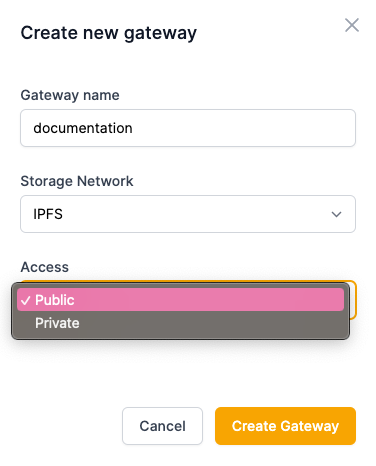

#### 私人网关
要创建专用网关，请选择“专用”。这可以在创建网关后更改。

#### 作用域网关
要创建作用域网关，请选择“私有”，然后从下拉菜单中选择要为作用域网关提供服务的存储桶名称。Scoped 网关仅提供位于它们被限制的存储桶中的内容。

	注意：如果网关配置根 CID 提供服务，则它也不能配置存储桶限制。 必须清除根 CID 配置才能配置存储桶限制。
	
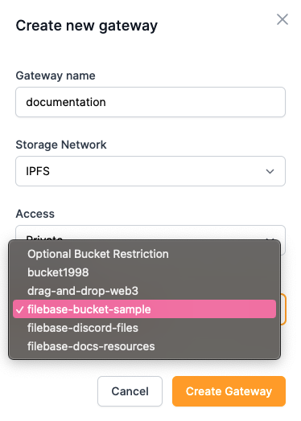

或者如果你想为之前创建的网关设置存储桶，可以通过导航到存储桶菜单并为您想要限制网关的存储桶选择三个菜单点来设置限制。然后选择“设置限制”。

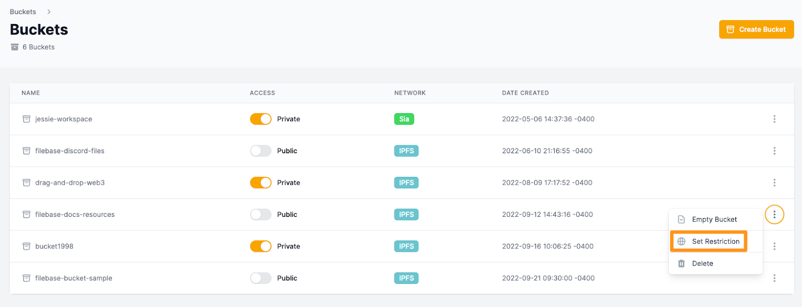

出现提示时，选择要配置为使用所选存储桶的网关。

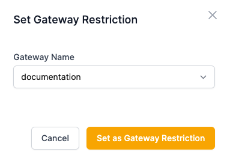
### 删除存储桶限制
1. 要删除网关上的存储桶限制，请导航至网关页面，选择右侧的三个菜单点，然后选择“清除存储桶限制”

	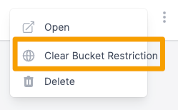
2. 系统将提示您确认删除。

	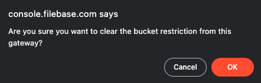

### 与网关交互
创建网关后，将创建指向您的专用网关的子域记录。例如，名为“文档”的专用网关将使用网关 URL：

	https://documentation.myfilebase.com/
#### 切换私人/公共访问
要在专用网关的公共和私有访问之间切换，请使用与存储桶的公共和私有访问切换开关功能相同的切换开关。

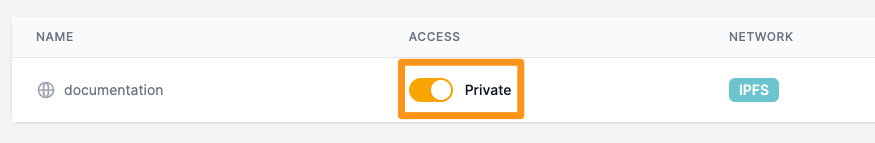
要与网关交互，您可以选择三个菜单点以打开选项列表。

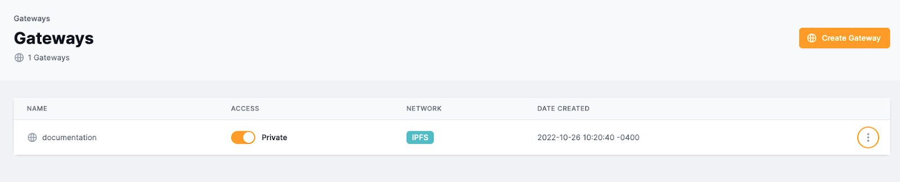
要打开网关 URL，请选择“打开”。

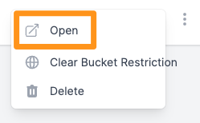

默认情况下，该 URL 将返回以下网页：

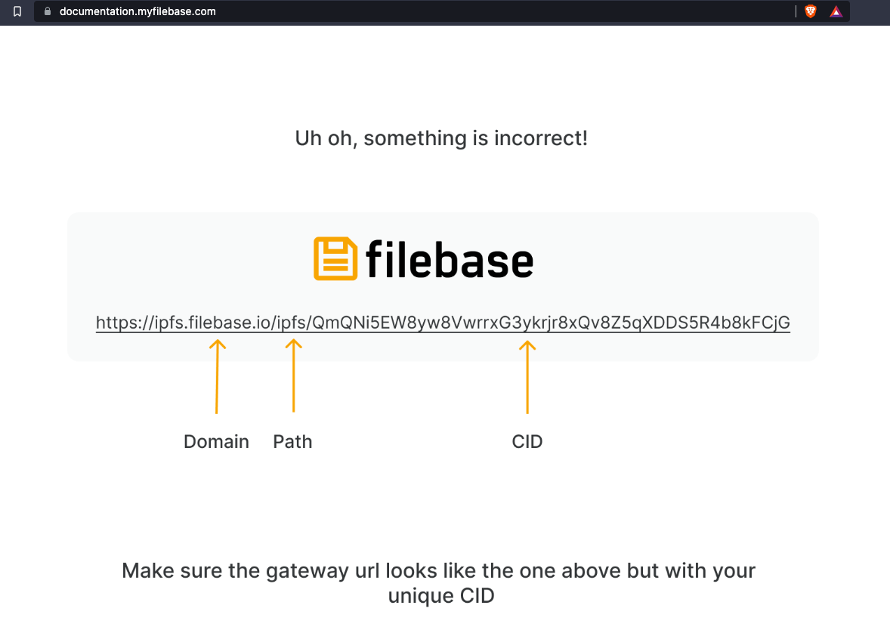
由于 URL 中不包含 CID，因此返回此网页。但是网关可以配置为将 CID 或文件作为其根提供服务。这意味着您可以配置一个不同的默认静态网页或另一个文件，而不是默认网页，而不是此错误消息。

这最常用于为域中的静态网站提供服务。使用此功能，http://documentation.myfilebase.com/ 将返回您选择的文件，而无需在 URL 中输入 CID 或路径。

### 将 CID 设置为专用网关的根
	注意：如果网关被配置为仅限于一个桶，则不能将其配置为具有根 CID。在为网关配置根 CID 之前，需要清除存储桶限制配置。
1. 要配置它，请导航桶到菜单，然后选择一个 IPFS 存储桶。
2. 进入存储桶后，通过选择右侧的三个菜单点来选择要设置为根文件的文件。

	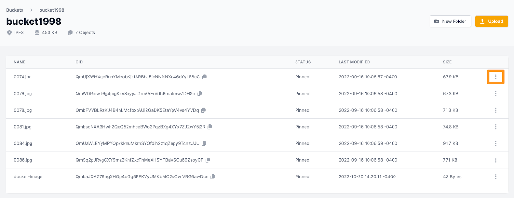
3. 选择“设置为根”。

	
4. 然后选择您要使用的专用网关。

	
5. 现在，当您打开网关时，您将看到您设置为根文件的文件，而不是默认的错误消息。

	
	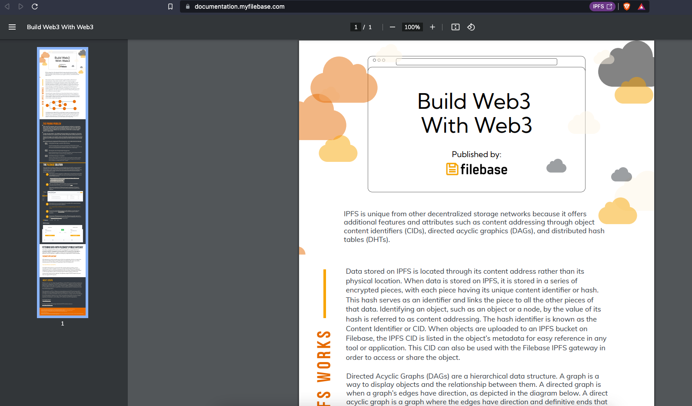

### 从网关中删除根 CID
1. 要删除设置为专用网关根 CID 的 CID，请导航至网关页面，然后选择三个菜单点并选择“清除根 CID”。

	
2. 系统将提示您确认删除。

	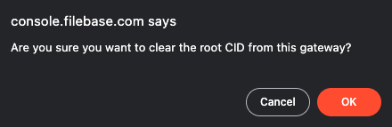

### 删除网关
1. 要删除专用网关，请导航到Filebase Web 控制台仪表板中的网关页面

	
2. 通过单击右侧与要删除的网关对应的三个点来选择选项菜单。然后选择“删除”。

	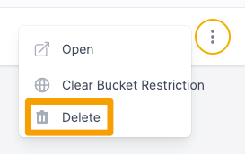
3. 系统将提示您确认删除。

## Filebase IPFS 图像优化
Filebase 直接通过 Filebase IPFS 专用网关功能提供图像优化功能。

通过此功能，可以改善图像加载时间和整体图像体验。

任何上传到 Filebase 的图像文件都可以通过查询字符串参数进行操作。‌查询字符串选项定义如下。
### 图像优化选项 ‌
要使用图像优化，必须至少指定一个选项。

这些参数可以添加到图像、文件的 URL 中。例如：

如果默认图像 URL 是：
	
	https://documentation.myfilebase.com/ipfs/QmVnf5PnSUvjrPkc9tDgpwqcreKWh7xVyXDwDmS6xwchWp
图片可以通过在url末尾加一个参数来变小，比如：

	https://documentation.myfilebase.com/ipfs/QmVnf5PnSUvjrPkc9tDgpwqcreKWh7xVyXDwDmS6xwchWp?img-width=300
要利用多种不同的图像优化，可以使用逗号分隔值指定多个选项。不支持空格。

- img-width=x

	指定图像的最大宽度（以像素为单位）。
- img-height=x

	指定图像的最大高度（以像素为单位）。
- img-dpr=x
	
	指设备像素比。默认值为 1。
- img-fit

	指图像的宽度和高度。任何调整大小的模式都将保留图像的纵横比。其他修饰符包括：
	
	- img-fit=scale-down：图像将缩小到与提供的宽度或高度相匹配的尺寸。
	- img-fit=contain：图像将在提供的参数范围内调整为尽可能大。
	- img-fit=cover：图像将调整大小以匹配通过宽度和高度参数指定的数量。
	- img-fit=crop：图像将被缩小和裁剪以适应宽度和高度参数指定的尺寸。
	- img-fit=pad：图像将在给定的宽度或高度参数内调整为尽可能大。
- img-gravity
	- img-gravity=auto
	- img-gravity=side
	- img-gravity=XxY
- img-quality=x

	此参数指定 JPEG 和 WebP 格式的图像质量。
- img-format=auto

	该参数是指标准图像格式JPEG/PNG，如果不指定该选项，将使用该格式。
- img-anim=false

	此参数减少动画图像（例如 GIF）的帧数。
- img-sharpen=x

	此参数指定锐化过滤器的强度。该值是介于 0 和 10 之间的浮点数，0 表示不锐化，10 表示最大锐化。对于大多数图像，1 是推荐值。
- img-onerror=redirect
- img-metadata

	控制是否应为指定图像保留元数据。
	
	- img-metadata=keep
	- img-metadata=copyright