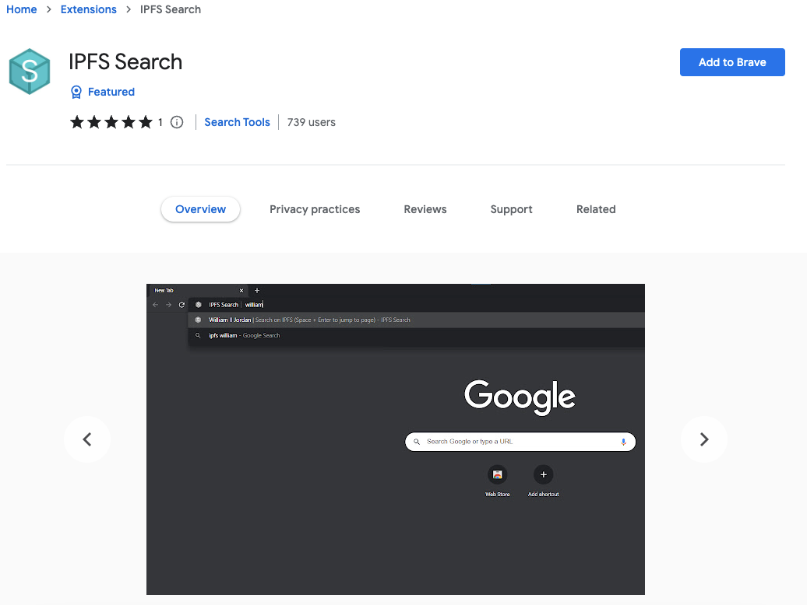
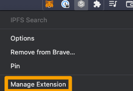
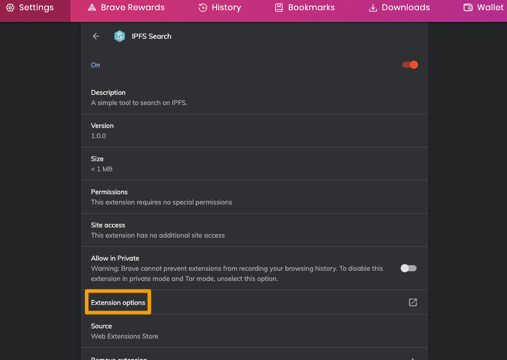
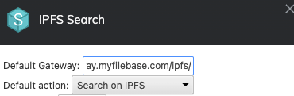
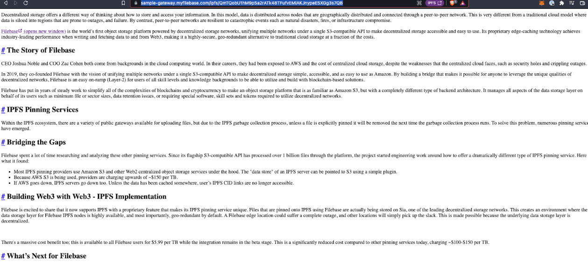

# IPFS 网关：使用带有 IPFS 搜索的专用网关
	了解如何配置 IPFS 搜索以使用专用 IPFS 网关。
## 什么是 IPFS 搜索？
IPFS 搜索是一种工具或服务，使用户能够搜索存储在 IPFS 网络上的内容。IPFS 搜索通过索引存储在 IPFS 网络上的内容来工作，创建内容的可搜索数据库。
## 为什么使用专用 IPFS 网关很重要？
公共网关可能会遇到大量延迟，因为它们经常被全世界成千上万的用户同时使用。大多数公共网关都施加了速率限制来管理和维护这种延迟，但即使施加了速率限制，最流行的网关检索内容的速度也比私有专用网关慢得多。

专用网关提供比公共网关更高的性能和更低的延迟。为了检索存储在整个 IPFS 中的内容，专用网关可以帮助显着改进检索过程。

阅读下文以了解如何使用 IPFS 搜索来使用专用 IPFS 网关。

- 先决条件：
	- 注册一个 Filebase 帐户。

步骤

1. 接下来，导航到 Filebase Web 控制台上的网关

	Filebase IPFS 专用网关是一项仅对付费用户可用的功能。免费套餐的用户无法使用它们。
2. 选择右上角的“创建网关”按钮。

	
3. 将打开一个新窗口，提示您提供网关名称并选择网关的访问级别。

		网关名称受与存储桶名称相同的命名限制。所有网关名称必须是小写字母，介于 3-63 个字符之间，并且必须是唯一的。

	
4. 接下来，前往 Chrome 网上商店并下载适用于 Chrome 或 Brave 浏览器的 IPFS Search 扩展。

	
5. 添加后，从浏览器中选择扩展程序并选择“管理扩展程序”。

	
6. 选择“扩展选项”。

	
7. 在“默认网关”下，按以下格式输入您的文件库 IPFS 专用网关 URL：[https://gateway-name.myfilebase.com/ipfs/](https://gateway-name.myfilebase.com/ipfs/)

	
8. 然后选择“应用”。
9. 现在，在您的 Web 浏览器导航栏中，键入“IPFS”，然后输入您的搜索词来搜索 IPFS。

	
10. 将列出最上面的结果，可以通过同时使用 Space + Enter 键直接访问。

	打开后，您可以看到您的 IPFS 专用网关正在用于为页面提供服务：
	
	