# IPFS 入门指南
	想开始使用 IPFS，但不确定从哪里开始？本指南将引导您完成在 Filebase 上使用 IPFS 所需了解的一切。
## 什么是 IPFS？
星际文件系统或 IPFS 是一种去中心化的点对点协议，使节点能够在彼此之间存储和传输文件。

IPFS 本身并不是一个网络，就像 Sia 等其他去中心化存储网络一样。IPFS 是一种通信协议，它概述了促进 IPFS 网络存在的工作流程和组件。IPFS 桌面客户端或 IPFS CLI 守护程序等软件为 IPFS 节点提供了与运行相同软件的其他节点交互的能力，从而创建了一个在它们之间存储和共享文件的对等网络。
## 注册 Filebase
Filebase 使用基于 Web 的控制台，可以在 [https://filebase.com/](https://filebase.com/) 找到。

现有帐户可以直接访问 [https://console.filebase.com/](https://console.filebase.com/)。

1. 要注册 Filebase 帐户，请导航至  [https://filebase.com/](https://filebase.com/) 。要创建新帐户，请单击网页右上角的“免费试用”按钮。

	
2. 接下来，填写表格的字段，包括电子邮件地址和密码，并同意 Filebase 条款以创建您的帐户。

		注意：临时电子邮件地址不能用于创建 Filebase 帐户。
3. 您将收到一封包含确认说明的电子邮件。单击电子邮件中包含的链接以确认您的帐户并完成注册过程。

## 如何创建 IPFS 桶
只需导航到您的[控制台](https://console.filebase.com/)，[创建一个新桶](https://docs.filebase.com/getting-started-guides/getting-started-guide#creating-a-bucket)并选择 IPFS 选项。

## 将您的第一个文件固定到 IPFS
首先 [注册](https://filebase.com/signup) 一个 Filebase 帐户，然后[登陆到](https://console.filebase.com/) Filebase 仪表板。

单击菜单中的“存储桶”选项以打开存储桶仪表板。

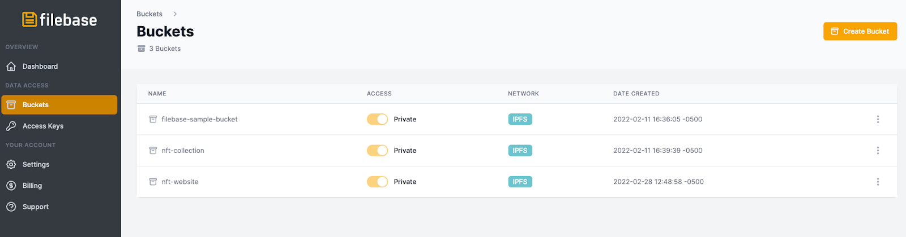

选择您的 IPFS 存储桶。需要做一个 IPFS 桶？在此处查看[操作方法](https://docs.filebase.com/getting-started/getting-started-guides/ipfs-getting-started-guide#how-to-create-an-ipfs-bucket)。单击存储桶名称后，选择右上角的“上传”。您将有三个选择：

- 文件：文件用于将单个文件上传到 IPFS。这可以是图像、视频、音频、文本或任何其他文件类型。
- 文件夹：文件夹用于上传包含多个文件的文件夹，例如NFT收藏，或者静态网站的文件。
- CID：CID 代表[内容标识符](https://docs.filebase.com/ipfs/ipfs-cids)，用于重新固定您可能从另一个固定提供商或本地 IPFS 节点获得的现有 IPFS CID。

要上传单个文件，请选择“文件”，然后在出现提示时选择要上传到 IPFS 的文件。

上传后，确认状态显示为“固定”。然后，您将能够从“CID”类别中查看和复制 IPFS CID，如下所示。

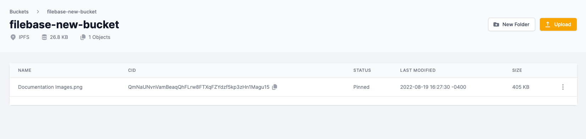

## 使用 S3 兼容 API 将文件上传到 IPFS
如果您使用的是与 S3 兼容的 API，则 CID 将在 PutObject 调用的响应中返回。

例如，如果我们运行以下 AWS CLI 命令：

	aws --endpoint https://s3.filebase.com s3 cp test-images/7FIMFhlMf6A.jpg s3://ipfs-test --debug
有关 AWS CLI 的更多信息，请参阅[此处](https://docs.filebase.com/configurations/cli-tools-and-resources/cli-tools/aws-cli)。

响应如下所示。为了方便起见，我们突出显示了相应的响应标头：

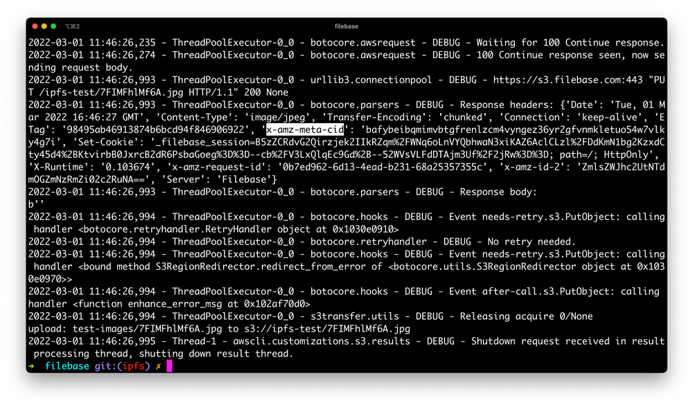

您也可以随时调用 HeadObject API 来获取 CID：

	aws --endpoint https://s3.filebase.com s3api head-object --bucket ipfs-test --key 7FIMFhlMf6A.jpg
	
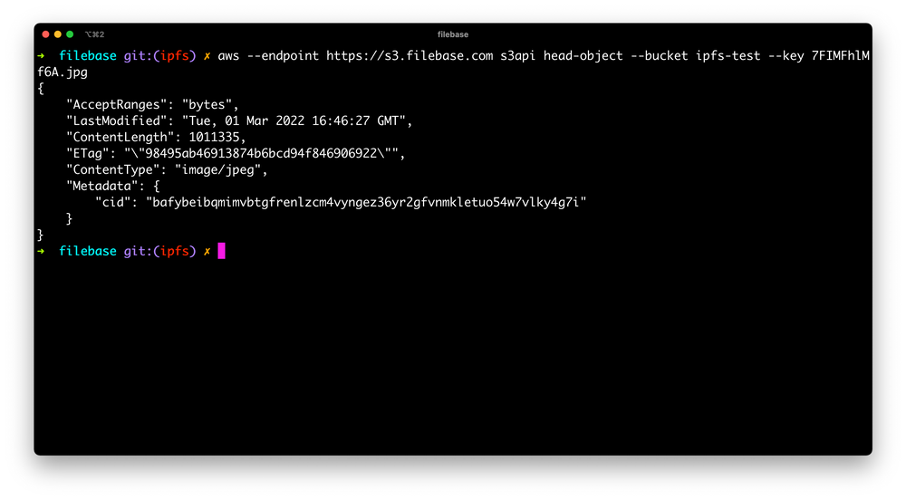	

## 通过兼容 S3 的 API 将文件夹上传到 IPFS
CAR 文件是一种包含多个文件的压缩存档文件，类似于 ZIP 文件。CAR 文件由 FileCoin 和 IPFS 网络使用，它们利用元数据字段将每个文件的 IPFS CID 包含在存档中。

Filebase 支持使用 S3 兼容 API 通过 PutObject 或 MultipartUpload 方法将 CAR 文件上传到 IPFS。

有关创建 CAR 文件的信息，请查看我们的[指南](https://docs.filebase.com/configurations/cli-tools-and-resources/cli-tools/ipfs-car)。

上传 CAR 文件时，您可以随  `x-amz-meta-import:car` 请求一起传递 S3 元数据标头。Filebase 然后将文件作为 CAR 导入，并返回生成的 CID。

下面是一个使用 AWS CLI 的示例，它会自动添加 `x-amz-meta` 前缀：

	aws --endpoint https://s3.filebase.com s3 cp pictures.car s3://ipfs-test --debug --metadata 'import=car'
使用指定的 `–debug` 标志，显示响应标头，揭示 CID：

	2022-06-14 19:51:41,400 - ThreadPoolExecutor-0_2 - botocore.parsers - DEBUG - Response headers:
	
	{
	'Date': 'Tue, 14 Jun 2022 23:51:41 GMT',
	'Content-Type': 'application/xml'
	'Transfer-Encoding': 'chunked',
	'Connection': 'keep-alive',
	'x-amz-meta-cid': 'bafybeieurpeyzighqrvwjqyj3szuvbqvrbijm7cdair5a422ipf2d5qnlq',
	'ETag': 'W/"d8cad258a3d9bbe03a26a13a3ec43b21"',
	'x-amz-request-id': '144e0415-8162-45cd-b071-e51dada956ae',
	'x-amz-id-2': 'ZmlsZWJhc2UtNmQ3ZjQ5OGZmZC14ejk1Mg==',
	'Server': 'Filebase'
	
	}

## 使用 IPFS CLI
1. 首先下载并安装 [GO-IPFS CLI](https://docs.ipfs.io/install/command-line/#official-distributions) 工具。
2. 接下来使用以下命令将 Filebase 添加为固定服务：

		ipfs pin remote service add Filebase https://api.filebase.io/v1/ipfs SECRET-ACCESS-TOKEN
	如果您打算使用多个存储桶，则需要使用每个存储桶的秘密访问 Token 重复此命令。在此工作流程中，昵称应为 Filebase (Bucket-Name) 以标识不同的存储桶。

替换以下值以匹配您的配置：

1. `SECRET-ACCESS-TOKEN`

	导航到，然后查看 IPFS PInning 服务 API 端点。单击  “选择存储桶以生成 Token” 的下拉菜单，然后选择您要使用的 IPFS Filebase 存储桶。
	
	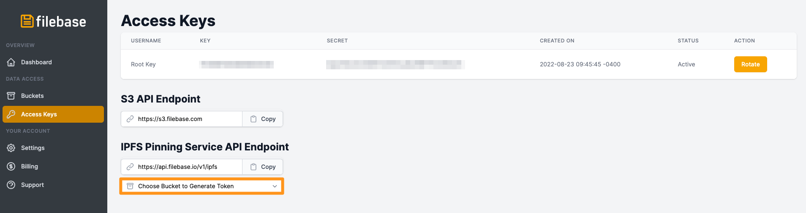	
2. 然后复制生成的 Secret Access Token

	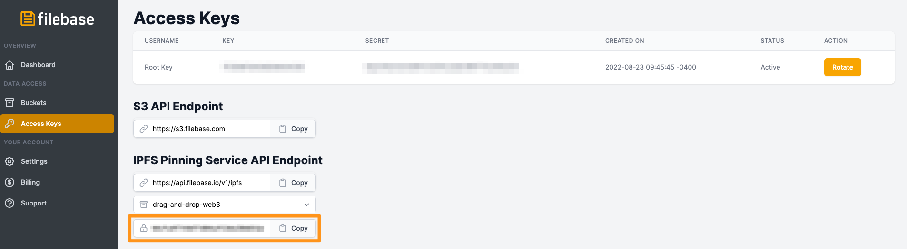
3. 使用以下命令将现有 IPFS CID 固定到 Filebase：

		ipfs pin remote add --service=Filebase --name=ASSET-NAME IPFS-CID
	将 `ASSET-NAME` 替换为您希望与固定 CID 相关联的人类可读值并将 IPFS-CID 替换为您的 IPFS 资产的 CID。这可以是文件或文件夹。
	
		ipfs pin remote add --service=Filebase --name=my-nft-collection bafybeif5x2gihgepga2vtjlx3lfdwgxquo2sbv4a77rsedokf6poqrrcse
4. 导航到控制台，然后选择您之前用于生成秘密访问 token 的存储桶，您将看到固定的 IPFS 资产，这将显示状态 “固定”，这意味着它正在被固定通过 Filebase 到 IPFS。完成后，这将显示为“已固定”。

	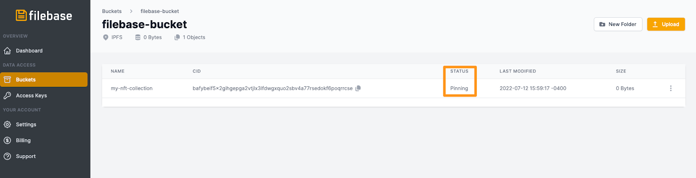
	
	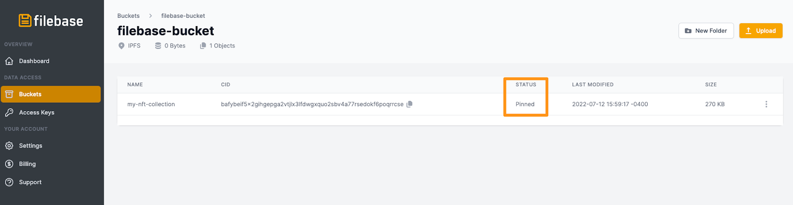
	
	您的终端还将返回以下输出：

		CID: bafybeif5x2gihgepga2vtjlx3lfdwgxquo2sbv4a77rsedokf6poqrrcse
		Name: my-nft-collection
		Status: pinned
		
## Filebase IPFS 固定服务 API
IPFS Pinning Service API 是用于重新固定现有 IPFS CID 的标准化 API。它通常被称为 “远程” 固定或 IPFS“PSA”。IPFS PSA 由 IPFS CLI 和 IPFS 桌面应用程序使用。

IPFS 开发团队跟踪支持 IPFS PSA 的每个提供商的合规性，以验证每个实施。Filebase 完全符合 IPFS PSA 要求。查看官方合规[报告](https://ipfs-shipyard.github.io/pinning-service-compliance/api.filebase.io.html)。

此 [API](https://docs.filebase.com/ipfs/ipfs-pinning#re-pinning-existing-ipfs-cids-from-the-filebase-web-console) 可用于查看固定对象、添加要固定的新对象或删除固定对象。

要与 Filebase IPFS Pinning Service API 交互，请使用以下信息。
### API端点

	https://api.filebase.io/v1/ipfs
### 验证
要使用 IPFS 固定服务 API 进行身份验证，需要使用以下格式在 HTTP 标头中随每个请求一起发送 Token：

	Authorization: Bearer <access-token>
可以通过 [授权 key 页面](https://console.filebase.com/keys) 导航到 `access-token` ，然后查看 IPFS 固定服务 API 端点来生成。单击“选择存储桶以生成 token”的下拉菜单，然后选择您要使用的 IPFS Filebase 存储桶。

然后复制生成的 Secret Access Token：

### 有效载荷
请求正文架构： application/json

要与 IPFS Pinning Service API 交互，您需要将 JSON 形式的有效负载发送到 API URL。以下是 POST 负载的示例：

	{
	  "cid": "bafybeihbfkn5afsjep2jd65gn5vedh7vpvp6i6avfu5za7fnnhsvfutzjy",
	  "name": "image3",
	  "meta": {
	    "key_name": "value_name"
	  }
	}

有关 API 方法的完整列表，请参阅 IPFS 固定服务文档页面：

- [ipfs pinning service api](https://docs.filebase.com/api-documentation/ipfs-pinning-service-api)

## 将适用于 JavaScript 的 AWS S3 开发工具包与 IPFS 结合使用
您还可以使用不同的 AWS S3 SDK 检索 IPFS CID。以下示例使用 JavaScript SDK：

- AWS SDK v2

		const AWS = require('aws-sdk');
		const fs = require('fs');
		
		const s3 = new AWS.S3({
		    endpoint: 'https://s3.filebase.com',
		    region: 'us-east-1',
		    signatureVersion: 'v4',
		});
		
		fs.readFile('image.png', (err, data) => {
		    if (err) {
		        console.error(err);
		        return;
		    }
		    
		    const params = {
		        Bucket: 'my-ipfs-bucket',
		        Key: 'test/image.png',
		        ContentType: 'image/png',
		        Body: data,
		    };
		    
		    const request = s3.putObject(params);
		    request.on('httpHeaders', (statusCode, headers) => {
		        console.log(`CID: ${headers['x-amz-meta-cid']}`);
		    });
		    request.send();
		});

- AWS SDK v3

		const command = new PutObjectCommand({...});
		
		command.middlewareStack.add(
		  (next) => async (args) => {
		    // Check if request is incoming as middleware works both ways
		    const response = await next(args);
		    if (!response.response.statusCode) return response;
		
		    // Get cid from headers
		    const cid = response.response.headers["x-amz-meta-cid"];
		    console.log(cid);
		    return response;
		  },
		  {
		    step: "build",
		    name: "addCidToOutput",
		  },
		);
		
		const res = await client.send(command);

## 共享 IPFS 文件
使用 IPFS，文件共享变得非常容易，因为上传到 IPFS 的所有文件都可以通过其 CID 值公开访问。只要文件通过 Filebase 等 IPFS 固定服务固定，就可以访问它以进行长期文件共享。

1. 首先 [登陆](https://filebase.com/signup) 一个 Filebase 帐户，然后 [登陆](https://console.filebase.com/) Filebase 仪表板。
2. 单击菜单中的“存储桶”选项以打开存储桶仪表板。

	
3. 选择您的 IPFS 存储桶。
4. 单击存储桶名称后，选择右上角的“上传”。您将有三个选择：

	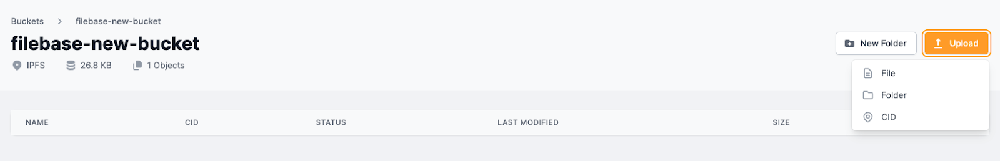
	
	- 文件：文件用于将单个文件上传到 IPFS。这可以是图像、视频、音频、文本或任何其他文件类型。
	- 文件夹：文件夹用于上传包含多个文件的文件夹，例如 NFT 收藏，或者静态网站的文件。
	- CID：CID 代表内容标识符，用于重新固定您可能从另一个固定提供商或本地 IPFS 节点获得的现有 IPFS CID。
5. 要上传单个文件，请选择“文件”，然后在出现提示时选择要上传到 IPFS 的文件。
上传后，确认状态显示为“固定”。

	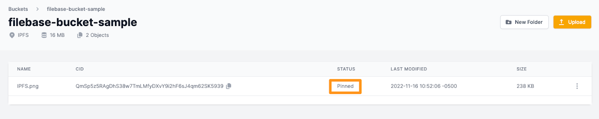
6. 单击文件名以查看文件的详细信息。

	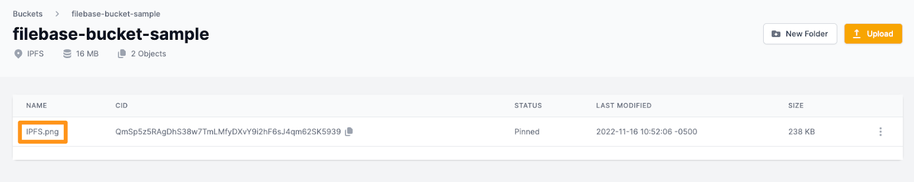

7. 在此屏幕上，您将看到为您的文件列出的两个不同的 
	- URL：它的 Filebase 对象 URL 
	- 和它的 IPFS 网关 URL。

	

如果文件位于公共存储桶中，则对象 URL 只能用于共享文件。否则，此 URL 将返回“拒绝访问”错误消息。

IPFS 网关 URL 可用于使用其 IPFS CID 和 Filebase 公共 IPFS 网关共享文件。世界上任何人都可以访问此 URL，无论存储桶是公共的还是私有的。

## IPFS 专用网关
IPFS 网关是一个 IPFS 对等体，它接受对 IPFS CID 的 HTTP 请求。专用网关为用户提供了一种访问 IPFS 内容的便捷方式，而无需自己运行 IPFS 节点。网关充当用户的 Web 浏览器或应用程序与 IPFS 网络之间的中介，代表用户检索和提供内容。

要深入了解 IPFS 网关及其工作原理，以及在 Filebase 上使用 IPFS 网关的完整演练，请在此处查看我们的文档：

- [ipfs gatewag](https://docs.filebase.com/ipfs/ipfs-gateways)

使用 `付费 IPFS 订阅计划` 的 Filebase 用户可以访问 Filebase IPFS 专用网关。专用网关具有多项优势，例如：

- 提高性能和检索时间
- 通过专用网关访问内容时没有速率限制
- 通过专用网关的范围功能限制网关可以提供的内容（白名单）
- 设置可用于网站或应用程序托管的网关的 Root CID

### 创建网关
导航到 [网关](https://console.filebase.com/gateways) Filebase Web 控制台上的选择右上角的“创建网关”按钮。

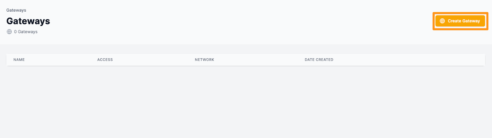
### Public、Private 和 Scoped 之间有什么区别？
- 公共

	网关可以为任何公共 CID 提供服务，即使是那些没有被 Filebase 固定的。公共网关非常适合广泛的数据访问，但可能会产生更高的带宽使用费。
- 私有

	网关只能为 Filebase 固定的 CID 提供服务。私有网关不限于用户已上传到其 Filebase 帐户的 CID - Filebase 固定的任何内容都可以通过私有网关提供服务。
- 作用域

	网关绑定到一个桶，只能提供来自该特定桶的内容。未存储在指定存储桶中的内容的任何 CID 都将返回 404 Not Found 消息。范围网关非常适合将内容列入白名单和控制网关使用。
	
### “带宽”是什么意思？
带宽是指显示或下载您或您的用户通过专用网关访问的内容所需的数据量。无论是图像、视频、音频还是任何其他类型的文件，构成内容的数据都会从 IPFS 节点传输到您的设备，而这些数据的数量决定了带宽。

Filebase 仅对传出数据传输（出口）的带宽收费。上传带宽（入口）始终免费。
### 如何使用网关
- IPFS 专用网关可用于以与公共网关相同的方式检索和访问 IPFS 内容，例如使用以下格式：

		https://my-gateway.myfilebase.com/ipfs/IPFS_CID
- IPFS 专用网关也可用于通过设置将由网关提供服务的根 CID 来服务特定 CID，而无需在 URL 中指定 CID。
	1. 要配置它，请导航到 [桶](https://console.filebase.com/buckets) 菜单，然后选择一个 IPFS 存储桶。进入存储桶后，通过选择右侧的三个菜单点来选择要设置为根文件的文件。
	
		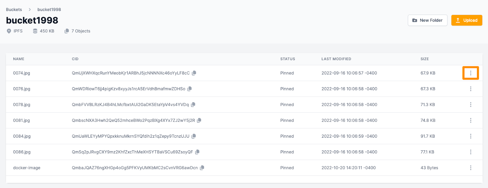
	2.  选择“设置为根”。

		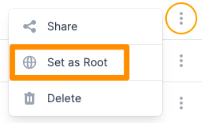
	3. 然后选择您要使用的专用网关。

		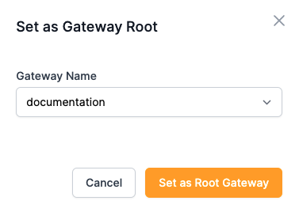
	4. 现在，当您打开网关时，您将看到您设置为根文件的文件，而不是默认的错误消息。

		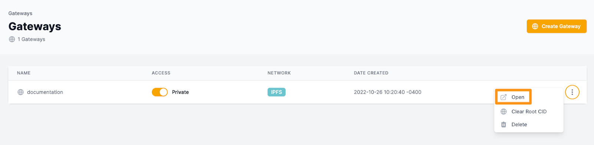
		
		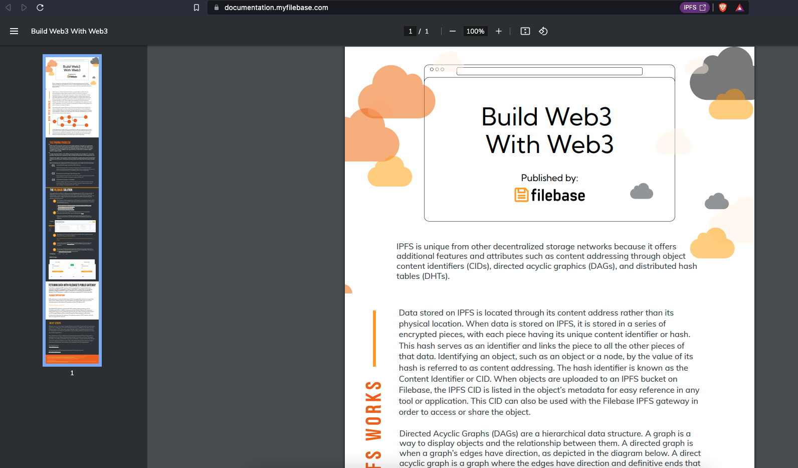

### 在哪里可以使用 IPFS 专用网关 URL？
IPFS 专用网关 URL 可用于代替任何 IPFS 本机 URL（`ipfs://`）或任何 IPFS 公共网关 URL（例如 `https://ipfs.io/ipfs`）。这意味着专用网关可用于以下工作流程：

- 托管照片、视频、文档、证书或其他数字文件等数字资产。
- 引用元数据文件或智能合约中的 NFT 资产。
- 共享文件和文件夹。
- 托管去中心化应用程序。
- 托管静态网站。
- 共享代码库或软件包。
- 共享电子书、PDF 或视频等公共资源。

### IPFS 工具
了解如何将以下 IPFS 工具与 Filebase 一起使用：

- [filebase-npm-package](https://docs.filebase.com/code-development-+-sdks/code-development/filebase-npm-package)
- [ipfs-cli](https://docs.filebase.com/ipfs/ipfs-cli)
- [ipfs-car](https://docs.filebase.com/third-party-tools-and-clients/cli-tools/ipfs-car)
- [ipfs-desktop](https://docs.filebase.com/ipfs/ipfs-desktop)
- [ipfs-pin-sync](https://docs.filebase.com/ipfs/ipfs-pin-sync)
- [ipfscrape](https://docs.filebase.com/third-party-tools-and-clients/cli-tools/ipfscrape)
- [ipget](https://docs.filebase.com/third-party-tools-and-clients/cli-tools/ipget)

### IPFS 教程
在以下教程指南中了解如何使用 IPFS：

- [pinning-docker-images-to-ipfs](https://docs.filebase.com/third-party-tools-and-clients/cli-tools/pinning-docker-images-to-ipfs)
- [pinning-encrypted-files-to-ipfs](https://docs.filebase.com/third-party-tools-and-clients/cli-tools/pinning-encrypted-files-to-ipfs)
- [create-ipfs-app](https://docs.filebase.com/web3-education/web3-tutorials/create-ipfs-app)
- [hosting-a-form-on-ipfs](https://docs.filebase.com/web3-education/web3-tutorials/hosting-a-form-on-ipfs)

对于我们展示 IPFS 的所有 Web3 教程，请参阅我们的 Web3 教程部分：

- [web3 教程](https://docs.filebase.com/web3-education/web3-tutorials)

### 进一步阅读
- [IPFS文档](https://docs.ipfs.io/)
- [IPFS博客](https://blog.ipfs.io/)