# S3 API 入门指南
	本指南介绍了使用 Filebase S3 兼容 API 的常见任务。
## 什么是 API？
应用程序编程接口或 API 是一种软件技术，它允许两个应用程序相互通信和交互。

当应用程序连接到 Internet 时，它会向服务器发送数据请求。服务器接收请求，检索请求的数据，然后将其发送回应用程序。当应用程序接收到数据时，它会对其进行解释并在应用程序中以可读格式呈现给您阅读。

考虑 API 的另一种方法是使用真实示例。如果您在餐厅吃晚饭，您可以从菜单中选择菜肴。此菜单充当您的应用程序。当服务员接受您的订单时，服务员充当信使或 API，并将您的订单转发给厨房。充当数据服务器的厨房接收您的订单，进行准备，然后将其交还给您的服务员，让其为您端出。当服务员给你送回食物时，这是 API 将数据请求带回给你。

现代 API 具有通用特性和属性，这使得它们不仅可以广泛使用和转移，而且对开发人员和最终用户很有价值。

其中一些特征包括遵守 HTTP 和 REST 等通用标准，使它们对开发人员友好并得到广泛理解。API 还具有强大的标准化和治理纪律，使其具有可扩展性和高性能。
## 入门
可以通过位于的控制台 Web 界面使用 Filebase 。找到有关使用 Web 界面的[入门指南](https://docs.filebase.com/getting-started/getting-started-guide)。

虽然 Web 界面对于查看和轮换 Filebase 访问密钥或更新账单信息等功能是必需的，但大多数与 Filebase 平台的交互都可以通过 API 请求执行。

本指南将涵盖与 Filebase S3 兼容的 API 以及用于与 Filebase API 交互的常用工具。
## 注册 Filebase
Filebase 使用基于 Web 的控制台，可在 [https://filebase.com/signup](https://filebase.com/signup)

现有帐户可以直接访问。

1. 要注册 Filebase 帐户，请导航至 [https://filebase.com/](https://filebase.com/)。要创建新帐户，请单击网页右上角的“免费试用”按钮。

	
2. 接下来，填写表格的字段，包括电子邮件地址和密码，并同意 Filebase 条款以创建您的帐户。

		注意：临时电子邮件地址不能用于创建 Filebase 帐户。
3. 您将收到一封包含确认说明的电子邮件。单击电子邮件中包含的链接以确认您的帐户并完成注册过程。
4. 完成这些步骤后，您的 Filebase 帐户就创建好了。

## 访问密钥
要使用与 Filebase S3 兼容的 API，您需要拥有 Filebase Access 和 Secret 密钥对才能提交 API 请求。

要查看您的 Filebase 帐户的访问密钥，首先单击菜单中的“访问密钥”选项以打开访问密钥仪表板。

您可以在此处查看您帐户的访问密钥。每个访问密钥都有两部分，密钥和与密钥关联的秘密。访问密钥仪表板还将提供诸如创建访问密钥的时间和日期及其当前状态等信息。

	
要使用访问密钥，您需要同时拥有密钥和与该密钥关联的秘密。

## API端点
与 Filebase S3 兼容的 API 端点是 [https://s3.filebase.com/](https://s3.filebase.com/)。

此端点可与 S3 兼容工具、SDK 或框架一起使用，以与 Filebase 平台进行通信。
## 验证
Filebase S3 兼容 API 仅支持 AWS v4 签名（AWS4-HMAC-SHA256）进行身份验证，不支持 AWS v2 签名。
## HTTPS 协议
Filebase 维护严格的 HTTPS-only 标准。这意味着对象和 API 调用仅通过 HTTPS 提供。此连接的端口是 HTTPS 标准端口 443 。

目前无法禁用此功能。通过 HTTP 协议发送的请求将被重定向到 HTTPS。
## 支持的 API 方法
下面的列表记录了 Filebase 当前支持的 S3 API 方法。

- CopyObject（暂时禁用）

	用于创建现有对象的副本，当前暂停
- 桶相关
	- 创建桶
	
		创建一个新的存储桶。默认情况下，是 IPFS 网络创建
	- 删除桶
	
		从库中制定删除的桶。桶必须是空的才可以被清除
	- 头桶

		用于判断指定的桶是否存在
	- 列表桶

		列出账户中所有的桶
	- 策略
		- 桶 Cors 
			- GetBucketCors
	
				返回指定桶的当前 CORS 策略 	
			- 删除 BucketCors
			
				删除在指定存储桶上设置当前 CORS 策略
			- PutBucketCors

				用于在指定的桶上配置 CORS 策略	
		- 桶 Acl
			- 获取 BucketAcl
		
				返回指定桶的当前配置的访问控制列表
			- PutBucketAcl

				用于配制指定桶的访问控制列表权限
	- 生命周期
		- 获取桶生命周期

			返回指定桶的当前生命周期配置
		- 获取桶生命周期配置
		
			返回指定桶的当前生命周期配置
	- 获取桶位置
	
		返回指定桶的区域
	- 获取桶日志
	
		获取桶的当前日志记录状态
	- GetBucketVersioning
	
		返回指定存储桶的当前控制版本状态	 	
- 对象操作
	- 获取对象
	
		从桶中检索指定的对象				
	- Put对象

		用于上传一个对象到指定桶
	- 大文件(对象)上传
		- 创建分段上传
	
			启动分段上传，返回一个唯一的上传 ID，此 ID 用于表示分段上传的所有部分
		- 上传部分
	
			用于使用上传的唯一 ID 值，从分段上传中上传一个部分
		- 完整的多部分上传
		
			通过组装先前上传的部分来完成启动分段上传。
		- 中止多部分上传
		
			取消分段上传，中止后，上传将被取消，并且无法使用原始上传 ID 上传其他部分。在取消之前，上传的任何部分都将被删除
	- 删除对象
	
		从存储在桶中删除对象
	
	- 头部对象

		用于判断指定的对象是否存在
	- 列表对象
	
		列出指定存储桶中所有的对象，最多返回 1000 个
	- 列表对象V2
	
		列出指定存储桶中所有当前对象。最多1000个返回。新版本的列表对象，推荐用于新的工作流
	- 对象 ACL
		- 获取对象访问控制
	
			检索指定对象的当前访问控制列表配置
		- PutObjectAcl
		
			用于配制指定对象的访问控制列表权限

当存在响应负载时，所有响应都使用 UTF-8 编码的 XML 返回。

## 预签名 URL
Filebase S3 兼容 API 支持用于下载和上传对象的预签名 URL。可以通过多种方式生成预签名 URL，包括 AWS CLI 和 AWS 开发工具包。
有关预签名 URLS 的更多信息，请查看我们的[指南](https://docs.filebase.com/cli-resources/create-and-use-pre-signed-urls-with-filebase)。
## 访问控制列表 (ACL)
Filebase S3 兼容 API 对访问控制列表 (ACL) 提供有限支持。当前不支持对象级 ACL 。

GetObjectAcl 和 GetBucketAcl 方法将按预期工作，但 GetObjectAcl 响应将返回包含对象的存储桶的 ACL 。

这种设计消除了用户不小心将私有存储桶中的对象公开的可能性。如果您的工作流程需要混合使用私有对象和公共对象，您将需要创建两个不同的存储桶。
## 跨源资源共享 (CORS)
跨源资源共享 (CORS) 为位于一个域的客户端 Web 应用程序创建了一种方式，使其能够与位于不同域的资源进行交互。借助 CORS，网站和应用程序可以访问存储在 Filebase 存储桶上的文件和资源。

Filebase S3 兼容 API 支持存储桶的 CORS 配置。

支持以下 API 方法：

- GetBucketCors
- PutBucketCors
- DeleteBucketCors

要配置 Filebase 存储桶以允许跨域请求，您需要创建一个 CORS 规则。此规则标识您将允许访问您的存储桶的来源、每个来源将支持的 HTTP 方法以及其他特定于操作的信息。

此规则可以是 JSON 或 XML 文件，但如果使用 AWS CLI 应用此规则，则需要 .json 文件。

- 示例 #1 JSON：

	此示例是一个通配符规则，允许来自所有来源的跨域 GET 请求。

		{
		"CORSRules":[
		    {
		        "AllowedHeaders": [],
		        "AllowedMethods": [
		            "GET"
		        ],
		        "AllowedOrigins": [
		            "*"
		        ],
		        "ExposeHeaders": []
		    }
		    ]
		}
- 示例 #1 XML：

		<CORSConfiguration>
		    <CORSRule>
		        <AllowedOrigin>*</AllowedOrigin>
		        <AllowedMethod>GET</AllowedMethod>
		    </CORSRule>
		</CORSConfiguration>

CORS 还允许可选的配置参数，如以下 CORS 规则所示。

- MaxAgeSeconds 

	指定浏览器缓存对指定资源的预检 OPTIONS 请求的响应的时间量（以秒为单位）。
- ExposeHeader

	标识客户能够从其应用程序访问的响应标头。在此示例中，x-amz-server-side-encryption、x-amz-request-id 和 x-amz-id-2。

- 示例 #2 JSON：
	在第二个示例中，CORS规则
	
	- 允许来自 `http://www.example.com` 源的跨源 PUT、POST 和 DELETE 请求
	- `maxagesecseconds` 为3000
	- `x-amz-server-side-encryption、x-amz-request-id` 和 `x-amz-id-2` 的 `ExposeHeaders`。

			{
			"CORSRules": [
			    {
			        "AllowedHeaders": [
			            "*"
			        ],
			        "AllowedMethods": [
			            "PUT",
			            "POST",
			            "DELETE"
			        ],
			        "AllowedOrigins": [
			            "http://www.example.com"
			        ],
			        "ExposeHeaders": [
			            "x-amz-server-side-encryption",
			            "x-amz-request-id",
			            "x-amz-id-2"
			        ],
			        "MaxAgeSeconds": 3000
			    }
			    ]
			}
- 示例 #2XML：

		<CORSConfiguration>
		<CORSRule>
		<AllowedOrigin>http://www.example.com</AllowedOrigin>
		<AllowedMethod>PUT</AllowedMethod>
		<AllowedMethod>POST</AllowedMethod>
		<AllowedMethod>DELETE</AllowedMethod>
		<AllowedHeader>*</AllowedHeader>
		<MaxAgeSeconds>3000</MaxAgeSeconds>
		<ExposeHeader>x-amz-server-side-encryption</ExposeHeader>
		<ExposeHeader>x-amz-request-id</ExposeHeader>
		<ExposeHeader>x-amz-id-2</ExposeHeader>
		</CORSRule>
		</CORSConfiguration>

### 将 CORS 规则应用于 Filebase 存储桶
要应用 CORS 规则，您可以使用 AWS CLI 等工具来应用您创建的包含该规则的 .json 文件。有关如何配置 AWS CLI 的信息，请参阅[这里](https://docs.filebase.com/third-party-tools-and-clients/cli-tools/aws-cli)。

在命令行中，输入以下命令以将 CORS 规则应用于预期的 Filebase 存储桶：

	aws --endpoint https://s3.filebase.com s3api put-bucket-cors --bucket bucket-name --cors-configuration=file://corspolicy.json
### 测试 CORS 配置
您可以使用以下命令确认存储桶的 CORS 配置已成功应用：

	aws --endpoint https://s3.filebase.com s3api get-bucket-cors --bucket bucket-name
## 使用 API
有多种方式可以与 Filebase S3 兼容的 API 进行交互和使用。本指南将提供一些常见示例，尽管支持的工具、框架和 SDK 种类繁多。有关我们工具文档的完整列表，请参阅 [https://docs.filebase.com/](https://docs.filebase.com/)。
### Postman
Postman 是一个用于构建、开发和使用 API 的 API 平台。

要将 Postman 与 Filebase 一起使用，您需要一个[postman](https://www.postman.com/)帐户，拥有您的 Filebase 访问权限和密钥，并创建一个 Filebase 存储桶。

- 首先，登录您的 Postman 帐户。

	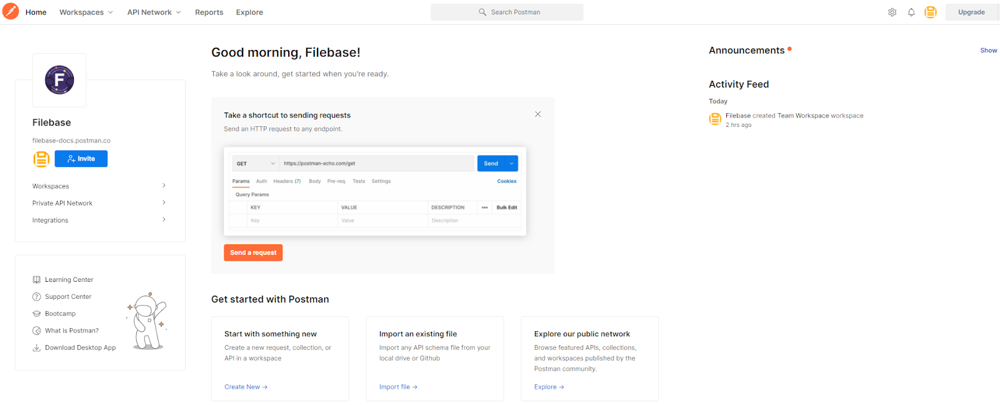	
- 从顶部菜单导航栏中选择“工作区”，然后选择一个现有工作区或创建一个新工作区。

	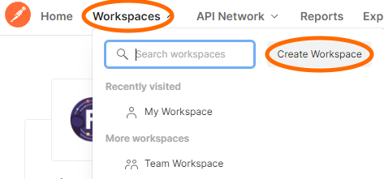	
- 如果创建一个新工作区，请输入所需的设置。

	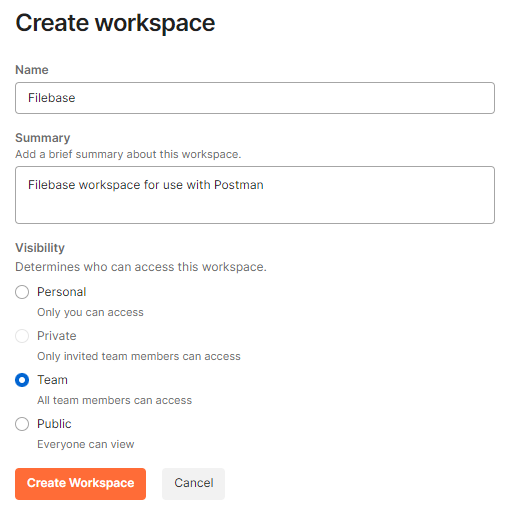	
- 在您的工作区中，选择左侧导航栏上的“收藏”选项卡，然后选择“新建”。

	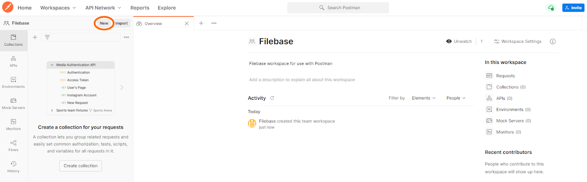	
- 选择“HTTP 请求”

	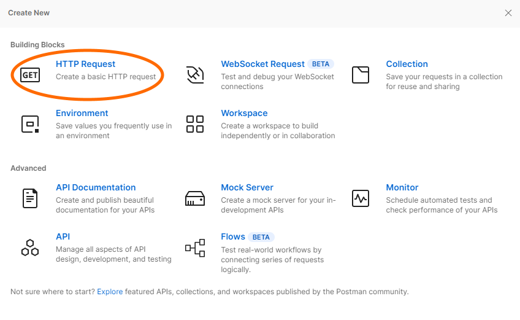	
- 配置 HTTP 请求的设置。选择“GET”HTTP 请求类型，然后选择您的 Filebase 存储桶的 URL。

	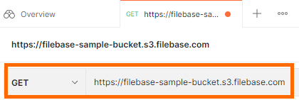	
- Filebase 存储桶的 URL 格式如下，其中“bucket-name”是您的 Filebase 存储桶的名称：

		https://bucket-name.s3.filebase.com
- 然后，选择授权选项卡。配置以下参数

	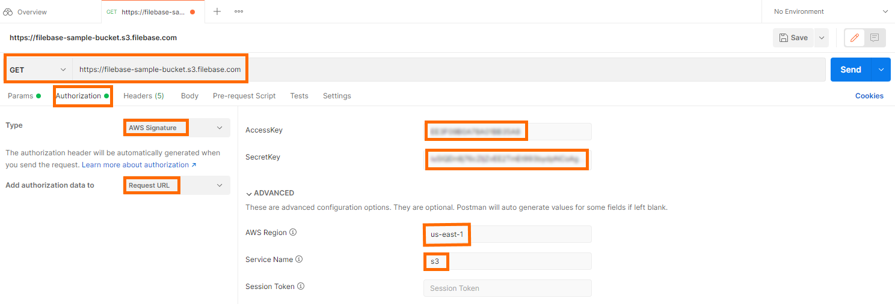	

	- Type AWS 签名
	- Add Authorization Data To 将授权数据添加到请求 URL
	- Access Key 您的Filebase访问密钥
	- Secret Key 您的Filebase密钥
	- AWS Region：us-east-1
	- Service Name：s3
	- Session Token：不需要，仅在使用临时凭证时才需要。
- 选择蓝色的“发送”按钮来测试您的配置。您应该会收到一个 XML 格式的响应，其中列出了存储桶内容和元数据。
	
	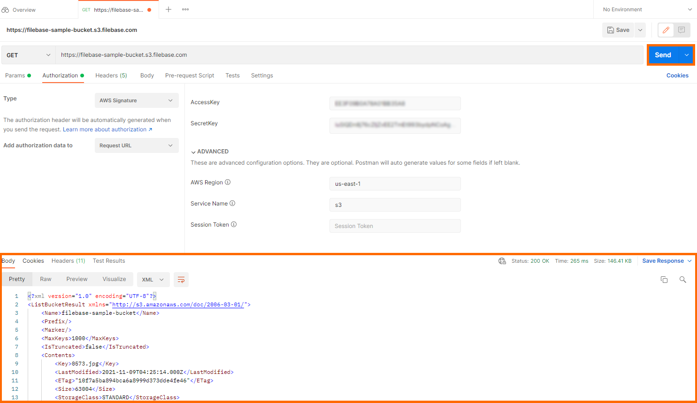	
	
### S3命令行
S3cmd 是用于 Linux 和 Mac OSx 的命令行 S3 客户端和备份。

- 要使用 [S3cmd](https://s3tools.org/s3cmd%E2%80%8B)
- 请下载该应用程序并拥有您的 Filebase 访问权限和密钥。
- 配置 S3cmd，请运行以下命令：

		s3cmd --configure
	系统将提示您填写以下信息：

	- Access Key 您的Filebase访问密钥
	- Secret Key 您的Filebase密钥
	- Default Region：us-east-1
	- S3 Endpoint： [s3.filebase.com](http://s3.filebase.com/)
	- Bucket Name：Filebase 存储桶名称
	- Encryption Password：唯一密码
	- Path to GPG Program：如果存储在默认系统位置，请按 enter 键确认。
	- Use HTTPS Protocol：yes
	- HTTP Proxy Server Name：输入绕过

	您将看到这些设置的摘要，并提示您使用这些设置测试对 Filebase 的访问。测试完成后，系统将提示您保存设置。然后您就可以开始使用 S3cmd 了。
- 您可以将 S3cmd 与如下命令一起使用：
	- 对桶操作 
		- Make bucket
		
				s3cmd mb s3://BUCKET
		- Remove bucket
		
				s3cmd rb s3://BUCKET
		- List objects or buckets
		
				s3cmd ls [s3://BUCKET[/PREFIX]]
		- List all objects in all buckets
		
				s3cmd la
		- Disk usage by buckets
		
				s3cmd du [s3://BUCKET[/PREFIX]]
		- Get various information about Buckets or Files
		
				s3cmd info s3://BUCKET[/OBJECT]
	- 对桶中对象操作
		- List objects or buckets
		
				s3cmd ls [s3://BUCKET[/PREFIX]]
		- List all objects in all buckets
		
				s3cmd la			
		- Put file into bucket
		
				s3cmd put FILE [FILE...] s3://BUCKET[/PREFIX]
		- Get file from bucket
		
				s3cmd get s3://BUCKET/OBJECT LOCAL_FILE
		- Delete file from bucket
		
				s3cmd del s3://BUCKET/OBJECT
		- Copy object
	
				s3cmd cp s3://BUCKET1/OBJECT1 s3://BUCKET2[/OBJECT2]
		- Move object
		
				s3cmd mv s3://BUCKET1/OBJECT1 s3://BUCKET2[/OBJECT2]
	- 其他操作			
		- Synchronize a directory tree to S3
		
				s3cmd sync LOCAL_DIR s3://BUCKET[/PREFIX] or s3://BUCKET[/PREFIX] LOCAL_DIR

### Cyberduck
Cyber​​Duck 是一款适用于 Windows 和 Mac OSX 的免费云存储浏览器，支持 Filebase、FTP、SFTP 和其他云存储服务。
要将 Cyber​​Duck 与 Filebase S3 兼容的 API 一起使用，[下载和安装](https://cyberduck.io/download/)，拥有您的 Filebase 访问权限和密钥，并创建一个 Filebase 存储桶。

- 要设置 Cyber​​Duck，首先要 [在赛博鸭里设置](https://cyberduck.s3.filebase.com/Filebase.cyberduckprofile)。
- 然后打开 Cyber​​Duck 的 Filebase 配置文件。您将看到以下窗口：

	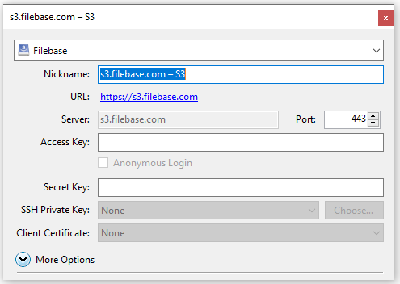

	- 服务器名称和 URL 是预先配置的
	- 需要提供您的 Filebase S3 API 访问密钥和 S3 密钥,它们位于下的 Filebase Web 控制台中。
- 输入您的凭据后，关闭配置文件窗口并打开 Cyber​​Duck 浏览器。您应该看到您的 Filebase 连接。

	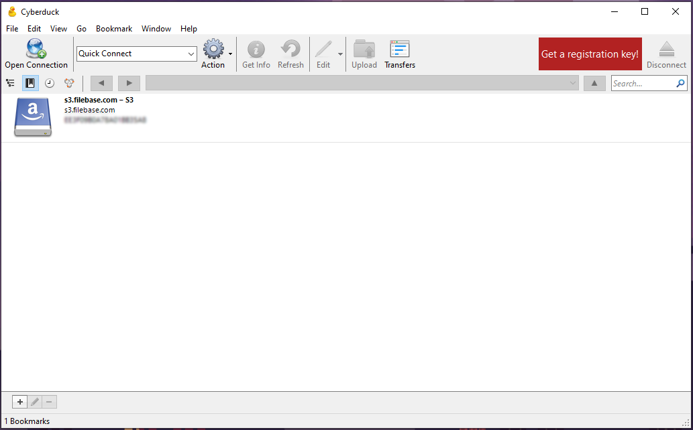
- 双击连接 [http://s3.filebase.com/](http://s3.filebase.com/) 进行连接。然后您应该会看到一个窗口出现，其中列出了您现有的 Filebase 存储桶。

	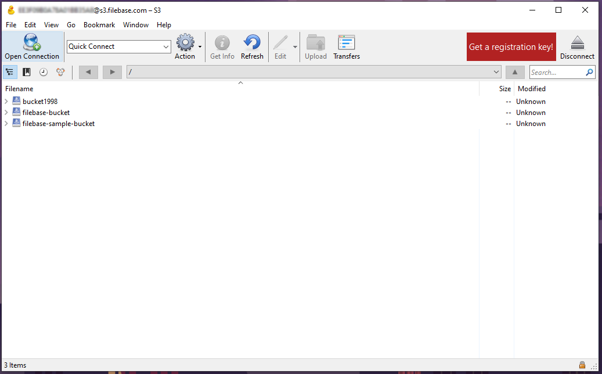
- 双击一个桶打开桶的内容。

	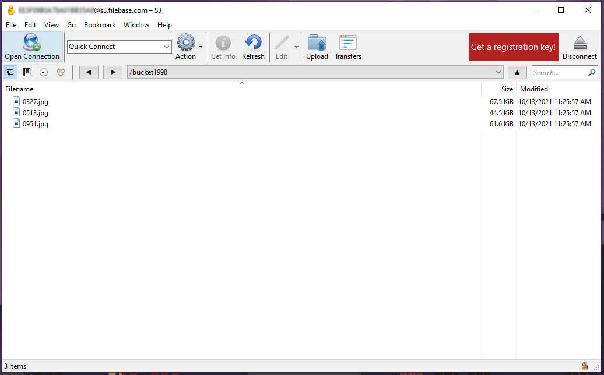
- 在此窗口中，您可以单击并拖动其他窗口中的文件和文件夹，以将其上传到您的 Filebase 存储桶。

	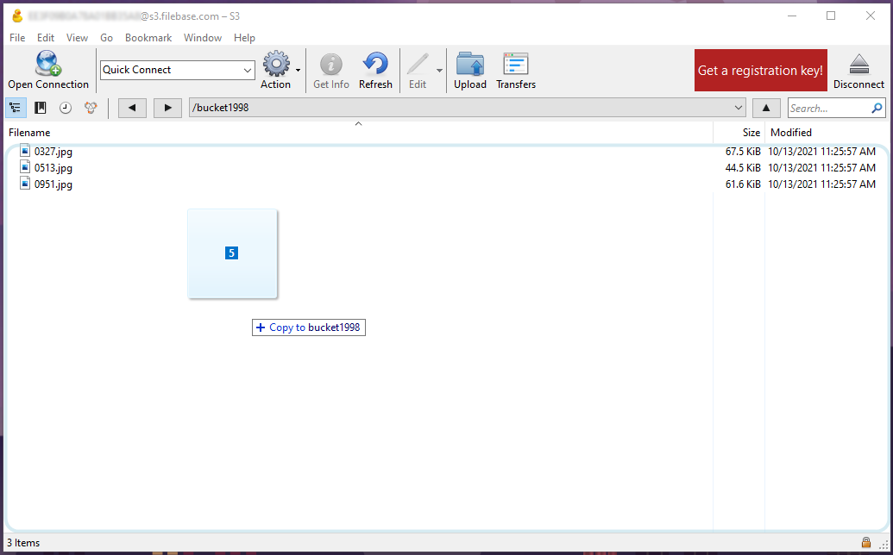
- 您可以通过 Cyber​​Duck Transfer 窗口监控上传进度。

	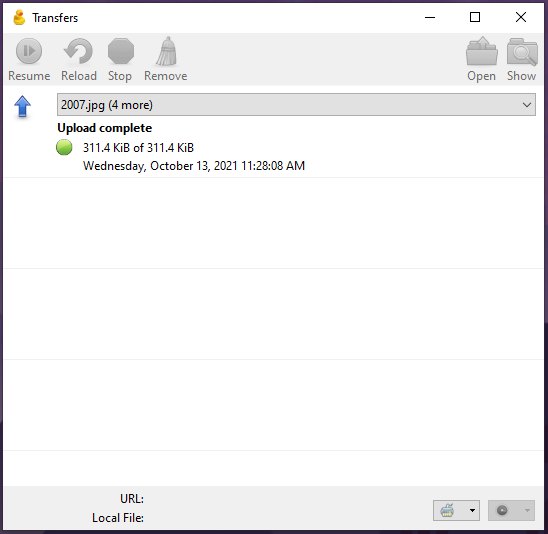
- 确认文件已反映在您的 Filebase 存储桶中。

	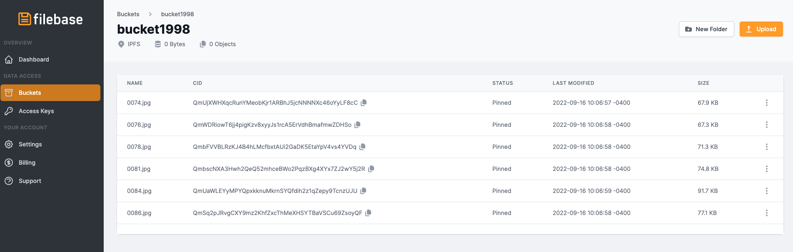

这些工具只是受支持的与 S3 兼容的 API 工具的完整列表中的一小部分。有关我们工具文档的[完整列表](https://docs.filebase.com/)