# Web 控制台入门指南
	本指南介绍了使用 Filebase Web 控制台在 Filebase 上的导航和常见任务。
## 注册 Filebase
Filebase 使用基于 Web 的控制台，可在  [https://filebase.com/signup](https://filebase.com/signup) 找到。

现有帐户可以直接访问 [https://console.filebase.com/](https://console.filebase.com/)。

1. 要注册 Filebase 帐户，请导航至 [https://filebase.com/](https://filebase.com/)。要创建新帐户，请单击网页右上角的“免费试用”按钮。

	
2. 接下来，填写表格的字段，包括电子邮件地址和密码，并同意 Filebase 条款以创建您的帐户。

		注意：临时电子邮件地址不能用于创建 Filebase 帐户。
3. 您将收到一封包含确认说明的电子邮件。单击电子邮件中包含的链接以确认您的帐户并完成注册过程。

		完成这些步骤后，您的 Filebase 帐户就创建好了。
## 登录到 Filebase
1. 要登录您的 Filebase 帐户，请导航至 [https://filebase.com/](https://filebase.com/)。
2. 在网页的右上角，选择“登录”。输入您的电子邮件地址和 Filebase 密码以登录。
3. 登录后，您将被带到 Filebase 仪表板。

	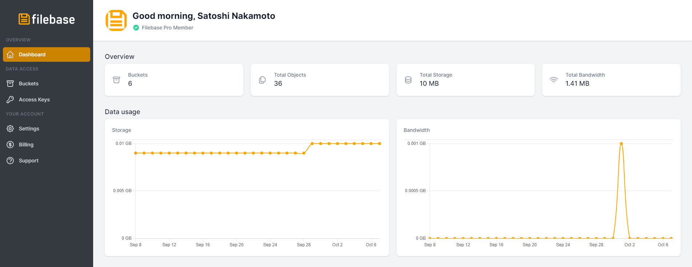

## Filebase 仪表板导航
### 概述
概述提供有关您的 Filebase 帐户的各种统计信息的浓缩视图。其中包括您账户中的

- Buckets总数
- 这些Buckets中的对象总数
- 您的账户使用的存储总量（每小时更新一次）
- 以及您的账户在过去 30 天内消耗的带宽总量

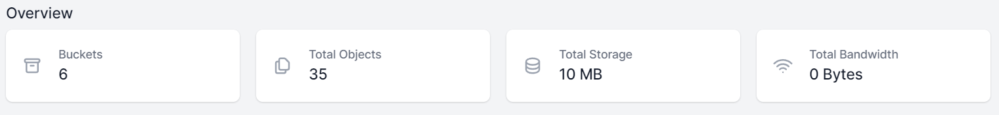

### 数据使用
- 数据使用量

	数据使用量是指您帐户中使用的存储和带宽总量。此处显示的值是每日总计，用于计费目的。通过此数据，您可以分析过去 30 天的总存储使用量和带宽使用量的变化情况。
	
	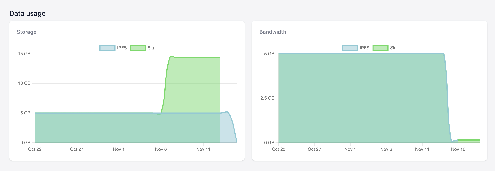

	这些数据图展示了两种不同的存储和带宽用途：
	
	- 一种用于 IPFS 网络
	- 一种用于 Sia 网络

	这蓝色的图表显示您帐户在过去 30 天内的 `IPFS数据存储和带宽使用情况`。
	这绿色的图表显示您帐户过去 30 天的 `Sia数据存储和带宽使用情况`。
- 如何阅读数据使用图表

	要阅读您的数据使用图表，请先确定您要查看哪个网络。

	IPFS 的数据存储和带宽以蓝色显示，而 Sia 的存储和带宽以绿色显示。
	
	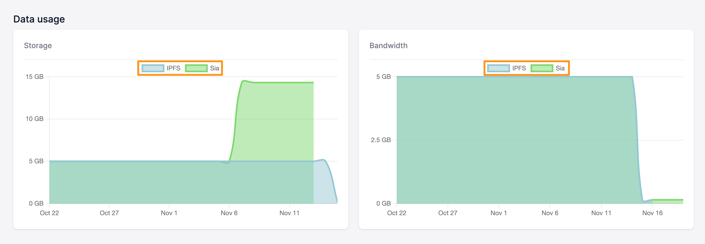

	日期以 5 天为增量显示在图表底部。要查看特定日期的数据使用情况，只需查看存储量或带宽与日期的交集，例如：
	
	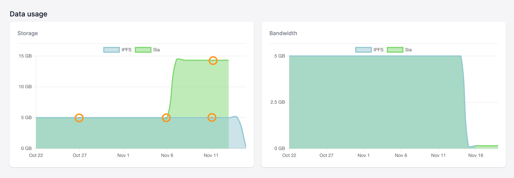
	
	这个例子表明，
	
	- IPFS 和 Sia 网络在 10 月 27 日和 11 月 8 日都有 5GB 的数据存储。
	- 11 月 11 日，IPFS 网络上存储的数据为 5GB，而 Sia 网络上存储的数据约为 14GB。

### 近期活动
最近的活动显示您帐户的活动历史记录，例如登录活动，其中包括登录您帐户的时间和日期以及这些登录来自的​​ IP 地址。

### 菜单导航
屏幕左侧是 Filebase 菜单。该菜单分为三个部分：概览、数据访问和您的帐户。

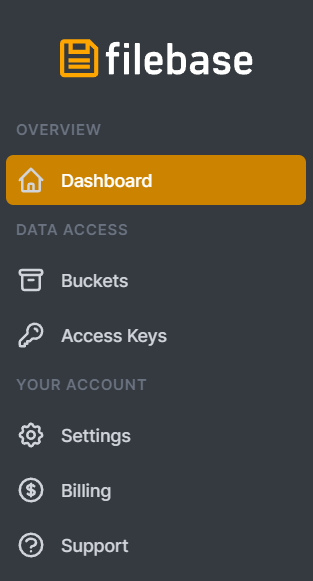

- overview

	包含Filebase仪表板。
- data access

	包含 Buckets 和 Access Keys 部分。
- your account

	包含设置、计费和支持部分。

## 数据访问
### Buckets
Buckets 就像文件夹，它们存储数据和关联的元数据。桶是对象的容器。

Buckets 菜单选项将您带到 Buckets 仪表板。从这里您可以查看现有的 Buckets 并创建新的 Buckets。您还可以通过上传或删除 Buckets 内的对象来管理现有 Buckets 的内容。

	公共 Buckets 不适用于免费帐户。用户需要有一个活跃的 Filebase 高级帐户才能创建和启用公共 Buckets。
### 访问密钥
访问密钥是一对唯一的凭据，用于通过与 Filebase S3 兼容的 API 进行身份验证。通过 SDK、第三方工具、CLI 工具或使用 Filebase S3 兼容 API 的任何其他交互连接到 Filebase 时需要此访问密钥对。

访问密钥菜单选项将您带到访问密钥仪表板。从这里您可以查看、管理和轮换您的访问密钥。

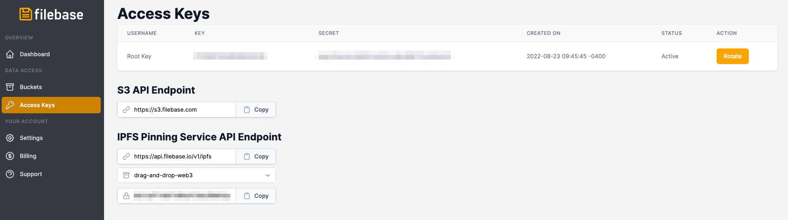

Filebase 当前不支持每个帐户使用多个访问密钥对，但将来会支持此功能。

从这个菜单，用户可以生成一个秘密访问 token ，与 [IPFS pinning servicce API](https://docs.filebase.com/api-documentation/ipfs-pinning-service-api) 一起使用。

要生成此 Token，请单击 “选择 Buckets 以生成 Token”的下拉菜单，然后选择您要使用的 IPFS Filebase Buckets。

	

然后复制生成的 Secret Access Token：

	

## 你的帐户
### 设置
在“设置”菜单选项中，您可以更改在您的 Filebase 帐户上注册的名称，以及更改您的电子邮件地址和密码。
### 计费
从账单菜单选项，您可以更新您的账单信息，包括您的信用卡信息和账单地址。您还可以查看每张发票的账单历史记录和收据。
### 支持
Support 菜单选项打开您的默认电子邮件客户端并将电子邮件收件人地址填充为。如果对您的帐户或 Filebase 有任何问题或疑虑，这是联系 Filebase 团队的最佳方式。
## 计费
### 开始免费试用
创建 Filebase 帐户后，您的帐户将默认为免费用户。Filebase 可供 [所有用户免费使用](https://console.filebase.com/signup)，他们无需信用卡即可在 Filebase 上存储多达 5GB 的数据。5GB 之后，用户将需要升级到我们的订阅模式。
### 升级到付费订阅
1.  访问仪表板的 [计费页面](https://console.filebase.com/billing) 订阅分为 IPFS 网络和 Sia 网络。

- IPFS 定价计划将首先显示

	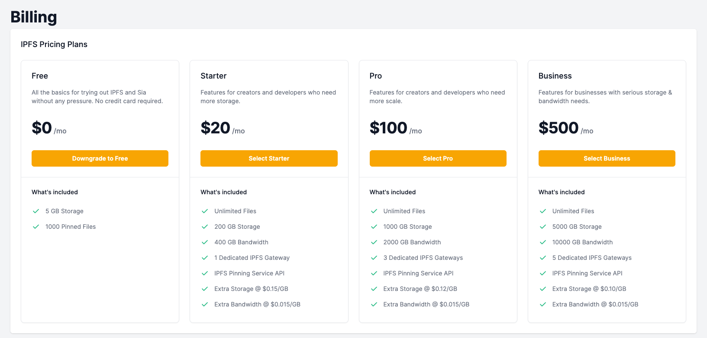
- 然后是 Sia 网络的去中心化存储定价计划。
	
	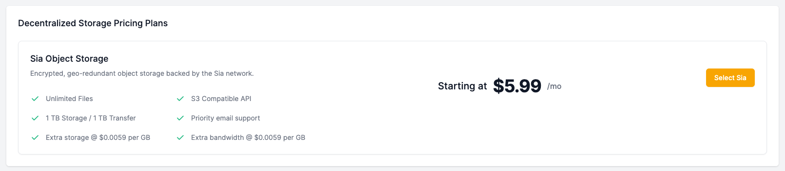	
2. 选择适合您工作流程的订阅计划。有关每个定价计划的详细信息，请参阅我们的：
	- [定价模式](https://docs.filebase.com/getting-started/billing-and-pricing/pricing-model)
3. 选择计划后，您将被重定向到 Stripe 结帐屏幕。输入您的账单信息并通过选择“订阅”确认您的订阅。

	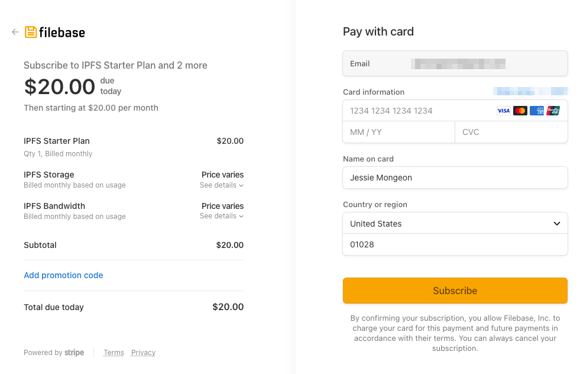	

	Stripe 结帐将详细说明 3 个部分：
	
	- 您的基本订阅计划：在此示例中，使用 IPFS 入门计划。
	- IPFS 存储：这是指使用的任何存储超过所选计划的包含存储。对于 IPFS 入门计划，这是超过 200GB 的任何存储。
	- IPFS 带宽：这是指使用的任何带宽超过所选计划的包含带宽。对于 IPFS 入门计划，这是超过 400GB 的任何带宽。

	有关每个订阅计划包含的价值的详细信息，请参阅我们的[定价模型](https://docs.filebase.com/getting-started/billing-and-pricing/pricing-model)。
4. 订阅后，您当前的付款方式将列在 Web 控制台[计费](https://console.filebase.com/billing)页面的“付款方式”下。

		
### 更改付款方式
1. 访问仪表板的选择您当前列出的付款方式旁边的“编辑”。

	
2. 您将被重定向到 Stripe 网页以输入您的新付款信息。

		
3. 点击“保存卡片”。

### 删除付款方式
添加付款方式后，将无法删除。可以添加新的付款方式来替换现有的付款方式，但是一旦您选择了付费订阅，就必须将付款方式存档。
### 降级订阅
要将您的帐户降级到不同的付费等级，只需选择您想要降级到的等级并通过 Stripe 结账屏幕确认交易。

	
	
	如果您使用的存储或带宽超过了要降级到的层中包含的数量，请注意，如果使用的存储和带宽量超过新订阅层中包含的数量，您将需要支付超额费用。
### 取消付费订阅
取消付费订阅很简单。

- 首先，您的帐户必须使用 5 GB 或更少的空间以适应我们的免费套餐。在您的帐户消耗 5GB 或更少之前，您将无法降级。
- 然后，按照以下 3 个简单步骤操作：
	1. 访问仪表板的[计费页面](https://console.filebase.com/billing)
	2. 选择免费订阅层下的降级为免费按钮。

	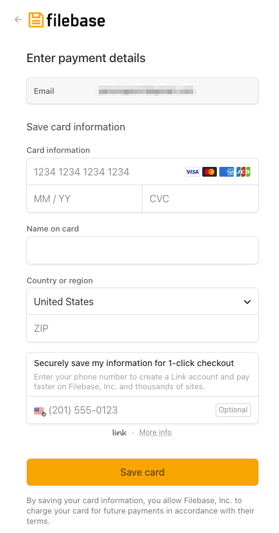	

### 接受的货币
Filebase 目前仅接受美元 (USD) 付款。Filebase 不接受以其他货币或加密货币付款。
## 创建和使用Buckets
### 创建桶
1. 单击菜单中的“Buckets”选项以打开 Buckets 仪表板。

	
2. 进入 Buckets 仪表板后，单击右上角的“Create Bucket”选项创建一个新的 bucket。
3. 输入Buckets名称并选择您的存储网络。

	

		Buckets名称在所有 Filebase 用户中必须是唯一的，长度在 3 到 63 个字符之间，并且只能包含小写字符、数字和破折号。

	Filebase 目前有 4 种不同的去中心化存储网络可供选择：

	- IPFS存储

		在 IPFS 上的文件可通过 IPFS 网关公开访问。推荐用于存储与 Web3 资产相关的数据，例如 NFT、元数据或去中心化网站数据。
	- Sia默认不公开。推荐用于数据隐私。

	每个存储网络都会自动按地理分布您的数据。所有数据在静态和传输时都经过加密。
4. 填写完这些字段后，单击“创建Buckets”。

		默认情况下，Buckets 是私有的。要创建公共 Buckets，您必须是付费用户。

### 清空桶
1. 要清空桶中的所有对象，首先单击菜单中的“桶”选项以打开桶仪表板。

	
2. 进入 Buckets 仪表板后，找到您要清空内容的 bucket，然后单击屏幕右侧的 3 个点以切换 bucket 的选项。
3. 选择“空桶”选项。

		
4. 通过在文本输入字段中使用“永久删除”响应提示来确认您要清空Buckets。

	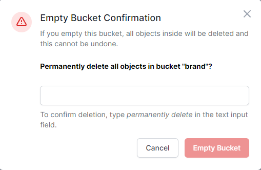	
5. 单击“清空桶”。

### 删除桶
1. 要删除 Buckets，首先单击菜单中的 “Buckets” 选项以打开 Buckets 仪表板。

	
2. 在 Buckets 仪表板中，找到要删除的 bucket，然后单击屏幕右侧的 3 个点以切换 bucket 的选项。
3. 选择“删除”选项。

		
4. 通过使用“确定”选项响应弹出提示，确认您要删除 Buckets。

### 公开或私有 Buckets
可以通过以下格式的 S3 URL 引用和访问公共 Buckets：

[https://bucket-name.s3.filebase.com/](https://bucket-name.s3.filebase.com/)

无法通过此 S3 URL 公开访问私有 Buckets。要访问存储在私有Buckets中的内容，需要[预签名 URL](https://docs.filebase.com/api-documentation/pre-signed-urls)

存储在 IPFS Buckets 中的所有文件，即使 Buckets 是私有的，也可以通过 IPFS CID 和 IPFS 网关公开访问。

默认情况下，所有Buckets都是私有的。

公共Buckets功能仅适用于付费订阅用户。

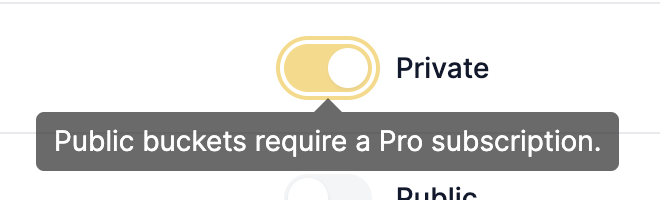	

	公共 Buckets 不适用于免费帐户。用户需要有一个有效的 Filebase 订阅才能创建和启用公共 Buckets。
1. 要切换Buckets的隐私，首先单击菜单中的“Buckets”选项以打开Buckets仪表板。

	
2. 在 Buckets 仪表板中，您帐户中的每个Buckets都将列出信息，包括Buckets名称、访问权限、存储网络和创建日期。访问下方是一个橙色切换图标，用于在每个Buckets的私人和公共可访问性之间切换。

	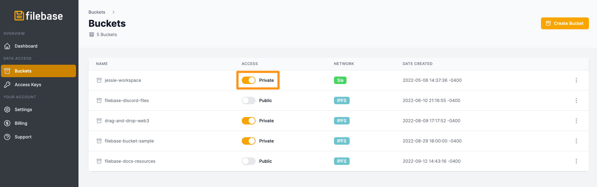	

	默认情况下，所有 Buckets 都是私有的。公共 Buckets 功能仅适用于付费订阅用户。存储在 IPFS Buckets 中的所有文件，即使 Buckets 是私有的，也可以公开访问。IPFS 文件可通过 IPFS CID 和 IPFS 网关获得。
3. 单击切换图标以切换公共或私人访问。

	可以通过以下格式的 URL 引用和访问 Buckets（如果是公共的）：

		https://bucket-name.s3.filebase.com

### 上传对象到桶
1. 要将对象上传到 Buckets，首先单击菜单中的 “Buckets” 选项以打开 Buckets 仪表板。

	
2. 单击要将对象上传到的Buckets名称。
3. 点击桶名后，会看到当前桶中的所有对象。要将更多对象上传到Buckets，请单击右上角的“上传”按钮。

	
4. 选择要上传到Buckets的文件

### 通过 Filebase 将文件固定到 IPFS
1. 首先单击菜单中的“Buckets”选项以打开 Buckets 仪表板。

	
2. 选择您的 IPFS Buckets。  
3. 单击 Buckets 名称后，您将看到任何以前上传的文件。要上传另一个文件，请选择“上传”，然后从选项中选择“文件”。

	
4. 选择要上传到 IPFS 的文件。
5. 上传后，您将能够从 “CID” 类别中查看和复制 IPFS CID，如下所示。

	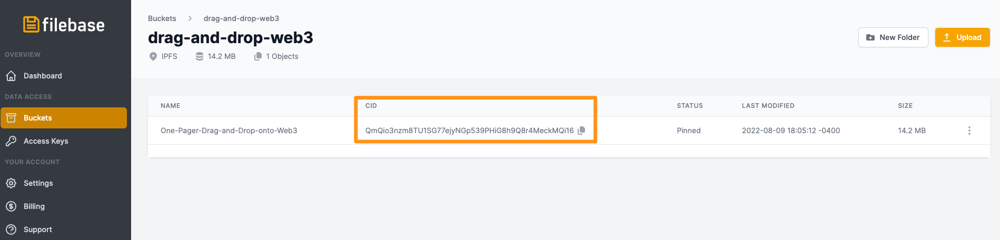	

### 通过 Filebase 上传文件夹到 IPFS
1. 首先单击菜单中的“Buckets”选项以打开 Buckets 仪表板。

	
2. 选择您的 IPFS Buckets。  
3. 单击Buckets名称后，您将看到任何以前上传的文件。要上传另一个文件，请选择“上传”，然后从选项中选择“文件夹”。

	
4. 选择您要上传到 IPFS 的文件夹。
5. 上传后，文件夹看起来类似于 IPFS 单个文件。

	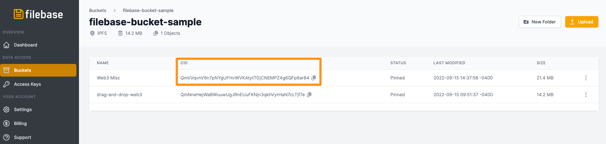	
6. 复制文件夹的 IPFS CID，然后导航至https://ipfs.filebase.io/ipfs/[CID]. 您的文件夹的内容将被列出。

		

### 查看对象的概览
1. 对象上传到桶后，您可以查看对象概览。首先单击菜单中的“Buckets”选项以打开 Buckets 仪表板。

	
2. 单击包含您要查看的对象的Buckets名称。
3. 点击桶名后，会看到当前桶中的所有对象。单击要查看的对象名称。

	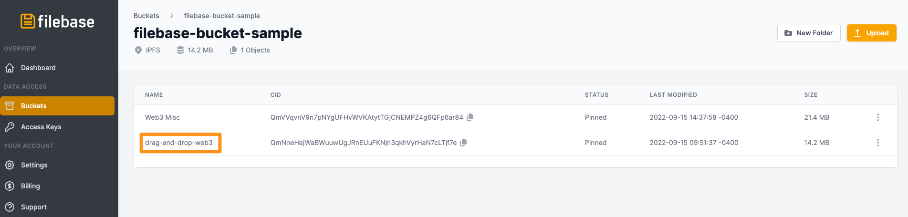	
4. 这将打开对象的概览。

	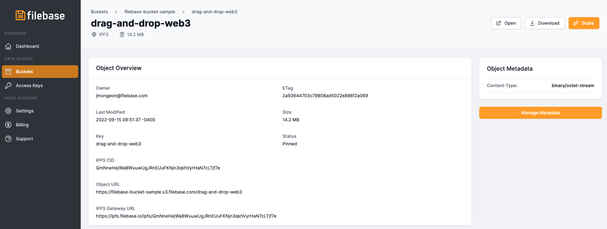	

	从此概览中，您可以查看有关对象的信息，例如：

	- Owner：上传对象的 Filebase 用户。
	- Etag：对象的实体标签。
	- Last Modified：上次修改对象的时间和日期。
	- Size：对象的大小（以字节为单位）。
	- key：对象的名称。
	- IPFS CID ：对象的（如果上传到 IPFS Buckets中）。
	- Objects URL：Filebase 对象 URL。如果此对象存储在公共Buckets中，则可以使用此链接与其他人共享文件。
	- IPFS Gateway URL：对象的 IPFS CID 附加到 Filebase 公共 IPFS 网关的末尾。
	- Object Matadata：对象上的任何用户定义的元数据都将列在对象元数据标题下，例如对象的内容类型。

### 编辑对象元数据
1. 将对象上传到Buckets后，您可以编辑对象的元数据。首先单击菜单中的“Buckets”选项以打开 Buckets 仪表板。

	
2. 单击包含您要查看的对象的 Buckets 名称。
3. 点击桶名后，会看到当前桶中的所有对象。单击要查看的对象名称。

		
4. 这将打开对象的概览。从此概览中，您可以通过选择网页右侧的“管理元数据”选项来编辑文件的元数据。

		
5. 这将打开一个元数据编辑页面，您可以在其中更改对象的内容类型和缓存控制元数据选项，以及向对象添加任何其他元数据字段。
 
 	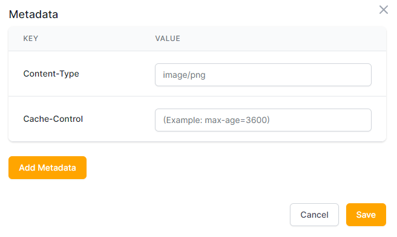

### 查看对象
1. 要在上传到 Buckets 后查看对象的内容，首先单击菜单中的 “Buckets” 选项以打开 Buckets 仪表板。

	
2. 单击包含您要查看的对象的 Buckets 名称。
3. 点击桶名后，会看到当前桶中的所有对象。单击要查看的对象名称。

		
4. 这将打开对象的概览。您可以通过单击网页右上角的“打开”按钮来打开文件。

		

### 下载对象
1. 要从Buckets下载对象，首先单击菜单中的“Buckets”选项以打开Buckets仪表板。

	
2. 单击包含您要下载的对象的Buckets名称。
3. 点击桶名后，会看到当前桶中的所有对象。单击要下载的对象名称。

		
4. 这将打开对象的概览。您可以通过单击网页右上角的“下载”按钮来下载文件。

		

### 共享对象
1. 要共享 Buckets 中的对象，首先单击菜单中的 “Buckets” 选项以打开 Buckets 仪表板。

	

		要使用链接共享来共享对象，Buckets 需要将可访问性设置为公开。
2. 单击包含您要共享的对象的 Buckets 名称。
3. 点击桶名后，会看到当前桶中的所有对象。从这里，有两种方法可以获取对象的可共享链接。

	您可以单击对象名称最右侧的三个省略号点，然后选择“共享”。
	
	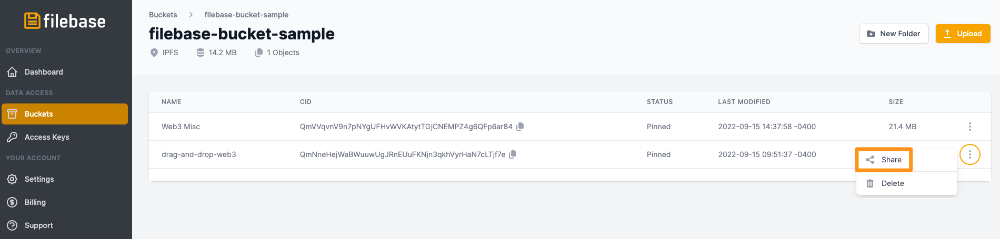	
4. 您也可以点击您要分享的对象名称。

	
5. 这将打开对象的概览。您可以通过单击网页右上角的“共享”按钮来共享文件。这将复制对象的 URL。

	

### 删除对象
1. 要从Buckets中删除对象，首先单击菜单中的“Buckets”选项以打开Buckets仪表板。

	
2. 单击包含要删除的对象的Buckets名称。
3. 点击桶名后，会看到当前桶中的所有对象。找到您要删除的对象，然后单击屏幕右侧的 3 个点以切换删除选项。

	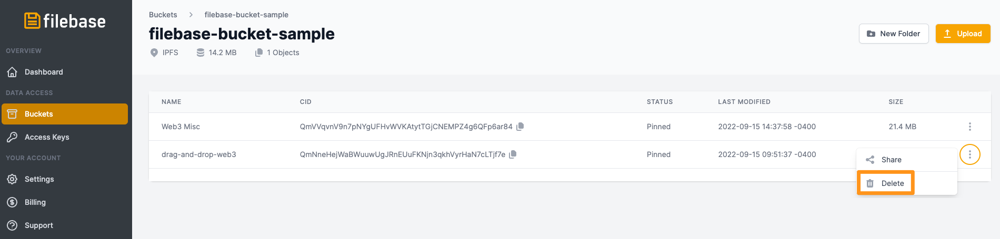
4. 从 3 点切换选项中，选择“删除”选项。出现提示时单击“确定”以确认您要删除该对象。

### 在桶内创建文件夹
1. 要为 Buckets 内的对象创建文件夹，首先单击菜单中的“Buckets”选项以打开Buckets仪表板。

	
2. 单击要在其中创建文件夹的Buckets名称。
3. 单击Buckets名称后，选择网页右上角的“新建文件夹”选项。

	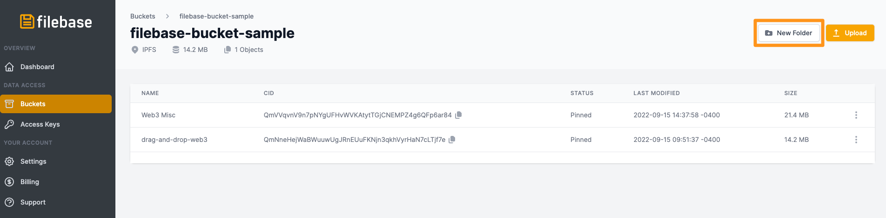
4. 在提示中输入新文件夹的名称并选择“创建文件夹”。

### 删除桶内的文件夹
1. 要从Buckets中删除文件夹，首先单击菜单中的 “Buckets” 选项以打开 Buckets 仪表板。

	
2. 单击包含要删除的文件夹的Buckets名称。
3. 点击bucket名称后，会看到bucket中的内容。找到您要删除的文件夹，然后单击屏幕右侧的 3 个点以切换删除选项。

	删除文件夹也将删除其所有内容。
	
	
4. 从 3 点切换选项中，选择“删除”选项。出现提示时单击“确定”以确认您要删除该文件夹。

## 使用访问密钥
### 查看您的访问密钥
1. 要查看您的 Filebase 帐户的访问密钥，首先单击菜单中的“访问密钥”选项以打开访问密钥仪表板。
2. 在这里您可以查看您帐户的访问密钥。每个访问密钥都有两部分，密钥和与密钥关联的秘密。访问密钥仪表板还将提供诸如创建访问密钥的时间和日期及其当前状态等信息。

	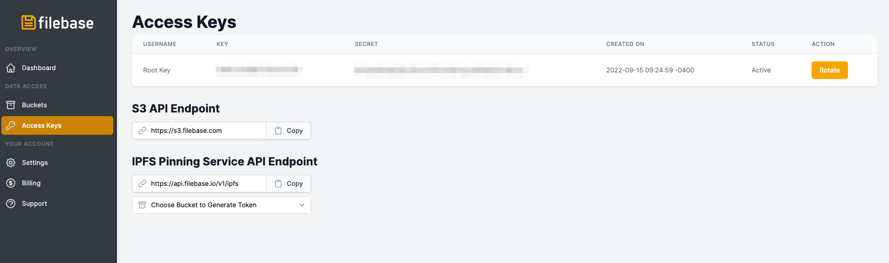
3. 要使用访问密钥，您需要同时拥有密钥和与该密钥关联的秘密。

#### 轮换您的访问密钥
轮换访问密钥将创建新的访问密钥和秘密访问密钥。您的旧密钥将被禁用并且不再起作用。

1. 要轮换您的访问密钥，首先单击菜单中的“访问密钥”选项以打开访问密钥仪表板。

	
2. 单击访问密钥仪表板“操作”部分下的“旋转”按钮。

	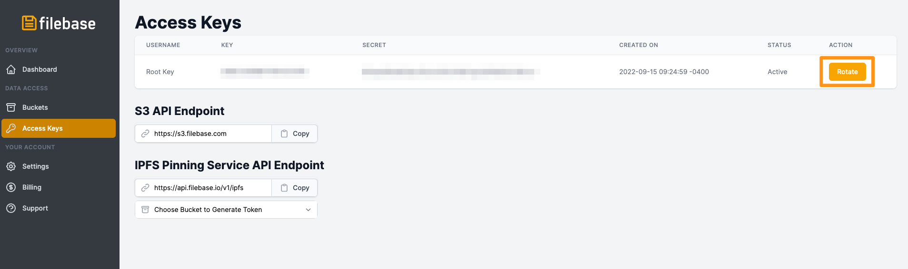
3. 要确认访问密钥的轮换，通过在文本输入字段中输入文本“轮换我的密钥”来响应确认提示。

	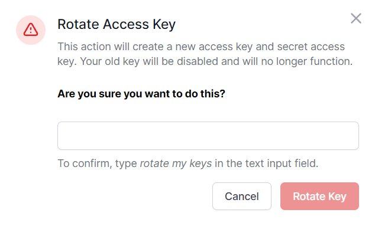

### 生成 IPFS 固定服务 API 秘密访问令牌
1. 导航到[访问密钥页面](https://console.filebase.com/keys)，然后查看 IPFS PInning 服务 API 端点。单击“选择Buckets以生成令牌”的下拉菜单，然后选择您要使用的 IPFS FilebaseBuckets。

	
2. 然后复制生成的Secret Access Token：

	

## API端点
- Filebase API 端点是https://s3.filebase.com
- Filebase IPFS Pinning Service API 端点是https://ipfs.filebase.io
