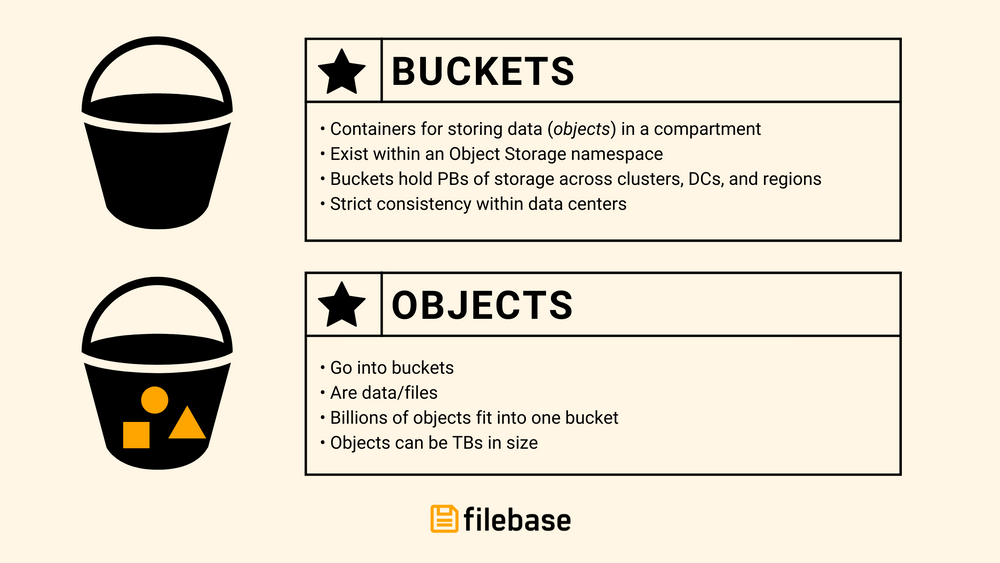

# 常问问题
	您可以在下面找到有关 Filebase 的常见问题解答。
Filebase 是世界上第一个由去中心化存储网络提供支持的对​​象存储平台。

我们将多个网络统一在一个与 S3 兼容的 API 下，使去中心化存储变得简单、可访问且易于使用。

对 Filebase 有疑问？查看下面的常见问题解答。

## 什么是filebase？
- filebase是如何工作的？

	Filebase 是一种分散的、地理冗余的 IPFS 固定服务，它还支持 Sia 网络上的数据存储。Filebase 运营着位于美国和欧洲不同地理位置的 IPFS 节点，上传到 IPFS 的每个文件都在这些服务器上进行了 3 倍复制。
	
	通过我们基于浏览器的界面，使用我们的 S3 兼容 API 或使用 IPFS 固定服务 API，用户可以创建存储桶并将文件固定到 IPFS 网络。
- 什么是水桶？

	在对象存储的世界里，有桶和对象。桶就像文件夹，它们存储数据和关联的元数据。桶是对象的容器。
	
	
	
	了解如何创建和管理存储桶[这里](https://docs.filebase.com/getting-started/getting-started-guide#creating-and-working-with-buckets).
- 公共和私有存储桶有什么区别？

	可以通过以下格式的 S3 URL 引用和访问公共存储桶：

	[https://bucket-name.s3.filebase.com/](https://bucket-name.s3.filebase.com/)

	无法通过此 S3 URL 公开访问私有存储桶。要访问存储在私有存储桶中的内容，[预签名网址](https://docs.filebase.com/api-documentation/pre-signed-urls)是必须的。

	存储在 IPFS 存储桶中的所有文件，即使存储桶是私有的，也可以通过 IPFS CID 和 IPFS 网关公开访问。

	默认情况下，所有存储桶都是私有的。

	公共存储桶功能仅适用于付费订阅用户。
- 什么是对象？

	在对象存储领域，对象是文件和这些文件的关联元数据。对象存储在桶中，就像在传统文件存储中一样，文件存储在文件夹中。

	
- 什么是访问密钥？

	访问密钥是一对唯一的凭据，用于通过与 Filebase S3 兼容的 API 进行身份验证。通过 SDK、第三方工具、CLI 工具或使用 Filebase S3 兼容 API 的任何其他交互连接到 Filebase 时需要此访问密钥对。
- “带宽”是什么意思？

	带宽是指显示或下载您或您的用户通过专用网关访问的内容所需的数据量。无论是图像、视频、音频还是任何其他类型的文件，构成内容的数据都会从 IPFS 节点传输到您的设备，而这些数据的数量决定了带宽。

	Filebase 仅对传出数据传输（出口）的带宽收费。上传带宽（入口）始终免费。
- Filebase 是否支持多个访问密钥对？

	Filebase 目前不支持每个帐户多个访问密钥对，但计划在未来支持此功能。

## 常用功能
- 如何创建私有存储桶？
	1. 单击菜单中的 “Buckets” 选项以打开 Buckets 仪表板。
	2. 进入 Buckets 仪表板后，单击右上角的 “Create Bucket” 选项创建一个新的 bucket。
	3. 输入存储桶名称并选择您的存储网络。
	
		存储桶名称在所有 Filebase 用户中必须是唯一的，长度在 3 到 63 个字符之间，并且只能包含小写字符、数字和破折号。
	
		Filebase 目前有 2 种不同的去中心化存储网络可供选择：
		
		- 存储在 IPFS 上的文件可通过 IPFS 网关公开访问。推荐用于存储与 Web3 资产相关的数据，例如 NFT、元数据或去中心化网站数据。
		- 存储在Sia，默认为私有。推荐用于数据隐私。
	
			每个存储网络都会自动按地理分布您的数据。所有数据在静态和传输时都经过加密。
	4. 填写完这些字段后，单击“创建存储桶”。
	
		默认情况下，存储桶是私有的。要创建公共存储桶，您必须是付费用户。
- 如何创建公共存储桶？

	公共存储桶不适用于免费帐户。用户需要有一个有效的 Filebase 付费帐户才能创建和启用公共存储桶。
- Filebase 是否有存储桶大小限制？

	不，Filebase 存储桶没有最大大小限制，只要它在用户基于其订阅层级的最大存储分配范围内即可。
- 如何上传对象？
	1. 要将对象上传到存储桶，首先单击菜单中的“存储桶”选项以打开存储桶仪表板。
	2. 单击要将对象上传到的存储桶名称。
	3. 点击桶名后，会看到当前桶中的所有对象。要将更多对象上传到存储桶，请单击右上角的“上传”按钮。
	4. 选择要上传到存储桶的文件。
- Filebase 是否有对象大小限制？

	对象大小限制因网络而异。

	- IPFS：IPFS 没有最大文件大小，但任何大于 5GB 的文件都应使用[S3 兼容 API](https://docs.filebase.com/ipfs/ipfs-pinning#uploading-a-file-to-ipfs-using-the-s3-compatible-api)从分段上传中受益。
	- Sia：存储在 Sia 存储桶中的对象支持的最大单个对象大小为 300GB。

	单个 HTTP PUT 或 POST 中可以上传的最大对象是 5GB。如果要上传大于 5GB 的对象，则需要启动一个 [分段上传](https://docs.filebase.com/third-party-tools-and-clients/cli-tools/aws-cli/what-is-multipart-upload) 通过我们的 S3 API。

	对于大于 100MB 的对象，客户应考虑使用  [分段上传](https://docs.filebase.com/third-party-tools-and-clients/cli-tools/aws-cli/what-is-multipart-upload) 提高可靠性的能力。

	了解有关分段上传的更多信息[这里](https://docs.filebase.com/third-party-tools-and-clients/cli-tools/aws-cli/what-is-multipart-upload)的
- 如果我上传一个同名的对象，它会覆盖原来的吗？

	是的，上传同名对象将替换现有对象。
- 每个桶的最大对象数是多少？

	存储桶中可以存储的对象没有最大数量限制。
- 单个桶的最大存储量是多少？

	单个桶没有最大存储量。最大存储限制仅适用于免费用户，所有存储桶的总容量限制为 5GB。付费用户没有最大存储限制。

## S3 API
- 什么是 Filebase S3 API 速率限制？

	Filebase S3 API 的有效速率限制为 100 RPS（每秒请求数）。
- 如何允许其他用户将对象上传到我账户中的存储桶？

	您可以允许其他人通过预签名 URL 将对象上传到您的 Filebase 帐户上的存储桶。

	如果您以前没有使用过 AWS CLI，请参阅[这里](https://docs.filebase.com/third-party-tools-and-clients/cli-tools/aws-cli)有关配置和开始使用 AWS CLI 的指南。

	要使用 AWS CLI 创建预签名 URL：

		aws s3 --endpoint https://s3.filebase.com presign s3://filebase-bucket-name/file.name
	有关预签名 URL 的更多信息，请点[这里](https://docs.filebase.com/api-documentation/pre-signed-urls)。
- 如何使用预签名 URL？

	如果您之前没有使用过 AWS CLI，请参阅[这里](https://docs.filebase.com/third-party-tools-and-clients/cli-tools/aws-cli)了解我们关于配置和开始使用 AWS CLI 的指南。

	要使用 AWS CLI 创建预签名 URL：
	
		aws s3 --endpoint https://s3.filebase.com presign s3://filebase-bucket-name/file.name
	有关预签名 URL 的更多信息，请点[这里](https://docs.filebase.com/api-documentation/pre-signed-urls)。
- 如何为我的存储桶设置 CORS 策略？

	Filebase S3 兼容 API 支持存储桶的 CORS 配置。

	支持以下 API 方法：

	- GetBucketCors
	- PutBucketCors
	- DeleteBucketCors

	要配置 Filebase 存储桶以允许跨域请求，您需要创建一个 CORS 规则。此规则标识您将允许访问您的存储桶的来源、每个来源将支持的 HTTP 方法以及其他特定于操作的信息。

	此规则可以是 JSON 或 XML 文件，但如果使用 AWS CLI 应用此规则，则需要 .json 文件。

	- 示例 #1 JSON：

		此示例是一个通配符规则，允许来自所有来源的跨域 GET 请求。

			{
			"CORSRules":[
			    {
			        "AllowedHeaders": [],
			        "AllowedMethods": [
			            "GET"
			        ],
			        "AllowedOrigins": [
			            "*"
			        ],
			        "ExposeHeaders": []
			    }
			    ]
			}
	- 示例 #1 XML：

			<CORSConfiguration>
			    <CORSRule>
			        <AllowedOrigin>*</AllowedOrigin>
			        <AllowedMethod>GET</AllowedMethod>
			    </CORSRule>
			</CORSConfiguration>
	- 示例 #2 JSON：

		CORS 还允许可选的配置参数，如以下 CORS 规则所示。
		
		- MaxAgeSeconds

			指定浏览器缓存对指定资源的预检 OPTIONS 请求的响应的时间量（以秒为单位）。
		- ExposeHeader

			标识客户能够从其应用程序访问的响应标头。在此示例中，x-amz-server-side-encryption、x-amz-request-id 和 x-amz-id-2。
		
		在第二个示例中，CORS 规则允许来自 http://www.example.com 源的跨源 PUT、POST 和 DELETE 请求，MaxAgeSeconds 为 3000，ExposeHeaders 为 x-amz-server-side-encryption， x-amz-request-id 和 x-amz-id-2。

				{
				"CORSRules": [
				    {
				        "AllowedHeaders": [
				            "*”
				        ],
				        "AllowedMethods": [
				            "PUT",
				            "POST",
				            "DELETE"
				        ],
				        "AllowedOrigins": [
				            "http://www.example.com"
				        ],
				        "ExposeHeaders": [
				            "x-amz-server-side-encryption",
				            "x-amz-request-id",
				            "x-amz-id-2"
				        ],
				        "MaxAgeSeconds": 3000
				    }
				    ]
				}
		- 示例 #2 XML：

				<CORSConfiguration>
				<CORSRule>
				<AllowedOrigin>http://www.example.com</AllowedOrigin>
				<AllowedMethod>PUT</AllowedMethod>
				<AllowedMethod>POST</AllowedMethod>
				<AllowedMethod>DELETE</AllowedMethod>
				<AllowedHeader>*</AllowedHeader>
				<MaxAgeSeconds>3000</MaxAgeSeconds>
				<ExposeHeader>x-amz-server-side-encryption</ExposeHeader>
				<ExposeHeader>x-amz-request-id</ExposeHeader>
				<ExposeHeader>x-amz-id-2</ExposeHeader>
				</CORSRule>
				</CORSConfiguration>
	- 将 CORS 规则应用于文件库存储桶

		要应用 CORS 规则，您可以使用 AWS CLI 等工具来应用您创建的包含该规则的 .json 文件。有关如何配置 AWS CLI 的信息，请参阅。

		在命令行中，输入以下命令以将 CORS 规则应用于预期的 Filebase 存储桶：

			aws --endpoint https://s3.filebase.com s3api put-bucket-cors --bucket bucket-name --cors-configuration=file://corspolicy.json

## 存储网络
- 你们支持哪些存储网络？

	支持 [IPFS](https://docs.filebase.com/ipfs) 和 [Sia](https://docs.filebase.com/what-is-filebase/storage-networks/sia) 网络。
- 为什么有人会使用 Filebase 而不是直接访问这些网络？

	从 [2018年初开始构建](https://filebase.com/blog/celebrating-two-years-of-decentralized-storage-in-production/)直到今天，去中心化存储仍然很难为日常消费者和企业所用。它需要复杂的软件需要不断运行以确保文件健康，并且钱包需要加密货币。我们很早就认识到，要大规模采用和使用这些颠覆性技术，“轻松入门”是必要的。

	通过使用 Filebase，没有与直接在去中心化网络上存储数据相关的传统复杂性，例如：
	
	- 没有最短存储期限。
	- 没有最小文件大小。
	- 没有最小扇区大小。
	- 没有检索延迟。
	- 无 API 费用。
	- 没有入口费。
	- 没有加密货币的管理。
	- 不使用特殊软件。
	- 无需技术技能。
- 这些存储网络之间有什么区别，我如何知道选择哪一个？
	- IPFS

		星际文件系统（IPFS）是一个分布式和去中心化的存储网络，用于存储和访问文件、网站、数据和应用程序。IPFS 使用点对点网络技术连接一系列位于世界各地的节点，这些节点构成了 IPFS 网络。
		
		IPFS特有的IPFS分为三块：
		
		- 通过内容寻址的唯一数据标识

			存储在 IPFS 上的数据通过其内容地址而不是物理位置来定位。当数据存储在 IPFS 上时，它存储在一系列加密的片段中，每个片段都有自己唯一的内容标识符或哈希。此唯一标识符称为 CID。此散列用作标识符并将片段链接到该数据的所有其他片段。
		- 通过有向无环图 (DAG) 进行内容链接

			DAG 是一种分层数据结构，其中 IPFS 对等网络上的每个节点和存储对象都有一个唯一标识符，该标识符是节点内容的哈希值。此唯一标识符称为 CID。
		- 通过分布式哈希表 (DHT) 进行内容发现

			DHT 是键和值的数据库，分布在分布式网络上的所有对等点上。要查找内容，您可以询问网络上的对等点，它会返回一个 DHT，告诉您哪些对等点正在存储构成您请求的数据对象的哪些内容块。

		可以使用 IPFS 网关访问存储在 IPFS 上的内容。网关用于为本机不支持 IPFS 的应用程序提供解决方法。IPFS 网关可以是本地的、私有的或公共的，并使用 IPFS 内容 ID 提供内容的 URL 链接以访问存储的内容。
	- IPFS 网关

		可以使用 IPFS 网关访问存储在 IPFS 上的内容。网关用于为本机不支持 IPFS 的应用程序提供解决方法。IPFS 网关可以是本地的、私有的或公共的，并使用 IPFS 内容 ID 提供内容的 URL 链接以访问存储的内容。
	- IPFS固定

		如果您希望数据长期缓存，您可以固定数据。这将使数据无限期地缓存在 IPFS 网络上，因为在垃圾收集过程中会跳过固定数据，从而加快数据检索时间。

		默认情况下，上传到 Filebase 上的 IPFS 的文件会自动固定到 IPFS 并通过 3 倍复制存储在 Filebase 基础设施中，您无需支付额外费用。这意味着您的数据在发生灾难或中断时可访问且可靠，并且不会受到 IPFS 垃圾收集过程的影响。

		固定数据是 IPFS 网络的一个独特功能，不为在其他网络上创建的桶提供。

		由于 IPFS 数据固定在 Sia 网络上，因此上传到 IPFS 的对象的最大单个对象大小为 300GB。

		IPFS 桶非常适合：

		- 托管用于流式传输或实时流式传输的视频。
		- 托管用于数据分析的数据集。
		- 托管 NFT 集合并存储相关的 NFT 元数据和文件。
		- 为去中心化应用程序存储脚本、代码和内容。
		
		更多关于 IPFS 的信息，请参考的[IPFS 文档](https://docs.ipfs.io/)
	- Sia

		Sia 是一个开源去中心化存储网络，它利用区块链技术创建一个安全且冗余的云存储平台。

		Filebase 作为节点运营商直接与 Sia 合作，这意味着 Filebase 代表 Filebase 用户管理所有存储合约。[上传到 Filebase Sia 存储桶的每个对象都使用 EC 具多个部分](https://en.wikipedia.org/wiki/Reed%E2%80%93Solomon_error_correction)，该编码具有 30 分之 10 的算法。对象被分成 30 个部分，然后在地理上分布到世界各地的 Sia 主机服务器。30 个文件中只有 10 个可用才能处理下载请求。这意味着对象的 20 个部分可以被销毁、脱机或以其他方式不可用，从而创建本机冗余和高可用性。

		Sia 使用 Threefish 算法实现高性能和安全加密。Threefish 特别加强了对相关密钥攻击和边信道攻击的防御。

		Sia 上可以存储的最大单个对象大小为 300GB。

		默认情况下，上传到 Sia 存储桶的所有数据都是私有的。

		Sia 桶非常适合：
		
		- 增加数据隐私。
		
		有关 Sia 的更多信息，请参阅[sia 文档](https://sia.tech/docs/) 
- 位于 IPFS 存储桶中的对象的最大对象大小是多少？

	IPFS 没有最大文件大小，但任何大于 5GB 的文件都应使用与上传，以便从分段上传中受益。
- 位于 Sia 存储桶中的对象的最大对象大小是多少？

	Sia 上可以存储的最大单个对象大小为 300GB。

## IPFS固定
- 如何将对象固定到 IPFS？

	所有上传到 IPFS 的文件都会自动固定到 IPFS。这意味着它们不受 IPFS 垃圾收集过程的影响。

	1. 首先单击菜单中的“Buckets”选项以打开 Buckets 仪表板。
	2. 选择您的 IPFS 存储桶。  
	3. 单击存储桶名称后，您将看到任何以前上传的文件。要上传另一个文件，请选择“上传”，然后从选项中选择“文件”。
	4. 选择要上传到 IPFS 的文件。
	5. 上传后，您将能够从 “CID” 类别中查看和复制 IPFS CID。
- 如何将文件夹固定到 IPFS？
	1. 首先单击菜单中的“Buckets”选项以打开 Buckets 仪表板。
	2. 选择您的 IPFS 存储桶。  
	3. 单击存储桶名称后，您将看到任何以前上传的文件。要上传另一个文件，请选择“上传”，然后从选项中选择“文件夹”。
	4. 选择您要上传到 IPFS 的文件夹。
	5. 上传后，文件夹看起来类似于 IPFS 单个文件。
	6. 复制文件夹的 IPFS CID，然后导航至https://ipfs.filebase.io/ipfs/[CID]. 您的文件夹的内容将被列出。
- 上传到 IPFS 的数据是公开的吗？

	是的，所有上传到 IPFS 的数据都是公开的，即使数据存储在私有文件库存储桶中也是如此。所有上传到 IPFS 的数据都可以通过 IPFS 网关由其 IPFS CID 引用和访问。
- 如何使用 IPFS 网关？

	可以使用 IPFS 网关访问存储在 IPFS 上的内容。网关用于为本机不支持 IPFS 的应用程序提供解决方法。IPFS 网关可以是本地的、私有的或公共的，并使用 IPFS 内容 ID 提供内容的 URL 链接以访问存储的内容。

	Filebase的原生 IPFS 网关如下：

		https://ipfs.filebase.io/ipfs/{CID}
	Filebase 公共 IPFS 网关的有效速率限制为 200 RPM（每分钟请求数）。

	通过 Filebase 存储在 IPFS 上的所有内容都可以通过 Filebase 网关访问，响应时间比通过任何其他网关访问内容更快。这是因为 Filebase 网关与我们的 IPFS 节点对等。Filebase 网关还与其他固定服务的 IPFS 网关对等。
- 什么是 Filebase IPFS 公共网关速率限制？

	Filebase 公共 IPFS 网关的有效速率限制为 200 RPM（每分钟请求数）。
- 如果我取消帐户，我的文件会保留在 IPFS 上吗？

	如果您的文件被其他节点缓存，它们将保留在 IPFS 上。但是，随着时间的推移，如果这些节点通过垃圾收集过程删除了您的文件，它们可能会变得无响应。此外，无法保证其他节点会缓存您的文件。

## IPFS 专用网关
- 什么是 IPFS 专用网关？

	IPFS 网关是一个 IPFS 对等体，它接受对 IPFS CID 的 HTTP 请求。专用网关为用户提供了一种访问 IPFS 内容的便捷方式，而无需自己运行 IPFS 节点。网关充当用户的 Web 浏览器或应用程序与 IPFS 网络之间的中介，代表用户检索和提供内容。

	要深入了解 IPFS 网关及其工作原理，以及在 Filebase 上使用 IPFS 网关的完整演练，请参阅我们的[文档](https://docs.filebase.com/ipfs/ipfs-gateways).
- 使用 IPFS 专用网关有什么好处？

	专用网关具有多项优势，例如：
	
	- 提高性能和检索时间。
	- 通过专用网关访问内容时没有速率限制。
	- 通过专用网关的范围功能限制网关可以提供的内容（白名单）。
	- 设置可用于网站或应用程序托管的网关的 Root CID。
- 您有任何关于如何使用 IPFS 专用网关的示例吗？

	是的！我们文档的 IPFS 网关部分有几个教程。

## 集成
- 哪些 API 客户端或工具可与 Filebase 配合使用？

	由于 Filebase 与 S3 兼容，因此它可以与 S3 API 兼容工具、SDK 和框架一起开箱即用。有关我们拥有文档的工具的完整列表，请参阅我们的以下文档：
	
	- [CLI 工具](https://docs.filebase.com/third-party-tools-and-clients/cli-tools)
	- [代码开发](https://docs.filebase.com/code-development-+-sdks/code-development)
	- [备份客户端配置](https://docs.filebase.com/third-party-tools-and-clients/backup-client-configurations)
	- [内容分发网络](https://docs.filebase.com/third-party-tools-and-clients/content-delivery-networks)
	- [文件管理客户端配置](https://docs.filebase.com/third-party-tools-and-clients/file-management-client-configurations)
	- [NAS 配置](https://docs.filebase.com/third-party-tools-and-clients/nas-device-configurations)

## 安全
- 我读过很多关于 AWS S3 Buckets 泄漏数据的文章——默认情况下 Filebase 的安全性如何？

	存储在 Filebase 上的数据在传输过程中和数据处于静止状态时始终是加密的。服务器端加密是本机的，默认情况下为所有用户启用。

	由于 Filebase 支持由区块链驱动的分散式网络，因此对象以小块的形式存储在世界各地的多个节点上。没有节点可以完全访问整个对象或未加密的数据。

	为了进一步简化安全和访问控制，Filebase 平台上的对象继承父存储桶的 ACL。例如，`GetObjectAcl` 和 `GetBucketAcl` 方法将按预期运行，但 `GetObjectAcl` 响应将返回包含该对象的存储桶的 ACL。

	Filebase S3 兼容 API 支持 HTTP/2（需要 TLS）和静态数据加密。默认情况下启用静态数据加密，用户无需执行任何其他操作。

## 用例
- Filebase 如何帮助我的灾难恢复 (DR) 策略？

	Filebase 开创了 IPFS 固定和数据存储的“本地地理冗余”概念。默认情况下，本机地理冗余为 Filebase 用户在 Filebase 平台上的一个存储桶中为其所有数据提供默认级别的 3 倍冗余。为了使用 AWS 实现相同级别的冗余，您需要 3 个区域分布式存储桶，成本是其 3 倍。

	这使得 Filebase 成为拥有有价值数据的开发人员或专注于灾难恢复的大型公司和企业的理想平台。

	[要了解有关地理冗余的更多信息](https://docs.filebase.com/web3-education/deep-dives/deep-dive-geo-redundancy),请查看我们的 Deep Dive.
- 我可以将 Filebase 用于我的 NFT 收藏吗？

	是的，Filebase 可以用于各种不同的 NFT 收集工作流程。看看我们的有关如何在不同 NFT 集合智能合约和工作流程中使用 Filebase 的[详细演练](https://docs.filebase.com/web3-education/web3-tutorials)。
- 我可以使用 Filebase 进行去中心化应用程序 (dApp) 存储吗？

	是的，Filebase 可以用于各种不同的 dApp 工作流程。看看我们的有关如何在 dApp 配置中使用 Filebase 的[详细演练](https://docs.filebase.com/knowledge-base/web3-tutorials)。
- 我可以使用 Filebase 进行个人数据存储吗？

	是的，Filebase 可用于个人数据存储。Filebase 可以配置为与数百种​​不同的备份工具、NAS 设备和文件管理应用程序一起使用。查看我们关于第三方配置的文档 
- Filebase 是 AWS 的替代品吗？

	是的，Filebase 提供了一个与 S3 兼容的 API，可以将其配置为大多数与 S3 兼容的工具和应用程序的替代品，作为 AWS 的替代品。

	详细了解我们的 S3 API的
- Filebase 是 Pinata 的替代品吗？

	是的，Filebase 提供了一个 IPFS 固定服务，可以用作 Pinata IPFS 固定服务的[替代方案](https://docs.filebase.com/what-is-filebase/storage-networks/ipfs)。

	阅读有关我们的 IPFS 固定服务的更多信息。

## 计费和定价
- Filebase 的定价是多少？

	请查看我们的 [定价模型](https://docs.filebase.com/getting-started/billing-and-pricing/pricing-model) 有关我们当前在 Filebase 上的存储定价的更多信息。
- 我如何开始免费试用？

	创建 Filebase 帐户后，您的帐户将默认为免费用户。可供[所有用户免费使用](https://console.filebase.com/signup)，无需信用卡即可在 Filebase 上存储多达 5GB 的数据。5GB 之后，用户将需要升级到我们的订阅模式。
- 免费用户的带宽限制是多少？

	免费用户限制为 5GB 的出口带宽。
- 如何升级到付费订阅？

	升级到付费订阅
	
	1. 参观的仪表板的[计费页面](https://console.filebase.com/billing)。订阅分为 IPFS 网络和 Sia 网络。IPFS 定价计划将首先显示，然后是 Sia 网络的去中心化存储定价计划。
	2. 选择适合您工作流程的订阅计划。有关每个定价计划的详细信息，请参阅我们的[定价模型](https://docs.filebase.com/getting-started/billing-and-pricing/pricing-model)。
	3. 选择计划后，您将被重定向到 Stripe 结帐屏幕。输入您的账单信息并通过选择“订阅”确认您的订阅。
的的

	Stripe 结帐将详细说明 3 个部分：
	
	- 您的基本订阅计划：在此示例中，使用 IPFS 入门计划。
	- IPFS 存储：这是指使用的任何存储超过所选计划的包含存储。对于 IPFS 入门计划，这是超过 200GB 的任何存储。
	- IPFS 带宽：这是指使用的任何带宽超过所选计划的包含带宽。对于 IPFS 入门计划，这是超过 400GB 的任何带宽。

	有关每个订阅计划包含的价值的详细信息，请参阅我们的[定价模型](https://docs.filebase.com/getting-started/billing-and-pricing/pricing-model)。
	
	4. 订阅后，您当前的付款方式将列在 Web 控制台[计费](https://console.filebase.com/billing)页面的“付款方式”下。

- 如何更改付款方式？

	更改付款方式

	1. 访问仪表板的[计费页面](https://console.filebase.com/billing)，选择您当前列出的付款方式旁边的“编辑”。
	2. 您将被重定向到 Stripe 网页以输入您的新付款信息。
	3. 点击“保存卡片”。
- Filebase 是否接受加密支付？

	Filebase 目前不接受加密货币付款。
- Filebase 是否有最低月费？

	Filebase 对 IPFS 付费订阅的最低每月费用为每月 20 美元。

	- 包括：
		- 数据存储：
			- 200 GB IPFS 存储。
			- 超过 200 GB 的额外存储按 0.15 美元/GB 收费。
			- 无限数量的固定文件
		- 带宽：
			- 400 GB 的出口带宽。
			- 额外带宽按 0.015 美元/GB 收费。
		- 附加功能：
			- 1 个专用 IPFS 网关
			- IPFS 固定服务 API
			- S3 兼容 API
			- 无限的 API 请求
			- 无限文件库公共网关带宽

	Filebase 在 Sia 网络上的最低月存储费用仅为 5.99 美元，其中包括前 1 TB 的存储空间和 1 TB 的带宽。
- 如何计算存储使用量？

	存储使用量以二进制千兆字节 (GB) 计算，其中 1GB 为 2³⁰ 字节。这种测量单位也称为千兆字节 (GiB)，由国际电工委员会 (IEC) 定义。同样，1TB 是 2⁴⁰ 字节，即 1024 GB。
- 我的使用费是如何计算的？
	- 存储使用费：根据计费周期内使用 Filebase 存储的活动存储量计算。
	- 带宽使用费用：离开（出口）Filebase 平台的数据量（仅限对象数据）。
	- 计费周期：Filebase 以 30 天为周期计费，无论月长短或计费周期何时开始。
- 有大量数据存储的客户有定价折扣吗？

	请电邮了解更多信息。
- 如何删除付款方式？
	
	添加付款方式后，将无法删除。可以添加新的付款方式来替换现有的付款方式，但是一旦您选择了付费订阅计划，就必须将付款方式存档。
- 如何降级到不同的付费订阅级别？

	降级订阅

	要将您的帐户降级到不同的付费等级，只需选择您想要降级到的等级并通过 Stripe 结账屏幕确认交易。

	如果您使用的存储或带宽超过了要降级到的层中包含的数量，请注意，如果使用的存储和带宽量超过新订阅层中包含的数量，您将需要支付超额费用。
- 如何取消我的付费订阅？

	取消付费订阅

	取消付费订阅很简单。
	
	- 首先，您的帐户必须使用 5 GB 或更少的空间以适应我们的免费套餐。在您的帐户消耗 5GB 或更少之前，您将无法降级。
	- 然后，按照以下简单步骤操作：
		- 访问仪表板的
		- 选择免费订阅层下的降级为免费按钮。
- 如何关闭我的 Filebase 帐户？

	由于我们服务的性质（数据存储），`客户必须在关闭帐户之前先清理并删除所有数据`。这可以在我们的控制台仪表板内或使用我们的 API 完成，尽管 API 是推荐的工作流程。

	我们一次只允许从浏览器仪表板中删除 1,000 个文件。根据您拥有的文件数量，您可以单击删除并等待几分钟，或者您可以使用 API 客户端（例如 Cyber​​Duck 或 AWS CLI）删除您的数据。

## 支持
- 我如何请求功能？

	您可以加入我们的请求功能，或发送电子邮件至。
- 我如何报告错误？

	您可以通过加入我们的报告错误，或发送电子邮件至。
- 我可以在哪里提交服务台工​​单？

	来提交服务台票证。
- Filebase 有社区 Discord 服务器吗？

	您可以通过单击 
- Filebase 有 SLA 吗？

	Filebase 没有正式的 SLA。
- 我在哪里可以找到 Filebase 可接受的使用政策 (AUP)？

	可以找到 Filebase 可接受的使用政策的
