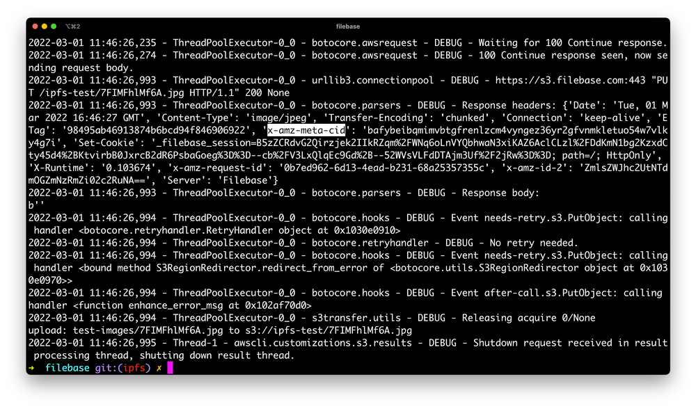
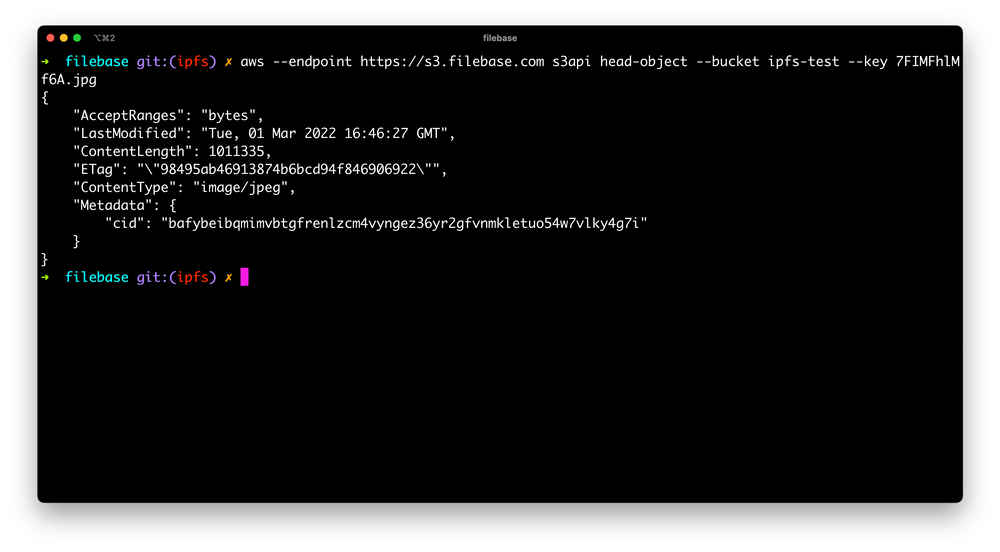

# 开发人员快速入门指南
	了解如何使用适用于 JavaScript 的 AWS 开发工具包、IPFS CLI 工具和 AWS CLI 工具通过 Filebase 开始使用 IPFS。
Filebase 支持通过我们的 S3 兼容 API 或 IPFS 固定服务 API 在 IPFS 上上传和管理内容，为开发人员创建各种各样的工作流程，以将其纳入他们的项目和工作流程。

本快速入门指南将涵盖 Filebase 在开发人员工作流程中的一些最常见用法，包括使用适用于 JavaScript 的 AWS 开发工具包、IPFS CLI 工具和 AWS CLI。

## 适用于 JavaScript 的 AWS 开发工具包
AWS SDK（软件开发工具包）通过支持和提供与 S3 兼容服务一起使用的代码对象，帮助简化编码和应用程​​序开发。有多种不同的 AWS 开发工具包，每种都适用于不同的编码语言。本指南涵盖 AWS 开发工具包 - JavaScript。

适用于 JavaScript 的 AWS 开发工具包支持三种运行时：

- JavaScript
- Node.js
- React Native for mobile development

AWS SDK - JavaScript 还支持跨运行时。Cross-runtime 是一个服务客户端包，可以在浏览器、Node.js 和 React-Native 上运行，无需更改任何代码。

- 先决条件：
	- 如果使用 CLI，请在您的环境中下载并安装 [npm](https://docs.npmjs.com/downloading-and-installing-node-js-and-npm)
	- 下载适用于 Javascript 的 [AWS 开发工具包](https://github.com/aws/aws-sdk-js-v3#getting-started)。
	- [注册](https://filebase.com/signup)一个免费的 Filebase 帐户。
	- 拥有您的文件库访问权限和密钥。在[此处](https://docs.filebase.com/getting-started-guides/getting-started-guide#working-with-access-keys)了解如何查看您的访问密钥。

### 声明 S3 客户端
以下代码示例定义了 S3 客户端并且不返回任何输出。替换代码中的以下值以匹配您的配置：

- `accessKeyId`：您的访问密钥
- `secretAccessKey` 您的密钥

code
	
	const AWS = require('aws-sdk');
	
	const s3 = new AWS.S3({
	  apiVersion: '2006-03-01',
	  accessKeyId: 'Filebase-Access-Key',
	  secretAccessKey: 'Filebase-Secret-Key',
	  endpoint: 'https://s3.filebase.com',
	  region: 'us-east-1',
	  s3ForcePathStyle: true
	});

### 检索桶
以下代码示例定义了 S3 客户端并且不返回任何输出。替换代码中的以下值以匹配您的配置：

- `accessKeyId`：您的访问密钥
- `secretAccessKey` 您的密钥

code

	const AWS = require('aws-sdk');
	
	const s3 = new AWS.S3({
	  apiVersion: '2006-03-01',
	  accessKeyId: 'Filebase-Access-Key',
	  secretAccessKey: 'Filebase-Secret-Key',
	  endpoint: 'https://s3.filebase.com',
	  region: 'us-east-1',
	  s3ForcePathStyle: true
	});
	
	s3.listBuckets(function (err, data) {
	  if (err) {
	    console.log("Error when listing buckets", err);
	  } else {
	    console.log("Success when listing buckets", data);
	  }
	});

### 创建桶
以下代码示例创建一个新的 Filebase 存储桶。替换代码中的以下值以匹配您的配置：

- `accessKeyId`：您的访问密钥
- `secretAccessKey` 您的密钥
- `Bucket` ：要创建的存储桶名称

存储桶名称在所有 Filebase 用户中必须是唯一的，长度在 3 到 63 个字符之间，并且只能包含小写字符、数字和破折号。

通过这种方法创建的桶将自动创建在 IPFS 网络上。

code

	const AWS = require('aws-sdk');
	
	const s3 = new AWS.S3({
	  apiVersion: '2006-03-01',
	  accessKeyId: 'Filebase-Access-Key',
	  secretAccessKey: 'Filebase-Secret-Key',
	  endpoint: 'https://s3.filebase.com',
	  region: 'us-east-1',
	  s3ForcePathStyle: true
	});
	
	const params = {
	    Bucket: "New-Filebase-Bucket"
	}
	
	s3.createBucket(params, (err, data)=>{
	    if(err){
	        console.log(err)
	    } else {
	        console.log("Bucket created", data)
	    }
	})

### 列出存储桶中的文件
以下代码示例创建一个新的 Filebase 存储桶。替换代码中的以下值以匹配您的配置：

- `accessKeyId`：您的访问密钥
- `secretAccessKey` 您的密钥
- `Bucket` ：要创建的存储桶名称

code

	const AWS = require('aws-sdk');
	
	const s3 = new AWS.S3({
	  apiVersion: '2006-03-01',
	  accessKeyId: 'Filebase-Access-Key',
	  secretAccessKey: 'Filebase-Secret-Key',
	  endpoint: 'https://s3.filebase.com',
	  region: 'us-east-1',
	  s3ForcePathStyle: true
	});
	
	const params = {
	  Bucket: "filebase-bucket",
	  MaxKeys: 20
	};
	
	s3.listObjectsV2(params, function (err, data) {
	  if (err) {
	    console.log("Error when listing objects", err);
	  } else {
	    console.log("Success when listing objects", data);
	  }
	});

### 上传对象
以下代码示例创建一个新的 Filebase 存储桶。替换代码中的以下值以匹配您的配置：

- `accessKeyId`：您的访问密钥
- `secretAccessKey` 您的密钥
- `Bucket` ：要创建的存储桶名称
- `Key` : 待上传对象的本地路径
- `Content Type`：上传对象的类型

code

	const AWS = require('aws-sdk');
	
	const s3 = new AWS.S3({
	  apiVersion: '2006-03-01',
	  accessKeyId: 'Filebase-Access-Key',
	  secretAccessKey: 'Filebase-Secret-Key',
	  endpoint: 'https://s3.filebase.com',
	  region: 'us-east-1',
	  s3ForcePathStyle: true
	});
	
	const params = {
	  Bucket: 'filebase-bucket',
	  Key: '/path/to/file/filename.png',
	  ContentType: 'image/png',
	  Body: myPictureFile,
	  ACL: 'public-read',
	};
	
	const request = s3.putObject(params);
	request.send();

- 上传后返回对象的 IPFS CID

	此示例使用 AWS SDK v2。有关使用 AWS SDK v3 的示例，请参见[这里](https://docs.filebase.com/code-development-+-sdks/sdk-examples-pinning-files-and-folders-to-ipfs/aws-sdk-for-javascript#aws-sdk-v3)。

	要在上传对象后返回对象的 IPFS CID，您需要返回 `x-amz-meta-cid` 标头。以下代码示例将 IPFS 文件上传到提供的存储桶名称并返回 IPFS CID。替换代码中的以下值以匹配您的配置：

	- `accessKeyId`：您的访问密钥
	- `secretAccessKey` 您的密钥
	- `Bucket` ：要创建的存储桶名称
	- `Key` : 待上传对象的本地路径
	
	code
	
		const AWS = require('aws-sdk');
		const fs = require('fs');
		
		const s3 = new AWS.S3({
		    endpoint: 'https://s3.filebase.com',
		    region: 'us-east-1',
		    signatureVersion: 'v4',
		});
		
		fs.readFile('image.png', (err, data) => {
		    if (err) {
		        console.error(err);
		        return;
		    }
		    
		    const params = {
		        Bucket: 'my-ipfs-bucket',
		        Key: 'test/image.png',
		        ContentType: 'image/png',
		        Body: data,
		        Metadata: { import: "car" }
		    };
		    
		    const request = s3.putObject(params);
		    request.on('httpHeaders', (statusCode, headers) => {
		        console.log(`CID: ${headers['x-amz-meta-cid']}`);
		    });
		    request.send();
		});	
- 上传文件夹到 IPFS
	- 使用以下命令下载 ipfs-car 包：

			git clone https://github.com/web3-storage/ipfs-car
	- 安装 ipfs-car 包：
		
			npx ipfs-car
	- 接下来，使用 `ipfs-car` 将一个文件夹的文件打包成一个 `.car` 文件。

		这已通过包含 10,000 个或更多文件的 .car 档案进行了测试。根据您所需的工作流程，使用以下任一命令：
	- 将文件写入当前工作目录.car

			ipfs-car --pack path/to/file/or/dir
	- 将 `.car` 文件写入具有指定名称的特定目录

			ipfs-car --pack path/to/files --output path/to/write/ipfs-car.car
	- 使用以下适用于 JavaScript 的 AWS 开发工具包代码创建一个新文件：

		以下代码示例将 IPFS 文件夹上传到提供的存储桶名称并返回文件夹的 CID 值。替换代码中的以下值以匹配您的配置：

		
		- `accessKeyId`：您的访问密钥
		- `secretAccessKey` 您的密钥
		- `Bucket` ：要创建的存储桶名称
		- `Key` : 待上传对象的本地路径

		code
		
			const AWS = require('aws-sdk');
			const fs = require('fs');
			
			const s3 = new AWS.S3({
			    endpoint: 'https://s3.filebase.com',
			    region: 'us-east-1',
			    signatureVersion: 'v4',
			});
			
			fs.readFile('image.png', (err, data) => {
			    if (err) {
			        console.error(err);
			        return;
			    }
			    
			    const params = {
			        Bucket: 'my-ipfs-bucket',
			        Key: 'test/image.png',
			        ContentType: 'image/png',
			        Body: data,
			        Metadata: { import: "car" }
			    };
			    
			    const request = s3.putObject(params);
			    request.on('httpHeaders', (statusCode, headers) => {
			        console.log(`CID: ${headers['x-amz-meta-cid']}`);
			    });
			    request.send();
			});

## IPFS 命令行
IPFS CLI 是一个命令行工具，可用于与 IPFS 交互。它可以配置为通过命令使用不同的 IPFS 固定服务，例如 `Filebase ipfs pin remote`。

阅读下文以了解如何将 IPFS CLI 与 Filebase 一起使用。

- 先决条件：
	- [下载和安装](https://docs.ipfs.tech/install/command-line/) IPFS CLI。
	- [注册](https://filebase.com/signup)一个免费的 Filebase 帐户。
	- 拥有您的文件库访问权限和密钥。[了解如何查看您的访问密钥](https://docs.filebase.com/getting-started-guides/getting-started-guide#working-with-access-keys)。
	- 创建一个文件库 IPFS 桶。[了解如何创建存储桶](https://docs.filebase.com/getting-started-guides/getting-started-guide#creating-and-working-with-buckets)。

### 将 filebase 配置为固定服务
- 要将 Filebase 添加为固定服务，请使用以下命令：

		ipfs pin remote service add filebase https://api.filebase.io/v1/ipfs access-token
- 将访问 token 替换为您的文件库 IPFS 固定服务 token。然后查看 IPFS Pinning 服务 API 端点来生成访问 token。单击 “选择存储桶以生成 token ”的下拉菜单，然后选择您要使用的 IPFS 文件库存储桶。
- 然后复制生成的 Secret Access Token：

### 将 CID 固定到您的 filebase 桶中：
	ipfs pin remote add --service=filebase --name=test.png QmSp5z5RAgDhS38w7TmLMfyDXvY9i2hF6sJ4qm62SK5939
### 列出 filebase 存储桶中的所有固定文件：
	ipfs pin remote ls --service=filebase
### 列出所有排队、固定或失败的引脚：
	ipfs pin remote ls --service=filebase --status=queued,pinning,failed

## AWS 命令行
AWS CLI，即 Amazon Web Services Command Line Interface，是亚马逊使用 Python 开发的命令行工具，用于将数据传输到对象存储服务。这是 IT 系统管理员、开发人员和程序员最常用的 CLI 工具之一。尽管此工具是由 Amazon 开发的，但您可以将它与任何 S3 兼容的 API 对象存储服务（包括 Filebase）一起使用，以管理您的存储对象和存储桶。

- 先决条件：
	- [下载和安装 aws CLI 工具](https://aws.amazon.com/cli/)。
	- [注册](https://filebase.com/signup)一个免费的 Filebase 帐户。
	- 拥有您的文件库访问权限和密钥。在此处了解如何查看您的访问密钥。
	- 注意 Filebase API 端点 - [https://s3.filebase.com](https://s3.filebase.com/)

### 配置
首先，配置 AWS CLI 以使用 Filebase 和您的 Filebase 账户。为此，打开一个新的终端窗口。从那里运行命令：

	aws configure
此命令会生成一系列提示，应按如下方式填写：

- `Access Key ID`：Filebase 访问密钥
- `Secret Access Key`：Filebase 秘密密钥
- `Region`: us-east-1
- `Output Format`：可选

完成提示后，开始使用 AWS CLI 工具与 Filebase S3 API 交互。只要您的访问 ID 和秘密访问密钥没有更改，您就不需要再次配置 AWS CLI。

所有 AWS CLI 命令都将以

	
	aws --endpoint https://s3.filebase.com
### 创建一个新桶
要使用 AWS CLI 在 Filebase 上创建新存储桶，请使用以下命令：

	aws --endpoint https://s3.filebase.com s3 mb s3://[bucket-name] 
存储桶名称在所有 Filebase 用户中必须是唯一的，长度在 3 到 63 个字符之间，并且只能包含小写字符、数字和破折号。
### 列出桶
以下命令将列出您的 Filebase 帐户中的所有存储桶：

	aws --endpoint https://s3.filebase.com s3 ls
### 列出桶的内容
要列出存储桶的内容，请使用以下命令：

	aws --endpoint https://s3.filebase.com s3 ls s3://[bucket-name]
### 上传文件到 IPFS
CID 将在 PutObject 调用的响应中返回。例如，如果我们运行以下 AWS CLI 命令：

	aws --endpoint https://s3.filebase.com s3 cp test-images/7FIMFhlMf6A.jpg s3://ipfs-test --debug
响应如下所示。为了方便起见，我们突出显示了相应的响应标头：

您也可以随时调用 HeadObject API 来获取 CID：

	aws --endpoint https://s3.filebase.com s3api head-object --bucket ipfs-test --key 7FIMFhlMf6A.jpg

### 上传文件夹到 IPFS
CAR 文件是一种包含多个文件的压缩存档文件，类似于 ZIP 文件。CAR 文件由 FileCoin 和 IPFS 网络使用，它们利用元数据字段将每个文件的 IPFS CID 包含在存档中。Filebase 支持使用 S3 兼容 API 通过 PutObject 或 MultipartUpload 方法将 CAR 文件上传到 IPFS。

有关如何创建 CAR 文件的说明，请在此处查看我们的指南：

[IPFS-CAR](https://docs.filebase.com/third-party-tools-and-clients/cli-tools/ipfs-car)

上传 CAR 文件时，您可以 `x-amz-meta-import: car` 随请求一起传递 S3 元数据标头。Filebase 然后将文件作为 CAR 导入，并返回生成的 CID。

下面是一个使用 AWS CLI 的示例，它会 `x-amz-meta` 自动添加前缀：

	aws --endpoint https://s3.filebase.com s3 cp pictures.car s3://ipfs-test --debug --metadata 'import=car'

使用指定的 `–debug` 标志，显示响应标头，揭示 CID：

	2022-06-14 19:51:41,400 - ThreadPoolExecutor-0_2 - botocore.parsers - DEBUG - Response headers:
	
	{
	'Date': 'Tue, 14 Jun 2022 23:51:41 GMT',
	'Content-Type': 'application/xml'
	'Transfer-Encoding': 'chunked',
	'Connection': 'keep-alive',
	'x-amz-meta-cid': 'bafybeieurpeyzighqrvwjqyj3szuvbqvrbijm7cdair5a422ipf2d5qnlq',
	'ETag': 'W/"d8cad258a3d9bbe03a26a13a3ec43b21"',
	'x-amz-request-id': '144e0415-8162-45cd-b071-e51dada956ae',
	'x-amz-id-2': 'ZmlsZWJhc2UtNmQ3ZjQ5OGZmZC14ejk1Mg==',
	'Server': 'Filebase'
	
	}

### IPFS 固定服务 API
要了解有关使用我们的 IPFS 固定服务 API 的更多信息，请在此处查看我们的 API 文档页面：

[ipfs pinning 服务 API](https://docs.filebase.com/api-documentation/ipfs-pinning-service-api)