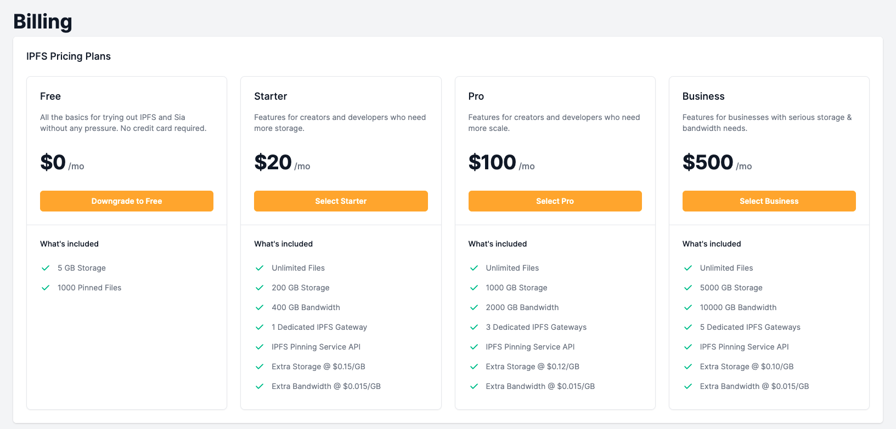
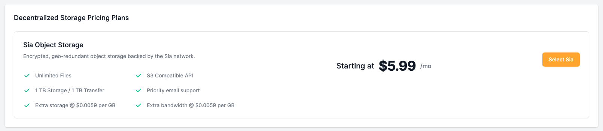
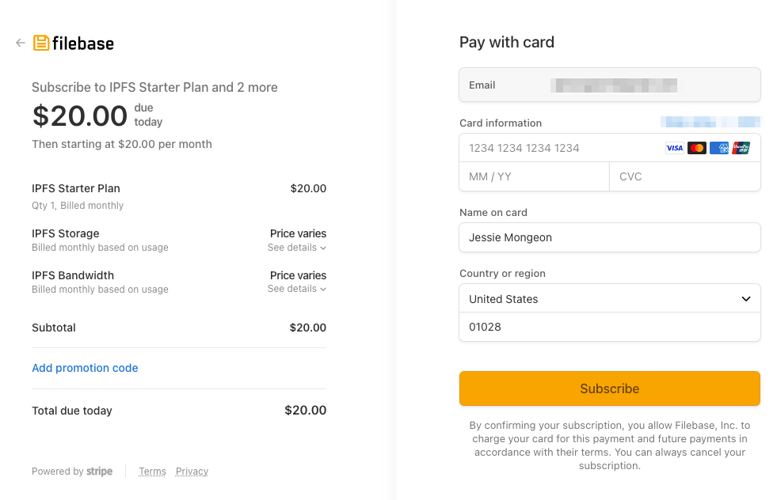
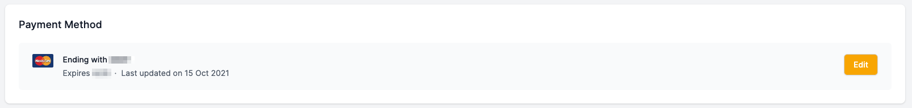
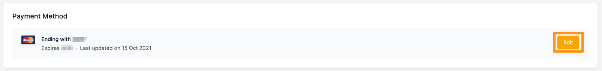
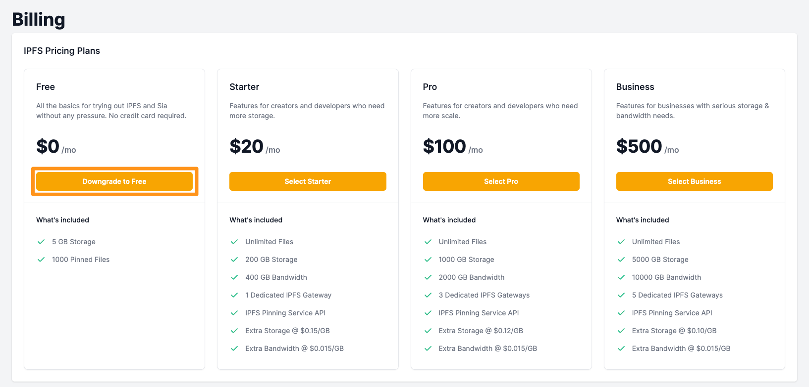

# 计费与价格
## 账单常见问题
	阅读我们最常见的计费问题，了解有关 Filebase 定价和计费的更多信息。
对 Filebase 的定价或计费有疑问？通过阅读我们最常见的计费问题了解更多信息。

- Filebase 的定价是多少？

	请查看我们的[定价模式](https://docs.filebase.com/getting-started/billing-and-pricing/pricing-model)有关我们当前在 Filebase 上的存储定价的更多信息。
- 我如何开始免费试用？

	创建 Filebase 帐户后，您的帐户将默认为免费用户。Filebase 可供所有用户[免费使用](https://console.filebase.com/signup)，他们无需信用卡即可在 Filebase 上存储多达 5GB 的数据。5GB 之后，用户将需要升级到我们的订阅模式。
- 免费用户的带宽限制是多少？

	免费用户限制为 5GB 的出口带宽。
- 如何升级到付费订阅？
	1. 访问仪表板[计费页面](https://console.filebase.com/billing)。订阅分为 IPFS 网络和 Sia 网络。IPFS 定价计划将首先显示，然后是 Sia 网络的去中心化存储定价计划。
		- IPFS

			
		- sia

			
	2. 选择适合您工作流程的订阅计划。有关每个定价计划的详细信息，请参阅我们的[定价模式](https://docs.filebase.com/getting-started/billing-and-pricing/pricing-model):
	3. 选择计划后，您将被重定向到 Stripe 结帐屏幕。输入您的账单信息并通过选择“订阅”确认您的订阅。

		
		
		- Stripe 结帐将详细说明 3 个部分：
			- 您的基本订阅计划：在此示例中，使用 IPFS 入门计划。
			- IPFS 存储：这是指使用的任何存储超过所选计划的包含存储。对于 IPFS 入门计划，这是超过 200GB 的任何存储。
			- IPFS 带宽：这是指使用的任何带宽超过所选计划的包含带宽。对于 IPFS 入门计划，这是超过 400GB 的任何带宽。
		有关每个订阅计划包含的价值的详细信息，请参阅我们的[定价模型](https://docs.filebase.com/getting-started/billing-and-pricing/pricing-model)
	4. 订阅后，您当前的付款方式将列在 Web 控制台页面的“付款方式”下。

		
- 如何更改付款方式？

	更改付款方式

	1. 访问仪表板的[计费页面](https://console.filebase.com/billing)。选择您当前列出的付款方式旁边的“编辑”。

		
	2. 您将被重定向到 Stripe 网页以输入您的新付款信息。
		
		
	3. 点击“保存卡片”。
- Filebase 是否接受加密支付？

	Filebase 目前不接受加密货币付款。
- Filebase 是否有最低月费？

	Filebase 对 IPFS 付费订阅的最低每月费用为每月 20 美元。

	包括什么：

	- 数据存储：
		- 200 GB IPFS 存储。超过 200 GB 的额外存储按 0.15 美元/GB 收费。
		- 无限数量的固定文件
	- 带宽：
		- 400 GB 的出口带宽。额外带宽按 0.015 美元/GB 收费。
	- 附加功能：
		- 1 个专用 IPFS 网关
		- IPFS 固定服务 API
		- S3 兼容 API
		- 无限的 API 请求
		- 无限文件库公共网关带宽

	Filebase 在 Sia 网络上的最低月存储费用仅为 5.99 美元，其中包括前 1 TB 的存储空间和 1 TB 的带宽。
- 如何计算存储使用量？

	文件库存储使用量以二进制千兆字节 (GB) 计算，其中 1GB 为 2³⁰ 字节。这种测量单位也称为千兆字节 (GiB)，由国际电工委员会 (IEC) 定义。同样，1TB 是 2⁴⁰ 字节，即 1024 GB。
- 我的使用费是如何计算的？
	- 存储使用费：根据计费周期内使用 Filebase 存储的活动存储量计算。
	- 带宽使用费用：离开（出口）Filebase 平台的数据量（仅限对象数据）。
	- 计费周期：Filebase 以 30 天为周期计费，无论月长短或计费周期何时开始。
- 有大量数据存储的客户有定价折扣吗？
	- 请发送电子邮件至以获取更多信息。
- 如何删除付款方式？

	添加付款方式后，将无法删除。可以添加新的付款方式来替换现有的付款方式，但是一旦您选择了付费订阅计划，就必须将付款方式存档。
- 如何降级到不同的付费订阅？
	- 降级订阅

		要将您的帐户降级到不同的付费等级，只需选择您想要降级到的等级并通过 Stripe 结账屏幕确认交易。

		
		
		

		如果您使用的存储或带宽超过了要降级到的层中包含的数量，请注意，如果使用的存储和带宽量超过新订阅层中包含的数量，您将需要支付超额费用。
- 如何取消我的付费订阅？
	- 取消付费订阅

		取消付费订阅很简单。首先，您的帐户必须使用 5 GB 或更少的空间以适应我们的免费套餐。在您的帐户消耗 5GB 或更少之前，您将无法降级。然后，按照以下简单步骤操作：

		1. 访问仪表板的[计费页面](https://console.filebase.com/billing)
		2. 选择免费订阅层下的降级为免费按钮。

			
- 如何关闭我的 Filebase 帐户？

	由于我们服务的性质（数据存储），客户必须在关闭帐户之前先清理并删除所有数据。这可以在我们的控制台仪表板内或使用我们的 API 完成，尽管 API 是推荐的工作流程。

	我们一次只允许从浏览器仪表板中删除 1,000 个文件。根据您拥有的文件数量，您可以单击删除并等待几分钟或者您可以使用 API 客户端（例如 Cyber​​Duck 或 AWS CLI）删除您的数据。

	清理完所有数据后，您需要发送电子邮件至提交关闭帐户的书面请求。