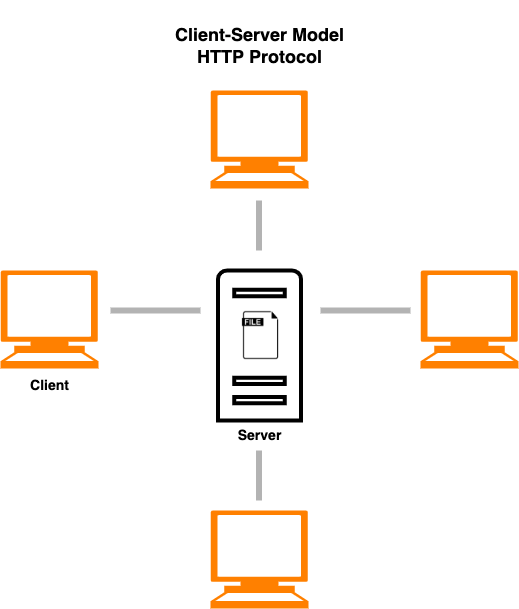
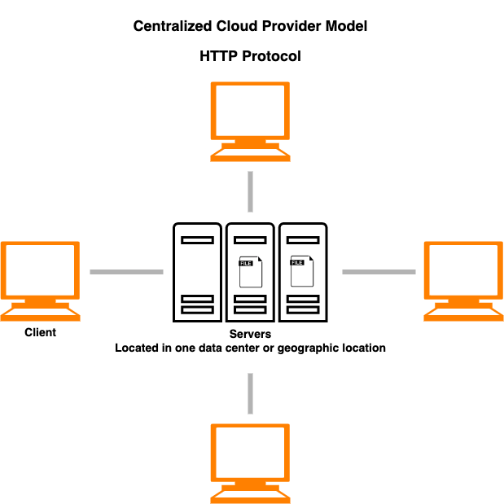
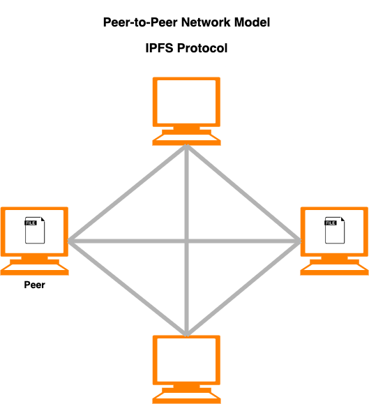
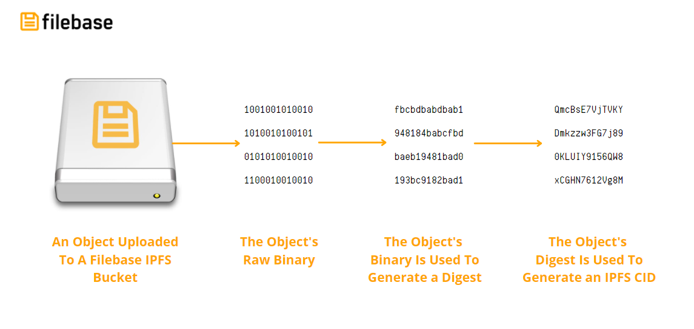
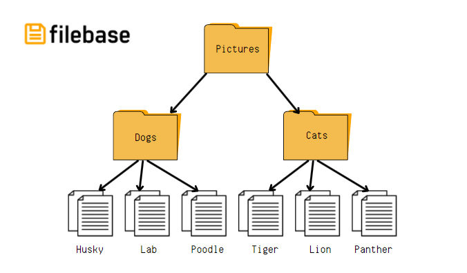
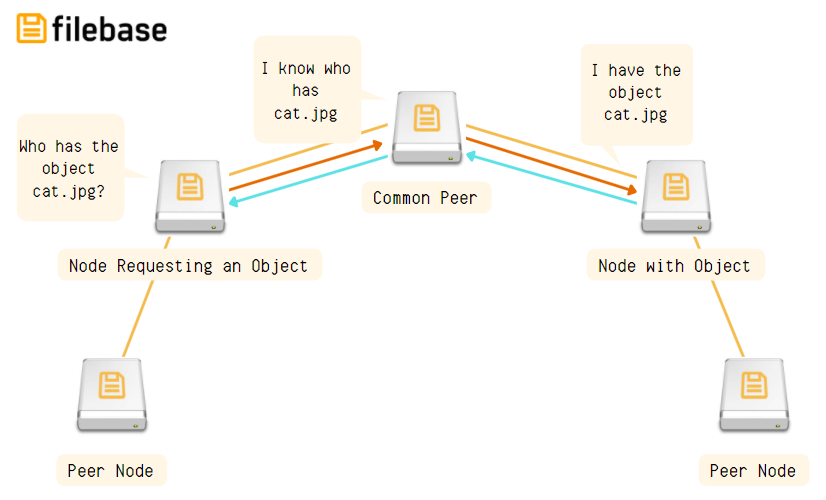
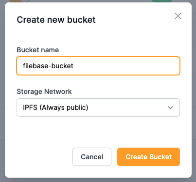
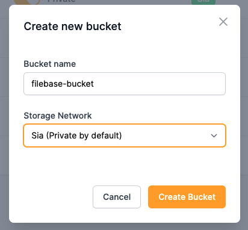

# 存储网络
# IPFS
详细了解 Filebase 与 IPFS 网络的集成。
## 什么是IPFS？
星际文件系统或 IPFS 是一种去中心化的点对点协议，使节点能够在彼此之间存储和传输文件。

IPFS 本身并不是一个网络，就像 Sia 等其他去中心化存储网络一样。IPFS 是一种通信协议，它概述了促进 IPFS 网络存在的工作流程和组件。IPFS 桌面客户端或 IPFS CLI 守护程序等软件为 IPFS 节点提供了与运行相同软件的其他节点交互的能力，从而创建了一个在它们之间存储和共享文件的对等网络。

本节简要概述 IPFS 及其工作原理。有关 IPFS 的详细技术说明，请查看我们的 IPFS 白皮书：
	
- [白皮书](https://docs.filebase.com/knowledge-base/whitepapers#filebase-ipfs-whitepaper)

## IPFS 与 HTTP
IPFS 类似于 HTTP，后者是我们目前在互联网上使用和创建内容的核心协议。IPFS 相对较新，与 HTTP 相比具有广泛的不同属性和优势。
	
	注意：本文中的 HTTP 指的是 HTTP 和 HTTPS。HTTPS 应该用于所有生产环境，以确保内容的最大安全性和可靠性。

- [建立在 IPFS 之上，而非 HTTPS](https://filebase.com/blog/build-using-ipfs-not-https/)	
为了弥合这两种协议之间的差距，IPFS HTTP 网关结合了这两种协议，允许您通过 HTTP 请求访问 IPFS 网络来使用和构建 IPFS。

## HTTP：客户端-服务器模型
传统上，当您访问网页时，有多种协议协同工作以将此网站提供给您。首先，DNS 协议找到绑定到域名的服务器的 IP 地址。然后，HTTP 用于从主机服务器请求网站。此工作流称为客户端-服务器模型。

虽然客户端-服务器模型处于当今我们如何与互联网交互和使用互联网的最前沿，但这种模型在设计上是集中式的，因此会带来诸如不可靠、缺乏弹性和单点故障等风险。客户端-服务器模型将所有责任都放在主机服务器上，以确保网站始终可用和可访问。如果主机服务器由于中断、灾难或硬件故障而关闭，则网站将变得无法访问和无法访问。

最值得注意的是，HTTP 协议仅将您对网站的请求发送到主机服务器，而不会将您的请求发送到其他服务器，如果主机服务器关闭，这些服务器可能能够响应。这是 HTTP 和 IPFS 的根本区别。

### 集中式云提供商呢？
网站和文件托管或存储的另一种模式是使用云提供商，如 AWS 或谷歌云。这是许多应用程序、网站和平台的常见工作流程，在这些应用程序、网站和平台中，云提供商通过 CDN 或存储服务等高级抽象将这些资产部署到多个服务器上，从而创建冗余和高可用性。不过，通常情况下，这些服务器都位于一个地理位置，大部分时间都在同一服务器机架或行中。这意味着虽然协议层可能有更多冗余，但对于数据中心范围内的中断、灾难或人为错误（如电缆意外断开连接），没有冗余。

云提供商解决方案是每个云提供商专有的，这意味着它们不是标准化的、开源的或可互操作的，因为这些解决方案部署在硬件或软件层而不是协议层。这造成了一种硬的供应商锁定，可以让客户留在一个供应商那里，即使它没有像另一个供应商那样使他们受益。

大型云提供商的另一个问题是，由于每个云提供商都有如此大的市场集中度，当发生硬件故障、火灾甚至人为错误等事情时，中断或灾难通常会产生不利影响。这种规模的中断通常会影响数以千计的网站、服务和平台，如果它们依赖于在中断中关闭的任何网站，则可能会导致更多服务中断。

### IPFS：点对点解决方案
IPFS 是一种点对点通信协议，这意味着每个客户端（也称为对等点或节点）都连接到每个其他对等点，而不是像在客户端-服务器模型中那样连接到主机服务器，以允许它同时充当客户端和服务器。使用此配置，任何对等点都可以为任何请求的文件或网站提供服务，并成为网络的高效成员，以提供高可用性、可靠性和对网络中断或中断的弹性。借助 IPFS，对等点能够汇集其资源，例如存储空间或互联网带宽，以确保文件始终可用、对中断具有弹性，最重要的是，去中心化。

## IPFS 是如何工作的？
IPFS 不同于其他去中心化存储网络，因为它提供了额外的功能和属性，例如内容寻址、有向非循环图形 (DAG) 和分布式哈希表 (DHT)。
### 通过内容寻址的唯一数据标识

存储在 IPFS 上的数据是通过其内容地址而不是其物理位置来定位的。当数据存储在 IPFS 上时，它存储在一系列加密的片段中，每个片段都有自己唯一的内容标识符或哈希。此散列用作标识符并将片段链接到该数据的所有其他片段。

通过其散列值来标识对象（例如对象或节点）称为内容寻址。散列标识符称为内容标识符或 CID。当对象上传到 Filebase 上的 IPFS 存储桶时，IPFS CID 会列在对象的元数据中，以便在任何工具或应用程序中轻松引用与 IPFS 网关一起使用。

在下面关于 CID 的深入文档中了解有关 IPFS CID 的更多信息：

- [IPFS 内容寻址](https://filebase.com/blog/ipfs-content-addressing-explained/)
- [IPFS CID](https://docs.filebase.com/ipfs/ipfs-cids)

### 通过有向无环图 (DAG) 进行内容链接

有向无环图 (DAG) 是一种分层数据结构。图是一种显示对象及其之间关系的方式。有向图是指图的边具有方向，如上图所示。无环图是一种图，其中的边具有确定的末端并且不会创建到其他对象的循环。想一想显示祖先及其彼此关系的家谱。这是有向无环图的一个很好的例子。

在这种情况下，图中的对象称为节点，边指的是图中对象之间的关系。

IPFS 使用 Merkle DAG，其中每个节点都有一个唯一标识符，该标识符是对节点内容进行哈希处理的结果。Merkle DAG 是一种自我验证的数据结构。

- [IPFS 有向无环图](https://filebase.com/blog/ipfs-directed-acyclic-graphs-explained/)

### 通过分布式哈希表 (DHT) 进行内容发现
分布式哈希表 (DHT) 是一种用于将键映射到其关联值的分布式系统。DHT 是键和值的数据库，分布在分布式网络上的所有对等点上。要查找内容，您可以询问网络上的对等点，它会返回一个 DHT，告诉您哪些对等点正在存储构成您请求的数据对象的哪些内容块。

- [ipfs 发布到 DHT](https://filebase.com/blog/ipfs-publishing-to-the-dht/)

## 内容寻址与位置寻址
客户端-服务器模型使用位置寻址来根据内容在 Internet 上的位置对内容进行寻址，通常是通过 IP 地址。位置地址由三部分组成，它们组合成一个 URL。这些部分是：

- Scheme：这是指用于提供地址的协议，通常是 HTTPS。
- Hostname：这是指映射到服务器IP地址的域名，比如 google.com
- Path：这是指文件在服务器上的位置，例如 /assets/images/image.png。

总而言之，URL 通常如下所示：

	https://google.com/assets/images/image.png
如果 URL 以任何方式更改（例如文件名更改或文件路径调整），位置寻址可能会导致服务内容出现问题。有时，服务器甚至可能不再托管所请求的文件，您会被带到损坏的网页或图像。

IPFS 使用内容寻址，因为一个文件可以同时托管在不同的 IPFS 节点上，试图通过一个位置来识别它可能是违反直觉的。

内容寻址是指存储在对等网络上的文件由文件内容的加密散列寻址。在 IPFS 中，此加密哈希被称为内容标识符或 CID。CID 是一串数字和字母，对于文件或文件夹内容的加密哈希是唯一的。

如果一个文件多次上传到 IPFS，如果那个文件的内容没有改变，每次上传都会返回相同的CID。

对文件内容的任何更改都将在上传时提供不同的 CID。这确保上传到 IPFS 的文件是不可变的，因为任何更改都会产生一个新的、唯一的内容标识符。

单个 CID 可以表示单个文件或文件文件夹，例如包含静态网站文件的文件夹。

## 如何创建 IPFS 桶
只需导航到 [Filebase](https://console.filebase.com/) ，[创建新桶](https://docs.filebase.com/getting-started-guides/getting-started-guide#creating-a-bucket)并选择 IPFS 选项。

## 本机 IPFS URL
本机支持 IPFS 内容寻址的应用程序可以引用存储在 IPFS 上的内容，格式如下：

	ipfs://{CID}/{optional path to resource}
此格式不适用于依赖 HTTP 的应用程序或工具，例如 Curl 或 Wget。对于这些工具，您需要使用 IPFS 网关。
## IPFS 网关
可以使用 IPFS 网关访问存储在 IPFS 上的内容。网关用于为本机不支持 IPFS 的应用程序提供解决方法。

有关 IPFS 网关的更多信息，请参见下文。

- [IPFS 网关](https://docs.filebase.com/ipfs/ipfs-gateways)

## IPFS 固定
通过内容寻址和内容标识符，任何 IPFS 对等点都可以检索任何给定的 CID，只要该文件由网络上的至少一个对等点提供服务即可。例如，如果您从 IPFS 节点请求 CID，而该节点没有托管该文件，它将在整个 IPFS 网络中搜索拥有该文件的节点。一旦找到对等点，它将获取与 CID 关联的文件并将其返回给您。

为确保至少有一个对等方托管该文件，IPFS 提供了一种称为固定的功能。IPFS pinning 是指在一个或多个 IPFS 节点上指定要保留和持久化的数据的过程。固定确保数据可以无限期访问，并且不会在 IPFS 垃圾收集过程中被删除。

当文件和数据存储在 IPFS 网络上时，网络上的节点会缓存它们下载的文件，并使这些文件可供网络上的其他节点使用。由于这些节点上的存储是有限的，因此必须定期清除每个节点的缓存，以便为要缓存的新文件腾出空间并使其可用。为 IPFS 节点清除缓存的过程称为 IPFS 垃圾收集过程。

- [为什么 pinning 很重要](https://filebase.com/blog/ipfs-why-does-pinning-matter-anyway/)

### IPFS 固定服务
Filebase 提供 IPFS 固定服务，其中上传到 Filebase IPFS 存储桶的所有文件都会自动固定在 Filebase 基础设施内的 3 个不同的 IPFS 节点上。这确保了 Filebase 基础设施上所有 IPFS 固定文件的 3 倍冗余，以实现高可用性、弹性和可靠性。

一些固定服务提供商不会将提供商记录发布到 IPFS DHT 或分布式哈希表。

- DHT 负责维护一个分布式系统，该系统将键映射到值，并将用户请求的 CID 映射到托管该内容的对等点。
- DHT 本质上是一个大表，用于存储 CID 及其关联的存储对等体。

Filebase 将我们的提供商记录发布到 IPFS DHT，以便在请求时获得最佳性能和 CID 检索时间。

在此处了解有关如何使用 Filebase 将文件固定到 IPFS 的更多信息：

- [IPFS 固定](https://docs.filebase.com/ipfs/ipfs-pinning)

# Sia
详细了解 Filebase 与 Sia 网络的集成。
## 什么是Sia？
Sia 是一个开源去中心化存储网络，它利用区块链技术创建一个安全且冗余的云存储平台。

Filebase 作为节点运营商直接与 Sia 合作，这意味着 Filebase 代表 Filebase 用户管理所有存储合约。[上传到 Filebase Sia 存储桶的每个对象都使用 Reed-Solomon EC ](https://en.wikipedia.org/wiki/Reed%E2%80%93Solomon_error_correction)分成多个部分，该编码具有 30 取 10 的算法。对象被分成 30 个部分，然后在地理上分布到世界各地的 Sia 主机服务器。30 个文件中只有 10 个可用才能处理下载请求。这意味着对象的 20 个部分可以被销毁、脱机或以其他方式不可用，从而创建本机冗余和高可用性。

从下面的视频中了解更多关于 Sia 的信息。

## 如何通过 Filebase 在 Sia 上存储数据？
只需导航到您的 [控制台](https://console.filebase.com/)，[创建一个新桶](https://docs.filebase.com/getting-started/getting-started-guide#creating-a-bucket), 然后选择 Sia 选项。

