# Unity
	了解如何配置 Unity 以与 Filebase 一起使用。
## 什么是 Unity？
Unity 是一种流行的游戏设计和开发引擎，可用于创建各种 2D 和 3D 游戏。适用于 .NET 的 AWS 开发工具包可用于 Unity 与 Filebase 交互。

阅读下文以了解如何将 Unity 与 Filebase 结合使用。

- 先决条件：
	- 下载安装 Unity Hub。
	- 注册一个免费的 Filebase 帐户。
	- 拥有您的Filebase访问权限和密钥。了解如何查看您的访问密钥。
	- 创建Filebase存储桶。了解如何创建存储桶。

特别感谢 Nervos Network 的 Eric Vander Wal 将此 SDK 的 GitHub 脚本库放在一起，创建了一个视频教程来展示本教程，可在[此处查看](https://youtu.be/PqcoJ5663KQ?t=1053)。

1. 打开 Unity Hub 应用程序。

	使用您的 Unity 帐户登录，然后选择“项目”。选择“新建项目”以创建新项目，或选择您要使用的现有项目。
	
	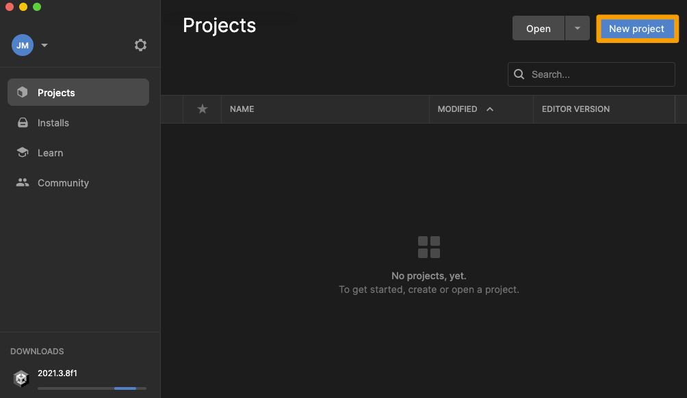
2. 选择一个项目模板，然后创建一个新项目。

	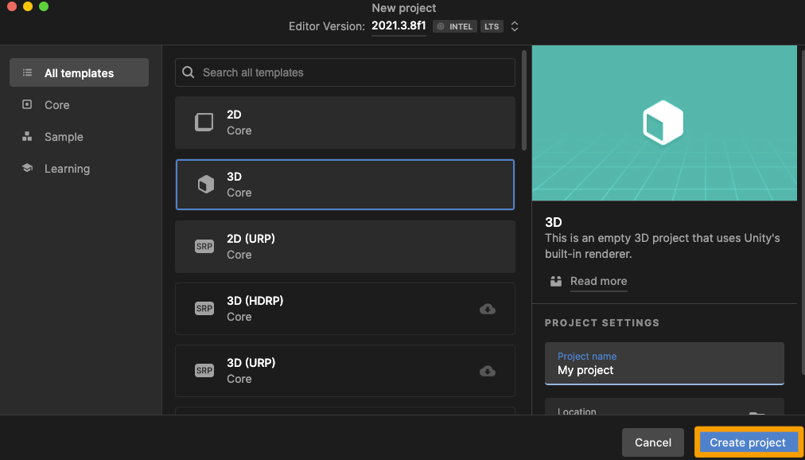
3. 接下来，下载经过修改以用于 Filebase 的以下 Unity SDK 包：

		git clone https://github.com/ericvanderwal/UnityFilebaseSDK.git
4. 接下来，打开Unity Filebase SDK目录。

	导航到 Assets 目录，然后单击 FilebaseSDK 文件夹并将其拖动到 Unity 项目的 Assets 文件夹中。
	
	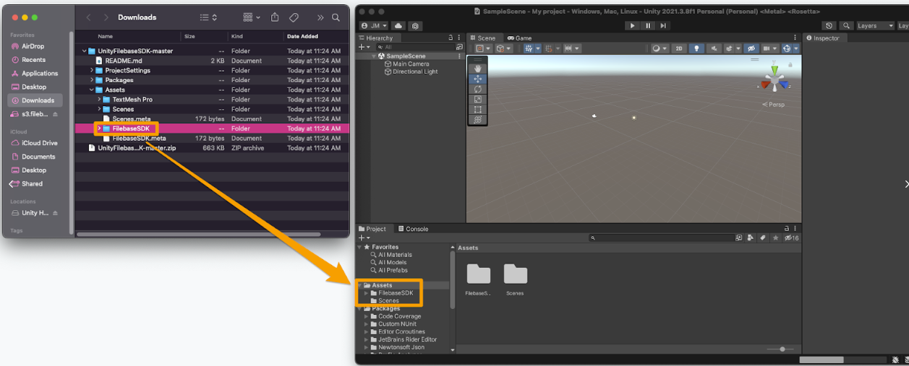
5. 打开 FilebaseSDK 文件夹，然后导航到 Filebase 子目录。

	在里面，你会发现一个 Script 和一个 Sample 文件夹。Scripts 包含用于与 Filebase 交互的必要功能脚本，并 Samples 包含可以使用的示例 Unity 项目和脚本。
	
	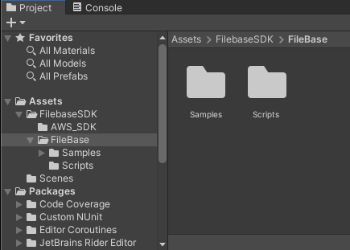
6. 在使用任何示例项目之前，打开 Scripts 目录，然后打开 Paths 文件。

	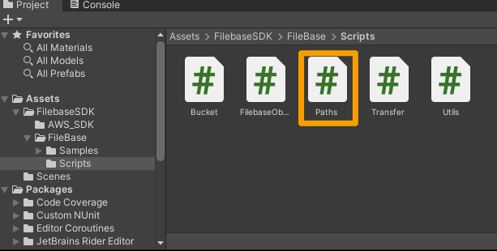
7. 在 Paths 文件中，替换以下变量以反映您的 Filebase Access Key 和 Secret Key

		public const string AccessKey = "FILEBASE_ACCESS_KEY";
		public const string SecretKey = "FILEBASE_SECRET_KEY";
8. 接下来，从项目的层次结构中选择“Filebase Example”，然后在右侧栏菜单中选择“Add Component”。

	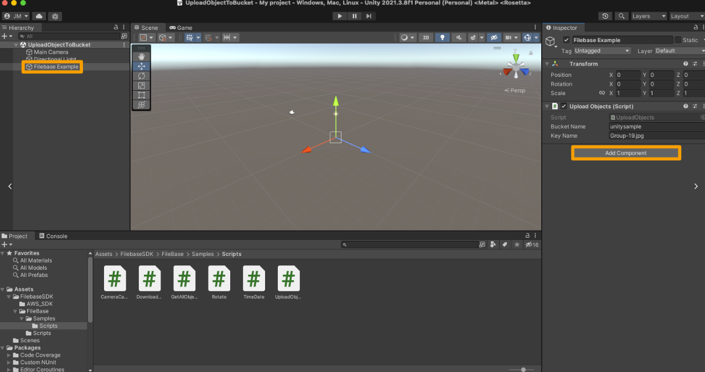
9. 选择“脚本”，然后选择“获取所有对象”脚本。此脚本将返回指定存储桶中的所有对象。

	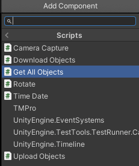
10. 输入您的Filebase存储桶名称。

	然后选择“控制台”选项卡以查看控制台输出，然后选择屏幕顶部中央的“播放”按钮以运行您的脚本。
	
	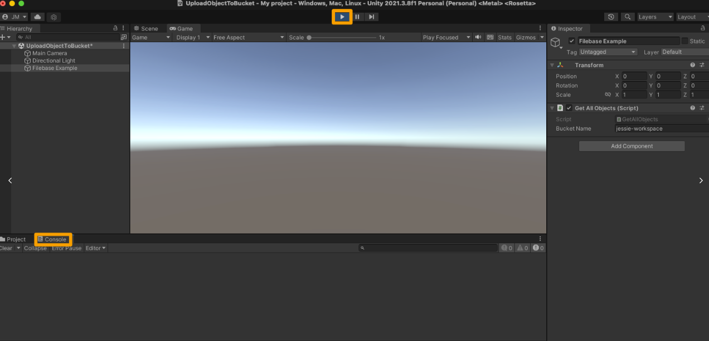
11. 指定桶中的所有对象名称将返回到控制台。

	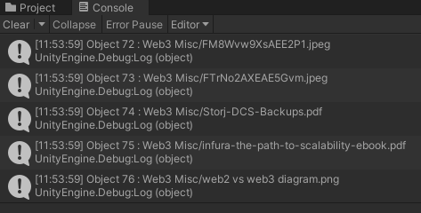
12. 接下来，添加另一个新组件，再次选择“Scripts”，然后选择“DownloadObjects”脚本。

	输入您的Filebase存储桶名称和要下载的对象名称。
	
	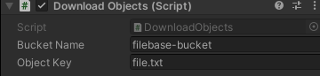
13. 选择“控制台”选项卡查看控制台输出，然后选择屏幕顶部中央的“播放”按钮运行您的脚本。

	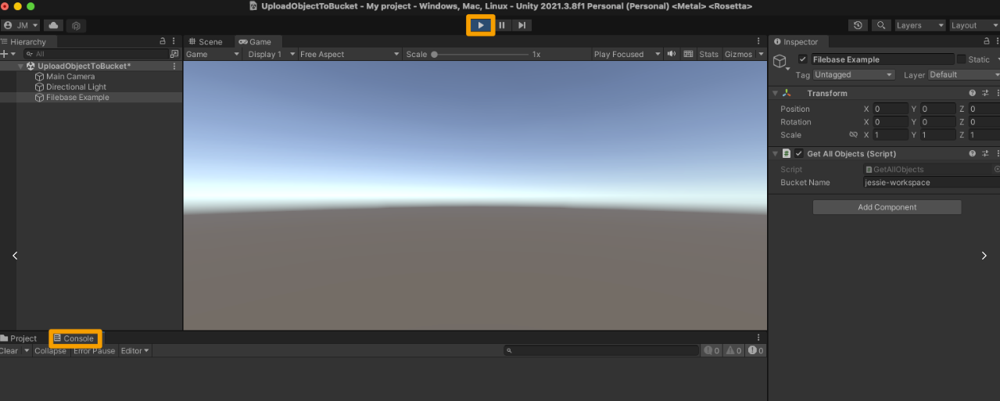
14. 控制台输出将包括文件下载到的位置。

	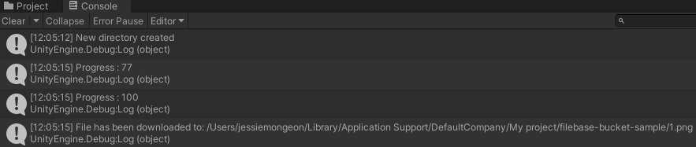
15. 接下来，添加另一个新组件，再次选择 “Scripts”，然后选择 “UploadObjects” 脚本。

	输入您的Filebase存储桶名称和要上传的项目文件。此示例使用位于的文件 `Assets/Scenes/SampleScene.unity`。
	
	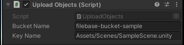
16. 选择“控制台”选项卡查看控制台输出，然后选择屏幕顶部中央的“播放”按钮运行您的脚本。

	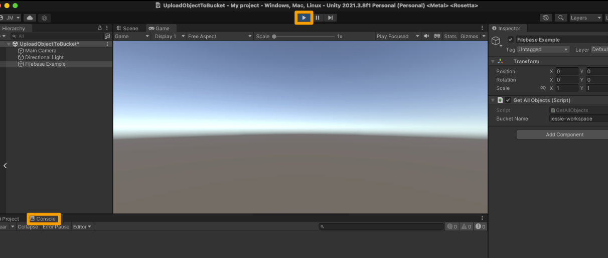
17. 控制台将返回确认文件已上传。

	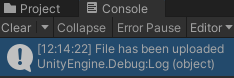
18. 在 Hierarchy 窗口中右键单击，选择“UI > Button - TextMeshPro”

	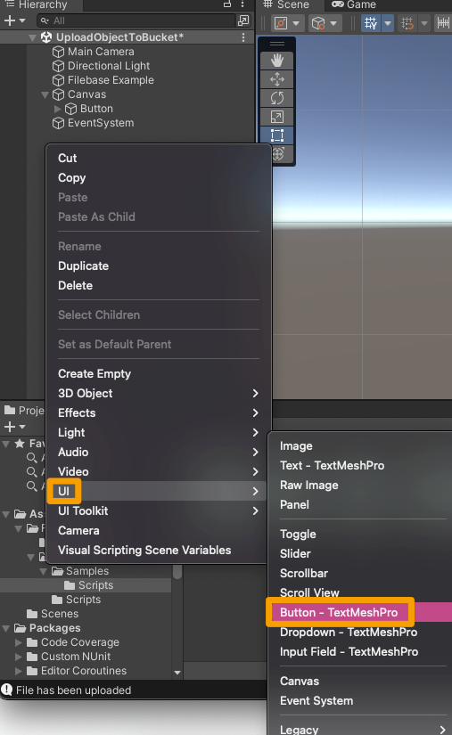
19. 出现提示时，选择“导入 TMP Essentials”按钮。

	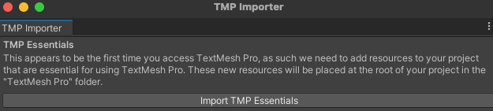
20. 然后选择“Filebase Example”组件，然后添加另一个新组件，选择“Scripts”，然后选择“Camera Capture”脚本。

	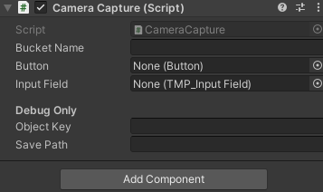
21. 输入您的 Filebase 存储桶名称，然后选择您新创建的按钮及其关联的输入字段。

	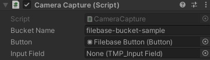
22. 从窗口中央选择运行按钮，然后在场景窗口中单击您的按钮。

	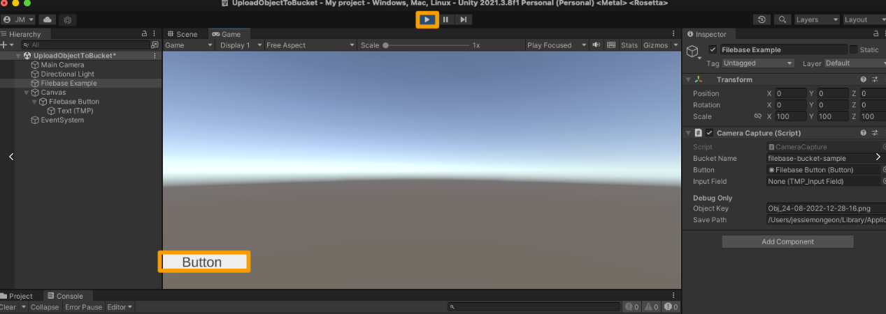
此按钮截取当前工作区的屏幕截图并创建它的图像文件。

这些脚本中的每一个都可以重新用于将不同的游戏资产上传和下载到 Filebase。