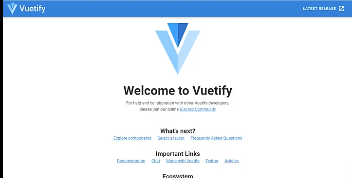
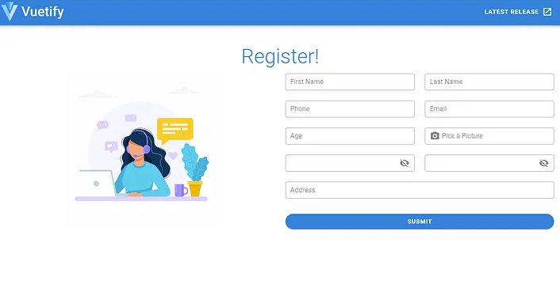

# Vue
	了解如何配置 Vue 以与 Filebase 一起使用。
## 什么是 Vue？
Vue 是一种开源 JavaScript 框架，用于构建用户界面和单页应用程序 (SPA)。Vue 被设计为可逐步采用，这意味着它可以集成到现有项目中或用于从头开始构建新项目。它还是高度模块化的，具有一个专注于应用程序视图层的核心库和一组可用于添加更多功能的可选库。

阅读下文以了解如何将 Vue 与 Filebase 一起使用。

- 先决条件：
	- 在您的服务器上下载安装 MongoDB。
	- 下载安装 NodeJS 和 NPM。
	- 有一个 IDE 或文本编辑器来更改代码片段。
	- 注册一个免费的 Filebase 帐户。
	- 拥有您的文件库访问权限和密钥。了解如何查看您的访问密钥。
	- 创建一个文件库 IPFS 桶。了解如何创建存储桶。

## 步骤
1. 首先为您的 Vue 应用程序创建一个新目录，然后导航到该目录并初始化工作区：

		mkdir filebase-vue-app
		cd filebase-vue-app
		npm init

	出现提示时接受默认选项。
2. 接下来，安装以下软件包：

		npm install --save express multer dotenv cors body-parser mongodb multer-s3 aws-sdk
3.使用以下环境变量创建一个文件：`.env`

		DATABASE=mongodb://127.0.0.1:27017/
		PORT=5005
		AWSAccessKeyId=FILEBASE_ACCESS_KEY
		AWSSecretKey=FILEBASE_SECRET_KEY
		AWSRegion=us-east-1
		AWSBucket=filebase-bucket-name

	将环境变量值替换为与您的 Filebase 帐户和 MongoDB 配置匹配的值。
4. 创建一个名为的新文件index.js，其中包含以下代码：

		const express = require('express')
		const bodyParser = require('body-parser')
		const cors = require('cors')
		const dotenv = require('dotenv')
		const aws = require('aws-sdk')
		const multer = require('multer')
		const multerS3 = require('multer-s3')
		const mongodb = require('mongodb')
		
		dotenv.config()
		const app = express()
		//middleWare
		app.use(bodyParser.json())
		app.use(bodyParser.urlencoded({ extended: true }))
		app.use(cors())
		
		aws.config.update({
		  apiVersion: "2006-03-01",
		  accessKeyId: process.env.AWSAccessKeyId,
		  secretAccessKey: process.env.AWSSecretKey,
		  region: process.env.AWSRegion
		  endpoint: "https://s3.filebase.com",
		})
		
		const s3 = new aws.S3()
		
		const upload = multer({
		  storage: multerS3({
		    s3: s3,
		    bucket: process.env.AWSBucket,
		    acl: "public-read",
		    contentType: multerS3.AUTO_CONTENT_TYPE,
		    metadata: (req, file, cb) => {
		      cb(null, { fieldName: file.fieldname})
		    },
		    key: (req, file, cb) => {
		      cb(null, Date.now().toString() + file.originalname)
		    }
		  })
		})
		
		app.get('/', async (req, res) => {
		  res.status(200).send('S3 Upload Backend')
		})
		
		app.post('/', upload.single('photo'), async (req, res) => {
		  try {
		    const users = await loadUsersCollection();
		    await users.insertOne({
		      first_name: req.body.first_name,
		      last_name: req.body.last_name,
		      phone: req.body.phone,
		      email: req.body.email,
		      gender: req.body.gender,
		      photo: req.file.location,
		    })
		    res.status(201).send('success')
		  }
		  catch (err) {
		    res.status(500).send({
		      error: 'error occured creating user'
		    })
		  }
		})
		async function loadUsersCollection () {
		  const client = await mongodb.MongoClient.connect(process.env.DATABASE, {
		    useNewUrlParser: true,
		    useUnifiedTopology: true
		  })
		  return client.db('vue-multers3').collection('users')
		}
		
		const port = process.env.PORT || 5000
		app.listen(port, () => {
		  console.log(server started on port ${port})
		});

5. 然后，使用以下命令启动服务器：

		node index.js
6. 接下来安装 Vue 包，开始 Vue 应用前端：

		npm install -g @vue/cli
7. 然后，使用以下命令创建一个新的 Vue 应用程序：

		vue create filebase-vue-app
8. 在新的 Vue 应用程序目录中导航并添加 Vuetify 包：

		cd vue-multers3-frontend
		vue add vuetify
9. 然后，用命令启动 Vue 前端：

		npm run serve
10. 导航到 localhost:8080 查看 vue app 的地址

	
11. 接下来，在组件文件夹中创建一个名为 `register.vue` 的新文件。 将以下代码插入到该文件中：

		<template>
		  <v-container fluid class="my-3">
		    <v-row align="center" justify="center">
		      <v-col cols="12">
		        <v-card style="width: 100%" flat>
		          
<h1 class="font-weight-light display-2 primary--text">Register!</h1>

		          <v-row class="pa-4">
		            <v-col cols="12" md="6">
		              <v-img src="@/assets/contactus.jpg" class="d-block ml-auto mr-auto" max-width="350px" />
		            </v-col>
		            <v-col cols="12" md="6">
		              <v-form ref="forma" v-model="form1" lazy-validation>
		                <v-row>
		                  <v-col
		                    cols="12"
		                    md="6"
		                  >
		                    <v-text-field
		                      v-model="first_name"
		                      label="First Name"
		                      outlined
		                      dense
		                      hide-details
		                    ></v-text-field>
		                  </v-col>
		                  <v-col
		                    cols="12"
		                    md="6"
		                  >
		                    <v-text-field
		                      v-model="last_name"
		                      label="Last Name"
		                      outlined
		                      dense
		                      hide-details
		                    ></v-text-field>
		                  </v-col>
		                  <v-col
		                    cols="12"
		                    md="6"
		                  >
		                    <v-text-field
		                      v-model="phone"
		                      label="Phone"
		                      outlined
		                      dense
		                      hide-details
		                    ></v-text-field>
		                  </v-col>
		                  <v-col
		                    cols="12"
		                    md="6"
		                  >
		                    <v-text-field
		                      v-model="email"
		                      label="Email"
		                      outlined
		                      dense
		                      hide-details
		                    ></v-text-field>
		                  </v-col>
		                  <v-col
		                    cols="12"
		                    md="6"
		                  >
		                    <v-text-field
		                      v-model="age"
		                      type="number"
		                      label="Age"
		                      outlined
		                      dense
		                      hide-details
		                    ></v-text-field>
		                  </v-col>
		                  <v-col
		                    cols="12"
		                    md="6"
		                  >
		                    <v-file-input
		                      v-model="photo"
		                      :rules="photoRules"
		                      accept="image/png, image/jpeg"
		                      label="Pick a Picture"
		                      outlined
		                      dense
		                      prepend-icon=""
		                      prepend-inner-icon="mdi-camera"
		                      hide-details
		                    >
		                    </v-file-input>
		                  </v-col>
		                  <v-col
		                    cols="12"
		                    md="6"
		                  >
		                    <v-text-field
		                      v-model="password"
		                      :append-icon="show1 ? 'mdi-eye' : 'mdi-eye-off'"
		                      :rules="passwordRules"
		                      :type="show1 ? 'text' : 'password'"
		                      hint="At least 6 characters"
		                      @click:append="show1 = !show1"
		                      outlined
		                      dense
		                      hide-details
		                    >
		                    </v-text-field>
		                  </v-col>
		                  <v-col
		                    cols="12"
		                    md="6"
		                  >
		                    <v-text-field
		                      v-model="confirmPassword"
		                      :append-icon="show1 ? 'mdi-eye' : 'mdi-eye-off'"
		                      :rules="passwordConfirmation"
		                      :type="show1 ? 'text' : 'password'"
		                      hint="At least 6 characters"
		                      @click:append="show1 = !show1"
		                      outlined
		                      dense
		                      hide-details
		                    >
		                    </v-text-field>
		                  </v-col>
		                  <v-col
		                    cols="12"
		                    md="12"
		                  >
		                    <v-text-field
		                      v-model="address"
		                      label="Address"
		                      outlined
		                      dense
		                      hide-details
		                    ></v-text-field>
		                  </v-col>
		                  <v-col
		                    cols="12"
		                  >
		                    <v-btn
		                      color="primary"
		                      rounded
		                      block
		                      class="mt-3"
		                      @click="onSubmit"
		                      :disabled="!form1"
		                    >
		                      Submit
		                    </v-btn>
		                  </v-col>
		                </v-row>
		              </v-form>
		            </v-col>
		          </v-row>
		        </v-card>
		      </v-col>
		    </v-row>
		    <v-snackbar
		      v-model="snackbar"
		      :timeout="timeout"
		      color="success"
		      top
		    >
		      {{ message }}
		    </v-snackbar>
		  </v-container>
		</template>
		
		
		
		

12. 然后，在文件中插入以下代码app.vue：

		<template>
		  <v-app>
		    <v-app-bar
		      app
		      color="primary"
		      dark
		    >
		      

		        <v-img
		          alt="Vuetify Logo"
		          class="shrink mr-2"
		          contain
		          src="<https://cdn.vuetifyjs.com/images/logos/vuetify-logo-dark.png>"
		          transition="scale-transition"
		          width="40"
		        />
		
		        <v-img
		          alt="Vuetify Name"
		          class="shrink mt-1 hidden-sm-and-down"
		          contain
		          min-width="100"
		          src="<https://cdn.vuetifyjs.com/images/logos/vuetify-name-dark.png>"
		          width="100"
		        />
		      

		
		      <v-spacer></v-spacer>
		
		      <v-btn
		        href="<https://github.com/vuetifyjs/vuetify/releases/latest>"
		        target="_blank"
		        text
		      >
		        Latest Release
		        <v-icon>mdi-open-in-new</v-icon>
		      </v-btn>
		    </v-app-bar>
		
		    <v-main>
		      <Register/>
		    </v-main>
		  </v-app>
		</template>
		
		

13. 如果你刷新你的 Vue 应用程序，它现在应该像这样：

	
14. 接下来，安装axois包

		npm install axios
15. 然后，在组件文件夹中创建文件 `registeraxios.vue` 并插入以下代码

		<template>
		      <v-container fluid class="my-3">
		        <v-row align="center" justify="center">
		          <v-col cols="12">
		            <v-card style="width: 100%" flat>
		              
<h1 class="font-weight-light display-2 primary--text">Register!</h1>

		              <v-row class="pa-4">
		                <v-col cols="12" md="6">
		                  <v-img src="@/assets/contactus.jpg" class="d-block ml-auto mr-auto" max-width="350px" />
		                </v-col>
		                <v-col cols="12" md="6">
		                  <v-form ref="forma" v-model="form1" lazy-validation>
		                    <v-row>
		                      <v-col
		                        cols="12"
		                        md="6"
		                      >
		                        <v-text-field
		                          v-model="first_name"
		                          label="First Name"
		                          outlined
		                          dense
		                          hide-details
		                        ></v-text-field>
		                      </v-col>
		                      <v-col
		                        cols="12"
		                        md="6"
		                      >
		                        <v-text-field
		                          v-model="last_name"
		                          label="Last Name"
		                          outlined
		                          dense
		                          hide-details
		                        ></v-text-field>
		                      </v-col>
		                      <v-col
		                        cols="12"
		                        md="6"
		                      >
		                        <v-text-field
		                          v-model="phone"
		                          label="Phone"
		                          outlined
		                          dense
		                          hide-details
		                        ></v-text-field>
		                      </v-col>
		                      <v-col
		                        cols="12"
		                        md="6"
		                      >
		                        <v-text-field
		                          v-model="email"
		                          label="Email"
		                          outlined
		                          dense
		                          hide-details
		                        ></v-text-field>
		                      </v-col>
		                      <v-col
		                        cols="12"
		                        md="6"
		                      >
		                        <v-text-field
		                          v-model="age"
		                          type="number"
		                          label="Age"
		                          outlined
		                          dense
		                          hide-details
		                        ></v-text-field>
		                      </v-col>
		                      <v-col
		                        cols="12"
		                        md="6"
		                      >
		                        <v-file-input
		                          v-model="photo"
		                          :rules="photoRules"
		                          accept="image/png, image/jpeg"
		                          label="Pick a Picture"
		                          outlined
		                          dense
		                          prepend-icon=""
		                          prepend-inner-icon="mdi-camera"
		                          hide-details
		                        >
		                        </v-file-input>
		                      </v-col>
		                      <v-col
		                        cols="12"
		                        md="6"
		                      >
		                        <v-text-field
		                          v-model="password"
		                          :append-icon="show1 ? 'mdi-eye' : 'mdi-eye-off'"
		                          :rules="passwordRules"
		                          :type="show1 ? 'text' : 'password'"
		                          hint="At least 6 characters"
		                          @click:append="show1 = !show1"
		                          outlined
		                          dense
		                          hide-details
		                        >
		                        </v-text-field>
		                      </v-col>
		                      <v-col
		                        cols="12"
		                        md="6"
		                      >
		                        <v-text-field
		                          v-model="confirmPassword"
		                          :append-icon="show1 ? 'mdi-eye' : 'mdi-eye-off'"
		                          :rules="passwordConfirmation"
		                          :type="show1 ? 'text' : 'password'"
		                          hint="At least 6 characters"
		                          @click:append="show1 = !show1"
		                          outlined
		                          dense
		                          hide-details
		                        >
		                        </v-text-field>
		                      </v-col>
		                      <v-col
		                        cols="12"
		                        md="12"
		                      >
		                        <v-text-field
		                          v-model="address"
		                          label="Address"
		                          outlined
		                          dense
		                          hide-details
		                        ></v-text-field>
		                      </v-col>
		                      <v-col
		                        cols="12"
		                      >
		                        <v-btn
		                          color="primary"
		                          rounded
		                          block
		                          class="mt-3"
		                          @click="onSubmit"
		                          :disabled="!form1"
		                        >
		                          Submit
		                        </v-btn>
		                      </v-col>
		                    </v-row>
		                  </v-form>
		                </v-col>
		              </v-row>
		            </v-card>
		          </v-col>
		        </v-row>
		        <v-snackbar
		          v-model="snackbar"
		          :timeout="timeout"
		          color="success"
		          top
		        >
		          {{ message }}
		        </v-snackbar>
		      </v-container>
		    </template>
		    
		    
		    
		    
	    
16. 现在，当用户在 Vue 应用程序中提交表单时，他们包含在表单中的图像文件将上传到配置的 Filebase 存储桶中！