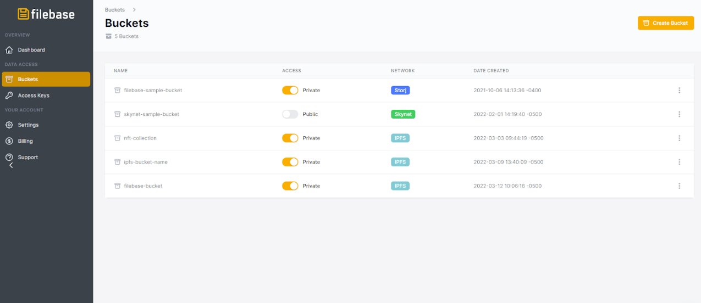
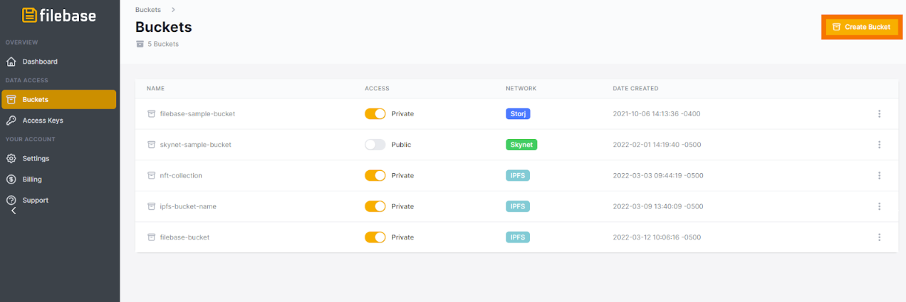
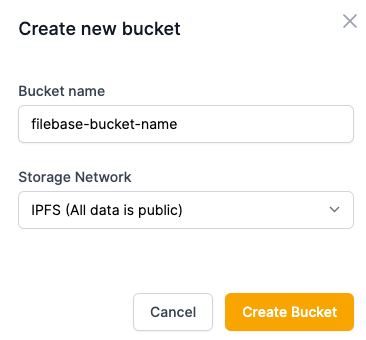

# 适用于 Go 的 AWS 开发工具包
	了解如何使用适用于 Golang 的 AWS 开发工具包将文件和文件夹固定到 IPFS。
## 什么是 AWS 开发工具包 - Go？
AWS SDK（软件开发工具包）通过支持和提供与 S3 兼容服务一起使用的代码对象，帮助简化编码和应用程​​序开发。有多种不同的 AWS 开发工具包，每种都适用于不同的编码语言。本指南涵盖 AWS 开发工具包 - Go。
## 什么是 .car 文件？
.car 文件是一种包含多个文件的压缩存档文件，类似于 ZIP 文件。.car 文件由 FileCoin 和 IPFS 网络使用，它们利用元数据字段将每个文件的 IPFS CID 包含在存档中。

阅读下文以了解如何使用适用于 Golang 的 AWS 开发工具包将文件和文件夹固定到 IPFS。

- 先决条件：
	- 下载并安装 AWS CLI。
	- 配置 AWS CLI 以与您的 Filebase 帐户一起使用。
	- 在您的环境中下载安装 go
	- 下载并安装适用于 Go 的 AWS 开发工具包。
	- 注册一个免费的 Filebase 帐户。
	- 拥有您的文件库访问权限和密钥。了解如何查看您的访问密钥。

## 将单个文件固定到 IPFS
1. 单击菜单中的“Buckets”选项以打开 Buckets 仪表板。

	
2. 进入 Buckets 仪表板后，单击右上角的“Create Bucket”选项创建一个新的 bucket。

	
3. 输入存储桶名称并选择您的存储网络。

	
4. 使用以下适用于 Golang 代码的 AWS 开发工具包创建一个新文件：

	以下代码示例将对象上传到指定的存储桶。替换代码中的以下值以匹配您的配置：
	
	- `filebase-access-key` 您的文件库访问密钥
	- `filebase-secret-key` 你的文件库密钥
	- `bucket-name` 您的文件库存储桶名称
	-  `/path/to/object/to/upload`  上传到 IPFS 的文件路径
	-  `object-name` 要上传的对象的名称

code

		package main
		
		import (
			"fmt"
			"github.com/aws/aws-sdk-go/aws"
			"github.com/aws/aws-sdk-go/aws/session"
			"github.com/aws/aws-sdk-go/aws/credentials"
			"github.com/aws/aws-sdk-go/service/s3"
			"os"
		)
		
		func main() {
		//// 创建一个配置
			s3Config := aws.Config{
			Credentials:      credentials.NewStaticCredentials("filebase-access-key", "filebase-secret-key", ""),
			Endpoint:         aws.String("https://s3.filebase.com"),
			Region:           aws.String("us-east-1"),
			S3ForcePathStyle: aws.Bool(true),
		}
		
		// 创建一个session 使用配置
		goSession, err := session.NewSessionWithOptions(session.Options{
			Config:  s3Config,
			Profile: "filebase",
		})
		
		// 检查 session 是否存在.
		
		if err != nil {
			fmt.Println(err)
		}
		
		// 创建一个s3 session
		s3Client := s3.New(goSession)
		
		//设置文件上传路径
		file, err := os.Open("/path/to/object/to/upload")
		if err != nil {
			fmt.Println(err.Error())
		return
		}
		
		defer file.Close()
		// 创建输入对象输入
			putObjectInput := &s3.PutObjectInput{
			Body:   file,
			Bucket: aws.String("bucket-name"),
			Key:    aws.String("object-name"),
		}
		
		// 上传文件
		_, err = s3Client.PutObject(putObjectInput)
		
		// print if there is an error
		if err != nil {
			fmt.Println(err.Error())
		return
		}
		}

## 使用适用于 Golang 的 AWS 开发工具包将文件夹固定到 IPFS
1. 使用以下命令下载 ipfs-car 包：

		git clone https://github.com/web3-storage/ipfs-car
2. 安装 ipfs-car 包：

		npx ipfs-car
3. 接下来，使用 ipfs-car 将一个文件夹的文件打包成一个 .car 文件。

	这已通过包含 10,000 个或更多文件的 .car 档案进行了测试。根据您所需的工作流程，使用以下任一命令：

	- 将 .car 文件写入当前工作目录

			ipfs-car --pack path/to/file/or/dir
	- 将 .car 文件写入具有指定名称的特定目录

			ipfs-car --pack path/to/files --output path/to/write/ipfs-car.car
4. 使用以下适用于 Golang 代码的 AWS 开发工具包创建一个新文件：

	以下代码示例将对象上传到指定的存储桶。替换代码中的以下值以匹配您的配置：

	- `filebase-access-key` 您的文件库访问密钥
	- `filebase-secret-key` 你的文件库密钥
	- `bucket-name` 您的文件库存储桶名称
	- `/path/to/object/to/upload`  上传到 IPFS 的文件路径
	- `Object-name`要上传的 .car 文件的名称

code
	
	package main
	
	import (
		"fmt"
		"github.com/aws/aws-sdk-go/aws"
		"github.com/aws/aws-sdk-go/aws/session"
		"github.com/aws/aws-sdk-go/aws/credentials"
		"github.com/aws/aws-sdk-go/service/s3"
		"os"
	)
	
	func main() {
	//// 创建一个配置
		s3Config := aws.Config{
		Credentials:      credentials.NewStaticCredentials("filebase-access-key", "filebase-secret-key", ""),
		Endpoint:         aws.String("https://s3.filebase.com"),
		Region:           aws.String("us-east-1"),
		S3ForcePathStyle: aws.Bool(true),
	}
	
	// 创建一个新的 session 使用配置
	goSession, err := session.NewSessionWithOptions(session.Options{
		Config:  s3Config,
		Profile: "filebase",
	})
	
	// 检查 session 是否已经创建
	
	if err != nil {
		fmt.Println(err)
	}
	
	// 创建一个 s3 客户端 session
	s3Client := s3.New(goSession)
	
	// 设置文件上传路径
	file, err := os.Open("/path/to/object/to/upload")
	if err != nil {
		fmt.Println(err.Error())
	return
	}
	
	defer file.Close()
	// 创建上传对象输入
		putObjectInput := &s3.PutObjectInput{
		Body:   file,
		Bucket: aws.String("bucket-name"),
		Key:    aws.String("ipfs-car.car"),
	}
	
	// 上传文件
	_, err = s3Client.PutObject(putObjectInput)
	
	// print if there is an error
	if err != nil {
		fmt.Println(err.Error())
	return
	}
	}