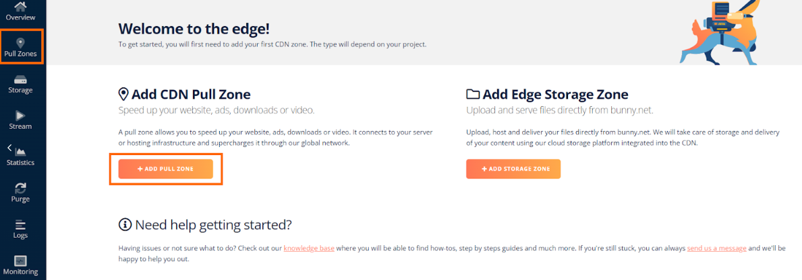
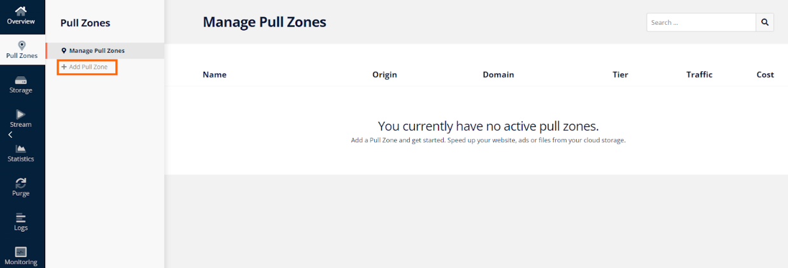
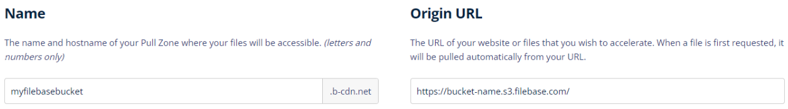
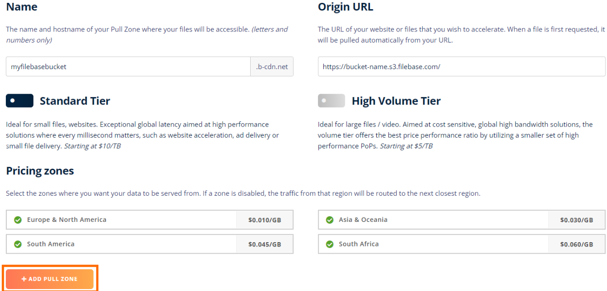
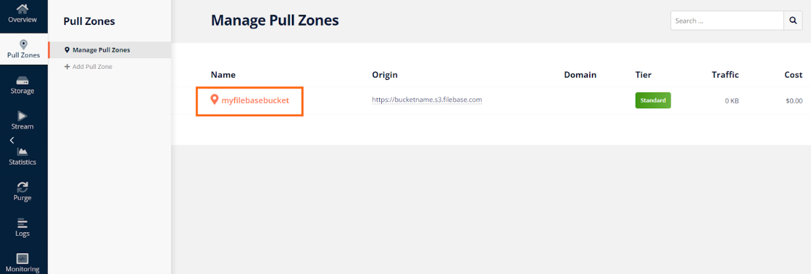
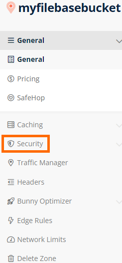
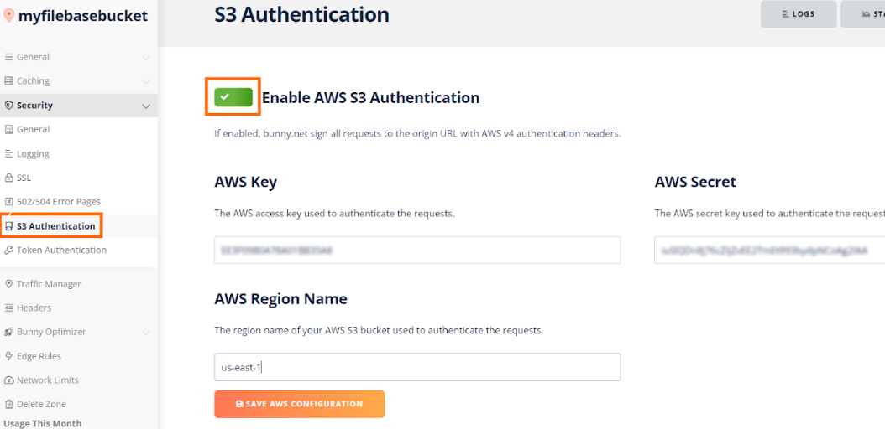

# BunnyCDN
	了解如何配置 BunnyCDN 以与 Filebase 一起使用。
## 什么是 BunnyCDN？
BunnyCDN 是内容分发网络提供商。

内容交付网络是一个跨越不同地理位置的服务器网络，有助于提高内容交付的速度和质量。CDN 允许快速传输内容类型，例如 HTML 网页、图像、视频、电子表格和 JavaScript 应用程序。CDN 还可以帮助缓解和保护网站免受分布式拒绝服务攻击 (DDoS)。

了解如何将您的 Filebase 存储桶连接到 BunnyCDN 以提高与您的存储桶之间的文件传输速度。

- 先决条件：
	- 拥有一个 BunnyCDN 帐户。创建一个。
	- 注册一个免费的 Filebase 帐户。
	- 拥有您的文件库访问权限和密钥。了解如何查看您的访问密钥。
	- 创建文件库存储桶。了解如何创建存储桶。
	- 您的 Filebase 存储桶必须是公开的。了解如何公开您的存储桶。

## 步骤
1. 公开您的 Filebase 存储桶后，您将需要该存储桶的公共 URL。

	URL 格式如下，其中 `bucket-name` 是您的存储桶的名称：

		https://bucket-name.s3.filebase.com
2. 登录你的 Bunny CDN 账户。

	从仪表板的欢迎屏幕中选择“添加拉区”，或在左侧菜单中选择“拉区”。
	
	
3. 在“管理拉区”屏幕中，选择左侧的“添加拉区”。

	
4. 在“名称”下，为您的拉动区提供一个名称。

		这也将是您的区域的主机名。
5. 在“原始 URL”下，粘贴第 1 步中您的存储桶的公共 URL。

	
6. 根据您所需的工作流程选择“标准层”或“高容量层”，然后选择您希望从中提供数据的定价区域。

	完成后单击“添加拉区”。
	
	
7. BunnyCDN 将提取和缓存位于您的 Filebase 存储桶中的文件并将它们传送到您的 CDN 主机名。
8. 要测试此配置，请复制您的 BunnYCDN 主机名并为存储桶中的其中一个文件附加一个文件名。

	例如：

		https://myfilebasebucket.b-cdn.net/0539.jpg
	此 URL 应返回文件。
9. BunnyCDN 还支持在拉区的安全选项中添加S3认证。

	要配置它，首先单击拉区。
	
	
10. 在下拉区域名称下的左侧菜单中选择“安全”。

	
11. 选择“S3 身份验证”，选择“启用 AWS S3 身份验证”的切换按钮。

	使用以下内容配置 AWS S3 身份验证：

	

	- AWS Key：文件库访问密钥
	- AWS Secret：文件库秘密密钥
	- AWS Region：us-east-1
12. 单击“保存 AWS 配置”以保存此身份验证信息。