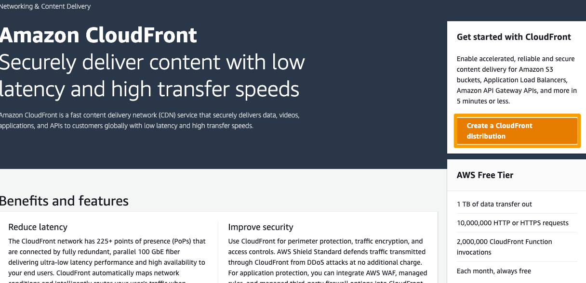
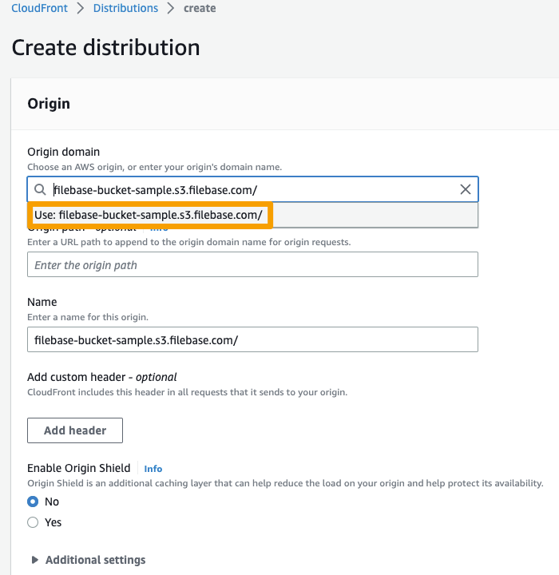
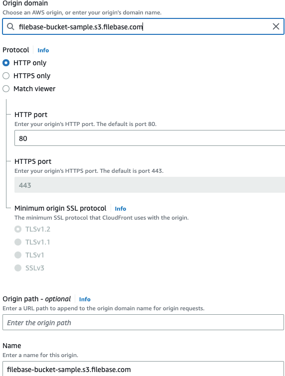
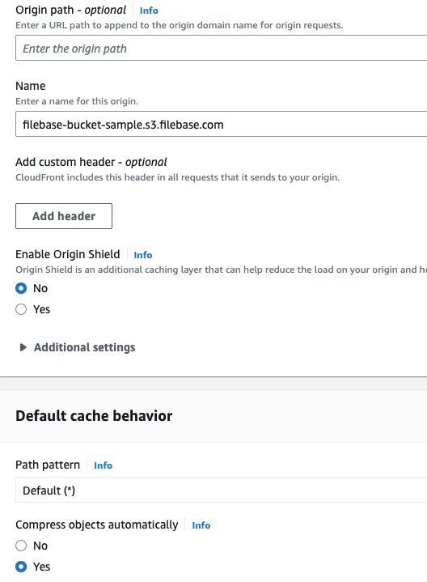
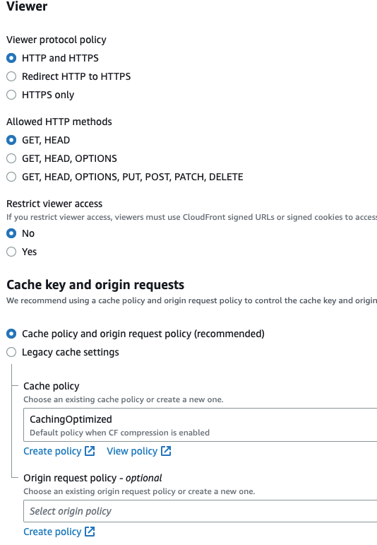
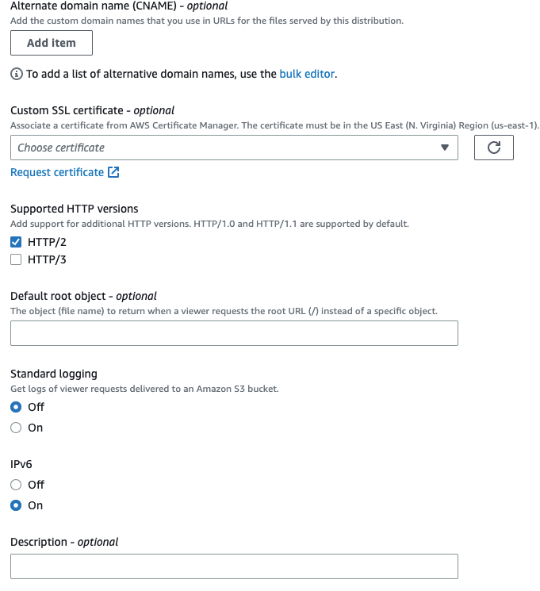
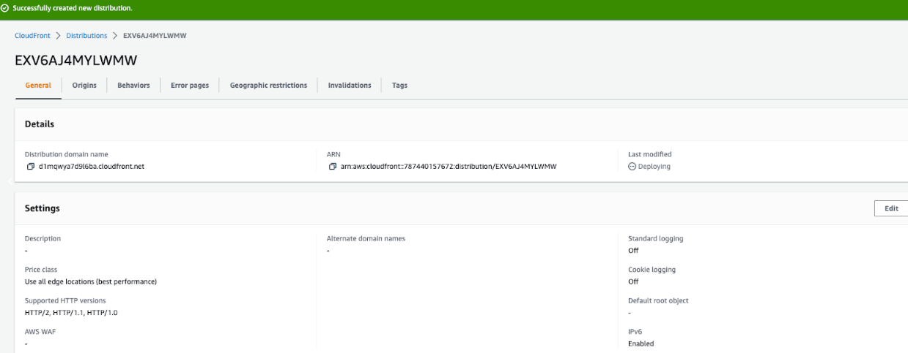

# CloudFront CDN
	了解如何配置 CloudFront CDN 以与 Filebase 一起使用。
## 什么是 CloudFront？
CloudFront 是一个通过 Amazon Web Services 的内容交付网络。

内容交付网络是一个跨越不同地理位置的服务器网络，有助于提高内容交付的速度和质量。CDN 允许快速传输内容类型，例如 HTML 网页、图像、视频、电子表格和 javascript 应用程序。CDN 还可以帮助缓解和保护网站免受分布式拒绝服务攻击 (DDoS)。

了解如何将您的 Filebase 存储桶连接到 CloudFront 以提高与存储桶之间的文件传输速度。

- 先决条件：
	- 拥有 AWS 账户。创建一个。
	- 注册一个免费的 Filebase 帐户。
	- 拥有您的文件库访问权限和密钥。在此处了解如何查看您的访问密钥。
	- 创建文件库存储桶。了解如何创建存储桶。
	- 您的 Filebase 存储桶必须是公开的。了解如何公开您的存储桶。

1. 公开您的 Filebase 存储桶后，您将需要该存储桶的公共 URL。

	URL 格式如下，其中bucket-name是您的存储桶的名称：

		https://bucket-name.s3.filebase.com/
2. 登录 CloudFront 并选择“Create a Cloudfront Distribution”。

	
3. 输入分配域的 FIlebase Bucket URL。然后选择“使用 [域名]”。

	
4. 选择协议、端口号并输入分发名称。

	
5. 您还可以设置自定义标头，启用 Origin Shield，并配置默认缓存行为。

	

	缓存行为包括查看器协议策略、允许的 HTTP 方法和自定义缓存策略等设置。
	
	
6. 最后，配置您想要使用分发配置的任何备用域名 (CNAME) 记录，并在需要时应用自定义 SSL 证书。

	然后，选择“创建分发”。

	
7. 创建后，您将被带到以下屏幕，显示分配的详细信息：

	
8. 您的分发域名可以在浏览器选项卡中打开，以测试它是否重定向到您的 Filebase 存储桶：

	