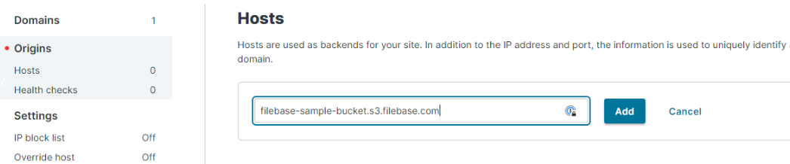
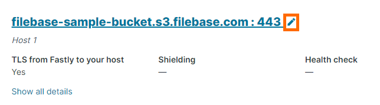
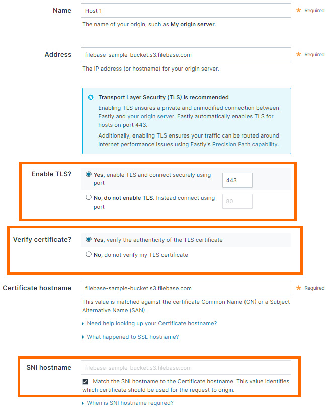
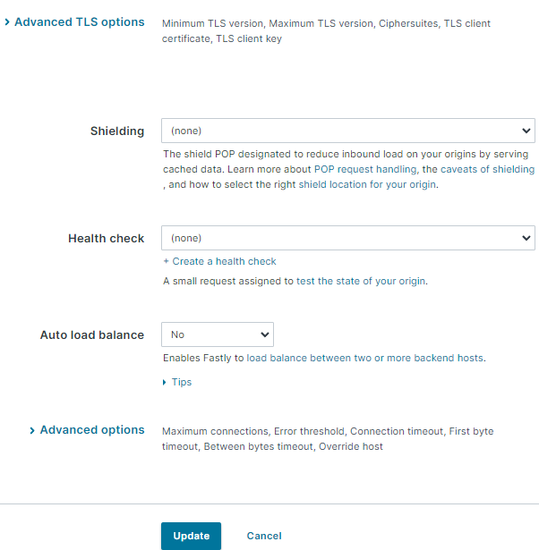
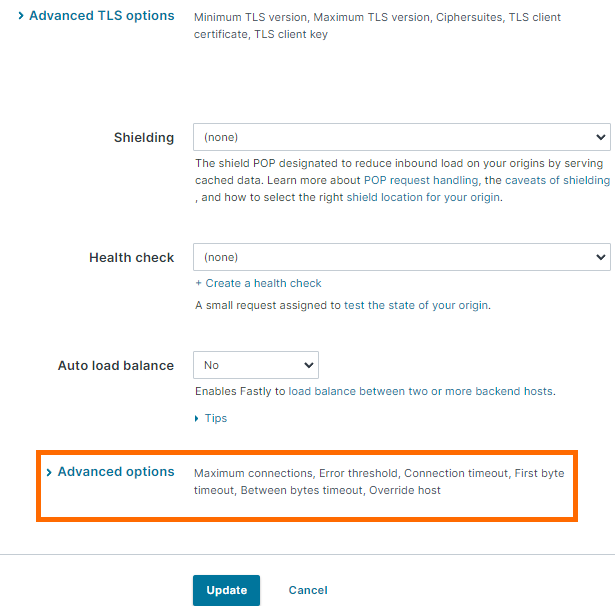
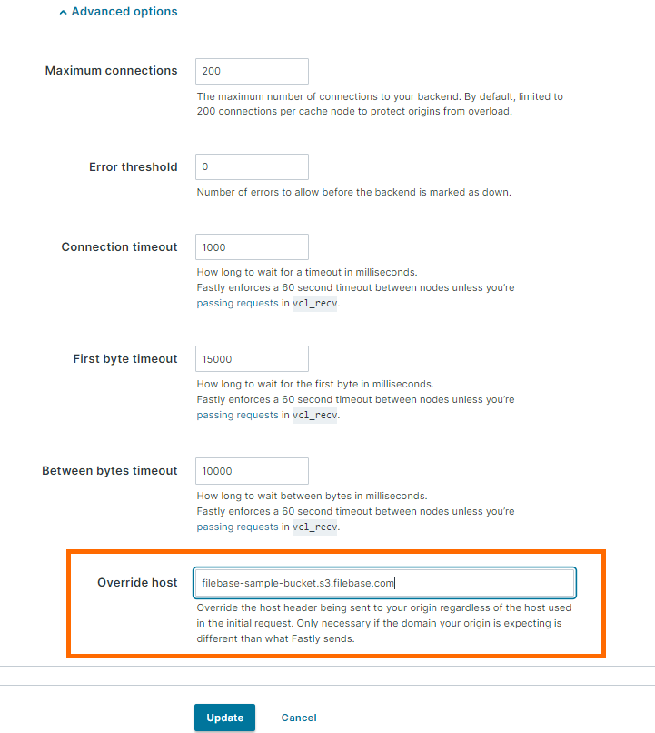

# FastlyCDN
	了解如何配置 FastlyCDN 以与 Filebase 一起使用。
## 什么是 FastlyCDN？
FastlyCDN 是内容分发网络提供商。

内容交付网络是一个跨越不同地理位置的服务器网络，有助于提高内容交付的速度和质量。CDN 允许快速传输内容类型，例如 HTML 网页、图像、视频、电子表格和 JavaScript 应用程序。CDN 还可以帮助缓解和保护网站免受分布式拒绝服务攻击 (DDoS)。

了解如何将您的 Filebase 存储桶连接到 Fastly CDN 以提高与存储桶之间的文件传输速度。

- 先决条件：
	- 拥有一个 Fastly CDN 帐户。你可以在这里创建一个。
	- 注册一个免费的 Filebase 帐户。
	- 拥有您的文件库访问权限和密钥。了解如何查看您的访问密钥。
	- 创建文件库存储桶。了解如何创建存储桶。
	- 您的 Filebase 存储桶必须是公开的。了解如何公开您的存储桶。

## 步骤
1. 登录到 FastlyCDN。选择“创建送货服务”。

	
2. 在交付服务创建屏幕中，在“域”选项卡下输入您的域名。

	单击“添加”。
3. 在“来源”下的左侧菜单中选择“主机”。输入您的文件库存储桶的公共 URL。

	此 URL 的格式为：

		bucket-name.s3.filebase.com
	
	

	单击“添加”。
4. 添加主机后，它将在下面列出。单击主机名旁边的铅笔图标以编辑主机的设置。

	
5. 配置以下设置：

	

	- `Enable TLS`：是，启用 TLS 并使用端口 443 安全连接
	- `Verify certificate`：是，验证 TLS 证书的真实性。
	- `SNI hostname`：将 SNI 主机名与证书主机名匹配。该值标识应将哪个证书用于对来源的请求。
6. 选择“高级 TLS 选项”。配置以下内容：

	
7. 选择底部的“高级选项”。

	
8. 在高级选项中，设置如下配置：

	

	- `override host`：输入您的文件库存储桶的公共 URL。此 URL 的格式为：

			bucket-name.s3.filebase.com
	
	这一步非常重要。否则此配置将不起作用，否则会配置此覆盖​​主机设置。
9. 激活配置。

	为此，请再次选择左侧菜单中的“域”，然后选择右上角的“激活”。
	
	
10. 测试您的配置。您可以在不为您的域名添加任何 CNAME 记录的情况下进行测试，方法是：

		yourwebsite.com.global.prod.fastly.net/文件名

	其中是您的域名，filename 是您的 Filebase 存储桶中的文件。
