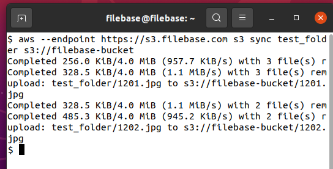
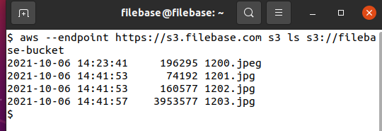
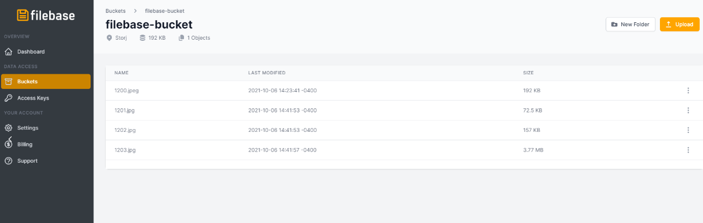
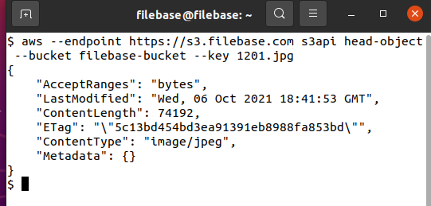

# 命令行界面
	了解如何使用 AWS CLI 与 Filebase 的 S3 兼容 API 进行交互。
## 什么是 AWS CLI？
AWS，即 Amazon Web Services Command Line Interface，是亚马逊使用 Python 开发的命令行工具，用于将数据传输到对象存储服务。这是 IT 系统管理员、开发人员和程序员最常用的 CLI 工具之一。尽管此工具是由 Amazon 开发的，但您可以将它与任何 S3 兼容的 API 对象存储服务（包括 Filebase）一起使用，以管理您的存储对象和存储桶。

由于此工具是通过命令行使用的，因此非常受欢迎，因为它可以通过自动化脚本、备份作业和其他自定义实用程序（如 cron 作业）轻松引用。

- 先决条件：
	- 下载并安装 AWS CLI 工具。
	- 注册一个免费的 Filebase 帐户。
	- 拥有您的文件库访问权限和密钥。了解如何查看您的访问密钥。
	- 请注意 Filebase API 端点 -https://s3.filebase.com

访问密钥 ID 和秘密访问密钥将存储在 AWS CLI 配置文件中，但每个命令都需要引用 API 端点。

## 配置
1. 首先，配置 AWS CLI 以使用 Filebase 和您的 Filebase 账户。为此，打开一个新的终端窗口。从那里运行命令：

		aws configure
	此命令会生成一系列提示，应按如下方式填写：

	- `Access Key ID` 文件库访问密钥
	- `Secret Access Key` 文件库秘密密钥
	- `Region` us-east-1
	- `Output Format` 可选
2. 完成提示后，开始使用 AWS CLI 工具与 Filebase S3 API 交互。只要您的访问 ID 和秘密访问密钥没有更改，您就不需要再次配置 AWS CLI。

	所有 AWS CLI 命令都将以 `aws --endpoint https://s3.filebase.com` 此初始命令后面的部分将是确定要执行的操作以及使用哪个存储桶的部分。

## 创建一个新桶
要使用 AWS CLI 在 Filebase 上创建新存储桶，请使用以下命令：

	aws --endpoint https://s3.filebase.com s3 mb s3://[bucket-name] 
- 例如，要创建一个名为“filebase-bucket”的新存储桶：

		aws --endpoint https://s3.filebase.com s3 mb s3://filebase-bucket

	存储桶名称在所有 Filebase 用户中必须是唯一的，长度在 3 到 63 个字符之间，并且只能包含小写字符、数字和破折号。

	终端应返回以下行：

		make_bucket: filebase-bucket

## 列出桶
以下命令将列出您的 Filebase 帐户中的所有存储桶：

	aws --endpoint https://s3.filebase.com s3 ls
## 列出桶的内容
要列出存储桶的内容，请使用以下命令：

	aws --endpoint https://s3.filebase.com s3 ls s3://[bucket-name]
- 例如，要列出“filebase-bucket”的内容：

		aws --endpoint https://s3.filebase.com s3 ls s3://filebase-bucket

## 上传单个文件
要上传单个文件，请使用以下命令：

	aws --endpoint https://s3.filebase.com s3 cp [filename] s3://[bucket-name] 
- 例如，要将名为“1200.jpeg”的文件上传到存储桶“filebase-bucket”：

		aws --endpoint https://s3.filebase.com s3 cp 1200.jpeg s3://filebase-bucket

要通过使用先前使用的命令列出存储桶的内容来验证此文件是否已上传s3 ls：

	aws --endpoint https://s3.filebase.com s3 ls s3://filebase-bucket
要验证此文件是否可从 Web 控制台获得

## 上传多个文件
要上传多个文件，请使用以下命令：

		aws --endpoint https://s3.filebase.com s3 sync [folder name] s3://[bucket-name] 
- 例如，要上传名为“test_folder”的文件夹的内容，请使用以下命令：

		aws --endpoint https://s3.filebase.com s3 sync test_folder s3://filebase-bucket
		
	

	要验证这些文件是否已上传，请使用以下命令：

		aws --endpoint https://s3.filebase.com s3 ls s3://filebase-bucket
	
	

	或者通过 Web 控制台仪表板导航到存储桶：
	
	

## 分段上传
兼容 S3 的对象存储服务支持以单独的数据块上传大文件，并在文件大小超过特定阈值时并行上传。这称为多部分阈值。这很重要，因为在发生网络中断或错误的情况下，可以恢复文件传输，这有助于提高传输文件的网络性能。

默认情况下， AWS CLI 的多部分阈值为 8MB。这意味着任何大于 8MB 的文件都将自动分成块并并行上传。要使用此功能，只需上传一个大于 8MB 的文件，AWS CLI 会自动处理其余部分。

在此处阅读有关分段上传的更多信息：

- [什么是分段上传](https://docs.filebase.com/third-party-tools-and-clients/cli-tools/aws-cli/what-is-multipart-upload)

## 验证上传的文件
为了验证文件的元数据以确认它已上传，AWS CLI 使用命令 `s3api head-object` 来获取有关上传到存储桶的每个文件的对象元数据。此元数据中包含所谓的“实体标签”，也称为 ETag。在 Filebase 中，对于未在分段上传中上传的文件，ETag 与对象的 MD5 校验和值相同，这是 S3 兼容对象存储服务中的常见做法。

通过使用 Filebase S3 API 获取文件对象的元数据，我们可以将与 MD5 值相同的 ETag 值与在本地计算机上计算的 MD5 值进行比较。理想情况下，这两个值将匹配，我们可以确认上传成功并且 Filebase 服务正确接收了我们上传的数据。

要查看文件 1201.jpg 的元数据信息，请使用命令：

	aws --endpoint https://s3.filebase.com s3api head-object --bucket filebase-bucket --key 1201.jpg
	

记下 ETag 值。

要计算本地计算机的 MD5 校验和，此命令将根据本地主机运行的操作系统而有所不同：

- 对于 macOS，终端命令是

		md5sum 1201.jpg
- 对于基于 Linux 的系统，终端命令为

		md5sum 1201.jpg
- 对于 Windows，PowerShell 命令是

		get-filehash -Algorithm MD5 1201.jpg

MD5sum 值与 AWS CLI 命令中的 ETag 值匹配，因此 Filebase 正确接收了数据。

	此验证方法仅适用于未分批上传的文件。如果文件大于 8MB，则使用分段阈值上传。Etag 将是 UUID，而不是 MD5 校验和。

## 下载单个文件
要下载单个文件，请使用以下命令：

	aws --endpoint https://s3.filebase.com s3 cp s3://[bucket-name]/[file-name] /path/to/download/filename 
- 例如，要从存储桶“filebase-bucket”中下载名为“1200.jpeg”的文件：

		aws --endpoint https://s3.filebase.com s3 cp s3://filebase-bucket/1200.jpeg /Users/Filebase/Downloads/1200.jpeg

## 下载文件夹
要下载文件夹，请使用以下命令：

	aws --endpoint https://s3.filebase.com s3 cp --recursive s3://[bucket-name]/[folder name] /path/to/download/folder
- 例如，要上传名为“test_folder”的文件夹的内容，请使用以下命令：

		aws --endpoint https://s3.filebase.com s3 cp --recursive s3://filebase-bucket/test_folder /Users/Filebase/Downloads/new-folder

## 删除单个文件
要删除文件，请使用以下命令：

	aws --endpoint https://s3.filebase.com s3 rm s3://[bucket_name]/[file_name]
## 删除桶中的所有文件
要删除存储桶中的所有文件，请使用以下命令：

	aws --endpoint https://s3.filebase.com s3 rm --recursive s3://[bucket_name]/ 
- 例如，要删除存储桶“filebase-bucket”中的所有文件：

		aws --endpoint https://s3.filebase.com s3 rm --recursive s3://filebase-bucket/

有关使用 AWS CLI 删除文件的更多详细信息，请参阅下面的专门指南：

- [How To Delect Data with AWS CLI](https://docs.filebase.com/third-party-tools-and-clients/cli-tools/aws-cli/how-to-delete-data-with-aws-cli)

## 使用 AWS CLI 生成预签名的 S3 URL
要使用 AWS CLI 创建预签名 URL，请使用以下命令语法：

	aws s3 --endpoint https://s3.filebase.com presign s3://filebase-bucket-name/file.name
此命令应返回预签名 URL。默认情况下，到期时间为一小时。

您可以通过添加标志 `--expires-in` 后跟分钟数来指定不同的到期时间。