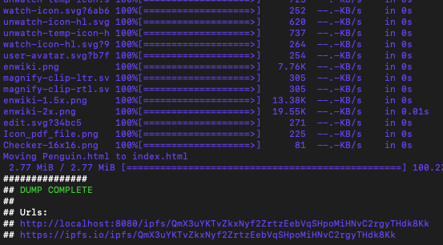
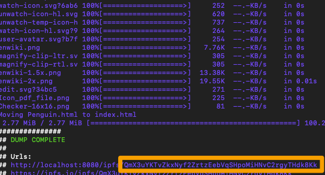
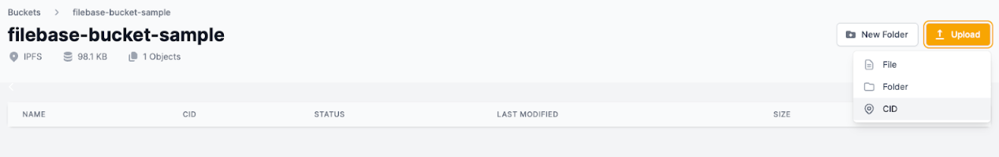
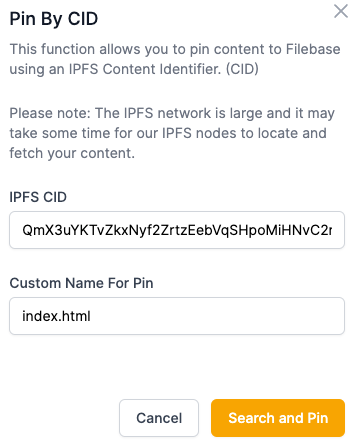

# IPFScrape
	了解如何配置 IPFScrape 以与 Filebase 一起使用。
## 什么是 IPFScrape？
IPFScrape 是一个 CLI 工具，可以下载网页的所有内容并将其上传到 IPFS。上传后，需要固定到 IPFS 上进行长期存储。IPFScrape 可用于存档网站或创建可使用 IPFS CID 编辑和共享的副本。

阅读下文以了解如何将 IPFScrape 与 Filebase 一起使用。

- 先决条件：
	- 下载安装 IPFS。
	- 注册一个免费的 Filebase 帐户。
	- 拥有您的文件库访问权限和密钥。了解如何查看您的访问密钥。
	- 创建一个文件库 IPFS 桶。了解如何创建存储桶。

步骤

1. 首先克隆工具的存储库：

		git clone https://github.com/victorb/ipfscrape
2. 然后，导航到目录并运行run.sh脚本。替换`$URL` 为您要抓取的网页的 URL。

		cd ipfscrape
		./run.sh $URL
	该脚本将返回一个包含抓取文件 CID 的 URL：
	
	
3. 复制 CID 值。

	
4. 然后，导航到 filebase 仪表板。在 IPFS 存储桶内导航。

	选择“上传”，然后选择“CID”。
	
	
5. 输入您之前复制的 CID。将引脚命名为“index.html”。

	
6. 固定后，您可以使用 CID 和 Filebase IPFS 网关访问网页：

		https://ipfs.filebase.io/ipfs/[CID]
