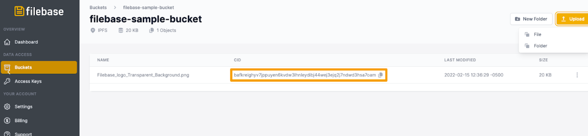

# IPGet
	了解如何配置 IPGet 以与 Filebase 一起使用。
## 什么是IPGet？
IPGet 是一个 CLI 工具，允许您根据文件的 IPFS CID 在本地下载文件。

阅读下文以了解如何将 IPGet 与 Filebase 一起使用。

- 先决条件：
	- 下载并安装 Golang (Go)。
	- 注册一个免费的 Filebase 帐户。
	- 拥有您的文件库访问权限和密钥。了解如何查看您的访问密钥。
	- 创建一个文件库 IPFS 桶。了解如何创建存储桶。

步骤

1. 使用以下命令下载并安装 IPGet：

		go install github.com/ipfs/ipget@latest
		cd ${GOPATH}/src/github.com/ipfs/ipget
		make install
2. 从 Filebase 检索文件的 CID。首先单击菜单中的“Buckets”选项以打开 Buckets 仪表板。
3. 选择您的 IPFS 存储桶。
4. 单击存储桶名称后，您将看到任何以前上传的文件。要上传另一个文件，请选择“上传”，然后从选项中选择“文件”。
5. 选择要上传到IPFS的文件。
6. 上传后，您将能够从“CID”类别中查看和复制 IPFS CID，如下所示。

	
7. 返回命令行。运行以下命令以使用其 CID 从 IPFS 下载文件：

		ipget QmRg5rMBiFs4vdgzuCeWsaCycf66xRp3o78WpJwaZFZZdd -o ipfs.txt

	您还可以在 CID 前加上前缀 /ipfs：

		ipget -o ipfs.txt /ipfs/QmRg5rMBiFs4vdgzuCeWsaCycf66xRp3o78WpJwaZFZZdd