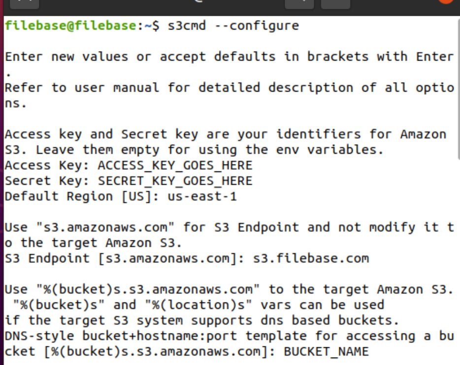
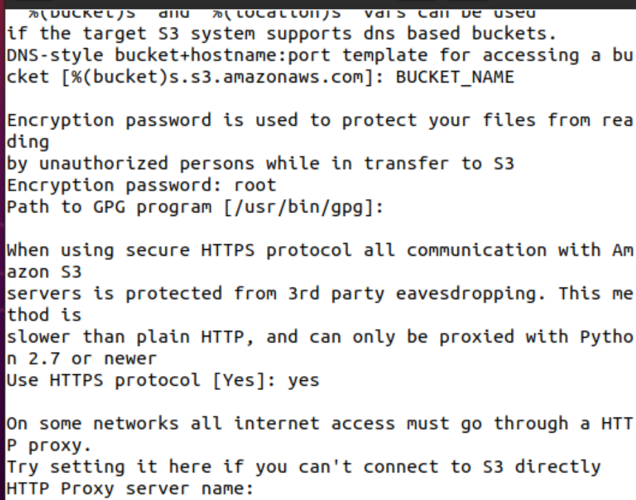
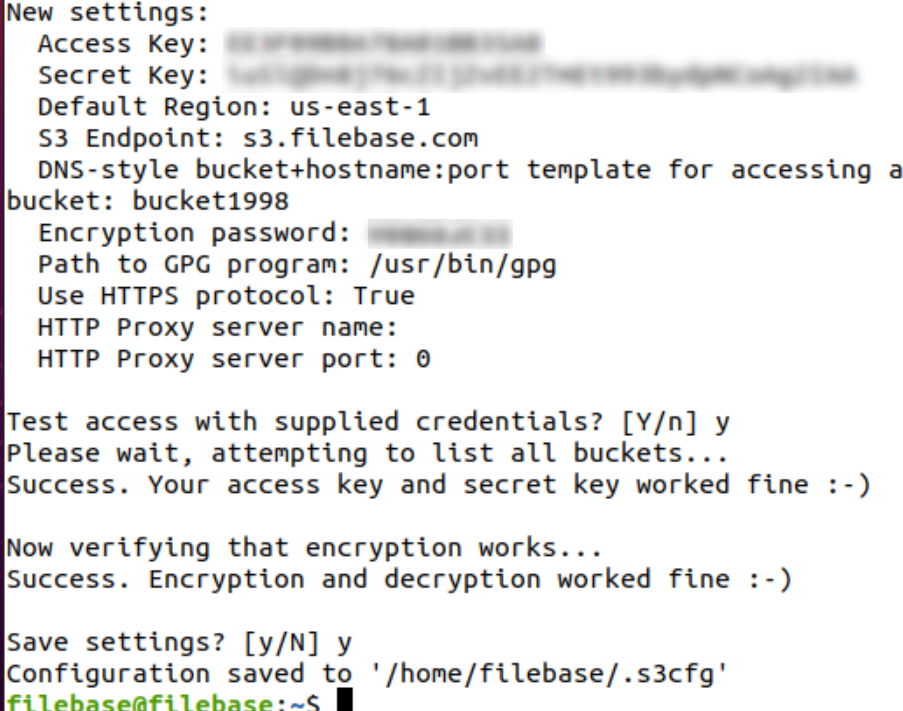

# S3 cmd
	了解如何使用 S3cmd 将数据备份到 Filebase。
## 什么是 S3cmd？
S3cmd 是用于 Linux 和 macOS X 的命令行 S3 客户端和备份。

阅读下文，了解有关如何使用 S3cmd 配置和装载文件库存储桶的说明。

- 先决条件：
	- 下载并安装 s3cmd。
	- 注册一个免费的 Filebase 帐户。
	- 拥有您的文件库访问权限和密钥。了解如何查看您的访问密钥。
	- 创建文件库存储桶。了解如何创建存储桶。

## 步骤
1. 要配置 S3cmd，请运行以下命令：

		s3cmd --configure
2. 系统会提示您填写以下信息：
	- `Access Key`：文件库访问密钥
	- `Secret Key`：文件库密钥
	- `Default Region`：us-east-1
	- `S3 Endpoint`：s3.filebase.com
	- `Bucket Name`：文件库存储桶名称
	- `Encryption Password`：唯一密码
	- `Path to GPG Program`：如果存储在默认系统位置，请输入以确认。
	- `Use HTTPS Protocol` 使用 HTTPS 协议：是
	- `HTTP Proxy Server Name`：输入绕过。

	
	

3. 您将看到这些设置的摘要。使用这些设置测试对 Filebase 的访问。

	
4. 系统会提示您保存设置。保存后，您就可以开始使用 S3cmd 了。
5. 您可以将 S3cmd 与如下命令一起使用：
	- 做一个桶

			s3cmd mb s3://BUCKET
	- 移除桶

			s3cmd rb s3://BUCKET
	- 列出对象或桶

			s3cmd ls [s3://BUCKET[/PREFIX]]
	- 列出所有桶中的所有对象

			s3cmd la
	- 将对象上传到桶中

			s3cmd put FILE [FILE...] s3://BUCKET[/PREFIX]
	- 从桶中下载对象

			s3cmd get s3://BUCKET/OBJECT LOCAL_FILE
	- 从桶中删除对象

			s3cmd del s3://BUCKET/OBJECT
	- 将目录树同步到 S3

			s3cmd sync LOCAL_DIR s3://BUCKET[/PREFIX] or s3://BUCKET[/PREFIX] LOCAL_DIR
	- 按桶查看磁盘使用情况

			s3cmd du [s3://BUCKET[/PREFIX]]
	- 获取有关桶或对象的信息

			s3cmd info s3://BUCKET[/OBJECT]
	- 复制对象

			s3cmd cp s3://BUCKET1/OBJECT1 s3://BUCKET2[/OBJECT2]
	- 移动对象

			s3cmd mv s3://BUCKET1/OBJECT1 s3://BUCKET2[/OBJECT2]