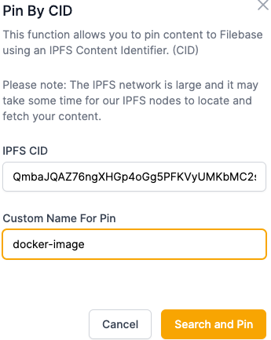
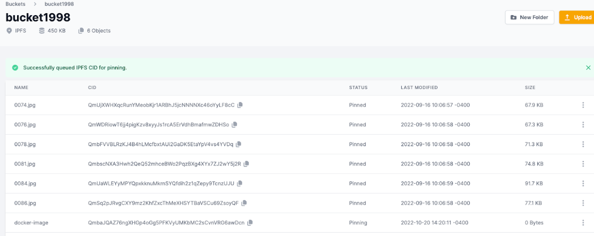

# 将 Docker 镜像固定到 IPFS
	了解如何将 Docker 映像固定到 IPFS。
## 什么是 IPDR？
IPDR 是一个 Docker Registry 工具，它将 Docker 镜像发布到 IPFS，允许以分散的方式替代 Docker Hub 等中央注册表。上传到 IPFS 后，必须固定 docker 镜像才能长期保留在 IPFS 上。

阅读下文以了解如何使用 Filebase 将 Docker 映像固定到 IPFS。

- 先决条件：
	- 下载安装 IPFS 守护进程。
	- 下载安装 Docker。
	- 一个免费的 Filebase 帐户。
	- 拥有您的文件库访问权限和密钥。了解如何查看您的访问密钥。
	- 创建一个文件库 IPFS 桶。了解如何创建存储桶。

## 步骤
1. 克隆ipdrGitHub 存储库：

		wget https://github.com/ipdr/ipdr/releases/download/v0.1.7/ipdr_0.1.7_darwin_arm64.tar.gz
		
		tar -xvzf ipdr_0.1.7_darwin_arm64.tar.gz ipdr
	使用以下命令测试安装：

		./ipdr --help
2. 然后，移动到bin路径：

		sudo mv ipdr /usr/local/bin/ipdr
3. 打开一个新的命令提示符并使用以下命令启动 IPFS 守护进程：

		ipfs daemon
4. 然后，添加docker.local到/etc/hosts：

		echo '127.0.0.1 docker.local' | sudo tee -a /etc/hosts
		echo '::1       docker.local' | sudo tee -a /etc/hosts
5. 创建一个名为 Dockerfile 的新文件，其中包含以下文本：

		FROM busybox:latest
		
		CMD echo 'hello world'
6. 使用以下命令构建 Docker 镜像：

		docker build -t example/helloworld .
7. 然后，运行 Docker 容器以测试其功能：

		docker run example/helloworld:latest

	如果成功，终端窗口将回显 ' hello world'。
8. 接下来，使用 IPDR 将您的 Docker 容器推送到 IPFS：

		ipdr push example/helloworld
	您将收到类似于以下内容的输出：

		INFO[0000] [registry] temp: /var/folders/k1/mmftgd4pj0xf9csdb2r8q9700000gn/T/205139235
		INFO[0000] [registry] preparing image in: /var/folders/k1/mmftgd4pj0xf9csdb2r8q9700000gn/T/657143846
		INFO[0000]
		[registry] dist: /var/folders/k1/mmftgd4pj0xf9csdb2r8q9700000gn/T/657143846/default/blobs/sha256:305510b2c684403553fd8f383e8d109b147df2cfde60e40a85564532c383c8b8
		INFO[0000] [registry] compressing layer: /var/folders/k1/mmftgd4pj0xf9csdb2r8q9700000gn/T/205139235/886f4bdfa483cc176e947c63d069579785c051793a9634f571fded7b9026cd3c/layer.tar
		INFO[0000] [registry] root dir: /var/folders/k1/mmftgd4pj0xf9csdb2r8q9700000gn/T/657143846
		INFO[0000] [registry] upload hash QmbaJQAZ76ngXHGp4oGg5PFKVyUMKbMC2sCvnVRG6awDcn
		INFO[0000]
		[registry] uploaded to /ipfs/QmbaJQAZ76ngXHGp4oGg5PFKVyUMKbMC2sCvnVRG6awDcn
		INFO[0000] [registry] docker image ciqmw4mig2uwcxvetsjp2mjdde27wiaygddjlutoywq43udutvdmuxk
		
		Successfully pushed Docker image to IPFS:
		/ipfs/QmbaJQAZ76ngXHGp4oGg5PFKVyUMKbMC2sCvnVRG6awDcn
9. 然后，导航到 Filebase 控制台 。从侧栏菜单中选择“桶”选项，然后选择一个 IPFS 桶或创建一个新的 IPFS 桶。
10. 选择右上角的“上传”。
11. 然后选择“CID”：
12. 输入从命令行返回的 CID，并提供要与 CID 关联的文件名：

	
13. 添加后，文件将列在您的存储桶中

	
	