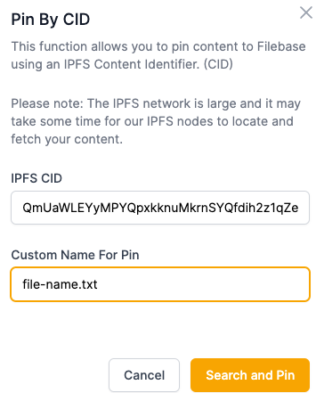
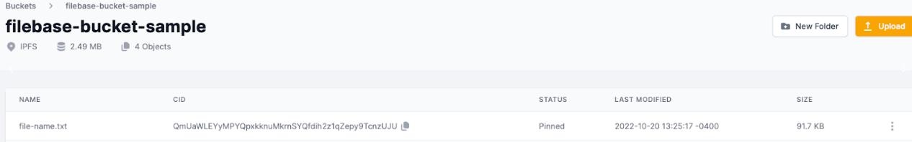

# 将加密文件固定到 IPFS
	了解如何将加密文件固定到 IPFS。
## 是什么 ipfs-add-from-encrypted？
Ipfs-add-from-encrypted 是一个开源工具，可用于加密文件并将其上传到 IPFS。一旦上传到 IPFS，文件必须被固定以长期保存在 IPFS 上。

阅读下文以了解如何使用 Filebase 将加密文件固定到 IPFS。

- 先决条件：
	- 下载安装 Python3。
	- ipfsapi 使用命令下载并安装 Python 包 `pip3 install ipfsapi`。
	- 下载安装 IPFS 守护进程。
	- 注册一个免费的 Filebase 帐户。
	- 拥有您的文件库访问权限和密钥。了解如何查看您的访问密钥。
	- 创建一个文件库 IPFS 桶。了解如何创建存储桶。

## 步骤
1. 克隆 ipfs-add-from-encryptedGitHub 存储库：

		git clone https://github.com/TroyWilson1/ipfs-add-from-encrypted.git
2. 在新目录中导航：

		cd ipfs-add-from-encrypted
3. 使用以下命令启动 IPFS 守护进程：

		ipfs daemon
4. 运行以下命令加密单个文件，然后将其上传到 IPFS。输出文件将包含用于解密文件的加密密钥。

		./ipfs-add-from-encrypted.py -i file.txt -n output.out

	您将获得类似于以下内容的输出：

		File encrypted and added to IPFS with this hash QmUaWLEYyMPYQpxkknuMkrnSYQfdih2z1qZepy9TcnzUJU
5. 然后，导航到 Filebase 。从侧栏菜单中选择“桶”选项，然后选择一个 IPFS 桶或创建一个新的 IPFS 桶。
6. 选择右上角的“上传”。
7. 然后选择“CID”：
8. 输入从命令行返回的 CID，并提供一个与 CID 关联的文件名：

	
9. 添加后，文件将列在您的存储桶中：

	
