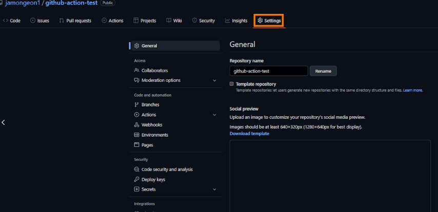
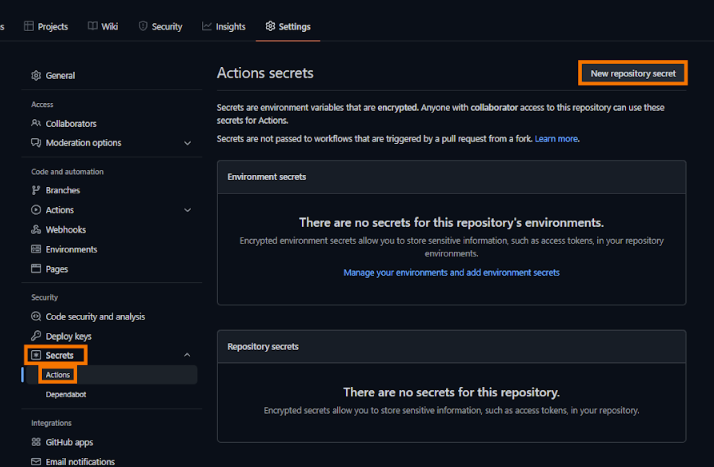
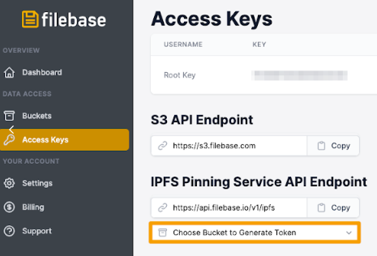
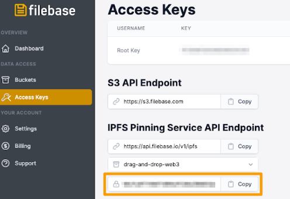
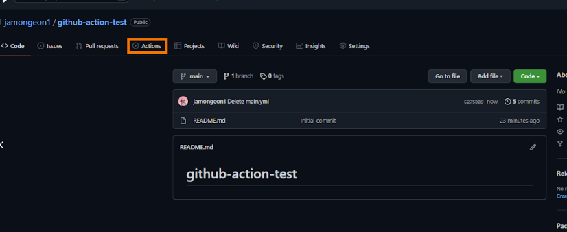
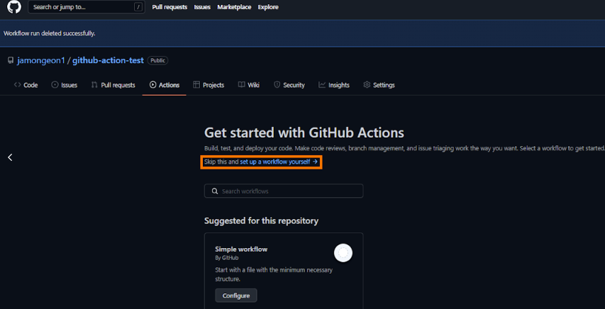
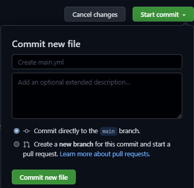
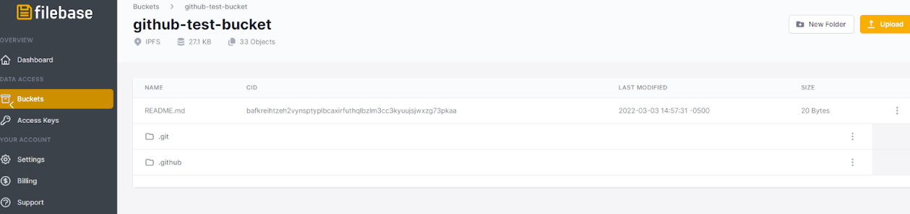

# IPFS 固定 GitHub 操作
	了解如何配置 IPFS 固定 GitHub 操作以与 Filebase 一起使用。
## 什么是 IPFS Pinning GitHub Action？
IPFS Pinning GitHub Action 是一个开源的 GitHub Action，它使开发人员能够在 GitHub 存储库的主分支被拉取请求推送或更新时将其 GitHub 存储库自动备份到 IPFS Pinning 服务（如 Filebase）。

可以在此处找到此操作的 GitHub 存储库。

阅读下文以了解如何使用 IPFS Pinning GitHub Action with Filebase。

- 先决条件：
	- 注册一个 Filebase 帐户。
	- 拥有您的文件库访问权限和密钥。了解如何查看您的访问密钥。
	- 创建一个文件库 IPFS 桶。了解如何创建存储桶。

本教程使用 IPFS Pinning API，这是一项需要 Filebase IPFS 订阅的付费功能。

1. 创建 GitHub 存储库，或导航到现有存储库。选择“设置”选项卡。

	
2. 从左侧栏菜单中，选择“Secrets”，然后选择“Actions”，然后单击“New Repository Secret”按钮：

	
3. 重复此步骤以创建第二个秘密，称为 FILEBASE_SECRET_KEY。该值应该是您的 Filebase IPFS API 秘密 token。

	通过导航到 filebase 访问密钥页面，然后查看 IPFS 固定服务 API 端点来生成此 Token。单击“选择存储桶以生成令牌”的下拉菜单，然后选择您要使用的 IPFS 文件库存储桶。

	
	
	然后复制生成的 Secret Access Token：
	
	
4. 从顶部菜单栏中选择“操作”。

	
5. 在 GitHub 操作菜单中，选择“自行设置工作流程”。

	
6. 在新文件中输入以下代码，默认名称为main.yml：

		on: [push]
		
		jobs:
		  pin_to_ipfs:
		    runs-on: ubuntu-latest
		    name: Publish
		    steps:
		    - uses: actions/checkout@v2
		    - name: IPFS Publish
		      id: IPFS
		      uses: alexanderschau/ipfs-pinning-action@v1.0.0
		      with:
		        path_to_add: 'your/path/to/upload' 
		        endpoint: 'https://api.filebase.io/v1/ipfs/pins'
		        access_token: ${{ secrets.ACCESS_TOKEN }} 
		        pin_name: 'github-actions-test'
        
	替换以下值以匹配您的配置：

	- `path_to_add`

		您要上传到 Filebase 的 GitHub 存储库中的文件或文件夹的路径。
	- `pin_name`

		一旦固定到 IPFS，就会与文件的 CID 关联的名称。

	此操作的输出将是您的文件或文件夹的 IPFS CID 值。
7. 然后，选择屏幕右侧的“开始提交”。提交你的文件。

	
8. 然后您将看到您的 `main.yml` 文件列在您的存储库中。

	再次从菜单栏中选择“操作”选项卡以检查 GitHub 操作的状态，该操作在提交时自动运行。从这里开始，只要您的存储库的主分支被推送到拉取请求或与拉取请求合并，它就会自动运行。
	
	
9. 您的 GitHub 操作将显示一个绿色复选标记，表示它能够成功运行。

	
10. 您可以通过在 Web 控制台上检查 Filebase 存储桶的内容来验证您的 GitHub 存储库文件是否已上传到您的 Filebase 存储桶。

	
如果您有任何问题，请加入我们的，或发送电子邮件至hello@filebase.com