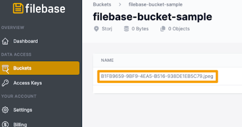
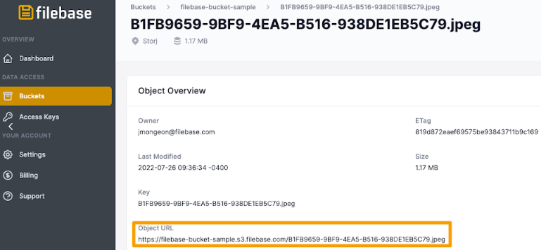
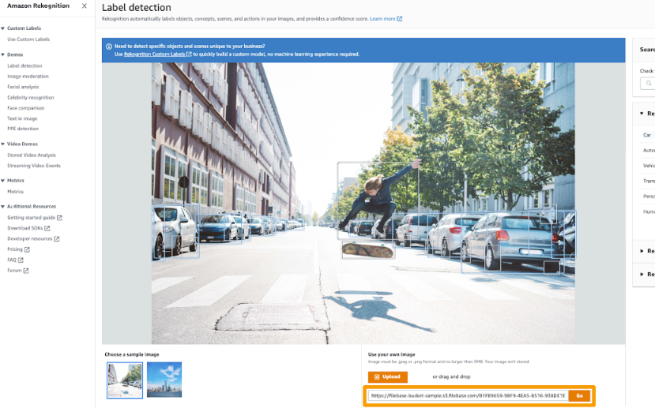
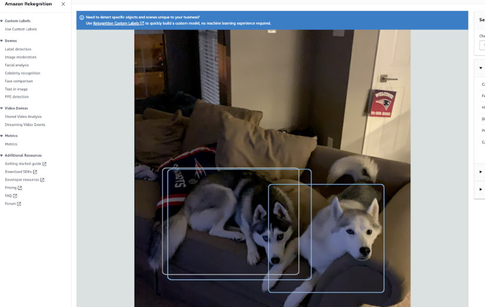

# AWS 识别
	了解如何配置 AWS Rekognition 以与 Filebase 一起使用。
## 什么是 AWS Rekognition？
AWS Rekognition 是亚马逊托管的一项软件服务，提供机器学习图像和视频分析。AWS Rekognition 可以为种族识别和其他机器学习算法等用例提供有关图像和视频内容、属性和组件的反馈。

阅读下文以了解如何将 AWS Rekognition 与 Filebase 结合使用。

- 先决条件
	- 拥有有效的 AWS 账户。
	- 注册一个免费的 Filebase 帐户。
	- 拥有您的文件库访问权限和密钥。了解如何查看您的访问密钥。
	- 创建公共文件库存储桶。了解如何创建存储桶。注意：此功能需要付费订阅 Filebase。
	- 下载、安装和配置 AWS CLI。

## 步骤	
1. 导航到 filebase 控制台仪表板。选择存储桶菜单。
2. 选择一个公共文件库存储桶，或根据需要创建一个。

		注意：此功能需要付费订阅 Filebase。
3. 将图像文件上传到您的公共存储桶。
4. 上传后，选择对象以查看其详细信息。

	
5. 将对象 URL 复制到图像文件。

	
6. 接下来，在您的本地环境中创建一个包含以下内容的 .JSON 文件：

		{
		"CORSRules":[
		    {
		        "AllowedHeaders": [],
		        "AllowedMethods": [
		            "GET"
		        ],
		        "AllowedOrigins": [
		            "*"
		        ],
		        "ExposeHeaders": []
		    }
		    ]
		}
7. 将此文件另存为 `corspolicy.json`.
8. 打开终端窗口并运行以下命令以将 CORS 策略应用到您的 Filebase 存储桶：

		aws --endpoint https://s3.filebase.com s3api put-bucket-cors --bucket BUCKET-NAME --cors-configuration=file://corspolicy.json
	替换 `BUCKET-NAME` 为您的公共 Filebase 存储桶的名称。
9. 导航到Aws rekognition 控制台在“使用您自己的图像”选项下输入 Filebase 对象 URL。然后选择“开始”。

	
10. 上传后，AWS Rekognition 将返回有关照片内容的信息。

	
