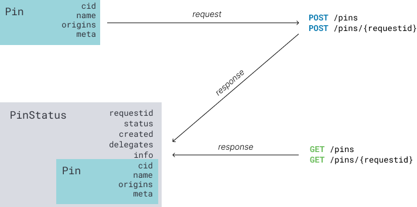

# [IPFS Pinning Service API (1.0.0)](https://ipfs.github.io/pinning-services-api-spec/)
下载 OpenAPI 规范：[下载](https://raw.githubusercontent.com/ipfs/pinning-services-api-spec/master/ipfs-pinning-service.yaml)

网址：[https://github.com/ipfs/pinning-services-api-spec](https://github.com/ipfs/pinning-services-api-spec)

## 关于本规范
IPFS pin服务 API 旨在成为一个与实现无关的 API

- 供pin服务提供商使用和实施
- 供 IPFS 节点和基于 GUI 的应用程序以客户端模式使用

### 文档范围和目标受众
本文档的目标读者是构建与此 OpenAPI 规范兼容的pin服务客户端或服务器的 `IPFS 开发人员`。在我们开发此 API 规范时，欢迎您提出宝贵的意见和反馈。请在 [https://github.com/ipfs/pinning-services-api-spec](https://github.com/ipfs/pinning-services-api-spec) 加入设计讨论。

`IPFS 用户` 应该在 [https://docs.ipfs.io/how-to/work-with-pinning-services/](https://docs.ipfs.io/how-to/work-with-pinning-services/) 查看教程。
### 相关资源
本规范的最新版本和其他资源可在以下位置找到：

- 规范 [https://github.com/ipfs/pinning-services-api-spec/raw/main/ipfs-pinning-service.yaml](https://github.com/ipfs/pinning-services-api-spec/raw/main/ipfs-pinning-service.yaml)
- 文档 [https://ipfs.github.io/pinning-services-api-spec/](https://ipfs.github.io/pinning-services-api-spec/)
- 客户端和服务 [https://github.com/ipfs/pinning-services-api-spec#adoption](https://github.com/ipfs/pinning-services-api-spec#adoption)

## 模式
本节描述最重要的对象类型和约定。字段和模式的完整列表可以在的 [YAML 文件](https://github.com/ipfs/pinning-services-api-spec/blob/master/ipfs-pinning-service.yaml)的 `schemas ` 部分中找到。
### 身份标识
- `cid`

	[内容标识符 (CID)](https://docs.ipfs.io/concepts/content-addressing/)指向递归pin的 DAG 的根。
- `requestid`

	pin 请求的唯一标识符。

	创建 pin 后，服务会以唯一性进行响应 `requestid`，稍后可用于删除 `pin`。`cid` 当再次pin相同内容时，`requestid` 将返回不同的内容以区分这些pin请求。

	服务实现应使用 UUID `hash(accessToken,Pin,PinStatus.created)`或任何其他提供同样强大的竞争条件保护的不透明标识符。

### 对象
- `Pin object`

	

	该 Pin 对象是 pin 请求的表示。

	它包括 `cid` 要 pined 的数据，以及 `name、origins` 和 `meta` 中的可选元数据。`origins` 列表中提供的地址仅在初始 pinning 期间相关，不需要由 pinning 服务保留。
- `Pin status response`

	

	该 `PinStatus` 对象表示pin操作的当前状态。它包括来自原始 `Pin` 对象的值，以及整个 pin 请求的当前 `status` 和全局唯一性`requestid`，可用于未来的状态检查和管理。数组中的地址 `delegates` 是由 pin 服务指定的对等点，该服务将通过位交换接收 pin 数据（更多详细信息，请参阅[提供者](https://ipfs.github.io/pinning-services-api-spec/#section/Provider-hints)提示部分）。任何额外的特定于供应商的信息都在 `optional` 中返回 `info`。

### pin 生命周期

-  `POST/pins` 

	创建一个新的 pin 对象
	
	用户发送 `Pin` 对象到 `POST/pins` 并接收 `PinStatus` 响应：

	- `requestid` 在 `PinStatus` 是 pin 操作的标识符，可用于检查状态，并在将来删除 pin
	- `status` 在 `PinStatus` 表示 pin 的当前状态
- `GET /pins/{requestid}` 

	检查正在进行的 pin 状态

	`status` (在 `PinStatus`) 可能表示两个未决状态之一：
	
	- `queued`
		
		`queued` 状态是待机的，说明 pin 已添加到队列中，但服务尚未消耗任何资源来检索它。
	- `pinning`

		`pinning` 状态处于活动状态，说明 pin 服务正在尝试通过查找所有相关 CID 的提供者来检索 CID，连接到这些提供者并从中下载数据。	
	当一个新的 pin 对象被创建时，它通常以一个状态开始 `queued`。一旦 pin 服务主动寻求检索文件，它就会更改为 `pinning`. `pinning` 通常意味着后面的数据 Pin. 
	
	`cid` 在 pin 服务上找不到并且正在从 IPFS 网络中获取，这可能需要一些时间。在任何一种情况下，用户都可以定期检查 `pin` 进度，`GET /pins/{requestid}` 直到 pin 成功或者用户决定删除挂起的 `pin`。
- `POST /pins/{requesttid}` 

	替换现有的 pin 对象

	用户可以通过 `POST /pins/{requesttid}` 替换现有的 pin 对象。这是一种快捷方式，用于删除由 `requestid` 标识的 pin 对象，并在单个 API 调用中创建一个新的 pin 对象，以防止对两个 pin 共用的块进行不必要的垃圾收集。当更新代表大型数据集的 pin 时非常有用，其中大多数块都没有改变。新的 pin 对象 `requestid` 在 `PinStatus` 响应中返回。旧的 pin 对象将被自动删除。
- `DELETE /pins/{requestid}` 

	删除引脚对象

	可以通过 `DELETE /pins/{requestid}` 删除 pin 对象 。

## 提供商提示
提供者提示采用两个[多地址](https://docs.ipfs.io/concepts/glossary/#multiaddr)列表的形式：

- `Pin.origins` 

	已知数据来源（提供者）的列表。由客户端在 pin 请求中发送。Pinning 服务将尝试连接到它们以加速数据传输。
- 和 `PinStatus.delegates`

	数据的临时目的地（检索器）列表。通过 pin 服务在 pin 请求的响应中返回。这些对等点由 pin 服务提供，目的是获取要 pin 的数据。

## 优化速度和连接性
两端应尝试相互预连接

- 代表应始终预先连接到 origins
- 发起 pin 请求并且在自己的本地数据存储中也有 pin 数据的客户端应该预先连接到 delegates

注意：应该以尽力而为的方式尝试连接到 `multiaddrs`和 `delegates` 数组并且拨号失败不应使 `pin` 操作失败。当无法对显式提供者提示采取行动时，DHT 和其他发现方法应该被 `pin` 服务用作回退。

## 基本原理
pin 服务将使用 DHT 和其他发现方法来定位 pin 内容；但是，如果唯一的提供者没有可公开拨打(diallable)的地址（例如，受限制的 NAT/防火墙后面的桌面对等点），它可能无法检索数据。

利用提供商提示可以减轻潜在的连接问题并加快内容路由阶段。如果客户在自己的数据存储中拥有数据或已经知道其他提供商，则传输将立即开始。

最常见的场景是客户端将自己的 IPFS 节点的 `multiaddr` 放在 Pin 中。然后尝试连接 `pinstatus` .`delegate` 中由 pin 服务返回的每一个 `multiaddr` 来启动传输。同时，pin 服务将尝试连接到客户端在 `Pin.origins` 中提供的 `multiaddr`。

这确保数据传输立即开始（无需等待提供商通过 DHT 发现），并且客户端和服务之间的相互直接拨号可以解决限制性网络拓扑（例如 NAT、防火墙等）中的对等路由问题。

注意：所有多地址必须以结尾 `/p2p/{peerID}` 并且应该完全解析并确认可以从公共互联网拨号。避免从本地网络发送地址。
## 自定义元数据
鼓励 `pin` 服务通过利用可选字段 `Pin.meta` 和 `PinStatus.info` 字段来添加对其他功能的支持。虽然这些属性可以是特定于应用程序或特定于供应商的，但我们鼓励整个社区将这些属性用作沙箱，以提出可能成为此 API 未来修订的一部分的约定。
### `Pin metadata`
传入  `Pin.meta` 的字符串键和值与 pin 对象一起保存。这是一个可选功能：客户端可以忽略或忽略这些可选属性，这样做不会影响基本 `pin` 功能。

潜在用途

- `Pin.meta[app_id]` 将唯一标识符附加到应用程序创建的图钉可启用每个应用程序的元过滤图钉
- `Pin.meta[vendor_policy]` 特定于供应商的策略（例如：使用哪个区域，保留多少副本）
	
#### 基于元数据的过滤
`Pin.meta` 的内容可以用作高级搜索过滤器，`name` 和 `cid` 不够的情况下，用于搜索 。

元数据键匹配规则是 `AND`：

- 查找返回具有 `meta` 与传递的值匹配的所有键值对的 pin
- pin 元数据可能有更多键，但只有在查询中传递的键才用于过滤

meta 用作查询参数时的有线格式是 [URL-escaped](https://en.wikipedia.org/wiki/Percent-encoding) 的字符串化 JSON 对象。`meta` 具有键值对的 pin 的查找示例 `{"app_id":"UUID"}` 是：

	GET /pins?meta=%7B%22app_id%22%3A%22UUID%22%7D

### `Pin status info`
额外的 `PinStatus.info` 可以通过 `pin` 服务返回。

潜在用途：

- `PinStatus.info[status_details]`

	有关当前状态的更多信息（队列位置、传输数据的百分比、数据存储位置的摘要等）；当 `PinStatus.status=failed` 时，它可以提供 pin 操作失败的原因（例如缺乏资金、DAG 太大等）
- `PinStatus.info[dag_size]`

	pin 数据的大小以及 DAG 开销
- `PinStatus.info[raw_size]`

	没有 DAG 开销的数据大小（例如 unixfs）
- `PinStatus.info[pinned_until]`

	如果供应商支持时间限制的 pin，这可能表明 pin 何时过期

## 分页和过滤
`GET /pins` 可以通过使用可选参数执行来列出 Pin 对象：

- 当没有提供过滤器时，端点将返回一小批最近创建的 10 个项目，从最新到最旧。
- 可以使用参数调整返回项目的数量 `limit`（隐式默认值为 10）。
- 如果 `PinResults.count` 中的值大于 `PinResults.results` 的长度，客户端可以推断有更多的结果可以查询。
- 要阅读更多项目，请使用在当前批次结果中最旧项目中找到的 `before` 时间戳传递过滤器。`PinStatus.created` 重复阅读所有结果。
- `after` 返回的结果可以通过应用可选的 `cid、name、status` 或 `meta` 过滤器进行微调。

注意：按时间戳分页 `created` 必须每个值都是全局唯一的。任何未来添加对批量创建的支持的考虑都必须考虑到这一点。

## Authentication 认证
- accessToken

	HTTP 头中的每个请求都需要发送一个不透明 token:

		Authorization: Bearer <access-token>
	访问 Token 应该为每个设备生成，用户应该能够分别撤销每个 Token。

	安全方案类型|HTTP
	---|---|---
	HTTP Authorization Scheme|bearer

## API 
### pins
- `GET /pins/` 列出 pin 对象,

	列出所有 pin 对象，匹配可选过滤器;当没有提供过滤器时，只返回成功的 pin
	
	- 请求
	
		URL `https://pinning-service.example.com/pins`
		
		- 认证
			- accessToken
		- 请求参数
			- `cid`
			
				数组,字符串 [ 1 .. 10 ] 对象，例如: `cid = Qm1, Qm2 bafy3`
	
				返回负责固定指定 CID 的 pin 对象;请注意，使用更长的哈希函数会进一步限制浏览器上下文中每个 URL,所以不能超过 2000 个字符的cid 数量
			- `name`
	
				字符串,小于等于 255 个字符,例子: `name = PreciousData.pdf`
	
				返回具有指定名称的 pin 对象(默认情况下区分大小写，精确匹配)
			- `match`
	
				字符串(TextMatchingStrategy),默认值: `“exact”`,例子: `match=exact`
				
				可填写: `"exact" "iexact" "partial" "ipartial"`
	
				自定义当名称过滤器存在时,应用的文本匹配策略; 
				
				- `Exact`(默认值)是区分大小写的精确匹配
				- `partial` 匹配名称中的任何位置
				- `iexact` 和 `ipartial` 是 `Exact` 和 `partial` 策略的不区分大小写版本
			- `status`
	
				字符串数组(状态)非空,例如: `status=queued,pinning`
				
				可填写 `"queued" "pinned" "pinned" "failed"`
				
				为指定状态的 pin 返回引脚对象(当缺少时，服务默认仅为 `pinned`)
			- `before`
	
				字符串<日期-时间>，例如: `before=2020-07-27T17:32:28.276Z`
				
				返回在提供时间戳之前创建的结果(排队)
			- `after`	
	
				字符串<日期-时间>,例如 `after=2020-07-27T17:32:28.276Z`
	
				返回在提供时间戳后创建的结果(排队)
			- `limit`
	
				整数<int32> [1 ..]1000],默认值:10
	
				返回最大记录
			- `meta`
	
				对象(PinMeta),例子:`meta={"app_id":"99986338-1113-4706-8302-4420da6158aa"}`
	
				返回与作为 JSON 对象的字符串表示传递的指定元数据键匹配的 pin 对象;在实现客户端库时，确保参数是 url 编码的，以确保安全传输
				
				- 属性名称*
					
					字符串
	- 服务响应
		- 200

			RESPONSE SCHEMA: application/json
			
			- `count` 必须
			
				为传递的查询过滤器存在的引脚对象的总数

				整数<int32> >= 0
			- `results` 必须
				
				PinStatus 结果数组

				对象数组(PinStatus) [0 ..]1000]项
		- 200 响应例子

				{
				  "count": 1,
				  "results": [
				    {
				      "requestid": "UniqueIdOfPinRequest",
				      "status": "queued",
				      "created": "2020-07-27T17:32:28.276Z",
				      "pin": {
				        "cid": "QmCIDToBePinned",
				        "name": "PreciousData.pdf",
				        "origins": [
				          "/ip4/203.0.113.142/tcp/4001/p2p/QmSourcePeerId",
				          "/ip4/203.0.113.114/udp/4001/quic/p2p/QmSourcePeerId"
				        ],
				        "meta": {
				          "app_id": "99986338-1113-4706-8302-4420da6158aa"
				        }
				      },
				      "delegates": [
				        "/ip4/203.0.113.1/tcp/4001/p2p/QmServicePeerId"
				      ],
				      "info": {
				        "status_details": "Queue position: 7 of 9"
				      }
				    }
				  ]
				}
		
		- [其他错误响应参考](https://ipfs.github.io/pinning-services-api-spec/)
- `POST /pins/` 添加 pin 对象

	为当前访问 Token 添加一个新的 pin 对象

	- 请求 

		ULR `https://pinning-service.example.com/pins`
		
		- 认证
			- accessToken
		- 请求体参数
			- REQUEST BODY SCHEMA: application/json
			- `cid` 

				必填，字符串

				递归 pin 的内容标识符(CID)
			- `name`

				字符串小余等于 255个字符

				pin 数据的可选名称;可以用于以后的查找
			- `origin`

				字符串数组(origin) [0 ..20]项目

				已知提供数据的 `multiaddr` 的可选列表;请参阅文档中的提供者提示
			- `meta`

				对象(PinMeta)
	
				pin 对象的可选元数据
		- 请求例子

				{
				  "cid": "QmCIDToBePinned",
				  "name": "PreciousData.pdf",
				  "origins": [
				    "/ip4/203.0.113.142/tcp/4001/p2p/QmSourcePeerId",
				    "/ip4/203.0.113.114/udp/4001/quic/p2p/QmSourcePeerId"
				  ],
				  "meta": {
				    "app_id": "99986338-1113-4706-8302-4420da6158aa"
				  }
				}
	- 服务响应
		- 200

			RESPONSE SCHEMA: application/json
		- `requestid` 必须

			字符串
			
			`pin` 请求的全局唯一标识符;可以用来检查状态正在进行 pinning或 pin 移除
		- `status` 必须

			字符串(状态)

			范围: `"queued" "pinned" "pinned" "failed"`

			一个 pin 对象在一个 pin 服务上可以拥有的状态
		- `create` 必须

			字符串<日期-时间>

			不可变的时间戳，指示 `pin` 请求何时进入 `pin` 服务;是否可以用于过滤结果和分页
		- `pin` 必须
			
			pin 对象
		- `delegates` 必须
		
			字符串数组(delegates)[1 ..20]项目

			由接收 pin 数据的 pin 服务指定的多地址列表;请参阅文档中的提供者提示
		- `info`

			对象(StatusInfo)

			PinStatus 响应可选信息
	- 200 响应例子

			{
			  "requestid": "UniqueIdOfPinRequest",
			  "status": "queued",
			  "created": "2020-07-27T17:32:28.276Z",
			  "pin": {
			    "cid": "QmCIDToBePinned",
			    "name": "PreciousData.pdf",
			    "origins": [
			      "/ip4/203.0.113.142/tcp/4001/p2p/QmSourcePeerId",
			      "/ip4/203.0.113.114/udp/4001/quic/p2p/QmSourcePeerId"
			    ],
			    "meta": {
			      "app_id": "99986338-1113-4706-8302-4420da6158aa"
			    }
			  },
			  "delegates": [
			    "/ip4/203.0.113.1/tcp/4001/p2p/QmServicePeerId"
			  ],
			  "info": {
			    "status_details": "Queue position: 7 of 9"
			  }
			}
	- [其他错误响应参考](https://ipfs.github.io/pinning-services-api-spec/)
- `GET /pins/{requestid}` 获取 pin 对象

	获取一个 pin 对象及其状态
	
	 - 请求 

		ULR `https://pinning-service.example.com/pins/{requestid}`
		
		- 认证
			- accessToken
		- 请求参数
			-  `requestid` 必须

				字符串
				
				`pin` 请求的全局唯一标识符;可以用来检查状态正在进行 pinning或 pin 移除 
	- 服务响应
		- 200

			RESPONSE SCHEMA: application/json
		- `requestid` 必须

			字符串
			
			`pin` 请求的全局唯一标识符;可以用来检查状态正在进行 pinning或 pin 移除
		- `status` 必须

			字符串(状态)

			范围: `"queued" "pinned" "pinned" "failed"`

			一个 pin 对象在一个 pin 服务上可以拥有的状态
		- `create` 必须

			字符串<日期-时间>

			不可变的时间戳，指示 `pin` 请求何时进入 `pin` 服务;是否可以用于过滤结果和分页
		- `pin` 必须
			
			pin 对象
		- `delegates` 必须
		
			字符串数组(delegates)[1 ..20]项目

			由接收 pin 数据的 pin 服务指定的多地址列表;请参阅文档中的提供者提示
		- `info`

			对象(StatusInfo)

			PinStatus 响应可选信息
		- 200 响应例子
	
				{
				  "requestid": "UniqueIdOfPinRequest",
				  "status": "queued",
				  "created": "2020-07-27T17:32:28.276Z",
				  "pin": {
				    "cid": "QmCIDToBePinned",
				    "name": "PreciousData.pdf",
				    "origins": [
				      "/ip4/203.0.113.142/tcp/4001/p2p/QmSourcePeerId",
				      "/ip4/203.0.113.114/udp/4001/quic/p2p/QmSourcePeerId"
				    ],
				    "meta": {
				      "app_id": "99986338-1113-4706-8302-4420da6158aa"
				    }
				  },
				  "delegates": [
				    "/ip4/203.0.113.1/tcp/4001/p2p/QmServicePeerId"
				  ],
				  "info": {
				    "status_details": "Queue position: 7 of 9"
				  }
				}
		- [其他错误响应参考](https://ipfs.github.io/pinning-services-api-spec/)
- `POST /pins/{requestid}` 替换 pin 对象

	替换现有 pin 对象(在一步中执行删除和添加操作的快捷方式，以避免对两个递归 pin 中存在的块进行不必要的垃圾收集)

	- 请求

		URL: `https://pinning-service.example.com/pins/{requestid}`
		
		- 认证
			- accessToken
		- 路径参数
			-  `requestid` 必须

				字符串
				
				`pin` 请求的全局唯一标识符;可以用来检查状态正在进行 pinning或 pin 移除 
		- 请求体参数
			- REQUEST BODY SCHEMA: application/json
			- `cid` 

				必填，字符串

				递归 pin 的内容标识符(CID)
			- `name`

				字符串小余等于 255个字符

				pin 数据的可选名称;可以用于以后的查找
			- `origin`

				字符串数组(origin) [0 ..20]项目

				已知提供数据的 `multiaddr` 的可选列表;请参阅文档中的提供者提示
			- `meta`

				对象(PinMeta)
	
				pin 对象的可选元数据
		- 请求例子

				{
				  "cid": "QmCIDToBePinned",
				  "name": "PreciousData.pdf",
				  "origins": [
				    "/ip4/203.0.113.142/tcp/4001/p2p/QmSourcePeerId",
				    "/ip4/203.0.113.114/udp/4001/quic/p2p/QmSourcePeerId"
				  ],
				  "meta": {
				    "app_id": "99986338-1113-4706-8302-4420da6158aa"
				  }
				}
		- 服务响应
			- 202
	
				RESPONSE SCHEMA: application/json
			- `requestid` 必须
	
				字符串
				
				`pin` 请求的全局唯一标识符;可以用来检查状态正在进行 pinning或 pin 移除
			- `status` 必须
	
				字符串(状态)
	
				范围: `"queued" "pinned" "pinned" "failed"`
	
				一个 pin 对象在一个 pin 服务上可以拥有的状态
			- `create` 必须
	
				字符串<日期-时间>
	
				不可变的时间戳，指示 `pin` 请求何时进入 `pin` 服务;是否可以用于过滤结果和分页
			- `pin` 必须
				
				pin 对象
			- `delegates` 必须
			
				字符串数组(delegates)[1 ..20]项目
	
				由接收 pin 数据的 pin 服务指定的多地址列表;请参阅文档中的提供者提示
			- `info`
	
				对象(StatusInfo)
	
				PinStatus 响应可选信息
		- 202 响应例子

				{
				  "requestid": "UniqueIdOfPinRequest",
				  "status": "queued",
				  "created": "2020-07-27T17:32:28.276Z",
				  "pin": {
				    "cid": "QmCIDToBePinned",
				    "name": "PreciousData.pdf",
				    "origins": [
				      "/ip4/203.0.113.142/tcp/4001/p2p/QmSourcePeerId",
				      "/ip4/203.0.113.114/udp/4001/quic/p2p/QmSourcePeerId"
				    ],
				    "meta": {
				      "app_id": "99986338-1113-4706-8302-4420da6158aa"
				    }
				  },
				  "delegates": [
				    "/ip4/203.0.113.1/tcp/4001/p2p/QmServicePeerId"
				  ],
				  "info": {
				    "status_details": "Queue position: 7 of 9"
				  }
				}
			- [其他错误响应参考](https://ipfs.github.io/pinning-services-api-spec/) 
- `DELETE /pins/{requestid}` 移除 Pin 对象

	移除一个 pin 对象
	
	- 请求

		URL: `https://pinning-service.example.com/pins/{requestid}`
	
		- 认证
			- accessToken
		- 路径参数
			-  `requestid` 必须
	
				字符串
				
				`pin` 请求的全局唯一标识符;可以用来检查状态正在进行 pinning或 pin 移除 
	- 服务响应
		- 202

			空数据
		- [其他错误响应参考](https://ipfs.github.io/pinning-services-api-spec/)
	
	

		
	

					 

	
			

			
			
			

				
			
			 