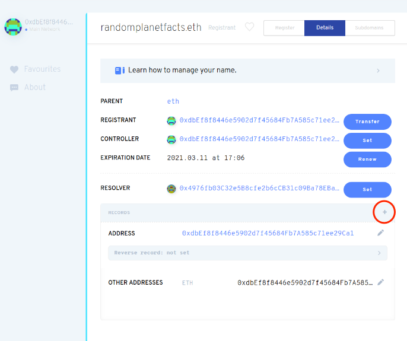

# 链接域
用户可以通过在地址栏中输入内容标识符 (CID) 来查看您的网站。但是，就像 IP 地址一样，CID 并不是特别用户友好或好看。为了解决这个问题，我们可以将域名映射到您的 CID，这样当用户访问时，`www.YourDomain.com` 他们将被转发到您在 IPFS 上托管的站点。本指南向您展示如何通过 DNS 映射常规域名，以及通过以太坊命名服务 (ENS) 或 Handshake 映射去中心化域。

本节完全是可选的，但遵循它将使您牢牢掌握如何使用 IPFS 管理域名。
## 域名服务 (DNS)
参见 [dnslink.io](https://dnslink.io/) （打开新窗口）解释和说明。
## 以太坊命名服务 (ENS)
以太坊名称服务 (ENS) 是一种去中心化的资源寻址方式。与将人类可读的名称转换为 IP 地址的 DNS 一样，ENS 将人类可读的名称转换为`randomplanetfacts.eth.link` 以太坊地址。然后可以使用这些地址指向 IPFS 上的 CID。ENS 旨在解决 DNS 的一些问题，主要是中间人攻击和可扩展性，无需过多赘述。有关 DNS 损坏原因的更多信息，[请查看 Cynthia Taylor 在 recompilermag.com 上的帖子](https://recompilermag.com/issues/issue-1/the-web-is-broken-how-dns-breaks-almost-every-design-principle-of-the-internet/) （打开新窗口）.
### 你需要的东西
您需要这些东西才能通过 ENS 获取域名：

- [metamask](https://metamask.io/)（打开新窗口）安装了浏览器扩展。
- 一个以太坊账户，`ETH` 里面有一些。
- 托管在 IPFS 上的网站。如果您一直在学习本教程系列，您应该已经准备好网站和 CID。
- 一个很酷的域名创意！

域名价格
	
	您的域的成本取决于以下几点：
	
	- 您要购买哪个域名。
	- ETH 的当前价格。
	- 与您的交易相关的汽油费。
	- 您想要域名的时长。
	
	您选择预付的年数越多，您在汽油费上的总体花费就越少：(1 year + 1 gas fee) < (10 years + 1 gas fee) < (10 * (1 year + 1 gas fee))

### 购买以太坊域名
1. 转到 `ens.eth` 使用支持 ENS 域的浏览器，例如 Brave 或 Opera。你也可以去 [app.ens.domains](https://app.ens.domains/) （打开新窗口）使用常规 DNS 和集中式网络。
2. 登录 MetaMask：

	
3. 搜索您要使用的域：

	
4. 如果可用，请单击域。
5. 单击请求注册

	
6. 在弹出的 MetaMask 窗口中，点击 `Confirm`。此操作将使您付出代价 `ETH`。
7. 等待请求注册交易完成。此过程可能需要几分钟时间：

	
8. ENS 要求您在交易完成后等待大约一分钟。这种延迟是为了确保没有其他人试图与您同时购买同一域名：

	
9. 单击注册。然后在弹出的MetaMask窗口中点击确认：

	
10. 等待交易确认。此过程可能需要几分钟时间：

	

	您现在应该能够看到您.eth域的所有设置：
	
	

### 链接您的 IPFS 内容标识符 (CID)
1. 单击Records+旁边的加号图标：

	
2. 从下拉列表中选择内容：

	
3. 将内容文本框设置为您网站的 CID，前缀为 `ipfs://`：

	
4. 通过单击MetaMask 弹出窗口中的确认来确认此更改：

	
	
	此交易可能需要几分钟才能完成。

几分钟后，您就可以访问 `Your_Domain.eth`并查看您的网站。注意结尾的斜线 `/`。因为 `.eth` 不是注册的 DNS 顶级域，所以通常无法通过常规浏览器访问。

[以太坊链接](https://eth.link/) （打开新窗口）为任何浏览器提供一种访问您的网站的方法。只需附加 `.link` 到您的域。例如，`Your_Domain.eth.link`。为此不需要额外的步骤。

## Handshake
Handshake 是专门为 DNS 构建的区块链。

当您尝试访问 GitHub.com 等网站时，您的浏览器首先需要弄清楚如何访问 .com 的服务器。要查找 .com，您的浏览器将查询称为根区域文件的东西——您可以将其想象成一个电子表格，其中 A 列是顶级域，例如 .com、.net、.org、.io，B 列是每个 TLD 指向的服务器。控制根区域文件的是一个名为 ICANN 的实体，他们单独决定是否允许您拥有顶级域。

Handshake 正在将根区域文件的控制权从 ICANN 转移到去中心化的区块链。从实用的角度来看，Handshake 提供了完全去中心化且不受审查的顶级域，您可以拥有这些域并将其用于您的网站。要了解更多信息，请访问 [Namebase](https://learn.namebase.io/) 学习中心 （打开新窗口）.

### 先决条件
在我们开始之前，您需要：

- [Handshake 域](https://learn.namebase.io/starting-from-zero/how-to-get-a-name)（打开新窗口）
- 您在 IPFS 上托管的网站的 CID
- [一种解析 Handshake 域的方法](https://www.namebase.io/blog/how-to-access-handshake-domains/) （打开新窗口）（测试设置）

### 裸顶级域名
1. 访问您名称的 DNS 记录。您正在寻找可以为您的域添加 `ALIAS` 和 `TXT` 记录的位置。
2.  创建一个 `ALIAS` 记录：将主机设置为 `@`。A。将值设置为并注意末尾的 `ipfs.namebase.io`.尾随点. `ipfs.namebase.io`.
3. 创建一个 `TXT` 记录：将主机设置为 `_dnslink` 。A。将值设置为 `dnslink=/ipfs/SITE_CID`，替换 `SITE_CID` 为您网站的 CID。
4. 保存您的更改。

您现在应该能够在您的 Handshake 域中访问您的 IPFS 网站！如果您的 Handshake 名称是 `yourname/`，您可以访问您的网站 http://yourname/ （没有点，只有 yourname/！）

### 子域
如果您想在子域而不是裸 TLD（例如 `sub.yourname/ `vs. `yourname/`）上创建您的网站，请按照以下说明进行操作：

1. 访问您名称的 DNS 记录

	您正在寻找可以为您的域添加 `CNAME` 和 `TXT` 记录的位置。
2. 创建一个 `CNAME` 记录：
	- 将 Host 设置为 `sub`，替换 `sub` 为您想要的子域名。
	- 将值设置为并注意末尾的 `ipfs.namebase.io.` 尾随点 `.ipfs.namebase.io`.
3. 创建一个 `TXT` 记录
	- 将 Host 设置为 `_dnslink.sub`，替换 `sub` 为您想要的子域名。
	- 将值设置为dnslink=/ipfs/SITE_CID，替换SITE_CID为您网站的 CID。
4. 保存您的更改

您现在应该能够在您的 Handshake 域中访问您的 IPFS 网站！如果您的 Handshake 名称是 `sub.yourname/`，您可以访问您的网站 `http://sub.yourname/`

提示

如果您更喜欢将 Handshake 支持的 DNSLink 与您的自定义网关一起使用，请使用 `ipfs daemon` 为您的域启用 Handshake 解析器的配置运行：`ipfs config --json DNS.Resolvers '{ "yourname": "https://query.hdns.io/dns-query" }`。[了解如何从 Kubo 配置文档中](https://github.com/ipfs/kubo/blob/master/docs/config.md#gateway-recipes)的网关配方运行自托管、站点特定的 DNSLink 网关 （打开新窗口）.

