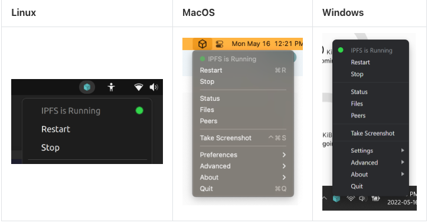
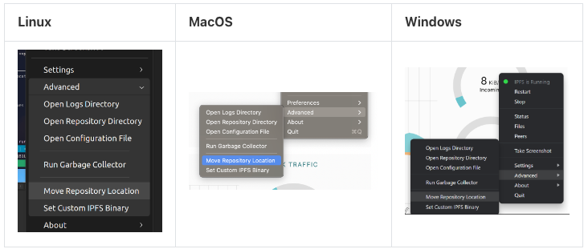

# 移动 IPFS 安装
本页介绍如何将 IPFS 安装从一个系统移动到另一个系统。这个过程是跨平台兼容的，对正在更换操作系统的读者特别有用。但是，CLI 和 IPFS 桌面用户的过程不同。

- [命令行](https://docs.ipfs.tech/how-to/move-ipfs-installation/move-ipfs-installation/#command-line)
- [IPFS桌面](https://docs.ipfs.tech/how-to/move-ipfs-installation/move-ipfs-installation/#ipfs-desktop)
- [符号链接](https://docs.ipfs.tech/how-to/move-ipfs-installation/move-ipfs-installation/#symlink)

## 命令行
`.ipfs` 过程是从系统的主目录中获取文件夹，并将其复制到接收系统的主目录中。

此过程不是备份过程；不要这样对待它。这个过程中可能会出现很多问题，其中大部分与 `peer IDs` 相关。由于我们正在复制一个 `.ipfs` 安装文件夹，因此两个 IPFS 对等点具有相同的对等 ID。只要在复制完成后删除旧的安装，这个问题就可以了。永远不要在不同的地方启动两个具有相同点 ID 的点，因为它们会行为不端。
### 移动安装
移动 IPFS 安装的最简单方法是获取 .ipfs 文件夹，并将其移动到另一个目的地。

- Linux 和 MacOS
	1. 停止当前正在运行的任何 IPFS 守护程序、服务或应用程序。
	2. 在终端中，移动到存储 IPFS 存储库的位置。这可能是您的主文件夹：

			cd ~/
	3. 制作目录的副本 `.ipfs`：

			cp --recursive --verbose $([[ -z $(cp --help | grep "\-\-reflink" | head -n1) ]] || echo -n "--reflink=auto") .ipfs ipfs-backup
		这将输出如下内容：

			'.ipfs' -> 'ipfs-backup'
			'.ipfs/datastore_spec' -> 'ipfs-backup/data'
			...

		上述命令检查当前操作系统是否支持该cp --reflink命令。如果是，就像在大多数 Linux 操作系统中一样，那么此命令将--reflink在调用cp程序时使用参数。如果操作系统不支持该--reflink参数，如 MacOS，则不会使用该参数。
	4. 您现在在该文件夹中有一个 IPFS 存储库的副本 `ipfs-backup`。

- win
	1. 停止当前正在运行的任何 IPFS 守护程序、服务或应用程序。
	2. 打开文件资源管理器并转到 `C:\Users\YOUR USERNAME`，将 YOUR USERNAME 替换为您当前的 Windows 用户名。
	3. 选择文件资源管理器窗口顶部的“查看”选项卡，然后选中“隐藏的项目”复选框。
	4. `.ipfs` 在用户的主文件夹中找到。这通常是 `C:\Users\YOUR_USERNAME\.ipfs`.
	5. 将此文件夹复制到方便的地方，如Desktop，并将其重命名为ipfs-backup。

### 恢复安装
在 中备份 IPFS 存储库后 `ipfs-backup`，您可以将其移动到要恢复到的位置。在那里，您可以恢复您的 IPFS 存储库。

- Linux 和 macOS
	1. 停止当前正在运行的任何 IPFS 守护程序、服务或应用程序。
	2. 在终端中，移动到存储 IPFS 存储库的位置。这可能是您的主 ~文件夹：

			cd ~/
	3. 将您当前的 IPFS 存储库移动到另一个文件夹。如果出现问题，您可以从此处恢复安装：

			mv .ipfs ~/ipfs-old
	4. 将您的备份 IPFS 存储库移动到.ipfs：

			mv ipfs-backup ~/.ipfs
	5. 启动 IPFS 守护进程：

			ipfs daemon
	6. 你的 IPFS 守护进程应该从它停止的地方继续。
	7. 确认一切正常后，您可以删除临时 `ipfs-old` 备份：

			rm -rf .ipfs-old
- win
	1. 如果恢复到 IPFS 桌面应用程序，请在尝试恢复任何内容之前至少打开该应用程序一次。
	2. 停止当前正在运行的任何 IPFS 守护程序、服务或应用程序。
	3. 打开文件资源管理器并转到 `C:\Users\YOUR_USERNAME`.
	4. 选择文件资源管理器窗口顶部的“查看”选项卡，然后选中“隐藏的项目”复选框。
	5. `.ipfs` 在用户的主文件夹中找到。完整地址通常类似于 `C:\Users\YOUR_USERNAME\.ipfs`.
	6. 将. `ipfs`文件夹重命名为 `ipfs-old`. `ipfs-old` 如果出现任何问题，我们可以从中恢复。
	7. `ipfs-backup` 将您的 IPFS 存储库复制到您用户的主文件夹中，并将其重命名为 `.ipfs`.
	8. 打开 IPFS 桌面应用程序或 `ipfs daemon` 使用 Powershell 运行。一切都应该开始，您的 IPFS 存储库应该正常恢复。

### 适用于 Linux 的 Windows 子系统
如果您在 Linux 的 Windows 子系统中安装了 IPFS，则可以将 IPFS 存储库从 Linux 移动到 Windows 环境中。此过程会覆盖 Windows 中的 IPFS 存储库。

1. 在 Windows 上，打开 IPFS 桌面应用程序或运行 `ipfs daemon`. 至少这样做一次。
2. 停止任何 IPFS 守护程序、服务或应用程序在您的 Linux 和 Windows 环境中运行。
3. 将 Linux IPFS 存储库复制到 Windows。此过程会覆盖 Windows 中的 IPFS 存储库：

		cp --recursive --verbose ~/.ipfs /mnt/c/Users/Your Username/
4. 在 Windows 上，打开 IPFS 桌面应用程序或运行ipfs daemon. 一切都应该成功打开。

## IPFS 桌面
按照以下步骤使用 IPFS 桌面应用程序移动您的 IPFS 安装。

1. 选择 IPFS 桌面托盘菜单。

	
2. 选择高级→移动存储库位置。

		
3. 在文件浏览器中选择新的 IPFS 位置。
4. IPFS 将停止，将您的存储库移动到新位置，然后再次启动。如果您的存储库大于 1 GiB，可能需要一些时间才能将其移动到新位置。

## 符号链接
移动 IPFS 存储库的另一种方法是简单地在指向新位置的原始位置创建一个符号链接。这样，无需更改任何配置，因此 IPFS Desktop 等工具和应用程序将正常工作。
### Linux 和 MacOS
基于 Unix 的操作系统可以使用ln -s命令创建符号链接：

	ln -s ~/.ipfs ~/new-ipfs-repo
### win
Windows 用户可以使用该mklink命令创建符号链接。此命令在命令提示符或 PowerShell 中可用：

	mklink "C:\New IPFS Repo" "C:\Windows\Users\YOUR_USERNAME\.ipfs\"
确保替换 `YOUR_USERNAME` 为您当前登录的用户名。
## 故障排除
以下是您在移动 IPFS 安装时可能遇到的一些常见问题。
### Linux 和 macOS
- IPFS 守护进程未成功运行

	如果 `ipfs daemon` 没有成功运行，那么您可以恢复旧的 IPFS 存储库，假设您制作了一个副本：

		mv .ipfs ipfs-backup-broken
		mv .ipfs-old .ipfs
	现在运行 `ipfs daemon` 加载您的旧 IPFS 存储库。尝试重复备份和还原步骤。确保在备份和恢复 IPFS 存储库时停止任何 IPFS 服务、守护程序或应用程序。
- 旧安装中的某些数据在新安装中丢失

	如果您之前使用 `sudo ` 运行过一些 ipfs 命令，例如，`sudo ipfs get $some CID` `ipfs` 命令可能已经为 `root` 用户创建了一个新的 IPFS 存储库，与您的用户帐户的存储库分开。

	如果您对旧系统具有 `root/sudo` 访问权限，请检查该目录是否 `/root/.ipfs` 存在。如果是这样，请备份该 `/root/.ipfs` 目录，如上所述。

	如果要合并两个存储库，可以将 IPFS 对象从一个存储库导出到一组 CAR 文件，然后将它们导入到不同的存储库。

	下面是一个小的 bash 片段，用于将所有本地 IPFS 对象导出到名为 `car_export`. 这些命令应该以拥有要导出的存储库的用户身份运行，并且 ipfs 守护进程应该正在运行。

		mkdir -p car_export
		cd car_export
		cids=$(ipfs refs local)
		for cid in $cids; do
		  echo "exporting $cid"
		  ipfs dag export $cid > $cid.car
		done
	然后，您应该能够使用如下命令将这些文件导入到新的 IPFS 安装中：

		cd car_export
		ipfs dag import *.car
### win
- IPFS Desktop 出现错误

	在尝试移动任何 IPFS 存储库之前，请确保至少打开一次 IPFS 桌面应用程序。IPFS 桌面依赖于另一个名为 `.ipfs-desktop`. 如果此文件夹不存在，迁移有时会失败。
- IPFS 桌面打不开

	在您用户的主文件夹中，分别将 `.ipfs` 和重命名 `.ipfs-desktop` 为 `ipfs-broken` 和 `ipfs-desktop-broken` 。打开 IPFS 桌面应用程序；这会创建新的 `.ipfs` 和 `.ipfs-desktop` 文件夹。关闭 IPFS 桌面应用程序并替换 `.ipfs` 为 `ipfs-broken` . 如果 IPFS 桌面应用程序打开，那么您现在知道原始 `.ipfs-desktop` 文件夹是问题所在。如果 IPFS 桌面应用程序未打开，则原始 `.ipfs` 文件夹可能是问题所在。如果两个原始文件夹都导致问题，则您的数据库可能已损坏。如果是这种情况，请在 IPFS 论坛上发布您的问题 （打开新窗口）.