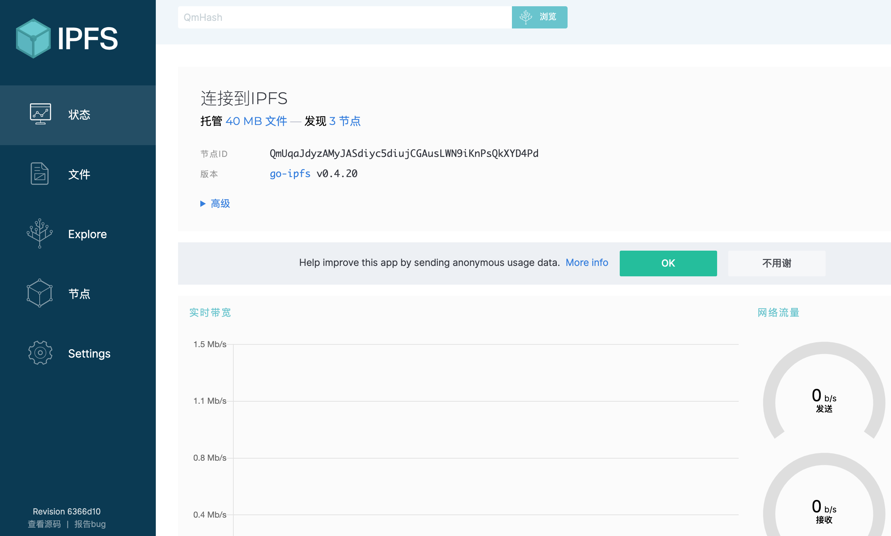
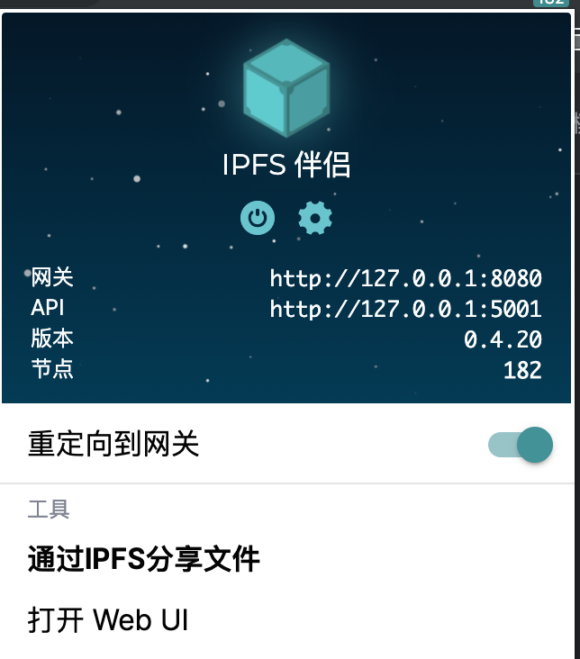

# 入门
## 安装IPFS
如果您还没 IPFS，那么第一步就是安装IPFS！大多数人更喜欢安装预构建的软件包，你可以在 [IPFS 发行版](https://dist.ipfs.io/#go-ipfs)页面上点击“安装go-ipfs”（我们用Go编写的参考实现），然后按照[预建包的安装](https://docs.ipfs.io/introduction/install/#installing-from-a-prebuilt-package)说明进行操作。

[下载适用于您的平台的IPFS](https://dist.ipfs.io/#go-ipfs)   

不想使用命令行吗？还可以给 IPFS 的桌面应用程序实现了！[在这里开始吧](https://docs.ipfs.io/introduction/usage/)

有关更多安装选项，例如从源代码构建和提示，请访问我们的[安装指南](https://docs.ipfs.io/guides/guides/install/)。如果您有任何疑问或卡住，请随时在 [https://discuss.ipfs.io/](https://discuss.ipfs.io/) 或 [chat.freenode.net](irc://chat.freenode.net/%23ipfs) 上的 #ipfs 中[寻求帮助](irc://chat.freenode.net/%23ipfs)。
## 初始化存储库
ipfs 将所有设置和内部数据存储在称为存储库的目录中。在第一次使用 IPFS 之前，需要使用以下 `ipfs init` 命令初始化存储库：

	> ipfs init
	initializing ipfs node at /Users/jbenet/.go-ipfs
	generating 2048-bit RSA keypair...done
	peer identity: Qmcpo2iLBikrdf1d6QU6vXuNb6P7hwrbNPW9kLAH8eG67z
	to get started, enter:
	
	  ipfs cat /ipfs/QmYwAPJzv5CZsnA625s3Xf2nemtYgPpHdWEz79ojWnPbdG/readme

如果在数据中心的服务器上运行，则应使用 server 和配置文件初始化 IPFS 。这将阻止 IPFS 在尝试发现本地节点时创建大量数据中心内部流量：

	> ipfs init --profile server
您可能需要设置许多其他配置选项 - 请查看[完整参考资料](https://github.com/ipfs/go-ipfs/blob/v0.4.15/docs/config.md)以获取更多信息。

hash after `peer identity`: 是节点的 ID，与上面输出中显示的不同。网络上的其他节点使用它来查找和连接到您。`ipfs id` 如果需要，您可以随时运行以再次获取它。

现在，尝试在 `ipfs init` 的输出中运行建议给你的命令。一个看起来像 `ipfs cat /ipfs/<HASH>/readme`。

应该看到这样的东西：

	Hello and Welcome to IPFS!
	
	██╗██████╗ ███████╗███████╗
	██║██╔══██╗██╔════╝██╔════╝
	██║██████╔╝█████╗  ███████╗
	██║██╔═══╝ ██╔══╝  ╚════██║
	██║██║     ██║     ███████║
	╚═╝╚═╝     ╚═╝     ╚══════╝
	
	If you're seeing this, you have successfully installed
	IPFS and are now interfacing with the ipfs merkledag!
	
	 -------------------------------------------------------
	| Warning:                                              |
	|   This is alpha software. use at your own discretion! |
	|   Much is missing or lacking polish. There are bugs.  |
	|   Not yet secure. Read the security notes for more.   |
	 -------------------------------------------------------
	
	Check out some of the other files in this directory:
	
	  ./about
	  ./help
	  ./quick-start     <-- usage examples
	  ./readme          <-- this file
	  ./security-notes

你可以在那里探索其他物体。特别是，请查看 `quick-start`：

	ipfs cat /ipfs/QmYwAPJzv5CZsnA625s3Xf2nemtYgPpHdWEz79ojWnPbdG/quick-start
这将向您介绍几个有趣的例子。

## 上网
准备好在线处理后，在另一个终端中运行守护程序：

	> ipfs daemon
	Initializing daemon...
	API server listening on /ip4/127.0.0.1/tcp/5001
	Gateway server listening on /ip4/127.0.0.1/tcp/8080
等待所有三行出现。

记下你得到的tcp端口。如果它们不同，请在下面的命令中使用您的。
现在，切换回原始终端。如果您已连接到网络，则在运行时应该能够看到对等方的ipfs地址：

	> ipfs swarm peers
	/ip4/104.131.131.82/tcp/4001/ipfs/QmaCpDMGvV2BGHeYERUEnRQAwe3N8SzbUtfsmvsqQLuvuJ
	/ip4/104.236.151.122/tcp/4001/ipfs/QmSoLju6m7xTh3DuokvT3886QRYqxAzb1kShaanJgW36yx
	/ip4/134.121.64.93/tcp/1035/ipfs/QmWHyrPWQnsz1wxHR219ooJDYTvxJPyZuDUPSDpdsAovN5
	/ip4/178.62.8.190/tcp/4002/ipfs/QmdXzZ25cyzSF99csCQmmPZ1NTbWTe8qtKFaZKpZQPdTFB

这些是组合 `<transport address>/ipfs/<hash-of-public-key>`。

现在，应该能够从网络中获取对象。尝试：

	ipfs cat /ipfs/QmW2WQi7j6c7UgJTarActp7tDNikE4B2qXtFCfLPdsgaTQ/cat.jpg >cat.jpg
	open cat.jpg
	
而且，应该能够提供网络对象。尝试添加一个，然后在您喜欢的浏览器中查看它。在此示例中，我们使用的 curl 是浏览器，但您也可以在其他浏览器中打开 IPFS URL：

	> hash=`echo "I <3 IPFS -$(whoami)" | ipfs add -q`
	> curl "https://ipfs.io/ipfs/$hash"
	I <3 IPFS -<your username>
很酷，对吧？网关从您的计算机提供文件。网关查询 DHT，找到您的机器，请求文件，您的机器将其发送到网关，网关将其发送到您的浏览器。

	注意：视网络状态而定，curl 可能需要一段时间。公共网关可能超时或者超载。

也可以在自己的本地网关上查看：

	> curl "http://127.0.0.1:8080/ipfs/$hash"
	I <3 IPFS -<your username>
默认情况下，您的网关不会对外开放，它只在本地运行。

## 花哨的Web控制台
我们还有一个Web控制台，您可以使用它来检查节点的状态。在您喜欢的网络浏览器上，转到：

	http://localhost:5001/webui
这应该会打开一个像这样的控制台：

## Web 控制台连接视图
[IPFS Companion](https://github.com/ipfs-shipyard/ipfs-companion#ipfs-companion) 是一个浏览器扩展，它简化了对 IPFS 资源的访问，并增加了对 IPFS 协议的支持。

它会自动将IPFS网关请求重定向到您的本地守护程序，这样您就不会依赖或信任远程网关。支持各种游览器