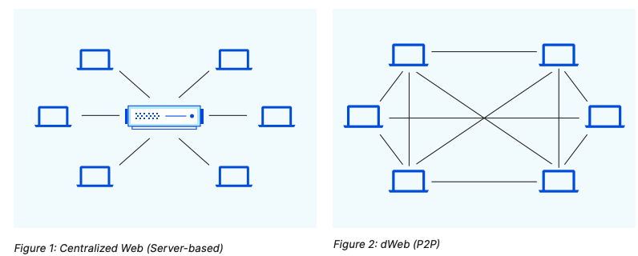
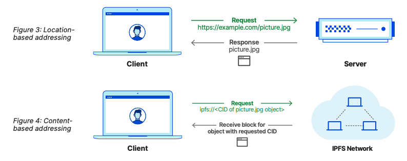
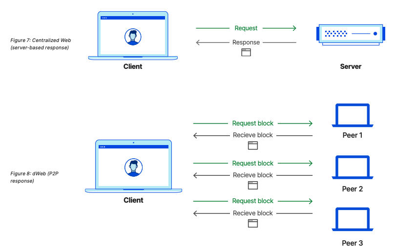
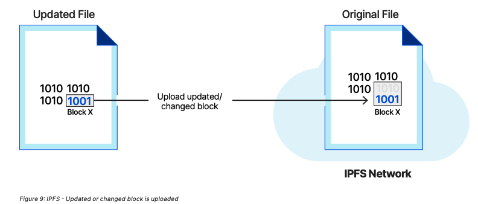
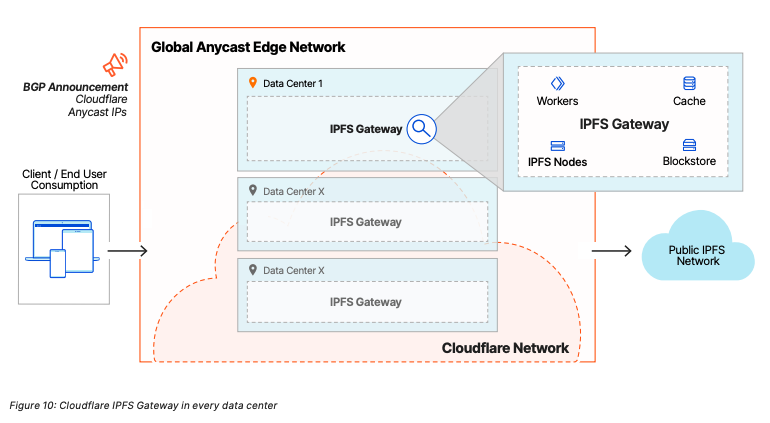
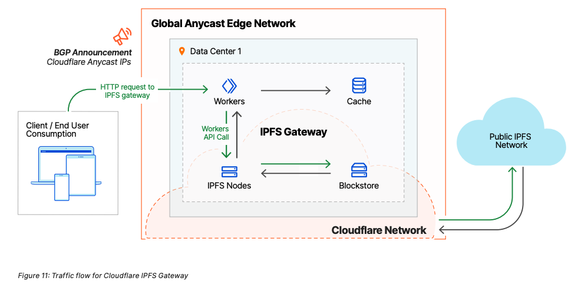

# Cloudflare IPFS Gateway 白皮书
本文档中描述的 Cloudflare IPFS Gateway 的架构和各自的行为是针对通用可用性(GA)的。由于该文档是在 GA 之前编写的，因此可能在 GA 之前发布的一些技术细节、架构、特性或决策会发生变化。

星际文件系统 (IPFS) 是一种用于存储和共享数据的协议和点对点(P2P)分布式网络;IPFS网络中的节点对分布式文件系统有贡献。与今天的集中式web 模型相比，IPFS 是实现分散、分布式 web 版本(dWeb)的关键组件。

本白皮书讨论了当前集中式 web (web 2.0)的挑战，IPFS 如何帮助缓解这些挑战，并迈向去中心化 web (web 3.0或Web3)，以及 Cloudflare IPFS Gateway 的优点。

## 集中式 web2.0 的挑战
我们今天所知道的 web 是围绕着一个以主机为中心的模型发展起来的，终端用户(客户端)从中央存储库(服务器在本地或在云中)请求内容。例如，客户端(计算机或移动设备上的web浏览器)将向 web 服务器发送 HTTP 请求，以侦听特定端口上的请求。

一旦接收到请求，web 服务器将返回一个响应给客户端。当前的模式提出了几个挑战，如下所示。

- 持久性

	如果提供内容/资产的集中式服务器不可用或经历了内容丢失的事件，内容从 Web 上消失。
- 信任/验证

	在今天的 Web 2.0 中，基于位置的寻址并不会强制用户接收他们所请求的内容;必须采取其他措施，以确保收到的内容是所请求的内容，并且没有被篡改。
- 竖井数据

	数据往往被竖井存储在集中存储库中，不容易在应用程序和用户之间共享。虽然在某些情况下可能存在用于导出数据的集成和方法，但使用 IPFS，没有专有的围墙花园和依赖支持; 数据是去中心化的，任何人都可以使用不同的接口来访问它。
- 局部性/性能

	内容可能从一个中心化的位置提供，而不一定是本地或靠近最终用户，因此导致更高的延迟。中心化的位置需要额外的资源和干预，以随着需求的增加而扩展。此外，下载内容的延迟与客户端和服务器之间的1:1关系有关。
- 复制

	多人可以发布相同的内容/文件，创建复制;此外，如果对内容进行了更改，则会重新发布整个内容/文件。
	
## 理解 dWeb/IPFS 好处和用例
### dWeb的两个核心原则
1. 没有一个中央实体负责存储和提供网络内容。
2. 它是一个不可信的模型，具有不可变性和可验证性。

IPFS 为 dWeb 提供存储层。它可以被设想为一个相互连接的节点网络，这些节点能够使用相同的协议相互通信和共享数据。这个模型更符合 Web 作为连接设备的分散网络的最初概念。IPFS 展示了dWeb 的两个核心原则——去中心化和无信任模型，其中内置了验证。

IPFS 使用许多不同的协议来导入、命名、查找和获取数据。深入探讨所有相关协议以及 IPFS 如何运行超出了本文的范围，但有几个重要的要点需要注意:

- IPFS 是一个 P2P 网络，因此本身是分布式的;在任何时候，网络上的一个节点都将连接到网络上其他节点的一个子集。
- IPFS 通过内容标识符(cid)使用基于内容的寻址来引用和检索数据/内容;一个 CID 由一个加密哈希组成，IPFS 中存储的每个对象都有一个唯一的 CID。
- 存储在 IPFS 中的任何内容都是不可变的;更新内容将创建一个具有新 CID 的新对象。
- 大的内容/对象默认被分割成 256 个kiB对象(注意:大小是可配置的选项，最大 1 MiB)。IPFS 创建一个链接到所有内容片段的空 IPFS 对象。这种数据分块有一些固有的好处，因为对象/块可以分布在更多的主机上。此外，分块到多个对象/块提供了本地重复数据删除:相同的块可以用于更新或适用的不同内容。
- IPFS 通过垃圾收集删除不再需要的数据来释放 IPFS 节点上的磁盘空间。IPFS 节点可以通过固定数据来保护数据不受垃圾收集的影响。pin 数据告诉 IPFS 总是在某处保留给定的对象;默认情况下，这是本地节点。还有一些固定服务可以固定数据，使数据在 IPFS 中持久化，而无需用户运行固定的 IPFS 节点。
- 如前所述，IPFS 中的内容是通过 cid 检索的。但是，由于内容是不可变的，所以在进行更新时，会创建新的 cid。对内容的任何更新都会改变 CID，用户可能希望为最新更新提供 CID。有一些解决方案，如 `InterPlanetary Name System (IPNS)`、`DNSLink` 和 `Ethereum Name Service (ENS)`，用户可以使用它们将 IPFS 哈希/CID 映射到可变地址。对这些解决方案的详细讨论超出了本文的范围。

IPFS 的多重好处以及它如何解决集中式 web 的挑战将在下面进行更详细的讨论

### 分散/耐用性
使用 IPFS 时没有指定的中心提供商来提供内容。相反，每个节点与任何能够服务于内容的节点是相等的。下面的图1和图2显示了当前集中式Web和使用IPFS的dWeb模型之间的区别。

### dWeb/P2P模型的好处是

1. 任何人都可以发布内容，而无需依赖单一的托管提供商。用户可以灵活地使用多个供应商，并使用一致的界面访问内容，而不是被锁定在一个供应商上。用户可以使用自己的环境/节点进行固定和持久，使用多个免费或商业提供商，或使用自己的节点和固定服务的组合。

2. 内容是分散的，因此可用性提高了，因为多个节点可以为内容服务。如果一个节点离线，其他可用的IPFS节点仍然能够提供内容。

### 信任/验证
使用 HTTPS，用户可以拥有到站点的安全加密连接。但是由于 HTTP 使用基于位置的寻址，因此不能保证用户将收到他们请求的内容。如果服务器被黑客攻击，用户可能会收到篡改或恶意内容。没有内在的验证，用户明确地信任提供者。在 IPFS 中，使用密码学将信任和验证隐式地内置到系统中。当一个文件被添加到 IPFS 中时，它是不可变的，并且通过唯一的哈希或 CID 来引用它。与存储在 IPFS 中的内容相关联的加密散列是基于内容寻址的基础。当客户端发出请求时，它请求知道其 CID 的内容。此外，当使用诸如 IPNS、DNSLink 或 ENS 这样的命名服务时，最终请求将解析为请求对象/内容的 CID。下面的图3和图4显示了今天在 HTTP 中使用的基于位置的寻址和IPFS中使用的基于内容的寻址之间的区别。

- 定位解决的例子

	基于位置的寻址不能保证用户收到的是他们想要收到的。

	http://example.com/picture.jpg
- 基于内容寻址的例子

	基于内容的寻址具有一种不可信的模型，在这种模型中，不可变性和验证内在地构建在使用散列或 cid 存储和请求数据的过程中。内容一旦存储，就不能更改。如果进行了任何更新，就会创建一个新的对象和关联的散列。

	IPFS URL 将具有以下语义: `ipfs://<CID>/<path>`

	下面是一个通过CID请求对象的示例。

		ipfs://QmRfGgnt2jokJP6Eh4GH7FbR3RPxmkn tKHyCXq5gNp8QuU
- 不再有孤立的数据

	现在，应用程序和用户数据存储在大型私有和公共云的集中存储库中。跨多个环境共享应用程序数据并不容易。此外，用户几乎无法控制自己的数据，因为数据通常由一个实体存储。
	
	通过 IPFS，任何数据都可以轻松地在不同的应用程序和最终用户之间分发和共享，因为该模型不依赖于中央控制。
	
	
- 位置/性能

	IPFS还具有性能优势:

	- 由于 IPFS 是一个分布式文件系统组成的去中心化网络，没有一个中心实体成为服务所有内容请求的瓶颈。相反，P2P 网络中任何有缓存内容的节点都可以为它提供服务。
	- 与每次从一个服务器下载文件的 HTTP 不同，像 IPFS 这样的 P2P 网络同时从多个节点检索请求内容的数据片段，这可以降低成本和延迟。这也使得在没有重复的情况下高效地分发大量数据成为可能。像 bitTorrent 这样的 P2P 协议早就显示出同时利用多个节点检索内容的性能优势。

	下面的图7和图8描述了在集中式模型中下载的文件和在 IPFS 等 P2P 模型中下载的文件。

	注意，IPFS 使用另一种称为 Bitswap 的协议来发现、请求和接收具有唯一散列的给定内容/对象的数据块。简而言之，Bitswap 是一种基于消息的协议，由一个用于交换数据块的核心模块组成。它负责指挥请求和向网络中的其他对等点发送数据块。每个 IPFS 节点向它想要接收的对等块发送一个列表。每当一个节点接收到一个块，它就检查是否有任何对等节点想要这个块，并将它发送给它们。
	
	
- 重复数据删除/高效存储

	IPFS 本身内置了重复数据删除功能，可以更有效地使用存储资源。IPFS 在这里采取了几个核心行动:
	
	- IPFS 不会存储相同的内容两次-每个内容/对象都有一个唯一的散列。
	- IPFS 将数据块成块，如果这些块的内容没有改变，那么作为重复数据删除的一部分，可以利用相同的块。下图中显示了这一点，其中只上传了最后一块更新的内容。
	- 存储在 IPFS 上的内容/数据是不可变的，因此更新涉及到创建新的内容/对象。如前所述，由于数据分块和存储在 IPFS 中的方式，存在一些固有的重复数据删除。此外，使用一个插件或版本控制系统 (VCS)，可以实现一个健壮的版本控制，在任何内容更新中只上传更改;IPFS 体系结构使这成为可能。

	
	
## 为什么是Cloudflare IPFS Gateway?
今天，IPFS 还没有达到 HTTP 的成熟水平。例如，主流浏览器还不支持原生 IPFS 网络和寻址。然而正如本文档所述，使用 IPFS 有非常明显的好处和优势，许多公司已经开始使用它。

Cloudflare IPFS Gateway 在当前的 Web 2.0 模型和新的去中心化和不可信的 Web3 模型之间提供了一座桥梁。通过 Cloudflare IPFS Gateway，客户可以开始利用 IPFS，并通过 HTTP 轻松访问 IPFS 上的内容。IPFS 基于内容寻址的一个缺点是哈希值很难记住。为了帮助缓解这一缺点，客户可以使用 Cloudflare DNS 将 IPFS 内容映射到域名。简而言之，Cloudflare IPFS Gateway 允许客户继续使用 HTTP，同时享受 IPFS 的好处。它允许更大的用户使用传统的 web 客户端轻松消费。

Cloudflare IPFS Gateway 的另一个主要好处是它位于 Cloudflare 的全球 Anycast 边缘网络，并继承可靠性、安全性、缓存和性能的所有相关优点

### Cloudflare IPFS 网关能力
Cloudflare IPFS Gateway提供以下功能:

1. 轻松检索 IPFS 内容的能力

	客户可以轻松访问 IPFS 网络上的内容，而无需部署和保护自己的 IPFS 节点。Cloudflare 的网关利用其自身弹性和安全加固网络上的 IPFS 节点来检索IPFS 内容。Cloudflare IPFS 网关可以被视为 IPFS 前面的缓存。Cloudflare IPFS Gateway 不能用于修改或删除 IPFS 网络中的内容。
2. 通过自定义域名提供 IPFS 内容的能力

	IPFS 支持使用 DNS 将容易记住的名称映射到 IPFS 内容。DNSLink 是用来这样做的协议。Cloudflare支持 DNSLink，允许客户通过其域名提供 IPFS 内容。
3. 为 IPFS 内容(缓存、性能、可靠性)利用 CDN

	当使用 Cloudflare IPFS Gateway 时，客户可以获得使用 Cloudflare CDN 的额外好处，它可以缓存接近用户的 IPFS 内容，提高整体性能。
4. IPFS Gateway 和 Cloudflare 的安全、可靠性和性能能力/产品的单层玻璃

	客户可以使用 IPFS Gateway 并通过单层玻璃管理他们的完整安全模型和 Cloudflare 的额外可靠性和性能能力/产品。
	
### Cloudflare IPFS Gateway 的优点
使用 Cloudflare IPFS Gateway 的几个好处是:

1. 易于访问

	从 IPFS 网络访问内容的一种简单方法，不需要安装和运行任何特殊软件。
2. 安全性

	由于用户无需安装任何软件，而是利用 IPFS Gateway，安全负担已转移到 Cloudflare，该公司使用其全球 Anycast 基础设施提供增强的安全性。

	Cloudflare 过滤 HTTP 接口的内容，类似于 Cloudflare 多年来一直提供的当前 HTTP 保护;这有助于防止恶意内容的传播。

	此外，Cloudflare 还实现了 IPFS 安全模式——在所有原生 IPFS 节点上使用的 IPFS 实现之上的节点保护层，提供了在原生 IPFS 级别防止恶意内容分发的能力。关于 IPFS 安全模式的更多信息可以在 Cloudflare 的博客这里找到。
3. 无需维护/监控

	由于 Cloudflare 提供了通往 IPFS 网络的网关，因此客户无需维护任何东西。Cloudflare 负责维护和监控安全性、可靠性和性能。
4. 可靠性

	Cloudflare 为 IPFS 网关提供的全球 Anycast 网络提供了高水平的可靠性和可用性。
5. 性能

	因为 IPFS 网关在 Cloudflare 的边缘网络上，由数据中心遍布100多个国家，客户受益于性能。
	
	使用 IPFS 内容缓存，可以从距离用户最近的数据中心提供内容
	
### Cloudflare IPFS 网关架构和设计
Cloudflare IPFS Gateway 为 IPFS 提供了一个 http 访问接口，允许用户轻松检索 IPFS 内容。下图描述了 Cloudflare IPFS Gateway 架构。

	
有几个重要的事项需要注意:

- 在各自域的 DNS 中，将自动创建指向 `ipfs.cloudflare.com` 的 CNAME。
- IPFS 网关通过查找相关域的 DNSLink TXT 记录的值，知道当它接收到一个给定域的请求时提供什么内容。
- Cloudflare IPFS Gateway 有一个 Cloudflare Workers 代码组件，运行在 Cloudflare 全球数据中心的服务器上。这些数据中心遍布100多个国家，在50毫秒内覆盖全球95%的联网人口，同时提供 100Tbps 的网络容量和 DDoS 防护能力。
- IPFS 节点运行在每个 Cloudflare 数据中心;Cloudflare Workers 代码对本地 IPFS 节点进行 API 调用，这些节点反过来可以访问本地 IPFS 块存储。
- 本地数据中心内的 IPFS 节点与 Cloudflare 网络内的其他 IPFS 节点对等;可根据需要访问公网 IPFS 网络。
- 由于 Cloudflare 的网络利用了 Anycast，用户将始终访问离自己最近的数据中心。此外，Anycast 网络确保高可用性，并在出现问题时自动重路由到另一个数据中心。	

### 传输流
	
图 11 描述了流量到达 Cloudflare IPFS Gateway 时的流量。注意以下几点:

- 1. 客户 DNS 中的 CNAME 记录指向 Cloudflare IPFS Gateway URL。该请求被发送到 Cloudflare Anycast 网络中最近的数据中心和相应的 Cloudflare IPFS 网关。
- 2. Cloudflare IPFS Gateway 使用 Cloudflare Workers 并对本地 IPFS 节点进行 API 调用。本地 IPFS 节点从本地块存储请求数据。如果内容没有缓存在本地区块存储中，则可以从 Cloudflare 网络或公共 IPFS 网络中的其他 IPFS 节点检索内容。
- 一旦 Cloudflare IPFS 网关接收到来自 IPFS 节点的响应，它将缓存本地内容并响应初始请求。

### 缓存 ipfs 内容
	

Cloudflare 利用其全球网络和缓存基础设施来缓存最接近用户的 IPFS 内容提高性能。如上图所示，IPFS Workers 一旦收到 IPFS 内容就会缓存。图12演示了相同 IPFS 内容的新请求时的流量。注意，Workers 不需要对本地 IPFS 节点进行另一个 API 调用，因为 IPFS 内容已经从之前的客户端请求中缓存了。这减少了延迟，从而提高了整体性能。

Cloudflare IPFS Gateway 利用 Workers API 写入 Cloudflare 缓存。缓存项的最大保存时间为1天或86400秒。在接收内容请求时，Cloudflare IPFS Gateway将始终检查 DNSLink 记录和各自的散列，以确保缓存的内容是最新的。

worker API 在 Cloudflare Cache 中缓存内容，本地 IPFS 节点也将内容缓存到本地块存储。区块存储中 IPFS 内容的最长保存时间为 30 天。

## 总结
IPFS是Web3的存储层。它通过支持去中心化的托管和不可信的模型解决了当前Web 2.0模型的几个挑战。Cloudflare IPFS网关通过使用可通过HTTP访问的IPFS网关在Web 2.0和Web3之间建立桥梁，允许用户轻松检索IPFS内容并通过自定义域提供IPFS内容。使用Cloudflare IPFS，客户不需要部署和监控IPFS节点就可以利用IPFS。此外，客户还受益于Cloudflare网络的可靠性、安全性和性能

## 参考
[Cloudflare_IPFS_Whitepaper.pdf](https://www.cloudflare.com/static/54d73aeacf1734b61716613905649bc5/Cloudflare_IPFS_Whitepaper.pdf)

		
	
		
	
				

	
