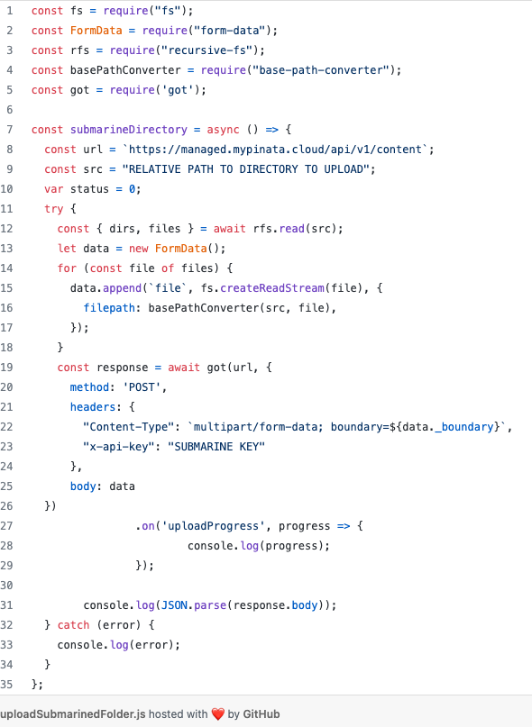

# 内容
内容端点允许您上传、列出和检索有关已潜入的文件和文件夹的信息。
## Submarine 文件或文件夹
	/content
此端点将接受单个文件或单个目录。该请求必须包含有效负载的读取流，以便 API 接受它。
### 上传单个文件
每次上传都可以选择包含文件以外的其他信息。可以包含 JSON 对象形式的元数据。元数据必须采用键值对的形式。目前无法嵌套键值对。

- `POST https://managed.mypinata.cloud/api/v1/content`
	- 参数
		- Header 
			- `x-api-key*`      SUBMARINE KEY
		- Body
			- `files*`		表示文件的读取流
			- `metadata*`     可选的字符串化对象
			- `cidVersion`	0或1表示 IPFS 协议 CID 版本
			- `wrapWithDirectory`	如果设置为 true，将单个文件打包到文件夹中
			- `pinToIPFS*`	为 False，表示隐藏文件
			- `name`		文件的名称 可选
		- 响应
			- 200

					{
					  "status": 200,
					  "totalItems": 0,
					  "items": [
					    {
					      "id": "string",
					      "createdAt": "2022-05-20T20:01:26.679Z",
					      "cid": "string",
					      "name": "string",
					      "mimeType": "string",
					      "originalname": "string",
					      "size": 0,
					      "metadata": {},
					      "pinToIPFS": false,
					      "isDuplicate": false
					    }
					  ]
					}
### 测试
- Curl

		curl --location --request POST 'https://managed.mypinata.cloud/api/v1/content' \
		--header 'x-api-key: SUBMARINE KEY' \
		--form 'files=@"/Users/Desktop/images/cat.svg"' \
		--form 'name="My File"' \
		--form 'metadata="{\"keyvalues\": { \"example\": \"value\" }}"' \
		--form 'wrapWithDirectory="false"' \
		--form 'pinToIPFS="false"'
- Node.js

		var axios = require('axios');
		var FormData = require('form-data');
		var fs = require('fs');
		var data = new FormData();
		data.append('files', fs.createReadStream('/Users/Desktop/images/cat.svg'));
		data.append('name', 'My File');
		data.append('metadata', '{"keyvalues": { "example": "value" }}');
		data.append('wrapWithDirectory', 'false');
		data.append('pinToIPFS', 'false');
		
		var config = {
		  method: 'post',
		  url: 'https://managed.mypinata.cloud/api/v1/content',
		  headers: { 
		    'x-api-key': 'Submarine Key', 
		    ...data.getHeaders()
		  },
		  data : data
		};
		
		const res = await axios(config);
		
		console.log(res.data);
- Python

		import requests
		
		url = "https://managed.mypinata.cloud/api/v1/content"
		
		payload={'name': 'My File',
		'metadata': '{"keyvalues": { "example": "value" }}',
		'wrapWithDirectory': 'false',
		'pinToIPFS': 'false'}
		files=[
		  ('files',('Submarine-Beta_Standard.svg',open('/Users/Desktop/images/cat.svg','rb'),'image/svg+xml'))
		]
		headers = {
		  'x-api-key': 'Submarine Key'
		}
		
		response = requests.request("POST", url, headers=headers, data=payload, files=files)
		
		print(response.text)
- GO

		package main
		
		import (
		  "fmt"
		  "bytes"
		  "mime/multipart"
		  "os"
		  "path/filepath"
		  "io"
		  "net/http"
		  "io/ioutil"
		)
		
		func main() {
		
		  url := "https://managed.mypinata.cloud/api/v1/content"
		  method := "POST"
		
		  payload := &bytes.Buffer{}
		  writer := multipart.NewWriter(payload)
		  file, errFile1 := os.Open("/Users/Desktop/images/cat.svg")
		  defer file.Close()
		  part1,
		         errFile1 := writer.CreateFormFile("files",filepath.Base("/Users/Desktop/images/cat.svg"))
		  _, errFile1 = io.Copy(part1, file)
		  if errFile1 != nil {
		    fmt.Println(errFile1)
		    return
		  }
		  _ = writer.WriteField("name", "My File")
		  _ = writer.WriteField("metadata", "{\"keyvalues\": { \"example\": \"value\" }}")
		  _ = writer.WriteField("wrapWithDirectory", "false")
		  _ = writer.WriteField("pinToIPFS", "false")
		  err := writer.Close()
		  if err != nil {
		    fmt.Println(err)
		    return
		  }
		
		
		  client := &http.Client {
		  }
		  req, err := http.NewRequest(method, url, payload)
		
		  if err != nil {
		    fmt.Println(err)
		    return
		  }
		  req.Header.Add("x-api-key", "Submarine Key")
		
		  req.Header.Set("Content-Type", writer.FormDataContentType())
		  res, err := client.Do(req)
		  if err != nil {
		    fmt.Println(err)
		    return
		  }
		  defer res.Body.Close()
		
		  body, err := ioutil.ReadAll(res.Body)
		  if err != nil {
		    fmt.Println(err)
		    return
		  }
		  fmt.Println(string(body))
		}
		
### 上传和潜入目录
此端点还允许用户潜入整个目录。这几乎与固定文件相同，主要区别在于我们提供了一个文件数组，并且需要为目录中的每个文件提供一个相对文件路径。

但是，我们的服务器将使用为每个文件提供的确切路径，因此每个路径都以正在上传的“base”目录开头非常重要。

例如，如果您的目录位于本地计算机上的 `“./../myBuilds/desiredBuild”`，则每个文件路径都应以 `“desiredBuild”` 开头。

我们在下面有一个上传目录的 JavaScript 示例。请注意，在示例中，我们使用 `got` 库而不是 `axios` ，但可以应用相同的通用过程 `usingaxios`或任何其他库。

