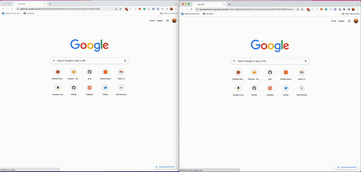

# 通过IPFS网关的流媒体视频
回想一下21世纪初。回想一下 Napster, Limewire 和 Kazaa。还记得等三个小时下载一首歌，等一整天看一个视频吗?先别管盗版了。这是消费媒体的新方式的黎明。在此之前，我们都在购买物理光盘上的媒体，在此之前，我们都在购买磁带。21世纪初，我们看到了一种新的方式，并迎来了流媒体的最终想法。

事实上，流媒体提供了更好的体验，消灭了盗版和p2p共享(或严重阻碍了盗版)。等着下载一部完整的电影听起来突然间不如每月花9.99美元在 Netflix 上观看而不用等待那么诱人。但是，如果我们没有看到 p2p 文件共享的兴起，如果我们没有感受到等待媒体下载的痛苦，我们今天可能还在等待网络上的流媒体。幸好情况并非如此。我们可以在网络上的任何地方播放视频和音乐。
## 除非那个网络是去中心化的网络。
1993年，一个名为“严重轮胎损伤”的乐队成为[第一个在互联网上直播演出的团体](https://en.wikipedia.org/wiki/Streaming_media#History)。他们之所以能这样做是因为实验是在[施乐帕洛阿尔托研究中心](https://en.wikipedia.org/wiki/PARC_%28company%29)进行的他们真的有科学家想看看他们是否能在技术上做到这一点。事实证明他们可以。

在大楼的其他地方，科学家们正在讨论使用[多播](https://en.wikipedia.org/wiki/Multicast)在互联网上广播的新技术([Mbone](https://en.wikipedia.org/wiki/Mbone))。作为帕洛阿尔托研究中心技术的证明，乐队的表演被直播，可以在澳大利亚和其他地方看到。在2017年3月的一次采访中，乐队成员拉斯·海恩斯(Russ Haines)表示，乐队使用了大约“互联网总带宽的一半”来流媒体播放演出。

所以，流媒体并不是一项新技术。然而，IPFS 还很新，流媒体还不是其内容交付的原生平台。

IPFS是一项很棒的技术。它允许内容所有权、可移植性和可验证性。它支持Nft市场、个人网站、文件共享平台等等。然而，IPFS协议没有责任与传统云文件服务的体验相匹配。相反，这项责任落在指规数采纳者的肩上。

这正是Pinata通过我们的专用网关发布流媒体视频的原因。

我们今天很高兴地宣布这项新功能，作为我们新的精简定价计划的一部分。有了流媒体视频，您和那些访问您的网关的人将不再需要等待视频文件完全下载后才能播放。只要访问URL，视频就会开始流媒体，就像你在Netflix或Youtube上期望的那样。
## 为什么这很重要?
今天，从个人创作者到大公司，每个人都在使用IPFS网关。企业、机构、个人、开发人员和业余爱好者使用IPFS网关作为无头网络的无头CMS。这意味着他们创造的每一种体验都依赖于他们从网关获取的内容的交付。如果他们提供的是次等体验怎么办?如果IPFS的好处不再超过性能上的困难，会发生什么?

性能问题可以解决。我们正在用这个版本来证明这一点。这意味着每个人都可以充分利用IPFS的好处，而不必像以往那样权衡利弊。在元宇宙中创建画廊空间的人可以在他们的数字世界中显示视频文件，而不必担心访客是否会停留足够长的时间等待视频加载。

我们看到了这样一个世界:所有类型的创造者都可以利用可内容寻址文件的力量为他们的创作世界提供动力。以最好的体验将文件分发给他们的粉丝和用户。我们将看到一个人们不再需要选择平台性能或所有权的世界。Pinata正在推动个人、企业和开发人员可以提供youtube级别的体验，而无需依赖youtube式的平台。

视频流媒体是实现这一愿景的第一步，而且是重要的一步。
## 如何开始
你可以从今天开始注册一个账户，创建一个专用网关，并共享你的文件。简单地去皮纳塔开始运行。一旦你上传了你想要分享的视频文件，你可以去Pin Manager抓取链接。您将始终能够通过IPFS网络访问原始媒体文件。然而，通过您的专用网关在视频链接的末尾添加`?stream=true`，您将启用完整的流媒体体验。

野餐计划及以上的所有新视频都将启用流媒体视频。以前上传的视频将不能追溯至流媒体。