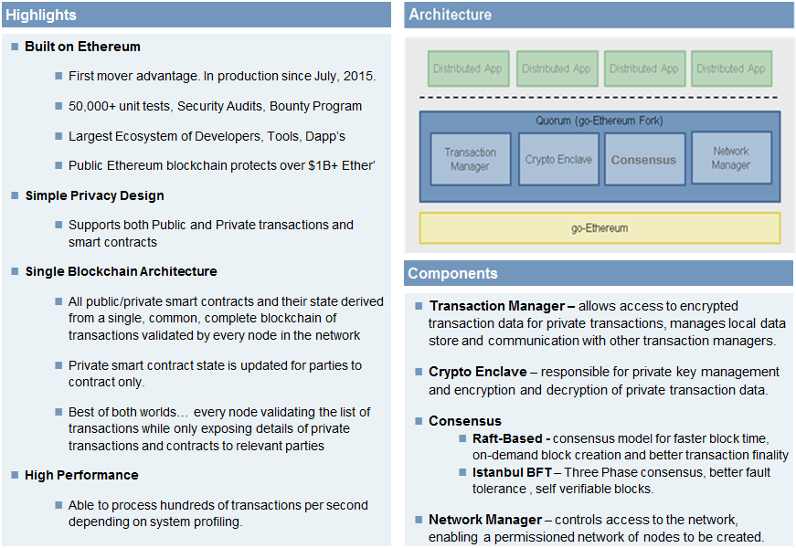
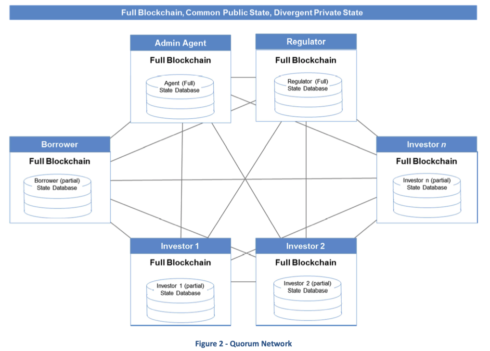
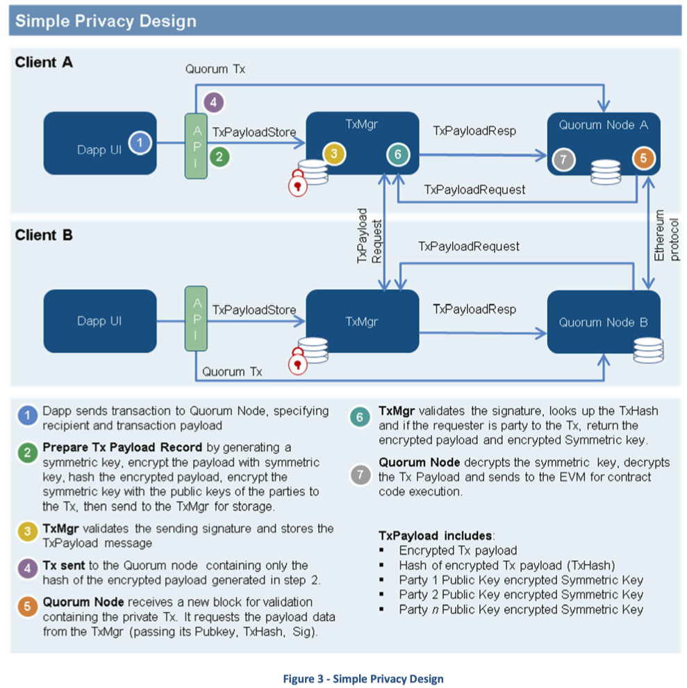
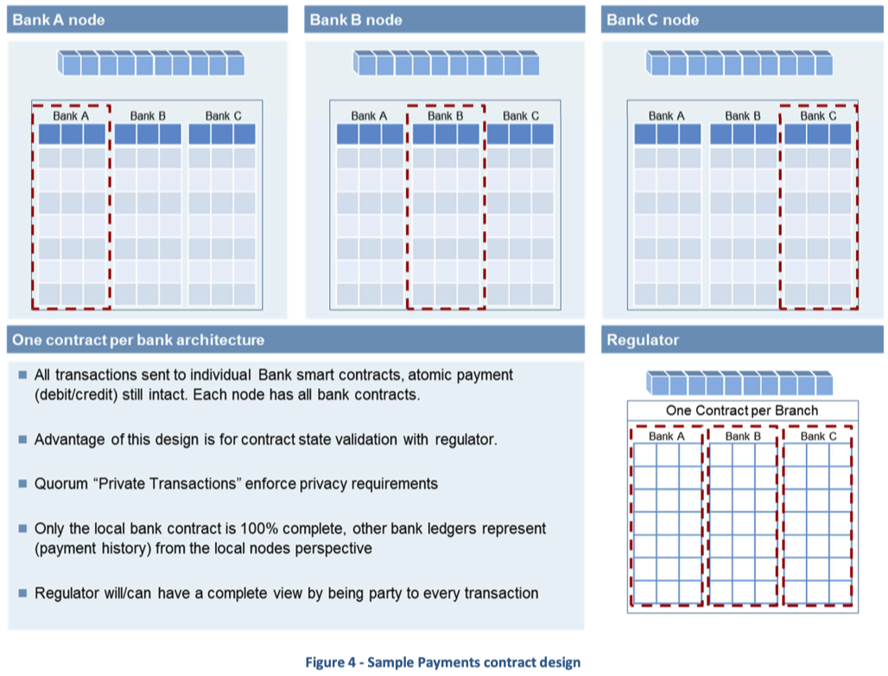

# Quorum 白皮书 (v0.2)
## 1 介绍
与基于重复业务逻辑和协调共识的现有企业系统相比，基于复制的共享分类账的智能合约有望提高效率和降低成本。现有的基于复制共享账本的智能合约系统无法提供数据隐私；交易和智能合约状态数据在复制的共享分类账上以明文形式公开。许多解决智能合约缺乏数据隐私的意见开始出现，涉及的方法包括同态加密、零知识证明、安全多方计算、账本分割、加密协议等。 本文概述了一种更简单的方法建立在以太坊平台上的隐私。虽然设计简单，但该解决方案保留了以太坊的许多关键属性，例如确保网络上的每个节点都参与并提高整个网络的整体安全性，同时只向交易方透露私人交易的细节。

本文重点介绍对标准以太坊的修改，以支持所需的“企业”要求。本文假设读者熟悉以太坊并阅读过[以太坊白皮书](https://github.com/ethereum/wiki/wiki/White-Paper)。
## 2 Quorum
Quorum 是基于[以太坊协议](https://github.com/ethereum/go-ethereum) 的官方 Go 实现的私有/许可区块链。 Quorum 使用“基于 raft”的共识算法（一种用于更快出块时间、交易确定性和按需区块创建的共识模型），并通过引入新的“私有”交易类型来实现数据隐私。 

Quorum 的设计目标之一是尽可能多地重用现有技术，最大限度地减少去以太坊所需的更改，以减少与公共以太坊代码库的未来版本保持同步所需的工作量。

负责附加隐私功能的大部分逻辑位于位于标准以太坊协议层之上的层中。下面的图 1 提供了 Quorum 区块链平台和架构组件的高级概述。

### 2.1 设计亮点
- 建立在以太坊之上
	- 先发优势，自 2015年7月正式投入生产
	- 5万多个单元测试、安全审计、赏金计划
	- 最大的生态系统，包含开发人员、工具、Dapp
	- 公共以太坊保护了天价的以太币
- 简单的隐私设计
	- 支持公共和私人交易以及智能合约
- 单区块链架构
	- 所有公共和私有的智能合约和状态均源于网络中的每个节点验证的单一、通用、完整交易的区块链
	- 私有智能合约状态仅为合约方更新
	- 每个节点验证交易列表，同时仅向合约方开放私人交易和合同的详细信息
- 高性能
	- 根据系统配置，每秒处理数百个交易     

### 2.2 组件
- 事务管理模块(TxMgr)

	允许加密用于私人交易的交易数据，管理本地数据存储以及与其他交易管理器通讯
- 加密模块

	负责死要管理和私密交易数据的加密和解密
- 共识模块
	- raft-默认
	- 拜占庭 BFT
- 网络管理模块

	网络管理控制对于网络的访问，从而能够创建经过许可的节点网络  

Quorum 背后的基本思想是使用加密技术来防止除交易方之外的所有人看到敏感数据。该解决方案涉及单个共享区块链以及智能合约软件架构和对以太坊的修改的组合。智能合约架构提供私有数据的分割。对 go-ethereum 代码库的修改包括对区块提议和验证过程的修改。区块验证过程被修改，以便所有节点通过执行与交易相关联的合约代码来验证公共交易和它们参与的任何私人交易。对于其他“私人交易”，节点将简单地跳过合约代码执行过程。

这将导致状态数据库的分割，即状态数据库分为私有状态数据库和公共状态数据库。网络中的所有节点都对其公共状态处于完美的状态共识。私有状态数据库会有所不同。即使客户端节点状态数据库不再存储整个全局状态数据库的状态，实际的分布式区块链及其中的所有交易都在所有节点之间完全复制，并通过密码保护以实现不变性。这是相对于基于多个区块链的其他分段策略的​​一个重要区别，并增加了设计的安全性和弹性（参见下图 2）。

- 节点角色
	- 管理节点
	- 监管者节点
	- 借贷者
	- 投资者
	- 投资者1
	- 投资者2
	 
## 3 共识
Quorum 目前实现了 2 种共识机制

- Raft（默认）
- 伊斯坦布尔 BFT

启用一个或另一个是通过在启动时传递给节点客户端的标志来完成的。

###  3.1 Raft
此实现对于不需要拜占庭容错的封闭成员/联盟设置很有用，即存在 leader/follower 模型并且不允许分叉以确保交易最终性。整个集群只有一个领导者，所有日志条目都将流经该 leader。 Raft 和以太坊节点之间存在一一对应关系（即 Raft 节点也是以太坊节点），并且 leader（“铸币者”）是唯一应该铸造新区块的节点。铸币商将交易捆绑到一个区块中，而无需 POW（工作量证明）。

- leader 经过一段时间的投票选出，在此期间所有节点都扮演“候选人”角色。 
- 一旦 leader 被选举出来，这个节点将切换成 leader 角色，而其他节点将切换成 follower 角色 
- 当 leader/铸币者创建一个块时，只有在该块被大多数 Raft 节点验证后，该块才会被设置为链的新头。 然后所有节点将一起扩展链。这与将区块写入数据库并立即被视为链的新头的以太坊不同。

有关基于 Raft 的共识的更多详细信息，请参阅 Raft 共识文档。

### 3.2 伊斯坦布尔 BFT（拜占庭容错）
伊斯坦布尔-BFT 共识是一个三阶段共识

- PRE-PREPARE
- PREPARE
- COMMIT

通过这种共识，系统可以容忍网络中多达三分之一的区块“验证器”节点出现故障，但仍能确保交易的最终性。

- 被选为区块“验证者”的节点选择一个“提议者”节点在共识回合中提议一个新区块。
- 然后提议者将提议一个新的区块提议并将其与 PRE-PREPARE 消息一起广播。
- 在收到来自提议者的 PRE-PREPARE 消息后，验证者进入 PRE-PREPARED 状态，
- 然后广播一条 PREPARE 消息。这一步是为了确保所有验证器都在相同的序列和相同的轮次上工作。
- 验证者收到三分之二网络节点的 PREPARE 消息后，进入 PREPARED 状态，然后广播 COMMIT 消息。这一步是通知它的对等方它接受了提议的块并将该块添加到链中。
- 最后，验证者等待三分之二的 COMMIT 消息进入 COMMITTED 状态，然后将块插入链中。

使用此共识协议提交的块是最终的，这意味着没有分叉。为了防止故障节点生成与主链完全不同的链，每个验证器将接收到的提交签名附加到块头中的“extradata”字段，从而使所有块都可以自我验证。

有关伊斯坦布尔 BFT 共识的更多详细信息，请参阅伊斯坦布尔 BFT 共识文档。

## 4 数据隐私
Quorum 中的数据隐私是通过加密和分段实现的。 Cryptograhy 应用于交易中的数据（每个人都可以在区块链上看到）。 分段应用于每个节点的本地状态数据库（其中包含合约存储并且只能由节点访问）。 只有参与私人交易的节点才能执行与交易相关的私人合约代码，这会导致更新本地状态数据库中的私人合约数据存储。 结果是每个节点的本地状态数据库只填充了它们参与的公共和私有数据。 下面的图 3 概述了 Quorum 隐私解决方案的高级逻辑设计。

- 步骤
	1. Dapp 将事务发送到 Quorum 节点，指定收件人和事务负载
	2. 加密步骤
		- 生成对称加密密钥和 tx 有效负载
		- 使用对称加密 key 加密 tx 有效负载
		- 对加密的有效负载进行hash
		- 使用 tx 各方的公钥加密对称加密key
		- 然后发送到 TxMgr 进行存储
	3. TxMgr 验证发送签名，并存储 TXPayload 消息
	4. 发送到 Quorum 节点的 Tx 仅包含步骤2中生成的加密有效负载的哈希值
	5. Quorum 节点接收到一个包含私有 tx 的验证块，其中包含它从 TxMgr 请求有效负载(传递其公钥、TxHash、签名) 
	6. TxMgr 验证签名，查找 TxHash，如果请求者是 Tx 的一方，则返回加密负载和加密对称密钥
	7. Quorum 节点解密对称密钥，解密 Tx 有效负载并发送到 EVM 执行契约代码
- TX 有效负载包括
	- 加密 Tx 有效负载
	- 加密的Tx 有效负载(TXhash)的hash
	- 第一方公钥加密对称密钥
	- 第二方公钥加密对称密钥 
	- 第n方公钥加密对称密钥
	
### 4.1 私人交易和私人合约
通过向发起交易的 Dapp 公开的 API 来促进私人交易。私人合约只是由私人交易创建的合约。

在区块构建和验证过程中，参与私有交易的节点将在将交易数据发送到 EVM 之前对其进行解密。因此，EVM 不需要支持加密/解密操作。私有合约的私有状态数据以明文形式存储在交易参与方节点的本地状态数据库中。
#### 4.1.1 私人交易 
私人交易是在数据字段中仅携带 256 位散列的交易。它还由交易对象的参数“v”标识为 37 或 38（与以太坊通常的 27 或 28 形成对比）。

除了典型的以太坊 sendTransaction 接受的基本数据之外，新的 API 还采用一个公钥列表，用于识别交易各方 (privateFor)。使用此数据生成标准的以太坊交易，其中有效负载只是加密私有数据的散列。这个新形成的以太坊交易只携带加密散列被发送到仲裁节点，在那里它作为待处理的交易分发到网络中的所有节点。

Quorum 事务包含：

- 收件人
- 识别发件人的签名
- 以太币的数量
- 可选的“privateFor”（将交易标识为私有并列出交易的相关方）
- 一个可选的数据字段（在私人交易的情况下为 256 位哈希）

图 3 说明了生成和发送私人交易的基本步骤。

#### 4.1.2 私人合约
私人合约是由私人交易创建的合约。私人合约的状态被表示为它们自己独立的 Patricia-Merkle 树。不能用公共交易创建私人合约，因为用公共交易创建的合约状态记录在单独的公共状态 Patricia-Merkle 树中。

### 4.2 区块验证和状态共识
标准以太坊区块验证包括确认所有合约的全局状态与区块头中包含的全局状态哈希匹配的步骤。这是网络中每个节点都具有完全相同的状态数据库（可证明的副本）的加密证明。

Quorum 状态数据库分为两个

- 一个私有状态
- 一个公共状态

它们在内存中表示为两个独立的 Patricia-Merkle 树。仲裁块验证仅匹配公共状态。

私有状态共识向上传递到应用层，并由新的 storageRoot RPC API 支持。当私人合约的各方需要加密状态共识证据时，应用程序可以检索指定区块的私人合约状态哈希，并与合约各方在链下或通过链上交易共享此值。

应该注意的是，特定的应用程序设计可能不要求或实际上期望同一合同的各方具有不同的状态（请参阅第 5.1 节付款示例）。还需要注意的是，如果达成公共国家共识，私人交易的各方应该不可能脱离共识。这是因为：

1. 验证一个区块包括全局交易哈希共识和公共状态共识以及其他一些检查。
2. EVM 是确定性的——相同的输入总是产生相同的输出。
3. 输入是相同的，因为我们正在确认对交易列表的共识。
4. 我们知道我们正在使用相同的交易区块链，因为我们正在达成公共状态共识。
5. 如果我们有相同的交易区块链，并且公共交易导致公共状态共识，并且由于 EVM 是确定性的，那么 EVM 应该不可能通过处理私人交易来产生私人合约的不同状态。

在公共以太坊中，实际上，唯一无效的时间块是由于基本配置问题，例如，如果您的创世块配置错误。一旦您正确连接到网络并与您的同行同步区块，您就永远不会因为全球共识破裂而导致区块失败。偶尔在公共网络中，恶意节点会尝试发送坏块。当然，恶意节点的威胁在公共以太坊网络中更为真实，因此验证全球共识至关重要，但在现实中，因为每个人都知道会检测到恶意节点并且其块被拒绝，没有人会打扰该攻击向量。

在许可 Quorum 中，同样的事情会发生，如果您遇到基本配置问题，您将很快看到块未验证和与网络同步。如果您能够仅通过查看公共状态来同步块（并且不要忘记每个块都有用于块投票的公共事务），那么就没有基本的配置问题，并且参与相同私有事务和合约的节点将确定性地到达对于这些合同，处于相同的私有状态。加入比较私有合约状态哈希的故障安全检测（在应用程序层）是一种简单易行的方法，也是检测恶意节点的好做法，如果这是您的设计要求的话。

### 4.3 通过分片保护隐私？
值得一提的是，Quorum 隐私设计展示了分片技术的几个特性，这些特性已被提议用于提高区块链网络的性能和吞吐量。 分片基本上是对交易的验证进行分段，这样并非网络中的每个节点都在验证每笔交易。 在 Quorum 中，节点仅处理它们参与的公共或私人交易。

## 5 性能
Quorum 测试表明，根据系统配置，每秒可处理数十到数百个事务。 不需要更改特定的代码； 使节点能够在每个块中打包更多交易的块 gaslimit 参数被简单地更新。 吞吐量的门控因素是 Quorum 节点能够验证事务处理必须是串行的块的速率。
## 6 应用
在考虑隐私要求时，首先想到的是金融应用程序。在多个金融机构组成的财团网络中，必须确保金融机构之间的交易细节不会透露给非交易方的其他金融机构。这既是为了解决客户隐私问题，也是为了满足法律和监管要求。一些在 Quorum 隐私解决方案的设计过程中，考虑了 6 个金融应用用例。从各种（简单、高吞吐量）支付应用程序到衍生品和证券用例。

了解 Quorum 隐私设计确实对应用程序设计施加了限制，这一点很重要。例如，不允许从私有合同更新公共合同状态。此外，私人合同可能不会创建公共合同。一般来说，私人交易不能改变公共状态，因为这样做会破坏区块验证/共识算法。

尽管如此，在为迄今为止考虑的金融用例寻找应用程序/智能合约设计时，这些限制并不是不可克服的。
### 6.1 支付
各种支付类型用例是许多其他金融应用程序的有用代理。最简单的支付用例形式甚至不需要使用智能合约。共识关键信息可以完全体现在交易本身的数据和交易的区块链中。

其他类型的支付应用程序可能会选择使用智能合约来跟踪信用额度的余额。在应用程序层灵活地管理私有状态共识是一个强大的工具，可以帮助找到解决许多用例的功能和隐私要求的设计。

例如，考虑一个跨银行支付用例，从银行 A 的账户向银行 B 的账户付款。银行 C 不是付款的一方，不应知道与此付款相关的任何信息.应用程序设计的目标是确保账户中有足够的余额来支付付款。

一个特定的设计要求为每个银行创建一个“银行”合约，如图 4 所示。在这种设计中，

- 网络中的每个 Quorum 节点将有 3 个合约，每个银行 A、B 和 C 一个。
- 此外，监管节点将成为网络的一部分，并将参与所有支付交易。
- 进一步的设计要求是账户和银行之间的支付转账是原子操作，即单个交易必须更新两个银行合约，全部或不更新。
- 在这种设计中，银行 A 的合约状态只会与监管者节点（以及其他银行 A 节点）达成共识。
	- 银行 A 节点上的银行 A 合约将查看其与网络中所有银行之间的所有借记和贷记。
- 从银行 B 的角度来看，合约银行 A 的状态只会反映银行 A 和银行 B 之间的借记和贷记，它不知道银行 A 和银行 C 之间的任何付款。
	- 在这种设计中，应用程序将寻求确认状态仅与监管节点达成自己的银行合同。按照设计，同一合约在不同银行节点上的状态不会处于状态共识。

- 每个银行架构一份合约
	- 发送到各个银行的智能合约的所有交易，原子支付（借记、贷记）好无损每个节点都会存储所有银行合约
	- 这种设计的优点在于与监管机构的合约状态验证
	- quorum 私人交易强制执行隐私要求
	- 只有本地银行合同是 100% 完整的，其他银行分类账本(支付历史记录)从本地节点表示 
	- 作为每笔交易的一方，监管机构将拥有完整的数据

## 7 结论
本文中概述的 Quorum 设计展示了如何扩展开创性的以太坊平台以满足企业，尤其是金融机构在分布式、去中心化区块链联盟网络中保护隐私的关键要求。 通过建立在以太坊上，Quorum 继承了生产强化的 go-ethereum 代码库的成熟度，并帮助将公共和企业开发社区联合到一个通用协议上。

## 项目当前状态(截止2021-10-28)
### 数据统计
- watch 327
- star 4k
- fork 1.1k
- 14216 commit 
- releases 30 +
- contributors 441 +
- golang 

## 翻译
- [Quorum Whitepaper v0.2.pdf](https://github.com/ConsenSys/quorum/blob/master/docs/Quorum%20Whitepaper%20v0.2.pdf)
- [代码仓库](https://github.com/ConsenSys/quorum)
	- 仓库 readme
	- 简介
	
		GoQuorum 是一种基于以太坊的分布式账本协议，具有交易/合约隐私和新的共识机制。
	
		GoQuorum 是 go-ethereum 的一个分支，并根据 go-ethereum 版本进行更新。
	
		对 go-ethereum 的主要改进：
	
		- [隐私](https://docs.goquorum.consensys.net/en/stable/Concepts/Privacy/Privacy/)
	
			GoQuorum 通过公共/私有状态分离，支持私有交易和私有合约，并利用点对点加密消息交换（参见Constellation 和 Tessera）将私有数据直接传输给网络参与者。
		- [替代共识机制](https://docs.goquorum.consensys.net/en/stable/Concepts/Consensus/Overview/)
	
			在许可网络中不需要 POW/POS，GoQuorum 提供了多种更适合联盟链的共识机制
			
			- [Raft](https://docs.goquorum.consensys.net/en/stable/Concepts/Consensus/Raft/)
	
				一种用于更快出块时间、交易确定性和按需块创建的共识模型
			- [伊斯坦布尔 BFT](https://docs.goquorum.consensys.net/en/stable/Concepts/Consensus/IBFT/)
	
				由 AMIS 提供的具有交易终结性的 PBFT 启发的共识算法。
			- [Clique POA 共识](https://github.com/ethereum/EIPs/issues/225)
	
				与 Go Ethereum 捆绑的默认 POA 共识算法。
		- [peer 许可](https://docs.goquorum.consensys.net/en/stable/Concepts/Permissioning/PermissionsOverview/)
	
			节点/对等许可，确保只有已知方才能加入网络
		- [账户管理](https://docs.goquorum.consensys.net/en/stable/Concepts/AccountManagement/)
	
			GoQuorum 引入了账户插件，允许 GoQuorum 或谱号扩展为管理账户的替代方法，包括外部保管库。
		- [可插拔架构](https://docs.goquorum.consensys.net/en/stable/Concepts/Plugins/Plugins/)
	
			允许将附加功能作为插件添加到核心 geth，提供可扩展性、灵活性和 GoQuorum 功能的明显隔离。
		- 更高的性能
	
			GoQuorum 提供比公共 geth 更高的性能吞吐量
	- 建筑学

		
	 
	 上图是 GoQuorum 使用的组件架构的高级概述。有关组件及其交互方式的更深入讨论，请参阅[私有事务的生命周期](https://docs.goquorum.consensys.net/en/stable/Concepts/Privacy/PrivateTransactionLifecycle/)。
	
	- 快速开始

		有[多种方法](https://docs.goquorum.consensys.net/en/stable/HowTo/GetStarted/GettingStartedOverview/)可以快速启动和运行 GoQuorum。最简单的方法之一是使用 [GoQuorum 向导](https://docs.goquorum.consensys.net/en/stable/HowTo/GetStarted/GettingStartedOverview/#goquorum-wizard),一种命令行工具，允许用户在不到 2 分钟的时间内在其本地机器上设置开发 GoQuorum 网络。

	- GoQuorum 项目

		查看我们正在积极开展的一些有趣项目：

		- [quorum-wizard](https://docs.goquorum.consensys.net/en/stable/HowTo/GetStarted/Wizard/GettingStarted/)

			在 2 分钟内设置一个 GoQuorum 网络！
		- [quorum-remix-plugin](https://docs.goquorum.consensys.net/en/stable/Reference/RemixPlugin/Overview/)

			以太坊 Remix IDE 的 GoQuorum 插件增加了对在 GoQuorum 网络上创建私有合约并与之交互的支持。
		- [Cakeshop](https://docs.goquorum.consensys.net/en/stable/HowTo/GetStarted/Cakeshop/)

			GoQuorum的集成开发环境和 SDK
		- [quorum-profiling](https://docs.goquorum.consensys.net/en/stable/Concepts/Profiling/)

			用于压力测试和基准测试 GoQuorum 网络的工具集。
		- [quorum-examples](https://docs.goquorum.consensys.net/en/stable/Reference/GoQuorum-Projects/)

			GoQuorum 演示示例
		- [qubernetes](https://docs.goquorum.consensys.net/en/stable/HowTo/GetStarted/GettingStartedOverview/#goquorum-on-kubernetes-qubernetes)

			在 Kubernetes 上部署 GoQuorum
		- [quorum-cloud](https://docs.goquorum.consensys.net/en/stable/HowTo/GetStarted/GettingStartedOverview/#creating-a-network-deployed-in-the-cloud)

			帮助在选择的云提供商中部署 GoQuorum 网络的工具
		- [quorum.js](https://docs.goquorum.consensys.net/en/stable/Reference/quorum.js/Overview/)

			扩展 web3.js 以支持 GoQuorum 特定的 API
		- GoQuorum 零知识
			- GoQuorum 上的 [ZSLPOC](https://docs.goquorum.consensys.net/en/stable/Reference/GoQuorum-Projects/#zsl-proof-of-concept) 和 [ZSL](https://github.com/ConsenSys/zsl-q/blob/master/README.md)
			- [匿名 Zether](https://github.com/ConsenSys/anonymous-zether)实现
	- 官方 Docker 容器

		官方 docker 容器可以在 [https://hub.docker.com/u/quorumengineering/](https://hub.docker.com/u/quorumengineering/)下找到
	- 第三方工具/库

		以下与 GoQuorum 相关的库/应用程序由第三方创建，因此并未得到 JP Morgan 的特别认可。非常感谢开发人员改进 GoQuorum 工具！

		- [Quorum Blockchain Explorer](https://github.com/web3labs/epirus-free) - GoQuorum 的区块链浏览器，支持查看私人交易
		- [Quorum-Genesis](https://github.com/davebryson/quorum-genesis) - GoQuorum 的简单 CL 实用程序，可帮助使用选民和制造者填充创世文件
		- [Quorum Maker](https://github.com/synechron-finlabs/quorum-maker/)

			创建GoQuorum 节点的实用程序
		- [QuorumNetworkManager](https://github.com/ConsenSys/QuorumNetworkManager) 

			使创建和管理 GoQuorum 网络变得容易
		- [ERC20 REST 服务](https://github.com/web3labs/erc20-rest-service)

			GoQuorum 支持的 RESTful 服务，用于创建和管理 ERC-20 令牌
		- [Nethereum Quorum](https://github.com/Nethereum/Nethereum/tree/master/src/Nethereum.Quorum)

			NET GoQuorum 适配器
		- [web3j-quorum](https://github.com/web3j/web3j-quorum) 

			web3j Java 库的扩展，提供对 GoQuorum API 的支持
		- [Apache Camel](http://github.com/apache/camel) 

			一个 Apache Camel 组件，使用 web3j 库为 GoQuorum API 提供支持。这是描述如何将 Apache Camel 与 Ethereum 和 GoQuorum 结合使用的[文章](https://medium.com/@bibryam/enterprise-integration-for-ethereum-fa67a1577d43)
		
	- 报告安全错误

		安全是我们对用户承诺的一部分。在 GoQuorum，我们与安全社区有着密切的关系，我们了解这个领域，并鼓励安全研究人员成为我们构建安全可靠软件使命的一部分。本节解释了如何提交安全漏洞，以及期望得到什么回报。

		GoQuorum及其生态系统（Tessera、Constellation、Cakeshop等）中的所有安全漏洞都应通过电子邮件报告至security-quorum@consensys.net。请在您的主题中使用前缀[security]。此电子邮件已发送给 GoQuorum 安全团队。您的电子邮件将被确认，并且您将尽快收到对您的电子邮件的更详细的回复，其中指示处理您的报告的后续步骤。在对您的报告做出初步答复后，安全团队将努力让您了解修复和完整公告的进展情况。

		如果您没有收到对电子邮件的回复或者您没有收到安全团队的消息，请通过 GoQuorum 松弛安全通道联系任何团队成员。请注意，GoQuorum 松弛频道是公共讨论论坛。升级到此媒体时，请不要透露问题的详细信息。只需声明您正在尝试联系安全团队的成员。

	- 负责任的披露流程

		GoQuorum 项目使用以下负责任的披露流程：

		- 一旦收到安全报告，它就会被分配一个主要的处理程序。此人协调修复和发布过程。
		- 确认问题并确定受影响软件的列表。
		- 代码被审计以发现任何潜在的类似问题。
		- 如果与提交者协商确定需要 CVE-ID，则主处理程序将触发该过程。
		- 修复应用于公共存储库并发布新版本。
		- 在应用修复程序之日，将向 Quorum-announce 发送公告。

		此时，您将能够公开披露您的发现。

		注意：此过程可能需要一些时间。将尽一切努力尽可能及时地处理安全漏洞，但重要的是我们遵循上述流程以确保一致地处理披露。
	- 接收安全更新

		接收安全公告的最佳方式是订阅 Quorum-announce 邮件列表/频道。任何与安全问题有关的消息都将以[security]为前缀。对本政策的评论 如果您对本政策的改进有任何建议，请发送电子邮件至info@goquorum.com进行讨论。

	- 执照

		go-ethereum 库（即cmd目录外的所有代码）根据GNU 宽松通用[公共许可证 v3.0](https://www.gnu.org/licenses/lgpl-3.0.en.html)获得 许可，也包含在我们的存储库 COPYING.LESSER 文件中。
		
		go-ethereum 二进制文件（即cmd目录中的所有代码）在GNU 通用公共许可证 v3.0下获得 许可，也包含在我们的存储库COPYING文件中。

		任何计划使用 crypto/secp256k1 子模块的项目都必须使用根据 3-clause BSD [许可的特定 secp256k1 独立库](https://github.com/ConsenSys/goquorum-crypto-secp256k1)。

	
