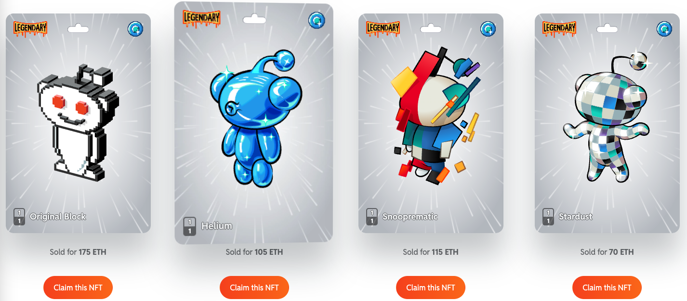
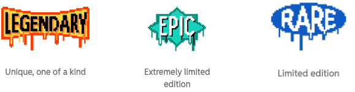

# CryptoSnoos NFTs(old version)
本版本已经是老方案了，被 reddit 新方案代替，老方案目标是发行 NFT 赚手续费，新方案是更加融入用户，采用空投方案，给用户带来更多的参与感。
## 不可替代，极具收藏价值，并随时准备起飞
利用这个难得的机会来拥有一段 Reddit 历史——获取一个构建在以太坊区块链上的 CryptoSnoo Nft，并开始您的收藏。
## 最近销售
看看这些天 CryptoSnoos 正在做什么，浏览下面或查看 [Reddit Avatar Builder](https://www.reddit.com/avatar/nft) 的 Nft 部分。

## CryptoSnoo 稀缺
看看这些贴纸，告诉你有多少 CryptoSnoos 在世界上漫游

## CryptoSnoos 是如何工作的
不可替代的世界可能会让人困惑，所以我们把 CryptoSnoos 做得尽可能简单。

1. 在 Reddit 的头像构建器中找到可用的 CryptoSnoos

	访问 Nft 部分的 [Reddit 的头像建设者](https://reddit.com/avatar/nft)，并点击准备拍卖连接您的 MetaMask 钱包到您的Reddit 帐户。
2. 在 OpenSea 拍卖中出价并获胜!

	CryptoSnoo 拍卖在 OpenSea 上进行，OpenSea 是全球最大的非营利性拍卖平台之一。拍卖开始后，出价。
3. 声称你的 CryptoSnoo，成为一个自豪的 Nft 所有者

	在你赢得拍卖后，声称你的 CryptoSnoo 成为正式的所有者，并在你的 Reddit 主页上展示它。
4. 使用你的 CryptoSnoo 作为你在 Reddit 上的化身

	您可以将您的 CryptoSnoo Nft卡设置为您的头像在您的个人资料上，让世界看到。
5. 关于你的消息会容光焕发的

	您的评论将特色您的 CryptoSnoo 头像与发光动画。
6. CryptoSnoo 的统计数据位于每张卡片的后面

	点击 Nft 符号在您的 CrytoSnoo 卡的右上角显示所有关键的细节。
	
## 学习更多
- 什么是 NFT

	不可替代代币(nft)是区块链上的数据单位，用于证明数字商品的唯一性。不可替代是指它们不能相互互换，不能相互替换或交换。你可以把 nft 想象成数字交易卡。在[这里](https://www.theverge.com/22310188/nft-explainer-what-is-blockchain-crypto-art-faq)了解更多关于 NFTs 的信息。
- 什么是 MetaMask

	MetaMask 是一个网络浏览器扩展，也可以作为加密货币钱包。当浏览器扩展被启用，网页可以识别你的钱包地址，并立即拉起你的帐户，如果你曾经与他们购物。你可以在[这里](https://www.youtube.com/watch?v=YVgfHZMFFFQ)了解更多关于 MetaMask 的信息。	
- 如果获取到1个 CryptoSnoo NFT

	要从 Reddit 获得 CryptoSnoo Nft，您必须在我们的 [OpenSea市场](https://opensea.io/collection/reddit-cryptosnoos)上赢得拍卖。
- 如何在我的 reddit 使用 	CryptoSnoo Nft

	一旦您购买了 CryptoSnoo Nft，您将获得访问一个 url，将带您到一个专门为您的 Nft的 网页。从这个页面你会被重定向到Reddit 上的 Avatar Builder，在那里你会被提示整合你的 MetaMask 钱包到你的 Reddit 账户(如果你还没有这样做)。一旦您的钱包与 NFT 和帐户同步，您可以设置与您的 NFT 相关联的 CryptoSnoo 图像作为您的化身。
- 我如何出手或者转移一个 CryptoSnoo Nft

	如果您购买一个 CryptoSnoo Nft，它属于您，它是您的决定如何处理它。你可以把它应用到你的 Reddit 账户上，你可以永远持有它，或者你可以卖掉它。
- 如何在手机端使用

	今天，CryptoSnoo Nft体验仅为 Reddit 桌面构建。你仍然可以在移动端显示你的 CryptoSnoo Nft 图像作为你的头像，但整体体验是为 Reddit 桌面首先构建的。	
- 如何知道发行量更少的 NFT

	今天我们专注于向社区发布1/1的传奇(Legendary) CryptoSnoos，我们也在探索未来发布限量版 CryptoSnoos。

## 参考
[CryptoSnoos NFTs](https://nft.reddit.com/)