# Reddit NFT + 积分
## 会员
- 充值1年会员
- 送 1.7k 金币
- 使用 Reddit Premium 每月获得 700 个金币并无广告浏览
- 获取空投

## 领取空投/转移
- 进入收藏纸娃娃论坛查看活动

		https://www.reddit.com/r/CollectibleAvatars

	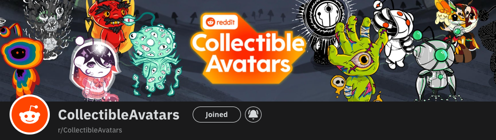
- 进入 `style avatar`

	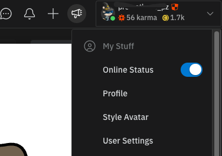
- 铸币
	- shop(商店)
		- 根据活动销售
	- explore(探索页面)
		- 可以看到活动空投活动，我这里使用世界杯空投说起

			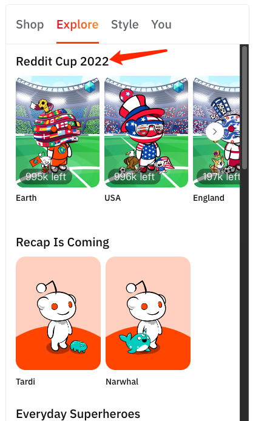
		- 点击想要的队伍，比如这届我想要梅西的阿根廷队伍

			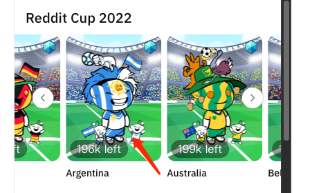
		- 弹出页面

			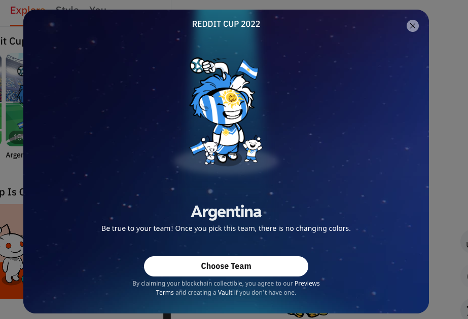	
		- 弹出创建 Vault 页面
			
			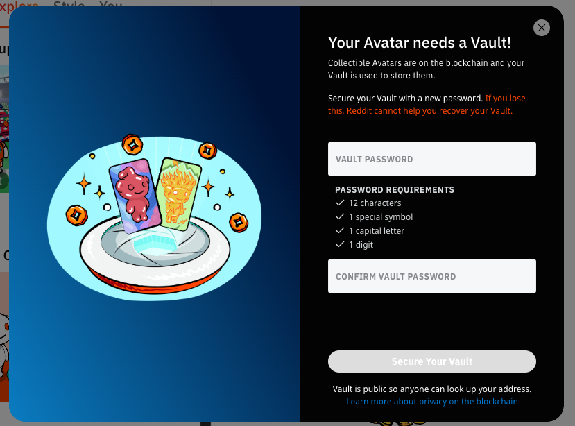	
		- 输入密码和确认密码确认后，就可以查看 NFT 信息了	
			
			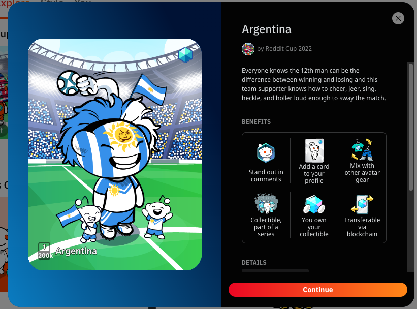
			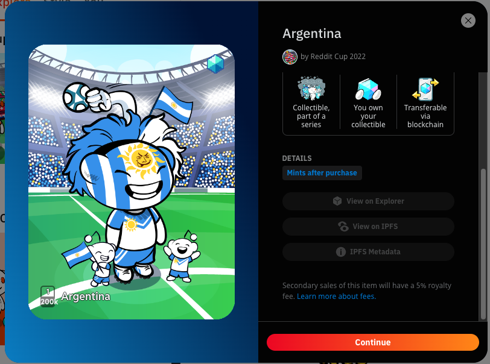
		- 点击确认等待一下，就可以看到铸造成功，注意下面可以转移按钮

			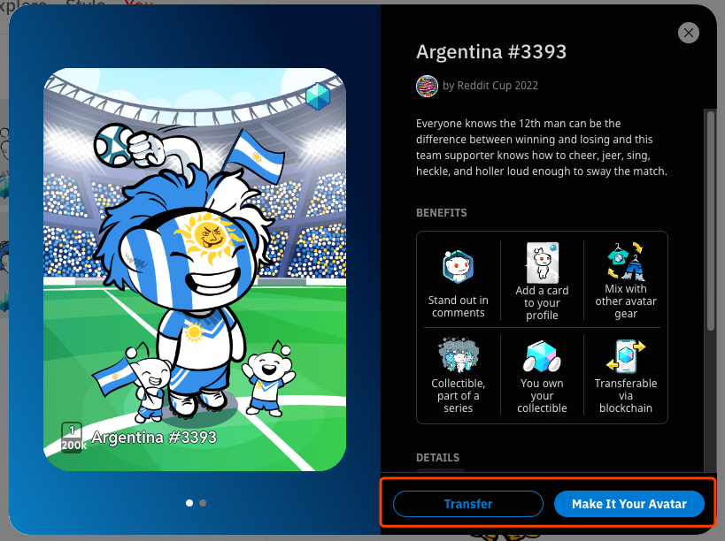	
			
			- 卡片左边图信息
				- 第一页
				
					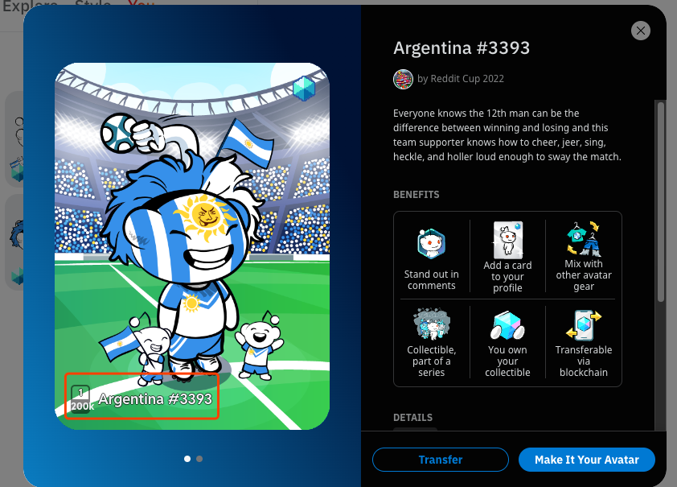	
				- 反转详情
					
					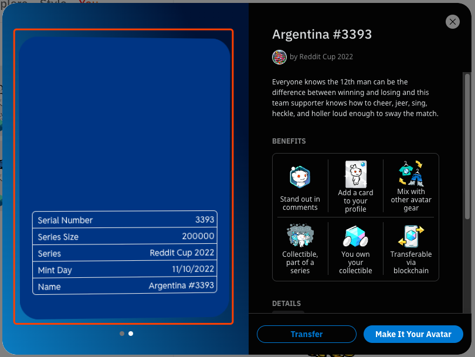	 	
			- 卡片右边详情信息
				- 描述详情

					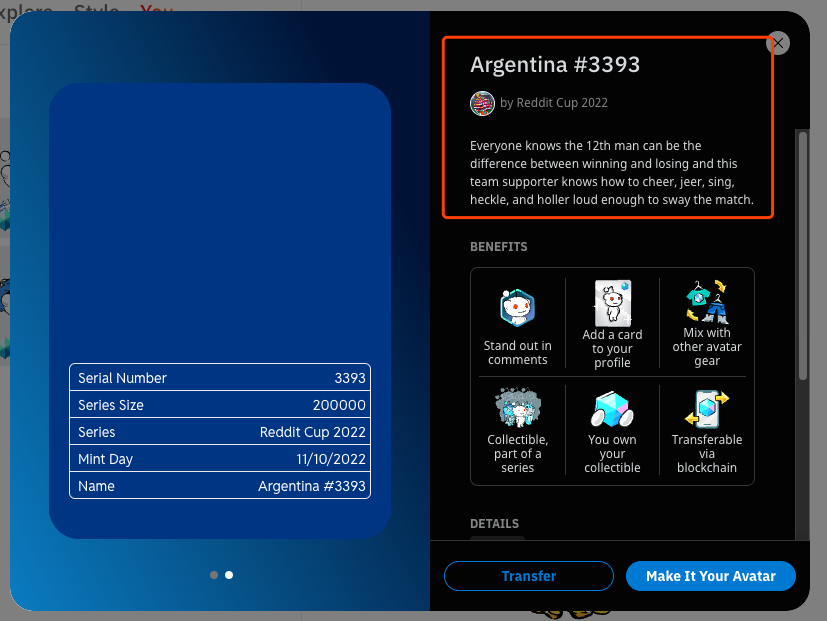	
				- 卡片属性

					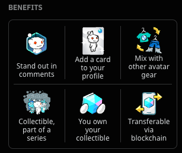
				- 链信息

					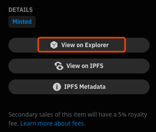
					
					- 交易游览器跳转
						- 查看 own 信息
							- [https://polygonscan.com/token/0x622d8fea4603ba9edaf1084b407052d8b0a9bed7?a=3392#inventory](https://polygonscan.com/token/0x622d8fea4603ba9edaf1084b407052d8b0a9bed7?a=3392#inventory)  

								属于 `0xebf42aa96d1a49de844ceaaf52c9e04d06915b48`
								
								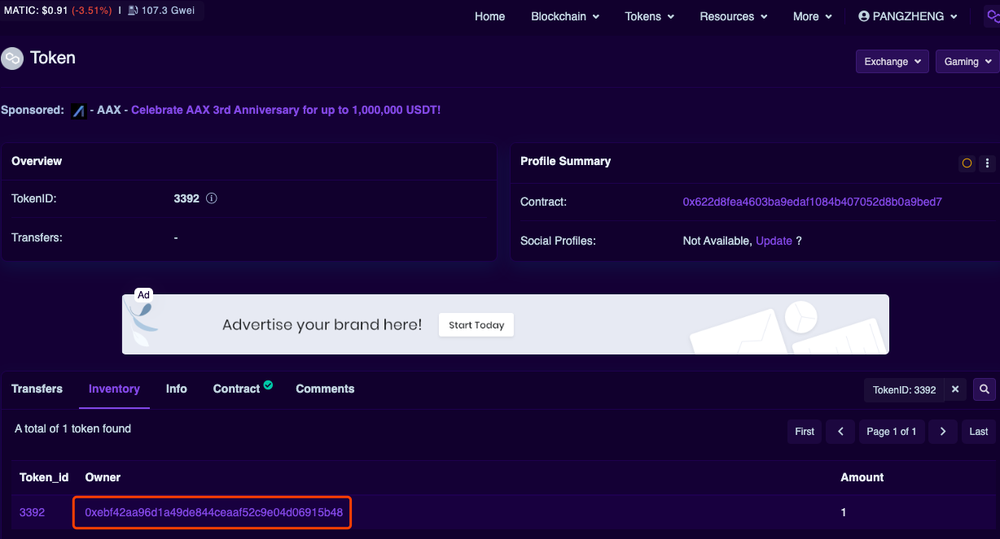
							- [https://polygonscan.com/address/0xebf42aa96d1a49de844ceaaf52c9e04d06915b48#tokentxnsErc1155](https://polygonscan.com/address/0xebf42aa96d1a49de844ceaaf52c9e04d06915b48#tokentxnsErc1155)

								可以看到这是1个独立钱包地址
								
								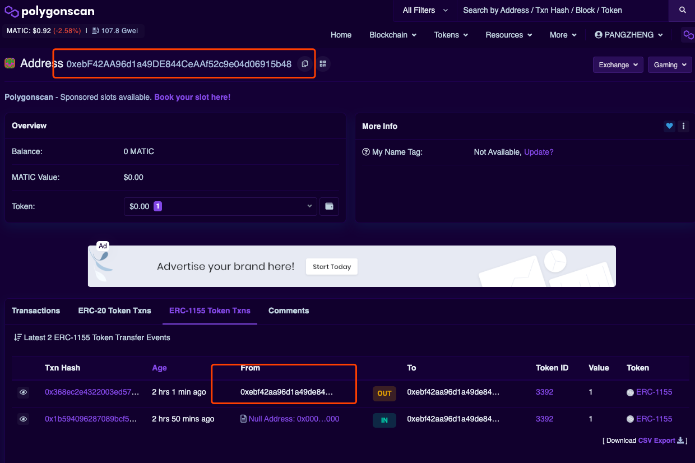
						- token 信息 
							-  [https://polygonscan.com/token/0x622d8fea4603ba9edaf1084b407052d8b0a9bed7?a=3392](https://polygonscan.com/token/0x622d8fea4603ba9edaf1084b407052d8b0a9bed7?a=3392) 
						
								 这里可以看到交易是 Batch Mint 批量铸币
							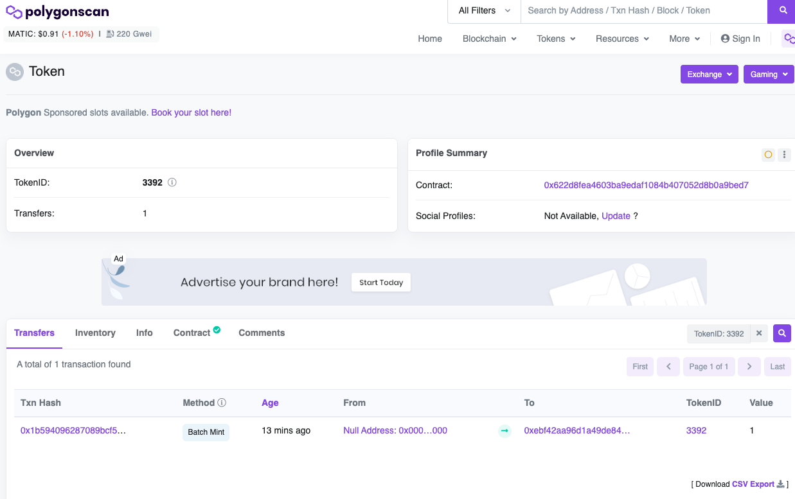 
						- 查看 txid 信息
							- [https://polygonscan.com/tx/0x1b594096287089bcf50a9221324787e0b2de6e4e476af4fabfab1ddf7171fd12](https://polygonscan.com/tx/0x1b594096287089bcf50a9221324787e0b2de6e4e476af4fabfab1ddf7171fd12) 

							可以看到这里是批量铸币加转移，利用 1155 批量交易能力
							
							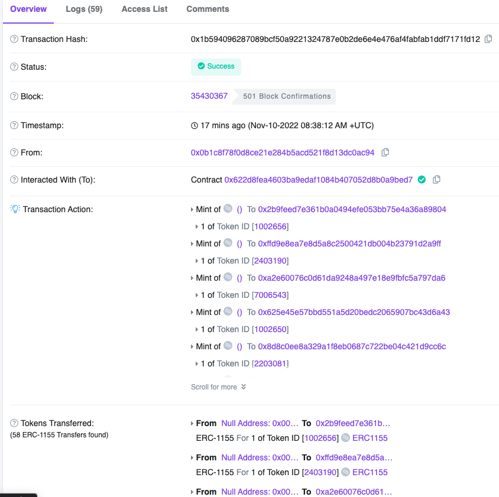 
							
							- 分析下详情
								- 一共铸币和交易 58 个
								- 使用 1559 合约类型
								- 使用 gas 数量 
									
										1,755,316
								- 每 gas 价格 

										0.000000139219653853 MATIC (139.219653853 Gwei)
								- 本次 gas 费用为 

										0.244374485922632548 MATIC ($0.23)
							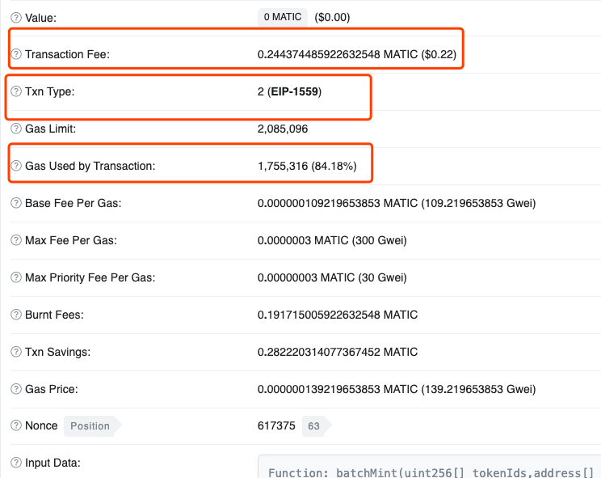 
					- IPFS 上查看图像
						- reddit 在 ipfs.io 上建立的自己的 网关地址
							
							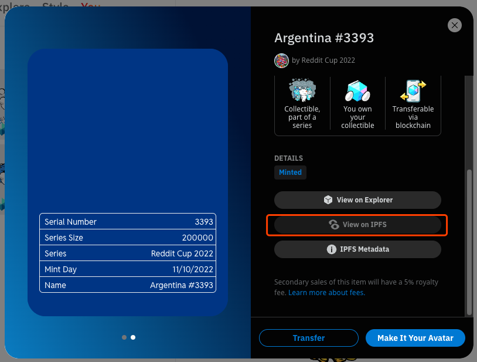 
							
							[https://reddit.infura-ipfs.io/ipfs/QmRWd3pJjW9XWxsJUAodE7XKB9ZtCVDebkj9tGXdcTfn7r
](https://reddit.infura-ipfs.io/ipfs/QmRWd3pJjW9XWxsJUAodE7XKB9ZtCVDebkj9tGXdcTfn7r
)
							
					- IPFS Metadata
						- NFT 的 Meta 数据
						
							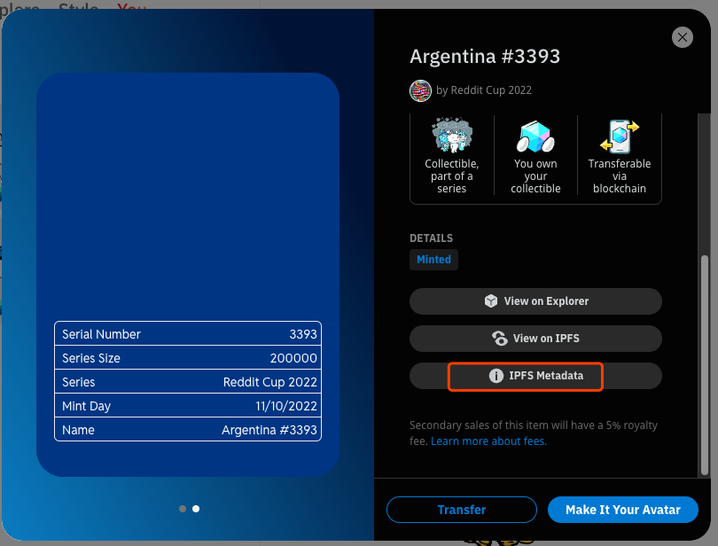 
							
							- [https://reddit.infura-ipfs.io/ipfs/QmQTB2RPQgBywTyaZEEQngRkghepkM5hh8RwLbTbF88KRj/3392.json](https://reddit.infura-ipfs.io/ipfs/QmQTB2RPQgBywTyaZEEQngRkghepkM5hh8RwLbTbF88KRj/3392.json)
		
									{
										name: "Argentina #3393",
										description: "Everyone knows the 12th man can be the difference between winning and losing and this team supporter knows how to cheer, jeer, sing, heckle, and holler loud enough to sway the match.
										
										This Collectible Avatar was created by an artist in partnership with Reddit, as a part of the Collectible Avatars Creator Program.
										
										If you purchased this Collectible Avatar and want to connect it to your Reddit account, [visit Reddit to make it your avatar.](https://reddit.com/avatar/nft/polygon/622d8fea4603ba9edaf1084b407052d8b0a9bed7/3392?action=import)
										
										[Learn More About Collectible Avatars on Reddit.](https://reddithelp.com/hc/en-us/articles/6213835889044)
										
										[View the Previews Terms.](https://www.redditinc.com/policies/previews-terms)",
										external_link: "https://reddit.com/avatar/nft/polygon/622d8fea4603ba9edaf1084b407052d8b0a9bed7/3392?action=import",
										image: "ipfs://QmRWd3pJjW9XWxsJUAodE7XKB9ZtCVDebkj9tGXdcTfn7r",
										attributes: [ ]
									}
- 再次空投

	因为限制，该项目再次空投失败
	
	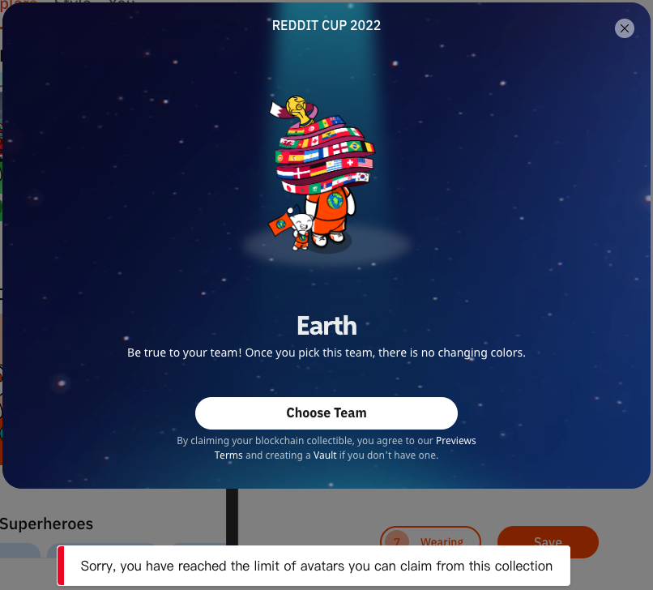  						
- 操作赠予
	- 点击 avatar -> you -> your Stuff
		
		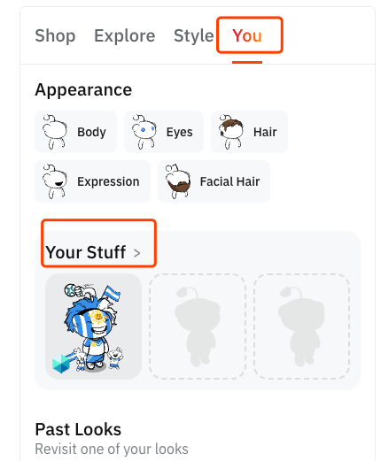 
	- 点击图像
	
		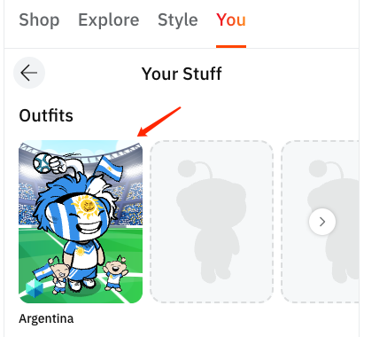
	- 拼接元素-> 点击游览详情

		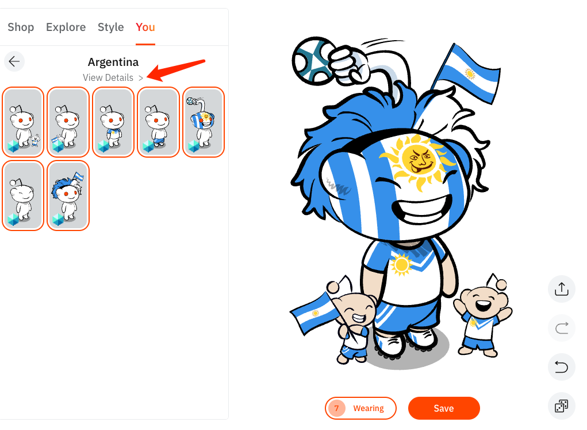 	  	   
	- NFT 交易界面，点击交易

		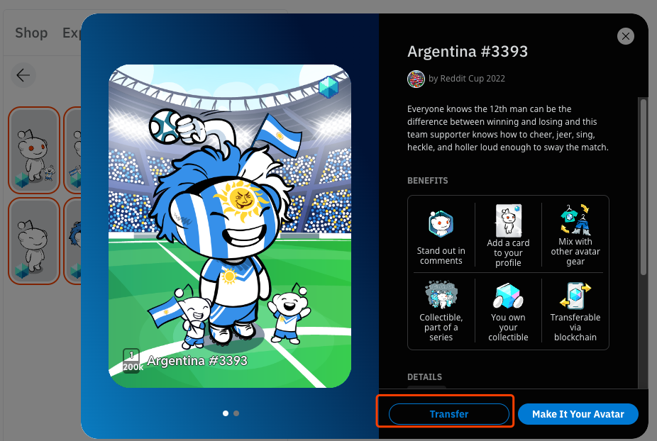
	- 输入想转移到的 Vaule 钱包用户名或以太坊钱包地址
		
		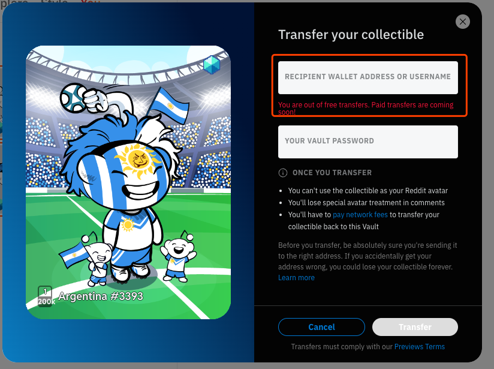 
	- 输入密码

		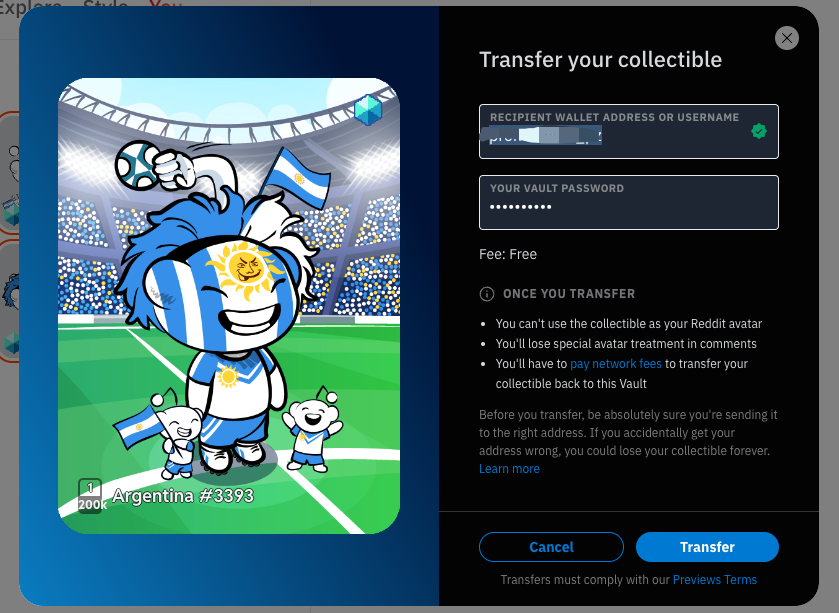 		
	- 注意这里信息
		- 提示信息
			- 手续费免费
			- 一旦你转移
				- 您不能将收藏品用作您的 Reddit 头像
				- 您将在评论中失去特殊的头像处理
				- 您必须[支付网络费用](https://reddithelp.com/hc/articles/9479929142420)才能将您的收藏品转移回此保险库
			- 警告信息
				- 在转移之前，请务必确保将其发送到正确的地址。 如果您不小心弄错了地址，您可能会永远失去您的收藏品。
	- 点击转移即可
	- 转移区块链信息
		- token 信息
			- 可以看到已经交易了2次，本次是从本人钱包地址转移到本人钱包地址(浪费了一次) ，调用方法是 execute

					奇怪为什么没有签名机制
				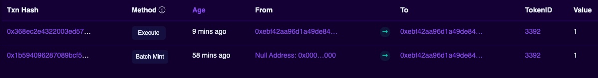   
			- 查看详情

				- [https://polygonscan.com/tx/0x368ec2e4322003ed57752132ef8fbecb5c34979c908aab316571c5980d9e4277](https://polygonscan.com/tx/0x368ec2e4322003ed57752132ef8fbecb5c34979c908aab316571c5980d9e4277)
			
				本次 txid 是单次交易，并不是批处理，交易也不支持批处理
				
				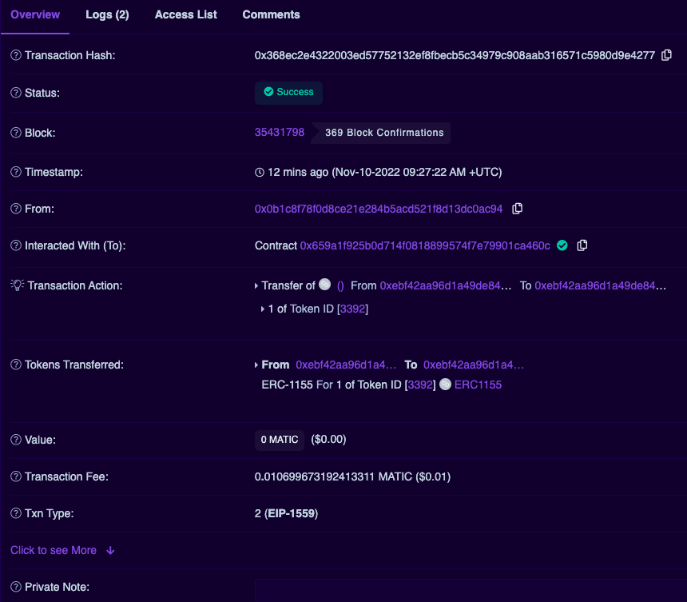  
			- 分析下详情
				- 1 个交易
				- 使用 1559 合约类型
				- 使用 gas 数量 
					
						99,633 (84.54%)
				- 每 gas 价格 
						
						0.000000107390856367 MATIC (107.390856367 Gwei)
						-
						0.000000139219653853 MATIC (139.219653853 Gwei) <- 这个是 gas 波动价格，看起来不高
				- 本次 gas 费用为 
				
						0.010699673192413311 MATIC ($0.01)

				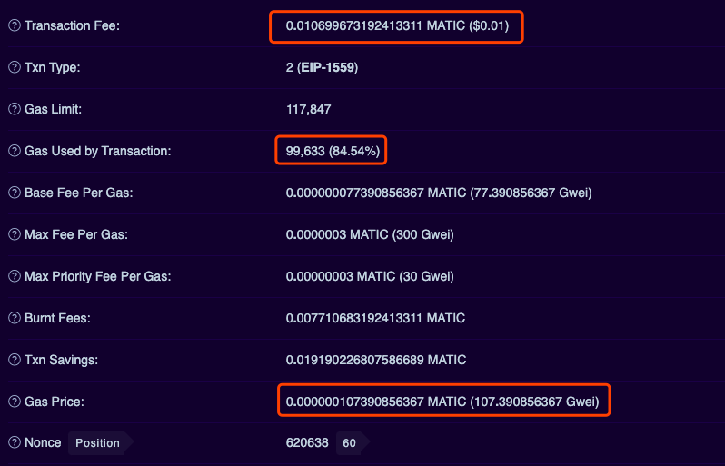 
				
			- 免 gas 交易

				注意，这里的交易是通过其他地址请求的，请求的方法也不是传统的 `transfer`，而是 `execute ` 方法，这里需要研究下 1559 协议
				
				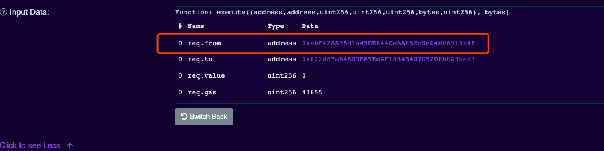
			- 合约代码

				[https://polygonscan.com/address/0x659a1f925b0d714f0818899574f7e79901ca460c#code](https://polygonscan.com/address/0x659a1f925b0d714f0818899574f7e79901ca460c#code) 	
- 点击再次赠予，尝试复用
	
	提示赠送的 gas  费用已经耗尽，需要充值
	
	
- 点击 gas 充值，跳转到说明

	 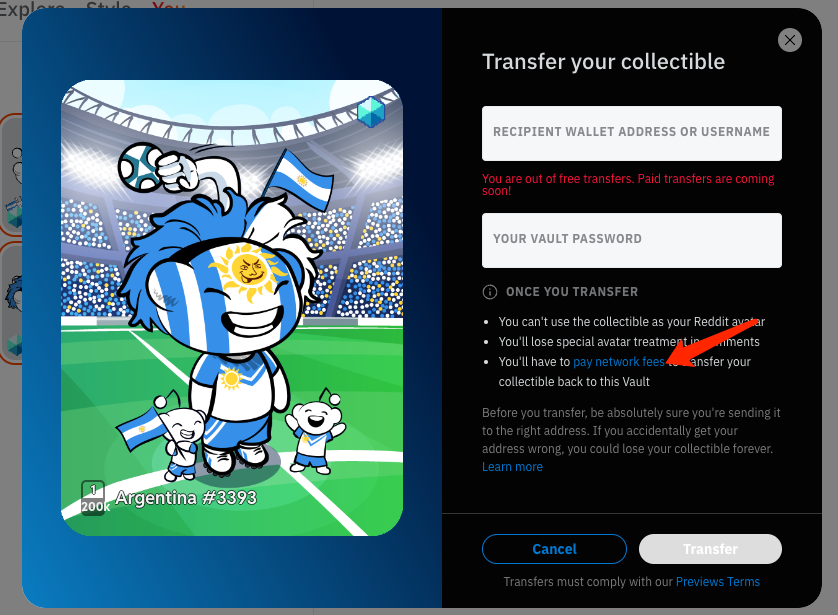
	 	
## 什么是收藏头像创作者计划？
这是一个早期计划，旨在让创作者与 Reddit 合作设计和创建收藏头像，并从 Reddit 商店的销售中获利。

今天，数以百万计的用户在 Reddit 上通过[创建和设置头像](https://www.reddit.com/avatar)来定制他们的外观。

Reddit 创作者计划邀请 Reddit 上的艺术家为标志性角色 Snoo 带来他们自己的愿景，并向希望以创造性方式展示自己身份的 Reddit 用户出售定制作品——在 Reddit 上（并最终在 Reddit 上）。
### 这个怎么运作
- 填写 Reddit 上的创作者表格以申请 Reddit 收藏头像[创作者计划](https://docs.google.com/forms/d/e/1FAIpQLSf-IYc73YB-3aTKCulhqg5QPwrwPigY_dmhRQ0lduB3qXvgfA/viewform)。
- 创作者将被选中加入一个计划，在 Reddit 团队提供的指导下设计收藏头像。
- 创作者将设计化身装备、配饰和服装，并有机会通过在 Reddit 上出售它们来赚钱。
### 什么是创作者的资格？
创作者必须年满 18 岁才能加入该计划，并获得 [Stripe 支持](https://stripe.com/docs/connect/cross-border-payouts#supported-countries)的国家/地区（访问 Stripe 以查看您所在的国家/地区是否受支持）。目前，我们要求创作者也拥有 Adob​​e Illustrator 经验。如果您对该计划感兴趣但不符合当前资格，我们鼓励您无论如何填写表格。随着计划的发展，将会有更多的创作者和 redditors 的机会，您将来可能有资格获得这些机会。
### 如何注册成为创作者？
填写 Reddit 上的[创作者表格](https://docs.google.com/forms/d/e/1FAIpQLSf-IYc73YB-3aTKCulhqg5QPwrwPigY_dmhRQ0lduB3qXvgfA/viewform)以加入候补名单。
### 作为创作者，我如何获得报酬？
作为您与 Reddit 合作的一部分，您将保留来自其系列的 Collectible Avatar 销售的所有收入，减去两成费用。

- 首先

	支付处理商对每个收藏头像销售收取交易费用，这些费用可能会有很大差异，具体取决于收藏头像是从 Reddit 移动应用程序还是网站购买的（即，30% 来自 Apple 和 Google，而约 2.9% 来自 Stripe ）。
- 其次

	Reddit 对初级销售收取 5% 的总费用，用于支付铸币费和相关的区块链费用，以及支持创作者计划。

如果您的系列中的收藏头像被所有者转售，您还有权获得 5% 版税的 50%； Reddit 有权获得剩余的 50%。

### 谁拥有艺术品？
您和 Reddit 都将拥有艺术品的不同元素。您拥有为此项目创建的内容，但您不拥有 Reddit 的 IP。简而言之，如果您为 Snoo 顶部创造了一种原创且独特的风格，那么您就拥有了这种风格，但 Reddit 拥有 Snoo 的设计，包括没有您的图案的 Snoo 天线的形状。
### redditors 和其他人如何发现我的作品？
您的作品将与其他创作者和艺术家一起在新的收藏头像商店中的 Reddit 头像[构建器](https://www.reddit.com/avatar)中突出显示和推广。了解有关[收藏头像商店](https://reddithelp.com/hc/en-us/articles/6213835889044)的更多信息。

	
## 高级会员功能
Reddit Premium 是一种订阅会员，可通过额外功能升级您的帐户。

- 订阅状态

	您的高级订阅将在您的下一个计费周期开始时自动续订。 如果您的订阅结束，您将在 2023 年 11 月 10 日之前拥有 Premium。

- 更新付款信息

	取消订阅
- 高级功能
	- 隐藏广告
	- 在桌面上实现无广告体验
- 突出显示新评论
	- 启用突出显示您没有看到的新评论

## 参考
- [创建者](https://reddithelp.com/hc/en-us/articles/7560089235092-What-is-the-Collectible-Avatars-Creator-Program-)