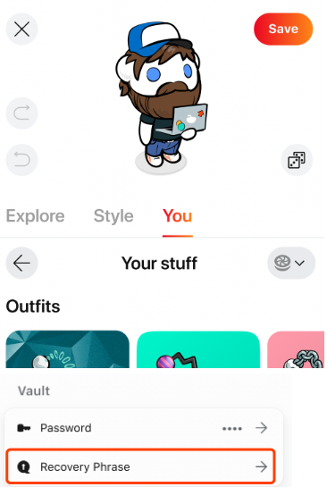
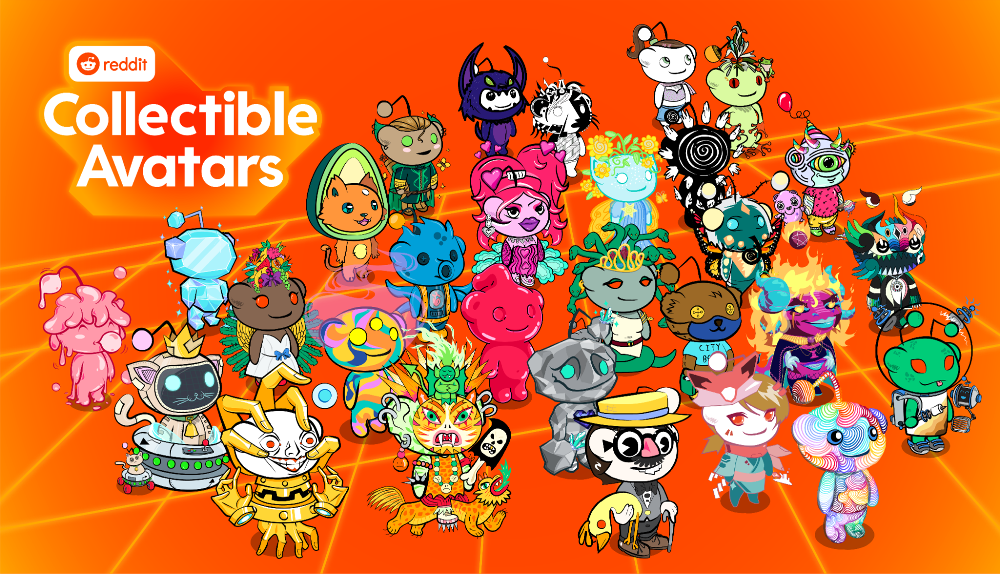
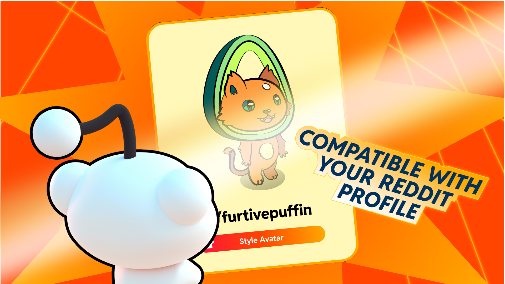
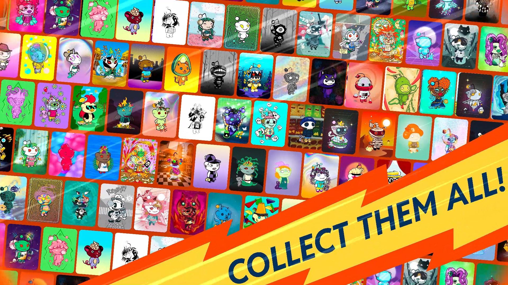
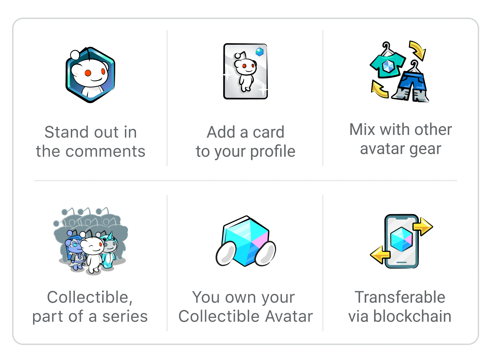

# Reddit NFT 需知手册
## 什么是区块链，它是如何工作的？
- 什么是区块链？

	用最简单的方式解释，区块链是一种用于以去中心化方式存储和处理交易信息的技术。正因为如此，个人可以相互交易，而不需要像 Reddit 这样的中心系统。今天，我们正在帮助处理最初的 [Collectible Avatar](https://reddithelp.com/hc/en-us/articles/7559750587540) 销售，但由于区块链的运作方式，个人可以在 Reddit 之外相互交易，而无需我们的参与。
- 区块链如何运作？

	区块链是一个去中心化的基础设施层，可以存储数据和处理交易。区块链的独特之处在于它不由任何单一实体拥有或控制。相反，它由一个共同协调的参与者网络维护。

	收藏头像存储在 Polygon 区块链上。它是一个通用的、与以太坊兼容的区块链，具有智能合约和充满活力的 NFT 生态系统。我们选择 Polygon 是因为它的低成本交易和[可持续发展承诺](https://polygon.technology/Sustainability)。

	在引擎盖下，个人的收藏头像存储在 Reddit 上称为 [Vault](https://reddithelp.com/hc/en-us/articles/7558997757332) 的数字钱包中。您的 Vault 为您提供了一个适用于以太坊兼容区块链的特定地址。只有您可以控制您的保险柜和地址（以及它存储的所有内容，包括收藏头像）。
- 区块链有什么好处？

	将区块链视为任何人都可以查看和使用的公共数据库。这为 Collectible Avatars 带来了几个关键优势：

	- 所有权

		数字商品历来由强大的中心化实体控制。但是，区块链上的数字商品是由持有它们的人控制的。同样，当您获得收藏头像时，您将成为它的所有者。
	- 开放性和可移植性

		区块链始终对互联网上的任何人公开可用，并且可以集成到任何应用程序或网站中。这意味着您可以在支持它们的应用程序上使用 Reddit 上的收藏头像。
	- 透明度

		区块链维护所有余额和交易的公共记录。这些数据可供任何人使用，而不是孤立在单个公司的系统中。

	请注意，Reddit 的[站点范围](https://www.redditinc.com/policies/content-policy)和社区规则适用于您在 Reddit 上的活动。因此，虽然 Reddit 无法将您的收藏头像拿走，但如果您违反网站规则或违反我们的预览条款，您可能无法在我们的[服务](https://www.redditinc.com/policies/previews-terms)上使用它们。
- 什么是 NFT？

	NFT 是 non-fungible token 的缩写，是一种以数字代币的形式存储在区块链上的独特的数字物品（如收藏头像或门票）。不可替代部分意味着它是唯一的，并且只有其中一个（例如，即使图像相同，您的令牌也是唯一且有限的）。

## 区块链隐私和您的保险库
- 区块链隐私

	请记住，[区块链](https://reddithelp.com/hc/en-us/articles/7556522726292)是公开的，任何人都可以访问。请注意将您的 Vault 或 Collectible Avatars 链接到第三方平台，因为第三方可能会通过您在这些平台和区块链上的活动来识别您。

	例如，如果您要使用您的收藏头像并在 Reddit 和 Twitter 上的个人资料中使用它，那么任何知道您在 Twitter 上的人也可以根据您拥有该头像的事实在 Reddit 上识别您收藏头像并在两个地方使用它。

	请注意，拥有保险柜后，您的 Reddit 帐户设置不会改变，但在上述情况下，您可能会无意中将您的 Reddit 帐户链接到您在其他平台上拥有的其他帐户。

	由于存在这些风险，在使用 Reddit 上的收藏品头像或将您的保险柜或收藏品头像链接到第三方平台之前，请务必仔细检查帐户和交易详细信息。
- 关于您的保险柜

	通过在 Reddit 上创建一个数字钱包 Vault，您将收到一个与以太坊兼容的区块链上的地址，特别是 Polygon。您将是唯一可以控制此地址及其相关交易的人，但此地址及其所有活动将是公开的，任何人都可以访问。
- 记住规则

	请注意，Reddit 的[站点范围](https://www.redditinc.com/policies/content-policy)和社区规则适用于您在 Reddit 上的活动，包括规则 1（记住人类）和规则 3（尊重他人的隐私）。区块链技术是新的和不断发展的，并不总是对第一次使用它的人宽容。尊重使用收藏头像的其他人的隐私，如果您看到有人不小心对自己进行 doxxing，请记住这个人。

	虽然 Reddit 无法将您的收藏头像拿走，但如果您违反网站规则或违反我们的预览条款，您可能无法在我们的服务上使用它们，因此请记住这些规则。

## Reddit 保险柜基础知识
- 什么是保险柜？

	Vault 是您在 Reddit 上的数字钱包。它可以帮助 redditor 在 Reddit 上存储和管理基于区块链的数字商品，例如 [Collectible Avatars](https://reddithelp.com/hc/en-us/articles/7559750587540)。

	创建保险柜后，您将收到一个公共地址，并且需要保护您的保险柜。公共地址是您在与以太坊兼容的区块链上的地址，您的收藏头像被存储在这里并且只有您可以控制。

	为了保护您的保险柜，您需要为其创建一个新密码。
	
		您必须记住您的保险柜密码或知道您的恢复短语。如果您丢失了它们，Reddit 将无法帮助您恢复您的 Vault。
- 如何创建保险柜？

	当您第一次在 Reddit 上使用基于区块链的功能时，系统会提示您创建一个保险柜，例如购买（或赚取）收藏品头像。只需按照说明创建和保护您的 Vault。
- 如何保护我的保险柜？

	只有您可以访问您的 Vault，这就是保护它的重要性。如果您无法访问您的 Vault，
	
		Reddit 将无法帮助您。
	为了保护您的 Vault，系统会要求您为其创建一个新密码。为了使您的 Vault 尽可能安全，最好创建一个完全唯一的密码，该密码不同于您的 Reddit 密码并且具有更多要求。此密码仅用于访问您的保险柜和其中存储的数字商品，例如收藏头像。您需要此密码才能访问您的保险库并完成某些交易，例如转移您的收藏头像。

	永远不要将您的 Vault 密码提供给其他任何人，这一点非常重要。没有 Reddit 员工会要求您提供 Vault 密码。
	
		您必须记住您的保险柜密码或知道您的恢复短语。如果您丢失了它们，Reddit 将无法帮助您恢复您的 Vault。
	我们还建议您保存 Vault 恢复短语以进一步保护您的 Vault。您可以按照[此处](https://reddithelp.com/hc/en-us/articles/7559087906324-Reddit-Vault-Advanced)的步骤访问您的保险柜恢复短语。
- 我在哪里可以访问我在 Reddit 上的保险柜？

	这取决于您使用的平台。

	- 在桌面上，您无法直接导航到您的保险柜，但您可以使用您的保险柜密码或恢复短语从我们的[官方 Reddit 移动应用程序](https://reddithelp.com/hc/en-us/articles/360060630212)访问您的保险柜并导航到那里。
	- 在 iOS 上
		- 您可以通过点击右上角的头像来访问您的 Vault。
		- 点击 Style Avatar，它将引导您进入 Reddit 头像生成器。
		- 然后，点击你部分，
		- 然后点击你的东西，
		- 最后点击保险柜齿轮图标。

		从这里，您可以访问您的公共地址、恢复短语并更改您的保险柜密码。
	- 在 Android 上

		您可以通过与在 iOS 上相同的方法访问您的 Vault，但您也可以通过 Android 移动应用程序上的侧抽屉访问您的 Vault。点击标题中 Vault 旁边的三个点“...”以打开 Vault 设置。您可以查看您的收藏头像、登出您的保险柜并从那里切换保险柜。收藏品头像持有者的侧边抽屉查看功能即将登陆 iOS！
- 如果我丢失了保险柜 `密码` 或 `恢复短语` 怎么办？

	不幸的是，Reddit 不会保留您的保险柜密码或恢复短语，也无权访问您的保险柜以恢复它或其中的任何数字商品，包括收藏头像。如果您完全确定自己不记得您的 Vault 密码或恢复短语，我们将无法解锁您的 Vault 或检索您的数字商品。

- 我会无法访问我的保险柜吗？

	如果您的 Reddit 帐户被暂停，而我们无法取走您的保险柜（或其中的任何收藏头像），我们可能会限制您在 Reddit 平台上与您的保险柜互动的能力，直到暂停结束。

	请记住，Reddit 的站点范围和社区规则适用于您在 Reddit 上的活动，如果您违反站点规则或违反我们的预览条款，您可能无法通过我们的服务访问您的保险柜（包括其中的任何收藏头像）。

- 我可以删除我的保险柜吗？
	
	因为 Vault 是区块链上的数字钱包，所以您无法永久删除您的 Vault。如果您想取消您的保险柜与 Reddit 帐户的关联，[您可以在此处提交请求](https://reddithelp.com/hc/en-us/requests/new?ticket_form_id=125906)。
	
## Reddit 保险库高级
- 您是区块链新手并正在寻找有关您的 Vault 的基本信息吗？

	看看[这篇文章](https://reddithelp.com/hc/en-us/articles/7558997757332)吧！否则，本节将为对区块链更有经验的人或正在寻找其他途径来保护对其 Vault 的访问（例如，通过保存您的恢复短语）的人提供详细信息。
- 创建 Vault 时会发生什么？

	Vault 是一个非托管、无主机的钱包，可让您自行托管某些数字商品，包括可收藏的头像。创建 Vault 时，您将收到一个公共地址和一个私钥。

	- 公钥地址

		是您在与以太坊兼容的区块链上的地址，例如 Polygon 区块链。收藏头像是在 Polygon 区块链上铸造的，这是存储您的收藏头像记录的地方。
	- 私钥

		是访问您的 Vault 的唯一方式，如果您丢失了私钥，您可能无法访问您 Vault 中的收藏头像。

	从[收藏头像商店](https://www.reddit.com/avatar)购买收藏头像时首次创建保险柜的人的默认体验是通过使用保险柜的唯一密码加密您的私钥来保护您的保险柜。
	
		在某些情况下（例如，如果您在我们的移动应用程序上免费申领收藏头像），在完成申领流程后，系统会提示您创建此密码。
	您的保险柜密码应该是只有您知道的密码（与您的 Reddit 密码分开），并且密码的加密版本存储在 Reddit 服务器上。由于它是加密的，Reddit 无法看到您的私钥，也无法使用它。

	我们还建议通过保存您的保险柜恢复短语并将其存储在安全的地方来进一步保护您的保险柜。恢复短语是按特定顺序排列的 12 个单词，您可以使用它在 Vault 或其他钱包（如 MetaMask）中重新创建您的私钥。

		永远不要将您的 Vault 密码或恢复短语提供给其他任何人，这一点非常重要。没有 Reddit 员工会向您索要其中任何一个。

- 我在哪里可以访问我的保险柜恢复短语？

	这取决于您使用的平台。

	- 在桌面系统上

		您无法直接导航到您的保险柜，但您可以使用您的保险柜密码或恢复短语从我们的[官方 Reddit 移动应用程序](https://reddithelp.com/hc/en-us/articles/360060630212)访问您的保险柜，并在那里导航到您的保险柜恢复短语。
	- 在 iOS 上
		- 您可以通过点击右上角的头像来访问您的 Vault 恢复短语。
		- 点击 Style Avatar，它将引导您进入 Reddit [头像生成器](https://www.reddit.com/avatar)。
		- 然后，点击你部分，然后点击你的东西
		- 最后点击保险柜齿轮图标。您可以从此处访问您的保险柜恢复短语。
	- 在 Android 上
		- 您可以通过与在 iOS 上相同的方法访问您的 Vault 恢复短语，但您也可以通过 Android 移动应用程序上的侧抽屉访问您的 Vault。点击标题中 Vault 旁边的三个点“...”以打开 Vault 设置。您可以查看您的收藏头像、登出您的保险柜并从那里切换保险柜。收藏品头像持有者的侧边抽屉查看功能即将登陆 iOS！

		 
		 
		您的 Vault 恢复短语非常重要——拥有此短语的人将完全控制您的 Vault 及其中的项目。 如果您丢失了恢复短语，您可能无法访问您的收藏头像。 因此，确保安全存储并正确备份非常重要。

			永远不要将您的 Vault 密码或恢复短语提供给其他任何人，这一点非常重要。 没有 Reddit 员工会要求您提供保险柜密码或恢复短语。 您必须记住您的保险柜密码或知道您的恢复短语。 如果您丢失了它们，Reddit 将无法帮助您恢复您的 Vault。

- 我可以将我的 Vault 导入 MetaMask 等第三方加密钱包应用程序吗？

	是的！您可以使用恢复短语将您的 Vault 导入第三方加密钱包应用程序，例如 MetaMask。
- 如果我已经为社区积分创建了保险库，我是否需要创建一个新的保险库来购买收藏头像？

	不，如果您已经在 Reddit 上拥有一个有效的保险柜，那么当您从收藏品头像商店购买收藏品头像时，您将不会被要求创建一个新的保险柜。您购买的任何收藏头像都将存储在您之前创建的保险柜中，即您在 Reddit 上的活动保险柜，与您的 Reddit 帐户相关联。

	您可以在头像生成器中访问您的收藏头像，您可以通过导航到官方 Reddit 移动应用程序侧抽屉中的 Style Avatar 部分以及我们网站右上角的下拉菜单来访问。在头像生成器中点击或单击您部分，然后点击您的东西，您将在其中找到您的收藏头像。
- 如何判断哪个 Vault 是我的活动 Vault？

	这取决于您使用的平台。

	- 在桌面系统上

		您无法直接导航到您的保险柜，但您可以使用您的保险柜密码或恢复短语从我们的官方 Reddit 移动应用程序访问您的保险柜，并在那里导航到您的活动保险柜地址。
	- 在 iOS 上

		您可以通过点击您的头像来访问您的 Vault，这将引导您进入 Reddit 头像生成器。从那里，点击你部分，然后点击你的东西，最后点击保险柜齿轮图标。您可以从此处查看您的活动保险柜地址。
	- 在 Android 上

		您可以通过与在 iOS 上相同的方法访问您的 Vault，但您也可以通过在 Android 移动应用程序上点击三个点“...”通过 Android 移动应用程序上的侧抽屉访问您的活动 Vault 地址。标头以打开 Vault 设置。收藏品头像持有者的侧边抽屉查看功能即将登陆 iOS！

	请注意，您在任何时候都只能拥有一个有效的保险柜地址。您的收藏头像将被发送到购买时与您的帐户有效关联的保险柜地址。
- 我可以拥有多个保险柜吗？

	您可以将多个保险柜与您的 Reddit 帐户关联，但只有一个活动保险柜。如果您在已经拥有保险柜的 Reddit 帐户上创建第二个保险柜，那么第二个保险柜将成为与该 Reddit 帐户关联的活动保险柜。在这种情况下，如果您没有保留原始 Vault 的密码或恢复短语，原始 Vault 和存储在其中的任何数字商品（例如收藏头像）可能无法恢复。

		您必须记住您的保险柜密码或知道您的恢复短语。如果您丢失了它们，Reddit 将无法帮助您恢复您的 Vault。

## 关于收藏头像商店

- 什么是收藏头像？

	收藏头像是 Reddit 的限量版头像，为所有者提供 Reddit 平台上的独特好处。此创作者合集由独立创作者与 Reddit 合作制作。当您购买收藏头像时，您将成为它的所有者。这意味着您可以保留、交易、出售或在 Reddit 上将其用作您的头像。

	
- 拥有收藏版头像有什么好处？

	收藏头像还使您能够解锁 Reddit 上的其他功能。如果您在 Reddit 上将您的收藏头像设置为您的头像，您可以将头像装备与其他 Reddit 头像装备和配饰混合搭配，您将获得特殊的个人资料处理和特殊的评论处理，从而使您的头像真正脱颖而出。

	
- 如何购买收藏头像？

	您可以在 Reddit 的收藏头像商店购买收藏头像，在那里您可以找到由独立创作者与 Reddit 合作制作的收藏头像。收藏品头像可以使用您的当地货币购买，例如美元。一旦您完成购买，您就可以将收藏品头像设置为您在 Reddit 上的头像。

	
- 创作者如何获得报酬？

	创作者每在 Reddit 上销售的收藏头像都会获得报酬，减去任何费用。如果收藏品头像被转售，创作者也有权获得版税。

## Reddit 上的收藏头像
- 什么是收藏头像？
​​​​
​​​​	收藏头像是 Reddit 的限量版头像，为所有者提供 Reddit 平台上的独特好处。创作者合集由独立创作者与 Reddit 合作制作。它们由 Polygon 区块链上的不可替代代币 (NFT) 提供支持，因此您需要一个 [Vault](https://reddithelp.com/hc/en-us/articles/7558997757332)（您在 Reddit 上的数字钱包）来存储它们。

	当您购买收藏头像时，您将成为它的所有者。这意味着您可以保留、交易、出售或在 Reddit 上将其用作您的头像。

	
- 什么是收藏头像商店？

	收藏头像商店是您从独立创作者那里寻找和购买收藏头像的好去处。在商店中，您可以查看可用的收藏品，了解更多关于创作者和艺术家的信息，并设置您的 Reddit 保险库，以便开始您的收藏。

	要访问商店，请导航到应用程序侧抽屉和我们网站右上角下拉菜单中的 Style Avatar 部分，然后单击 Shop。要获得更详细的概要，[请访问关于收藏头像商店的文章](https://reddithelp.com/hc/en-us/articles/6213835889044)。
- 我实际上拥有什么？我可以将我的收藏头像作为 NFT 出售吗？

	您实际“拥有”的是一系列权利，包括在 Reddit 内外展示与您的收藏头像相关的头像艺术的权利，以及在 Reddit 上将该艺术作为您的头像展示时访问特殊头像效果的权利。

	这些权利由 Reddit 和许可人（包括独立创作者）授权给您。您可以使用、复制和展示头像艺术供您个人使用，并且您可以通过将您的收藏头像出售或转让给其他人来将这些权利转让给他人。但是，我们今天不支持在 Reddit 上进行收藏头像的二次销售。
- 如何将我的收藏头像作为 NFT 转移？

	您可以将您的收藏头像转移到另一个带有 Vault 的 Reddit 帐户或外部第三方加密钱包。

	请访问我们的转会文章以了解[更多信息](https://reddithelp.com/hc/en-us/articles/9479929142420)。
- 为什么我在头像生成器中看不到收藏头像卡的背景？

	目前，背景卡片不会作为单独的配件出现在头像生成器中。相反，它们与属于特定收藏头像的配件相关联。这意味着只要您将收藏品头像中的一种配件装备到您的头像上，您的背景卡就会出现在您的个人资料表面上。这使您可以自由地将收藏品头像装备与其他 Reddit 头像装备和配件混合搭配，并且仍然可以获得特殊的个人资料处理和帖子的特殊评论处理。
- 购买后如何查看收藏头像的详细信息？

	要查看您拥有的特定收藏头像的详细信息，您可以通过头像生成器中“服装详细信息”部分的“查看详细信息”或通过您的个人资料和 Reddit 侧抽屉中的“详细信息”访问它们移动应用程序。
- 系列大小旁边的“+”是什么意思？

	收藏头像是限量版头像，可以作为系列的一部分购买或领取。但是，Reddit 直到销售或索赔窗口结束才知道该系列的确切大小，因此 +。虽然我们预计系列的尺寸会非常接近或小于显示的尺寸（例如，如果它显示“250+”，那么实际系列尺寸可能是 255 或更少），但我们要等到销售完成后才能知道。

	您的收藏头像卡正面显示的系列规模只是对系列规模的风格化和四舍五入的估计。购买后（销售完成）或在区块链上可以找到确切的尺寸。
- 为什么我的序列号与我的令牌 ID 号不同？

	我们的序列号和令牌 ID 不是 1:1。
	
	- Token ID 为 0 索引
	- 序列号为 1 索引

	例如，如果您的序列号是 50，那么您的令牌 ID 将为 49
	
## 如何转移您的收藏头像
您可以将您的收藏头像转移到另一个带有 Vault 的 Reddit 帐户或外部第三方加密钱包。

绝对确保您将其发送到正确的地址或用户。

- 如果您输入错误的地址，您可能会永远失去您的收藏品。
- 如果您改变主意，您可能会永远失去您的收藏品。
- Reddit 无法帮助您恢复它。

此转让功能不应用于销售收藏头像。

- 请勿转让给承诺向您付款的其他人。
- Reddit 无法保证付款。
- 如果发生欺诈，Reddit 无法退回或更换您的收藏头像。

以下是完成转移的步骤：

- 打开您要转移的收藏头像的详细信息页面。
	- 要查找详细信息页面，请转到您的头像生成器，然后点击您 > 您的东西
	- 从那里，点击收藏头像并选择查看详细信息
- 点击详细信息屏幕底部的转移
- 为收件人输入以下信息之一
	- Reddit 用户名
	- 公共保险库地址
	- 公共加密钱包地址
- 如果您在网络上，则需要输入您的保险柜密码才能完成转移
- 点击转移以确认转移
- 以下屏幕将告诉您转移是否成功
	- 这最多可能需要 5 分钟才能完成
	- 如果您的转移失败，请确保您转移的是您的活动保险库中的收藏头像 - 而不是非活动的

您可以在 Reddit 官方移动应用程序以及 Reddit 网站（新 Reddit）上转移您的收藏品。在有限的时间内，我们为用户提供每个收藏头像的免费转让。

您进行的任何转移都必须遵守 Reddit 的预览条款。虽然 Reddit 无法拿走您的收藏头像，但如果您违反我们的预览条款，您可能无法在我们的服务中使用它们。

### 转移成功后会发生什么？
一旦收藏品头像成功转移，就会发生几件事。

发起转账的 Reddit 账户：

- 不能再使用作为 Reddit 头像的收藏头像
- 如果装备了转移的收藏头像的配件，评论和个人资料中将不再有特殊头像处理
- 将无法访问与转移的收藏头像相关联的头像构建器中使用的任何配件

请注意，如果收藏品转移到第三方加密钱包，收藏品头像的新所有者将必须支付网络费用才能将收藏品转移回 Reddit 上的保险库。

### 什么是网络费用？
网络费用是与在区块链上完成交易相关的费用。它们通常由发起交易的个人支付，以支付与验证和完成交易相关的成本。

在有限的时间内，Reddit 开始承担这些网络费用，以便为每个收藏头像提供一次免费转账。
### 转移我的收藏头像 NFT 是否需要支付任何费用？
在有限的时间内，我们为用户提供每个收藏头像的免费转让

## 在 Reddit 上出售收藏头像的费用
- 想要在 Reddit 上出售收藏头像的创作者需要支付哪些费用？

	作为与 Reddit 合作的一部分，创作者将收藏品头像销售的所有收入从他们的系列中扣除两套费用。

	- 首先,支付处理商对每个收藏头像销售收取交易费用，这些费用可能会有很大差异，具体取决于收藏头像是从 Reddit 移动应用程序还是网站购买的（即，30% 来自 Apple 和 Google，而约 2.9% 来自 Stripe ）。
	- 其次，Reddit 对初级销售收取 5% 的总费用，用于支付铸币费和相关的区块链费用，以及支持创作者计划。

	如果其系列中的收藏头像被所有者转售，创作者也有权获得 5% 版税的 50%； Reddit 有权获得剩余的 50%。
- 任何人都可以在 Reddit 上出售收藏头像吗？

	目前，创作者计划对特定创作者处于公开测试阶段。如果您有兴趣参与，请填写此表格，如果您被选中，我们会与您联系！
- 我们目前不支持个人所有者的收藏头像的二次销售

## 参考说明
[Blockchain, Vault, and Collectible Avatars](https://reddithelp.com/hc/en-us/sections/7556406840852-Blockchain-Vault-and-Collectible-Avatars)
				