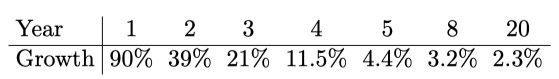

# Sia: Simple Decentralized Storage(简单的去中心化存储)
## 概述
Sia 是一种去中心化存储的平台，支持在对等方之间形成存储合约。合约是存储提供商与他们的客户之间的协议，定义了将存储哪些数据以及以存储价格。他们要求存储提供商定期证明自己仍在存储客户的数据。合约存储在区块链中可公开审核。在这方面，Sia 可以被视为包含对此类合约的支持的比特币衍生产品。 Sia 最初将被实现为山寨币，随后将通过双向钉子金融连接到比特币。
## 介绍
Sia 是一个去中心化的云存储平台，旨在与现有的存储解决方案在 P2P 和企业级别上竞争。 Sia 上的对等方不是从集中提供者那里租用存储，而是从彼此之间租用存储。 Sia 本身仅存储各方之间订立的存储合约，从而定义了双方的安排条款。为此，使用了类似于比特币[1，12]的区块链。

通过签订合约，存储提供商（也称为存储节点）同意存储客户的数据，并定期提交其继续存储的证明，直到合约到期为止。存储节点为他们提交的每个证据得到补偿但因缺少证据而受到处罚。由于这些证明是公开可验证的(并且可以在区块链中公开获得)，网络共识可用于自动执行存储合约。重要的是，这意味着客户无需亲自验证存储证明；他们可以简单地上传文件，然后让网络完成其余的工作。

我们承认，将数据存储在单个不受信任的存储节点上几乎无法保证可用性、带宽或总体服务质量。相反，我们建议在多个存储节点之间冗余存储数据。特别地，使用 EC 可以实现高可用性而没有过多的冗余。

Sia 最初将被实现为基于区块链的山寨币。如 `使用固定的侧链实现区块链创新` [5] 中所讨论的那样，计划在未来为双向钉住比特币提供支持。 Sia 协议在很大程度上类似于比特币，除了以下所述的更改。
## 总体结构
Sia 与比特币的主要区别在于交易。比特币使用脚本系统来启用各种交易类型，例如，`公开给公众` 的 `哈希` 等。 Sia 选择对所有事务使用 `M–of–N` 多重签名方案，完全避开脚本系统。这降低了复杂性和攻击面。

Sia 还扩展了交易以实现存储合约的创建和执行。使用三个扩展来完成此任务：

- 合约
- 证明
- 和合约更新

	合约声明了存储节点打算存储具有一定大小和哈希值的文件的意图。它们定义了存储节点必须提交存储证明的规则。建立合约后，可以在以后通过合约更新来修改合约。这些交易类型的具体定义在第4和第5节中。

## 事务(交易)
一个事务包含以下内容

字段|描述
---|---
版本|协议版本号
任意数据|用于元数据或其他
矿工费|给予矿工收入的奖励
输入|输入资金(可选)
输出|输出资金(可选)
文件合约|文件合约(可选)
储存证明|储存证明(可选)
签名|每个输入的签名
### 输入和输出
输出包括一定量的 coins 。每个输出都有一个关联的标识符，该标识符是从该输出出现在其中的事务派生的。事务 `t` 中的输出 `i` 的 ID 定义为：

	H(t || “output” || i)
其中 H 是加密哈希函数，`输出` 是字符串文字。 集体奖励和矿工费用具有特殊的输出ID，由以下代码给出：

	H(H(Block Header) || “blockreward”)
每个输入都必须来自先前的输出，因此输入只是一个输出 ID。输入和输出还与一组支出条件配对。 输入包含支出条件本身，而输出包含其默克尔根哈希[2]。
### 消费条件
消费条件是 `解锁`  coins 并可以消费之前必须满足的属性。花费条件包括时间锁定和一组公共密钥以及所需的签名数。在时间锁定到期并且足够的指定键已添加其签名之前，不能花费输出。

使用时间锁，所需的签名数和公用密钥作为叶子，将花费条件散列到 Merkle 树中。该树的根哈希用作 coine 被发送到的地址。为了花费硬币，必须提供对应于地址散列的花费条件。默克尔树的使用使各方可以有选择地显示消费条件下的信息。例如，可以在不公开公钥数量或所需签名数量的情况下显示时间锁定。

应当注意的是，时间锁和签名数量具有较低的熵，从而使其哈希值容易受到蛮力攻击。这可以通过在这些字段中添加随机随机数来解决，以空间效率为代价来增加它们的熵。
### 签名
交易中的每个输入都必须签名。密码签名本身与输入 ID、时间锁和一组标志配对，这些标志指示已对交易的哪些部分进行了签名。

- 输入 ID 指示将签名应用于哪个输入。
- 时间锁指定签名变为有效的时间
- 交易中的任何字段子集都可以签名

但签名本身除外（因为这是不可能的）。 除签名外，还有一个标志指示应该对整个交易进行签名。 这允许更细微的交易方案。因此，要签名的实际数据是

- 时间锁
- 输入 ID 标志
- 每个标志字段的串联

交易中的每个此类签名都必须有效，交易才能被接受。

### 文件合约
文件合约是存储提供商与他们的客户之间的协议。文件合约的核心是文件的 Merkle 根哈希。为了构造此哈希，将文件分为恒定大小的段，然后哈希为 Merkle 树。根哈希以及文件的总大小可用于验证存储证明。

文件合约还指定了

- 持续时间
- 挑战频率

	挑战频率指定必须多久提交一次存储证明，并创建离散的挑战窗口，在此期间，存储节点必须提交存储证明（每个窗口一个证明）。在挑战窗口期间提交有效证明会触发自动付款到 “有效证明” 地址（可能是存储节点）。如果在挑战窗口的末尾没有提交有效的证明，则代币将被发送到 “遗漏的证明” 地址（可能是为了减少 DoS 攻击而花费的地址；请参阅第7.1节)。合约定义了可能遗漏的最大数量的证明；如果超过此数字，则合约无效。
- 支付参数

	包括对有效证明的奖励，对无效或缺失证明的奖励以及可以遗漏的最大证明数量。

合约终止

- 如果合约在合约期限结束时仍然有效，则它将成功终止并将剩余的 coins 发送到有效的证明地址。
- 相反，如果合约资金在期限到期之前已用完，或者超过了遗漏的证明的最大数量，则合约将无法终止，并将剩余的硬币发送到遗漏的证明地址。

完成或缺少证明会导致新的交易输出属于合约中指定的接收方。凭证的输出 ID 取决于合约 ID，定义为：

	H(transaction || “contract” || i)
其中，`i` 是交易中合约的索引。然后可以从以下命令确定证明的输出ID：

	H(contract ID || outcome || W i )

其中 `W i` 是窗口索引，即自合约订立以来经过的窗口数。 结果是字符串文字：` validproof` 和 `missedproof`，对应于证明的有效性。

合约终止的输出ID定义为：

	H(contract ID || outcome)
如果结果的潜在价值为 `成功终止`  和  `未成功终止` ，则对应于合约的终止状态。

还使用类似于交易支出条件的 `编辑条件` 列表来创建文件合约。 如果满足编辑条件，则可以修改合约。 可以修改任何值，包括合约资金，文件哈希和输出地址。 由于这些修改会影响后续存储凭证的有效性，因此合约编辑必须指定一个将来的挑战窗口，在该窗口它们将生效。

从理论上讲可以创建 “微型编辑渠道” 以促进频繁的编辑； 请参阅小额支付渠道的讨论，第7.3节。

## 储存证明
定期提交存储证明交易以履行合约。 每个存储证明都针对特定的合约。 存储证明不需要任何输入或输出； 仅需要合约 ID 和证明数据。
### 算法
存储节点通过提供原始文件的一部分以及文件的 `Merkle` 树中的哈希列表来证明其存储。 该信息足以证明该段来自原始文件。由于证据已提交给区块链，因此任何人都可以验证其有效性或无效性。每个存储证明使用随机选择的段。 挑战窗口 `Wi` 的随机种子由下式给出：

	H(contract ID || H(B i−1 ))
其中 `B i-1` 是紧接 `W i` 开始之前的块。如果存储节点能够始终证明自己拥有一个随机段，那么他们很有可能会存储整个文件。 仅存储文件 50％ 的存储节点将无法完成大约 50％ 的证明。
### 区块预扣攻击
随机数生成器通过块保留攻击进行操作。在该过程中，攻击者会保留块，直到发现能够产生有利随机数的块为止。但是对于特定的挑战，攻击者只有一次机会操纵随机数。此外，扣留区块以操纵随机数将使攻击者损失区块奖励。

如果攻击者能够挖掘 50％ 的块，则可以操纵 50％ 的挑战。但是，剩余的 50％ 仍然是随机的，因此攻击者仍将无法通过某些存储证明。具体而言，它们将导致失败的次数是没有进行预扣攻击的失败次数的一半。

为了防止此类攻击，客户可以指定较高的挑战频率，并对丢失的证据处以较大的罚款。这些预防措施应足以阻止控制金融散列能力不到 50％ 的任何出于财务动机的攻击者。无论如何，建议客户围绕潜在的拜占庭式攻击进行计划，而这可能并非出于经济动机。
### 封闭窗口攻击
存储节点只有在其证明交易进入区块链的情况下才能完成存储证明。矿工可能恶意地将存储证明从区块中排除，从而剥夺了交易费，但对存储节点施加了罚款。另一种选择是，矿工知道要比一般交易更重要，他们可以通过索要高昂的费用来勒索存储节点，以包括存储证明。 这被称为关闭窗口攻击，因为恶意矿工人为地 `关闭了窗口`。

对此的防御措施是使用较大的窗口大小。托管人可以合理地假设一定比例的矿工将包括他们的证明以换取交易费。 由于托管人同意所有文件合约，因此他们可以自由拒绝他们认为会使自己容易受到封闭窗口攻击的任何合约。
## 任意交易数据
每个事务都有一个可用于任何类型信息的任意数据字段。如果节点中的任何数据由事务中的任何签名，则将要求节点存储该数据。节点最初将每个块接受多达 64 KB 的任意数据。

这种任意数据为存储节点和客户端提供了一种分散的方式来组织自己。它可用于广告寻找存储节点的可用空间、文件或创建分散的文件跟踪器。

任意数据也可以用于实现其他类型的软叉。 这可以通过创建 `任何人都可以花` 的输出来完成，但要在任意数据中指定限制。理解限制的矿工可以阻止任何花费输出的交易，而无需满足必要的规定。原始节点将保持同步，而无需能够解析任意数据.

## 储存生态系统
Sia 依赖于促进分散存储的生态系统。 存储提供商可以使用任意数据字段向网络宣布自己。可以使用客户将能够读取的标准化模板来完成此操作。客户可以使用这些公告创建潜在存储节点的数据库并仅与他们信任的存储节点签订合约。
### 存储节点保护
合约需要存储提供商及其客户双方的同意，从而允许提供商拒绝不利条款或不想要的（例如非法）文件。 提供者还可以拒绝签署合约，直到将整个文件上载到他们。

合约条款为存储提供商提供了一定的灵活性。 他们可以宣传自己是最低可靠的广告，价格低廉，并且同意对丢失文件的处罚最小； 或者他们可以宣传自己是高度可靠的人，提供更高的价格，并同意对输掉文件的行为施加更严厉的处罚。 有效的市场将优化存储策略。

存储节点容易受到拒绝服务攻击，这可能阻止存储节点提交存储证明或转让文件。 存储节点有责任保护自己免受此类攻击
### 客户保护
客户可以使用 EC，例如重新生成代码(regenerating codes)[4]，以防止存储节点异常。这些代码通常通过将文件拆分为 n 个片段进行操作，从而可以从 m 个唯一片段的任何子集中恢复该文件。(n 和 m 的值根据特定的 EC 和冗余因子而变化。）然后，将每个片段加密并存储在许多存储节点上。即使平均网络可靠性较低，这也可以使客户端获得较高的文件可用性。举一个极端的例子，如果只需要 100 个文件中的 10 个就可以恢复文件，那么客户端实际上就是依靠10 个最可靠的存储节点，而不是平均的可靠性。通过重新托管存储节点已完工的文件，可以进一步提高可用性。其他指标也可以从该策略中受益。客户端可以通过从最近的 10 个存储节点进行下载来减少延迟或者通过从 10 个最快的存储节点进行下载来提高下载速度。这些下载可以并行运行以最大化可用带宽。
### 正常运行时间奖励
存储证明不包含强制持续运行时间的机制。也没有任何规定要求存储节点根据要求将文件传输给客户端。因此，人们可能不希望看到托管人将客户的文件扣为人质并要求高昂的费用才能下载它们。但是，如第7.2节所述，可以通过使用EC 来缓解这种攻击。该策略使客户可以自由地忽略不合作的存储节点，而仅与那些合作的存储节点合作。结果，权力从存储节点转移到客户端，“下载费用”成为“上载激励”。

在这种情况下，客户将因被发送文件而获得回报，而存储节点必须竞争以提供最佳的服务质量。客户可以随时请求文件，这可以激励存储节点最大限度地延长正常运行时间，以获取尽可能多的奖励。客户还可以通过按比例获得更大的奖励来激励更大的吞吐量和更低的延迟。客户甚至可以执行随机的“检查”仅仅因为在线就可以奖励存储节点，即使他们不希望下载任何内容。但我们重申，正常运行时间激励措施不是 Sia 协议的一部分；它们完全取决于客户的行为。

预计将通过预先存在的小额支付渠道支付下载费用[11]。小额支付渠道允许客户以最小的延迟和区块链膨胀来进行许多连续的小额支付。存储节点可以转移一小部分文件，并在继续进行之前等待接收小额付款。使用许多连续的付款可以使每一方将被骗的风险降到最低。小额支付足够小且足够快，可以每隔几秒钟进行一次支付，而不会对吞吐量产生任何重大影响。

### 基本信誉系统
客户需要一种可靠的方法来挑选高质量的存储节点。分析他们的历史是不充分的，因为可能会欺骗历史。存储节点可以与自己重复订立合约，同意存储大的 “假” 文件，例如仅包含零的文件。在不实际存储任何内容的情况下对此类数据执行存储证明将是微不足道的。

为了减轻这种 Sybil 攻击，客户端可以要求在任意数据部分中宣布自己的存储节点还包括大量时间锁定的 coins。如果 10 个 coins 在未来的14天被时间锁定，则可以说存储节点已创建了一个价值 140 个 coins 的日锁。通过偏爱创建高价值锁的存储节点，客户端可以减轻 Sybil 攻击的风险，因为有价值的锁并非易事。

每个客户可以选择自己的等式来选择存储节点，并且可以使用许多因素，包括价格、锁值、提供的存储量以及存储节点愿意为丢失文件付出的惩罚。可以使用更集中的环境在带外实施更复杂的系统，例如使用人工检查或其他指标的系统。
## 新基金
Sia 是 Nebulous Incorporated 的产品。 Nebulous 是一家获利的公司，Sia 打算成为该公司的主要收入来源。货币预发不是稳定的收入来源，因为它需要创建一种新的货币并将公司的收入与该货币的不断增长的价值联系起来。当公司需要花钱时，它必须权衡其部分收入来源。此外，预挖意味着一个实体可以控制大量货币，因此有可能对市场进行大规模破坏性控制。

相反，Nebulous 打算以与 Sia 增加的价值成比例的方式从 Sia 产生收入，这取决于客户和存储节点之间建立的合约的价值。这是通过对所有合约收取一定费用来实现的。创建合约后，合约资金的 3.9％ 被删除并分配给 siafunds 的持有人。 Nebulous Inc. 最初将持有约 88％ 的 siafund 和 Sia 的早期众筹支持者将持有其余资金。

Siafund 可以发送到其他地址，就像 siacoins 可以发送到其他地址一样。但它们不能用来为合约或矿工费用提供资金。当 siafunds 转移到新地址时，将创建一个额外的未使用输出，其中包含 siafunds 自上一次转移以来所赚取的所有 siacoins。这些 siacoins 被发送到与 siafunds 相同的地址。
## 新亚经济学
Sia 的主要货币为 siacoin。 siacoins 的供应将永久增加，所有新的供应将作为整体补贴提供给矿工。 第一块将铸造 300,000 枚硬币。 这个数字将每块减少1个 coins，直到达到每个块至少 30,000 个coins。 按照每个区块间隔 10 分钟的目标，供应量的年增长率为：

Sia 奖励计划中存在一些不足之处。 Sia 的主要目标是提供执行存储合约的区块链。 但是，采矿奖励仅与所创建合约的总价值间接相关。

尤其是最初，该 siacoin 可能具有很高的波动性。 如果币种的价格在合约中期转移，则可能对用户主造成不利影响。 因此，我们希望看到用户提高长期合约的价格以对冲波动。 此外，用户可以在定稿之前立即以更稳定的货币（例如美元）来宣传其价格，并立即转换为 siacoin。 最终，双向钉与其他加密资产一起使用将为存储节点提供额外的手段，以使自己免受波动的影响。
## 结论
Sia 是比特币协议的一种变体，可通过加密合约实现分散式文件存储。这些合约可用于强制执行客户端与存储节点之间的存储协议。同意存储文件后，存储节点必须定期向网络提交存储证明。无论客户端的行为如何，存储节点都会自动获得存储文件的补偿。

重要的是，合约不需要托管方在请求时将文件转回其客户。相反，必须创建带外生态系统来奖励存储节点上载。客户和主持人还必须找到一种协调的方式。一种机制是区块链中的任意数据字段。列举了各种预防措施，可以减轻 Sybil 攻击和存储节点的不可靠性。

Siafunds 被用作 Nebulous Inc. 的创收机制，Nebulous Inc. 是负责发布和维护 Sia 的公司。通过使用 Sia 资金而不是预付金，Nebulous 可以更直接地将收入与网络的实际使用相关联，并且很大程度上不受恶意实体可能使用网络货币进行的市场游戏的影响。矿工也可能从 siafund 获得部分大宗补贴，其收益是相似的。从长远来看，我们希望增加对带有多种货币的双向钉的支持，这将使消费者能够避免单一货币的不稳定。

我们相信 Sia 将为非信任环境中的分散式云存储提供一个肥沃的平台。