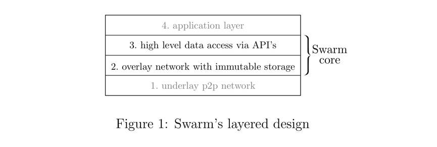
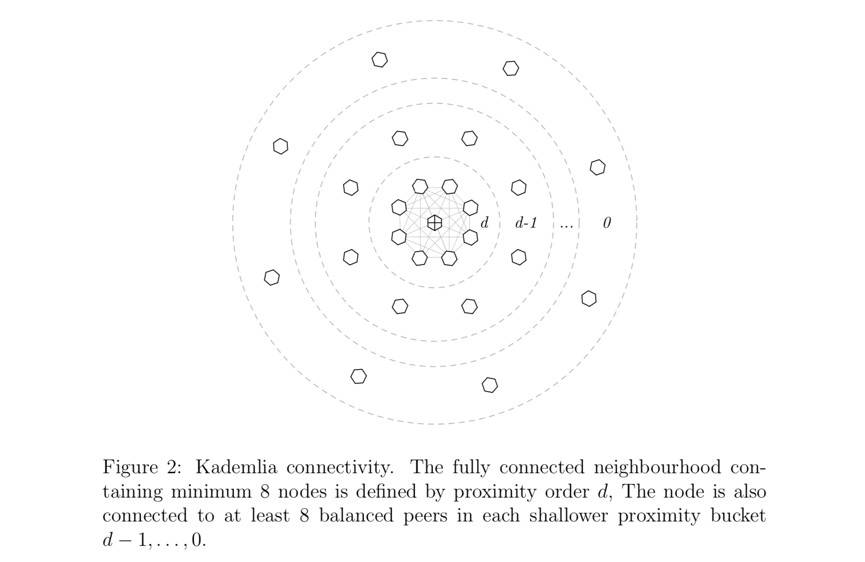
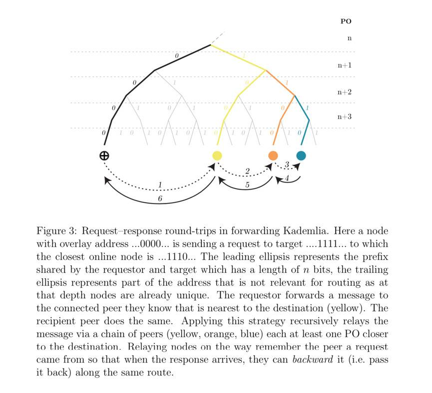
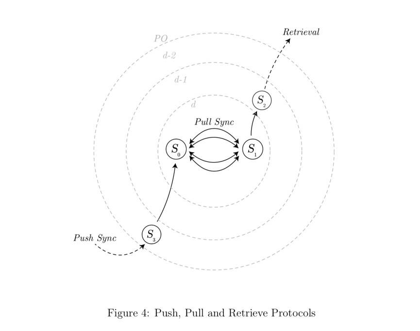
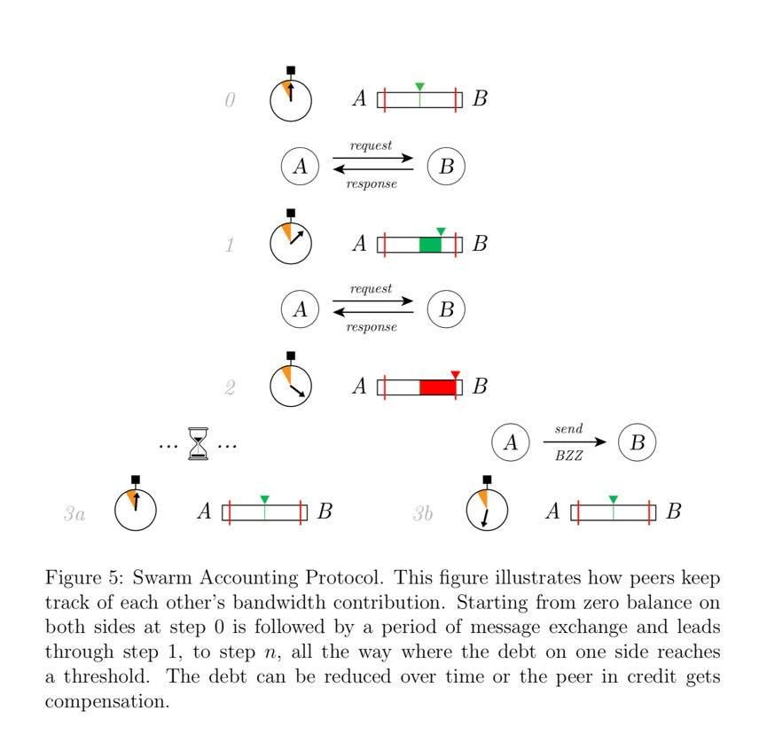
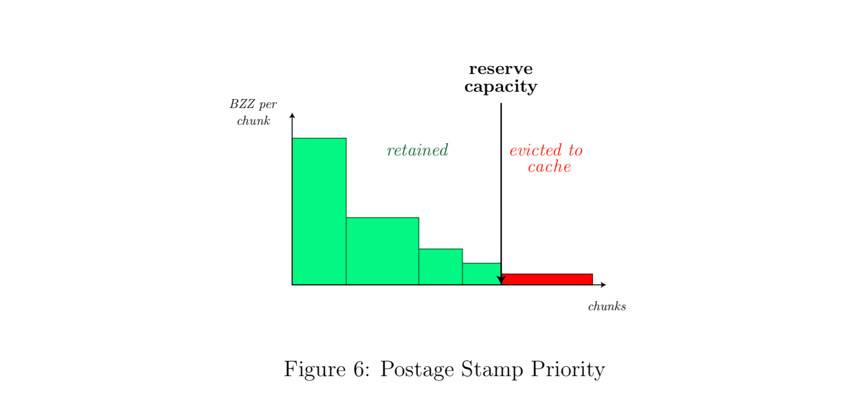
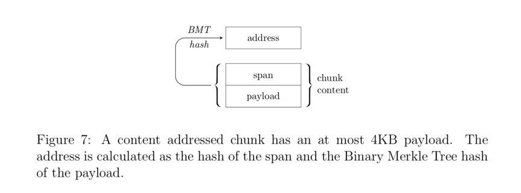
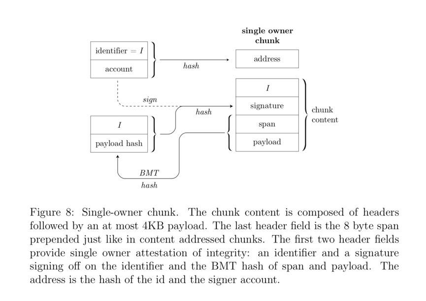
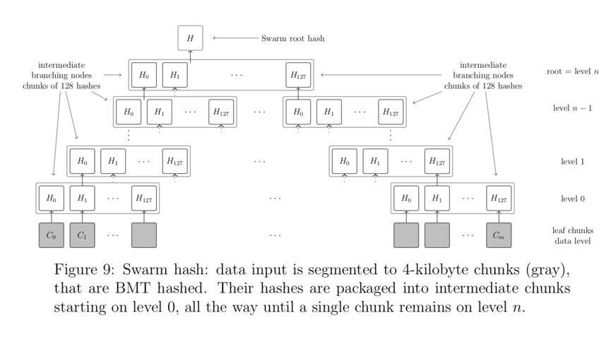
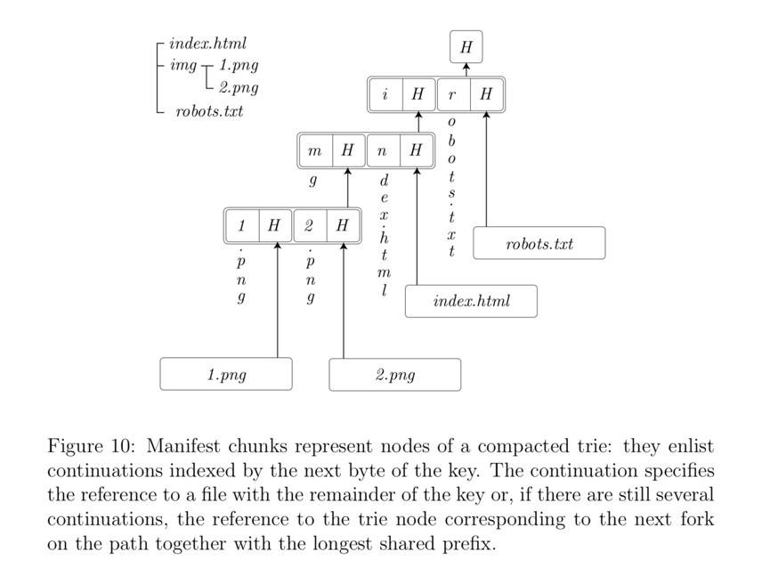

# Swarm 白皮书
## 简介
Swarm 的使命是通过为去中心化的互联网提供可扩展的底层基础设施，去塑造自我主权的全球化社会和无需许可的开放市场。Swarm 的愿景是通过点对点的存储和通信系统来延展区块链，从而让「世界计算机」成为现实，这台「世界计算机」将可以作为去中心化应用程序的操作系统和部署环境。

Swarm 可以提供不间断的服务，更有效地抵御网络中断或有针对性的 DoS 攻击。Swarm 作为一个无需许可的发布平台，有效促进了信息自由。Swarm 以其独特的隐私特性，如匿名浏览、可拒存储（deniable storage）、不可追踪的消息传递和不泄漏元数据的文件格式等，响应了日益增长的网络安全需求。

Swarm 内置的激励措施旨在优化带宽和存储资源的分配，使其在经济上能够自我维持。Swarm 节点在与每个节点的连接中追踪它们的相应带宽贡献，并且通过 BZZ 来解决由于不平等消耗而产生的额外债务。Swarm 中的发布者必须花费 BZZ 去购买向 Swarm 写入数据的权利，并对一些长期的存储预付租金。

Swarm 的模块化设计由清晰可分的层（layer）组成。从技术上讲，层 2「不可变存储的覆盖网络」层 3「通过 API 的高等级数据存取」构成了 Swarm 的核心。

## DISC: 块的分布式不可变存储
DISC （Distributed Immutable Storage of Chunks）是 Swarm 的底层存储模型。它由存储和提供数据的节点组成，在这些节点之间的协作中，假设每个节点追求使其运营者利润最大化的策略，那么网络作为一个整体，其行为将显现出以下特性：

- 隐私保护和无需许可的上传和下载
- 强大的防御措施，内容一经发布便很难再对其进行屏蔽或更改访问权限
- 随着需求的增加可自动扩展
- 得到完整性保护的内容
- 无需再保存的内容最终会被遗忘

任何拥有多余存储空间及带宽的人，都可以以节点运营者的身份参与 DISC，并由此获得奖励。当运营者安装并运行 Swarm 客户端软件时，会创建一个新节点并成为 Swarm 网络的一部分，基本上相当于负责照管 Swarm 这一全球硬盘的一小部分。

接下来，我们将进一步定义 DISC，并解释它为何会产生上述特性。

## 连接、拓扑和路由
DISC 的最初职责是建立和维护一个节点网络，使得所有节点都可以在彼此之间发送消息。这种消息交换是通过使用 p2p 网络协议（libp2p）的节点之间存在的持久而安全的通信信道进行的。Swarm 期望节点建立 Kademlia 连接：连接到其他特定的节点集时，节点对发送地址作出的本地决定，最终会让消息的传导找到全局最优路由。

Kademlia 假设每个节点都分配了一个与其网络地址不同的 Swarm 地址。通过计算前缀位（prefix bits）的数值中两个 Swarm 地址的共同值，我们可以定义它们的接近度。彼此最接近的节点们将形成一个完全连通的邻域（neighbourhood）。此外，每个节点连接到来自每个离散邻近类（discrete proximity class）的多个对等节点。

- 注 1：Libp2p 是一个便于使用者开发去中心化点对点应用的网络框架。
- 注 2：Kademlia 是由 Petar Maymounkov 与 David Mazières 所设计的 P2P 重叠网络传输协议，以构建分布式的 P2P 电脑网络。是一种基于异或运算的 P2P 信息系统。它制定了网络的结构及规范了节点间通讯和交换资讯的方式。

由此产生的拓扑结构保证了中继（relaying）在每次信息跃迁中至少将消息向其预期目的地移近一步。这种技术使消息能够在任意两个节点之间路由，即使这两个节点之间不保持直接连接。传递消息所需的跃迁数上限是节点总数的对数，这样即便在一个极其庞大的网络中，也能确保任意两个节点始终能够相互联系。

## 块和存储
Swarm 中的标准存储单元称为块（chunk）。块最多由 4 千字节的数据组成，并且附有一个地址。由于块的地址与节点的地址来自同一地址空间，因此可以计算它们的接近度。Swarm 的存储方案声明每个块都由节点存储，其地址接近块本身的地址。

为了方便数据的保密性，块可以在填充到 4 千字节后进行加密，使得没有密钥的人无法将其与其它随机数据进行区分。即使对于未加密的块，节点运营者也无法轻易确定每个块来自于哪些内容。由于 Swarm 节点无法自己选择存储、加密哪些数据块，这种来源的模糊性以及元数据的无法泄露都为它们提供了有效的保护，使它们免于承担与其所存储内容相关的责任。

为了将块插入到 Swarm 中，节点通过同步推送协议（push-sync protocol）将区块进行转送，直到到达它所属的邻域。然后，块的存储确认函将沿着相同的路径被传回。想要检索一个块，只需使用检索协议，将具有块地址的请求路由到相关邻域。如果途中的任何节点在其本地存有相应的块，则会将其以响应的形式发回。

节点们使用同步回送协议（pull-sync protocol）持续同步其块存储。这保证了每个邻域都冗余地存储属于其邻域的全部块。这种冗余增加了数据传输的弹性，在某邻域中的一些节点无法访问的情况下也能维持块的可用性。同步协议还确保邻域的存储内容在节点离线和新节点加入网络时能够保持一致。
## 转发、隐私和缓存
在 Swarm 中，消息的路由通过将其递归地转发到更接近其目的地的位置，然后沿着相同的路由传回一个响应来实现。此路由算法具备两个重要属性：

- 提出请求的人是模糊的。
- 随着需求的增加自动扩展。

发起请求的节点发送的消息，与仅转发请求的节点发送的消息，从任何层面来看都相同。这种模糊性使得请求的发起人能够确保他们的隐私不受侵犯，从而促进无需许可的内容发布和私密浏览。

由于参与路由检索请求的节点也许会选择存储由它们所转发出去的块，因此便要启用可自动扩展式分发系统。下面讨论的带宽激励机制为这种投机缓存（opportunistic caching）提供了经济动力。
## Swarm 记帐协议
Swarm 记账协议（Swarm Accounting Protocol，SWAP）确保节点运营者在对消息进行路由时会去协作，同时保护网络免于胡乱使用带宽。

当节点转发请求和响应时，它们会跟踪它们与每个节点之间的相对带宽消耗。在一定限度内，节点间以服务换服务。然而，一旦达到限度外，负债方既可以选择等待，直到其债务随着时间的推移被摊销或者也可以通过发送支票来进行支付，这些支票可在区块链上兑现为 BZZ 。

这个协议能够确保那些下载或上传少量内容的人免费使用 Swarm，还有那些愿意等待的人，在与各节点进行互惠服务直到获得足够的信用（credit）后，也可以免费使用 Swarm。与此同时，当上传或下载更大的内容量时，为那些希望付费的人提供了一种更迅捷的体验。

在帮助每个节点转发消息时，节点存在经济动机，因为每个成功地将请求路由到更靠近目的地的节点，在该请求成功被送达时都可以获得 BZZ。如果该节点本身没有存储数据，那么它只需支付少量的费用就可以从更近的节点请求数据块。通过这样的交易，节点在处理请求时可以获得一点利润。这意味着节点存在对块进行缓存的动机，因为在从较近的节点购入一次块之后，对同一块的任何后续请求都将获得纯利润。
## 容量不足和垃圾收集
随着 Swarm 中新内容的添加，每个节点的有限存储容量迟早会被耗尽。此时，节点需要一个策略来决定应该删除哪些块，以便为新的块让路。

每个 Swarm 节点的本地存储内置两个子系统，即「储备（reserve）」和「缓存（cache）」。

「储备」是一个固定大小的存储空间，专门用于存储属于节点邻域的块。一个块是否保留在「储备」内，取决于它所附的「邮戳（postage stamp）」。区块链上的合约允许通过 BZZ 购买「邮批（postage batch）」。「批（batch）」的所有者有权发行数量有限的邮戳。然后，这些邮戳充当某种信托标志，向用户指明在 Swarm 中保存某相关内容的具体价值。通过使用这个值的大小来确定哪些在「储备」中的块要被优先删除，这样一来存储者的节点便能最大限度地提高 DISC 的效用。每个邮戳的价值会随着时间的推移而减少，就好像储存租金是定期从「批」的余额中扣除的一样；一旦邮戳的价值不足，相关的块就会被逐出「储备」并置入「缓存」。

「缓存」的作用是保留由于「批」值不足或距离节点地址太远而不受「储备」保护的块。当容量达到限度，缓存就会被定期修剪，最长时间未被请求的块将被删除。块的受欢迎程度可以通过最后一次收到请求的时间来预测，更多 SWAP 收入的块将优先得到保留。与投机缓存相结合，这种垃圾收集（garbage collecting）策略使运营者从带宽激励中获得的利润最大化，而在网络层面上，实现了受欢迎内容的自动扩展。

## 块类型
在上面我们将块定义为 DISC 中数据的标准单位。Swarm 中存在两种基本的块类型：

- 内容寻址块（content-addressed chunks）

	内容寻址块的地址基于其数据的哈希摘要（hash digest）。使用哈希作为块的地址可以验证块数据的完整性。Swarm 在块数据的小部分上使用基于默克尔树（Merkle tree）的 BMT （Binary Merkle Tree）哈希算法。
	
	
- 单一所有者块（single-owner chunks）。

	单一所有者块的地址通过所有者地址和一个 identifier 进行哈希计算而得。单一所有者块数据的完整性由所有者的加密签名来保证，该签名证明任意块的数据与 identifier 之间的关联。换句话说，每个 identity 都拥有 Swarm 地址空间的一部分，他们可以在其中自由地将内容分配给一个地址。
	
	

## Swarm API 的功能
除了块，Swarm 还公开了用于应对实现更高等级概念的 API，例如文件、具有各种元数据的文件的分层集合，甚至是 inter-node 消息传递等。这些 API 试图镜像那些已经在 web 上使用的 API。更新颖的构想和数据结构可以绘制在这些更高的层级之上，从而为希望从 DISC 提供的隐私和去中心化的核心产品中获益的所有人带来丰富多样的可能性。
## 文件和集合
大于单个块中允许的 4 千字节的数据会被拆分为多个块。一组同属的块由一个 Swarm 哈希树（hash-tree）表示，该哈希树对文件在上传过程中分割成块的方式进行编码。这棵树由一组叶节点块（leaf node chunks）组成，包含数据本身，由一层或几层中间块引用，每个中间块包含对其子块的引用。

然后，整个文件的内容地址由根块的哈希摘要确定，即横跨整个文件的哈希树的默克尔根（Merkle root）。这样，文件的地址就变成了它的校验和（checksum），从而可以验证内容的完整性。将文件表示为块的平衡默克尔树，还提供了对文件的高效随机访问，结果上可以高效地进行范围查询。

Swarm 使用「清单（manifests）」来表示集合。清单编码一个通用的字符串引用映射，允许它对目录树（directory tree）、键值存储（key-value store）或路由表（routing table）进行模型构建。这些分别使 Swarm 能够实现文件系统，充当数据库，甚至为网站和 DApp 提供虚拟主机。

如果我们将 URL 的 host 部分解释为对清单的引用，那么清单提供基于 URL 的寻址，URL 路径用作在由清单表示的映射中进行查找的键（key），只被用于抵达文件引用。

清单以紧凑默克尔前缀树（compacted Merkle trie）的形式对它们所表示的映射进行编码，块将前缀树的节点序列化。当查找路径时，我们只需要沿着我们遍历的分支的节点相应的块进行检索。这样便可以确保高效查找文件/记录，其延迟和带宽为集合大小的对数。

文件中哈希树中间块中的子节点引用和集合中清单前缀树节点，在位置上与 BMT 哈希段是对齐的。结果上，Swarm 支持紧凑证明特定数据段是在位于给定 URL 的给定偏移量（offset）处的文件的一部分，这是可公开证明的数据库索引和去信任化聚合的基础。
## 跟踪更新：feeds 和域解析
feed 是一种允许可变资源显示（impression of a mutable resource）的单一所有者块示例。feed 能够表示

- 可变资源的版本化修订
- 对主题的顺序更新
- 一方在通信信道中发布的连续消息

feed 的工作方式是将单一所有者块的 identifier 定义为从主题和索引派生而来。当发布者和内容使用者就索引的更新方式和更新时间达成一致时，就可以构造和查找对该 feed 更新的特定引用。

类似于 DNS 将域解析为主机服务器的 IP 地址，Swarm 通过使用以太坊域名解析服务 ENS （Ehereum-Name Service）——区块链上的一组智能合约，将其解析为引用以支持人类可读的域名（例如 Swarm.eth）。

每当 web 应用程序或其所代表的网站由于更新而获得新的 Swarm 引用时，就可以对在 ENS 中注册的引用进行更新。或当域名引用 feed 时，用户可以受益于人类可读的域名，同时也可以更新其内容，而无需在每次进行更改时与区块链交互并支付相关交易成本。

## 消息传递
PSS （Postal Service on Swarm）是 Swarm 中的一种直接节点间消息传递协议。它是通过加密目标收件人的消息，并在内容寻址块中用主题将其包装来实现的。由于块的创建方式令其内容地址落在接收者的邻域中，所以传递自然由同步推送协议来处理。

此外，对于任何第三方来说，消息都无法与随机加密的块进行区分，因此它也被称为「特洛伊木马（Trojan）」块 。一个期望接收 PSS 消息的节点将尝试解密和打开到达其邻域的所有块。在成功地将特洛伊木马块解密和解包为合法收件人之后，客户端节点可以将消息明文发送给使用 PSS API 订阅该主题的应用程序。

PSS 还提供异步传递，因为块会持续存在并最终同步到所有邻域节点，即使这些节点在之后才上线。

由于 PSS 允许用户从迄今为止未知的个体处接收消息，因此它是一种理想的通信原语（communication primitive），用于向公共个体（例如注册）发送匿名消息或通过 feeds 来设置安全通信信道来向联系人发起信息流。由于 PSS 不需要收件人执行任何操作（例如轮询 polling），因此它可以作为推送通知的推荐原语。
## 钉住和恢复
- 钉住

	DISC 最终会忘记很少被访问和未被付费的内容。通过对块进行「钉住（pinning）」这一操作，节点可以确保它们在本地保留特定内容。同时，这种「在本地保存被钉住的内容的人」可以参与内容的被动或主动恢复，以造福所有用户。
- 恢复
	- 被动
	
		被动恢复涉及一个恢复协议，当检索失败时，通过使用 PSS 发送恢复请求以通知钉住丢失的块节点。钉住块的节点会听取恢复请求并通过重新上传丢失的块进行响应，下载者便可以在重试时找到这些丢失的块。此应对恢复功能还允许直接从发布者节点对原始内容做种，类似于某些现有文件共享解决方（BitTorrent、IPFS）中的主要操作模式。
	- 主动
	
		相反，Swarm 也提供了主动的数据恢复或数据维护（data stewardship），因此当钉住节点主动检查网络中内容的可用性并发现某些块丢失时，就可以主动重新部署这些丢失的块。
## 结论
Swarm 作为一个点对点网络，其所有节点共同提供去中心化的存储和通信服务。无需许可且隐私的 Swarm 满足了言论自由、数据主权和网络开放市场的需求，同时通过完整性保护、抗审查和防攻击来确保其安全。本文介绍了 Bee1.0 的初始主网上线中所包含的功能。

这是个里程碑，而旅程才刚刚开始：加入 Swarm，一起完成赋予数字自由的使命。

## 参考
[swarm-whitepaper](https://www.ethswarm.org/swarm-whitepaper.pdf)