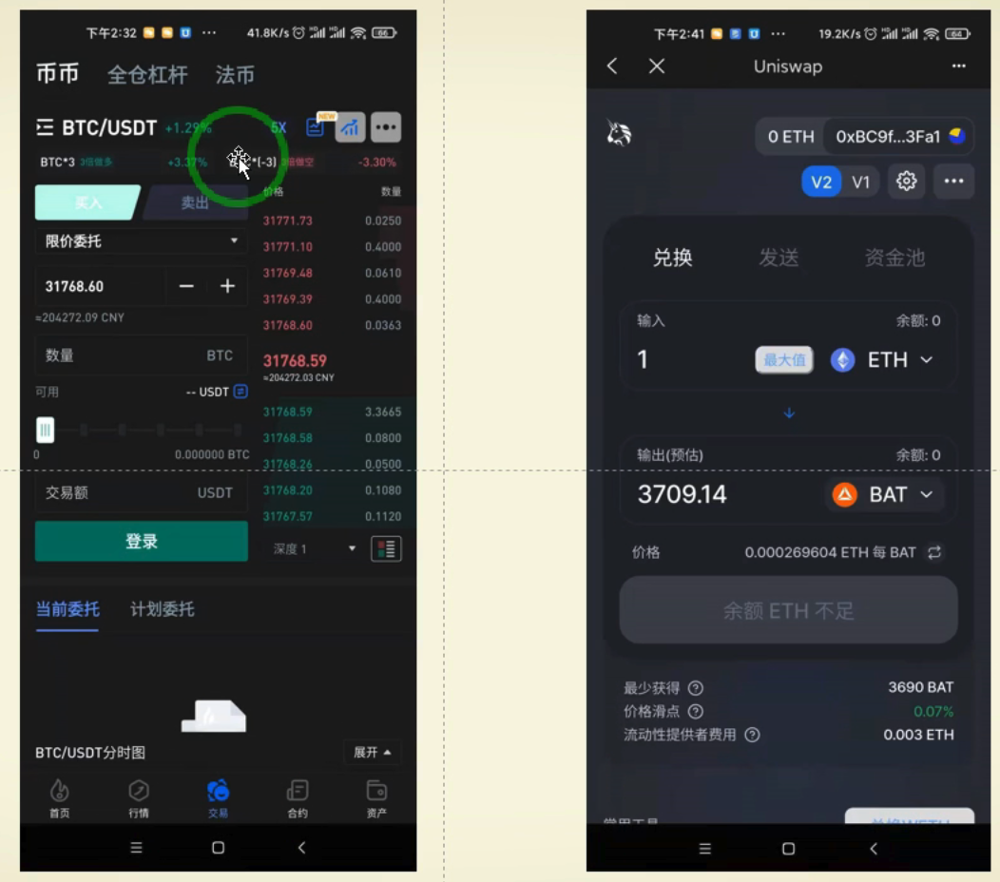

# 去中心化交易所
## 去中心化交易所与中心化交易所特点对比
名称|中心化交易所|去中心化交易所
---|---|---
特点|交易不上链，结算上链|交易和结算都上链
优点|体验好，行情即时|安全性好，隐私性强，手续费被流动性提供者拿走
缺点|安全性差,易插针,隐私性差,手续费被交易所拿走|体验差,行情不及时，交易损失大，手续费高

## AMM 自动市商 机制
- AMM 包含的角色
	- 流动性提供者
		- 提供流动性赚取流动性费用的用户 
	- 交易者
		- 通过流动性提供者提供流动性进行兑换的用户  
- 公式

		coin1 * coin2 = k
		
- 例	
	- 冲入流动性 
		- 流动性提供者必须提供两种币
		
				5eth :5000 usdt  =  5*5000=25000(常数k)
		- 对于流动性提供者创造的当前汇率
				
				1 eth = 1000 usdt
	- 兑换流动性			
		- 如换 1 个eth需要付出多少 usdt 
	 
				(4*？=25000)=(4*6250=25000)
		- 当前汇率
	
				1 eth = 1250 usdt
		- 所以想换 1 eth 的用户需要付出 1250 usdt 
	- 再次兑换流动性
		- 如再换 1 个eth 需要付出多少 usdt

				(3*?=25000)=(3*8333.3)=25000
		- 当前汇率
		
				1 eth = 2083 usdt
				
套利者发现其他交易所价格 1 eth 价格小于 2083 usdt，就会来回套利，到套利窗口结束。所以就会导致 eth 涨价 

## 流动性提供者的好处
- uniswap v2 交易手续费是 0.3%,手续费全部提供给流动性提供者。
	- 根据流动性资金总额(TVL)占比,收取手续费分成
- 还可以得到该项目的代币收益
	- 提供流动性项目代币收益为 (uniswap代币-UNI),等同于挖矿或另一名字叫流动性挖矿
	
## 滑点和无偿损失
### 什么是滑点
指单价格和实际成交价格之间的差价，主要针对交易者。因为每次交易都是获取当前最后一个区块的价格，因为区块链有堵塞，所以采用合约 nonce 排队，可能在你提交交易后，交易被合并到区块之前，有其他的人进行了交易，导致汇率变化，而滑点的意思就是你允许出现的汇率价差，价差内都可以成交。

- 例
	- 购买汇率提示
		
			1 eth:2000usdt
	- 滑点设置(一般参考其他交易所)，点击交易

			2200 usdt
	- 会出现2钟情况
		- 情况1

			在你之前没有人交易，所以你用 2000usdt 购买了1个 eth
		- 情况2

			在你之前有一个人交易，汇率升到了 2200 usdt ，所以你用 2200 usdt 购买了1个 eth
		- 情况3

			在你之前有一个人交易，汇率升到了 3000 usdt ,超出了你的滑点，这个过程你损失了交易费，交易失败？ - 需要测试
		- 情况4

			在你之前有一个人交易，但是汇率下降了1600 usdt ，所以你用了1600 购买了 1个 eth   - 需要测试		 
### 什么是无偿损失
无偿损失主要针对流动性提供者，当币价大幅度波动(单边上涨或者下跌)导致的 `账面损失`(不是实际损失，只有取出才是损失)

- 例子
	- 流动性提供

			(2eth:2000usdt)=(2*2000)=4000
	- 各种交易，汇率变成

			(1eth:4000 usdt)=(1*4000)=4000
	- 当前真实汇率涨价 

			1eth=2300 usdt 
	- 资产对比
		- 当前资产

				1*2300usdt+4000usdt=6300usdt 
		- 原资产

				2*2300usdt+2000usdt=6600usdt
		- 账面亏损，无偿损失

				300 usdt

	
	
	 		
		  
			
			
## 参考
- [去中心化交易所1](https://www.bilibili.com/video/BV1S64y1s7qp?spm_id_from=333.999.0.0)
- [去中心化交易所2](https://www.bilibili.com/video/BV1WX4y1c7Xc?spm_id_from=333.999.0.0)
- [去中心化交易所3](https://www.bilibili.com/video/BV1jo4y1S7AR?spm_id_from=333.999.0.0)