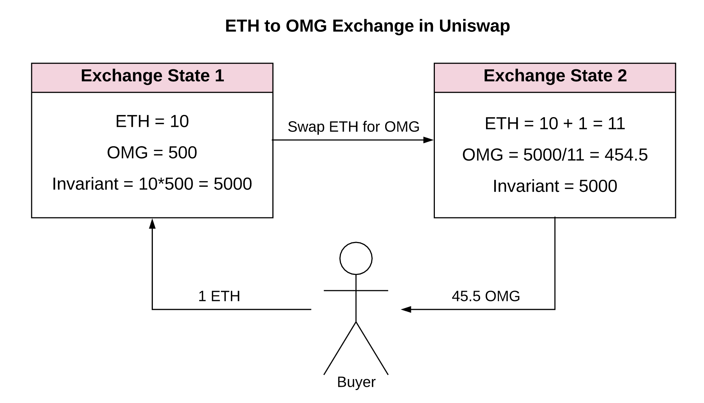
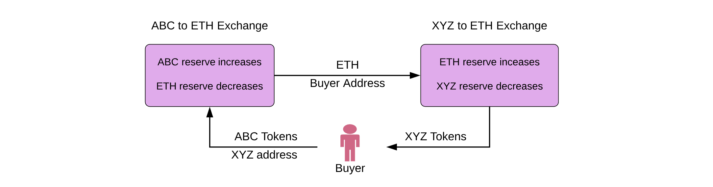
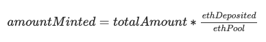
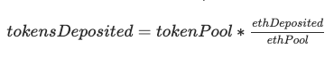
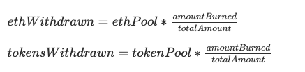

# uniswap 白皮书 v1
## 介绍
Uniswap 是一种在以太坊上进行自动 Token Exchange 的协议。它的设计围绕易用性、Gas 效率、审查阻力和零租金提取。其作为其他需要保证链上流动性的智能合约的组成部分，它对交易者的功能特别有用。

大多数交易所维护一个订单簿并促进买卖双方之间的匹配。Uniswap 智能合约持有各种Token的流动性储备，交易直接针对这些储备执行。价格是使用恒定乘积做市商机制自动设定的，该机制使整体储备保持相对平衡。储备金在流动性提供者网络之间汇集，这些提供者向系统提供 token，以换取一定比例的交易税收。

	x*y=k
Uniswap 的一个重要特性是使用工厂/注册合约，该合约为每个 ERC20 Token 部署单独的 Exchange 合约。这些 exchange 合约各自持有 ETH 储备和相关的 ERC20。这允许基于相对供应在两者之间进行交易。exchange 合约通过注册表链接，允许使用 ETH 作为中介的任何Token之间的直接 ERC20 到 ERC20 交易。

本文档概述了 Uniswap 的核心机制和技术细节。为了便于阅读，一些代码被简化了。省略了溢出检查和最低购买量等安全功能。完整的源代码可在 GitHub 上获得。

- 协议网站：

	[uniswap.io](uniswap.io)
- 文档：

	[docs.uniswap.io](docs.uniswap.io)
- 代码：

	[github.com/Uniswap](github.com/Uniswap)

- 形式化模型：

	https://github.com/runtimeverification/verified-smart-contracts/blob/uniswap/uniswap/xyk.pdf
	
## GAS 基准
Uniswap 因其简约的设计而非常 GAS 。对于 ETH 到 ERC20 的交易，它使用的 gas 比 Bancor 少近 10 倍。它可以比 0x 更有效地执行 ERC20 到 ERC20 的交易,并且与 EtherDelta 和 IDEX 等链上订单簿Exchange 相比，具有显着的 gas 减少。

### Gas 基准对比
- 直接 ERC20 Token 转移的成本基准

	直接转 ERC20 token GAS 为 36,000 gas - 比 Uniswap 上的 ETH 到 ERC20 交易低约 20%

Exchange|uniswap|etherDelta|Bancor|radar Relay(0x)|IDEX|Airswap
---|---|---|---|---|---|---	
ETH to ERC20|46000|[108,000](https://etherscan.io/tx/0xb0d4330872132a808381bc709069e233c6f69f0bd4c4a4b87e2d40142866a0c7)|[440,000](https://etherscan.io/tx/0x462a3ad9dd05ce18cb33412fde02ee8cfa782d69a9df85be97ac8216a5c8b422)|[113,000](https://etherscan.io/tx/0xe2ca9f47926e2b262cf9b060f735c5ebfda1a4edd55af236d95b274c75be5449)|[143,000](https://etherscan.io/tx/0xe2ca9f47926e2b262cf9b060f735c5ebfda1a4edd55af236d95b274c75be5449)|[90,000](https://etherscan.io/tx/0xccc10f160bde7779a35cda22f5d67532d0a4beaf76c9296f3d645ff1edf424ec)
ERC20 to ETH|60,000|[93,000](https://etherscan.io/tx/0xc06aeb2b6794271c978b2d41b16ba0e75f80f55ab9160b21212d0d4eb918f6e1)|[403,000](https://etherscan.io/tx/0x550961cbe81995c2300550b75654c75fb112fa5ba4a20ab7af1c02ed218af8e1)|[113,000](https://etherscan.io/tx/0xe2ca9f47926e2b262cf9b060f735c5ebfda1a4edd55af236d95b274c75be5449)|[143,000](https://etherscan.io/tx/0xe2ca9f47926e2b262cf9b060f735c5ebfda1a4edd55af236d95b274c75be5449)|[120,000](https://etherscan.io/tx/0xf4576e9cd6a598b50e8dec2c248049fa5cdc40d5994d185da70447d671094734)
ERC20 to ERC20|88,000|不支持|[538,000](https://etherscan.io/tx/0x4f0595d122a2202022960d8c89773de206f4e4ab4da26336b68f1993691334b2)|[113,000](https://etherscan.io/tx/0xe2ca9f47926e2b262cf9b060f735c5ebfda1a4edd55af236d95b274c75be5449)|不支持|不支持

## 创建 exchange
[uniswap_factory.vy](https://github.com/Uniswap/contracts-vyper/blob/master/contracts/uniswap_factory.vy) 是一个智能合约，既可以作为 Uniswap exchange 合约工厂也可以作为注册中心。公共功能 `createExchange()` 允许任何以太坊用户为尚未拥有的任何 ERC20 部署Exchange合约。

	exchangeTemplate: public(address)
	token_to_exchange: address[address]
	exchange_to_token: address[address]
	    
	@public
	def __init__(template: address):
	    self.exchangeTemplate = template
	
	@public
	def createExchange(token: address) -> address:
	    assert self.token_to_exchange[token] == ZERO_ADDRESS
	    new_exchange: address = create_with_code_of(self.exchangeTemplate)
	    self.token_to_exchange[token] = new_exchange
	    self.exchange_to_token[new_exchange] = token
	    return new_exchange
所有 Token 及其相关交易的记录都存储在工厂中。使用 Token 或 Exchange 地址，功能 `getExchange()` 和 `getToken()` 可用于查找另一个

	@public
	@constant
	def getExchange(token: address) -> address:
	    return self.token_to_exchange[token]
	
	@public
	@constant
	def getToken(exchange: address) -> address:
	    return self.exchange_to_token[exchange]
工厂在启动 Exchange 合约时不会对 Token 进行任何检查，除了强制执行每个 Token 一个 Exchange 的限制。用户和前端应该只与他们信任的 Token 相关的 exchange 合约进行交互
## ETH ⇄ ERC20 交易
每个 exchange 合约(`uniswaap_exchange .vy`)与单个 ERC20 Token相关联并持有 ETH 和该 Token 的流动性池。ETH 和 ERC20 之间的汇率是基于合约内流动性池的相对规模。这可以通过维护关系 `eth_pool * token_pool = invariant` 来实现。这个不变量在交易中保持不变，只有在市场增加或减少流动性时才会发生变化。

一个简化版的 `ethToTokenSwap()` ,ETH 转换为 ERC20 Token的功能如下图所示：

	eth_pool: uint256         
	token_pool: uint256       
	token: address(ERC20) 
	
	@public
	@payable
	def ethToTokenSwap():
	    fee: uint256 = msg.value / 500 
	    invariant: uint256 = self.eth_pool * self.token_pool
	    new_eth_pool: uint256 = self.eth_pool + msg.value
	    new_token_pool: uint256 = invariant / (new_eth_pool - fee)
	    tokens_out: uint256 = self.token_pool - new_token_pool
	    self.eth_pool = new_eth_pool
	    self.token_pool = new_token_pool
	    self.token.transfer(msg.sender, tokens_out)	    

注意: 对于 GAS 效率，`eth_pool` 和 `token_pool` 不是存储变量。他们被发现利用 `self.balance ` 并通过外部调用 `self.token. balanceof (self)`

当 ETH 被发送到函数时 `eth_pool` 增加。为了维持关系 `eth_pool * token_pool = invariant`，`token pool` 按比例减少。减少的 `token_pool` 数量是购买的Token数量。准备金率的这种变化将 ETH 转换为 ERC20 汇率，从而激励了相反方向的交易。

使用以下功能将 Token 兑换为 `ETH tokenToEthSwap()`

	@public
	def tokenToEthSwap(tokens_in: uint256):
	    fee: uint256 = tokens_in / 500
	    invariant: uint256 = self.eth_pool * self.token_pool
	    new_token_pool: uint256 = self.token_pool + tokens_in
	    new_eth_pool: uint256 = self.invariant / (new_token_pool - fee)
	    eth_out: uint256 = self.eth_pool - new_eth_pool
	    self.eth_pool = new_eth_pool
	    self.token_pool = new_token_pool
	    self.token.transferFrom(msg.sender, self, tokens_out)
	    send(msg.sender, eth_out)	    

这增加 `token_pool` 和减少 `eth_pool`，使价格向相反方向移动。下面显示了一个 ETH 到 OMG 购买的示例

### 示例：ETH → OMG
	注意： 此示例使用 0.25% 的税收。真正的 Uniswap 合约的税收为 0.3%。

- 初始化

	10 ETH 和 500 OMG (ERC20) 由​​流动性提供者存入智能合约。自动设置一个不变量，使得 `ETH_pool * OMG_pool = invariant`.
	
		ETH_pool = 10
		OMG_pool = 500
		invariant = 10 * 500 = 5000
- OMG 买家使用 1 ETH 购买 OMG

	OMG 买家向合约发送 1 ETH。为流动性提供者收取 0.25% 的税收，剩余的 0.9975 ETH 添加到 `ETH_pool`. 接下来，不变量除以流动性池中新的 ETH 数量，以确定的新大小 `OMG_pool`。剩余的 OMG 将发送给买方。

		Buyer sends: 1 ETH
		Fee = 1 ETH/500 = 0.0025 ETH
		ETH_pool = 10 + 1 - 0.0025 = 10.9975
		OMG_pool = 5000/10.9975 = 454.65
		Buyer receieves: 500 - 454.65 = 45.35 OMG
	该税收现在重新添加到流动性池中，作为对流动性提供者的支付，当流动性从市场中移除时收取。由于税收是在价格计算后添加的，因此每笔交易的不变量都会略有增加，从而使系统对流动性提供者有利可图。事实上，不变量真正代表的是 `ETH_pool * OMG_pool` 上一笔交易的结束。
	
		ETH_pool = 10.9975 + 0.0025 = 11
		OMG_pool = 454.65
		new invariant = 11 * 454.65 = 5,001.15		
- OMG 买家第二次购买，使用 1 ETH 购买 OMG

	在这种情况下，买方收到的汇率为 45.35 OMG/ETH。然而，价格发生了变化。如果另一个买家在同一方向进行交易，他们将获得稍差的 OMG/ETH 汇率。但是，如果买家以相反的方向进行交易，他们将获得稍高的 ETH/OMG 汇率
		
		1 ETH in
		44.5 OMG out
		Rate = 45.35 OMG/ETH
	相对于流动性池的总规模较大的购买将导致价格滑点。在活跃的市场中，套利将确保价格不会与其他 exchange 合约的价格相差太大。	
	

## ERC20 ⇄ ERC20 交易
由于 ETH 被用作所有 ERC20 Token的通用对，它可以用作直接 ERC20 到 ERC20 Exchange 的中介。例如，可以在一次交易中从 OMG 转换为 ETH，然后在另一次交易中从 ETH 转换为 KNC。

为了从 OMG 转换为 KNC（例如），买家调用 `tokenToTokenSwap()` OMG Exchange 合约上的函数

	contract Factory():
	    def getExchange(token_addr: address) -> address: constant
	
	contract Exchange():
	    def ethToTokenTransfer(recipent: address) -> bool: modifying
	    
	factory: Factory
	    
	@public
	def tokenToTokenSwap(token_addr: address, tokens_sold: uint256): # token_addr` 是 KNC Token的地址 ，`tokens_sold` 是出售的 OMG 数量
	    #先检查工厂以检索 KNC Exchange地址
	    exchange: address = self.factory.getExchange(token_addr) 
	    # 税率
	    fee: uint256 = tokens_sold/500 
	    # 交易将所输入的 OMG 转为 ETH
	    invariant: uint256 = self.eth_pool * self.token_pool
	    new_token_pool: uint256 = self.token_pool + tokens_sold
	    new_eth_pool: uint256 = invariant / (new_token_pool - fee)
	    eth_out: uint256 = self.eth_pool - new_eth_pool
	    self.eth_pool = new_eth_pool
	    self.token_pool = new_token_pool
	    # 该函数并没有将购买的 ETH 返还给买方，而是调用 KNC exchange 合约上的支付函数 `ethToTokenTransfer` ：
	    Exchange(exchange).ethToTokenTransfer(msg.sender, value=eth_out)
`ethToTokenTransfer` 
函数如下

	@public
	@payable
	def ethToTokenTransfer(recipent: address): # ethToTokenTransfer()收到 ETH 和买家地址，验证调用是从注册表中的 exchange 合约发出的，将 ETH 转换为 KNC，并将 KNC 转发给原始买家
	    #税率	
	    fee: uint256 = msg.value / 500
	    invariant: uint256 = self.eth_pool * self.token_pool
	    new_eth_pool: uint256 = self.eth_pool + msg.value
	    new_token_pool: uint256 = invariant / (new_eth_pool - fee)
	    tokens_out: uint256 = self.token_pool - new_token_pool
	    self.eth_pool = new_eth_pool
	    self.token_pool = new_token_pool
	    self.invariant = new_eth_pool * new_token_pool
	    self.token.transfer(recipent, tokens_out)
`ethToTokenTransfer()` 与 `ethtotokenswwap()` 函数是相同的,但具有附加输入参数 `recipient: address`，这用于将购买的 Token 转发给原始买家，而不使用 `msg.sender` 情况下进行 OMG 交换

	    				
### 交换(Swaps)对比交易(Transfers)方法
- 交换

	`ethToTokenSwap()`、`tokenToEthSwap()` 和 `tokenToTokenSwap()` 函数将购买的 Token 返回到买家地址。
- 交易

	`ethToTokenTransfer()`、`tokenToEthTransfer()` 和 `tokenToTokenTransfer()` 允许买家进行交易，然后立即将购买的 token 转移到收件人地址

## 提供流动性
### 增加流动性
增加流动性需要将等值的 ETH 和 ERC20 Token存入 ERC20 Token的相关交易合约中。

第一个加入池的流动性提供者通过存入他们认为是等值的 ETH 和 ERC20 Token 来设定初始汇率。如果该比率关闭，套利交易者将以牺牲初始流动性提供者为代价使价格达到平衡。

所有未来的流动性提供者都使用他们存入时的汇率存入 ETH 和 ERC20。如果汇率不好，就会有一个有利可图的套利机会来修正价格。
#### 流动性Token
铸造流动性Token是为了跟踪每个流动性提供者贡献的总储备的相对比例。它们是高度可分割的，可以随时销毁以将市场流动性的比例份额返还给提供者。

流动性提供者调用 `addLiquidity()` 函数来存入储备金并铸造新的流动性Token：

	@public
	@payable
	def addLiquidity():
	    token_amount: uint256 = msg.value * token_pool / eth_pool 
	    liquidity_minted: uint256 = msg.value * total_liquidity / eth_pool
	        
	        
	    eth_added: uint256 = msg.value
	    shares_minted: uint256 = (eth_added * self.total_shares) / self.eth_pool
	    tokens_added: uint256 = (shares_minted * self.token_pool) / self.total_shares)
	    self.shares[msg.sender] = self.shares[msg.sender] + shares_minted
	    self.total_shares = self.total_shares + shares_minted
	    self.eth_pool = self.eth_pool + eth_added
	    self.token_pool = self.token_pool + tokens_added
	    self.token.transferFrom(msg.sender, self, tokens_added)
	
铸造的流动性Token数量由发送到该函数的 ETH 数量决定。可以使用以下等式计算

将 ETH 存入储备也需要存入等值的 ERC20 Token。这是用以下等式计算的

### 消除流动性
提供者可以随时销毁其流动性Token以从池中提取其比例份额的 ETH 和 ERC20 Token。
	    

ETH 和 ERC20 Token 按当前汇率（准备金率）提取而不是其原始投资的比例。这意味着市场波动和套利可能会损失一些价值。

交易期间收取的税收会添加到总流动性池中而不会产生新的流动性 Token。因此，`ethWithdrawn` 和 `tokensWithdrawn`包括自首次添加流动性以来收取的所有税收的比例份额。
### 流动性 Token 
Uniswap 流动性 Token 代表流动性提供者对 ETH-ERC20 对的贡献。它们本身就是 ERC20 Token 并包含 [EIP-20](https://github.com/ethereum/EIPs/blob/master/EIPS/eip-20.md) 的完整实现。

这允许流动性提供者出售他们的流动性 token 或在账户之间转移它们而无需从池中移除流动性。流动性 token 特定于单个 ETH⇄ERC20 exchange 合约。该项目没有单一的统一 ERC20 Token。

## 税收结构
- ETH 和 ERC20 互换

	在 ETH 和 ERC20 Token之间进行 Exchange 需要 0.3% 的税收。该税收由流动性提供者按其对流动性储备的贡献比例分配。
	
	- ETH 到 ERC20 交易
	
		以 ETH 支付的 0.3% 税收
	- ERC20 到 ETH 交易
	
		以 ERC20 token 支付 0.3% 的税收
- ERC20 到 ERC20 交易

	由于 ERC20 到 ERC20 的交易包括 : ERC20 到 ETH 和 ETH 到 ERC20 两次交易
	
	因此两个 exchange 合约都需要支付税收，没有平台税收。税收如下
	
	- 在 ERC20 token 中支付 0.3% 的税收，用于在输入交易中进行 ERC20 到 ETH 交换
	- 以 ETH 支付 0.3% 的税收，用于 ETH 到 ERC20 的输出交换
	
	输入 ERC20 的有效税收为 0.5991%

交换税收立即存入流动性储备。由于总储备增加而不添加任何额外的 token 份额 ，这会平均增加所有 token 份额的价值。这可以作为对流动性提供者的支付，可以通过销毁 token 份额来收集。

由于税收被添加到流动资金池中，因此在每笔交易结束时不变量都会增加。在单个事务中，不变变量代表上一个事务结束时的 `eth_pool * token_pool`。

## 自定义池
### ERC20 兑换
附加功能 `tokenToExchangeSwap()`  和  `tokenToExchangeTransfer()` 增加了 Uniswap 的灵活性。这些函数将 ERC20 Token转换为 ETH，并尝试通过 `ethToTokenTransfer()` 访问用户输入的地址。这允许 ERC20 到 ERC20 与来自不同工厂的自定义 Uniswap exchange 合约进行交易，只要它们实现正确的接口。

自定义 exchange 合约可以有不同的曲线、管理、私人流动资金池、基于 FOMO 的庞氏骗局或者你能想到的任何其他东西。
### 选择升级
升级抗审查在去中心化的智能合约很困难。希望 `Uniswap 1.0` 是完美的，但可能不是。如果创建了改进的 `Uniswap 2.0` 设计则可以部署新的工厂合约。流动性提供者可以选择迁移到新系统或留在旧系统。

这些 `tokenToExchange` 功能可以与从不同工厂启动的 exchange 合约进行交易。这可用于向后兼容。ERC20 到 ERC20 的交易将可以在同时使用 `tokenToToken` 和`tokenToExchange` 功能的版本中进行。但是，只有跨版本才能 `tokenToExchange` 工作。所有升级都是可选的并且向后兼容。
#### 功能预览
Uniswap 在某种程度上可以领先。这受用户设置的最小/最大值和交易截止日期的限制

## 参考
[uniswap 白皮书](https://hackmd.io/@HaydenAdams/HJ9jLsfTz?type=view#Introduction)