# Uniswap V2 核心架构白皮书
## 概括
本技术白皮书解释了 Uniswap v2 核心合约背后的一些设计逻辑。它涵盖了合约的新功能——包括 

- ERC20 之间的任何配对，增强的价格预测
- 允许其他合约估计给定区间内的时间加权平均价格，“闪电互换”
- 允许交易者接收资产并使用它们在其他地方，然后在未来的交易中支付以及未来可以开通的协议费用。
- 它还重组了合约以减少其攻击面。

本白皮书介绍 Uniswap v2 的“核心”合约机制，包括存储流动性提供者资金的匹配合约，以及实例化匹配合约的工厂合约。

## 介绍
Uniswap v1 是以太坊区块链上的智能合约链上系统，它实现了基于 “恒定乘积公式”[1]  的自动流动性协议。每个 Uniswap v1 交易对将存储两种资产的集合储备金，并为这两种资产提供流动性，保持储备金乘积不能减少的特点。交易者在交易中支付 0.3% 的费用，这笔费用归流动性提供者所有。这些合约无法升级。

Uniswap v2 也是基于 “恒定产品做市商” 机制，增加了一些新功能，并具有一些新的非常可取的特性。最重要的是它可以创建任何 ERC20/ERC20 对，而不是只支持 ERC20 和 ETH 之间的配对。它还提供了一个强化的价格预测，在每个区块开始时累积两种资产的相对价格。这允许以太坊上的其他合约在任何时间间隔内估计两种资产的时间加权平均价格。最后，可以实现闪电交换（闪电贷），用户可以自由地接收资产，在链上其他地方使用，交易结束才支付（或归还）这些资产。

虽然合约一般不能升级，但是有一个私钥可以更新工厂合约中的一个变量，将交易链打开 0.05%。该费用最初是关闭的，但可以在未来打开，之后流动性提供者将在每笔交易中赚取 0.25%，而不是 0.3%。

如第 3 节所述，Uniswap v2 还修复了 Uniswap v1 的一些小问题，并重组了实施方法，以减少 Uniswap 的攻击面并最大限度地减少持有流动性提供者资金的“核心”合约数量。该逻辑使系统更易于升级。

本文介绍了核心合约的机制以及用于实例化这些合约的工厂合约。事实上，使用 Uniswap v2 需要一个路由合约调用匹配合约，由它计算交易或存款金额并将资金转移到匹配合约。
## 新功能
### 2.1 ERC20/ERC20 Token 对
Uniswap v1 使用 ETH 作为中间token。每个token对都将 ETH 作为其资产之一。这使得路由更容易——`ABC` 和 `XYZ` 之间的每一笔交易都必须经过 `ETH/ABC `对和 `ETH/XYZ` 对，减少流动性的分散。

然而这条规则给流动性提供者带来了巨大的成本。所有流动性提供者都面临 ETH 的风险并根据其他资产相对于 ETH 的价格变化而遭受无常损失。当 ABC 和 XYZ 两种资产相关时——例如，如果它们都是美元稳定币，那么在 Uniswap 中，`ABC/XYZ` Token对的流动性提供者通常比 `ABC/ETH` 或 `XYZ/ETH` Token对更好，遭受的损失更少无常损失。

使用 ETH 作为强制性中介token也会给交易者带来成本。交易者需要支付两倍于直接使用 ABC/XYZ token对（也称为交易对，或Token对）的费用，并且他们必须遭受两倍的滑点。

Uniswap v2 允许流动性提供者为任意两个 ERC-20 创建匹配合约,任何 ERC-20 之间交易对的激增可能会使找到交易特定交易对的最佳路径有点困难，但可以在更高级别处理路由（链外或通过链上路由器或聚合器） .
### 2.2 价格预测
Uniswap 在时间 t 提供的边际价格（不包括费用）可以通过资产 a 的储备金除以资产 b 的储备金来计算

因为当价格不正确时套利者会与 Uniswap 交易（有足够的金额来支付成本），如 Angeris 等人所示。[2] Uniswap 提供的价格倾向于跟随资产价格的相对市场。这意味着它可以用作近似的价格预测。

然而，Uniswap v1 作为链上价格预测并不安全，因为它很容易操纵。假设有其他合约使用当前的 ETH-DAI 价格来结算衍生品。想要操纵预估价格的攻击者可以从 ETH-DAI 对中购买 ETH，触发衍生品合约的结算（使其基于虚高的价格进行结算），然后将 ETH 卖回给该对，返回其交易到实际价格。这甚至可以以原子交易的形式完成或者矿工控制区块内交易的顺序。

Uniswap v2 通过在第一个交易之前（或在与前一个区块等价的最后一笔交易之后）测量和记录每个区块的价格来改进这个预测功能。这个价格比一个区块的价格更难操纵。如果攻击者提交交易以试图在区块结束时操纵价格，则其他一些套利者可能会在同一区块中提交另一笔交易，然后再提交另一笔交易。矿工（或使用足够燃料填满整个区块的攻击者）可以在一个区块结束时操纵价格，但除非他们也在下一个区块挖矿，否则他们在套利交易 注 [1.1] 中可能没有特殊优势。
    
具体来说，Uniswap v2 通过在每个区块开始时有人与合约交互时跟踪价格的累积总和来累积此价格。根据区块时间戳 注 [1.2]，每个价格将根据自上一个区块更新以来的时间量进行加权。这意味着在任何给定时间（更新后）的累积值应该是合约历史中每秒现货价格的总和。

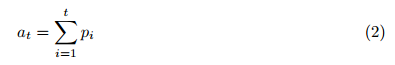

要估计从时间 t1 到 t2 的时间加权平均价格，外部调用者可以检查 t1 和 t2 的积分累加器的值，然后再次检查积分累加器的值，从第二个值中减去第一个值，然后除以经过的秒数。（注意合约本身并不存储这个累加器的历史值——调用者必须在期初调用合约来读取并存储这个值。）

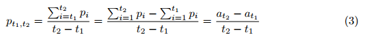

预言机的用户可以选择何时开始和结束这段时间。选择更长的周期会导致价格不那么最新，但攻击者操纵 TWAP 的成本会更高。

- 一个复杂的问题是：

	我们应该用资产 B 来衡量资产 A 的价格，还是用资产 A 来衡量资产 B 的价格？虽然以 B 为单位的 A 现货价格始终是以 A 为单位的 B 现货价格的倒数，但在特定时期内以 B 为单位的资产 A 的平均价格并不等于以 A 为单位的资产 B 的平均价格，平均价格的倒数是 注 [1.3]。

	例如
	
	- 如果区块 1 的 USD/ETH 价格为 100
	- 区块 2 的 USD/ETH 价格为 300

	那么 USD/ETH 的平均价格将为 200 USD/ETH，但 ETH/USD 的平均价格将为 1/150 ETH/USD。
	
	由于合约无法知道用户想要使用这两种资产中的哪一种作为记账单位，Uniswap v2 将跟踪这两种价格。
    
- 另一个复杂因素是

	有人可能在不与合约交互的情况下将资产发送到匹配合约——从而改变其余额和边际价格，以免触发预测的更新。如果合约只是检查其余额并根据当前价格更新预测，则攻击者可以通过在区块中第一次调用合约之前立即将资产发送到合约来操纵预测。如果最后一笔交易是在 X 秒前在一个带有时间戳的区块中进行的，那么合约会在累积新价格之前错误地将其乘以 X，即使没有人有机会以该价格进行交易。为了防止这种情况发生，核心合约在每次交互后缓存其储备金，并使用从缓存储备金中得出的价格而不是当前储备来更新预测。除了保护预言不受操纵外，这一变化还可以实现下文第 3.2 节中描述的合约重组。

### 2.2.1 准确性
由于 Solidity 不提供对非整数数值数据类型的支持，Uniswap v2 使用简单的二进制定点格式来编码和处理价格。具体来说，将给定时刻的价格存储金为一个 `UQ112.112` 数字，这意味着在小数点两边指定了 112 位的精度并且没有符号。这些数字的范围是 `[0,2^112-1]` 注 [1.4]，精度是 `1/2^112`。

选择 `UQ112.112` 格式是出于实际原因——因为这些数字可以存储在 `uint224` 中，从而释放 256 位存储槽的 32 位。还碰巧存储在 `uint112` 中的每个保留区也会在（打包的）256 位存储槽中留下 32 位可用空间。这些空闲空间用于上述的累积过程。具体来说，储备金与最近至少有一笔交易的区块的时间戳一起存储，并用 `2^32` 修改以使其适合 32 位。此外，虽然保证任何给定时刻的价格（存储为 `UQ112.112` 数字）适合 224 位，但该价格在一个区间内的累积是不合适的。`A/B` 和 `B/A` 累计价格存储槽末尾的额外32位用于存储重复加价导致的溢出位。这种设计意味着价格预测只在每个区块的第一笔交易中增加了三个 SSTORE 操作（目前成本约为 15000 gas）。

主要缺点是 32 位不足以存储合理永远不会溢出的时间戳值。事实上，Unix 时间戳溢出了一个 uint32 日期，即 `02/07/2106`。为了保证系统在这个日期之后以及之后的每 `2^32 -1` 秒的倍数继续正常运行，只有预言机需要每隔一定的时间（大约 136 年）至少检查一次价格。这是因为核心累积方法（和修改时间戳）实际上是溢出安全的，这意味着可以正确计算跨越溢出间隔的事务，因为 Oracle 使用适当的（简单）溢出算法来计算增加量。
### 2.3 闪电贷
在 Uniswap v1 中，用户使用 `XYZ` 购买 `ABC` 时，需要先将 `XYZ` 发送到合约中，才能收到 `ABC`。如果用户需要他们购买的 `ABC` 来获得他们支付的 `XYZ`，这很不方便。

例如,用户可以使用 `ABC` 购买其他合约中的 `XYZ`，以套利与 Uniswap 的差价或者他们可以出售抵押品来偿还 Uniswap 以清算 Maker 或 Compound。

Uniswap v2 增加了一项新功能，允许用户在支付之前接收和使用资产，只要他们在同一个原子交易中支付。交换函数在用户请求的Token转移和不变性执行之间调用用户指定的可选回调合约。一旦回调完成，合约将检查新余额并确认满足不变性（在调整支付金额的费用后）。如果合约没有足够的资金，整个交易将被恢复。

用户也可以使用相同的 Token 来偿还 Uniswap 矿池，而不是完成兑换。这实际上相当于允许任何人闪借存储在 Uniswap 池中的任何资产（与 Uniswap 对交易收取 0.30% 的费用相同）注 [1.5]	
### 2.4 协议费用
Uniswap v2 包含 0.05% 的协议费用，可以开启或关闭。如果启用，费用将发送到工厂合约中指定的 `feeTo` 费用地址。

初始不设置 `FeeTo`，不收取任何费用。对于预先指定的 `feeToSetter` 地址，您可以调用 Uniswap v2 工厂合约上的 `setFeeTo` 函数将 `feeTo` 设置为不同的值。`FeeToSette`r 也可以调用 `setFeeToSetter` 来更改`feeToSetter` 地址本身

如果设置了 `feeTo` 地址，协议将开始收取 0.05% 的费用，从流动性提供者赚取的 0.3% 费用的 1/6 中扣除。换句话说，交易者将继续为所有交易支付 0.3% 的费用：

- 83.3% 的费用（0.3% 费用的 5/6 返还给 LP
- 剩余的 16.6%（0.3% 的 1/6 的费用)  给费用帐户。

如果在交易时收取 0.05% 的费用，会给每笔交易带来额外的燃料成本。为避免这种情况，只会在存入或提取流动资金时收取累积费用。合约计算累积成本，并在任何Token被铸造或销毁之前立即将新的流动性Token（LP Token，命名为 UNI V2）铸造到相应的 LP 和 feeTo 账户中。

自上次收取费用以来，收取的费用总额可以通过测量 `√K`（即  `√(x∙y)`）注 [1.6] 的增长来计算。这个公式给出了 `t1` 和` t2` 之间的累积成本占 `t2` 时池中流动性的百分比。

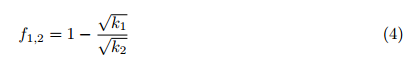
如果在 `t1` 之前激活费用，`feeTo` 地址应该捕获 `t1` 和 `t2` 之间累积费用的 `1/6`。因此，我们需要铸造新的流动性Token到 `feeTo` 地址，其在池中的比例为`φ∙f_1,2`，其中 `φ=1/6`。

换句话说，我们必须选择 `s_m` 以满足以下关系，其中` s_1 `是时间 `t_1` 的流通股总数。

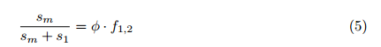
将 `1-√(k_1 )/√(k_2) = f_1,2` 代入式(5)，可得

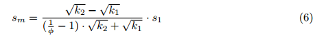
当 φ=1/6 时，得到

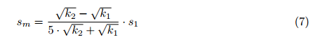

假设初始存款人将 100 DAI 和 1 ETH 放入一个token对并获得 10 股。一段时间后（没有任何其他存款人参与该token对），他们试图提取该token对。此时，该token对有 96 个 DAI 和 1.5 个 ETH。将这些值代入上式，我们得到如下结果。

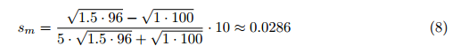

### 2.5 池份额的元交易
Uniswap v2 原生支持池份额的元交易，这意味着用户可以通过签名授权转移他们的池份额，而不是从他们的地址(注 [1.7])执行链上交易。任何人都可以通过调用权限函数代表用户提交此签名，支付 gas，并可能在同一交易中执行其他操作。
## 3. 其他
### 3.1 坚固性
Uniswap v1 在 Vyper 中实现，Vyper 是一种类似于 Python 的智能合约语言。Uniswap v2 是在使用更广泛的 Solidity 中实现的，因为它需要一些 Vyper 中尚不具备的功能（例如能够解释非标准 ERC-20 Token的返回值，以及通过内联汇编访问新的操作码，比如 chainid）。
### 3.2 新合约结构
Uniswap v2 的设计重点是最小化核心匹配合约的外部接口和复杂性，该合约存储流动性提供者的资产。合约中的任何错误都可能是灾难性的，因为数百万美元的流动性可能被盗或冻结。

在评估这个核心合约的安全性时，最重要的问题是它能否保护流动性提供者的资产不被盗或被锁定。任何旨在支持或保护交易者的功能——除了允许将池中的一种资产交换为另一种资产的基本功能之外，都可以在路由合约中处理。

实际上，甚至可以将部分交换功能拉入路由合约中。如上所述，Uniswap v2 存储每个资产的最后记录余额（以防止对预测机制的特殊操纵使用）。新架构使用这个存储标签来进一步简化 Uniswap v1 合约。

在 Uniswap v2 中，卖方在调用交换功能之前将资产发送到核心合约。然后，合约通过将最后记录的余额与当前余额进行比较来衡量它收到了多少资产。这意味着核心合约与交易者转移资产的方式无关。代替 `transferFrom()`，它可以是元交易或任何其他机制来授权未来 ERC-20 的转移。
#### 3.2.1 费用调整
Uniswap v1 的交易费用是在执行恒定乘积做市商之前将支付给合约的金额减少 0.3%。合约隐含地实现了以下公式：

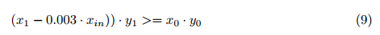
为了快速兑换，Uniswap v2 考虑了 `x_in` 和 `y_in` 可能都为非零的可能性（当用户想要使用相同的资产来偿还这对资产，而不是兑换）。为了处理这种情况并同时正确应用费用，合约的编写强制执行以下不等式 注 [1.8]：

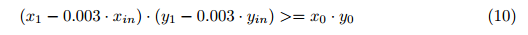
为了简化这条链上的计算，我们可以将不等式的每一边乘以 1,000,000。

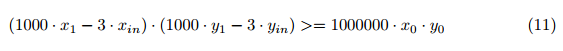
#### 3.2.2 `sync()` 和 `skim()`
为了防止自定义Token实现无法更新配对合约的余额，以及更优雅地处理总供应量可能大于 2^112 的Token，Uniswap v2 有两个保证函数：

- `sync()` 

	当Token异步减少事务对的余额时，`sync()` 起到恢复机制的作用。在这种情况下，交易将获得次优利率，如果没有流动性提供者愿意纠正这种情况，token对就会被卡住。`sync()` 的存在是将合约的储备金设置为当前余额，并为这种情况提供一定程度的松散恢复。
- `skim()` 
    
    `skim()` 的功能是作为一种恢复机制。当向一个token对发送足够多的Token时，两个 uint112 存储槽的储备就会溢出，否则交易会失败。如果当前余额与 2^112-1 之间的差值大于 0，则 `shim()` 函数允许用户将差值提供给调用者。

### 3.3 处理非标准或异常Token
ERC-20 标准要求 `transfer()` 和 `transferFrom()` 返回一个布尔值，指示调用成功或失败 [4]。这些功能中的一项或两项在某些Token上实现，包括流行的Token，如 `Tether (USDT)` 和 `Binance Coin (BNB)`，但它们没有返回值。

- Uniswap v1 
	- Uniswap v1 将这些未正确定义的函数的缺失返回值解释为 false：表示转账不成功，恢复交易，导致尝试转账失败。
	- Uniswap v1 还假设调用 `transfer()` 和 `transferFrom()` 不会触发对 Uniswap 合约的可重入调用。这一假设受到某些 ERC-20 Token的攻击，包括支持 ERC-777 [5] 的“钩子”。
- Uniswap v2
	- 以不同的方式处理非标准Token。具体来说，如果 `transfer()` 调用没有返回值 注 [1.9]，Uniswap v2 会将其解释为成功而不是失败。此更改不应影响任何标准 ERC-20 Token（因为 `transfer()` 在这些Token中始终具有返回值）。
	- 为了全面支持此类Token，Uniswap v2 包含一个“锁”，直接阻止所有公共状态更改功能的重新进入。如第 2.3 节所述，这还可以防止用户指定的回调在闪贷中重新进入。

### 3.4 初始化流动性Token总量
当新的流动性提供者将Token存入现有的 Uniswap 交易对时，将根据现有Token的数量计算铸造的流动性Token（LP Token）的数量。

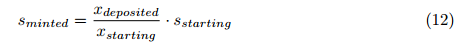
但如果他们是第一批存款人呢？在这种情况下，`x_starting` 为 0，因此不会使用公式 (12)。

- Uniswap v1 

	将初始份额供应设置为存入的 ETH 数量（以 wei 为单位）。这是一个合理的值，因为如果初始流动性以正确的价格存入，那么 1 个流动性池份额的 LP Token（与 ETH 一样，是 18 位精度的Token）价值约 2 个 ETH。

	但是，这意味着流动性池份额的价值取决于最初存入流动性的比率，这是相当随意的，特别是因为不能保证该比率反映真实价格。
- Uniswap v2	
	
	Uniswap v2 支持任何Token对，所以很多Token对根本不会包含 ETH。改进的方法是 Uniswap v2 最初发行的 LP Token 总量为 `√K`（每个 `TokenA/TokenB` 流动性池都有自己的 LP Token，相互独立。如果有3个流动性池，则对应3个一种 LP Token，虽然它们的符号名称都叫 `UNI-V2`)，但它是资金池中token对 `x∙y` 的几何平均值
	
	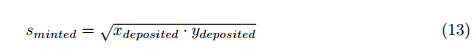
	
	这个公式保证了流动性池份额 `√K`，并且任何时候的价值基本独立于流动资金初始存入的比例。
	
	- 例

		假设 1 ABC 的价格当前是 100 XYZ。如果初始存款为 2 ABC 和 200 XYZ（比例为 1:100），则存款人将获得 `√(2∙200)=20 股 LP Token`。现在这些 LP Token 股份的价值应该仍然是 2 ABC 和 200 XYZ，加上累计费用。
    
		如果初始存款为 2ABC 和 800XYZ（比例为1:400），则存款人将获得 `√(2∙800)=40股LP token` 注 [1.10]。
 	
 	上述公式保证了流动性池中份额的价值永远不会低于池中准备金的几何平均值。然而，流动性池份额的价值可能会随着时间的推移而增长，无论是通过累积交易费用还是通过“捐赠”到流动性池。理论上，这可能会导致流动性池中的最小股票数量（池中的 `1e-18` 股）价值如此之高，以至于小型流动性提供者无法提供任何流动性。

	为了缓解这个问题，Uniswap v2 在创建Token配对时会燃烧 `1e-15 (0.000000000000001)` 个 LP Token（最小池份额的 1000 倍），并将它们发送到零地址，而不是发送到 minter。对于几乎所有 Token 对，这应该是 注 [1.11] 的可忽略不计的成本。但它大大增加了上述攻击的成本。为了将流动性池份额的价值增加到 100 美元，攻击者需要向池中捐赠 100,000 美元，这将作为流动性永久锁定。

### 3.5 包装中的 WETH
WETH 是用于与以太坊原生 ETH Token进行交互的接口，不同于 ERC-20 Token 交互的标准接口。因此，以太坊上的许多其他协议不支持 ETH，而是使用标准化的“包装 ETH”Token [6]。

- Uniswap v1 是一个例外。由于每对 Uniswap v1 都包含 ETH 作为资产，所以直接处理 ETH 是合理的，稍微节省了 gas。
- Uniswap v2 支持任意 ERC-20 对，所以现在支持未打包的 ETH 是没有意义的。添加此类支持将使核心代码库的大小增加一倍，并可能将 ETH 和 WETH 对之间的流动性分散 注 [1.12]。在 Uniswap v2 上交易之前，需要将原生 ETH 封装在 WETH 中。

### 3.6 确定性配对地址
与 Uniswap v1 一样，所有 Uniswap v2 匹配合约都由工厂合约实例化。

- Uniswap v1 中，这些配对合约是使用 `CREATE` 操作码创建的，这意味着此类合约的地址取决于创建Token对的顺序。
- Uniswap v2 使用以太坊的新 `CREATE2` 操作码 [8] 生成具有确定性地址的配对合约。这意味着配对合约的地址可以在链下计算（如果存在），而无需检查链上状态。

### 3.7 最大Token余额
为了有效实现预测机制，Uniswap v2 仅支持最高 `2^112-1` 的储备金余额。这个数字足以支持小数点后 18 位的Token，总供应量超过 1 万亿。
 
如果准备金余额超过 `2^112-1`，任何对 `swap()` 函数的调用都会失败（由于对 `_update()` 函数的检查）。为了从这种情况中恢复过来，任何用户都可以调用 `skim()` 函数从流动性池中移除多余的资产。

## 注解
- 注 [1.1] 有关如何使用 Uniswap v1 作为预言机使合约易受此类攻击的实际示例，请参见 [3]。
- 注[1.2] 由于矿工在设置区块时间戳参数上有一定的自由度，所以使用预言机的用户应该注意，这些值可能与现实世界的时间并不准确对应。
- 注[1.3] 资产A和资产B 在某一时期的算术平均价格等于资产B和资产A 在该时期的调和平均价格的倒数。如果合约测量的是几何平均价格，那么价格将是彼此的倒数。然而，几何平均 TWAP 不是很常用，在以太坊上很难计算。
- 注[1.4] 2 112-(1/2 112) 的理论上限在这种环境下不适用，因为 Uniswap 中的 UQ112.112 数总是由两个 uint112 的比例产生的。最大的比率是 `(2^112-1)/1= 2^112-1`。
- 注 [1.5] 因为 Uniswap 是按投入金额收费的，所以相对于提现金额的成本实际上略高： `1/(1-0.003)-1= 3/997=0.300903%`。
- 注 [1.6] 我们可以使用这个不变量，它不计算铸造或销毁的流动性Token，因为我们知道每次存入或取出流动性都会收取费用。
- 注 [1.7] 签名消息符合 EIP-712 标准，该标准与用于 CHAI 和 DAI 等Token元交易的标准相同。
- 注[1.8] 在一定时期内，资产A和资产B的算术平均价格等于该期间资产B和资产A的调和平均价格的倒数。如果合约测量的是几何平均价格，那么价格将是彼此的倒数。然而，几何平均 TWAP 不是很常用，在以太坊上很难计算。
- 注 [1.9] 如上文第 3.2 节所述，Uniswap v2 核心不使用 `transferFrom()`。
- 注[1.10] 这也减少了舍入误差的可能性，因为股份数中的比特数将近似于储备资产 X 中的比特数和储备中的比特数的平均值。储备资产 Y：

	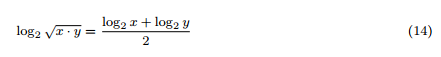
- 注 [1.11] 理论上，在某些情况下这种销毁可能是不可忽略的，例如高价值的零十进制Token之间的配对。但是，这些交易对无论如何都不适合 Uniswap，因为四舍五入的错误会使交易变得不可行。
- 注 [1.12] 在撰写本文时，Uniswap v1 上最具流动性的交易对之一是 ETH 和 WETH 之间的交易对。

 
## 参考
- [1] 海登·亚当斯。2018. 网址：[https://hackmd.io/@477aQ9OrQTCbVR3fq1Qzxg/HJ9jLsfTz?type=view](https://hackmd.io/@477aQ9OrQTCbVR3fq1Qzxg/HJ9jLsfTz?type=view.)。
- [2] 吉列尔莫·安杰里斯等人。Uniswap 市场分析。2019. arXiv：1911.03380 [q-fin.TR]。
- [3] 萨姆森。以娱乐和盈利为目的进行抵押不足的贷款。
	- 2019 年 9 月。网址：[https://samczsun.com/taking-undercollat​​eralized-loans-for-fun-and-for-profit/](https://samczsun.com/taking-undercollateralized-loans-for-fun-and-for-profit/) [4] Fabian Vogelsteller 和 Vitalik Buterin。
	- 2015 年 11 月。网址：[https: //eips.ethereum.org/EIPS/eip-20](https://eips.ethereum.org/EIPS/eip-20) [5] Jordi Baylina Jacques Dafflon 和 Thomas Shababi。
- EIP 777：ERC777 Token标准。
	- 2017 年 11 月.url： [https ://eips.ethereum.org/EIPS/eip-777](https://eips.ethereum.org/EIPS/eip-777)[6] 雷达。
- WTF 是 WETH？网址：https: //weth.io/ [7] Uniswap.info。包裹的以太币（WETH）。网址：[https://uniswap.info/token/0xc02aaa39b223fe8d0a0e5c4f27](https://uniswap.info/token/0xc02aaa39b223fe8d0a0e5c4f27) [8] Vitalik Buterin。
- EIP 1014：CREATE2。2018 年 4 月，网址：[https ://eips.ethereum.org/EIPS/eip-1014](https://eips.ethereum.org/EIPS/eip-1014)

- [uniswap v2 白皮书](https://www.codetd.com/en/article/12621251)
- [白皮书 v2 core](https://docs.uniswap.org/whitepaper.pdf)

	

