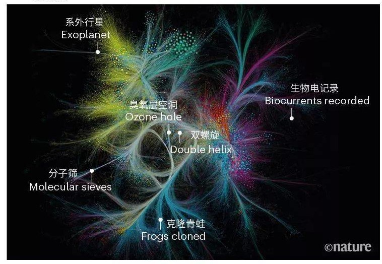

# 去中心化科研（Decentralized Science, DeSci）运动
## 问题
科学研究活动的名与利越来越集中于学术共同体内的少数精英，钱从哪里来？钱到哪里去？经费的来源与使用始终都是科学研究的首要问题。
## 钱从哪里来
### 早期
- 基督教和天主教等教会为了解决信仰动摇的根本，开始资助其中一部分教徒进行天体物理、生物医学和化学的研究，成为自然哲学家。
- 国王和贵族们为了维护统治的技术需求和“养神秘门客站台”的声望需求，代替教会成为科学家（以及本文并未涉及但同等重要的工匠、艺术家）的最大“金主”。
- 权贵阶级并非是科研活动的唯一资助者，文艺复兴后，广大公民的政治文化和科学意识受到启蒙，主动参与到科研活动中，使科学不再是贵族精英们的专属爱好。

### 当前问题
### 科研消费
烧钱的现代科研活动可以拆分成三大组成部分，每一部分所消耗的人力和物力有很大差别：

- 1 后端：在后台支撑科研体系运行的基础设施，包括实验室及配套资源的搭建与日常维护。

	例如一栋实验楼每年电费可达上亿元，一间实验室里的仪器价值可达成百上千万元。该过程是最耗钱的部分。
- 2 中端：此为可复制迁移的部分，全世界各学科领域基本上大同小异，主要是“纸上功夫”，又可称之为“面向 Office 软件和打印机的科研”。

	科研人员把一半以上的时间和精力用于撰写基金申请书、基金的考核和结题报告，否则就会缺少经费，无法支撑后端实验的开展。该过程是最耗时的部分。
- 3 前端: 带版权（Copyright）的科研成果发布/交流/应用，这也是曝光灯下公众平常接触到科研活动的部分。

	前端的产出，无论是与理论、实验有关的论文，还是技术专利，都有可能给社会和科研人员带来直接或间接的利益。该过程是最能赚取名利的部分

### 科研谁充值
上述传统的中心化科研方式以国家自然科学基金（National Science Foundation, NSF）为导向。

- 科研人员一般在年初撰写基金申请书，年末撰写年度考核报告或者结题报告，几个月的时间都在应对申请或考核（中端）。
- 负责审核基金申请、结题的评审委员由同领域有一定声誉的科研人员组成，也就是同行中的翘楚。
- 基金申请的通过率很低
	- 中国NSF申请成功率仅为20%左右（2021年）
	- 美国NSF申请成功率为28%（2022年）。
	- 因此，对于年轻学者来说，“中了本子（即基金）”，就像范进中了举人一样高兴。
	
为了能顺利通过审批，科研人员在申请基金时惯用的做法是先有鸡后有蛋，先有资源（后端）才申请经费。例如申请时实际上已完成一部分，因此撰写的申请书会显得老道成熟。如此一来，评审专家会认为资金不会浪费，一定会有成果产出。

最终导致两个不太乐观的趋势：

- 第一是科研的风险偏好性下降，探索方向保守，且盲目追求热点，小众或偏门的方向无人研究；
- 第二是马太效应，经费逐渐向学术权威（俗称学阀）集中，初出茅庐或名声不显的科研人员很难拿到足额经费，而学术权威既是基金分配的运动员，也是裁判员。

### 问题接踵而至
在中心化科研项目的结题考核中，学术评审委员会主要考察的指标是已在学术期刊发表的论文或专利（一般技术专利也会伴随着文章用来介绍或宣传）。因此，对于科研人员来说，发表论文成为刚需。

- 实验结果的复现问题（别人无法根据文章重复原作者的实验结果）
- 学术造假问题层出不穷

这是因为部分科研人员为了尽快发表论文，会粉饰结果，掩盖缺陷。评价一个科研人员的声誉，也是基于已发表的论文，例如论文的被引用次数。

- 科研人员

	发表论文的过程曲折程度，可能与实验本身相当。科研人员在费劲周折的实验出结果后，将数据整理成论文草稿，然后再花费数月甚至超过一年的时间才能将成果发表在期刊（半月刊或月刊）上公布于众。之所以要花费这么大的时间成本，是因为论文草稿中可能有作者未能虑及的错误，需要该领域的同行评议，也就是审稿人提出建议，并修改完善。
- 学术出版机构

	自然科学的研究结果发表的平台主要是Elsevier和Springer集团下属的出版社。考虑到确实很少会有人在上飞机或等公交时拿起一本学术杂志，去读那些满目陌生的专业术语、拗口的学术论述文风（Heavy Academic Style），所以学术期刊的订购量很少，出版社为了盈利，需要对作者收取一定的费用。
	
	如果作者不支付费用，读者就要支付一定的费用来订阅，通常每篇文章需要花费几十美元或欧元才能获得文章的PDF电子版本（中国知网CNKI赚取的人民币更多）。为了响应开放获取（Open Access）运动，让读者能够通过网络免费获取电子版本，许多期刊需要收取开源费用，例如著名期刊《Nature》需要作者支付超过一万美元，《 Nature Communications 》需要作者支付超过五千美元。

但最终象牙塔内的科学家（学术共同体）最后又重新变回为信条最像宗教的组织。学术界逐渐进化出等级森严、与“教父”和“教皇”权力相当的学术权威，而经费的资助正是以这些权威为中心

- 无论一篇文章是否开放获取，作者均无稿费，审稿人亦无报酬。
- 审稿人在论文评审的几个月内是免费的劳动力，这是因为审稿人一般是期刊的编辑（一般也是该领域的专家）特约邀请，是学术圈声誉的象征。
- 同行如果对论文中的研究感兴趣，一般不会拒绝审阅邀请，可以参考李白看到崔颢的《黄鹤楼》诗时的反应。
- 审稿人数量一般是2-5个，有时作者会推荐几个“中意的”审稿人，但是编辑可能不会考虑作者推荐的同领域专家，而是单独寻找与论文研究领域匹配的专家来评阅。这种匹配经常不尽人意，偏见和沟通不畅是在评审过程中的常见问题。

### 问题总结
综上所述，在经费被日益削减（政府财政收入减少及环保原因）的背景下，中心化科研的内卷严重。

## 解决办法的思路(DeSci 运动凭借去中心化精神和区块链技术，意图让科学（Science）回归民主（Democracy）)
针对上述中端和前端的弊病，DeSci 运动旨在利用基于区块链的 "Web3 "技术来激励科研工作者进行公开透明的研究，解决中心化科研的痛点和瓶颈，扩大和传播人类的共享知识。

DeSci运动属于公民科学和开放科学运动的一部分。在保护隐私、合法活动的前提下，甚至可以应用于科研的后端，也就是实验部分。
### 参考案例
2021 年 5 月，期刊《Nature》发表一篇题为“Smartphone science: apps test and track infectious diseases”的文章，提到智能手机逐渐在现代科研中发挥重要作用，例如通过发动社群志愿者利用手机拍摄功能和App应用来追踪蚊子引发的疾病[5] 、标记新冠病毒感染者[6]等。科研人员利用手机的拍摄功能做出了与5万美元的荧光显微镜相仿的实验结果，成本只花了不到 40 美元[7]。通讯科技在 DeSci 运动中大放异彩。

- 确保信任

	智能手机是进行科学研究的有力方式，但如果一款应用程序要被广泛使用并提供良好的数据，那么获得用户的信任至关重要。开发人员和其他专家可以帮助解决这个问题，以及技术障碍。应用程序开发通常很棘手，但收集健康数据的应用程序需要额外级别的隐私、安全、支持和合规性。同样，公民科学项目必须注意匿名和加密用户数据。“如果我们没有把这些事情做好，那么就不可能建立信任并让人们使用这些工具，所以这对我们来说是一个优先事项，”布朗斯坦说。
	
	美国国立卫生研究院资助，创建了一个名为 [Eureka](https://info.eurekaplatform.org/about/) 的研究平台,其中包括使科学家能够构建和部署用于健康研究的移动应用程序的基础设施.
   
	科研活动发动的社群志愿者实际上就是去中心化自治组织（Decentralized Autonomous Organization, DAO）。在 DeSci 运动中，理应有公民科学/开放科学和 DAO 的精神：

- 数据公开
- 成果开源
- 过程透明
- 公众支持
- 成本分摊
- 利益共享

而支撑这些 DAO 的精神的基础设施正是 Web3 技术。

###  DeSci运动采取的技术手段
DeSci 主要依靠基于以太坊链（Ethereum, ETH）的 Web 3.0。例如：

- 数字资产代币化。

	有两种模式，
	
	- 第一种方式较简单

		将科研成果转化成非同质化代币（Non-Fungible Token, NFT），科研人员可以借此直接获取经济收益。例如第一个科研手稿图制作的 NFT 在 OpenSea 网站上卖出了 13个ETH（约24000美元）的高价。但这种售卖高价可能不是常态，NFT收入不足以覆盖科研支出。
	- 第二种方式较为复杂，类似于房产证券化.

		通过DAO众筹科研经费，DAO根据社群投票、国库多签审核来发行代币，拥有 DAO 代币的成员共同拥有研究成果的版权，例如VitaDAO[9]，通过发行代币VITA，对缺少经费或无人研究的罕见疾病的研发给与资助。
- 高效点对点数据存储（IPFS）技术。

	科研人员之所以要把成果发表在中心化平台上，并且可能需要支付一定的费用，是因为要把数据和结果存储在服务器上托管，并且由平台提供网页端入口，以便其他人获取和共享。
	
	IPFS是一种点对点超媒体协议，将文件转化为使用哈希值加密的区块，文件内容一个字节的细微差异都会导致其区块的哈希值不同。这些区块散布在各个网络节点，并可从 Web2 入口检索。当索引某文件时，IPFS 协议从不同的节点下载该文件关联的区块
- 利用去中心化金融（DeFi）技术，通过时间戳、工作量证明等链上验证手段设置科研激励制度。

	例如 Ants-Review 项目将同行评议过程转移到链上进行，作者在以太坊链上匿名发布科研结果草稿，并提交审阅任务和赏金。审稿人将评语和建议上传到以太坊链上，整个社区评估同行评审结果，根据其评估质量进行按比例支付。
	
	除此之外，也有不基于代币激励的同行评议过程，例如利用声誉系统（Reputation System）和 IPFS 将评审过程转移到链上进行，这里对于审稿人来说，激励机制是社区在链上给审稿人不断更新的声誉打分而不是代币。IPFS 用来存储和共享论文从初稿到最终发表的不同版本以及同行的全过程审阅报告。	
	
	- 声誉系统
	
		当Web3技术应用到声誉系统时，时间戳验证、链上记录专业成就、不可售卖和转让的 NFT 等手段使这些评分造假变得成本非常高昂，链上钱包的签名和授权也降低了个人数据泄露的风险。
		
		例如: 2022年6月，MetisDAO 基金宣布推出基于 Web3 的声誉力系统（Reputation Power System）。声誉力是指通过链上成就获得的可移植和可组合的评分。通过执行诸如部署智能合约、输出内容、铸造 NFT、投票等操作，参与到 DAO 治理中并为之做出贡献，获得声誉力。

		健全的声誉系统和相应的 DAO 治理体系对 DeSci 这个理想目标能否圆满达成至关重要。因为个人声誉在 DAO 筹集的经费的使用中起到信任证书的作用，可能直接决定投票权和评审权。因此，基于 Web3 技术的 DeSci 运动不可避免地会遭遇一系列信任上的问题。为了真理或者名利打破头的科学家大有人在，科学研究不是请客吃饭，满脸和和气气。

## 待解决问题
学术共同体的改良派发起了新一轮的开放科学运动高潮，主要包括论文的开放获取、开放数据和开源软件运动。新世纪的开放科学，以开源的 Web2 中心化平台为主。

	例如科研人员可以把自己的论文草稿以预印本（Preprint）的方式托管在 ArXiv 网站，该网站运行在美国康奈尔大学服务器上。
- 预印方式的优点在于，不需要经过耗时费力的同行评议过程，直接公布研究成果，把科学发现以最快的速度传播，这一点在新冠肺炎疫情爆发之后起到了关键作用。当然，隐藏的好处是科研人员可以抢先宣示对新发现的主权，像大航海时代抢着插旗的殖民者一样。

而开源代码、软件、数据可以托管在 GitHub 等网站。虽然文档共享和版本控制是从区块链技术中受益最大的领域，但 GitHub 在团队合作编写代码、文档、保留不同的版本、分享成果等方面仍然有不可比拟的优势，尤其是界面对程序员来说非常友好，通过网页可以直接读取代码。如果某个程序包或文档在 GitHub 上，几千人给与星级打分，那么原作者即拥有非常高的声誉和职业能力证明。

### 问题1 自我证明
因此，在最近十几年里，开放科学本身获得了学术共同体的大量人员的参与， DeSci 运动作为革命党，`需要证明自己的解决方案比中心化官僚组织内部的改良派强很多才行`。已经参与到开放科学浪潮的科研人员未来将是 DeSci 革命运动的主力军，但是目前 DeSci 运动似乎并没有考虑怎样吸收这些人参与其中。
### 问题 2 区块链技术瓶颈
虽然比特币和以太坊代表的区块链技术，以带时间戳的分布式账本来表示价值之间的传递，理论和技术手段始于 2009 年中本聪发明比特币之后，但是想法早已在自然科学流行数百年。整理文献之间的引用关系，就像比特币的交易记录均可以追溯到创世区块一样，完全可以追溯至原始的论文。

期刊《Nature》整理了该期刊自1900-2017年以来出版的 8.8 万篇论文，这些文献包含着近 7亿 个引用关系，如果有其他的论文引用了某篇论文，那么它们之间就产生连接，如下图，图中点代表论文，颜色代表学科，点的大小代表被引用的次数。

这8万多篇论文只是科学文献中的沧海一粟，自然科学绵延数百年的文献引用体系是带着时间戳和价值传递记录的、多条区块链交织成的网。
### 问题3 同行评议存在的意义
虽然匿名是区块链的长处，但是在科研人员十分重视印刻有“真实名字的作品”。数学物理等基础学科是个人英雄主义色彩浓厚的科研领域，没有人能拒绝以自己名字命名定理的终极诱惑。

例如著名的“洛必达法则”，即是贵族洛必达（侯爵），每年给天才数学家约翰·伯努利300里弗尔（相当于136千克白银）资助其研究，换取了这一重大数学研究成果的命名权，从而名垂青史。(华为资助香浓定理算法？)

所以，一篇论文最大的审稿人、最先的审查，永远是署名的作者自己。虽然 DeSci 运动在同行评议上的应用值得推广，但是同行评议制度本身还有继续存在的必要性吗？在数据公开、结果透明的基础上，这个世界就不应该存在被拒绝发表的文章。给一篇论文提出修改建议的，也不应该是寥寥数人，而是所有能看到这篇论文的人，并且作者对论文拥有最大的处决权，根据建议修改文章内容。

这样 DeSci 在同行评议中的应用属于针对冗余的市场需求而制作出的解决方案。
### 问题4 交流成本
即使将来的某一天DeSci能把科研的直接成本降为零， Communication（表达、沟通、交流） 也永远是最大的成本。科学知识的获取非常简单，成本很低，但是消化和吸收的成本很高。人的大脑比宇宙还要复杂难懂，爱因斯坦与哥本哈根学派争论了30年，思想宇宙的碰撞火化四溅，直接导致物理学理论呈现核爆式发展。直线距离最短，但是曲折的路线价值更高。

当前 DeSci 中涌现了一批资助科研的 DAO 基金，例如

- 资助海洋学研究的 OceanDAO 基金会
- 资助生物医学的 Molecule 基金会、 VitaDAO 基金会等

运营模式是通过 DAO 来众筹经费，但是都没有摆脱“提交申请—审批项目—获得资助”这个过程，除了时间上的节省之外，并没有在模式上带来本质改变。由于这种模式与传统中心化科研的史诗过于押韵，"只要有审批，就会有中心化"
### 问题5 群体性失智
DAO 组织投票表决中，会出现“群体性失智”现象概率较大。而中心化不会出现这样的问题，因为有对应负责人
### 问题 6 研究价值与分享反比问题
90% 的学术成果都是重复性的冗余研究，既非原创，也没有理论价值或者应用价值。而 10% 的高水平科研则不需要通过 DeSci 就能得到大量资助。

虽然 IPFS 技术能将数据以去中心化的方式存储和共享，但是在某些实验领域，数据本身是很宝贵的，往往是花费巨大的人力物力消耗才能取得，且有一定的技术门槛，公开的可能性很小。更何况有时科研人员之间交流和共享信息会受到国家政治权力的限制。科学知识是可以免费公开的，但是现代科研基于技术，是有门槛和护城河的，有许多的技术专利或成果是不可能开放的。

## 方向
假设成功，很大可能从边缘突破的，也就是“以农村包围城市”。在小众化的、得不到政府或者公司资助的、油水不大的领域，DeSci 可能会大放异彩。

在应用科学中商业化程度较高的领域，例如计算机信息技术领域的开源程度最高，因此数据和代码的获取是相对来说容易。

但因为问题6，DeSci 更应该专注于为科研人员赋能，而非只关注区块链这个工具本身。区块链技术并未被广大科研人员所熟知，很多人连 ETH 钱包都不知道怎么使用。科研人员本身的保守性和斗争软弱性，也可能会限制DeSci运动的发展壮大。另外，目前的加密钱包在丢失后几乎不可挽回。因此需要加强关于钱包安全的基础设施建设。

## 参考
[DeSci启蒙：文艺复兴，自然哲学和Web3.0的革命梦想](https://www.panewslab.com/zh/articledetails/4f07zkj3s6g1.html)

