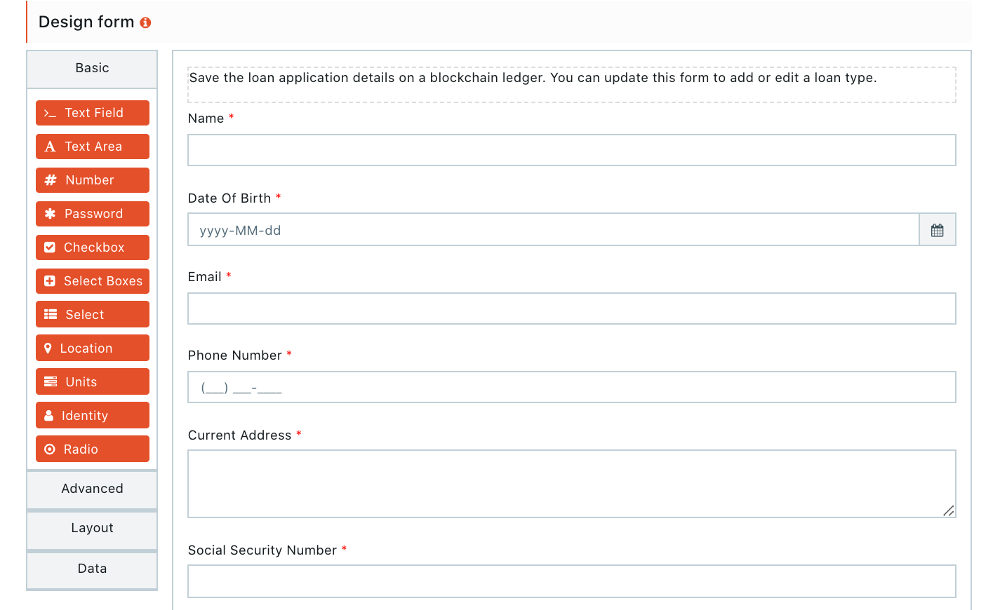
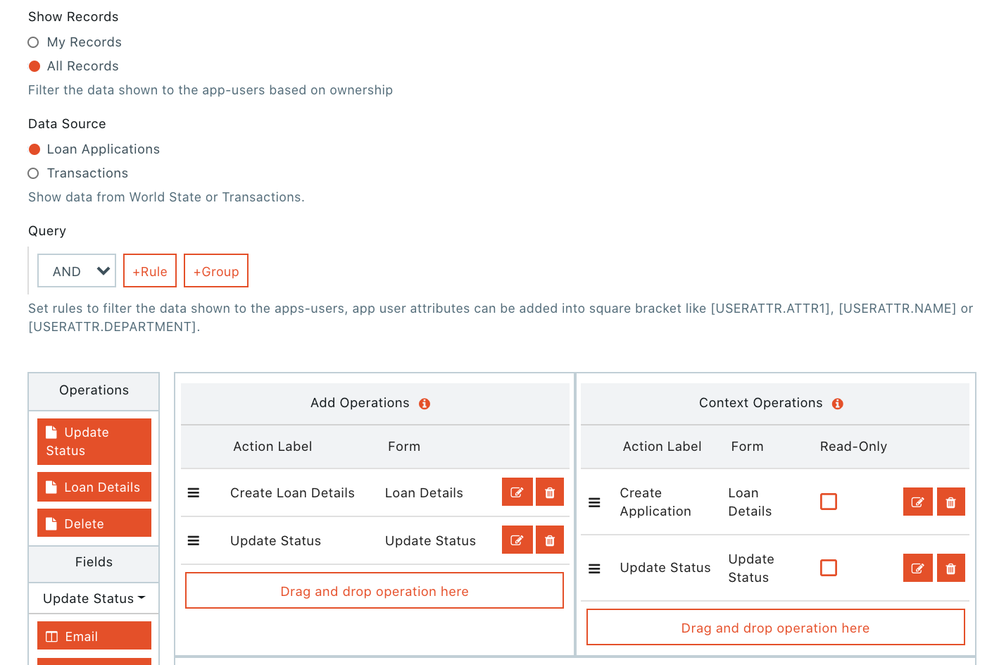
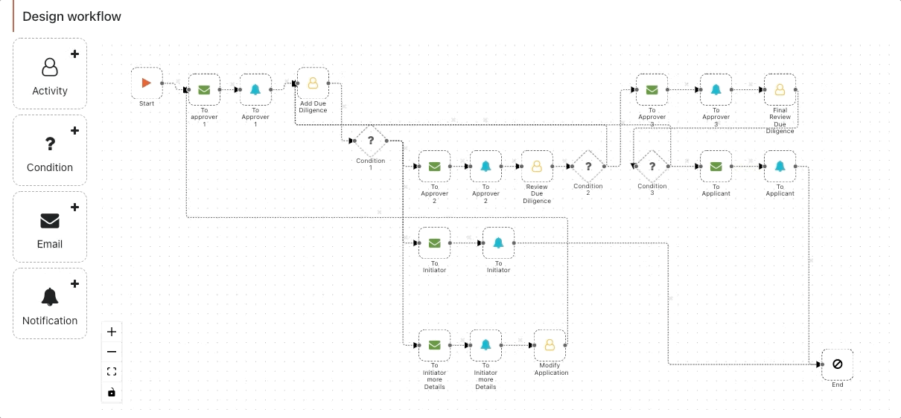
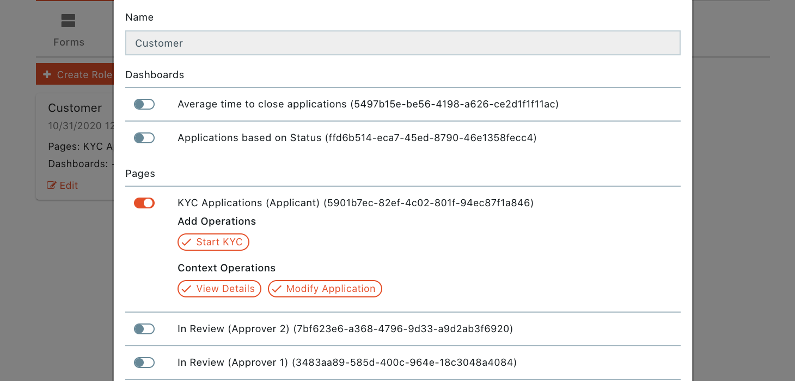
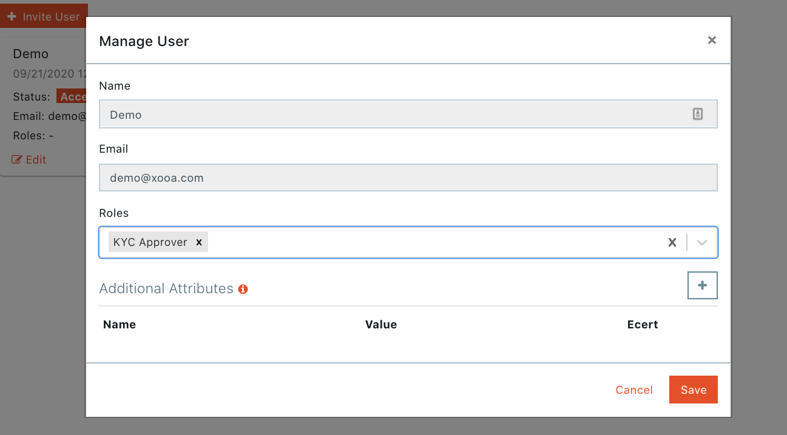
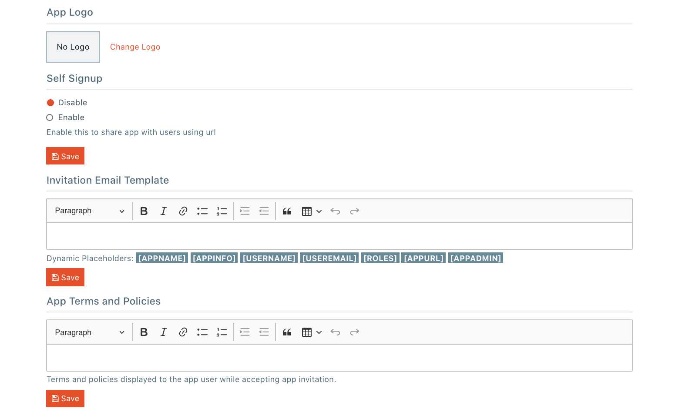

# xooa
## NFT 使用者需求
- 投资者

	购买或出售 NFT 
- 创作者

	铸造自己的NFT
- 公司

	建立自己的 NFT 市场

为前两者提供 xooa 交易市场，为第三者提供贴牌 NFT 市场。Xooa 是开发、测试、运行和监控区块链应用程序的最简单方法。	
## [xooamarket](https://xooamarket.com/) 
### 解决的业务问题
- 易用的用户界面

	提供市场上最简单的UI ，让用户使用轻松
- 提供双币使用

	提供加密货币和法币使用和结算
- 任何人都可以在 NFT 市场铸造和交易

### 定价
项目|值
---|---
铸币|免费
清单|免费
完成销售|最初的	10%
 |中学	5%
版税|✔
支出|免费
法币卡支付|✔
加密支付|✔
点对点交易|✔
NFT 钱包|✔
菲亚特钱包|✔
将 NFT 提现到以太坊|✔
自定义卖家店面|✔

## 贴牌 NFT 市场
### 区块链选择
总共提供两个类型的区块链:

- 开放市场选择公链，其中包括 eth 和 polygen
- 封闭市场选择私链

Xooa 的白标 NFT 市场产品使您能够选择最适合您需求的区块链。最重要的是，Xooa 抽象了区块链的复杂性并简化了开发体验。这使公司能够快速轻松地构建多功能且易于使用的 NFT 市场应用程序。帮助客户选择满足业务的独特需求的区块链。

- 公共选项

	可以将 NFT 市场部署在包括 Ethereum 或 Polygon 在内的公共链上

	- NFT 的无信任所有权
	- 汽油费和碳足迹将取决于所选的区块链
	- 通常用于开放市场
- 集中式选项

	您可以在中心化链上部署您的 NFT 市场

	- 更严格地控​​制您的数据
	- 行业最低的汽油费和碳足迹
	- 通常用于封闭市场

客户考虑选择区块链的因素如下

- 碳足迹
- gas 费
- 可扩展性
- 权利下放

### 低代码如何制作
-  拖放表单

	为数据输入和应用程序交互创建应用程序用户前端。当您部署应用程序时，将创建示例表单供您使用，但您不仅限于这些示例表单。您可以根据需要为您的应用程序创建任意数量的表单，或者将它们用作构建和定制您的需求的基础。
	
	
- 拖放页面

	使用 Pages，您可以配置将向您的应用用户显示的界面和导航。指定用户可以查看的信息并包括适用的表格，用于记录新信息（例如提交工作请求）或与现有信息交互（例如批准/拒绝工作请求）。
	
	
- 可视化工作流设计器

	工作流使您能够在您构建的流程中直观地设计和执行数据流。创建一组可以在满足您配置的条件时触发的操作，例如自动发送电子邮件。使用此工具，您可以简化和自动化可重复的业务任务，最大限度地减少错误空间，并提高整体流程效率。
	
	
- 仪表板和分析

	构建自定义仪表板以汇总和报告应用程序中的关键数据。仪表板以直观且易于理解的方式呈现您的重要数据，这有助于实时有效地分析数据。总体而言，这意味着企业可以持续监督数据流，而无需任何额外的努力或人员。
	
	 
- 定义角色

	角色是构建工作流的下一步。定义角色时，您将指定将显示给分配给该角色的最终用户的特定页面和仪表板。
	
	
- 用户管理

	这是为您的应用开发工作流程的最后一步。定义角色后，邀请用户加入您的应用程序并将他们分配给适当的角色，以便呈现根据他们的职责和需求定制的界面。
	
	
- 定制品牌

	允许您自定义所有应用程序的品牌。上传您自己的徽标，自定义发送给最终用户的邀请电子邮件，并指定在访问应用程序之前必须同意的条款和政策
	
	

### 售价
#### 专业版本(卖完)
- 提供
	- 环保区块链
	- 你自己的前端
	- 低代码定制
	- API 网关
	- 协作工具
	- 企业版本
- 优势
	- 白标 NFT 市场插件
	- 用信用卡购买 NFT
	- NFT 钱包
	- 将 NFT 提现到以太坊
	- 使用 MetaMask、Fortmatic、Binance 和 Coinbase 等加密钱包购买 NFT

#### 企业版本
- 包括版本功能
	- 专门的人工支持
	- 自定义尺寸
	- 自定义 SLA
- 优势
	- 版税管理
	- NFT 工作室
	- 知识产权保护
	- 等 
	

## 商业解决方案
### 使用 NFT 推广客户品牌
NFT 提供了一种全新的、通用的方式来为您的品牌的消费者互动和讲故事元素做出贡献。每个品牌都应该考虑将 NFT 作为有效营销策略的一部分，因为它们可以增加品牌亲和力，而不会蚕食其他业务领域。借助 Xooa，即使是最犹豫不决的 IP 所有者也可以在涉足之前先涉足 NFT。一旦您准备好进行跳跃，Xooa 将为您提供建立市场的工具，使您能够拥有品牌和收藏家关系.

- 通过 NFT 提高品牌亲和力

	NFT 为公司创造了独特的机会，可以通过创新和引人注目的品牌体验来建立品牌知名度并鼓励消费者互动。品牌可以使用 NFT 通过几种相互包容的用例类型来增加品牌亲和力
	
	- 品牌商铸造 NFT

		品牌可以使用 NFT 作为间接增加收入和推动消费者参与您业务其他领域的一种手段。
		
		- 您可以通过为购买数字或实物商品提供免费 NFT 来与客户互动。
		- 或可​​以通过让用户获得品牌参与度的忠诚度积分来提供更深入的客户旅程，然后这些积分可用于购买或交易 NFT。

		借助 operator 铸造的 NFT 用例，您可以激发对您的品牌和产品的新兴趣。
	- 用户铸造的 NFTS

		借助 Xooa，品牌可以运行用户生成的内容市场，使他们能够拥有创作者关系。
		
		- 预定义的角色

			包括删除 NFT/黑名单违规用户的版主，以及为铸币/白名单创建者选择提交内容的策展人 - 使您能够使用可定制以满足您的需求的现有工作流程开始您的 NFT 之旅。

		借助用户创建的 NFT 用例，您可以通过为品牌社区提供创建内容的工具来与他们互动。
- 为以上业务提供支持								
	- 为购买数字或实物商品提供免费 NFT
	- 用户主导体验的用户生成内容市场
	- 用户获得的忠诚度积分可用于购买 NFT 
	- 二维码或购物车集成
	- 社交媒体宣传的 NFT 赠品
	- 为品牌提供使用 NFT 进行实验和创新的工具

### NFTS 和元宇宙
元宇宙将成为未来几年现代企业的最大机遇。NFT 和数字所有权的概念是在这些元宇宙中打开机会世界的关键。无论您是想在元宇宙中占有一席之地的品牌，还是想要大规模运营的完全定制化市场的大型财富 100 强公司，Xooa 都能为您提供解决方案。
#### xooa 定义的元宇宙
元宇宙是一个抽象概念，人们在其中获取替代虚拟身份、收集物品并与其他元节参与者互动。它专注于社交联系，让参与者能够收集虚拟房地产、加入社交社区、创建虚拟身份、游戏等。这些组件中的每一个对于实现元节的最终目标都是必不可少的：完全沉浸在虚拟体验中。
#### 元宇宙的成功与其 NFT 的成功密不可分
元宇宙参与者应该能够拥有他们的虚拟资产（例如化身、物品、虚拟房地产）并从中获得直接效用（例如更好的统计数据）和间接效用（例如社交表达）。关键是能够将他们的 NFT 放在他们的“数字背包”中进行不同的体验和游戏。这一概念实现了真正的 NFT 所有权，最终为其参与者创造了一个更全面、体验更丰富的元宇宙。

- 元宇宙产品
	- NFT 管理(标准产品)

		对于希望通过铸造与其他元宇宙集成的 NFT，并在元宇宙中占有一席之地的品牌。该产品使品牌能够创建品牌体验，购买者可以将他们的 NFT 带到 Decentraland 和 Sandbox 等其他元宇宙或 Opensea 等市场。

		突出特点：
			
		- 掉落管理系统
		- 易于使用的用户界面
		- 法定货币和加密货币支付
		- 生成艺术引擎（即将推出） 
	- 元宇宙市场

		仅适用于那些将建立自己的元宇宙并需要为用户提供完整品牌市场的精选品牌。通过作为 NFT 制造中心和 NFT 市场运营， 该市场将成为元宇宙的经济支柱。

		突出特点：
		
		- 所有 Drops 管理功能
		- 完全可定制的白标市场
		- 开发/测试环境
		- 与游戏/虚拟世界引擎集成

### 知识产权
#### 将 IP 货币化并建立品牌亲和力
NFT 为 IP 所有者和被许可人提供了一种在提高品牌亲和力的同时产生收入的新方法。借助 Xooa，即使是最犹豫不决的 IP 所有者也可以在使用有限的用例之前先涉足 NFT，然后再深入挖掘更深层次的机会。一旦您准备好进行跳跃，Xooa 将为您提供建立市场的工具，使您能够拥有品牌和收藏家关系。

- 提供贴牌市场全功能

	利用多功能、高质量的产品构建您自己的 NFT 用例，并通过 Xooa 的白标 NFT 市场快速进入市场。使用您的 IP 以全新的方式与您的品牌社区互动。
	
	- 完全控制品牌
	- 内置合规性
	- 法定货币 + 加密货币支付
	- 托管+非托管钱包		
	- 可定制的店面
	- 掉落管理系统
	- 跨链可转移性
	- 游戏化功能

#### 知识产权交易的优势
NFT 为 IP 所有者和被许可人创造了独特的机会，但它们面临着困扰 NFT 领域的突出问题，并且它们可能会引发围绕权利的潜在担忧。Xooa 具有处理这些问题并保护您的 IP 的功能。

- 卖方合规

	Xooa 平台通过合规流程减少盗版和假冒风险，确保每个卖家账户背后都有真人。
- 版税管理系统

	Xooa 平台在平台内提供多方版税管理系统，支持复杂的版权场景。借助 Xooa 独特的自助服务技术，版税接收者（个人或实体）可以轻松参与入职、KYC 和支付管理，然后接收自动生成和自行下载的 1099 表格。
- 选择你的权力下放级别

	设置市场时，您可以选择以下去中心化选项之一：

	- 始终将 NFT 锚定在集中式区块链中（最具限制性）
	- 在中心化区块链中锚定 NFT，同时允许收集者发起将 NFT 从中心化链撤回到公共链（如果平台所有者允许）
	- 始终将 NFT 锚定在公共链中（最少限制）	

### 博彩
#### 用 NFT 改变游戏规则
与十年前的手机游戏热潮一样，代表独特游戏内容的 NFT 为游戏行业提供了一个蓬勃发展的新领域。NFT 提供了一种创新的方式来推动游戏组织基础之间的参与、炒作和货币化，而 Xooa 让这些机会触手可及。

NFT 为游戏公司和游戏玩家创造了独特的机会，通过实现独特的游戏内资产的高效买卖，以新的方式获得价值。这有助于游戏玩家对资产（例如皮肤或物品）的所有权，并可以将它们转让给其他玩家。因此，在以前只存在一级市场的地方产生了一个新的二级市场。

这创造了有价值的潜在用例，游戏玩家可以...

- 在二级市场上买卖游戏内物品
- 在虚拟世界中获取财产
- 出租、借出和赠送独特的 DLC
- 展示和销售用户生成的内容

#### 赋予您的开发团队生产力超能力
游戏开发者推动游戏公司的创新，但大多数人不太可能成为区块链领域的专家。Xooa 平台为他们提供了有效的功能和工具，可以抽象出区块链的复杂性，使他们能够发现 NFT 的优势并实现创新想法，同时不浪费时间或精力学习新技术。借助 Xooa 的两种自定义用户体验产品，我们的平台可以满足任何游戏用例的需求。

- 低代码
	- 45 秒内即可使用的市场
	- 通过简单的拖放组合无需编码
	- 适用于实验和生产市场用例
	- 内置用户+支付管理
	- 所需技能：任何人
	- 上市时间：立即 - 数周
- API 网关
	- 搭建自己的前端，全面掌控用户体验
	- 现成的后端
	- 无需任何区块链 DevOps 或智能合约工程师
	- 非市场项目的最佳选择
	- 所需技能：前端软件工程师
	- 上市时间：3 - 6 个月

### NFT
NFT 为实体提供了一种通过内容获利的新方法，同时更好地与粉丝互动，并将他们的整体影响力扩大到收藏家和贸易商。这种类型的 NFT 通常不会传达对“基础知识产权的权利”，并且仅出售用于个人用途，而不是“商业用途”，因此可以铸造涵盖大量可能用例的 NFT，包括...

- 体育大事记
- 虚拟艺术套装
- 游戏剪辑
- 数字卡牌

#### 创建您自己的数字收藏品
随着 NFT 的创建，创作者被授权从数字商品中创建收藏品，这开辟了一个新的机会领域。借助 Xooa，数字收藏品带来的这些新机会从未如此简单。Xooa 具有不同的产品和创新功能，可以轻松满足任何数字收藏项目的需求。

根据需求用户可以选择1种或者同时两种不同的产品展示他们的 NFT

- 公共 NFT 市场

	Xooa 的 Marketplace 服务使所有创作者和收藏家都可以加入，以铸造、购买和销售所有类型的数字收藏品。我们通过各种计划积极推销这项服务，以推动市场交易。如果您想铸造 NFT 并拥有自己的所有用户都可以访问的公共店面，请使用此服务。
- NFT 市场 PAAS

	Xooa 的 NFT 市场平台使组织能够建立自己可以控制的围墙花园式 NFT 市场。
	
	- 使用我们的 NFT 市场解决方案模板和低代码工具在数天/数周内轻松部署市场
	- 或使用我们的 API 网关创建您自己的自定义前端，抽象出复杂的区块链后端。

#### 提供功能
- 亲民的费用

	Xooa 都不收取铸币费或“gas”费。这消除了采用 NFT 用例的巨大障碍。
- 多版本

	除了没有铸币费外，Xooa 还使创作者能够铸币 NFT 的版本。版本使创作者能够铸造 NFT 的多个版本，这提供了一种与更广泛的收藏家和粉丝互动的新方式。
- 版税管理

	Xooa 的版税管理系统使用户能够创建复杂的商业模式、合作伙伴关系和收入份额，将 NFT 销售额的确定百分比发送给不同的各方。此功能打开了通往全新可能性领域的大门。
	
### 数字艺术
#### 在几秒钟内从您的数字艺术中铸造 NFT
Xooa 为有才华的数字艺术家提供了通过现有最容易使用的 NFT 市场铸造和销售 NFT 的机会。提供作品所有权、链转让、可追溯等属性

借助 Xooa 市场，可以存储和显示所有类型的媒体，包括...

- PNG中的超现实主义
- 动画 GIF 艺术
- 像素艺术系列
- 3D 计算机图形学

通过 Xooa Marketplace 促进您作品的高效买卖，甚至自动将您的 NFT 销售额的一部分捐赠给慈善机构。	

 	