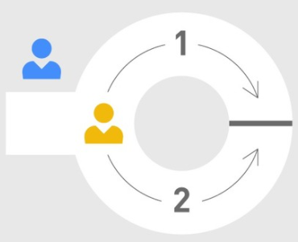
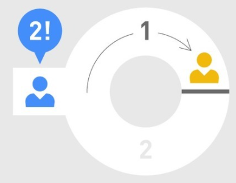
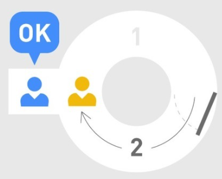

# zk-SNARKs和zk-STARKs解释
大多数加密资产持有者不希望他们的资产和交易记录被完全公开。

- zk-SNARK 代表了简洁化的非交互式零知识证明

	Zk-SNARK 已经在基于区块链的支付系统上如 Zcash，JP Morgan Chase 项目中使用，并作为一种客户端到服务器的安全验证方式。
- 而 zk-STARK 代表了简洁化的全透明零知识证明

	虽然 zk-SNARKs 已经很成熟并被很广泛的使用，但 zk-STARK 现在也被吹捧为该协议的新版本和改进版本，旨在解决 zk-SNARKs 先前的许多缺点。
	
## 阿里巴巴的洞穴寓言
1990年，密码学家 Jean-Jacques Quisquater（以及其他合作者）联合发表了一篇题为“[如何向孩子解释零知识证明协议](https://pages.cs.wisc.edu/~mkowalcz/628.pdf)”的论文。本文介绍了[零知识证明](https://academy.binance.com/en/glossary/zero-knowledge-proofs)的概念，其中包含阿里巴巴洞穴的寓言。

寓言是这样的

- 有一个环形洞穴，它有一个入口和一个将两条路分开的魔法门。
- 为了打开魔法门，人们需要低声说出正确的秘密。
- 因此，考虑到 Alice（图中黄色）想要向 Bob（图中蓝色）证明她知道密码是什么,但同时也要对密码保密。
- 为此，Alice 让 Bob 在外面等，Bob 同意，同时 Alice 进入洞穴并从两条路径中选择一条走到尽头。在该案例中，她决定通过路径1。

	 
- 过了一会儿，鲍勃走到入口处，喊出他希望爱丽丝从哪一边出现（在该案例中应该是路径2）。

	 
- 如果 Alice 确实知道这个密码，她将可以正确地按照 Bob 所要求的路径中走出来

	 
- 这个过程可以重复多次，以确认 Alice 不是通过运气才选择正确的路径。

阿里巴巴的洞穴寓言说明了零知识证明的概念，它是 zk-SNARK 和 zk-STARK 协议的一部分。 零知识证明可用于证明拥有某些知识并且不会泄露任何有关它的信息。

## zk-SNARKs (Zero-Knowledge-零知识 Succinct简洁 Non-Interactive非交互 Argument-论证 of Knowledge) 
Zcash 是 zk-SNARKs 的首个广泛应用。虽然像 Monero 这样的隐私项目也采用了环形签名和其他技术,通过这些技术也可有效地创建了一个烟幕弹保护发送者 ,而 zk-SNARKs 也从根本上改变了数据的共享方式。 

- Zcash 的隐私源于这样一个事实，即网络中的交易可以被[加密](https://academy.binance.com/en/glossary/encryption)，但仍然可以通过使用[零知识证明](https://academy.binance.com/en/glossary/zero-knowledge-proofs)来验证有效性。
- 因此，那些执行[共识](https://academy.binance.com/zh/articles/what-is-a-blockchain-consensus-algorithm)规则的人不需要知道每个交易的所有数据。
- 值得一提的是，Zcash 中的隐私功能默认情况下是处于不活动状态，是可选的，取决于手动设置。

零知识证明

- 允许一个人向另一个人证明其所陈述的是真实的，且不会泄露超出陈述有效性的任何信息。
- 有关各方通常被称为证明者和验证者，他们所持有的秘密被称为证据。这些功能的主要目的是让双方之间尽可能少的进行数据交换。
- 换句话说，人们可以使用零知识证明来证明他们是知晓某些知识，但不会泄露有关知识本身的任何信息。

在 SNARK首字母缩略词中

- 首字母 “succinct” 意味着这些该证明较简单，可以快速验证。
-  “Non-Interactive” 意味着证明者和验证者之间几乎没有交互。

	较早版本的零知识证明协议通常要求证明者和验证者进行通信，因此被认为是“交互式”零知识证明。但在“非交互式”结构中，证明者和验证者只需交换相关证明。

	目前，zk-SNARK 证明依赖于证明者和验证者之间的初始化可信设置，这意味着需要一组公共参数来构建零知识证明，从而构建私有交易。这些参数几乎就像游戏规则，它们通过编程写到协议中，并且是证明交易有效的必要因素之一。然而，这会产生潜在的集中化问题，因为参数通常由非常小的群体制定。
	
	虽然最初的公共设置是如今 zk-SNARK 实施的基础，但研究人员正在努力寻找其他替代方案，以减少交互流程中所需的信任。初始设置阶段对于防止伪造支出非常重要，因为如果某人有权访问生成参数的随机性，他们就可能会创建对验证者有效的假证明。在 Zcash 中，初始设置阶段称为[参数生成过程](https://z.cash/blog/the-design-of-the-ceremony/)。
- 我们再来谈下首字母缩略词的“ARguments”。

	 zk-SNARK 被认为是可合理计算的，这意味着伪造的证明者成功欺骗系统的可能性非常小。此属性称为健壮性，假设证明者具有有限的计算能力。从理论上讲，具有足够计算能力的证明者可以创建伪造证明，这也是量子计算机被许多人视为可能对 zk-SNARK 和区块链系统产生威胁的原因之一。
- 最后一个首字母是“Knowledge”，这意味着证明者无法在没有实际知识（或证人）支持其陈述的情况下构建证据。

	零知识证明可以快速验证，通常比标准比特币交易占用的数据少得多。这为 zk-SNARK 技术开辟了一条新道路，使其可用作匿名性和可扩展性解决方案。
 
## zk-STARKs(zero-knowledge-零知识 scalable-可扩展 transparent-透明的 argument-论证 of knowledge)
zk-STARKs 是作为 zk-SNARK 协议的替代版本而创建的，被认为是该技术的更快和更便捷的实现方式。但更重要的是 zk-STARK 不需要进行初始化可信设置（因此，字母“T”代表了透明性）。

从技术上讲，Zk-STARKs 不需要初始化可信设置，因为它们依赖于通过哈希函数碰撞进行更精简的对称加密方式。这种方式还消除了 zk-SNARK 的数论假设，这些假设在计算上成本很高，并且理论上容易受到量子计算机的攻击。

Zk-STARK 能够提供更便捷和更快速实现的主要原因之一是因为证明者和验证者之间的通信量相对于计算的任何增量是保持不变的。相反，在 zk-SNARK 中，所需的计算越多，各方须来回发送消息的次数就越多。因此，zk-SNARK 的整体数据量大小远大于 zk-STARK 证明中的数据量。

很明显，zk-SNARKS 和 zk-STARK 都吸引了越来越多的关于匿名性的问题。在[加密货币](https://academy.binance.com/en/glossary/cryptocurrency)领域，这些协议具有巨大的潜力，可能成为一种被广泛使用的开创性途径。

## 参考
- [zk-SNARKs和zk-STARKs解释](https://academy.binance.com/zh/articles/zk-snarks-and-zk-starks-explained)

	
	