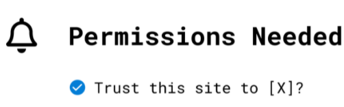

# ERC-2255-metamask

## 简单总结
一个提议的标准接口，用于在网站或“dapp”等受限 web3 上下文中限制和允许访问安全敏感方法
## 抽象的
Web3 JavaScript 钱包浏览器可以实现  `wallet_getPermissions` 和`wallet_requestPermissions` 这提供了用于请求权限和检查域的当前权限状态的标准接口。
## 动机
Web3 钱包的构建围绕着调解不受信任的应用程序与用户计算机上的密钥之间的交互的责任，并获得用户的适当同意。

MetaMask 这样的 web3 浏览器总是基于每个动作进行提示。这以大量用户摩擦为代价提供了安全性。我们相信单个权限请求可以通过大幅改进的 UX 实现相同级别的安全性。

权限请求的模式在网络上很常见，从使用 Facebook、Twitter、GitHub 甚至 Apple 登录，使其成为一种非常熟悉的模式。

- 脸书权限
- 使用苹果登录

如今许多 web3 应用程序以一系列重复请求开始它们的会话

- 向本网站显示您的钱包地址
- 切换到首选网络
- 签署加密挑战
- 为我们的合约授予代币津贴
- 向我们的合约发送交易

其中许多（可能是全部）以及更多（如解密）可以概括为原始登录屏幕上的一组人类可读的权限提示，并且可以仅在需要时请求其他权限。

在用户端，这些权限中的每一个都可以单独拒绝（未选中），甚至减弱或调整以满足用户的条款（例如，登录请求可以具有用户添加的到期日期和令牌限额可以由用户在请求时进行调整），使 web3 登录成为一种用户可修改的使用条款。

## 规格
该提案为钱包的 web3 provider API 添加了两个新方法：

- `wallet_getPermissions`
- `wallet_requestPermissions`

该 `wallet_getPermissions` 方法用于获取当前权限的数组（默认为空），而该`wallet_requestPermissions` 方法用于应用程序请求附加权限。

这两种方法用于限制一些假设的“受限方法”。我们建议应该作为标准的一部分包含的第一个这样的方法是 `eth_accounts`.

在此框架中，用户显示其帐户的权限如下所示：

	const response = await provider.request({
	  method: 'wallet_requestPermissions',
	  params: [{
	    'eth_accounts': {},
	  }]
	})

如果此请求被拒绝，它将根据 [EIP-1193](https://eips.ethereum.org/EIPS/eip-1193) 错误抛出一个 code 值等于的错误，MetaMask 团队已将其标准化为模块 [eth-rpc-errors](https://github.com/metamask/eth-rpc-errors)。4001

如果请求被用户接受，则后续请求 `eth_accounts` 将成功，并像往常一样返回一个帐户数组。

然后调用 `wallet_getPermissions` 将返回一个描述当前权限的权限架构对象。

	const response = await provider.request({
	  method: 'wallet_getPermissions'
	})
将返回一个类似这样的值：

	[
	  {
	    invoker: 'ens://your-site.eth',
	    parentCapability: 'eth_accounts',
	    caveats: [
	      {
	        type: 'filterResponse',
	        value: ["0x0c54fccd2e384b4bb6f2e405bf5cbc15a017aafb"]
	      }
	    ]
	  }
	]
哪里 `invoker` 是唯一的域字符串，用于标识当前 dapp 的来源。首先，这可能只包括 `https` 前缀，但是 `ens`，`swarm`，`ipfs`和其他人都可能在未来的有效来源。

该术语 `parentCapability` 来自这些权限对象所基于的 [zcap-ld 规范](https://w3c-ccg.github.io/zcap-ld/)，指的是被允许的方法。

该 `caveats` 数组表示应用于允许方法的特定限制。

您可以在上面看到用户选择的帐户如何在内部转换为 [caveat](https://github.com/MetaMask/json-rpc-capabilities-middleware/blob/master/src/%40types/ocap-ld.d.ts#L28-L33)，这是对响应值的限制，在这种情况下，确保页面只能收到批准的帐户通知。这也意味着此权限系统是可向前扩展的，以支持登录具有多个帐户的页面。

## 基本原理
虽然当前基于每个动作获得用户同意的模型具有很高的安全性，但获得更广泛的用户同意可以获得巨大的可用性收益，这些同意可以涵盖广泛的使用类别，可以用更易读的方式表达道路。这种模式有很多好处，可以在 web3 钱包中提供不同的功能。

该 `eth_sendTransaction` 方法本身可以是一种受限方法（该 `provider.enable()`方法默认请求），并且用户可以在登录时决定他们是否需要确认、批准所有交易或仅批准某个合约的交易或最多例如，某个令牌限制。通过默认限制此方法，钱包可以防止网站通过弹出窗口向用户发送垃圾邮件。

如果 `eth_call`是一种受限制的方法，那么随机网站将无法将用户订阅到托管提供商，从而更轻松地保护 Infura 等服务免受 DDoS 攻击。

在这种模式下，链上操作可以表示为一种权限，例如，向特定令牌地址发送配额设置交易的权限实际上等同于该交易的批准，除了站点可以选择仅调用需要时进行交易。这可以允许应用程序的标准接口请求权限，这可能需要根据不同类型的帐户（热钱包、硬件钱包、冷钱包、合约帐户）执行不同的操作。

该 `requestPermissions` 方法可以扩展为包括与请求的权限相关的其他选项，例如，站点可以请求具有特定能力的帐户。例如，像交易所这样需要 `signTypedData_v3`（某些硬件钱包不支持）的网站可能想要指定该要求，可能是这样的：

	provider.request({
	  method: 'requestPermissions',
	  params: [
	    {
	      'eth_accounts': {
	        requiredMethods: ['signTypedData_v3']
	      }
	    }
	  ]
	})
这将允许钱包将用户的选项限制为有效的选项，并允许 dapp 确保所选帐户与其服务兼容，同时保护用户关于他们如何存储密钥的隐私。

## 执行
MetaMask 使用 EIP-2255 来限制 `eth_accounts` RPC 方法，以便它会向任何没有被授予相应权限的调用者返回一个空数组。

您可以在 [RpcCap 存储库的自述文件](https://github.com/MetaMask/rpc-cap#rpc-methods) 中获得更详细的 API 和类型信息。

新的假设，提出的权限可以很容易地加入到了 [restrictedMethods](https://github.com/MetaMask/metamask-extension/blob/76a2a9b/app/scripts/controllers/permissions/restrictedMethods.js) 在MetaMask权限控制。

- [eip-2255](https://eips.ethereum.org/EIPS/eip-2255)