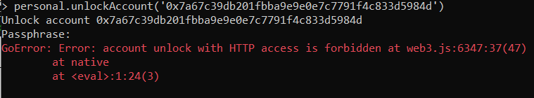
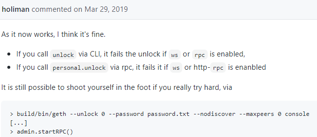

# Geth的不安全解锁(Geth’s insecure unlock)
以太坊生态系统正在迅速变化。作为开源软件，每年都会有很多改进。这样做的副作用是“教程”和“快速入门”博客可能会过时，让读者感到困惑。我就是这样的读者之一。在本文中，我将描述我在尝试使用 geth 解锁帐户时遇到的一个有趣错误以及随后的学习.

遵循的教程，我首先使用 `geth --ropsten --syncmode "light" --rpc --rpcaddr 127.0.0.1.`  我的意图是在 Ropsten 测试网上启动一个“轻量级”节点，并使用 Truffle 为其部署一个合约。然后我跑到 `geth attach \\.\pipe\geth.ipc` 通过 IPC 端点连接到 Geth 控制台，并尝试解锁一个用于部署合约的帐户。在这里，Geth 错误地显示了此消息。

仔细查看了用于启动节点的 geth 命令。`geth --help`（听起来像双关语：D）很容易揭示我使用的每个选项的解释。

	--rpc            Enable the HTTP-RPC server (deprecated, use --http)
	--ropsten        Ropsten network: pre-configured proof-of-work test network
	--rpcaddr value  HTTP-RPC server listening interface (deprecated, use --http.addr) (default: "localhost")
正如帮助页面所说，该 `--rpc` 选项启用了以太坊节点的 HTTP-RPC 服务器。该服务器是一个 HTTP 端点，它使 Javascript 应用程序能够使用 JSON-RPC 协议与以太坊节点通信。我们可以使用 `web3.js` 和 `web3.py` 等库通过此协议以编程方式与以太坊节点进行交互。

回到我们的错误——为什么启用 HTTP 服务器时帐户解锁被禁止？

如果以太坊账户被解锁并且 HTTP 接口暴露给外界（即在主机的公共网络接口上），那么任何人都可以从您解锁的账户转移资金或使用您的账户密钥签署交易。

[2018 年有报道](https://www.zdnet.com/article/hackers-ramp-up-attacks-on-mining-rigs-before-ethereum-price-crashes-into-the-gutter)称，攻击者发起了一场大规模的活动，扫描暴露在互联网上的以太坊钱包和采矿设备。同样常见的是，[帐户](https://github.com/ethereum/go-ethereum/issues/17013)在解锁后不久就被机器人神秘地清空。

为了缓解这个潜在的漏洞，在 Geth 中引入了一项[更改](https://github.com/ethereum/go-ethereum/pull/17037)，以在启用 HTTP 或 websockets 接口时禁止解锁帐户。拉取请求中的这条[评论](https://github.com/ethereum/go-ethereum/pull/17037#issuecomment-477950848)描述了 Geth 目前的行为方式。但是，仍然通过提供 `--allow-insecure-unlockgeth`  选项来解锁帐户，同时公开 HTTP 或 Websockets 接口。注意这个参数非常危险，这必须非常谨慎地使用。	

值得注意的是，geth 节点默认不启动 HTTP 和 WebSocket 服务器。即使它们是使用 `--http and--ws` 标志显式启动的，出于安全原因，并非所有功能都通过这些接口提供。可以使用 `--rpcapi` and `--wsapi` 参数或使用 `admin.startRPC()` 和覆盖这些默认值 `admin.startWS()`。

## 使用帐户时的最佳做法
- 在 Geth 上进行需要解锁帐户的操作时，请勿启用 RPC 或 WebSockets 接口。用户可以使用 IPC 端点附加到交互式 javascript 控制台与节点交互。例如，可以在 ropsten 测试网上使用 `geth --ropsten --syncmode "light"` .该节点在启动时在日志中打印 IPC endoint 地址来启动轻节点。然后，您可以使用附加到 IPC 端点

		geth attach path/to/ipc/geth.ipc

- 使用 CLI 时，建议以交互方式进行帐户解锁，而不是直接在命令中指定密码。例如，以下命令在 Ropsten 测试网上启动一个节点，指定帐户已解锁。未启用 HTTP-RPC 和 Websockets 接口。

		geth --ropsten --syncmode "light" --unlock 7a67c39db201fbba9e9e0e ...
- 避免在 Geth 的 Javascript 交互式控制台中输入您的密码，如果输入了，请删除该 `$HOME/.ethereum/history` 文件。如果您执行`personal.unlockAccount(eth.accounts[0], "myethsecret", 5)`，您将能够看到打印在上述 `.history` 文件中的密码。默认情况下， `.history`文件所在的目录只能由您自己的系统用户读取。但是，如果您的系统用户帐户被盗用，您的密码将在您的历史文件中可见。
- 考虑使用钱包与以太坊区块链进行交互。例如，使用 Metamask，您可以安全地管理您的帐户，使用您的帐户对网站进行身份验证并发送交易。

## 结论
在这篇文章中，我们试图了解为什么 Geth 在启用 HTTP 或 Websockets 接口时不允许解锁帐户、这种情况下的潜在风险以及使用帐户时的最佳实践。

## 参考
[Geth’s insecure unlock](https://clydedcruz.medium.com/geths-insecure-unlock-c28b79dce923)

