# NFT
## 概述
NFT 由 Cryptokitties 推出以来，兼容 NFT 标注的 ERC-721 标准的加密收藏品已经非常流行，并在最近几个月向大规模采用的方向发展。 
### 什么是 NFT
NFT 是 Non-Fungible Token 的缩写，中文称为「非同质化代币」，通常是指开发者在以太坊平台上根据 `ERC721标准/协议` 所发行的代币，它的特性为

- 不可分割
- 不可替代
- 独一无二的

简单来说，采用 `ERC721标准/协议` 而发行的代币(Token)就叫做 NFT,NFT 之间是不可以互换的，一般把 NFT 视为稀有收藏品，每个 Token 都独有

- 特殊的特征
- 不寻常的属性
- 这些属性利用以太坊的原数据存储

### 具有特性
1. 标准化

	NFT 具有一些标准化功能，包括所有权、转让等。所有非同质化代币都有这些功能。任何开发人员都可以利用该功能来构建自己的 NFT。
2. 通用性

	NFT是通用的，也就是说，任何想要使用 NFT 的应用都可以使用它。因为区块链是公开可访问的，而且每个人都可以阅读部署 NFT 的智能合约。
3. 流动性

	与加密资产相关的流动性市场非常庞大。人们可以根据自己的需求轻松地将它们换成现金或其他加密货币。因此，NFT具有很高的流动性。
4. 不变性

	区块链因不变性而闻名。NFT 是通过智能合约实现的。这使得 NFT 不可变，即用户无法将其 NFT 更改为其他 NFT。NFT 的所有权将永久记录于区块链中，除非用户决定将其转让给其他用户。
5. 可编程

	NFT 是通过智能合约实现的。NFT 代币可被增强并包含其他复杂功能。

### 使用范围
它们的功能各异。NFT 的实现范围仅限于开发人员的想象力。

1. 收藏品(数字艺术品或实体艺术品)

	NFT 通过加密猫在收藏品领域首次亮相。在加密猫游戏流行之后，NFT 成为 Axie Infinity 等许多其他收藏品领域的热门选择。
- 游戏

	玩家花时间来获得游戏内奖励，但这些奖励无法在游戏外使用。然而基于区块链的NFT就解决了这一问题，因为其他游戏可以集成这些奖励。
- 证书

	NFT 可用于识别颁发给个人的唯一证书。通常，基于 NFT 的证书是不可转让的。这些证书存储在区块链中，因此无法篡改。
- 房地产
- 金融

	贷款、期货等
- 软件标题

	软件授权、确保反盗版和隐私
- 演唱会/体育活动门票	
- KYC 合规性

	为特定的用户的 KYC 创建代币

### NFT 应用场景
- 加密猫 Cryptokitties
- 加密艺术品
- 加密盲盒
- 加密市场(NFT 交易所) opensea 

## NFT 如何实现
### ERC
ERC 比如 [ERC 20](https://eips.ethereum.org/EIPS/eip-20)、[ERC 721](https://eips.ethereum.org/EIPS/eip-721),一般包含两个部分，

- ERC 表示以太坊建议请求（Ethereum Request for Comment）的缩写
- 数字部分是提案编号

ERC 是以太坊生态系统中的应用级标准，代币智能合约的标准，如 ERC-20，ERC 的作者负责与以太坊社区建立共识，一旦提案被社区审核通过，就会成为标准。可以跟踪最近的 ERC 提案[这里](https://github.com/ethereum/EIPs/issues)。
 
#### ERC721
ERC721 最初由 CryptoKitties 创造，是代表 NFT (非同质化数字资产的第一个标准)。它的创建是为了提出在智能合约内跟踪和转移 NFT 的功能。

ERC-721 是一个开放的标准，它描述了如何在 EVM(以太坊虚拟机) 兼容的区块链上构建非同质化代币；它是非同质化代币的标准接口；这是一套规则，使其易于与 NFT  交互。 NFT 不仅是 ERC-721 代币，还可以是 ERC-1155 代币。

ERC721 可由继承 Solidity 智能合约标准获得。功能可以轻松地从 OpenZeppelin 库中继承，并将其用于编程基于 NFT 的项目。
#### ERC1155
它最早由 Enjin 提出。它使人们能够实现半同质化的代币。[ERC1155](https://eips.ethereum.org/EIPS/eip-1155) 允许拥有独特资产种类，而非拥有独特资产。这些资产与 ID 相连接。例如，一个 ID 可以有 20 个名为 “Swords” 的资产，而另一个 ID 可以有 30 个名为 “Guns” 的资产。
#### ERC721 标准中定义的函数和事件
ERC-721 定义了一些符合 ERC-20 的函数。 这使得现有钱包更容易显示简单的代币信息

- 函数
	- ERC20 类函数
	
		本函数为了铸币使用，兼容 ERC20 包括
	
		- name
		
			此函数用于定义代币的名称。
		- symbol
	
			此函数用于定义标记代币的符号。
		- totalSupply
	
			此函数用于定义区块链上的代币总数，供应量不必是恒定的
		- balanceOf
	
			此函数用于返回一个地址拥有的 NFT 数量
	- Ownership 类函数
	
		本函数返回代币所有者的地址。 由于每个 ERC-721 代币都是独一无二的，非同质化的，它们在区块链上由一个 ID 来表示。 其他用户、合约、应用可以使用这个 ID 来确定代币的所有者。包括
		
		- transfer
	
			这是另一个转移函数(交易函数)；它允许所有者将代币转让给另一个用户，就像加密货币一样，这个操作者是代币所有者
		- approve
	
			此函数用于批准另一个实体代表所有者转让代币的权限，注意这个操作者非代币所有者
		- tokenOfOwnerByIndex
	
			可选的函数，但建议使用。每个所有者可以同时拥有一个以上的 NFT。其独特的 ID 可以识别每一个 NFT，结果可能会变得难以跟踪 ID。 所以合约将这些 ID 存储在一个数组中，tokenOfOwnerByIndex 函数让我们从数组中检索这些信息。
		- takeOwnership
	
			可选的函数，它的作用就像一个取款函数，因为外界可以调用它从另一个用户的账户中取出代币。当一个用户被批准拥有一定数量的代币，可以使用 takeOwnership。
- 元数据

	- tokenMetadata

		可选接口，让我们可以发现代币的元数据或其数据的链接。
- 事件
	- Transfer

		当代币的所有权从一个人变为另一个人时，该事件被触发。发出的信息包括
		
		- 哪个账户转移了代币
		- 哪个账户收到了代币
		- 以及哪个代币（通过ID）被转移
	- Approve

		当用户批准另一个用户获得代币的所有权时，该事件就会被触发，也就是说，每当 approve 函数被执行时，该事件就会被触发。 它发出的信息包括：
		
		- 当前哪个账户拥有该代币
		- 哪个账户被批准在未来拥有该代币
		- 以及哪个代币（通过ID）被批准转让其所有权。	
### NFT 数据
NFT 数据主要分为3个部分

1. 元数据

	元数据用于定义单个代币的唯一特征。以加密猫为例，每只加密猫都有不同的颜色、形状、名称等。元数据通常以 JSON 形式表现
2. 链上

	在这种情况下，每个 NFT 都与各自的元数据链接，并存储在区块链中。最大的缺点是以太坊中的存储空间有限
3. 链下

	在这种情况下，元数据存储在中心化系统（如AWS）或去中心化网络（如IPFS）中，并通过智能合约中的 tokenURI 参数链接到它们各自的 NFT

## 如何自己发布 NFT
将在以太坊 Ropsten 测试网上测试 
### 准备前工作
- 需要安装 Metamask 浏览器扩展来
	- 创建一个 ETH 钱包

		 需要在 Metamask 钱包上选择 Ropsten 测试网络
	- 获取一些测试 ETH
	
		可以通过进入 Ropsten 水龙头来获得。将自己的钱包地址复制粘贴到水龙头中的文本字段中，然后点击 “request 1 ether form faucet”
	- 查看结果

		查看水龙头的 transactions 是否有交易记录显示，并且返回自己的钱包看自己的钱是否增加两个提示
		
		- 每个账户限制申请 5个
		- 因为测试网也是区块链，只是节点少，不保证可用性，所以有的时候申请要等待

	- 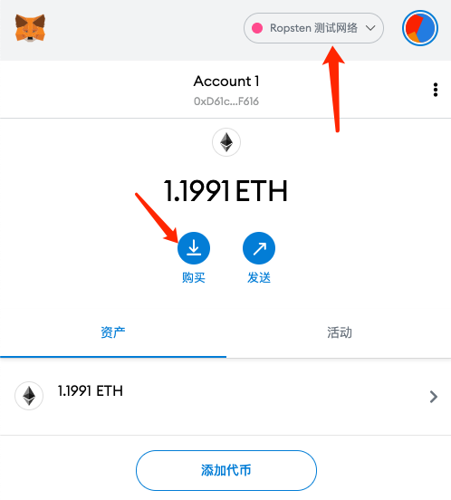
	- 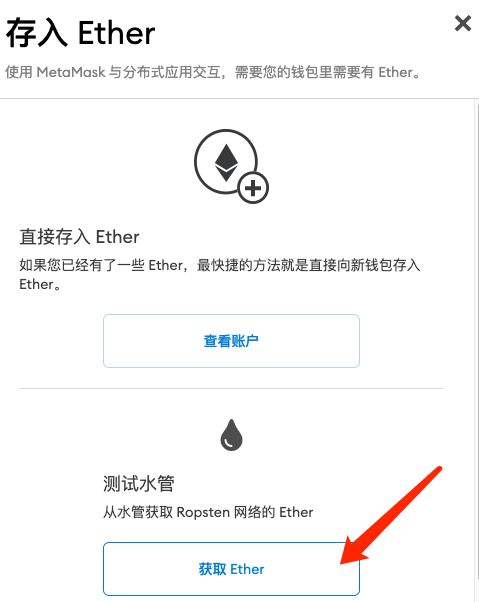
	- 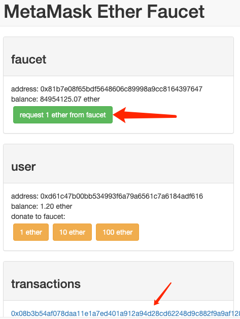
	- 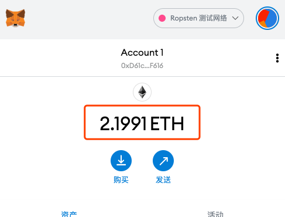
- 将文件添加到存储
	- IPFS
		- 步骤1：创建IPFS repo。 在终端窗口中输入以下内容来初始化IPFS repo
			
				$ ipfs init
		- 步骤2：启动IPFS守护进程。 打开一个单独的终端窗口，输入以下内容：
		
				$ ipfs daemon
		- 步骤3：添加图像到IPFS ， 进入第一个终端窗口，将图像添加到IPFS中（这里是art.png）
		
				$ ipfs add art.png
		- 步骤4 检查

			复制从Qm开始的哈希值，并添加 https://ipfs.io/ipfs/前缀，它必须看起来像这样
				
				https://ipfs.io/ipfs/QmdrswwrbcfPeknN2BRLVmyWbWRsKSC3vSNhV9Gkvhk1mL
		- 步骤5 生成作品描述的 JSON 文件

			向 IPFS 添加 JSON 文件。 创建一个 JSON 文件 nft.json，并将其保存在与图像相同的目录中。 JSON 文件格式：
			
				{
				    "name": "NFT Art",
				    "description": "This image shows the true nature of NFT.",
				    "image": "https://ipfs.io/ipfs/QmZzBdKF7sQX1Q49CQGmreuZHxt9sVB3hTc3TTXYcVZ7jC",
				}
		- 步骤6 将描述 json 添加到 IPFS

				ipfs add nft.json
			获得描述文件的地址，需要用这个铸造 NFT	
				
				https://ipfs.io/ipfs/QmWKqwMJQHSfpfRFGUVGPFFtkBJ5WkFzhjQpruhSLtLWXB
		- 链盘
			- 步骤1 打开链盘地址上传图片文件，比如
				
				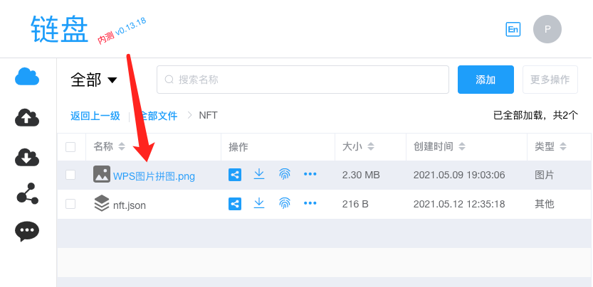
			-  步骤2 获取播放地址

					https://pnode.solarfs.io/dn/short/848e8cad02a3cfbd0dbb3db9d0fa7568-WPS%E5%9B%BE%E7%89%87%E6%8B%BC%E5%9B%BE.png
			- 步骤3 生成作品描述 JSON 文件

				向链盘添加 JSON 文件。创建一个 JSON 文件 nft.json，并将其保存在与图像相同的目录中。 JSON 文件格式：
			
					{
					    "name": "NFT Art",
					    "description": "This image shows the true nature of NFT.",
					    "image": "https://pnode.solarfs.io/dn/short/848e8cad02a3cfbd0dbb3db9d0fa7568-WPS%E5%9B%BE%E7%89%87%E6%8B%BC%E5%9B%BE.png",
					}
			 - 步骤4 将描述 json 文件上传到链盘		
			 	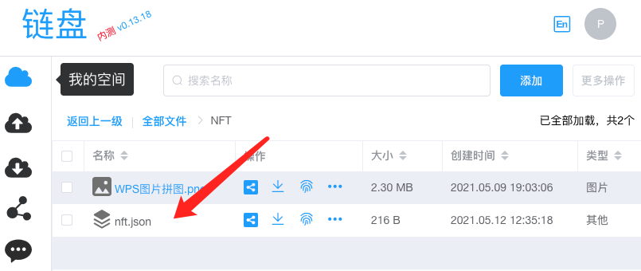
			- 步骤5 获得描述文件的地址，需要用这个铸造 NFT

					https://pnode.solarfs.io/dn/short/e73ef079d005e621f8153130c80ae35b-nft.json
	
### 编写 NFT 铸造合约	
为了方便和安全，我们将使用 [0xcert/ethereum-erc721](https://github.com/0xcert/ethereum-erc721) 合约来创建我们的 NFT 合约。 有了 0xcert/ethereum-erc721，我们不需要写整个 ERC-721 接口。 相反，我们可以导入库合约并使用它的函数。 前往以太坊 Remix IDE，制作一个新的 Solidity 文件，例如 nft.sol， 将以下代码粘贴到 Solidity 文件中。

	// SPDX-License-Identifier: MIT
	pragma solidity 0.8.0;
	 
	import "https://github.com/0xcert/ethereum-erc721/src/contracts/tokens/nf-token-metadata.sol";
	import "https://github.com/0xcert/ethereum-erc721/src/contracts/ownership/ownable.sol";
	 
	contract newNFT is NFTokenMetadata, Ownable {
	 
	  constructor() {
	    nftName = "Synth NFT";
	    nftSymbol = "SYN";
	  }
	 
	  function mint(address _to, uint256 _tokenId, string calldata _uri) external onlyOwner {
	    super._mint(_to, _tokenId);
	    super._setTokenUri(_tokenId, _uri);
	  }
	 
	}

- 第1行

	指定 SPDX 许可证类型，这是在 Solidity ^0.6.8 之后增加的。每当智能合约的源代码向公众开放时，这些许可证可以帮助解决/避免版权问题。 如果你不想指定任何许可证类型，你可以使用一个特殊的值UNLICENSED，或者直接跳过整个注释（它不会导致错误，只是一个警告）。
- 第2行

	声明 Solidity 版本。
- 第4-5行

	导入 0xcert/ethereum-erc721 合约。
- 第7行

	合约命名为 newNFT，它继承了 `NFTokenMetadata` 和 `Ownable` 合约。
- 第9-12行

	初始化构造函数并设置名称及代币符号
- 第14行

	声明函数 mint 有三个参数，
	
	- 类型为地址的变量_to，存储 NFT 代币接收者的地址
	- 类型为 uint256 的变量 _tokenId，将保存代币id
	- 类型为字符串的变量 _uri，将存储 JSON 文件的 URI。 将 mint 声明为外部函数，可以从其他智能合约和当前合约之外访问。
- 第15行

	使用接收方的地址和代币 ID 来铸造代币
- 第16行

	使用代币 id 和 JSON 文件的 URI 设置代币 URI

### 编译和部署合约
- 编译
	- IDE 会自动编译智能合约
	
	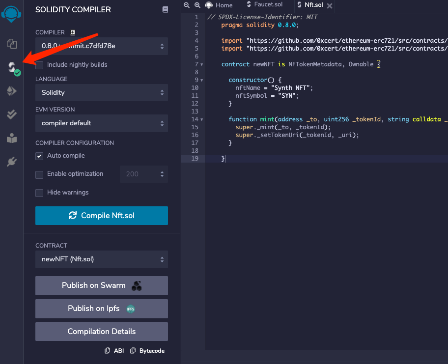
- 部署
	- 使用 `Injected Web3` 进行部署，编译合约前一定要在 Metamask 上选择 Ropsten testnet ,这里注意可能要等待
	
		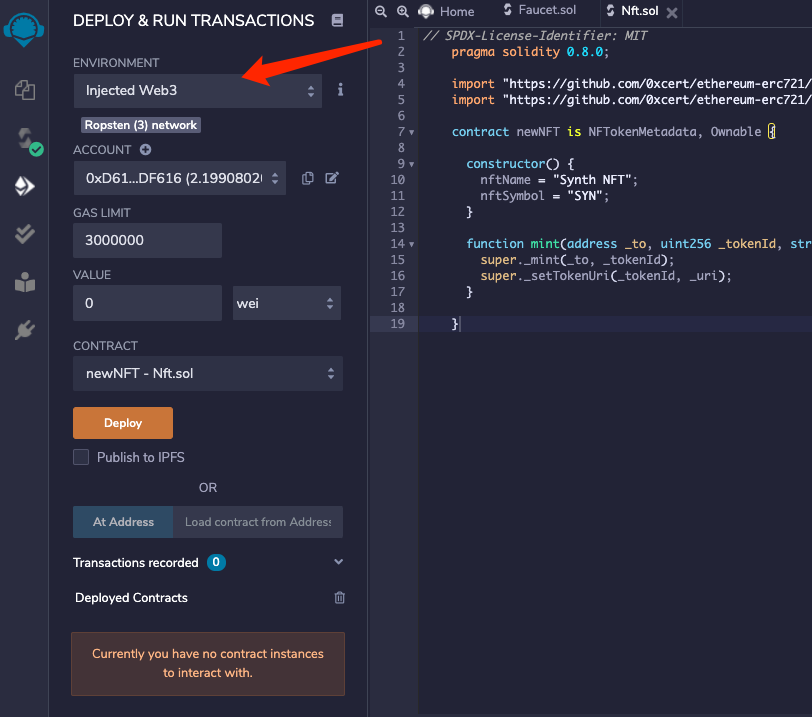

	- 然后使用 Metamask 部署，部署过程中出现 panding 说明钱包没有授权，注意翻墙
	
		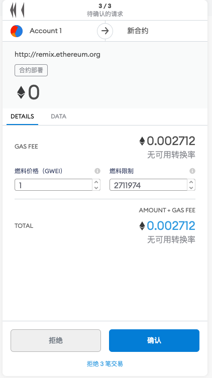
- 铸币
	- 部署合约后，可以在 Remix 中看到函数方法，和以太坊游览器交易查询

		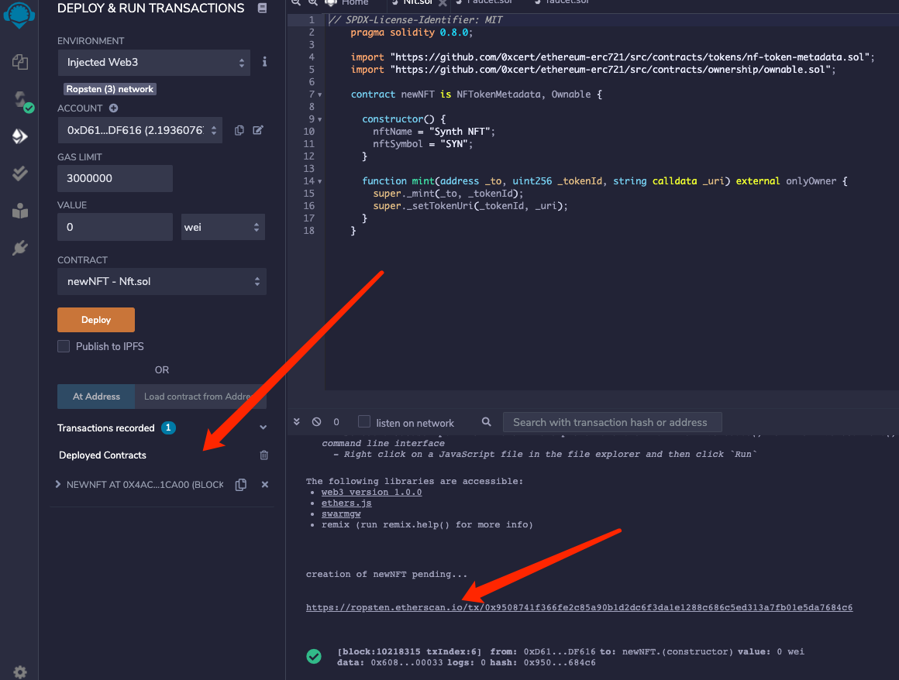
	- 展开

		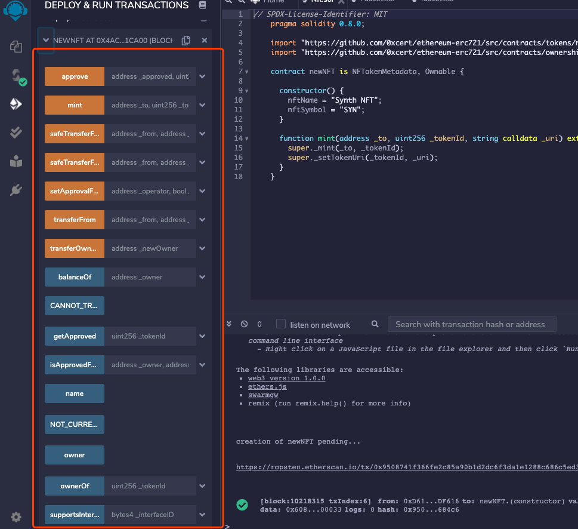
	- 添加 mint 函数，并添加以下参数
		- 在 `_to` 中添加你的 Ropsten 地址
		- 在 `_tokenid` 中输入任何数字值 (建议为1，因为它是第一个)
		- 在 `_uri` 字段中，添加上一节获得的 JSON 文件的 URI
	- 点击交易

		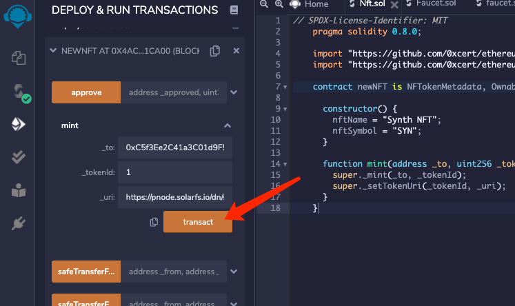
	- 点击以太坊游览器查看

		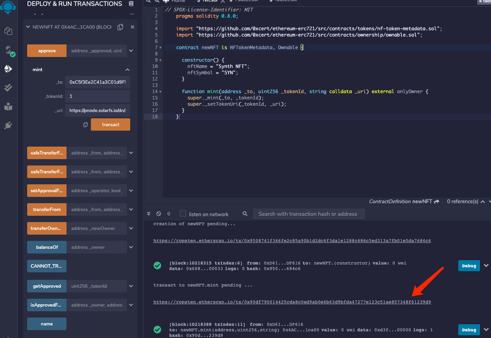
		
		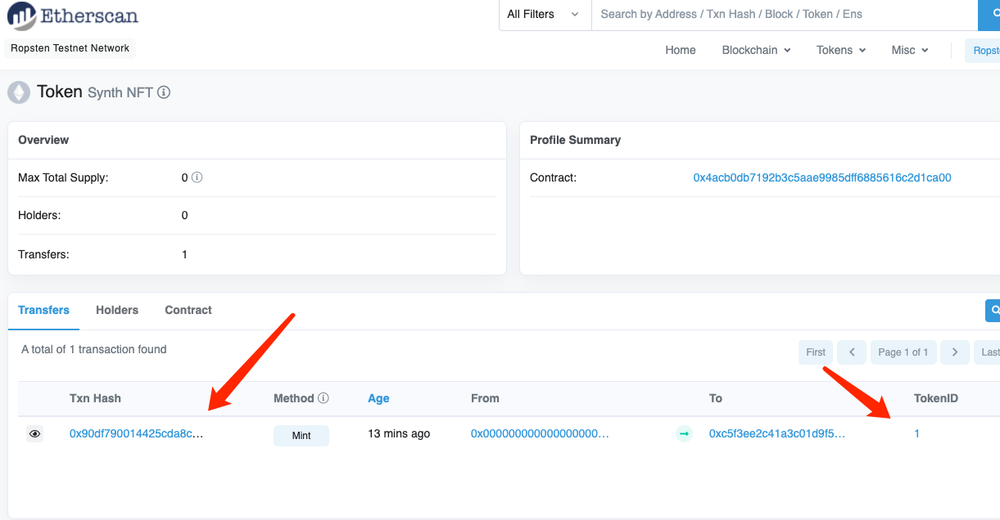
	- 对比下铸造发放地址

			0xC5f3Ee2C41a3C01d9F5be5B65A97321b9E87c62c
			
		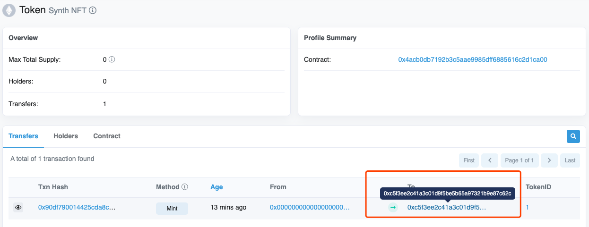	
		

		
	
	
	
	
现在对于 NFT 的限制就是数据真的上链？？？

- 限制了大小？
- 为什么限制？
- 判断 NFT 还是早期，主要是对创作对象
- 面值=虚拟货币，可以分解 NFT 产品来得到的到虚拟货币

- 新思想
- 新工具
- 新媒介？新媒介是什么？

- 支持多链

NFT 平台很多，提供和 opensea 不一样的东西给用户

- 特点1

	合作项目方(融资方)挖矿？？可以把 100个 bnb 铸造成1个 NFT ,随机属性，提供锁仓机制？可以抵押 NFT 去挖矿，铸造的 NFT 30天不能分解，可以帮用户产生新的挖矿玩法？因为比较随机，所以舍不得分解，可以用来挖矿，也可以用来收藏，空头？BIP 908 协议？推广？erc1155 ?erc 908?erc721?
	
	ERC 20 to  NFT && NFT to ERC 20 写进基础合约
	
	- 创作者需求
		- 去中心化，对于创作者无需许可
		- 和大公司合作，用很低的成本去做 NFT 铸造合约？
		- NFT 发行，NFT 铸造，NFT 挖矿，都封装成直接可用工具
		- 有500个挖矿？
	- 商业模式
		- 提供平台和技术
		- 和第三方知识产权者联系来使用，不需要考虑技术(屏蔽技术)
		- NFT 和 NFT 之间的交易(平台提供币兑换)   
	- 发行者如何鉴定
		- 通过推荐、审核发行？
			- 团队1
				- 开发团队
				- 大使(拉人的)
					- 发行者由大使推荐，倾向比较年轻有活力的人、低(价值)
	      
## 竞品研究
### opensea
OpenSea 是目前以太坊網路上規模最大的 NFT（非同質化代幣）買賣市場，能夠交易包括數字藝術品、加密收藏品、遊戲物品和其他建立在以太坊網路上的 ERC-721 和 ERC-1155 標準的代幣。在 NFT 被眾多業內人士看好，認為是下一個投資熱潮的大背景下，OpenSea 也受到了廣泛的關注。OpenSea 目前已完成 2300 萬美元的 A 輪融資

- 上链
	- 股份分成
	- 视频上链
	- 确权
- 在 beehub 和 flulu 基础上做功能优化和延伸
	- 有限片段分享
	- 评论
	- m3u8 播放器
	- 付费，收费方式，传统和加密都支持

## 币安 NFT 项目
- https://www.bakeryswap.org/#/home
	- 主营业务
		- 代币交换
		- nft 超级市场
			- 4w个作品
			- 交易次数 14w
			- 交易额 27W
			- 新加音乐和视频板块 
	- NFT+DEFI 衍生业务
		- 质押 NFT 挖代币
		- 反过来
	- 允许用户铸造 NFT  
- https://pancakeswap.finance/
	- 和上面的差不多

- [seascape](https://www.seascape.network/)
	- 游戏，发布NFT + DeFI
		- 抽奖(盲盒？)
		-  挖矿
		-  等
	- DeFi 链支持
		- 以太坊
		- 波卡
		- 币安智能
	- 自己也有代币 crowns
- [myneighboralice](https://www.myneighboralice.com/)  
	- 社区卖地游戏
		- 小游戏集合
		- 平台代币
		- 发行限量版 NFT 
		- 可以做质押
		- 投票
- [https://realy.pro/](https://realy.pro/)  
	- 潮流实物单品鉴定和交易的平台，记录信息同步上链，还可以实现高效交易，合作厂商合作，用芯片加商品的模式
		- 迪斯尼限量
		- nike限量
		- 阿迪达斯限量
		- 胶囊系列限量
		- 乔丹限量
- [https://rocki.app/](https://rocki.app/)
	- erc 721 锚定音乐人，投资人，也会获得回报
	- erc 1155 类似批量的交易版本，独家或限量发行
		- 只发行1000张，交易这个nft  		 
	
	 			       
## NFT 知名链
- [flow](https://zh.onflow.org/)

	包含 NFT 产品，主要是游戏和商业的
	
	- 加密猫
	- nba top show
	- [animocabrands](https://www.animocabrands.com/)
		- REVV TOKEN
		- F1® DELTA TIME
		- THE SANDBOX
		- SAND TOKEN
		- 等等

## 交易所和统计
https://coinmarketcap.com/zh/

## Defi
- https://pancakeswap.finance
	- 币安的
	- Defi 解决 Uniswap 链上高手续费
	- 功能
		- 币之间相互切换
		- 提供流动性挖矿？
			- 质押代币给糖果池矿池，比如 cakepool，不参与挖矿
			- farms 
				- 无常损失就是因为货币价格损失波动导致损失 
				- 可以在 [这里查看](https://coinmarketcap.com/zh/yield-farming/)无常损失等级

				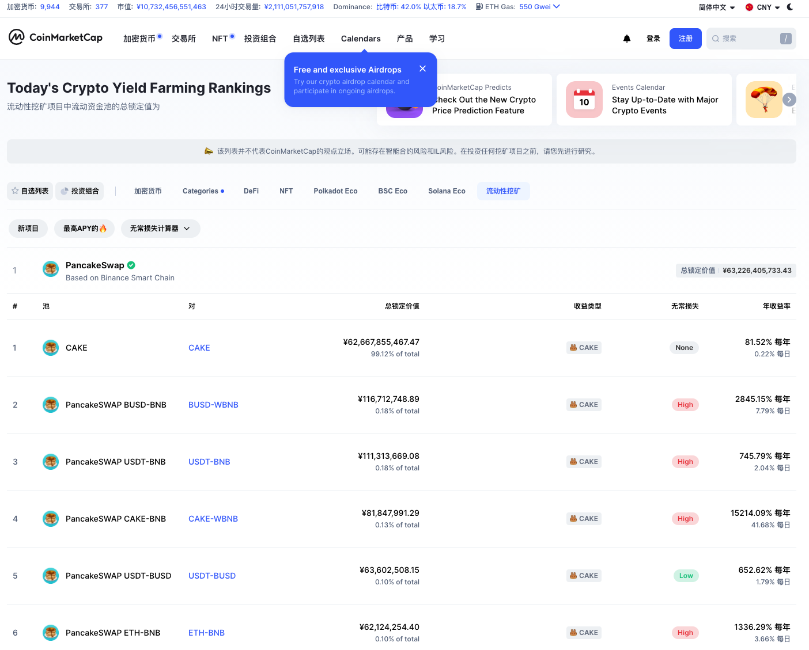
		- 可以先质押 farm ，得到的 cake 再质押糖果池		
- 预言机
	- 给程序提供价格的   

## 高级使用
### ERC72
一种跟踪数字资产所有权的方法
### 惰性铸币(lazy-minting)

- [workshop-recap-building-an-nft-merkle-drop](https://blog.openzeppelin.com/workshop-recap-building-an-nft-merkle-drop/)
- [Building an NFT Merkle-Drop](https://www.youtube.com/watch?v=SF-XOwWIwRo)

## 参考
- [币安智能链BSC上的NFT、DeFi项目及未来前景 | Crypto Uncle 加密叔](https://www.youtube.com/watch?v=y_y7zA4cOXs)
    
	