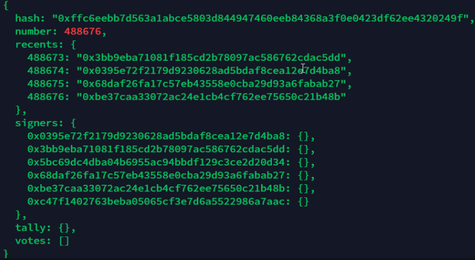
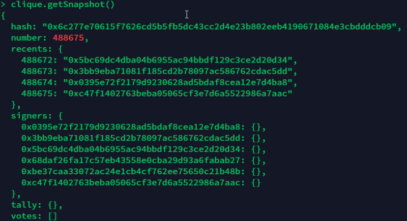
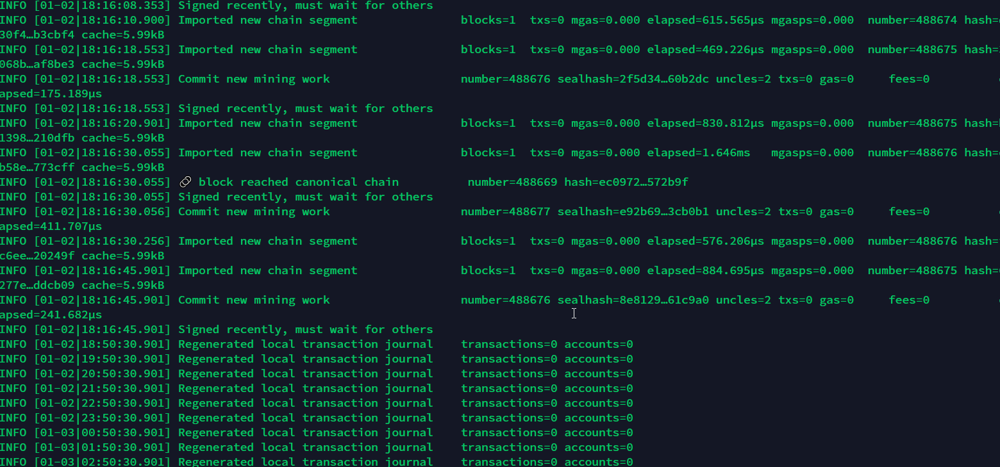

# POA 死锁问题

## 系统版本
- geth 1.8.17
- 6 台共识节点
- 启动

		directory=/home/poa
		command=/bin/bash -c 'geth --datadir sealer4/  --syncmode 'full' --port 30393 --rpc --rpcaddr 'localhost' --rpcport 8600 --rpcapi='net,web3,eth' --networkid 30 --gasprice '1' -unlock 'someaddress' --password sealer4/password.txt --mine '

## 官方 [issue](https://github.com/ethereum/go-ethereum/issues/18402)
- 问题描述
	- 运行2个月正常，但所有节点出现问题
	
			Signed recently, must wait for others
	- 每一个小时出现

			Regenerated local transaction journal transactions=0 accounts=0
		但没有其他问题
- 尝试解决
	- 重启所有节点

			INFO [01-07|18:17:30.645] Etherbase automatically configured address=0x5Bc69DC4dba04b6955aC94BbdF129C3ce2d20D34
			INFO [01-07|18:17:30.645] Commit new mining work number=488677 sealhash=a506ec…8cb403 uncles=0 txs=0 gas=0 fees=0 elapsed=133.76µs
			INFO [01-07|18:17:30.645] Signed recently, must wait for others 
	- 问题描述

		一些节点卡在 488677 上，而另一些节点在 488676 上，问题与  [16406](https://github.com/ethereum/go-ethereum/issues/16406) 相同
		
		- peer 1 
		
						
		- peer 2
			
				
		
		没有出块投票，也不出块
		
		- 每个节点都与其他节点配对、
		- 每个节点都是 clique.getSigners() 的一部分
		- 每个节点都在等待另一个节点签名...

				INFO [01-07|18:41:56.134] Signed recently, must wait for others 
				INFO [01-07|19:41:42.125] Regenerated local transaction journal    transactions=0 accounts=0
				INFO [01-07|18:41:56.134] Signed recently, must wait for others
- 深入分析
	- 再查看日志
			
			INFO [01-02|16:42:10.902] Signed recently, must wait for others 
			WARN [01-02|16:42:11.960] Synchronisation failed, dropping peer    peer=7875a002affc775b err="retrieved hash chain is invalid"
			INFO [01-02|16:42:12.128] Imported new chain segment               blocks=1  txs=0 mgas=0.000 elapsed=540.282µs mgasps=0.000  number=488116 hash=269920…afd3c7 cache=5.99kB
			INFO [01-02|16:42:12.129] Commit new mining work                   number=488117 sealhash=f7b00c…787d5c uncles=2 txs=0 gas=0     fees=0          elapsed=307.314µs
			INFO [01-02|16:42:20.929] Successfully sealed new block            number=488117 sealhash=f7b00c…787d5c hash=f17438…93ffe3 elapsed=8.800s
			INFO [01-02|16:42:20.929] 🔨 mined potential block                  number=488117 hash=f17438…93ffe3
			INFO [01-02|16:42:20.930] Commit new mining work                   number=488118 sealhash=b09b33…1526ba uncles=2 txs=0 gas=0     fees=0          elapsed=520.754µs
			INFO [01-02|16:42:20.930] Signed recently, must wait for others 
			INFO [01-02|16:42:31.679] Imported new chain segment               blocks=1  txs=0 mgas=0.000 elapsed=2.253ms   mgasps=0.000  number=488118 hash=763a32…a579f5 cache=5.99kB
			INFO [01-02|16:42:31.680] 🔗 block reached canonical chain          number=488111 hash=3d44dc…df0be5
			INFO [01-02|16:42:31.680] Commit new mining work                   number=488119 sealhash=c8a5e7…db78a1 uncles=2 txs=0 gas=0     fees=0          elapsed=214.155µs
			INFO [01-02|16:42:31.680] Signed recently, must wait for others 
			INFO [01-02|16:42:40.901] Imported new chain segment               blocks=1  txs=0 mgas=0.000 elapsed=808.903µs mgasps=0.000  number=488119 hash=accc3f…44bc4c cache=5.99kB
			INFO [01-02|16:42:40.901] Commit new mining work                   number=488120 sealhash=f73978…c03fa7 uncles=2 txs=0 gas=0     fees=0          elapsed=275.72µs
			INFO [01-02|16:42:40.901] Signed recently, must wait for others 
			WARN [01-02|16:42:41.961] Synchronisation failed, dropping peer    peer=7875a002affc775b err="retrieved hash chain is invalid"	<<- 这条
	- 还看到

			INFO [01-02|16:58:10.902]  block lost number=488205 hash=1fb1c5…a41a42
	- 停止挖矿日志

					
	- 相关问题
		- [#16444](https://github.com/ethereum/go-ethereum/issues/16444)  
		- [#14381](https://github.com/ethereum/go-ethereum/issues/14381)
		- [#16825](https://github.com/ethereum/go-ethereum/issues/16825)
		- [#16406](https://github.com/ethereum/go-ethereum/issues/16406)
- 重新拍错测试
	- 删除 2-6 节点数据重新同步
	- 将共识节点数量降低成5台
	- 运行1天又卡住
		- 5个节点卡在同一个区块
		- 如果查询每个节点上的块，同一个块有 3 个不同的哈希值
		- 最后一个块总是以难度 = 1 签名，所以，没有难度 = 2 的密封，最后一个区块-1 被封了两次...难度2的两个节点

## 讨论修复方法
- [#18402（评论）](https://github.com/ethereum/go-ethereum/issues/18402#issuecomment-452141245) 
	- [协议更改](https://github.com/gochain-io/gochain/pull/166) 
- Gorli 测试网问题改善方法
	- 不正常的块密封延迟应该高得多。目前，它有时低于网络延迟，导致地理距离较远的权威节点不断产生不正常的块。
		- 建议在包装块之前至少放置 5000 毫秒的最小延迟（加上随机延迟最多 10000 毫秒）。
		- 这是可以在不破坏集团规范的情况下完成的事情，并且在大多数情况下将确保轮流块在网络中的传播速度总是比轮流块更快。
	-  1 和 2 难度分数的选择并不理想。两个轮流块与一个轮流块具有相同的难度。我相信，轮流块一定要重得多，我建议轮流难度得分为 3，以确保它们始终获得优先权，并避免在两个不同的链提示具有相同难度的情况下出现僵局。不幸的是，这需要一个新的规范/硬分叉。	
- 官方修复合并
	- [解决由于低同步高延迟设置中的重组导致的网络死锁。 #19239](https://github.com/ethereum/go-ethereum/pull/19239)  
- 临时处理命令设置规范块，支持脚本 [死锁解析器脚本](https://github.com/BrightID/IDChain/blob/release/1.9/deadlock_resolver.py)

		debug.setHead(hex_value) 
- 导入初始化节点恢复

	最新块是 510多w，而卡住的机器是300w块，恢复
	
	- 1 导出最新区块 `geth export blocks.dump 0 5125100`
	- 2 删除异常 chaindata 目录
	- 3 初始化节点 `geth init ...`
	- 4 导入 `geth import blocks.dump`
- 减少共识节点数量到2台
	- 因为出块 1-2 所以永远不会发生死锁
- 增加新的 EIP 减少 POA  死锁
	- [EIP-3436: Expanded Clique Block Choice Rule ](https://eips.ethereum.org/EIPS/eip-3436) 
	 

				 
		 
			
				
			
		 
			
	
	

## 参考
[PoA network, all the sealers are waiting for each other after 2 months running, possible deadlock?](https://github.com/ethereum/go-ethereum/issues/18402)