# 原生 geth-poa 性能测试报告
## 测试目的
- 在一定的硬件基础上，得到 geth-poa 的性能基准
- 通过调节 eth 的参数，尝试进一步增加 geth 的 tps 和稳定性

## 压力测试工具
[chainhammer](https://github.com/drandreaskrueger/chainhammer)
## 基础数据推导
- 测试数据

	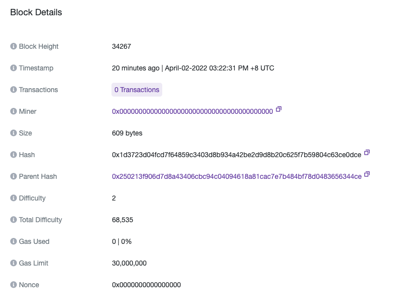

	从上图数据可以推导数据如下

	- 单空块大小为 609 字节
	- 如果2秒出一个块
		- 25MB/24小时
		- 8GB/365 天 
		- 80GB/10年 
		- 400GB/50年
	- 如果5秒出一个块
		- 10MB/24小时
		- 3.56GB/365 天 
		- 35.6GB/10年 
		- 178GB/50年 
	
	单节点区块链节点存储盘为2TB比较合理	
- 压测 tx 合约数据基准
	- 测试合约
		- tx
			- 26,455/gasuse
			- 1134tx/块(数据预测)
				- 2秒/块
					- 567/tps 
				- 5秒/块
					- 226/tps
			- max 1131tx/块(数据实测)
				- 2秒/块
					- 401/tps 
				- 5秒/块
					- 232/tps    

#### geth 设置参数参考
-  poa 公链
	- 5 秒一个块
	- 每个块 3000万 gaslimit
-  polycon 公链
	- 2 秒一个块
	- 每个块 3000万 gaslimit
-  solarchan 性能测试链
	- 2 秒一个块
	- 每个块 3000万 gaslimit

## 单共识压力测试
### 测试目的
对压测软件和自部署 eth 有一定的认识
### 测试硬件条件
- 网络环境
	- 全内网 
- 共识节点
	- 硬件
		- cpu*4
		- 内存*8
		- 磁盘*100/ucloud rssd
		- 千兆网络+hostport 
	- 操作系统
		- Rocky Linux 8.5
	- 软件版本
		- Geth/v1.10.17-stable-25c9b49f/linux-amd64/go1.18
- 客户端节点
	- 硬件
		- cpu*2
		- 内存*4
		- 磁盘*20/ucloud rssd
		- 千兆网络+hostport 
	-  操作系统
		-  ubuntu 20.04
	- 软件版本
		- commit  ee5a31e2ec7d7ef7eb37bba5c378168120a77d25 
	
### 测试第一轮
#### 压测请求对象
客户端直接请求共识节点 API，没有经过普通节点
#### eth 参数
- 基础设置参考 poa 公链
	- 5秒一个块
	- 每个块 3000万 gaslimit
- 详细参数
	- 命令行
		
			command: ["geth"]
			  args:
			    - --config
			    - /root/config/config.custom.toml
			    - --http
			    - --ws
			    - --allow-insecure-unlock
			    - --rpc.allow-unprotected-txs
			    - --gcmode=archive
			    - --unlock
			    - 631cb5db2476e55e5886e0a7d1cdc02701c4a581
			    - --password
			    - /root/.ethereum/password
			    - --mine
			    - --nodiscover
			    - --metrics
			    - --metrics.addr=0.0.0.0
			    - --miner.gaslimit=30000000
	- 配置	
		
			config: |
			  [Eth]
			  NetworkId = 65533
			  SyncMode = "full"
			
			  [Node]
			  HTTPHost = "0.0.0.0"
			  HTTPModules = ["eth", "net", "web3", "personal", "txpool"]
			
			  [Metrics]
			  HTTP = "0.0.0.0"
			
			  [Node.P2P]
			  StaticNodes = []
			  TrustedNodes = []
	- 创始块配置	
		
		创始块配置按照每5秒一个块，每个块 3000w gaslimit 的 poa 公链设置
		
			genesis: '{"config":{"chainId": 65533,"homesteadBlock":0,"eip150Block":0,"eip150Hash":"0x0000000000000000000000000000000000000000000000000000000000000000","eip155Block":0,"eip158Block":0,"byzantiumBlock":0,"constantinopleBlock":0,"petersburgBlock":0,"istanbulBlock":0,"clique":{"period":5,"epoch":30000}},"extradata":"0x0000000000000000000000000000000000000000000000000000000000000000631cb5db2476e55e5886e0a7d1cdc02701c4a5810000000000000000000000000000000000000000000000000000000000000000000000000000000000000000000000000000000000000000000000000000000000","gasLimit":"30000000","coinbase":"0x0000000000000000000000000000000000000000","difficulty":"0x1","mixHash":"0x0000000000000000000000000000000000000000000000000000000000000000","alloc":{"0000000000000000000000000000000000000000":{"balance":"0x1"},"631cb5db2476e55e5886e0a7d1cdc02701c4a581":{"balance":"0x200000000000000000000000000000000000000000000000000000000000000"}},"nonce":"0x0000000000000123","number":"0x0","gasUsed":"0x0","parentHash":"0x0000000000000000000000000000000000000000000000000000000000000000","baseFeePerGas":null}'
			key: '{"address":"631cb5db2476e55e5886e0a7d1cdc02701c4a581","crypto":{"cipher":"aes-128-ctr","ciphertext":"67b2fe8cf0acb5b8221883a1219e5cc46b9a5345bddad481a1775f4bdc2d37f6","cipherparams":{"iv":"f351d571f83ff30c25e3ded259efaa67"},"kdf":"scrypt","kdfparams":{"dklen":32,"n":262144,"p":1,"r":8,"salt":"c99e8936a62de9719501d9e3f38c08a896820d5dd9c7689195fe84a079b42250"},"mac":"9ccf8654d97369bd9acb7bec5eb72f1e56e84d781aa86501b9407270e3b1eeeb"},"id":"18a30473-c74e-4f6b-a2e2-d11949c70d03","version":3}'      
			
#### 共识节点主机硬件监控
- cpu
	- use
	
		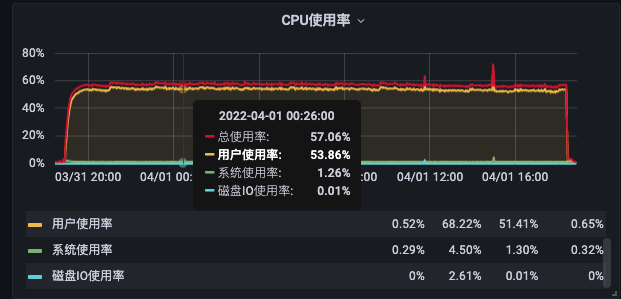
	- load

		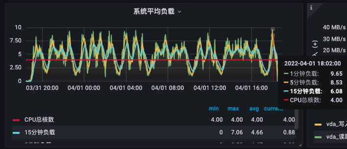
- mem

	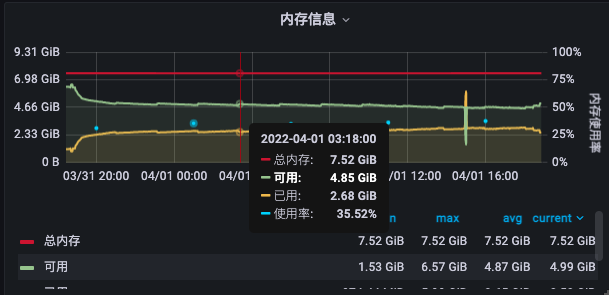	
- network

	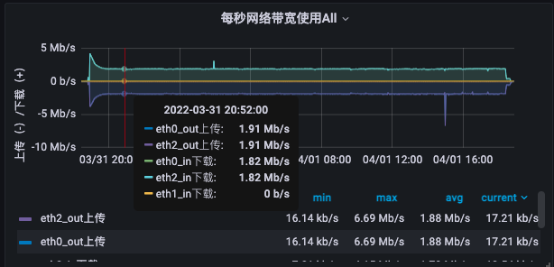
- other

	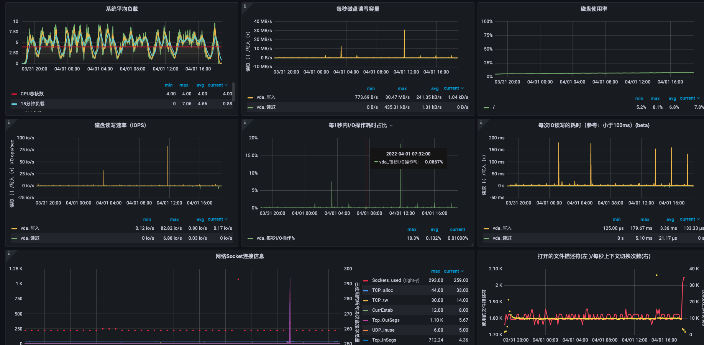
	
#### [游览器](http://106.75.120.70:4000/)查询数据
- 抽取块数据
	- 块信息 
	
		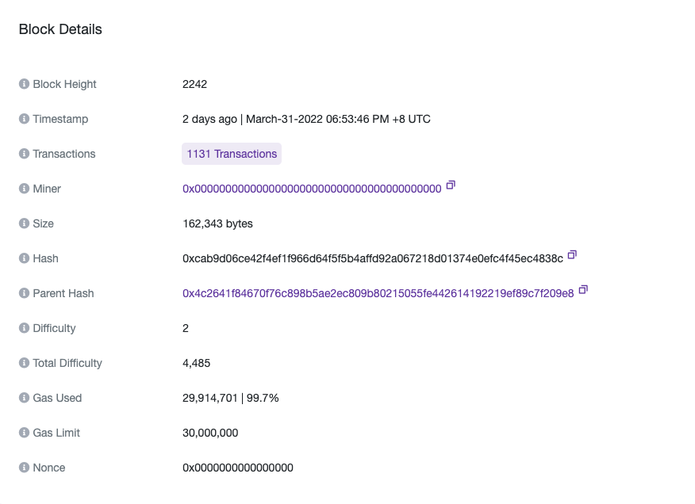
	- 块交易列表

		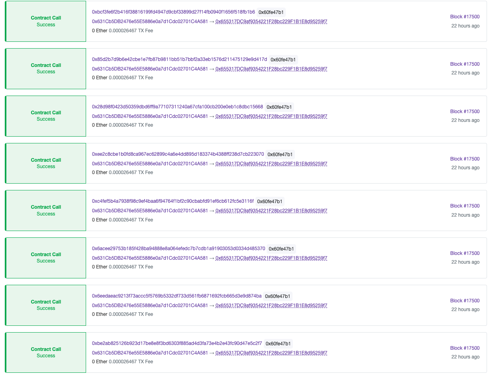
- 抽取单条交易数据
	
	 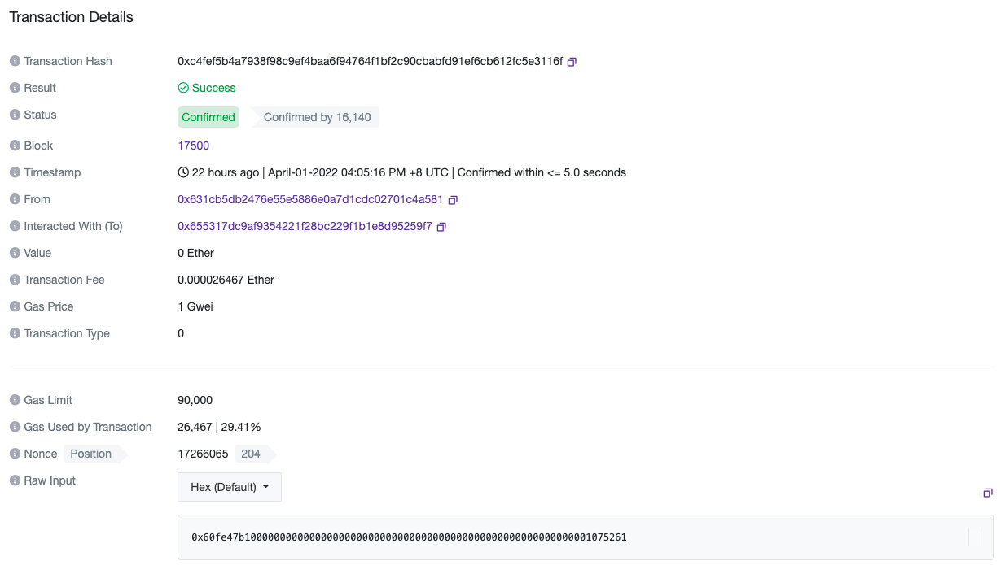

#### 测试客户端结果
	top - 16:52:05 up 8 days,  5:08,  2 users,  load average: 0.43, 0.42, 0.23
	Tasks: 120 total,   1 running,  62 sleeping,   0 stopped,   0 zombie
	%Cpu(s): 24.4 us,  1.7 sy,  0.0 ni, 72.4 id,  0.0 wa,  0.5 hi,  1.0 si,  0.0 st
	KiB Mem :  3832676 total,  2774356 free,   220268 used,   838052 buff/cache
	KiB Swap:        0 total,        0 free,        0 used.  3358528 avail Mem
	
	  PID USER      PR  NI    VIRT    RES    SHR S  %CPU %MEM     TIME+ COMMAND
	14785 root      20   0  190060  76604  10792 S  51.8  2.0   5:11.16 python3
	14772 root      20   0  155452  41924  10624 S   0.3  1.1   0:05.90 python3
#### 服务端结果
- 图形

	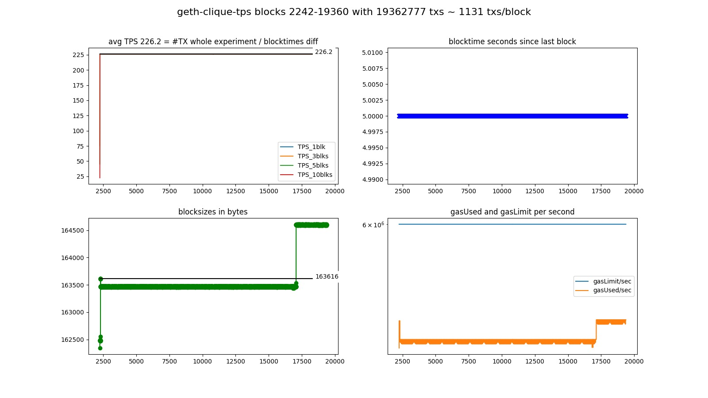
- 文本

		(geth-tps) Geth v1.10.17 with 19440000 txs: 0.0 TPS
		information:
		NODE: Geth/v1.10.17-stable-25c9b49f/linux-amd64/go1.18 on http://172.17.57.222:8545
		      consensus=clique chain_name=poa chain_id=65533 network_id=65533
		SEND: 19440000 transactions in blocks 2242-2242 with 10 empty blocks following.
		      A sample of transactions looked as if they: failed (at least partially).
		TPS:  The stopclock watcher measured a final TPS of 232.0 since contract deploy,
		      and in between saw values as high as 227.1 TPS.
		DIAG: The whole experiment was prefixed 'geth-tps'.
		      The diagrams were saved into 'no-diagram-created-because-less-than-2-filled-blocks'.
		      Looking only at the experiment block-timestamps, the overall TPS was ~0.0.
		log:
		versions: web3 4.8.2, py-solc: 3.2.0, solc 0.4.25+commit.59dbf8f1.Linux.gpp, testrpc 1.3.5, python 3.6.9 (default, Dec  8 2021, 21:08:43) [GCC 8.4.0]
		web3 connection established, blockNumber = 2240, node version string =  Geth/v1.10.17-stable-25c9b49f/linux-amd64/go1.18
		first account of node is 0x631Cb5DB2476e55E5886e0a7d1Cdc02701C4A581, balance is 904625697166532776746648320380374280103671755200316906558.262375061821325312 Ether
		nodeName: Geth, nodeType: Geth, nodeVersion: v1.10.17-stable-25c9b49f, consensus: clique, network: 65533, chainName: poa, chainId: 65533
		
		Block  2240  - waiting for something to happen
		(filedate 1648723741) last contract address: 0x51E32B11B9322352Ee00Cca3cd554E346cA56799
		(filedate 1648724021) new contract address: 0x655317DC9af9354221F28bc229F1B1E8d95259f7
		
		blocknumber_start_here = 2241
		starting timer, at block 2241 which has  1  transactions; at epochtime 1648724021.198591
		block 2242 | new #TX 1131 / 5000 ms = 226.2 TPS_current | total: #TX 1132 /  4.9 s = 232.0 TPS_average (peak  is 232.0 TPS_average)
		block 2243 | new #TX 1132 / 5000 ms = 226.4 TPS_current | total: #TX 2264 / 10.1 s = 224.9 TPS_average (peak  is 224.9 TPS_average)
		block 2244 | new #TX 1132 / 5000 ms = 226.4 TPS_current | total: #TX 3396 / 14.9 s = 227.2 TPS_average (peak  is 227.2 TPS_average)
		block 2245 | new #TX 1132 / 5000 ms = 226.4 TPS_current | total: #TX 4528 / 20.1 s = 224.9 TPS_average (peak  is 224.9 TPS_average)
		block 2246 | new #TX 1132 / 5000 ms = 226.4 TPS_current | total: #TX 5660 / 25.0 s = 226.2 TPS_average (peak  is 226.2 TPS_average)
		block 2247 | new #TX 1132 / 5000 ms = 226.4 TPS_current | total: #TX 6792 / 29.9 s = 227.1 TPS_average (peak  is 227.1 TPS_average)
		block 2248 | new #TX 1132 / 5000 ms = 226.4 TPS_current | total: #TX 7924 / 35.1 s = 225.8 TPS_average (peak was 227.1 TPS_average)
		block 2249 | new #TX 1132 / 5000 ms = 226.4 TPS_current | total: #TX 9056 / 40.0 s = 226.6 TPS_average (peak was 227.1 TPS_average)
		block 2250 | new #TX 1132 / 5000 ms = 226.4 TPS_current | total: #TX 10188 / 45.1 s = 225.7 TPS_average (peak was 227.1 TPS_average)
		.....
		#TX 19352599 / 85554.9 s = 226.2 TPS_average (peak was 227.1 TPS_average)
		block 19353 | new #TX 1131 / 5000 ms = 226.2 TPS_current | total: #TX 19353730 / 85560.1 s = 226.2 TPS_average (peak was 227.1 TPS_average)
		block 19354 | new #TX 1131 / 5000 ms = 226.2 TPS_current | total: #TX 19354861 / 85565.0 s = 226.2 TPS_average (peak was 227.1 TPS_average)
		block 19355 | new #TX 1131 / 5000 ms = 226.2 TPS_current | total: #TX 19355992 / 85569.9 s = 226.2 TPS_average (peak was 227.1 TPS_average)
		block 19356 | new #TX 1131 / 5000 ms = 226.2 TPS_current | total: #TX 19357123 / 85575.1 s = 226.2 TPS_average (peak was 227.1 TPS_average)
		block 19357 | new #TX 1131 / 5000 ms = 226.2 TPS_current | total: #TX 19358254 / 85580.0 s = 226.2 TPS_average (peak was 227.1 TPS_average)
		block 19358 | new #TX 1131 / 5000 ms = 226.2 TPS_current | total: #TX 19359385 / 85584.9 s = 226.2 TPS_average (peak was 227.1 TPS_average)
		block 19359 | new #TX 1131 / 5000 ms = 226.2 TPS_current | total: #TX 19360516 / 85590.1 s = 226.2 TPS_average (peak was 227.1 TPS_average)
		block 19360 | new #TX 1131 / 5000 ms = 226.2 TPS_current | total: #TX 19361647 / 85595.0 s = 226.2 TPS_average (peak was 227.1 TPS_average)
		Received signal from send.py = updated INFOFILE.
		Experiment ended! Current blocknumber = 19360
		Updated info file: last-experiment.json THE END.
		....	 
		info raw
		{'diagrams': {'blocktimestampsTpsAv': 0, 'filename': 'no-diagram-created-because-less-than-2-filled-blocks', 'prefix': 'geth-tps'}, 'node': {'chain_id': 65533, 'chain_name': 'poa', 'consensus': 'clique', 'name': 'Geth', 'network_id': 65533, 'rpc_address': 'http://172.17.57.222:8545', 'type': 'Geth', 'version': 'v1.10.17-stable-25c9b49f', 'web3.version.node': 'Geth/v1.10.17-stable-25c9b49f/linux-amd64/go1.18'}, 'send': {'block_first': 2242, 'block_last': 2242, 'empty_blocks': 10, 'num_txs': 19440000, 'sample_txs_successful': False}, 'tps': {'finalTpsAv': 232.00721653254368, 'peakTpsAv': 227.0949998952504, 'start_epochtime': 1648724021.198591}}
		
#### 测试结果
- 从软硬件测试结果看
	- 硬件

		从资源监控看，硬件除了 CPU 使用率高、内存较高外，其他硬件均较为正常
	- 软件
		- 总共测试交易 19440000 
		- 测试区块
			- 2241 是创建测试合约 
			- 2242-19360，但实际是19430(问题有待查询),约等于24小时
		- 最终平均是 232/s (注意这个测试使用1个账户测试，多用户可能不同) 
		- 失败交易待查？？
- 测试中掺杂真实转账交易
	
	中间测试过程掺杂了真实转账交易，会进入pending状态，必须等压测完成重新激活才可以发布，这样证明该压力情况下，正常业务已经被堵塞。但是压力过后会马上恢复
- 实际情况可能性能相对有所下降需要测试

	当前测试使用合约和调用均是简单调用，只能测试共识节点 tx 打包能力，以下情况可能影响测试结果
	
	- 多共识节点
	- 只读业务节点接收交易
	- 共识节点与业务节点跨公网
	- 合约复杂度提升	

### 测试第二轮
#### 测试目标
通过优化参数提升 tps
#### 硬件修改指标
- 网络环境
	- 全内网 
- 客户端节点(维持不变)
- 链节点
	- 共识节点*3
		- 硬件系统维持不变
	- 普通节点*2
		- 硬件
			- cpu*4
			- 内存*8
			
#### 压测请求对象
客户端直接请求共识节点 API，没有经过普通节点
#### eth 参数
其他参数不变只变更出块时间，从5秒一个块到2 秒一个块，其他参数不变测试
#### 共识节点主机硬件监控
- cpu
	- use
	
		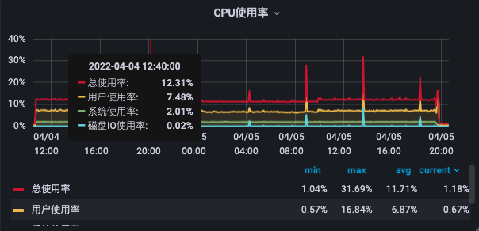
	- load

		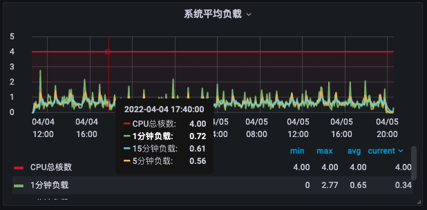
- mem

	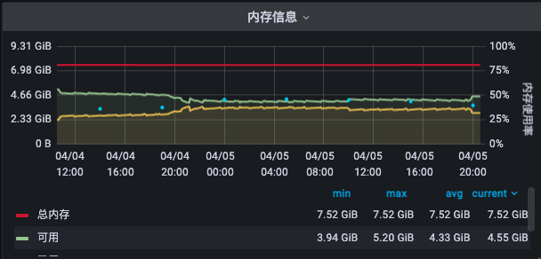	
- network

	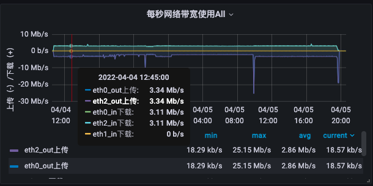
- other

	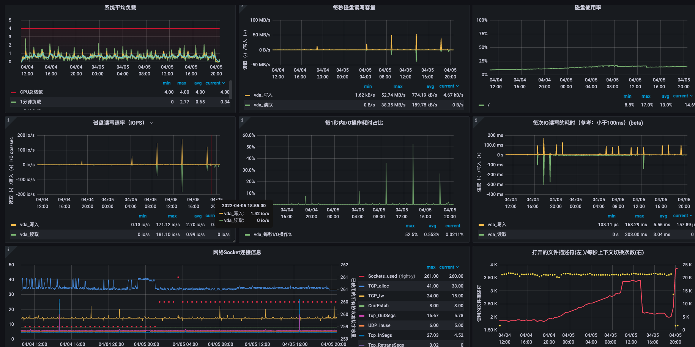
	
#### [游览器](http://106.75.120.70:4000/)查询数据
- 抽取块数据
	- [创建测试合约](http://106.75.120.70:4000/block/74532/transactions)
		
		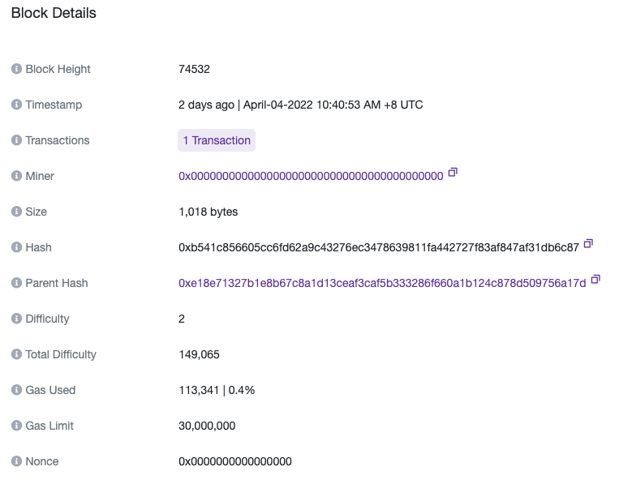
	- 负载块信息 
	
		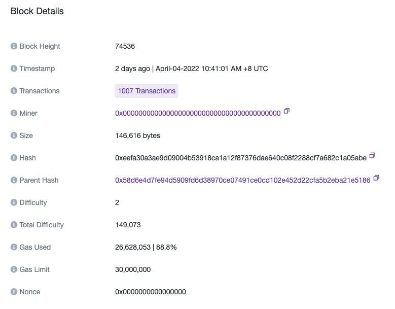
	- 块交易列表

		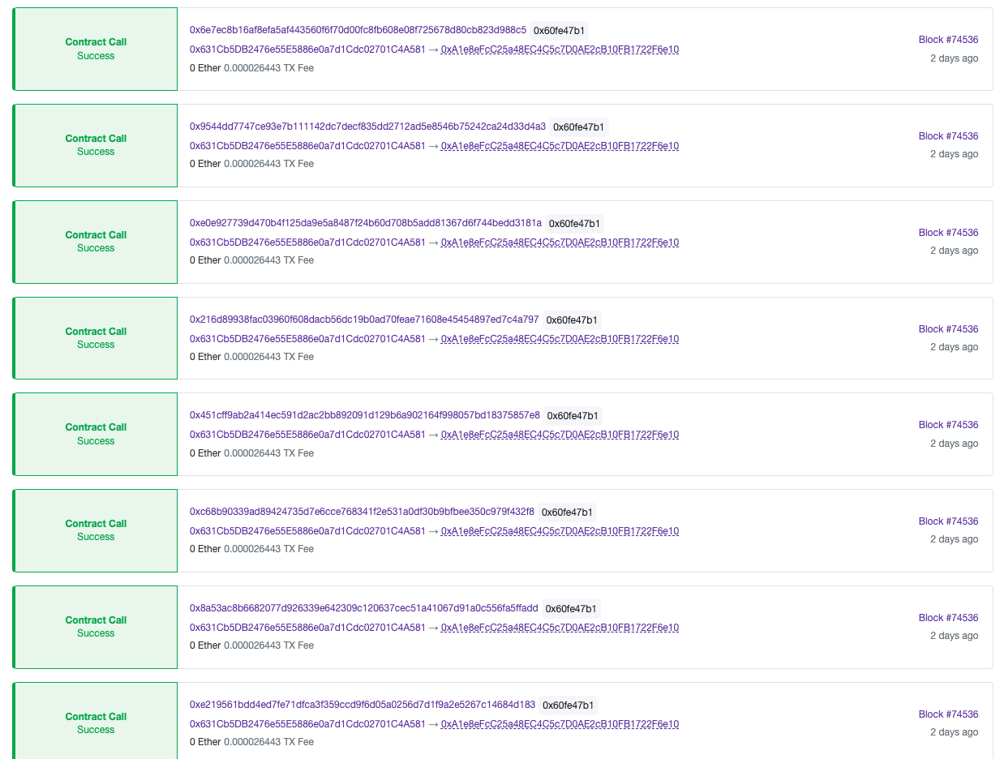
- 抽取单条交易数据
	
	 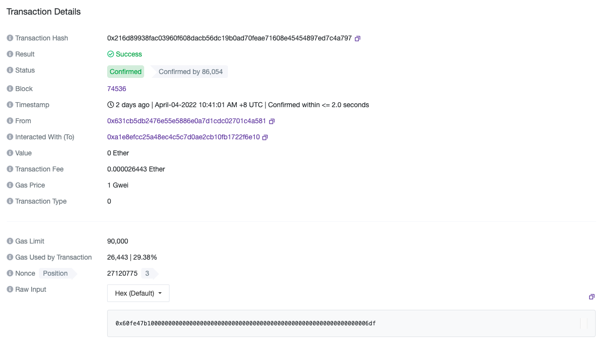

#### 测试客户端结果	
- 图形

	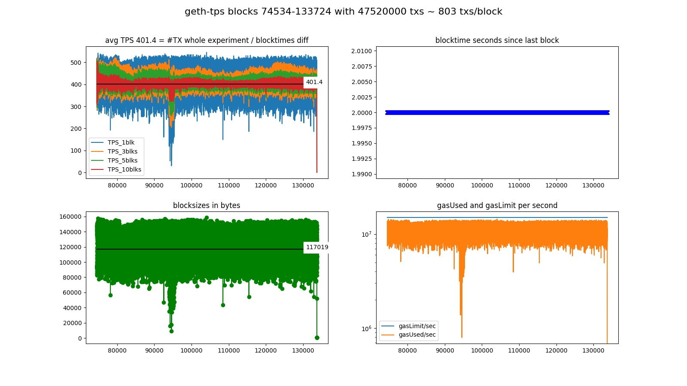
- 文本

		(geth-tps) Geth v1.10.17 with 47520000 txs: 401.4 TPS
		information:
		NODE: Geth/v1.10.17-stable-25c9b49f/linux-amd64/go1.18 on http://172.17.57.222:8545
		      consensus=clique chain_name=poa chain_id=65533 network_id=65533
		SEND: 47520000 transactions in blocks 74534-133724 with 10 empty blocks following.
		      A sample of transactions looked as if they: succeeded.
		TPS:  The stopclock watcher measured a final TPS of 401.4 since contract deploy,
		      and in between saw values as high as 459.5 TPS.
		DIAG: The whole experiment was prefixed 'geth-tps'.
		      The diagrams were saved into 'img/geth-tps-20220404-1040_blks74534-133724.png'.
		      Looking only at the experiment block-timestamps, the overall TPS was ~401.4.
		log:
		versions: web3 4.8.2, py-solc: 3.2.0, solc 0.4.25+commit.59dbf8f1.Linux.gpp, testrpc 1.3.5, python 3.6.9 (default, Dec  8 2021, 21:08:43) [GCC 8.4.0]
		web3 connection established, blockNumber = 74529, node version string =  Geth/v1.10.17-stable-25c9b49f/linux-amd64/go1.18
		first account of node is 0x631Cb5DB2476e55E5886e0a7d1Cdc02701C4A581, balance is 904625697166532776746648320380374280103671755200316806556.262375061821325312 Ether
		nodeName: Geth, nodeType: Geth, nodeVersion: v1.10.17-stable-25c9b49f, consensus: clique, network: 65533, chainName: poa, chainId: 65533
		
		Block  74529  - waiting for something to happen
		(filedate 1648895489) last contract address: 0x056463c88e8DEEe00A4990678fC649449DcC5124
		(filedate 1649040053) new contract address: 0xA1e8eFcC25a48EC4C5c7D0AE2cB10FB1722F6e10
		
		blocknumber_start_here = 74532
		starting timer, at block 74532 which has  1  transactions; at epochtime 1649040053.051406
		block 74533 | new #TX   0 / 2000 ms =   0.0 TPS_current | total: #TX    1 /  2.1 s =   0.5 TPS_average (peak  is   0.5 TPS_average)
		block 74534 | new #TX 749 / 2000 ms = 374.5 TPS_current | total: #TX  750 /  4.3 s = 175.7 TPS_average (peak  is 175.7 TPS_average)
		block 74535 | new #TX 1007 / 2000 ms = 503.5 TPS_current | total: #TX 1757 /  6.1 s = 287.0 TPS_average (peak  is 287.0 TPS_average)
		block 74536 | new #TX 1007 / 2000 ms = 503.5 TPS_current | total: #TX 2764 /  8.3 s = 333.8 TPS_average (peak  is 333.8 TPS_average)
		block 74537 | new #TX 1002 / 2000 ms = 501.0 TPS_current | total: #TX 3766 / 10.1 s = 371.7 TPS_average (peak  is 371.7 TPS_average)
		block 74538 | new #TX 1035 / 2000 ms = 517.5 TPS_current | total: #TX 4801 / 12.3 s = 390.6 TPS_average (peak  is 390.6 TPS_average)
		block 74539 | new #TX 1020 / 2000 ms = 510.0 TPS_current | total: #TX 5821 / 14.1 s = 411.6 TPS_average (peak  is 411.6 TPS_average)
		block 74540 | new #TX 1008 / 2000 ms = 504.0 TPS_current | total: #TX 6829 / 16.0 s = 426.8 TPS_average (peak  is 426.8 TPS_average)
		block 74541 | new #TX 1013 / 2000 ms = 506.5 TPS_current | total: #TX 7842 / 18.2 s = 431.9 TPS_average (peak  is 431.9 TPS_average)
		block 74542 | new #TX 1017 / 2000 ms = 508.5 TPS_current | total: #TX 8859 / 20.0 s = 442.5 TPS_average (peak  is 442.5 TPS_average)
		block 74543 | new #TX 978 / 2000 ms = 489.0 TPS_current | total: #TX 9837 / 22.2 s = 443.6 TPS_average (peak  is 443.6 TPS_average)
		block 74544 | new #TX 980 / 2000 ms = 490.0 TPS_current | total: #TX 10817 / 24.0 s = 450.2 TPS_average (peak  is 450.2 TPS_average)
		block 74545 | new #TX 1021 / 2000 ms = 510.5 TPS_current | total: #TX 11838 / 26.2 s = 452.1 TPS_average (peak  is 452.1 TPS_average)
		block 74546 | new #TX 1023 / 2000 ms = 511.5 TPS_current | total: #TX 12861 / 28.0 s = 458.7 TPS_average (peak  is 458.7 TPS_average)
		block 74547 | new #TX 1010 / 2000 ms = 505.0 TPS_current | total: #TX 13871 / 30.2 s = 459.5 TPS_average (peak  is 459.5 TPS_average)
		...
		block 133709 | new #TX 629 / 2000 ms = 314.5 TPS_current | total: #TX 47508820 / 118354.1 s = 401.4 TPS_average (peak was 459.5 TPS_average)
		block 133710 | new #TX 927 / 2000 ms = 463.5 TPS_current | total: #TX 47509747 / 118356.3 s = 401.4 TPS_average (peak was 459.5 TPS_average)
		block 133711 | new #TX 645 / 2000 ms = 322.5 TPS_current | total: #TX 47510392 / 118358.1 s = 401.4 TPS_average (peak was 459.5 TPS_average)
		block 133712 | new #TX 889 / 2000 ms = 444.5 TPS_current | total: #TX 47511281 / 118360.2 s = 401.4 TPS_average (peak was 459.5 TPS_average)
		block 133713 | new #TX 740 / 2000 ms = 370.0 TPS_current | total: #TX 47512021 / 118362.1 s = 401.4 TPS_average (peak was 459.5 TPS_average)
		block 133714 | new #TX 895 / 2000 ms = 447.5 TPS_current | total: #TX 47512916 / 118364.2 s = 401.4 TPS_average (peak was 459.5 TPS_average)
		block 133715 | new #TX 642 / 2000 ms = 321.0 TPS_current | total: #TX 47513558 / 118366.1 s = 401.4 TPS_average (peak was 459.5 TPS_average)
		block 133716 | new #TX 867 / 2000 ms = 433.5 TPS_current | total: #TX 47514425 / 118368.2 s = 401.4 TPS_average (peak was 459.5 TPS_average)
		block 133717 | new #TX 678 / 2000 ms = 339.0 TPS_current | total: #TX 47515103 / 118370.1 s = 401.4 TPS_average (peak was 459.5 TPS_average)
		block 133718 | new #TX 864 / 2000 ms = 432.0 TPS_current | total: #TX 47515967 / 118372.2 s = 401.4 TPS_average (peak was 459.5 TPS_average)
		block 133719 | new #TX 687 / 2000 ms = 343.5 TPS_current | total: #TX 47516654 / 118374.0 s = 401.4 TPS_average (peak was 459.5 TPS_average)
		block 133720 | new #TX 838 / 2000 ms = 419.0 TPS_current | total: #TX 47517492 / 118376.2 s = 401.4 TPS_average (peak was 459.5 TPS_average)
		block 133721 | new #TX 735 / 2000 ms = 367.5 TPS_current | total: #TX 47518227 / 118378.0 s = 401.4 TPS_average (peak was 459.5 TPS_average)
		block 133722 | new #TX 828 / 2000 ms = 414.0 TPS_current | total: #TX 47519055 / 118380.2 s = 401.4 TPS_average (peak was 459.5 TPS_average)
		block 133723 | new #TX 592 / 2000 ms = 296.0 TPS_current | total: #TX 47519647 / 118382.0 s = 401.4 TPS_average (peak was 459.5 TPS_average)
		block 133724 | new #TX 354 / 2000 ms = 177.0 TPS_current | total: #TX 47520001 / 118384.2 s = 401.4 TPS_average (peak was 459.5 TPS_average)
		block 133725 | new #TX   0 / 2000 ms =   0.0 TPS_current | total: #TX 47520001 / 118386.0 s = 401.4 TPS_average (peak was 459.5 TPS_average)
		block 133726 | new #TX   0 / 2000 ms =   0.0 TPS_current | total: #TX 47520001 / 118388.1 s = 401.4 TPS_average (peak was 459.5 TPS_average)
		block 133727 | new #TX   0 / 2000 ms =   0.0 TPS_current | total: #TX 47520001 / 118390.2 s = 401.4 TPS_average (peak was 459.5 TPS_average)
		block 133728 | new #TX   0 / 2000 ms =   0.0 TPS_current | total: #TX 47520001 / 118392.1 s = 401.4 TPS_average (peak was 459.5 TPS_average)
		block 133729 | new #TX   0 / 2000 ms =   0.0 TPS_current | total: #TX 47520001 / 118394.2 s = 401.4 TPS_average (peak was 459.5 TPS_average)
		block 133730 | new #TX   0 / 2000 ms =   0.0 TPS_current | total: #TX 47520001 / 118396.0 s = 401.4 TPS_average (peak was 459.5 TPS_average)
		block 133731 | new #TX   0 / 2000 ms =   0.0 TPS_current | total: #TX 47520001 / 118398.1 s = 401.4 TPS_average (peak was 459.5 TPS_average)
		block 133732 | new #TX   0 / 2000 ms =   0.0 TPS_current | total: #TX 47520001 / 118400.0 s = 401.4 TPS_average (peak was 459.5 TPS_average)
		block 133733 | new #TX   0 / 2000 ms =   0.0 TPS_current | total: #TX 47520001 / 118402.1 s = 401.3 TPS_average (peak was 459.5 TPS_average)
		block 133734 | new #TX   0 / 2000 ms =   0.0 TPS_current | total: #TX 47520001 / 118404.2 s = 401.3 TPS_average (peak was 459.5 TPS_average)
		Received signal from send.py = updated INFOFILE.
		Experiment ended! Current blocknumber = 133734
		Updated info file: last-experiment.json THE END.
		...
		info raw
		{'diagrams': {'blocktimestampsTpsAv': 401.41283155938504, 'filename': 'img/geth-tps-20220404-1040_blks74534-133724.png', 'prefix': 'geth-tps'}, 'node': {'chain_id': 65533, 'chain_name': 'poa', 'consensus': 'clique', 'name': 'Geth', 'network_id': 65533, 'rpc_address': 'http://172.17.57.222:8545', 'type': 'Geth', 'version': 'v1.10.17-stable-25c9b49f', 'web3.version.node': 'Geth/v1.10.17-stable-25c9b49f/linux-amd64/go1.18'}, 'send': {'block_first': 74534, 'block_last': 133724, 'empty_blocks': 10, 'num_txs': 47520000, 'sample_txs_successful': True}, 'tps': {'finalTpsAv': 401.40501631801055, 'peakTpsAv': 459.45822222379286, 'start_epochtime': 1649040053.051406}}
		
#### 测试结果
- 从软硬件测试结果看
	- 硬件

		从资源监控看，硬件除了 CPU 使用率高、内存较高外，其他硬件均较为正常
	- 软件
		- 总共测试交易 47520000 
		- 测试区块
			- 74532 是创建测试合约 
			- 74534-133724，但实际是19430(问题有待查询),约等于32小时
		- 最终平均是 401/s (注意这个测试使用1个账户测试，多用户可能不同) 
		- 失败交易待查？？
- 测试中掺杂真实转账交易
	
	中间测试过程掺杂了真实转账交易，因为块的 gaslimit 在串行压力情况下没有100%块吃满，所以使用钱包交易的时候可以正常进行业务处理。没有堵塞
	
	- 解决问题：
	
		因为跨了2次初始化 geth ，所以导致我使用的 metamsk 钱包维护的 nonce 与链不相符，所以发送交易在区块链上无法执行，必须补齐之前的 nonce 才可以执行。 
- 实际情况可能性能相对有所下降需要测试

	当前测试使用合约和调用均是简单调用，只能测试共识节点 tx 打包能力，以下情况可能影响测试结果
	
	- 多共识节点
	- 只读业务节点接收交易
	- 共识节点与业务节点跨公网
	- 合约复杂度提升	

- 测试中遇到的问题
	- 客户端崩溃
		- 因为硬件不足，性能瓶颈解决，如果是测试2s/3000万limit 最少4c16g
	- 游览器崩溃
		- 同样是因为硬件不足，所以增扩，性能瓶颈解决，如果是测试2s/3000万limit 最少 32c32g2TB  

## 三共识2普通压力测试
### 测试目的
对内网环境多机共识，以及共识与应用请求节点分开方案测试
### 测试硬件条件
- 网络环境
	- 全内网 
- 共识节点*3(承担矿工出块)
	- 硬件
		- cpu*4
		- 内存*8
		- 磁盘*100/ucloud rssd
		- 千兆网络+hostport 
	- 操作系统
		- Rocky Linux 8.5
	- 软件版本
		- Geth/v1.10.17-stable-25c9b49f/linux-amd64/go1.18
- 普通节点*2(承担应用请求区块链需求，其中一个给本次测试使用，还有一个给浏览器使用)
	- 硬件
		- cpu*4
		- 内存*8
		- 磁盘*100/ucloud rssd
		- 千兆网络+hostport 
	- 操作系统
		- Rocky Linux 8.5
	- 软件版本
		- Geth/v1.10.17-stable-25c9b49f/linux-amd64/go1.18
- 客户端节点*2
	- 压测客户端 
		- 硬件
			- cpu*8
			- 内存*16
			- 磁盘*20/ucloud rssd
			- 千兆网络+hostport 
		-  操作系统
			-  ubuntu 20.04
		- 软件版本
			- commit  ee5a31e2ec7d7ef7eb37bba5c378168120a77d25
	- 区块链游览器
		- 硬件
			- cpu*8
			- 内存*8
			- 磁盘*20/ucloud rssd
			- 千兆网络+hostport 
		-  操作系统
			-  ubuntu 20.04
		- 软件版本
			-  https://github.com/paradeum-team/blockscout/tree/pld
				- commit 20915d388d75e69fce384c046528fdf548e24b6a (HEAD -> pld, origin/pld)  
    		
### 测试第一轮
#### eth 参数
- 共识节点
	- 启动参数
	
			  command: ["geth"]
			  args:
			    - --config
			    - /root/config/config.custom.toml
			    - --http
			    - --ws
			    - --allow-insecure-unlock
			    - --rpc.allow-unprotected-txs
			    - --gcmode=archive
			    - --unlock
			    - 0fbf567d26e9de3c30852d5158a5d1f8b980e115
			    - --password
			    - /root/.ethereum/password
			    - --mine
			    - --nodiscover
			    - --metrics
			    - --miner.gaslimit=30000000
			    - --metrics.influxdb
			    - --metrics.influxdb.endpoint=http://gethtps-influxdb.geth.svc:8086
			    - --metrics.influxdb.tags=host=tps1-singer-node
			    - --txpool.locals=0x8fc5ed7fc1192296892d39180cf13389f8e45ddf
	- 配置

			config: |
			  [Eth]
			  NetworkId = 65533
			  SyncMode = "full"
			
			  [Node]
			  HTTPHost = "0.0.0.0"
			  HTTPModules = ["eth", "net", "web3", "txpool"]
			
			  [Metrics]
			  HTTP = "0.0.0.0"
			
			  [Node.P2P]
			  StaticNodes = ["enode://dba42fb77bfe591a00c7222b87a91f8cf979fc53951ab040d88bca7658b4ac02acd00aa93d1f2abd73f833d4cf12b0c2aa0616fe57bbb152acd007ddf112a552@172.17.57.222:30303?discport=0","enode://b7f42d624682dc82738c75cec5f0fa4354a1611ce376a48bb41304e9a8c7b8c1216f755cbe9f2bba630be98cac1a8fbebcc2c485da1fbc572ecd3de345e1b8fd@172.17.187.248:30303?discport=0","enode://0a8bed0332d944ddf55bf74dda8c15ebcbeb150f5be6190279c04730e8f1057d7801790d34474611467b6edfeb31b7ea6ed18fa52d5f178489b04aed90cc62de@172.17.7.209:30303?discport=0"]
			  TrustedNodes = ["enode://dba42fb77bfe591a00c7222b87a91f8cf979fc53951ab040d88bca7658b4ac02acd00aa93d1f2abd73f833d4cf12b0c2aa0616fe57bbb152acd007ddf112a552@172.17.57.222:30303?discport=0","enode://b7f42d624682dc82738c75cec5f0fa4354a1611ce376a48bb41304e9a8c7b8c1216f755cbe9f2bba630be98cac1a8fbebcc2c485da1fbc572ecd3de345e1b8fd@172.17.187.248:30303?discport=0","enode://0a8bed0332d944ddf55bf74dda8c15ebcbeb150f5be6190279c04730e8f1057d7801790d34474611467b6edfeb31b7ea6ed18fa52d5f178489b04aed90cc62de@172.17.7.209:30303?discport=0"] 
	- 创世块

			genesis: '{"config":{"chainId":65533,"homesteadBlock":0,"eip150Block":0,"eip150Hash":"0x0000000000000000000000000000000000000000000000000000000000000000","eip155Block":0,"eip158Block":0,"byzantiumBlock":0,"constantinopleBlock":0,"petersburgBlock":0,"istanbulBlock":0,"clique":{"period":2,"epoch":30000}},"extradata":"0x00000000000000000000000000000000000000000000000000000000000000000fbf567d26e9de3c30852d5158a5d1f8b980e1150000000000000000000000000000000000000000000000000000000000000000000000000000000000000000000000000000000000000000000000000000000000","gasLimit":"30000000","coinbase":"0x0000000000000000000000000000000000000000","difficulty":"0x1","mixHash":"0x0000000000000000000000000000000000000000000000000000000000000000","alloc":{"0000000000000000000000000000000000000000":{"balance":"0x1"},"0fbf567d26e9de3c30852d5158a5d1f8b980e115":{"balance":"0x200000000000000000000000000000000000000000000000000000000000000"}},"nonce":"0x0000000000000123","number":"0x0","gasUsed":"0x0","parentHash":"0x0000000000000000000000000000000000000000000000000000000000000000","baseFeePerGas":null}'
- 普通节点
	- 应用普通节点
		- 命令行参数 
	
				command: ["geth"]
				  args:
				    - --config
				    - /root/config/config.custom.toml
				    - --http
				    - --ws
				    - --ws.addr=0.0.0.0
				    - --ws.origins=*
				    - --allow-insecure-unlock
				    - --rpc.allow-unprotected-txs
				    - --gcmode=archive
				    - --nodiscover
				    - --metrics
				    - --http.vhosts=*
				    - --http.corsdomain=*
				    - --nodiscover
				    - --metrics.influxdb
				    - --metrics.influxdb.endpoint=http://gethtps-influxdb.geth.svc:8086
				    - --metrics.influxdb.tags=host=tps-node
		- 配置

				config: |
				  [Eth]
				  NetworkId = 65533
				  SyncMode = "full"
				
				  [Node]
				  HTTPHost = "0.0.0.0"
				  HTTPModules = ["eth", "net", "web3", "personal", "txpool"]
				
				  [Metrics]
				  HTTP = "0.0.0.0"
				
				  [Node.P2P]
				  StaticNodes = ["enode://dba42fb77bfe591a00c7222b87a91f8cf979fc53951ab040d88bca7658b4ac02acd00aa93d1f2abd73f833d4cf12b0c2aa0616fe57bbb152acd007ddf112a552@172.17.57.222:30303?discport=0","enode://b7f42d624682dc82738c75cec5f0fa4354a1611ce376a48bb41304e9a8c7b8c1216f755cbe9f2bba630be98cac1a8fbebcc2c485da1fbc572ecd3de345e1b8fd@172.17.187.248:30303?discport=0","enode://0a8bed0332d944ddf55bf74dda8c15ebcbeb150f5be6190279c04730e8f1057d7801790d34474611467b6edfeb31b7ea6ed18fa52d5f178489b04aed90cc62de@172.17.7.209:30303?discport=0"]
				  TrustedNodes = ["enode://dba42fb77bfe591a00c7222b87a91f8cf979fc53951ab040d88bca7658b4ac02acd00aa93d1f2abd73f833d4cf12b0c2aa0616fe57bbb152acd007ddf112a552@172.17.57.222:30303?discport=0","enode://b7f42d624682dc82738c75cec5f0fa4354a1611ce376a48bb41304e9a8c7b8c1216f755cbe9f2bba630be98cac1a8fbebcc2c485da1fbc572ecd3de345e1b8fd@172.17.187.248:30303?discport=0","enode://0a8bed0332d944ddf55bf74dda8c15ebcbeb150f5be6190279c04730e8f1057d7801790d34474611467b6edfeb31b7ea6ed18fa52d5f178489b04aed90cc62de@172.17.7.209:30303?discport=0"]
	- 游览器普通节点
		- 命令行参数
		
				command: ["geth"]
				  args:
				    - --config
				    - /root/config/config.custom.toml
				    - --http
				    - --ws
				    - --ws.addr=0.0.0.0
				    - --ws.origins=*
				    - --allow-insecure-unlock
				    - --rpc.allow-unprotected-txs
				    - --gcmode=archive
				    - --nodiscover
				    - --metrics
				    - --metrics.addr=0.0.0.0
				    - --http.vhosts=*
				    - --http.corsdomain=*
				    - --metrics.influxdb
				    - --metrics.influxdb.endpoint=http://gethtps-influxdb.geth.svc:8086
				    - --metrics.influxdb.tags=host=tps-browser-node-blockscout
		- 配置

				config: |
				  [Eth]
				  NetworkId = 65533
				  SyncMode = "full"
				
				  [Node]
				  HTTPHost = "0.0.0.0"
				  HTTPModules = ["eth", "net", "web3", "txpool"]
				
				  [Metrics]
				  HTTP = "0.0.0.0"
				
				  [Node.P2P]
				  StaticNodes = ["enode://dba42fb77bfe591a00c7222b87a91f8cf979fc53951ab040d88bca7658b4ac02acd00aa93d1f2abd73f833d4cf12b0c2aa0616fe57bbb152acd007ddf112a552@172.17.57.222:30303?discport=0","enode://b7f42d624682dc82738c75cec5f0fa4354a1611ce376a48bb41304e9a8c7b8c1216f755cbe9f2bba630be98cac1a8fbebcc2c485da1fbc572ecd3de345e1b8fd@172.17.187.248:30303?discport=0","enode://0a8bed0332d944ddf55bf74dda8c15ebcbeb150f5be6190279c04730e8f1057d7801790d34474611467b6edfeb31b7ea6ed18fa52d5f178489b04aed90cc62de@172.17.7.209:30303?discport=0"]
				  TrustedNodes = ["enode://dba42fb77bfe591a00c7222b87a91f8cf979fc53951ab040d88bca7658b4ac02acd00aa93d1f2abd73f833d4cf12b0c2aa0616fe57bbb152acd007ddf112a552@172.17.57.222:30303?discport=0","enode://b7f42d624682dc82738c75cec5f0fa4354a1611ce376a48bb41304e9a8c7b8c1216f755cbe9f2bba630be98cac1a8fbebcc2c485da1fbc572ecd3de345e1b8fd@172.17.187.248:30303?discport=0","enode://0a8bed0332d944ddf55bf74dda8c15ebcbeb150f5be6190279c04730e8f1057d7801790d34474611467b6edfeb31b7ea6ed18fa52d5f178489b04aed90cc62de@172.17.7.209:30303?discport=0"]    			 	  	
#### 主机硬件监控
- 共识节点

	共识节点，资源使用相差不大，故选用其中1台做基准指标
	
	- cpu
		- use
		
			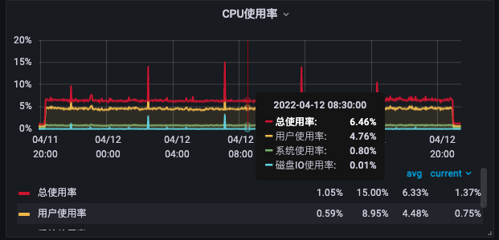
		- load
	
			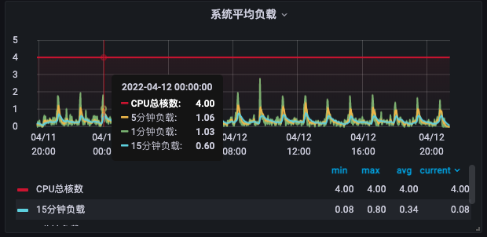
	- mem
	
		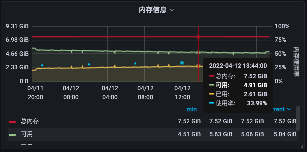	
	- network
	
		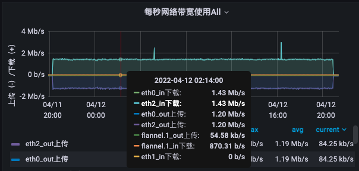
	- other
	
		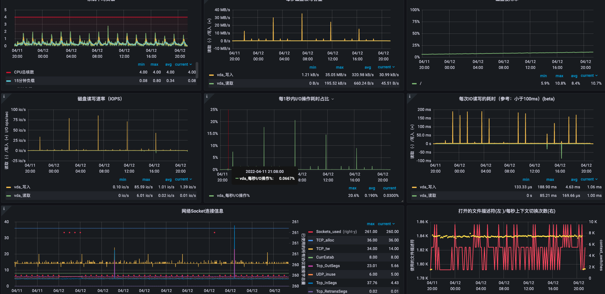
- 压测客户端普通链节点 
	- cpu
		- use
		
			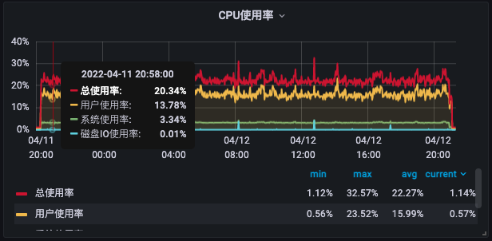
		- load
	
			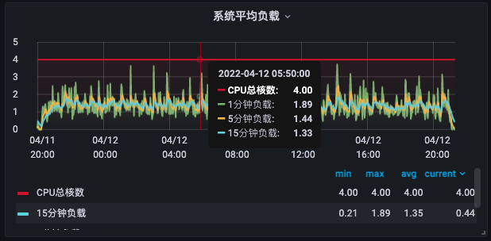
	- mem
	
		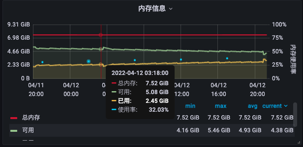
	- network
	
		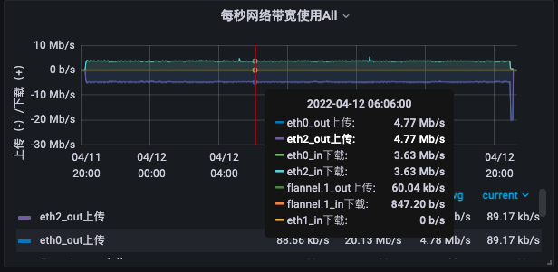
	- other
	
		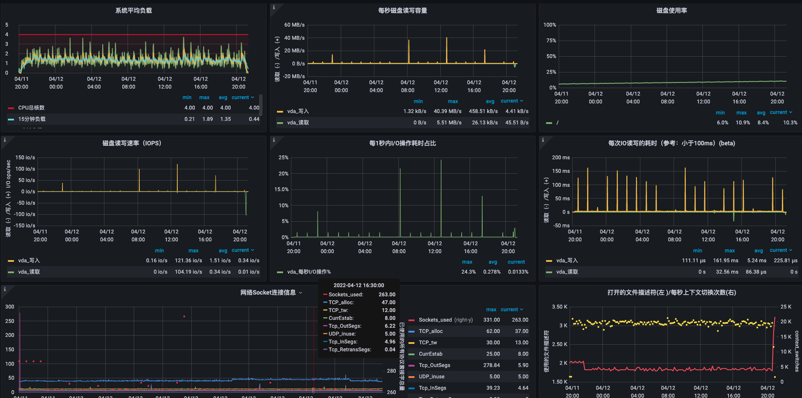
- 浏览器普通链节点
	- cpu
		- use
		
			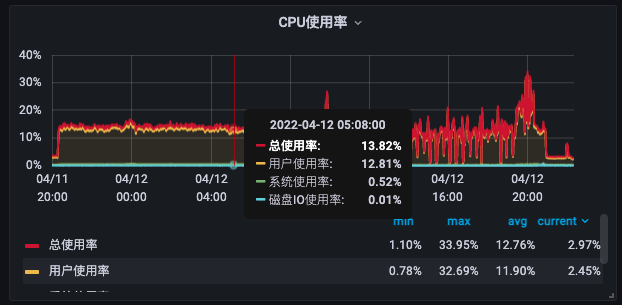
		- load
	
			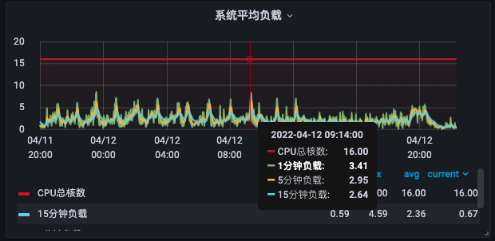
	- mem
	
		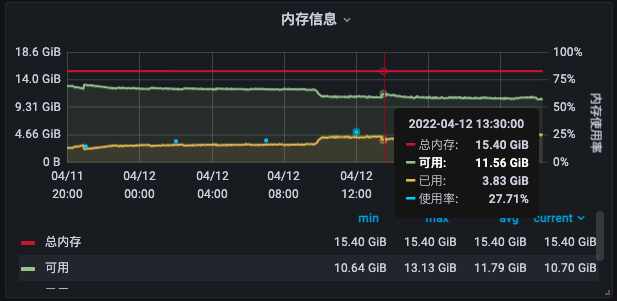
	- network
	
		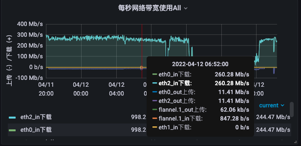
	- other
	
		
- 压测客户端节点	
	- cpu
		- use
		
			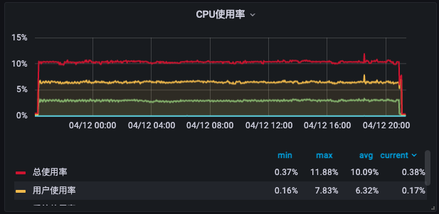
		- load
	
			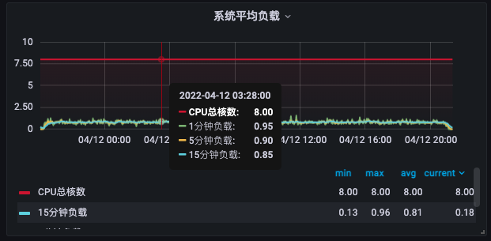
	- mem
	
		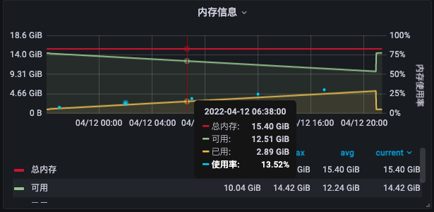
	- network
	
		
	- other
	
		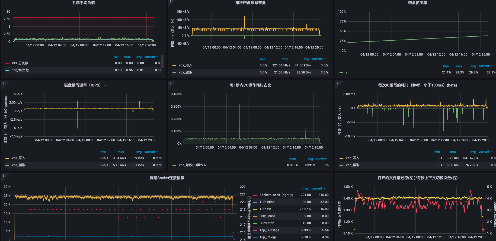
- 游览器节点
	- cpu
		- use
		
			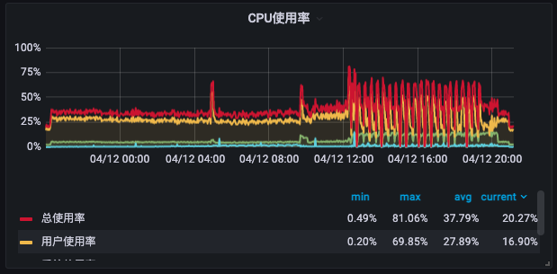
		- load
	
			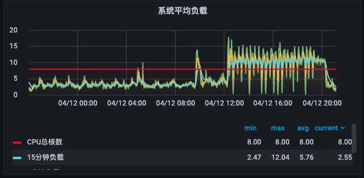
	- mem
	
		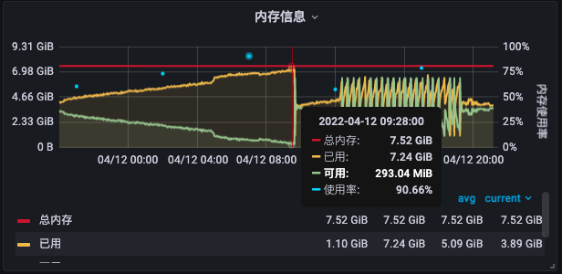
	- network
	
		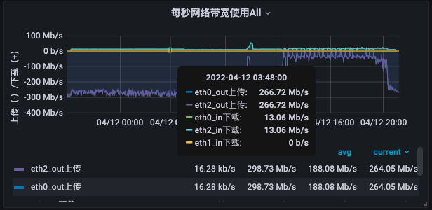
	- other
	
		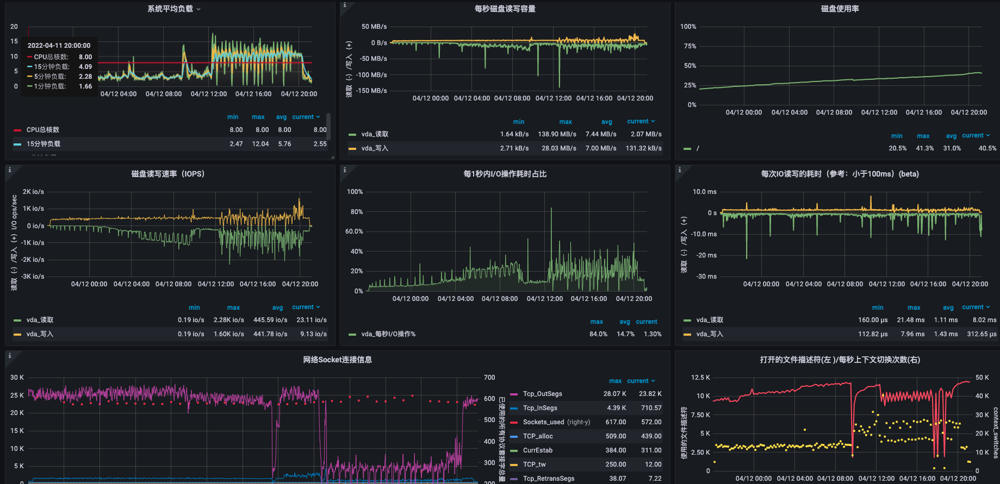			
#### [游览器](http://106.75.120.70:4000/)查询数据
- 抽取块数据
	- [创建测试合约](http://106.75.120.70:4000/block/74532/transactions)
		
		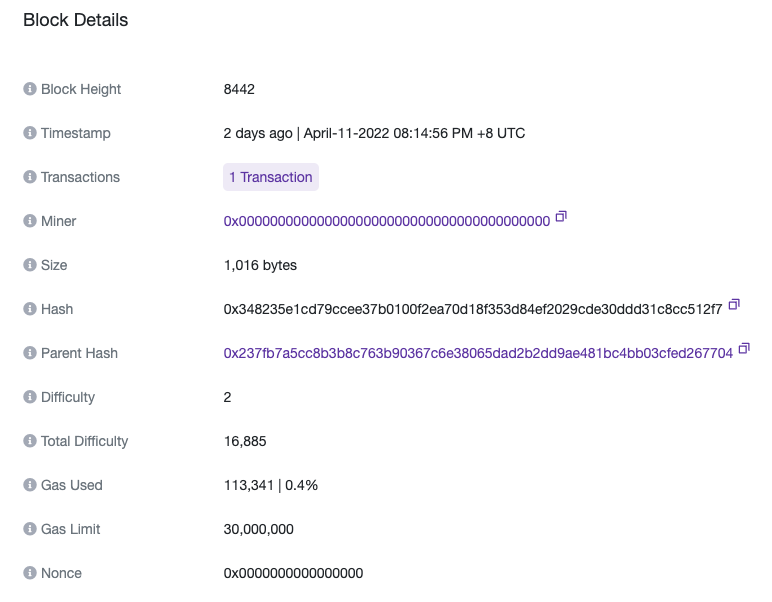
	- 负载块信息 
	
		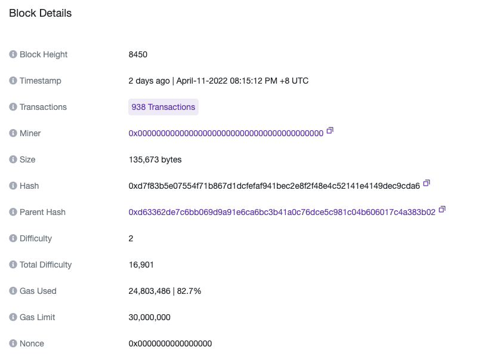
	- 块交易列表

		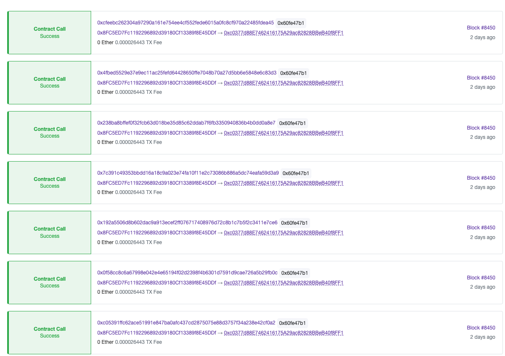
- 抽取单条交易数据
	
	 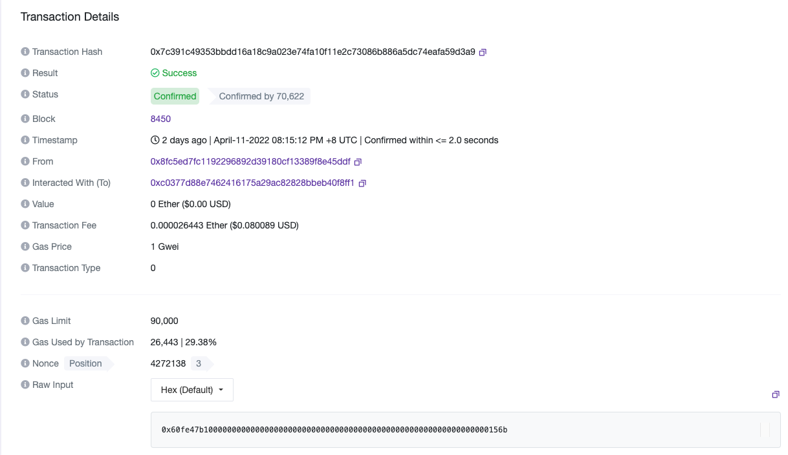

#### 测试客户端结果	
- 图形

	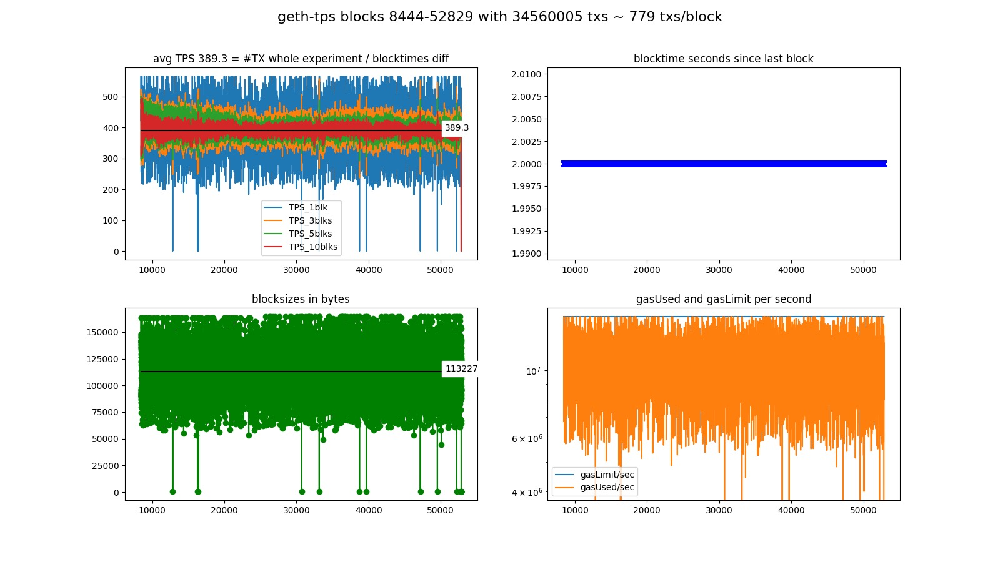
- 文本

		(geth-tps) Geth v1.10.17 with 34560000 txs: 389.3 TPS
		information:
		NODE: Geth/v1.10.17-stable-25c9b49f/linux-amd64/go1.18 on http://172.17.50.188:8545
		      consensus=clique chain_name=poa chain_id=65533 network_id=65533
		SEND: 34560000 transactions in blocks 8444-52829 with 10 empty blocks following.
		      A sample of transactions looked as if they: succeeded.
		TPS:  The stopclock watcher measured a final TPS of 389.3 since contract deploy,
		      and in between saw values as high as 443.7 TPS.
		DIAG: The whole experiment was prefixed 'geth-tps'.
		      The diagrams were saved into 'img/geth-tps-20220411-2014_blks8444-52829.png'.
		      Looking only at the experiment block-timestamps, the overall TPS was ~389.3.
		log:
		versions: web3 4.8.2, py-solc: 3.2.0, solc 0.4.25+commit.59dbf8f1.Linux.gpp, testrpc 1.3.5, python 3.6.9 (default, Dec  8 2021, 21:08:43) [GCC 8.4.0]
		web3 connection established, blockNumber = 8439, node version string =  Geth/v1.10.17-stable-25c9b49f/linux-amd64/go1.18
		first account of node is 0x8FC5ED7Fc1192296892d39180Cf13389f8E45DDf, balance is 99999989887.128260527 Ether
		nodeName: Geth, nodeType: Geth, nodeVersion: v1.10.17-stable-25c9b49f, consensus: clique, network: 65533, chainName: poa, chainId: 65533
		
		Block  8439  - waiting for something to happen
		(filedate 1649673926) last contract address: 0x455860973AC8f84bc1Db80ad90aFC716EdcE88A4
		(filedate 1649679296) new contract address: 0xc0377d88E7462416175A29ac82828BBeB40f8FF1
		
		blocknumber_start_here = 8442
		starting timer, at block 8442 which has  1  transactions; at epochtime 1649679296.0485916
		block 8443 | new #TX   0 / 2000 ms =   0.0 TPS_current | total: #TX    1 /  2.7 s =   0.4 TPS_average (peak  is   0.4 TPS_average)
		block 8444 | new #TX 649 / 2000 ms = 324.5 TPS_current | total: #TX  650 /  4.9 s = 133.7 TPS_average (peak  is 133.7 TPS_average)
		block 8445 | new #TX 919 / 2000 ms = 459.5 TPS_current | total: #TX 1569 /  6.1 s = 257.2 TPS_average (peak  is 257.2 TPS_average)
		block 8446 | new #TX 958 / 2000 ms = 479.0 TPS_current | total: #TX 2527 /  8.2 s = 306.4 TPS_average (peak  is 306.4 TPS_average)
		block 8447 | new #TX 1132 / 2000 ms = 566.0 TPS_current | total: #TX 3659 / 10.1 s = 362.2 TPS_average (peak  is 362.2 TPS_average)
		block 8448 | new #TX 889 / 2000 ms = 444.5 TPS_current | total: #TX 4548 / 12.9 s = 353.8 TPS_average (peak was 362.2 TPS_average)
		block 8449 | new #TX 935 / 2000 ms = 467.5 TPS_current | total: #TX 5483 / 14.1 s = 389.0 TPS_average (peak  is 389.0 TPS_average)
		block 8450 | new #TX 938 / 2000 ms = 469.0 TPS_current | total: #TX 6421 / 16.2 s = 395.4 TPS_average (peak  is 395.4 TPS_average)
		block 8451 | new #TX 1007 / 2000 ms = 503.5 TPS_current | total: #TX 7428 / 18.1 s = 410.6 TPS_average (peak  is 410.6 TPS_average)
		block 8452 | new #TX 1004 / 2000 ms = 502.0 TPS_current | total: #TX 8432 / 20.8 s = 404.5 TPS_average (peak was 410.6 TPS_average)
		block 8453 | new #TX 1132 / 2000 ms = 566.0 TPS_current | total: #TX 9564 / 22.7 s = 421.4 TPS_average (peak  is 421.4 TPS_average)
		block 8454 | new #TX 841 / 2000 ms = 420.5 TPS_current | total: #TX 10405 / 24.2 s = 429.2 TPS_average (peak  is 429.2 TPS_average)
		block 8455 | new #TX 990 / 2000 ms = 495.0 TPS_current | total: #TX 11395 / 26.1 s = 436.8 TPS_average (peak  is 436.8 TPS_average)
		block 8456 | new #TX 980 / 2000 ms = 490.0 TPS_current | total: #TX 12375 / 28.8 s = 429.1 TPS_average (peak was 436.8 TPS_average)
		block 8457 | new #TX 977 / 2000 ms = 488.5 TPS_current | total: #TX 13352 / 30.1 s = 443.7 TPS_average (peak  is 443.7 TPS_average)
		....
		block 52816 | new #TX 759 / 2000 ms = 379.5 TPS_current | total: #TX 35944014 / 94118.1 s = 381.9 TPS_average (peak was 445.1 TPS_average)
		block 52817 | new #TX 930 / 2000 ms = 465.0 TPS_current | total: #TX 35944944 / 94119.6 s = 381.9 TPS_average (peak was 445.1 TPS_average)
		block 52818 | new #TX 729 / 2000 ms = 364.5 TPS_current | total: #TX 35945673 / 94121.5 s = 381.9 TPS_average (peak was 445.1 TPS_average)
		block 52819 | new #TX 859 / 2000 ms = 429.5 TPS_current | total: #TX 35946532 / 94123.6 s = 381.9 TPS_average (peak was 445.1 TPS_average)
		block 52820 | new #TX 684 / 2000 ms = 342.0 TPS_current | total: #TX 35947216 / 94126.1 s = 381.9 TPS_average (peak was 445.1 TPS_average)
		block 52821 | new #TX 849 / 2000 ms = 424.5 TPS_current | total: #TX 35948065 / 94127.6 s = 381.9 TPS_average (peak was 445.1 TPS_average)
		block 52822 | new #TX 660 / 2000 ms = 330.0 TPS_current | total: #TX 35948725 / 94130.1 s = 381.9 TPS_average (peak was 445.1 TPS_average)
		block 52823 | new #TX 855 / 2000 ms = 427.5 TPS_current | total: #TX 35949580 / 94132.2 s = 381.9 TPS_average (peak was 445.1 TPS_average)
		block 52824 | new #TX 605 / 2000 ms = 302.5 TPS_current | total: #TX 35950185 / 94134.1 s = 381.9 TPS_average (peak was 445.1 TPS_average)
		block 52825 | new #TX 980 / 2000 ms = 490.0 TPS_current | total: #TX 35951165 / 94135.6 s = 381.9 TPS_average (peak was 445.1 TPS_average)
		block 52826 | new #TX 631 / 2000 ms = 315.5 TPS_current | total: #TX 35951796 / 94137.4 s = 381.9 TPS_average (peak was 445.1 TPS_average)
		block 52827 | new #TX 930 / 2000 ms = 465.0 TPS_current | total: #TX 35952726 / 94140.2 s = 381.9 TPS_average (peak was 445.1 TPS_average)
		block 52828 | new #TX 622 / 2000 ms = 311.0 TPS_current | total: #TX 35953348 / 94142.0 s = 381.9 TPS_average (peak was 445.1 TPS_average)
		block 52829 | new #TX 461 / 2000 ms = 230.5 TPS_current | total: #TX 35953809 / 94144.2 s = 381.9 TPS_average (peak was 445.1 TPS_average)
		block 52830 | new #TX   0 / 2000 ms =   0.0 TPS_current | total: #TX 35953809 / 94146.0 s = 381.9 TPS_average (peak was 445.1 TPS_average)
		block 52831 | new #TX   0 / 2000 ms =   0.0 TPS_current | total: #TX 35953809 / 94147.8 s = 381.9 TPS_average (peak was 445.1 TPS_average)
		block 52832 | new #TX   0 / 2000 ms =   0.0 TPS_current | total: #TX 35953809 / 94149.3 s = 381.9 TPS_average (peak was 445.1 TPS_average)
		block 52833 | new #TX   0 / 2000 ms =   0.0 TPS_current | total: #TX 35953809 / 94151.5 s = 381.9 TPS_average (peak was 445.1 TPS_average)
		block 52834 | new #TX   0 / 2000 ms =   0.0 TPS_current | total: #TX 35953809 / 94153.3 s = 381.9 TPS_average (peak was 445.1 TPS_average)
		block 52835 | new #TX   0 / 2000 ms =   0.0 TPS_current | total: #TX 35953809 / 94156.0 s = 381.9 TPS_average (peak was 445.1 TPS_average)
		block 52836 | new #TX   0 / 2000 ms =   0.0 TPS_current | total: #TX 35953809 / 94157.5 s = 381.8 TPS_average (peak was 445.1 TPS_average)
		block 52837 | new #TX   0 / 2000 ms =   0.0 TPS_current | total: #TX 35953809 / 94160.0 s = 381.8 TPS_average (peak was 445.1 TPS_average)
		block 52838 | new #TX   0 / 2000 ms =   0.0 TPS_current | total: #TX 35953809 / 94161.5 s = 381.8 TPS_average (peak was 445.1 TPS_average)
		block 52839 | new #TX   0 / 2000 ms =   0.0 TPS_current | total: #TX 35953809 / 94163.9 s = 381.8 TPS_average (peak was 445.1 TPS_average)
		Received signal from send.py = updated INFOFILE.
		Experiment ended! Current blocknumber = 52839
		Updated info file: last-experiment.json THE END.
		....
		info raw
		{'diagrams': {'blocktimestampsTpsAv': 389.3134617550974, 'filename': 'img/geth-tps-20220411-2014_blks8444-52829.png', 'prefix': 'geth-tps'}, 'node': {'chain_id': 65533, 'chain_name': 'poa', 'consensus': 'clique', 'name': 'Geth', 'network_id': 65533, 'rpc_address': 'http://172.17.50.188:8545', 'type': 'Geth', 'version': 'v1.10.17-stable-25c9b49f', 'web3.version.node': 'Geth/v1.10.17-stable-25c9b49f/linux-amd64/go1.18'}, 'send': {'block_first': 8444, 'block_last': 52829, 'empty_blocks': 10, 'num_txs': 34560000, 'sample_txs_successful': True}, 'tps': {'finalTpsAv': 389.2659641340786, 'peakTpsAv': 443.6850737927007, 'start_epochtime': 1649679296.0485916}}		
		
#### 测试结果
- 从软硬件测试结果看
	- 硬件
		- 链节点
			- 共识节点	
			
				从资源监控看，在不增加单块交易量的情况下，所有节点硬件均较为正常，最终调节为：cpu内存调整为4核4g 
			- 应用普通

				从资源监控看，在不增加单块交易量的情况下，所有节点硬件均较为正常，最终调节为：cpu内存调整为4核4g 
			- 浏览器普通
				
				从资源监控看，在不增加单块交易量的情况下，所有节点硬件均较为正常，最终调节为：cpu内存调整为8核8g
		- 应用节点
			- 压力测试节点

				从资源监控看，在不增加单块交易量的情况下，所有节点硬件均较为正常，最终调节为：cpu内存调整为2核8g
			- 游览器节点

				从资源监控看，资源波动很大，怀疑是内存不足，最终调节为：cpu内存调整为8核16g (需要再测试)
	- 软件
		- 总共测试交易 34560000 
		- 测试区块
			- 8442 是创建测试合约 
			- 8444-52829，但实际是19430(问题有待查询),约等于32小时
		- 最终平均是 389/s (注意这个测试使用1个账户测试，多用户可能不同) 
- 测试中掺杂真实转账交易
	
	中间测试过程掺杂了真实转账交易，因为块的 gaslimit 在串行压力情况下没有100%块吃满，所以使用钱包交易的时候可以正常进行业务处理。没有堵塞
- 实际情况可能性能相对有所下降需要测试

	当前测试使用合约和调用均是简单调用，只能测试共识节点 tx 打包能力，以下情况可能影响测试结果
	
	- 多共识节点跨公网
	- 链只读业务节点跨公网
	- 共识节点与业务节点跨公网
	- 合约复杂度提升	
- 测试中遇到的问题
	- 压测客户端压测中被kill
		- 因为硬件内存少，所以 oom，增加内存即可
	- 浏览器节点磁盘过低，导致 k8s 驱逐策略，导致监控失效
		- 通过增加磁盘   
	- 压测客户端每1个小时暂停
		- 因为普通链应用节点使用的账户 unlock 过期，需要在压测客户端代码进行设置
	- 客户端客户端卡顿
		- eth 默认的防单用户攻击使用的远程账户保护算法，通过调整共识节点设置下面参数添加测试账户，每个共识均添加 
		
				--txpool.locals=0x8fc5ed7fc1192296892d39180cf13389f8e45ddf

		

