# 自研合约 geth-poa 性能测试报告
## 测试目的
- 在自研合约 721/1155 和一定的硬件基础上，得到 geth-poa 的性能基准
- 通过调节 eth 的参数，尝试进一步增加 geth 的 tps 和稳定性

## 压力测试工具
- 参考 [chainhammer](https://github.com/drandreaskrueger/chainhammer)
	- 修改代码，详细参考报告

## 基础数据推导
- 基金会 tx 合约数据基准
	- 721
		- [mint/铸币](https://test-sctscan.netwarps.com/tx/0xed82ffa7c0b11f0197e81413d9912b0b135c3ccfdd6dc13dc47b7c90c136f937/token-transfers)
			- 222,283/gasuse
			- 144 tx/块
				- 2秒1块
					- 72/tps
				- 5秒1块
					- 28/tps
		- [gift/赠予](https://test-sctscan.netwarps.com/tx/0x8c268f2b5e16cebaa842057f0d2ab73eb11f23f101649c4653849c8858781f7d/token-transfers)   
			- 55,810/gasuse
			- 537 tx/块
				- 2秒1块
					- 268/tps
				- 5秒1块
					- 107/tps  
	- 1155
		- [mint/铸币](https://test-sctscan.netwarps.com/tx/0x15233ad7c7d3df527bd385fce5c0a78f80e9e58b979b140e236f65bd3ac80962/token-transfers)
			- 223,305/gasuse
			- 134 tx/块
				- 2秒1块
					- 67/tps
				- 5秒1块
					- 26/tps
		- [gift/赠予](https://test-sctscan.netwarps.com/tx/0x6bbe1c375a837ff06399dd0ffd7cef398b556978b250f5d1ea81b33217de48d5/token-transfers)   
			- 59,841/gasuse
			- 501 tx/块
				- 2秒1块
					- 250/tps
				- 5秒1块
					- 100/tps
		- [Burning/销毁](https://test-sctscan.netwarps.com/tx/0xb7e947fa3e6af9e75d4b0ef9314e944bf353d09e29b8f0d5d5a204e3298067ad/token-transfers)   
			- 36,825/gasuse
			- 814 tx/块
				- 2秒1块
					- 407/tps
				- 5秒1块
					- 162/tps
					
### geth 设置参数参考
-  poa 公链
	- 5 秒一个块
	- 每个块 3000万 gaslimit
-  polycon 公链
	- 2 秒一个块
	- 每个块 3000万 gaslimit
-  solarchan 性能测试链
	- 2 秒一个块
	- 每个块 3000万 gaslimit
	
## 三共识2普通压力测试(内网)
### 测试目的
对内网环境下自研合约程序各 ABI 对于 tx 的 tps 响应情况和链的压力情况
### 测试软硬件条件
- 网络环境
	- 全内网 
- 合约版本
	- https://github.com/paradeum-team/pld-chain-contracts/releases/tag/beta-foundation-v0.13  
- 共识节点*3(承担矿工出块)
	- 硬件
		- cpu*4
		- 内存*8
		- 磁盘*100/ucloud rssd
		- 千兆网络+hostport 
	- 操作系统
		- Rocky Linux 8.5
	- 软件版本
		- Geth/v1.10.17-stable-25c9b49f/linux-amd64/go1.18
- 普通节点*2(承担应用请求区块链需求，其中一个给本次测试使用，还有一个给浏览器使用)
	- 压测链节点 
		- 硬件
			- cpu*4
			- 内存*8
			- 磁盘*100/ucloud rssd
			- 千兆网络+hostport 
		- 操作系统
			- Rocky Linux 8.5
		- 软件版本
			- Geth/v1.10.17-stable-25c9b49f/linux-amd64/go1.18
	- 游览器链节点
		- 硬件
			- cpu*8
			- 内存*8
			- 磁盘*100/ucloud rssd
			- 千兆网络+hostport 
		- 操作系统
			- Rocky Linux 8.5
		- 软件版本
			- Geth/v1.10.17-stable-25c9b49f/linux-amd64/go1.18
- 客户端节点*2
	- 压测客户端 
		- 硬件
			- cpu*2
			- 内存*8
			- 磁盘*20/ucloud rssd
			- 千兆网络+hostport 
		-  操作系统
			-  ubuntu 20.04
		- 软件版本
			- https://github.com/paradeum-team/chainhammer
				- commit c99a77edcbb8e0406b37f0da0e284cf5672d7764
	- 区块链游览器
		- 硬件
			- cpu*8
			- 内存*16
			- 磁盘*20/ucloud rssd
			- 千兆网络+hostport 
		-  操作系统
			-  ubuntu 20.04
		- 软件版本
			-  https://github.com/paradeum-team/blockscout/tree/pld
				- commit 20915d388d75e69fce384c046528fdf548e24b6a (HEAD -> pld, origin/pld)  
    		
### eth 参数
- 共识节点(安全调优后的)
	- 启动参数
	
			command: ["geth"]
			  args:
			    - --config
			    - /root/config/config.custom.toml
			    - --gcmode=archive
			    - --unlock
			    - 0fbf567d26e9de3c30852d5158a5d1f8b980e115
			    - --password
			    - /root/.ethereum/password
			    - --mine
			    - --nodiscover
			    - --metrics
			    - --miner.gaslimit=30000000
			    - --metrics.influxdb
			    - --metrics.influxdb.endpoint=http://gethtps-influxdb.geth.svc:8086
			    - --metrics.influxdb.tags=host=tps1-singer-node
			    - --txpool.locals=0x58089c1bD86f41bE9d0Eed475731FF72C296016E
	- 配置

			config: |
			  [Eth]
			  NetworkId = 65533
			  SyncMode = "full"
			
			  [Node.P2P]
			  StaticNodes = ["enode://85050259af0e435a4c13aed30f171a295c1485486356029b76f5204ff29b7717563b286c87f67099dc9e1d40b6b5e5e04a50d5e50a207b66d3794f5408b53cd7@172.17.7.209:30303?discport=0","enode://3eda96b8b8708e4a6cd105d63b0623c7d6f5f7dee1e953e68d77e1db9dcd4198f0b6a64d3ec83227b206d1f8a218ffc53136145f3f42244cbea71c70f187c96d@172.17.57.222:30303?discport=0","enode://92075c485d81c342647eaac92fbd4f77c3dc33c565bf7d5d3c7ed75039518a0b1f781bd516ba96d40b7599a7fd918bc5305c2093b905f5f590dce4681b3395e4@172.17.187.248:30303?discport=0"]
			  TrustedNodes = ["enode://85050259af0e435a4c13aed30f171a295c1485486356029b76f5204ff29b7717563b286c87f67099dc9e1d40b6b5e5e04a50d5e50a207b66d3794f5408b53cd7@172.17.7.209:30303?discport=0","enode://3eda96b8b8708e4a6cd105d63b0623c7d6f5f7dee1e953e68d77e1db9dcd4198f0b6a64d3ec83227b206d1f8a218ffc53136145f3f42244cbea71c70f187c96d@172.17.57.222:30303?discport=0","enode://92075c485d81c342647eaac92fbd4f77c3dc33c565bf7d5d3c7ed75039518a0b1f781bd516ba96d40b7599a7fd918bc5305c2093b905f5f590dce4681b3395e4@172.17.187.248:30303?discport=0"]
			
	- 创世块

			genesis: '{"config":{"chainId":65533,"homesteadBlock":0,"eip150Block":0,"eip150Hash":"0x0000000000000000000000000000000000000000000000000000000000000000","eip155Block":0,"eip158Block":0,"byzantiumBlock":0,"constantinopleBlock":0,"petersburgBlock":0,"istanbulBlock":0,"clique":{"period":2,"epoch":30000}},"extradata":"0x00000000000000000000000000000000000000000000000000000000000000000fbf567d26e9de3c30852d5158a5d1f8b980e1150000000000000000000000000000000000000000000000000000000000000000000000000000000000000000000000000000000000000000000000000000000000","gasLimit":"30000000","coinbase":"0x0000000000000000000000000000000000000000","difficulty":"0x1","mixHash":"0x0000000000000000000000000000000000000000000000000000000000000000","alloc":{"0000000000000000000000000000000000000000":{"balance":"0x1"},"0fbf567d26e9de3c30852d5158a5d1f8b980e115":{"balance":"0x200000000000000000000000000000000000000000000000000000000000000"}},"nonce":"0x0000000000000123","number":"0x0","gasUsed":"0x0","parentHash":"0x0000000000000000000000000000000000000000000000000000000000000000","baseFeePerGas":null}'
- 普通节点
	- 应用普通节点
		- 命令行参数 
	
				command: ["geth"]
				  args:
				    - --config
				    - /root/config/config.custom.toml
				    - --http
				    - --ws
				    - --ws.addr=0.0.0.0
				    - --ws.origins=*
				    - --allow-insecure-unlock <- 注意这里是压测软件需求，非安全设置，生产不可配
				    - --gcmode=archive
				    - --nodiscover
				    - --metrics
				    - --http.vhosts=*
				    - --http.corsdomain=*
				    - --nodiscover
				    - --metrics.influxdb
				    - --metrics.influxdb.endpoint=http://gethtps-influxdb.geth.svc:8086
				    - --metrics.influxdb.tags=host=tps-node
		- 配置

				config: |
				  [Eth]
				  NetworkId = 65533
				  SyncMode = "full"
				
				  [Node]
				  HTTPHost = "0.0.0.0"
				  HTTPModules = ["eth", "net", "web3", "personal", "txpool"]
				
				  [Metrics]
				  HTTP = "0.0.0.0"
				
				  [Node.P2P]
				  StaticNodes = ["enode://85050259af0e435a4c13aed30f171a295c1485486356029b76f5204ff29b7717563b286c87f67099dc9e1d40b6b5e5e04a50d5e50a207b66d3794f5408b53cd7@172.17.7.209:30303?discport=0","enode://3eda96b8b8708e4a6cd105d63b0623c7d6f5f7dee1e953e68d77e1db9dcd4198f0b6a64d3ec83227b206d1f8a218ffc53136145f3f42244cbea71c70f187c96d@172.17.57.222:30303?discport=0","enode://92075c485d81c342647eaac92fbd4f77c3dc33c565bf7d5d3c7ed75039518a0b1f781bd516ba96d40b7599a7fd918bc5305c2093b905f5f590dce4681b3395e4@172.17.187.248:30303?discport=0"]
				  TrustedNodes = ["enode://85050259af0e435a4c13aed30f171a295c1485486356029b76f5204ff29b7717563b286c87f67099dc9e1d40b6b5e5e04a50d5e50a207b66d3794f5408b53cd7@172.17.7.209:30303?discport=0","enode://3eda96b8b8708e4a6cd105d63b0623c7d6f5f7dee1e953e68d77e1db9dcd4198f0b6a64d3ec83227b206d1f8a218ffc53136145f3f42244cbea71c70f187c96d@172.17.57.222:30303?discport=0","enode://92075c485d81c342647eaac92fbd4f77c3dc33c565bf7d5d3c7ed75039518a0b1f781bd516ba96d40b7599a7fd918bc5305c2093b905f5f590dce4681b3395e4@172.17.187.248:30303?discport=0"]
	- 游览器普通节点
		- 命令行参数
		
				command: ["geth"]
				  args:
				    - --config
				    - /root/config/config.custom.toml
				    - --http  <- 可优化内网网段
				    - --ws
				    - --ws.addr=0.0.0.0 <- 可优化内网网段
				    - --ws.origins=*
				    - --gcmode=archive
				    - --nodiscover
				    - --metrics
				    - --metrics.addr=0.0.0.0  <- 可优化内网网段
				    - --http.vhosts=*
				    - --http.corsdomain=*
				    - --metrics.influxdb
				    - --metrics.influxdb.endpoint=http://gethtps-influxdb.geth.svc:8086
				    - --metrics.influxdb.tags=host=tps-browser-node-blockscout
		- 配置

				config: |
				  [Eth]
				  NetworkId = 65533
				  SyncMode = "full"
				
				  [Node]
				  HTTPHost = "0.0.0.0"
				  HTTPModules = ["eth", "net", "web3", "txpool"]
				
				  [Metrics]
				  HTTP = "0.0.0.0"
				
				  [Node.P2P]
				  StaticNodes = ["enode://85050259af0e435a4c13aed30f171a295c1485486356029b76f5204ff29b7717563b286c87f67099dc9e1d40b6b5e5e04a50d5e50a207b66d3794f5408b53cd7@172.17.7.209:30303?discport=0","enode://3eda96b8b8708e4a6cd105d63b0623c7d6f5f7dee1e953e68d77e1db9dcd4198f0b6a64d3ec83227b206d1f8a218ffc53136145f3f42244cbea71c70f187c96d@172.17.57.222:30303?discport=0","enode://92075c485d81c342647eaac92fbd4f77c3dc33c565bf7d5d3c7ed75039518a0b1f781bd516ba96d40b7599a7fd918bc5305c2093b905f5f590dce4681b3395e4@172.17.187.248:30303?discport=0"]
				  TrustedNodes = ["enode://85050259af0e435a4c13aed30f171a295c1485486356029b76f5204ff29b7717563b286c87f67099dc9e1d40b6b5e5e04a50d5e50a207b66d3794f5408b53cd7@172.17.7.209:30303?discport=0","enode://3eda96b8b8708e4a6cd105d63b0623c7d6f5f7dee1e953e68d77e1db9dcd4198f0b6a64d3ec83227b206d1f8a218ffc53136145f3f42244cbea71c70f187c96d@172.17.57.222:30303?discport=0","enode://92075c485d81c342647eaac92fbd4f77c3dc33c565bf7d5d3c7ed75039518a0b1f781bd516ba96d40b7599a7fd918bc5305c2093b905f5f590dce4681b3395e4@172.17.187.248:30303?discport=0"]

## 1155 合约测试
### 铸币
#### 硬件统计
- 共识节点

	共识节点，资源使用相差不大，故选用其中1台做基准指标
	
	- cpu、mem、load、network
		
		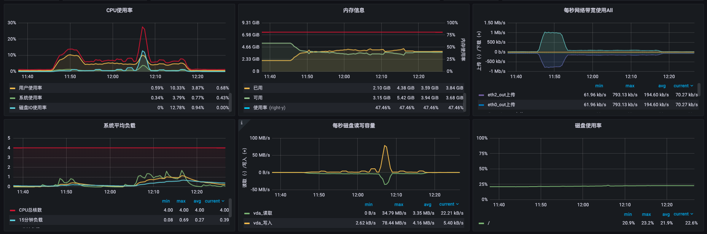
	
	- other
	
		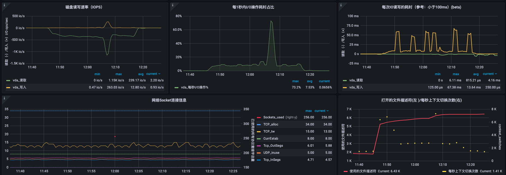
- 压测客户端普通链节点 
	- cpu、mem、load、network
	
		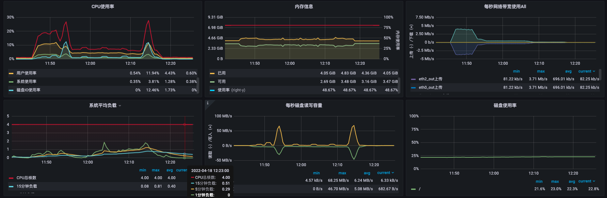

	- other
	
		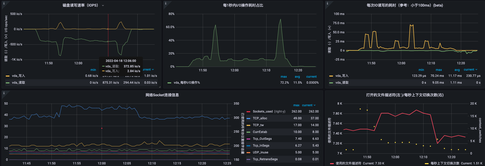
- 浏览器普通链节点
	- cpu、mem、load、network
		
		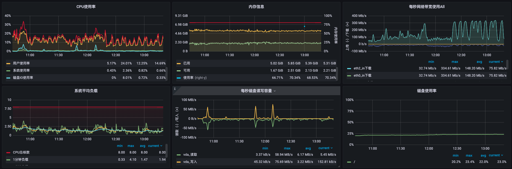
	- other
	
		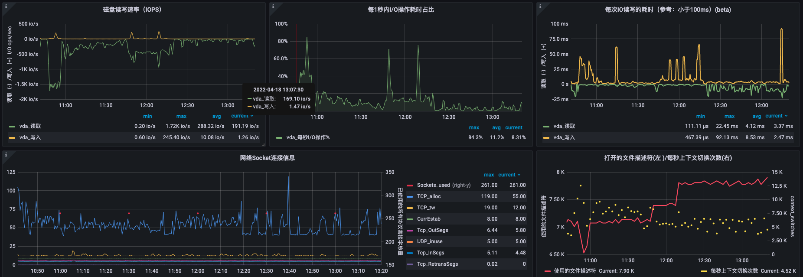
- 压测客户端节点	
	- cpu、mem、load、network

		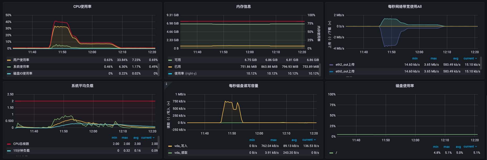
	- other
	
		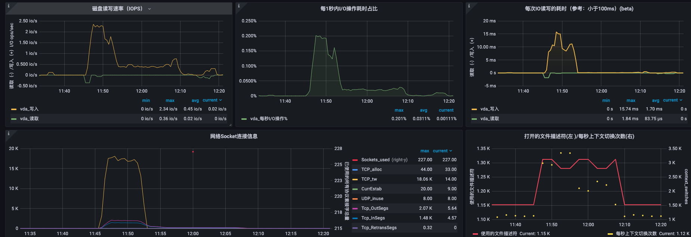
- 游览器节点
	- cpu
		
		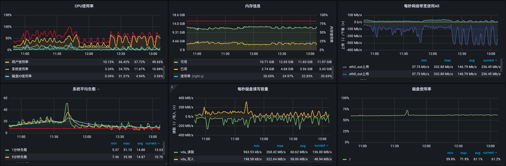
	- other
	
		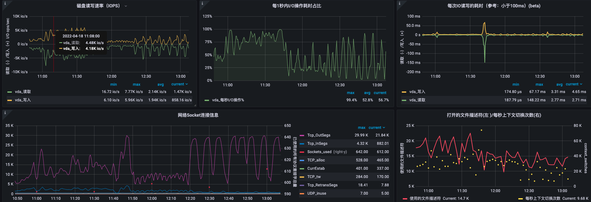

#### [游览器](http://106.75.120.70:4000/)查询数据
- 抽取块数据
	- 创建测试合约
		
		因为生产合约比较复杂，没有使用压测软件的部署方式，而是使用手动方式部署
	- 负载块信息 
	
		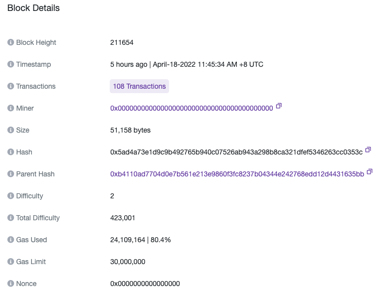
	- 块交易列表

		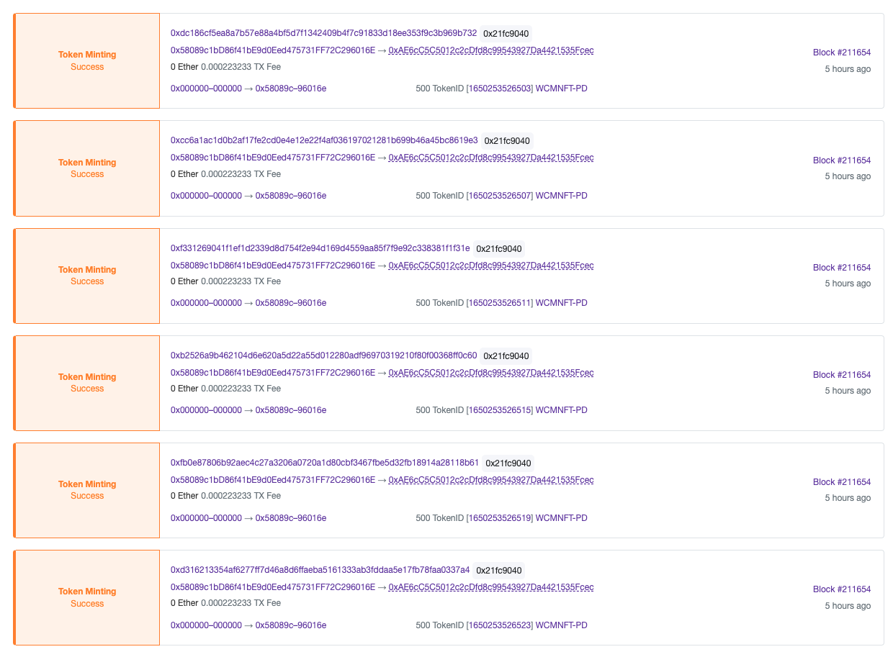
- 抽取单条交易数据
	
	 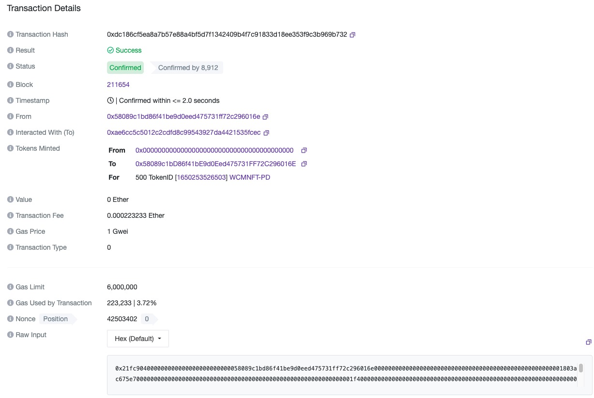

#### 测试客户端结果	
- 图形

	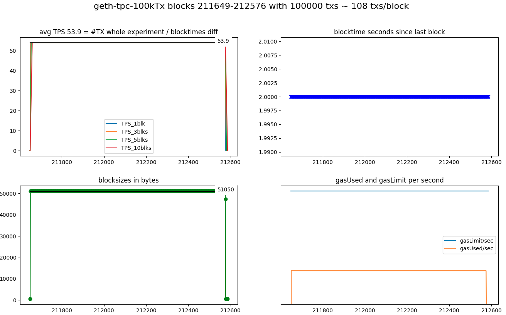
- 文本

		(geth-tps) Geth v1.10.17 with 100000 txs: 0.0 TPS
		information:
		NODE: Geth/v1.10.17-stable-25c9b49f/linux-amd64/go1.18 on http://172.17.50.188:8545
		      consensus=clique chain_name=poa chain_id=65533 network_id=65533
		SEND: 100000 transactions in blocks 211651-211651 with 10 empty blocks following.
		      A sample of transactions looked as if they: failed (at least partially).
		TPS:  The stopclock watcher measured a final TPS of 18.7 since contract deploy,
		      and in between saw values as high as 53.8 TPS.
		DIAG: The whole experiment was prefixed 'geth-tps'.
		      The diagrams were saved into 'no-diagram-created-because-less-than-2-filled-blocks'.
		      Looking only at the experiment block-timestamps, the overall TPS was ~0.0.
		log:
		versions: web3 4.8.2, py-solc: 3.2.0, solc 0.4.25+commit.59dbf8f1.Linux.gpp, testrpc 1.3.5, python 3.6.9 (default, Dec  8 2021, 21:08:43) [GCC 8.4.0]
		web3 connection established, blockNumber = 211648, node version string =  Geth/v1.10.17-stable-25c9b49f/linux-amd64/go1.18
		first account of node is 0x58089c1bD86f41bE9d0Eed475731FF72C296016E, balance is 199999998351.078106517 Ether
		nodeName: Geth, nodeType: Geth, nodeVersion: v1.10.17-stable-25c9b49f, consensus: clique, network: 65533, chainName: poa, chainId: 65533
		
		Block  211648  - waiting for something to happen
		
		blocknumber_start_here = 211648
		starting timer, at block 211648 which has  0  transactions; at epochtime 1650253522.592756
		block 211649 | new #TX   0 / 2000 ms =   0.0 TPS_current | total: #TX    0 /  1.5 s =   0.0 TPS_average (peak  is   0.0 TPS_average)
		block 211650 | new #TX   0 / 2000 ms =   0.0 TPS_current | total: #TX    0 /  3.6 s =   0.0 TPS_average (peak  is   0.0 TPS_average)
		block 211651 | new #TX 108 / 2000 ms =  54.0 TPS_current | total: #TX  108 /  5.8 s =  18.7 TPS_average (peak  is  18.7 TPS_average)
		block 211652 | new #TX 108 / 2000 ms =  54.0 TPS_current | total: #TX  216 /  7.6 s =  28.4 TPS_average (peak  is  28.4 TPS_average)
		block 211653 | new #TX 108 / 2000 ms =  54.0 TPS_current | total: #TX  324 /  9.7 s =  33.3 TPS_average (peak  is  33.3 TPS_average)
		block 211654 | new #TX 108 / 2000 ms =  54.0 TPS_current | total: #TX  432 / 11.9 s =  36.4 TPS_average (peak  is  36.4 TPS_average)
		block 211655 | new #TX 108 / 2000 ms =  54.0 TPS_current | total: #TX  540 / 14.3 s =  37.8 TPS_average (peak  is  37.8 TPS_average)
		block 211656 | new #TX 108 / 2000 ms =  54.0 TPS_current | total: #TX  648 / 15.8 s =  41.0 TPS_average (peak  is  41.0 TPS_average)
		...
		block 212289 | new #TX 108 / 2000 ms =  54.0 TPS_current | total: #TX 68904 / 1281.6 s =  53.8 TPS_average (peak was  53.8 TPS_average)
		block 212290 | new #TX 108 / 2000 ms =  54.0 TPS_current | total: #TX 69012 / 1284.0 s =  53.7 TPS_average (peak was  53.8 TPS_average)
		block 212291 | new #TX 108 / 2000 ms =  54.0 TPS_current | total: #TX 69120 / 1285.8 s =  53.8 TPS_average (peak was  53.8 TPS_average)
		block 212292 | new #TX 108 / 2000 ms =  54.0 TPS_current | total: #TX 69228 / 1287.6 s =  53.8 TPS_average (peak was  53.8 TPS_average)
		block 212293 | new #TX 108 / 2000 ms =  54.0 TPS_current | total: #TX 69336 / 1289.8 s =  53.8 TPS_average (peak was  53.8 TPS_average)
		block 212294 | new #TX 108 / 2000 ms =  54.0 TPS_current | total: #TX 69444 / 1291.6 s =  53.8 TPS_average (peak was  53.8 TPS_average)
		block 212295 | new #TX 108 / 2000 ms =  54.0 TPS_current | total: #TX 69552 / 1293.7 s =  53.8 TPS_average (peak was  53.8 TPS_average)
		block 212296 | new #TX 108 / 2000 ms =  54.0 TPS_current | total: #TX 69660 / 1295.5 s =  53.8 TPS_average (peak was  53.8 TPS_average)
		block 212297 | new #TX 108 / 2000 ms =  54.0 TPS_current | total: #TX 69768 / 1298.3 s =  53.7 TPS_average (peak was  53.8 TPS_average)
		block 212298 | new #TX 108 / 2000 ms =  54.0 TPS_current | total: #TX 69876 / 1299.8 s =  53.8 TPS_average (peak was  53.8 TPS_average)
		block 212299 | new #TX 108 / 2000 ms =  54.0 TPS_current | total: #TX 69984 / 1301.6 s =  53.8 TPS_average (peak was  53.8 TPS_average)
		block 212300 | new #TX 108 / 2000 ms =  54.0 TPS_current | total: #TX 70092 / 1303.8 s =  53.8 TPS_average (peak was  53.8 TPS_average)
		block 212301 | new #TX 108 / 2000 ms =  54.0 TPS_current | total: #TX 70200 / 1305.6 s =  53.8 TPS_average (peak was  53.8 TPS_average)
		block 212302 | new #TX 108 / 2000 ms =  54.0 TPS_current | total: #TX 70308 / 1307.7 s =  53.8 TPS_average (peak was  53.8 TPS_average)
		block 212303 | new #TX 108 / 2000 ms =  54.0 TPS_current | total: #TX 70416 / 1309.8 s =  53.8 TPS_average (peak was  53.8 TPS_average)
		Received signal from send.py = updated INFOFILE.
		Experiment ended! Current blocknumber = 212303
		Updated info file: last-experiment.json THE END.
		diagrams:
		no-diagram-created-because-less-than-2-filled-blocks
		....
		info raw
		{'diagrams': {'blocktimestampsTpsAv': 0, 'filename': 'no-diagram-created-because-less-than-2-filled-blocks', 'prefix': 'geth-tps'}, 'node': {'chain_id': 65533, 'chain_name': 'poa', 'consensus': 'clique', 'name': 'Geth', 'network_id': 65533, 'rpc_address': 'http://172.17.50.188:8545', 'type': 'Geth', 'version': 'v1.10.17-stable-25c9b49f', 'web3.version.node': 'Geth/v1.10.17-stable-25c9b49f/linux-amd64/go1.18'}, 'send': {'block_first': 211651, 'block_last': 211651, 'empty_blocks': 10, 'num_txs': 100000, 'sample_txs_successful': False}, 'tps': {'finalTpsAv': 18.698196578293427, 'peakTpsAv': 53.83677738876175, 'start_epochtime': 1650253522.592756}}
#### 测试结果
- 从软硬件测试结果看
	- 硬件
		- 链节点
			- 共识节点	
			
				从资源监控看，所有节点硬件均较为正常
			- 应用普通

				从资源监控看，所有节点硬件均较为正常
			- 浏览器普通
				
				从资源监控看，所有节点硬件均较为正常
		- 应用节点
			- 压力测试节点

				从资源监控看,所有节点硬件均较为正常
			- 游览器节点

				从资源监控看,所有节点硬件均较为正常
	- 软件
		- 总共测试交易 10w 
		- 测试区块
			- 211651-212303
		- 最终平均是 53/s (注意软件是18，因为疑似因为交易堵塞造成延迟，造成最终统计失真，只能看相对值) 
- 测试中掺杂真实转账交易
	
	因为 gaslimit 没有完全占满，所以只要 gas 足够应该可以做交易，但无测试
- 测试中遇到的问题
	- 区块链节点客户端 oom
		- 因为实体合约复杂度提高，受到 gaslimit 影响所以 tps 下降，造成交易积压，导致内存使用上升，之前优化 4GB 内存不够，扩容到8 GB 恢复正常
	-  tps 偏低
		-  这块调整出块 gaslimit 增加 tps，但是出块 tx 增多后，发现有些共识节点来不及同步块数据，这块可能和以太坊的硬件参数有关，比如内存设置 4096MB 以及更深层次的交易池大小问题，过期问题等，最终导致挖空块的问题较多，这会可能会导致更严重的共识一致性问题。从业务角度出发，铸币的动作是很少的，所以降低 gaslimit /块 到正常范围，连续压测10w。
	- 安全优化
		- 因为被攻击，所以参数全部按照更标准的 geth 安全设置，在共识节点取消 rpc 接口，只有在最终只有应用节点同时开放 rpc 和 unlock,具体原因请查看攻击报告。
	- 交易成功合并到链上，但是提示内部交易错误
		- 这个问题主要是因为被攻击后，换了操作的账户，但是在铸币的时候，在合约中有限制账户，但这个账户没有换，所以报错。更换账户同步后解决。 

### 赠与
#### 硬件统计
- 共识节点

	共识节点，资源使用相差不大，故选用其中1台做基准指标
	
	- cpu、mem、load、network
		
		
	
	- other
	
		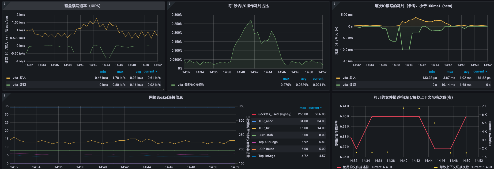
- 压测客户端普通链节点 
	- cpu、mem、load、network
	
		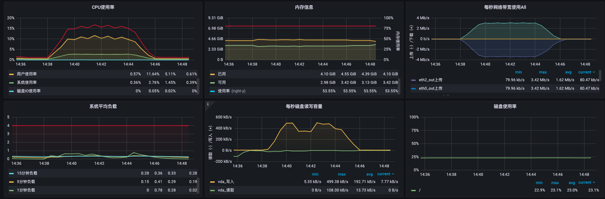

	- other
	
		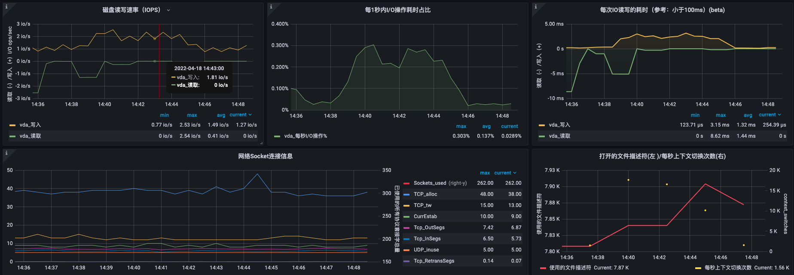
- 浏览器普通链节点
	- cpu、mem、load、network
		
		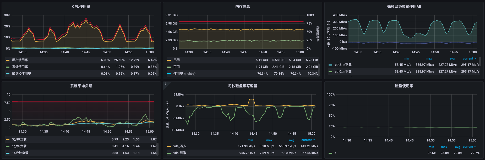
	- other
	
		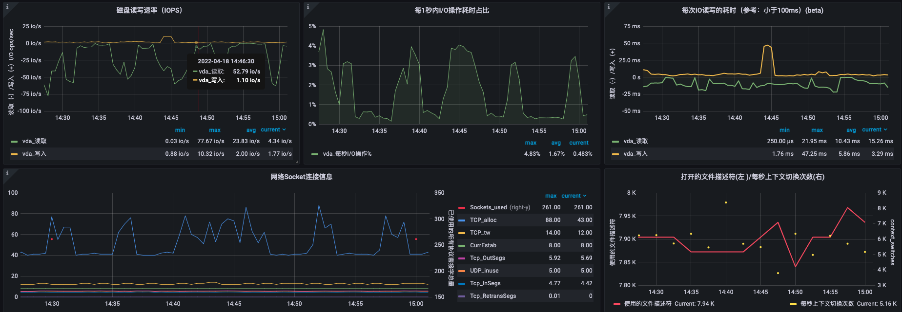
- 压测客户端节点	
	- cpu、mem、load、network

		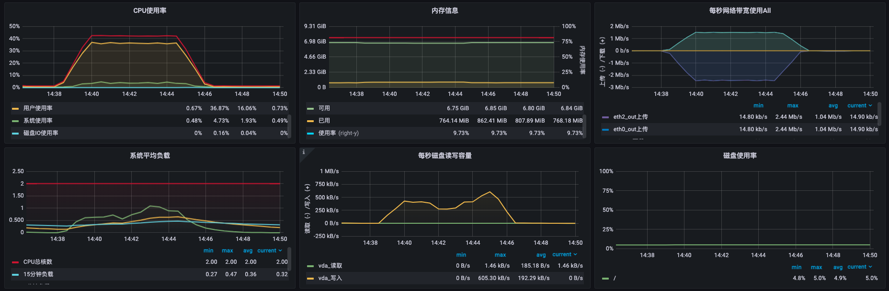
	- other
	
		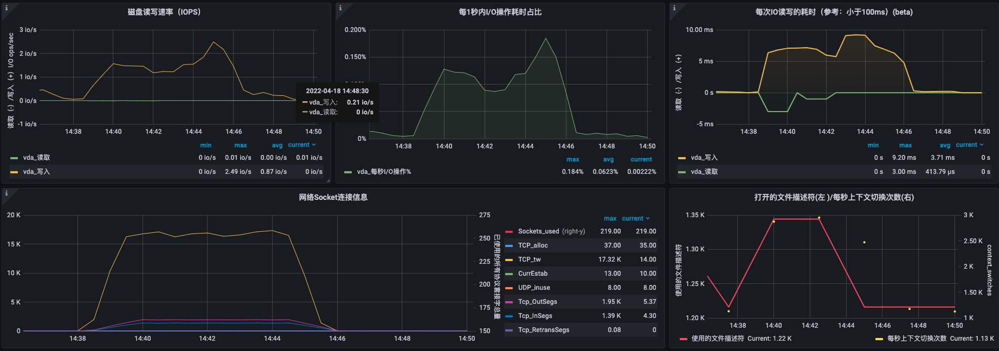
- 游览器节点
	- cpu
		
		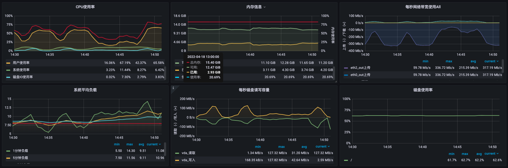
	- other
	
		

#### [游览器](http://106.75.120.70:4000/)查询数据
- 抽取块数据
	- 创建测试合约
		
		因为生产合约比较复杂，没有使用压测软件的部署方式，而是使用手动方式部署
	- 负载块信息 
	
		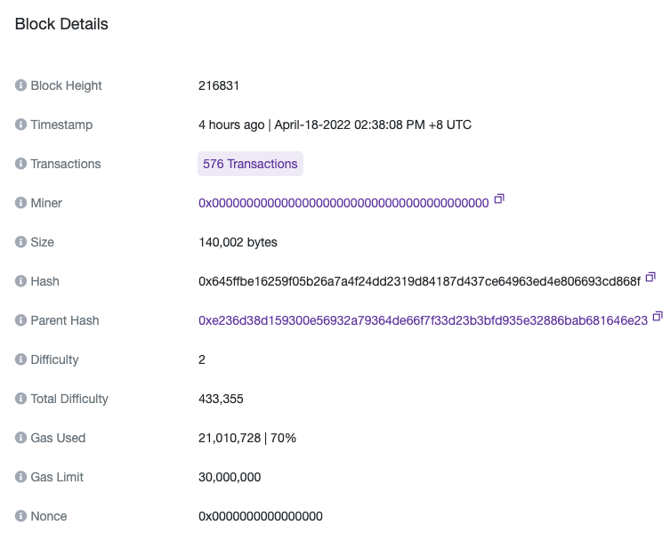
	- 块交易列表

		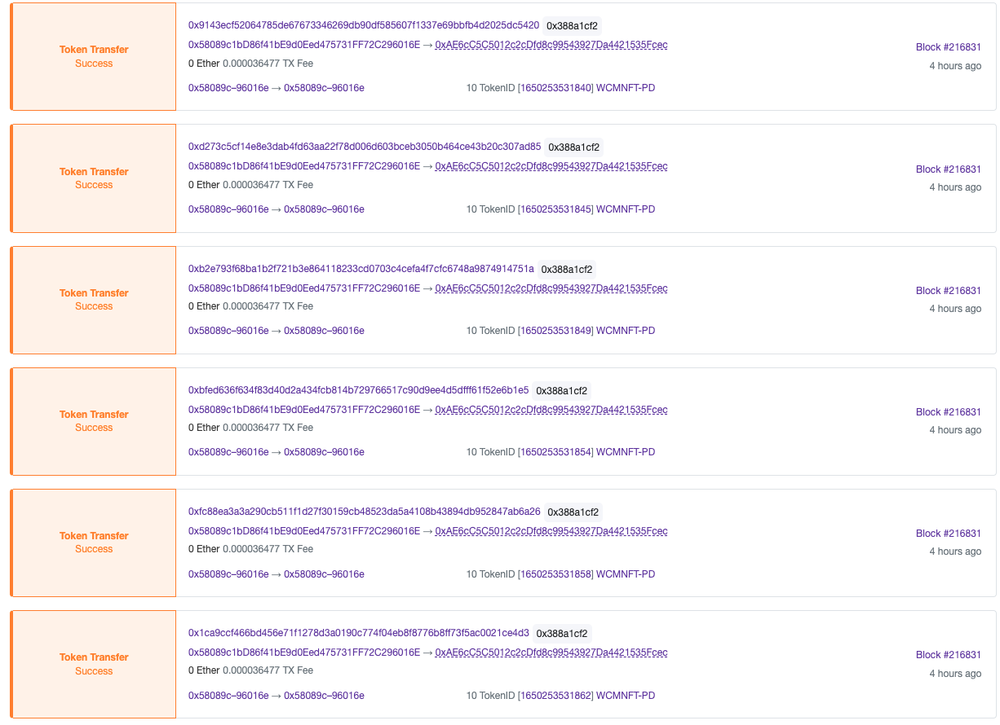
- 抽取单条交易数据
	
	 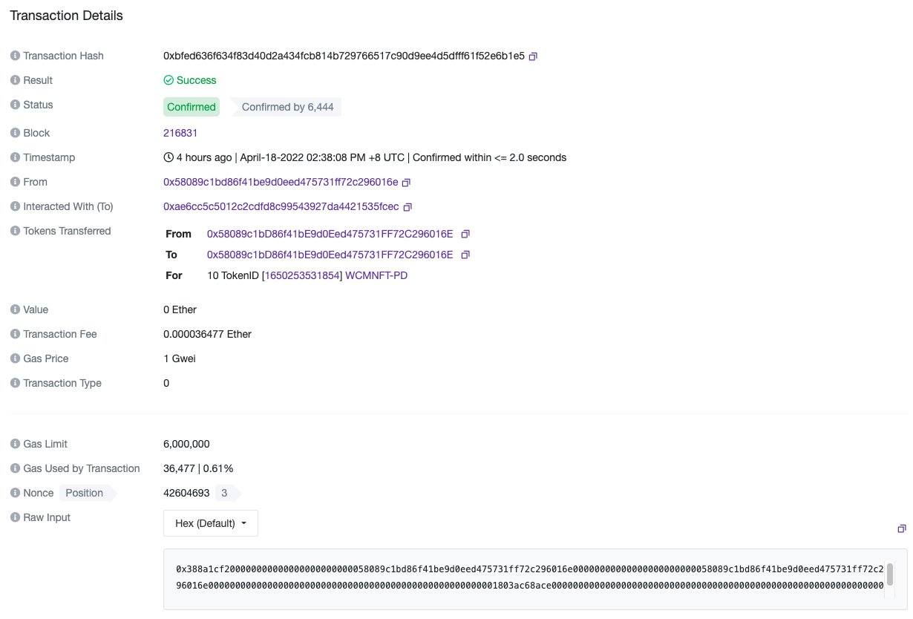

#### 测试客户端结果	
- 图形

	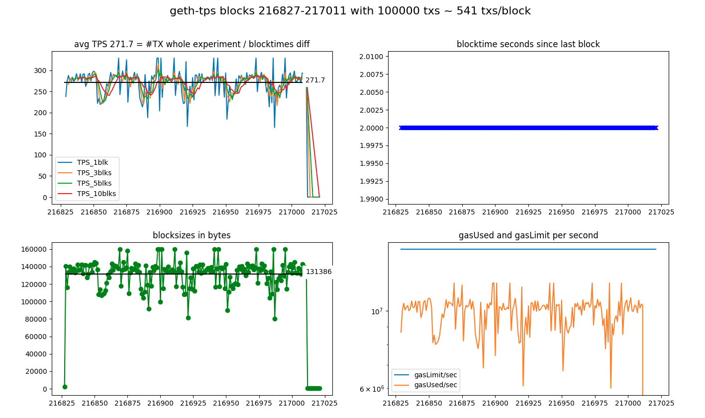
- 文本

		(geth-tps) Geth v1.10.17 with 100000 txs: 271.7 TPS
		information:
		NODE: Geth/v1.10.17-stable-25c9b49f/linux-amd64/go1.18 on http://172.17.50.188:8545
		      consensus=clique chain_name=poa chain_id=65533 network_id=65533
		SEND: 100000 transactions in blocks 216827-217011 with 10 empty blocks following.
		      A sample of transactions looked as if they: succeeded.
		TPS:  The stopclock watcher measured a final TPS of 267.9 since contract deploy,
		      and in between saw values as high as 268.2 TPS.
		DIAG: The whole experiment was prefixed 'geth-tps'.
		      The diagrams were saved into 'img/geth-tps-20220418-1437_blks216827-217011.png'.
		      Looking only at the experiment block-timestamps, the overall TPS was ~271.7.
		log:
		versions: web3 4.8.2, py-solc: 3.2.0, solc 0.4.25+commit.59dbf8f1.Linux.gpp, testrpc 1.3.5, python 3.6.9 (default, Dec  8 2021, 21:08:43) [GCC 8.4.0]
		web3 connection established, blockNumber = 216824, node version string =  Geth/v1.10.17-stable-25c9b49f/linux-amd64/go1.18
		first account of node is 0x58089c1bD86f41bE9d0Eed475731FF72C296016E, balance is 1000000000.000001709009222144 Ether
		nodeName: Geth, nodeType: Geth, nodeVersion: v1.10.17-stable-25c9b49f, consensus: clique, network: 65533, chainName: poa, chainId: 65533
		
		Block  216824  - waiting for something to happen
		
		blocknumber_start_here = 216824
		starting timer, at block 216824 which has  0  transactions; at epochtime 1650263875.6465359
		block 216825 | new #TX   0 / 2000 ms =   0.0 TPS_current | total: #TX    0 /  0.6 s =   0.0 TPS_average (peak  is   0.0 TPS_average)
		block 216826 | new #TX   0 / 2000 ms =   0.0 TPS_current | total: #TX    0 /  2.4 s =   0.0 TPS_average (peak  is   0.0 TPS_average)
		block 216827 | new #TX   7 / 2000 ms =   3.5 TPS_current | total: #TX    7 /  4.6 s =   1.5 TPS_average (peak  is   1.5 TPS_average)
		block 216828 | new #TX 579 / 2000 ms = 289.5 TPS_current | total: #TX  586 /  6.7 s =  87.5 TPS_average (peak  is  87.5 TPS_average)
		block 216829 | new #TX 476 / 2000 ms = 238.0 TPS_current | total: #TX 1062 /  8.5 s = 124.5 TPS_average (peak  is 124.5 TPS_average)
		block 216830 | new #TX 549 / 2000 ms = 274.5 TPS_current | total: #TX 1611 / 10.7 s = 151.0 TPS_average (peak  is 151.0 TPS_average)
		block 216831 | new #TX 576 / 2000 ms = 288.0 TPS_current | total: #TX 2187 / 12.5 s = 174.8 TPS_average (peak  is 174.8 TPS_average)
		block 216832 | new #TX 551 / 2000 ms = 275.5 TPS_current | total: #TX 2738 / 14.6 s = 186.9 TPS_average (peak  is 186.9 TPS_average)
		block 216833 | new #TX 561 / 2000 ms = 280.5 TPS_current | total: #TX 3299 / 16.5 s = 200.2 TPS_average (peak  is 200.2 TPS_average)
		block 216834 | new #TX 567 / 2000 ms = 283.5 TPS_current | total: #TX 3866 / 18.6 s = 207.6 TPS_average (peak  is 207.6 TPS_average)
		block 216835 | new #TX 548 / 2000 ms = 274.0 TPS_current | total: #TX 4414 / 20.5 s = 215.7 TPS_average (peak  is 215.7 TPS_average)
		block 216836 | new #TX 555 / 2000 ms = 277.5 TPS_current | total: #TX 4969 / 22.6 s = 219.8 TPS_average (peak  is 219.8 TPS_average)
		block 216837 | new #TX 584 / 2000 ms = 292.0 TPS_current | total: #TX 5553 / 24.7 s = 224.4 TPS_average (peak  is 224.4 TPS_average)
		block 216838 | new #TX 560 / 2000 ms = 280.0 TPS_current | total: #TX 6113 / 26.6 s = 230.0 TPS_average (peak  is 230.0 TPS_average)
		block 216839 | new #TX 561 / 2000 ms = 280.5 TPS_current | total: #TX 6674 / 29.3 s = 227.6 TPS_average (peak was 230.0 TPS_average)
		block 216840 | new #TX 584 / 2000 ms = 292.0 TPS_current | total: #TX 7258 / 30.5 s = 237.6 TPS_average (peak  is 237.6 TPS_average)
		block 216841 | new #TX 543 / 2000 ms = 271.5 TPS_current | total: #TX 7801 / 32.7 s = 238.6 TPS_average (peak  is 238.6 TPS_average)
		block 216842 | new #TX 582 / 2000 ms = 291.0 TPS_current | total: #TX 8383 / 34.5 s = 242.7 TPS_average (peak  is 242.7 TPS_average)
		...
		block 217007 | new #TX 541 / 2000 ms = 270.5 TPS_current | total: #TX 97670 / 364.5 s = 267.9 TPS_average (peak was 268.2 TPS_average)
		block 217008 | new #TX 588 / 2000 ms = 294.0 TPS_current | total: #TX 98258 / 366.7 s = 268.0 TPS_average (peak was 268.2 TPS_average)
		block 217009 | new #TX 558 / 2000 ms = 279.0 TPS_current | total: #TX 98816 / 368.5 s = 268.1 TPS_average (peak was 268.2 TPS_average)
		block 217010 | new #TX 573 / 2000 ms = 286.5 TPS_current | total: #TX 99389 / 370.7 s = 268.1 TPS_average (peak was 268.2 TPS_average)
		block 217011 | new #TX 568 / 2000 ms = 284.0 TPS_current | total: #TX 99957 / 373.1 s = 267.9 TPS_average (peak was 268.2 TPS_average)
		block 217012 | new #TX   0 / 2000 ms =   0.0 TPS_current | total: #TX 99957 / 374.6 s = 266.8 TPS_average (peak was 268.2 TPS_average)
		block 217013 | new #TX   0 / 2000 ms =   0.0 TPS_current | total: #TX 99957 / 376.4 s = 265.5 TPS_average (peak was 268.2 TPS_average)
		block 217014 | new #TX   0 / 2000 ms =   0.0 TPS_current | total: #TX 99957 / 378.6 s = 264.0 TPS_average (peak was 268.2 TPS_average)
		block 217015 | new #TX   0 / 2000 ms =   0.0 TPS_current | total: #TX 99957 / 380.4 s = 262.8 TPS_average (peak was 268.2 TPS_average)
		block 217016 | new #TX   0 / 2000 ms =   0.0 TPS_current | total: #TX 99957 / 382.5 s = 261.3 TPS_average (peak was 268.2 TPS_average)
		block 217017 | new #TX   0 / 2000 ms =   0.0 TPS_current | total: #TX 99957 / 384.6 s = 259.9 TPS_average (peak was 268.2 TPS_average)
		block 217018 | new #TX   0 / 2000 ms =   0.0 TPS_current | total: #TX 99957 / 386.5 s = 258.6 TPS_average (peak was 268.2 TPS_average)
		block 217019 | new #TX   0 / 2000 ms =   0.0 TPS_current | total: #TX 99957 / 388.6 s = 257.2 TPS_average (peak was 268.2 TPS_average)
		block 217020 | new #TX   0 / 2000 ms =   0.0 TPS_current | total: #TX 99957 / 390.4 s = 256.0 TPS_average (peak was 268.2 TPS_average)
		block 217021 | new #TX   0 / 2000 ms =   0.0 TPS_current | total: #TX 99957 / 392.5 s = 254.6 TPS_average (peak was 268.2 TPS_average)
		Received signal from send.py = updated INFOFILE.
		Experiment ended! Current blocknumber = 217021
		Updated info file: last-experiment.json THE END.
		
		info raw
		{'diagrams': {'blocktimestampsTpsAv': 271.7201086956522, 'filename': 'img/geth-tps-20220418-1437_blks216827-217011.png', 'prefix': 'geth-tps'}, 'node': {'chain_id': 65533, 'chain_name': 'poa', 'consensus': 'clique', 'name': 'Geth', 'network_id': 65533, 'rpc_address': 'http://172.17.50.188:8545', 'type': 'Geth', 'version': 'v1.10.17-stable-25c9b49f', 'web3.version.node': 'Geth/v1.10.17-stable-25c9b49f/linux-amd64/go1.18'}, 'send': {'block_first': 216827, 'block_last': 217011, 'empty_blocks': 10, 'num_txs': 100000, 'sample_txs_successful': True}, 'tps': {'finalTpsAv': 267.91149813634524, 'peakTpsAv': 268.17172197401317, 'start_epochtime': 1650263875.6465359}}

#### 测试结果
- 从软硬件测试结果看
	- 硬件
		- 链节点
			- 共识节点	
			
				从资源监控看，所有节点硬件均较为正常
			- 应用普通

				从资源监控看，所有节点硬件均较为正常
			- 浏览器普通
				
				从资源监控看，所有节点硬件均较为正常
		- 应用节点
			- 压力测试节点

				从资源监控看,所有节点硬件均较为正常
			- 游览器节点

				从资源监控看,所有节点硬件均较为正常
	- 软件
		- 总共测试交易 10w 
		- 测试区块
			- 216827-217011
		- 最终平均是 271.7/TPS  
- 测试中掺杂真实转账交易
	
	因为 gaslimit 没有完全占满，所以只要 gas 足够应该可以做交易，但无测试
- 测试中遇到的问题
	- 赠与数量为什么没有压测24小时

		因为之前测试铸币的时候调整了 gaslimit 从 3000w 调整到了2亿，又减少到了1亿，最终在1亿做了 gift 测试 24小时，但后来发现虽然增加了 gaslimit 但是赠与接口的 tps 依然无法增长， 块的 gaslimit 消耗维持在 1900 万左右，感觉是因为设置瓶颈(后期会测试)，所以设置回 3000w后，再压测10万指标等同于 24小时压测。
		
		综上所述，gaslimit 可以在一定程度上提高 tps，但是超过了这个程度，就需要更细粒度的调整 geth 客户端其他参数来增加 tps ，但注意这里可能涉及到更深入的共识、同步、网络的基础调试。
		
		所以为了稳定，暂时考虑使用公网设置
		
		下面是2个1亿数量指标下的测试日志结果

		- 第一次 1340w，平均 263/tps
				
				(geth-tps) Geth v1.10.17 with 13400000 txs: 263.1 TPS
				information:
				NODE: Geth/v1.10.17-stable-25c9b49f/linux-amd64/go1.18 on http://172.17.50.188:8545
				      consensus=clique chain_name=poa chain_id=65533 network_id=65533
				SEND: 13400000 transactions in blocks 177288-202754 with 10 empty blocks following.
				      A sample of transactions looked as if they: succeeded.
				TPS:  The stopclock watcher measured a final TPS of 263.0 since contract deploy,
				      and in between saw values as high as 263.0 TPS.
				DIAG: The whole experiment was prefixed 'geth-tps'.
				      The diagrams were saved into 'img/geth-tps-20220417-1639_blks177288-202754.png'.
				      Looking only at the experiment block-timestamps, the overall TPS was ~263.1.
				log:
				versions: web3 4.8.2, py-solc: 3.2.0, solc 0.4.25+commit.59dbf8f1.Linux.gpp, testrpc 1.3.5, python 3.6.9 (default, Dec  8 2021, 21:08:43) [GCC 8.4.0]
				web3 connection established, blockNumber = 177284, node version string =  Geth/v1.10.17-stable-25c9b49f/linux-amd64/go1.18
				first account of node is 0x58089c1bD86f41bE9d0Eed475731FF72C296016E, balance is 199999998864.424995737 Ether
				nodeName: Geth, nodeType: Geth, nodeVersion: v1.10.17-stable-25c9b49f, consensus: clique, network: 65533, chainName: poa, chainId: 65533
				
				Block  177284  - waiting for something to happen
				
				blocknumber_start_here = 177284
				starting timer, at block 177284 which has  0  transactions; at epochtime 1650184772.813038
				....
				info raw
				{'diagrams': {'blocktimestampsTpsAv': 263.0853490929082, 'filename': 'img/geth-tps-20220417-1639_blks177288-202754.png', 'prefix': 'geth-tps'}, 'node': {'chain_id': 65533, 'chain_name': 'poa', 'consensus': 'clique', 'name': 'Geth', 'network_id': 65533, 'rpc_address': 'http://172.17.50.188:8545', 'type': 'Geth', 'version': 'v1.10.17-stable-25c9b49f', 'web3.version.node': 'Geth/v1.10.17-stable-25c9b49f/linux-amd64/go1.18'}, 'send': {'block_first': 177288, 'block_last': 202754, 'empty_blocks': 10, 'num_txs': 13400000, 'sample_txs_successful': True}, 'tps': {'finalTpsAv': 263.003582802556, 'peakTpsAv': 263.0162191464359, 'start_epochtime': 1650184772.813038}}
		- 第二次 1728w 平均 269.5/tps
		
				(geth-tps) Geth v1.10.17 with 17280000 txs: 269.5 TPS
				information:
				NODE: Geth/v1.10.17-stable-25c9b49f/linux-amd64/go1.18 on http://172.17.50.188:8545
				      consensus=clique chain_name=poa chain_id=65533 network_id=65533
				SEND: 17280000 transactions in blocks 140659-172718 with 10 empty blocks following.
				      A sample of transactions looked as if they: succeeded.
				TPS:  The stopclock watcher measured a final TPS of 269.4 since contract deploy,
				      and in between saw values as high as 271.3 TPS.
				DIAG: The whole experiment was prefixed 'geth-tps'.
				      The diagrams were saved into 'img/geth-tps-20220416-2018_blks140659-172718.png'.
				      Looking only at the experiment block-timestamps, the overall TPS was ~269.5.
				log:
				versions: web3 4.8.2, py-solc: 3.2.0, solc 0.4.25+commit.59dbf8f1.Linux.gpp, testrpc 1.3.5, python 3.6.9 (default, Dec  8 2021, 21:08:43) [GCC 8.4.0]
				web3 connection established, blockNumber = 140655, node version string =  Geth/v1.10.17-stable-25c9b49f/linux-amd64/go1.18
				first account of node is 0x58089c1bD86f41bE9d0Eed475731FF72C296016E, balance is 199999999495.606779335 Ether
				nodeName: Geth, nodeType: Geth, nodeVersion: v1.10.17-stable-25c9b49f, consensus: clique, network: 65533, chainName: poa, chainId: 65533
				
				Block  140655  - waiting for something to happen
				
				blocknumber_start_here = 140655
				starting timer, at block 140655 which has  0  transactions; at epochtime 1650111514.5496202
				block 140656 | new #TX   0 / 2000 ms =   0.0 TPS_current | total: #TX    0 /  1.2 s =   0.0 TPS_average (peak  is   0.0 TPS_average)
				...
				info raw
				{'diagrams': {'blocktimestampsTpsAv': 269.4964128637824, 'filename': 'img/geth-tps-20220416-2018_blks140659-172718.png', 'prefix': 'geth-tps'}, 'node': {'chain_id': 65533, 'chain_name': 'poa', 'consensus': 'clique', 'name': 'Geth', 'network_id': 65533, 'rpc_address': 'http://172.17.50.188:8545', 'type': 'Geth', 'version': 'v1.10.17-stable-25c9b49f', 'web3.version.node': 'Geth/v1.10.17-stable-25c9b49f/linux-amd64/go1.18'}, 'send': {'block_first': 140659, 'block_last': 172718, 'empty_blocks': 10, 'num_txs': 17280000, 'sample_txs_successful': True}, 'tps': {'finalTpsAv': 269.40654785112747, 'peakTpsAv': 271.29207360372277, 'start_epochtime': 1650111514.5496202}}
				
### 销毁
#### 硬件统计
- 共识节点

	共识节点，资源使用相差不大，故选用其中1台做基准指标
	
	- cpu、mem、load、network
		
		
	
	- other
	
		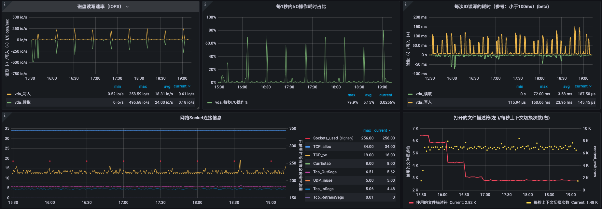
- 压测客户端普通链节点 
	- cpu、mem、load、network
	
		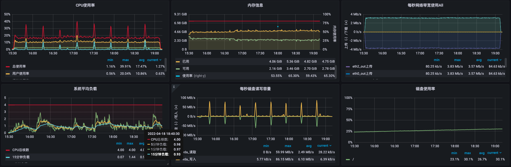

	- other
	
		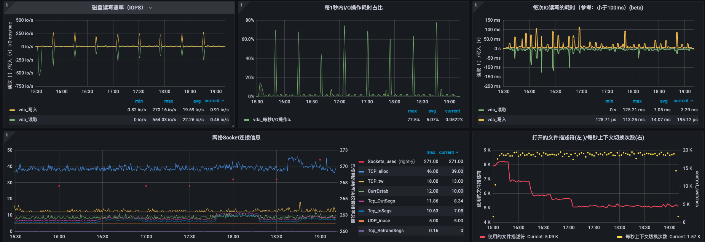
- 浏览器普通链节点
	- cpu、mem、load、network
		
		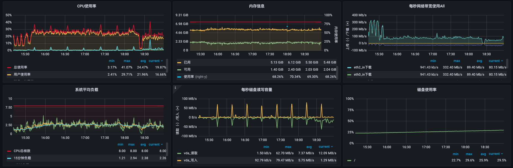
	- other
	
		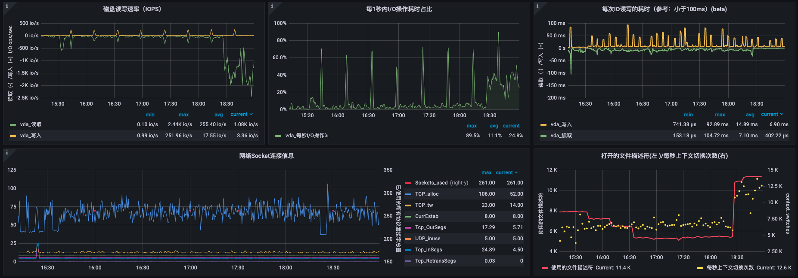
- 压测客户端节点	
	- cpu、mem、load、network

		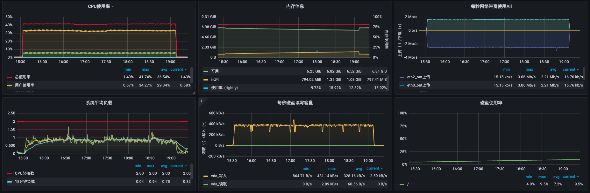
	- other
	
		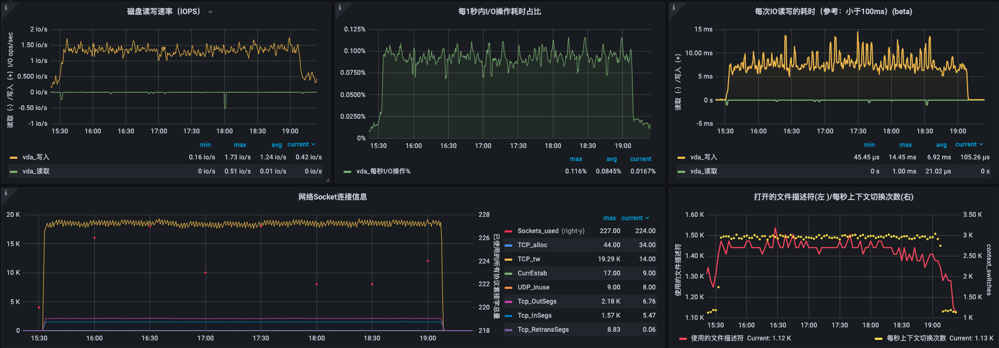
- 游览器节点
	- cpu
		
		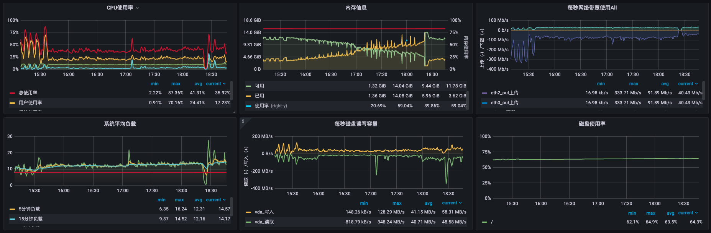
	- other
	
		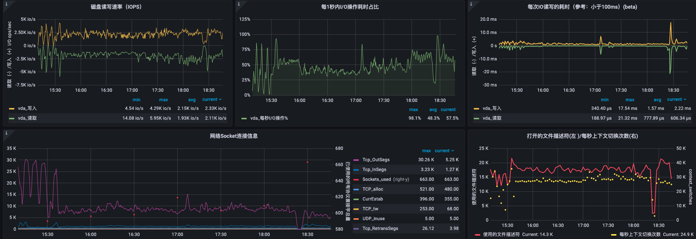

#### [游览器](http://106.75.120.70:4000/)查询数据
- 抽取块数据
	- 创建测试合约
		
		因为生产合约比较复杂，没有使用压测软件的部署方式，而是使用手动方式部署
	- 负载块信息 
	
		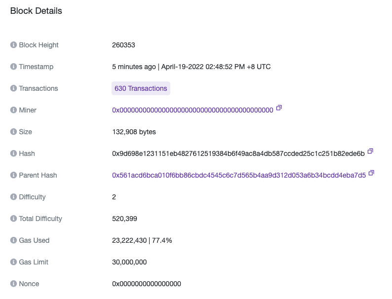
	- 块交易列表

		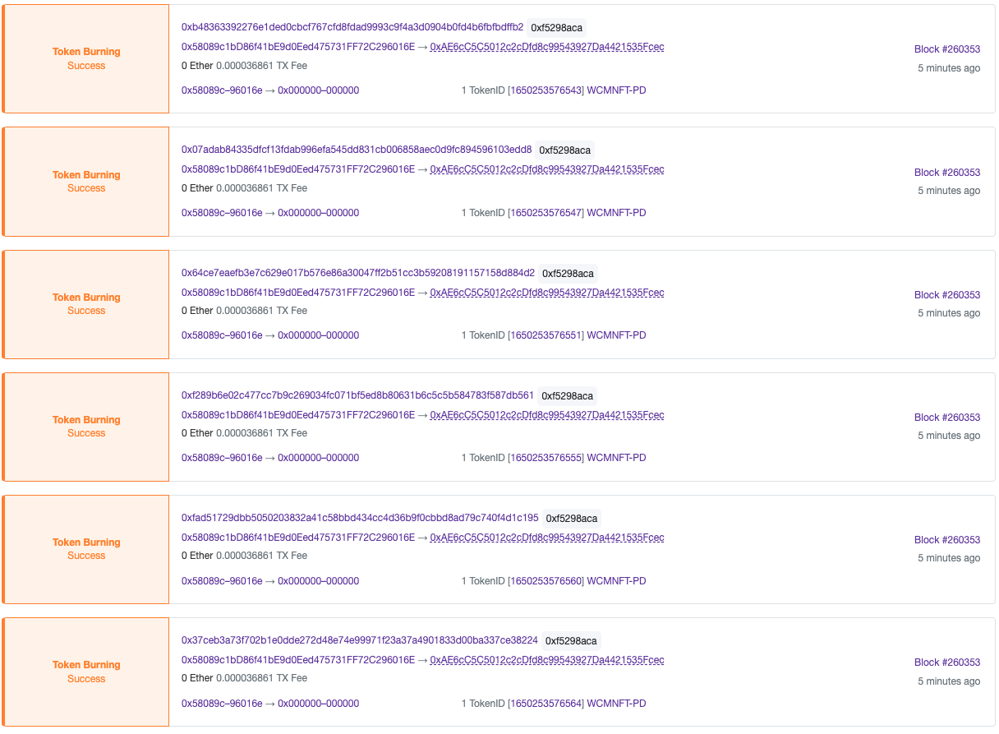
- 抽取单条交易数据
	
	 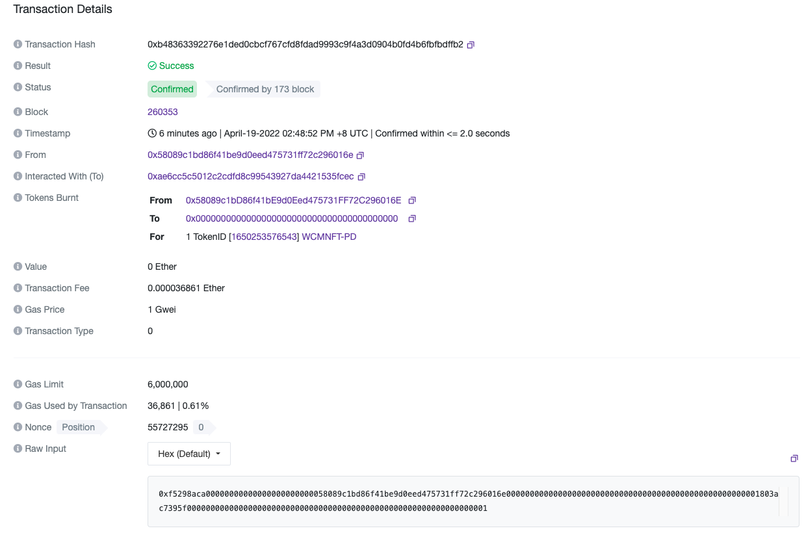

#### 测试客户端结果	
- 图形

	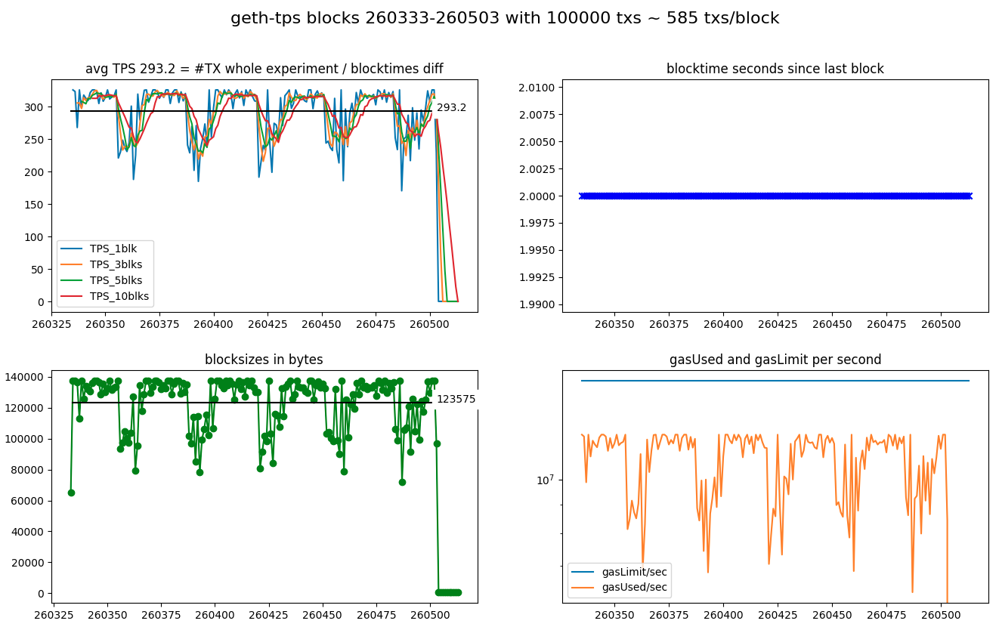
- 文本

		(geth-tps) Geth v1.10.17 with 100000 txs: 293.2 TPS
		information:
		NODE: Geth/v1.10.17-stable-25c9b49f/linux-amd64/go1.18 on http://172.17.50.188:8545
		      consensus=clique chain_name=poa chain_id=65533 network_id=65533
		SEND: 100000 transactions in blocks 260333-260503 with 10 empty blocks following.
		      A sample of transactions looked as if they: succeeded.
		TPS:  The stopclock watcher measured a final TPS of 289.8 since contract deploy,
		      and in between saw values as high as 292.0 TPS.
		DIAG: The whole experiment was prefixed 'geth-tps'.
		      The diagrams were saved into 'img/geth-tps-20220419-1448_blks260333-260503.png'.
		      Looking only at the experiment block-timestamps, the overall TPS was ~293.2.
		log:
		versions: web3 4.8.2, py-solc: 3.2.0, solc 0.4.25+commit.59dbf8f1.Linux.gpp, testrpc 1.3.5, python 3.6.9 (default, Dec  8 2021, 21:08:43) [GCC 8.4.0]
		web3 connection established, blockNumber = 260329, node version string =  Geth/v1.10.17-stable-25c9b49f/linux-amd64/go1.18
		first account of node is 0x58089c1bD86f41bE9d0Eed475731FF72C296016E, balance is 999999440.390030240009222144 Ether
		nodeName: Geth, nodeType: Geth, nodeVersion: v1.10.17-stable-25c9b49f, consensus: clique, network: 65533, chainName: poa, chainId: 65533
		
		Block  260329  - waiting for something to happen
		
		blocknumber_start_here = 260329
		starting timer, at block 260329 which has  0  transactions; at epochtime 1650350886.49388
		block 260330 | new #TX   0 / 2000 ms =   0.0 TPS_current | total: #TX    0 /  0.3 s =   0.0 TPS_average (peak  is   0.0 TPS_average)
		block 260331 | new #TX   0 / 2000 ms =   0.0 TPS_current | total: #TX    0 /  2.1 s =   0.0 TPS_average (peak  is   0.0 TPS_average)
		block 260332 | new #TX   0 / 2000 ms =   0.0 TPS_current | total: #TX    0 /  3.7 s =   0.0 TPS_average (peak  is   0.0 TPS_average)
		block 260333 | new #TX 307 / 2000 ms = 153.5 TPS_current | total: #TX  307 /  5.8 s =  53.1 TPS_average (peak  is  53.1 TPS_average)
		block 260334 | new #TX 652 / 2000 ms = 326.0 TPS_current | total: #TX  959 /  7.9 s = 121.0 TPS_average (peak  is 121.0 TPS_average)
		block 260335 | new #TX 652 / 2000 ms = 326.0 TPS_current | total: #TX 1611 / 10.4 s = 155.3 TPS_average (peak  is 155.3 TPS_average)
		....
		block 260502 | new #TX 652 / 2000 ms = 326.0 TPS_current | total: #TX 99750 / 344.0 s = 290.0 TPS_average (peak was 292.0 TPS_average)
		block 260503 | new #TX 458 / 2000 ms = 229.0 TPS_current | total: #TX 100208 / 345.8 s = 289.8 TPS_average (peak was 292.0 TPS_average)
		block 260504 | new #TX   0 / 2000 ms =   0.0 TPS_current | total: #TX 100208 / 347.6 s = 288.3 TPS_average (peak was 292.0 TPS_average)
		block 260505 | new #TX   0 / 2000 ms =   0.0 TPS_current | total: #TX 100208 / 350.1 s = 286.3 TPS_average (peak was 292.0 TPS_average)
		block 260506 | new #TX   0 / 2000 ms =   0.0 TPS_current | total: #TX 100208 / 352.2 s = 284.5 TPS_average (peak was 292.0 TPS_average)
		block 260507 | new #TX   0 / 2000 ms =   0.0 TPS_current | total: #TX 100208 / 353.7 s = 283.3 TPS_average (peak was 292.0 TPS_average)
		block 260508 | new #TX   0 / 2000 ms =   0.0 TPS_current | total: #TX 100208 / 355.5 s = 281.9 TPS_average (peak was 292.0 TPS_average)
		block 260509 | new #TX   0 / 2000 ms =   0.0 TPS_current | total: #TX 100208 / 357.7 s = 280.2 TPS_average (peak was 292.0 TPS_average)
		block 260510 | new #TX   0 / 2000 ms =   0.0 TPS_current | total: #TX 100208 / 360.1 s = 278.3 TPS_average (peak was 292.0 TPS_average)
		block 260511 | new #TX   0 / 2000 ms =   0.0 TPS_current | total: #TX 100208 / 362.2 s = 276.7 TPS_average (peak was 292.0 TPS_average)
		block 260512 | new #TX   0 / 2000 ms =   0.0 TPS_current | total: #TX 100208 / 363.7 s = 275.5 TPS_average (peak was 292.0 TPS_average)
		block 260513 | new #TX   0 / 2000 ms =   0.0 TPS_current | total: #TX 100208 / 365.6 s = 274.1 TPS_average (peak was 292.0 TPS_average)
		Received signal from send.py = updated INFOFILE.
		Experiment ended! Current blocknumber = 260513
		Updated info file: last-experiment.json THE END.
		...
		info raw
		{'diagrams': {'blocktimestampsTpsAv': 293.2147058823529, 'filename': 'img/geth-tps-20220419-1448_blks260333-260503.png', 'prefix': 'geth-tps'}, 'node': {'chain_id': 65533, 'chain_name': 'poa', 'consensus': 'clique', 'name': 'Geth', 'network_id': 65533, 'rpc_address': 'http://172.17.50.188:8545', 'type': 'Geth', 'version': 'v1.10.17-stable-25c9b49f', 'web3.version.node': 'Geth/v1.10.17-stable-25c9b49f/linux-amd64/go1.18'}, 'send': {'block_first': 260333, 'block_last': 260503, 'empty_blocks': 10, 'num_txs': 100000, 'sample_txs_successful': True}, 'tps': {'finalTpsAv': 289.78804784606035, 'peakTpsAv': 292.0421212039424, 'start_epochtime': 1650350886.49388}}

#### 测试结果
- 从软硬件测试结果看
	- 硬件
		- 链节点
			- 共识节点	
			
				从资源监控看，所有节点硬件均较为正常
			- 应用普通

				从资源监控看，所有节点硬件均较为正常
			- 浏览器普通
				
				从资源监控看，所有节点硬件均较为正常
		- 应用节点
			- 压力测试节点

				从资源监控看,所有节点硬件均较为正常
			- 游览器节点

				从资源监控看,所有节点硬件均较为正常
	- 软件
		- 文档交易总共测试交易 10w 
		- 测试区块
			- 260333-260513
		- 最终平均是 293.2 TPS 
- 测试中掺杂真实转账交易
	
	因为 gaslimit 没有完全占满，所以只要 gas 足够应该可以做交易，无堵塞
- 测试中遇到的问题
	- 销毁数量为什么没有压测24小时

		监控时间的销毁取值是上次压测，但因为时间过长，系统稳定运行，所以提前执行了4个小时左右就停止了。
		
		其次销毁操作不可能这么批量处理，请求比铸币操作比例还少，所以这个数量级的压测应该是足够的
	- 磁盘 io 硬件指标奇怪

		在销毁过程中，磁盘 io 会规律的大范围波动，但是在其他交易里却没有这个现象，但销毁底层逻辑应该只有交易到 0 这个地址，这个需要从代码逻辑查询，但不影响执行效率和稳定性，暂时忽略。
		
## 721 合约测试
### 铸币
#### 硬件统计
- 共识节点

	共识节点，资源使用相差不大，故选用其中1台做基准指标
	
	- cpu、mem、load、network
		
		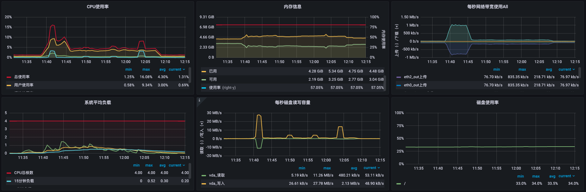
	
	- other
	
		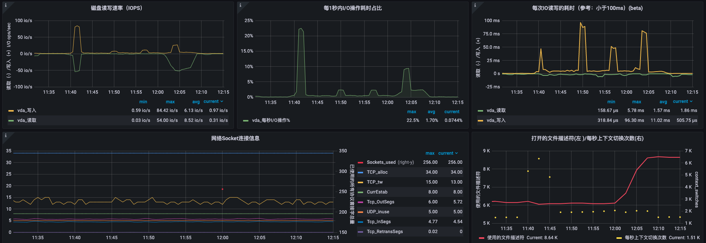
- 压测客户端普通链节点 
	- cpu、mem、load、network
	
		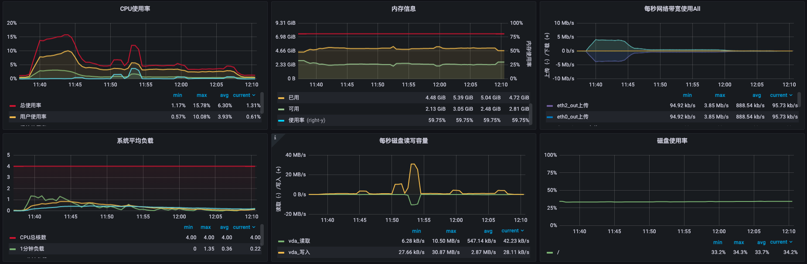

	- other
	
		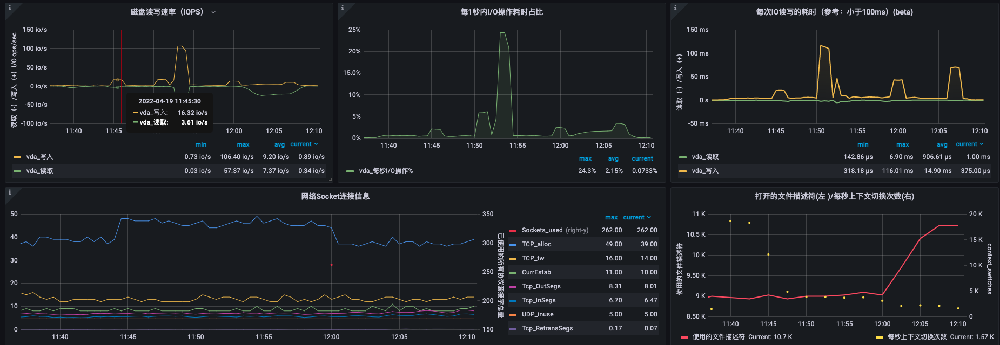
- 浏览器普通链节点
	- cpu、mem、load、network
		
		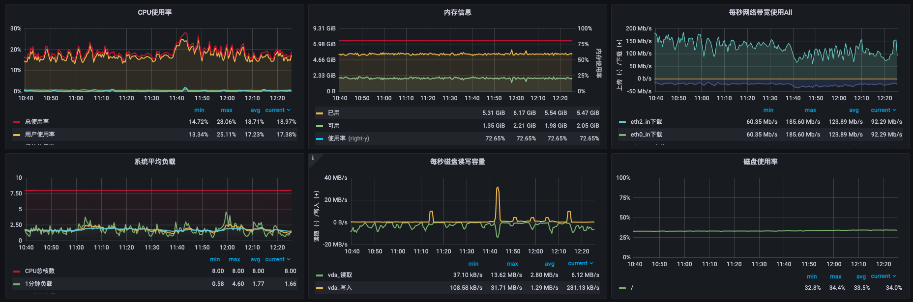
	- other
	
		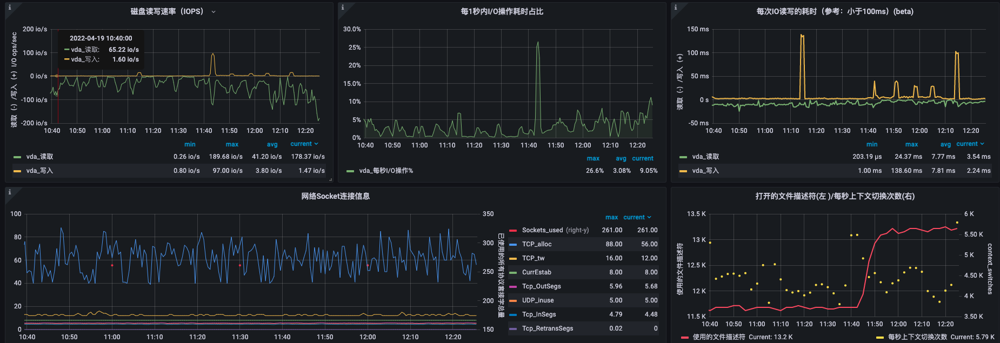
- 压测客户端节点	
	- cpu、mem、load、network

		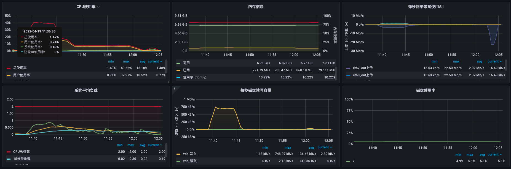
	- other
	
		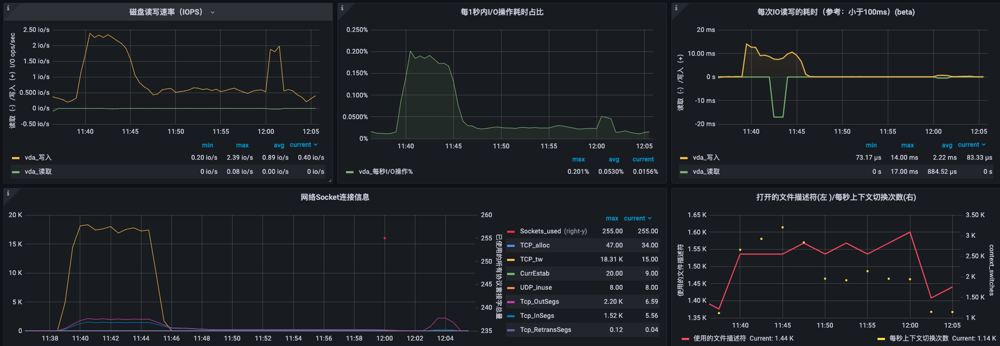
- 游览器节点
	- cpu
		
		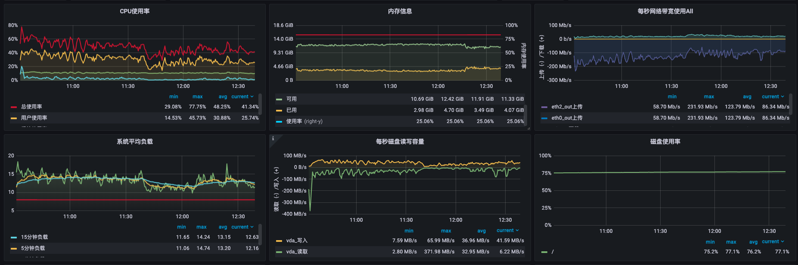
	- other
	
		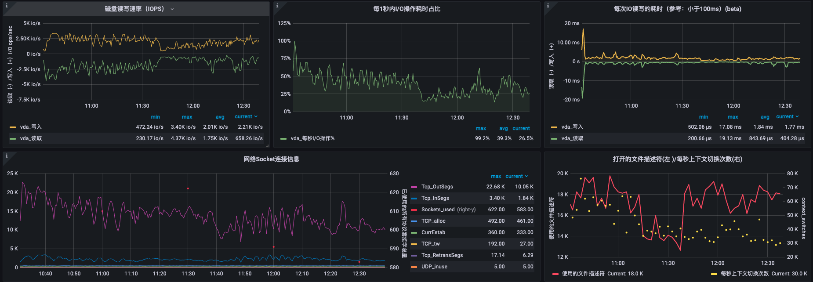

#### [游览器](http://106.75.120.70:4000/)查询数据
- 抽取块数据
	- 创建测试合约
		
		因为生产合约比较复杂，没有使用压测软件的部署方式，而是使用手动方式部署
	- 负载块信息 
	
		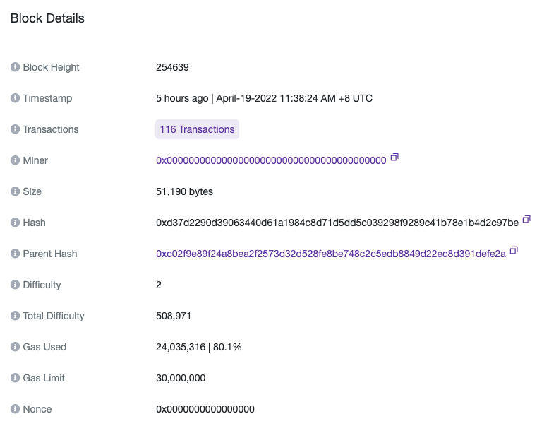
	- 块交易列表

		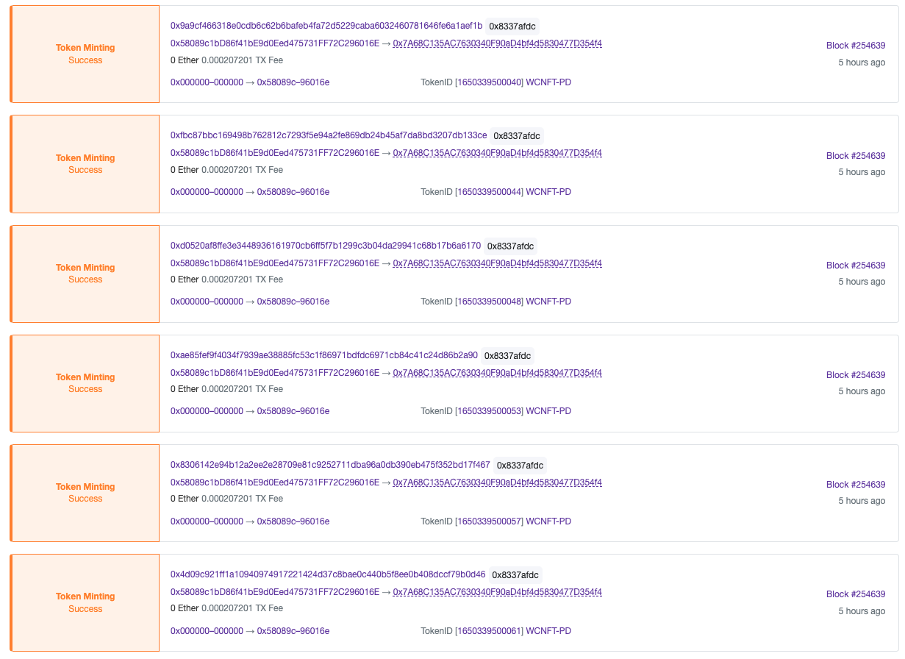
- 抽取单条交易数据
	
	 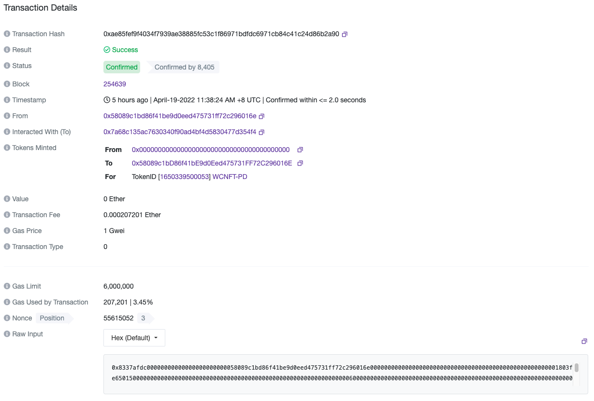

#### 测试客户端结果
- 图形

	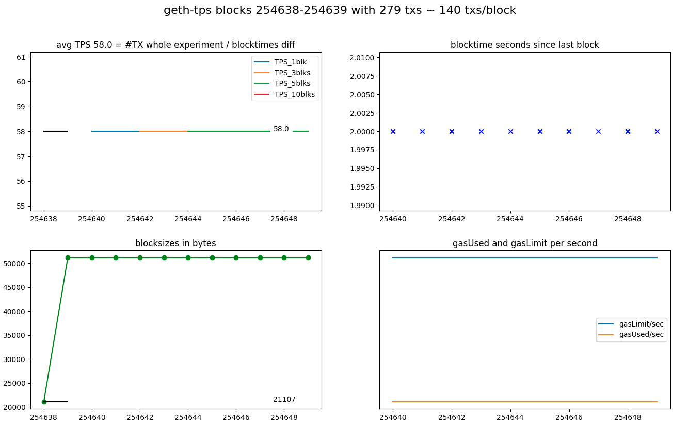
- 文本

		(geth-tps) Geth v1.10.17 with 100000 txs: 58.0 TPS
		information:
		NODE: Geth/v1.10.17-stable-25c9b49f/linux-amd64/go1.18 on http://172.17.50.188:8545
		      consensus=clique chain_name=poa chain_id=65533 network_id=65533
		SEND: 100000 transactions in blocks 254638-254639 with 10 empty blocks following.
		      A sample of transactions looked as if they: failed (at least partially).
		TPS:  The stopclock watcher measured a final TPS of 24.4 since contract deploy,
		      and in between saw values as high as 57.8 TPS.
		DIAG: The whole experiment was prefixed 'geth-tps'.
		      The diagrams were saved into 'img/geth-tps-20220419-1138_blks254638-254639.png'.
		      Looking only at the experiment block-timestamps, the overall TPS was ~58.0.
		log:
		versions: web3 4.8.2, py-solc: 3.2.0, solc 0.4.25+commit.59dbf8f1.Linux.gpp, testrpc 1.3.5, python 3.6.9 (default, Dec  8 2021, 21:08:43) [GCC 8.4.0]
		web3 connection established, blockNumber = 254635, node version string =  Geth/v1.10.17-stable-25c9b49f/linux-amd64/go1.18
		first account of node is 0x58089c1bD86f41bE9d0Eed475731FF72C296016E, balance is 999999461.110120544009222144 Ether
		nodeName: Geth, nodeType: Geth, nodeVersion: v1.10.17-stable-25c9b49f, consensus: clique, network: 65533, chainName: poa, chainId: 65533
		
		Block  254635  - waiting for something to happen
		
		blocknumber_start_here = 254635
		starting timer, at block 254635 which has  0  transactions; at epochtime 1650339497.4648886
		block 254636 | new #TX   0 / 2000 ms =   0.0 TPS_current | total: #TX    0 /  0.6 s =   0.0 TPS_average (peak  is   0.0 TPS_average)
		block 254637 | new #TX   0 / 2000 ms =   0.0 TPS_current | total: #TX    0 /  2.7 s =   0.0 TPS_average (peak  is   0.0 TPS_average)
		block 254638 | new #TX  47 / 2000 ms =  23.5 TPS_current | total: #TX   47 /  5.5 s =   8.6 TPS_average (peak  is   8.6 TPS_average)
		block 254639 | new #TX 116 / 2000 ms =  58.0 TPS_current | total: #TX  163 /  6.7 s =  24.4 TPS_average (peak  is  24.4 TPS_average)
		block 254640 | new #TX 116 / 2000 ms =  58.0 TPS_current | total: #TX  279 /  8.8 s =  31.7 TPS_average (peak  is  31.7 TPS_average)
		block 254641 | new #TX 116 / 2000 ms =  58.0 TPS_current | total: #TX  395 / 10.6 s =  37.1 TPS_average (peak  is  37.1 TPS_average)
		...
		block 255283 | new #TX 116 / 2000 ms =  58.0 TPS_current | total: #TX 74867 / 1294.9 s =  57.8 TPS_average (peak was  57.8 TPS_average)
		block 255284 | new #TX 116 / 2000 ms =  58.0 TPS_current | total: #TX 74983 / 1296.7 s =  57.8 TPS_average (peak was  57.8 TPS_average)
		block 255285 | new #TX 116 / 2000 ms =  58.0 TPS_current | total: #TX 75099 / 1298.9 s =  57.8 TPS_average (peak was  57.8 TPS_average)
		Received signal from send.py = updated INFOFILE.
		Experiment ended! Current blocknumber = 255285
		Updated info file: last-experiment.json THE END.
		
		info raw
		{'diagrams': {'blocktimestampsTpsAv': 58.0, 'filename': 'img/geth-tps-20220419-1138_blks254638-254639.png', 'prefix': 'geth-tps'}, 'node': {'chain_id': 65533, 'chain_name': 'poa', 'consensus': 'clique', 'name': 'Geth', 'network_id': 65533, 'rpc_address': 'http://172.17.50.188:8545', 'type': 'Geth', 'version': 'v1.10.17-stable-25c9b49f', 'web3.version.node': 'Geth/v1.10.17-stable-25c9b49f/linux-amd64/go1.18'}, 'send': {'block_first': 254638, 'block_last': 254639, 'empty_blocks': 10, 'num_txs': 100000, 'sample_txs_successful': False}, 'tps': {'finalTpsAv': 24.391247140835812, 'peakTpsAv': 57.82567542173486, 'start_epochtime': 1650339497.4648886}}

#### 测试结果
- 从软硬件测试结果看
	- 硬件
		- 链节点
			- 共识节点	
			
				从资源监控看，所有节点硬件均较为正常
			- 应用普通

				从资源监控看，所有节点硬件均较为正常
			- 浏览器普通
				
				从资源监控看，所有节点硬件均较为正常
		- 应用节点
			- 压力测试节点

				从资源监控看,所有节点硬件均较为正常
			- 游览器节点

				从资源监控看,所有节点硬件均较为正常
	- 软件
		- 总共测试交易 10w 
		- 测试区块
			- 254638-255285
		- 最终平均是 58/s (注意与 1155 相差不远) 
- 测试中掺杂真实转账交易
	
	因为 gaslimit 没有完全占满，所以只要 gas 足够应该可以做交易，但无测试
- 测试中遇到的问题
	-  tps 偏低
		-  问题同相同，但客户端执行成功

### 赠与
#### 硬件统计
- 共识节点

	共识节点，资源使用相差不大，故选用其中1台做基准指标
	
	- cpu、mem、load、network
		
		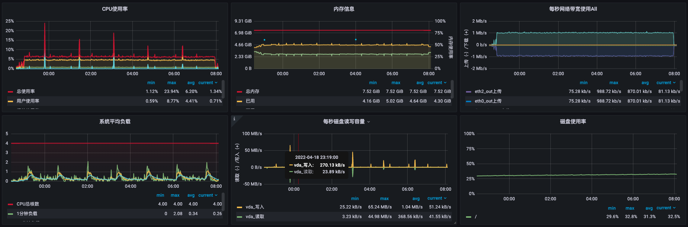
	
	- other
	
		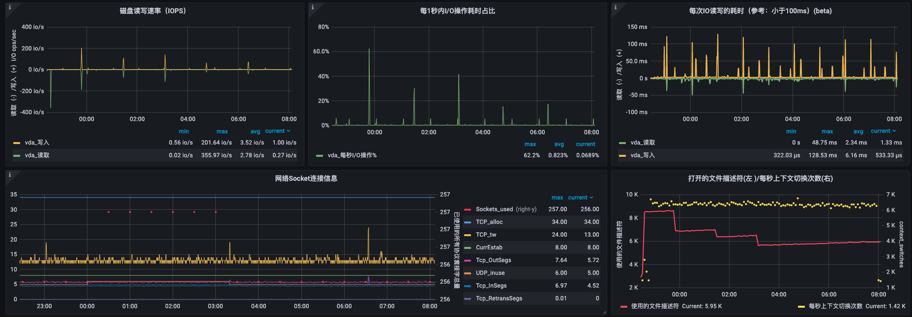
- 压测客户端普通链节点 
	- cpu、mem、load、network
	
		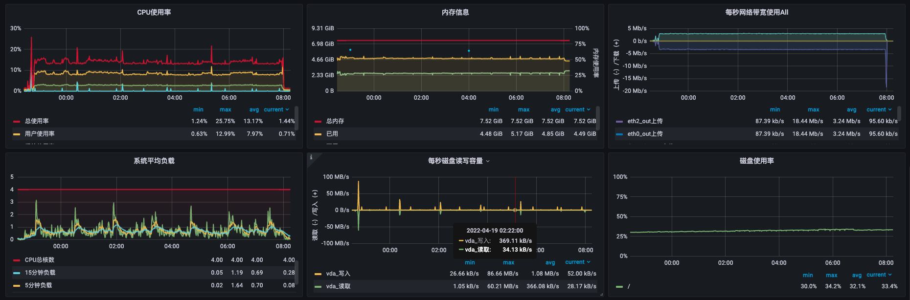

	- other
	
		
- 浏览器普通链节点
	- cpu、mem、load、network
		
		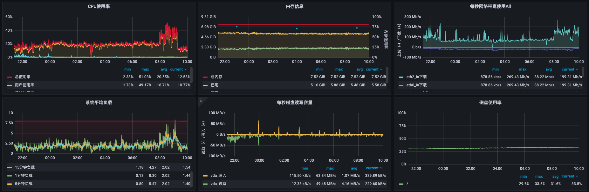
	- other
	
		
- 压测客户端节点	
	- cpu、mem、load、network

		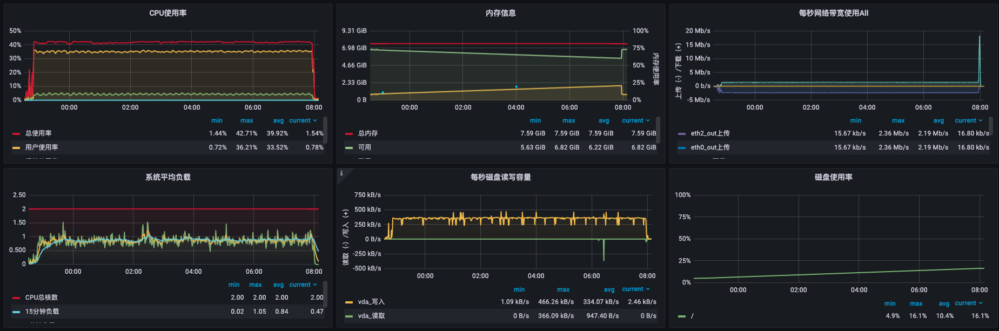
	- other
	
		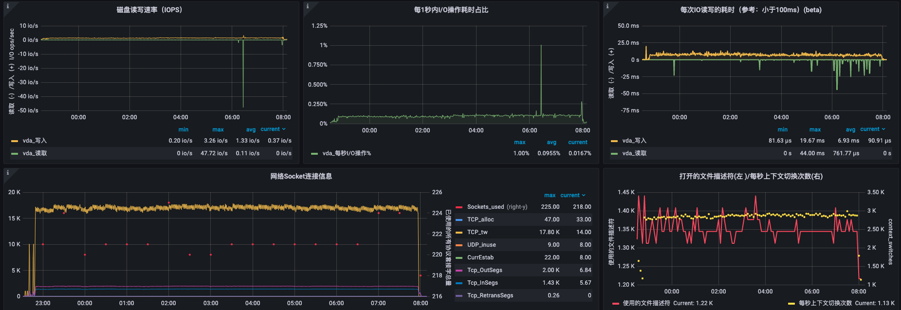
- 游览器节点
	- cpu
		
		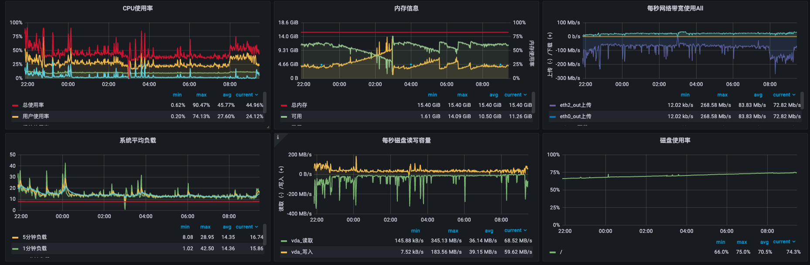
	- other
	
		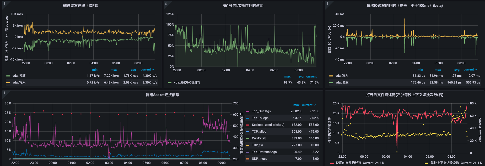

#### [游览器](http://106.75.120.70:4000/)查询数据
- 抽取块数据
	- 创建测试合约
		
		因为生产合约比较复杂，没有使用压测软件的部署方式，而是使用手动方式部署
	- 负载块信息 
	
		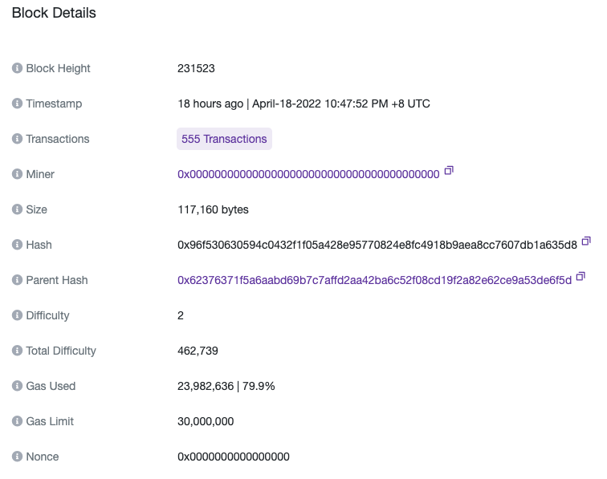
	- 块交易列表

		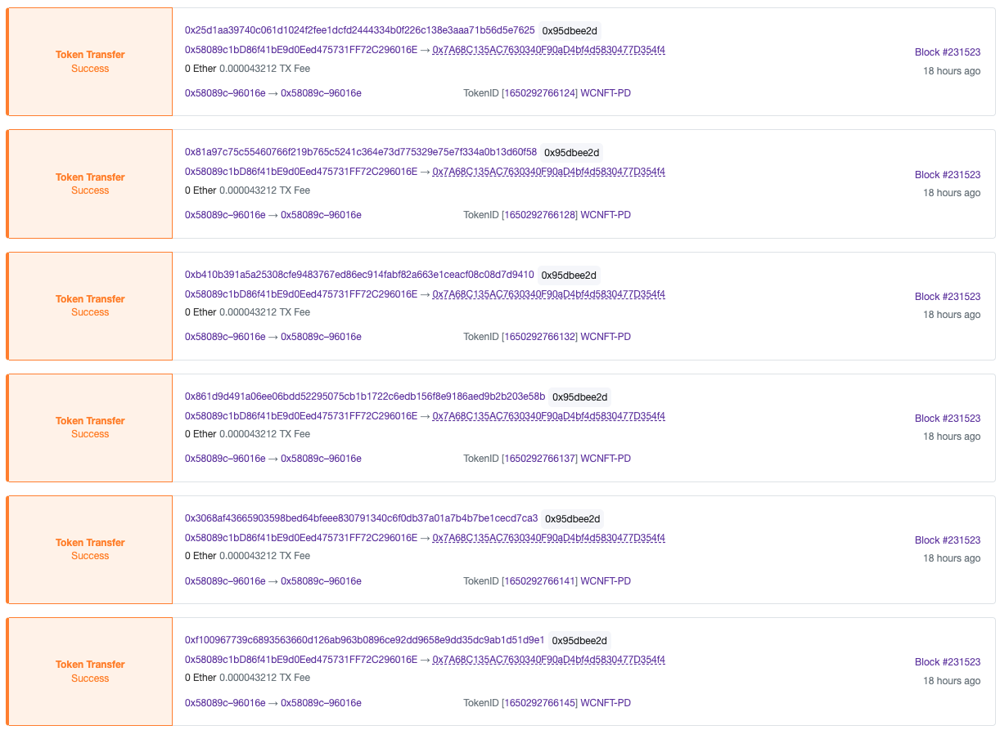
- 抽取单条交易数据
	
	 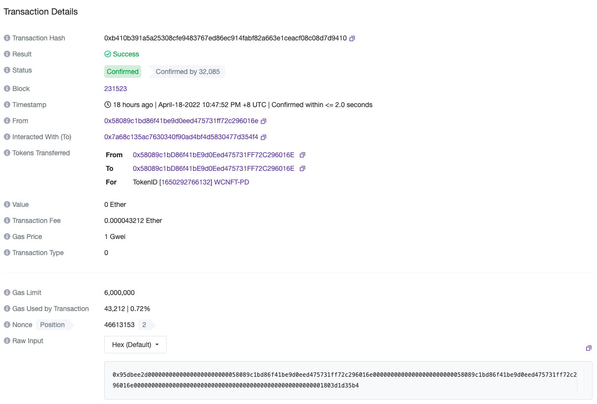

#### 测试客户端结果	
- 图形

	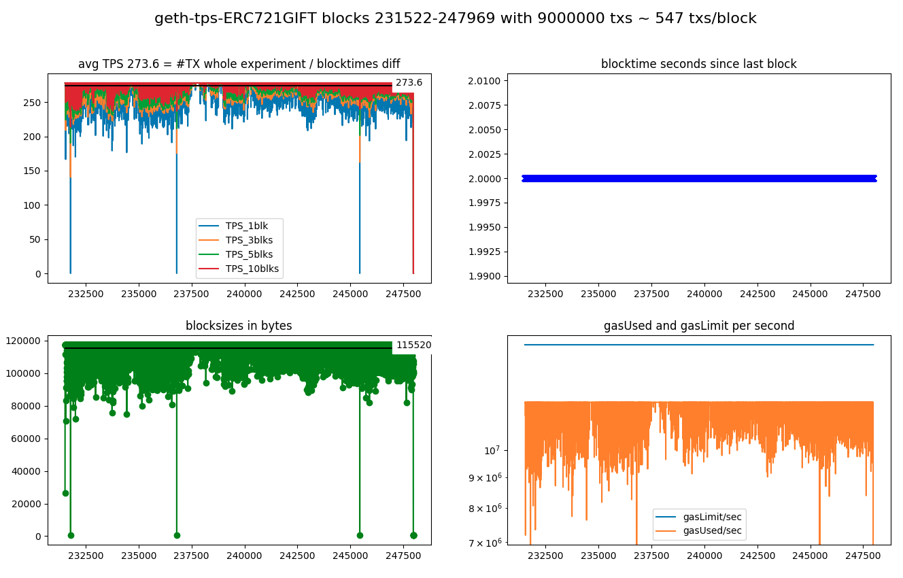
- 文本

		(geth-tps-ERC721GIFT) Geth v1.10.17 with 9000000 txs: 273.6 TPS
		information:
		NODE: Geth/v1.10.17-stable-25c9b49f/linux-amd64/go1.18 on http://172.17.50.188:8545
		      consensus=clique chain_name=poa chain_id=65533 network_id=65533
		SEND: 9000000 transactions in blocks 231522-247969 with 10 empty blocks following.
		      A sample of transactions looked as if they: succeeded.
		TPS:  The stopclock watcher measured a final TPS of 273.6 since contract deploy,
		      and in between saw values as high as 273.9 TPS.
		DIAG: The whole experiment was prefixed 'geth-tps-ERC721GIFT'.
		      The diagrams were saved into 'img/geth-tps-ERC721GIFT-20220418-2247_blks231522-247969.png'.
		      Looking only at the experiment block-timestamps, the overall TPS was ~273.6.
		log:
		versions: web3 4.8.2, py-solc: 3.2.0, solc 0.4.25+commit.59dbf8f1.Linux.gpp, testrpc 1.3.5, python 3.6.9 (default, Dec  8 2021, 21:08:43) [GCC 8.4.0]
		web3 connection established, blockNumber = 231519, node version string =  Geth/v1.10.17-stable-25c9b49f/linux-amd64/go1.18
		first account of node is 0x58089c1bD86f41bE9d0Eed475731FF72C296016E, balance is 999999850.102956512009222144 Ether
		nodeName: Geth, nodeType: Geth, nodeVersion: v1.10.17-stable-25c9b49f, consensus: clique, network: 65533, chainName: poa, chainId: 65533
		
		Block  231519  - waiting for something to happen
		
		blocknumber_start_here = 231519
		starting timer, at block 231519 which has  0  transactions; at epochtime 1650293265.343954
		block 231520 | new #TX   0 / 2000 ms =   0.0 TPS_current | total: #TX    0 /  0.9 s =   0.0 TPS_average (peak  is   0.0 TPS_average)
		block 231521 | new #TX   0 / 2000 ms =   0.0 TPS_current | total: #TX    0 /  2.7 s =   0.0 TPS_average (peak  is   0.0 TPS_average)
		block 231522 | new #TX 123 / 2000 ms =  61.5 TPS_current | total: #TX  123 /  4.9 s =  25.3 TPS_average (peak  is  25.3 TPS_average)
		block 231523 | new #TX 555 / 2000 ms = 277.5 TPS_current | total: #TX  678 /  7.0 s =  96.8 TPS_average (peak  is  96.8 TPS_average)
		block 231524 | new #TX 556 / 2000 ms = 278.0 TPS_current | total: #TX 1234 /  8.8 s = 139.6 TPS_average (peak  is 139.6 TPS_average)
		...
		block 247968 | new #TX 554 / 2000 ms = 277.0 TPS_current | total: #TX 8999460 / 32897.0 s = 273.6 TPS_average (peak was 273.9 TPS_average)
		block 247969 | new #TX 475 / 2000 ms = 237.5 TPS_current | total: #TX 8999935 / 32898.8 s = 273.6 TPS_average (peak was 273.9 TPS_average)
		block 247970 | new #TX   0 / 2000 ms =   0.0 TPS_current | total: #TX 8999935 / 32901.0 s = 273.5 TPS_average (peak was 273.9 TPS_average)
		block 247971 | new #TX   0 / 2000 ms =   0.0 TPS_current | total: #TX 8999935 / 32903.4 s = 273.5 TPS_average (peak was 273.9 TPS_average)
		block 247972 | new #TX   0 / 2000 ms =   0.0 TPS_current | total: #TX 8999935 / 32904.9 s = 273.5 TPS_average (peak was 273.9 TPS_average)
		block 247973 | new #TX   0 / 2000 ms =   0.0 TPS_current | total: #TX 8999935 / 32906.7 s = 273.5 TPS_average (peak was 273.9 TPS_average)
		block 247974 | new #TX   0 / 2000 ms =   0.0 TPS_current | total: #TX 8999935 / 32908.9 s = 273.5 TPS_average (peak was 273.9 TPS_average)
		block 247975 | new #TX   0 / 2000 ms =   0.0 TPS_current | total: #TX 8999935 / 32910.7 s = 273.5 TPS_average (peak was 273.9 TPS_average)
		block 247976 | new #TX   0 / 2000 ms =   0.0 TPS_current | total: #TX 8999935 / 32912.8 s = 273.4 TPS_average (peak was 273.9 TPS_average)
		block 247977 | new #TX   0 / 2000 ms =   0.0 TPS_current | total: #TX 8999935 / 32915.0 s = 273.4 TPS_average (peak was 273.9 TPS_average)
		block 247978 | new #TX   0 / 2000 ms =   0.0 TPS_current | total: #TX 8999935 / 32916.8 s = 273.4 TPS_average (peak was 273.9 TPS_average)
		block 247979 | new #TX   0 / 2000 ms =   0.0 TPS_current | total: #TX 8999935 / 32918.9 s = 273.4 TPS_average (peak was 273.9 TPS_average)
		Received signal from send.py = updated INFOFILE.
		Experiment ended! Current blocknumber = 247979
		Updated info file: last-experiment.json THE END.
		
		info raw
		{'diagrams': {'blocktimestampsTpsAv': 273.60238949352464, 'filename': 'img/geth-tps-ERC721GIFT-20220418-2247_blks231522-247969.png', 'prefix': 'geth-tps-ERC721GIFT'}, 'node': {'chain_id': 65533, 'chain_name': 'poa', 'consensus': 'clique', 'name': 'Geth', 'network_id': 65533, 'rpc_address': 'http://172.17.50.188:8545', 'type': 'Geth', 'version': 'v1.10.17-stable-25c9b49f', 'web3.version.node': 'Geth/v1.10.17-stable-25c9b49f/linux-amd64/go1.18'}, 'send': {'block_first': 231522, 'block_last': 247969, 'empty_blocks': 10, 'num_txs': 9000000, 'sample_txs_successful': True}, 'tps': {'finalTpsAv': 273.56399107140874, 'peakTpsAv': 273.9499419507558, 'start_epochtime': 1650293265.343954}}

#### 测试结果
- 从软硬件测试结果看
	- 硬件
		- 链节点
			- 共识节点	
			
				从资源监控看，所有节点硬件均较为正常
			- 应用普通

				从资源监控看，所有节点硬件均较为正常
			- 浏览器普通
				
				从资源监控看，所有节点硬件均较为正常
		- 应用节点
			- 压力测试节点

				从资源监控看,所有节点硬件均较为正常
			- 游览器节点

				从资源监控看,所有节点硬件均较为正常
	- 软件
		- 总共测试交易 900w 
		- 测试区块
			- 231522-247979
		- 最终平均是 273.6 TPS 
- 测试中掺杂真实转账交易
	
	因为 gaslimit 没有完全占满，所以只要 gas 足够应该可以做交易，但无测试
- 测试中遇到的问题
	- 赠与数量为什么没有压测24小时

		测试了连续900w笔交易正常，并且压力平均可处理，我们认为该合约接口稳定正常				

				
		
	
		  
			  
					 