# nonce 机制模拟测试
## 准备环境
准备 2 个以太坊集群节点
## 测试过程
### 交易同步的情况下
- 原始 nonce 为 0 的交易
	- 发送 nonce 为 0 的交易给节点A
	- 会返回交易 hash
	
		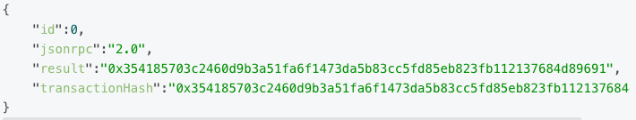
	- 并能在节点 A 的 txpool 中 pending 看到(如果广播足够快，节点 B 中也能同时看到)
	
		
- gas price 不变的情况下生成相同交易发送

	发送 nonce 为 0 的交易（交易金额和 gas price 等全部保持不变）给节点A，响应结果如下，表明并没有提交成功

	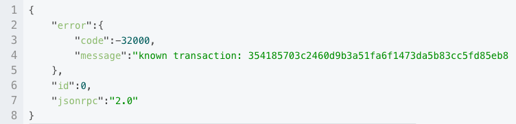
- 更高 gas price 的情况生成相同交易发送(为了防止交易因 gasprice 堵塞而使用的通过提高 gasprice 来提升交易进入区块的优先级问题，比如 metamask 设置的加速功能和取消功能，均使用该逻辑)
	- 再次发送 nonce 为 0 的交易给节点 A，并且把 gas price 价格提高（必须超过10%）
	- 响应结果如下
	
		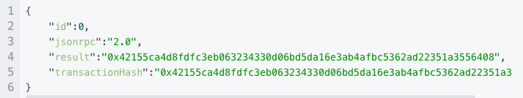	
	- txpool 中可以看到该笔交易会把之前的交易替换掉

		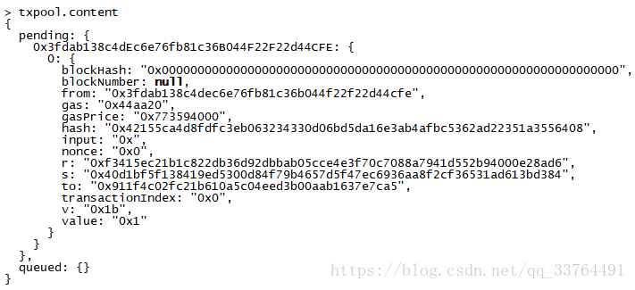
- 测试不同步机制

	提交给节点 A 的 pending 交易并没同步到节点B
	
	- 同样的 nonce 的交易再次向节点 B 

		提交成功，而且提交的交易的 hash 与节点 A 的 交易 hash 相同（就此可以认为两次发送的交易就是同一笔交易）
	- 同样的 nonce 的交易再次向节点 B 提交，但是修改了 gas price

		提交成功，但提交的交易的 hash 与节点 A 的 交易 hash 不相同，而最终仅会打包成功一个，哪个交易现进入挖矿节点的 pending 队列，那个交易就先打包。
- 测试 queued 机制
	- 当前 pending nonce 是 0 ，继续发送 nonce 为 2（跳过1）的交易到节点 A 中，会被提交进去，并且可以拿到交易 hash

		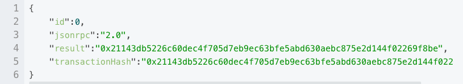
	- 只是交易会被放入 queued 中，但不会被广播到节点 B

		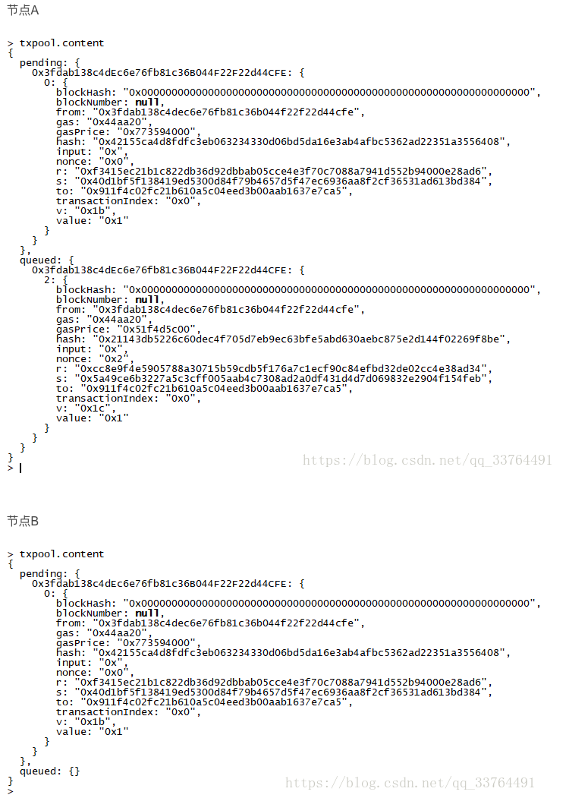
	- 再发送 nonce 为2相同的交易到节点 A 中，会报已有交易而拒绝

		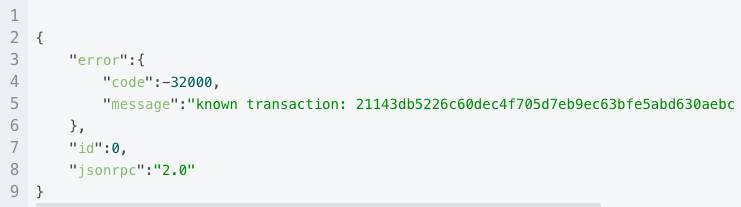
	- 当把相同 nonce 为2的交易发到节点 B 时，因为 A和 B 的 queued 并不同步，所以可以提交，并且生成了和 A 相同的交易 hash，就此看成是相同 hash

		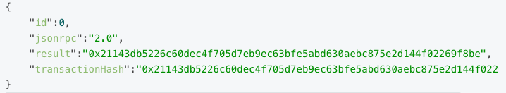 
	- 而如果将相同 nonce 的交易提高了 gas price 再发送给 B ，则可以提交，但是生成的交易 hash 与节点 A 不符
- 补齐交易测试交易 gas price 不一样时的情况

	补齐 nonce 为 1 的交易后，观察到节点 A 和节点 B 的 queued 虽然都维护着相同 nonce 的交易，但因 gas price 不同而导致 hash 不同，而最终进入 pending 中会是 gas price 价格高的交易，至此两个节点又保持一致。
	
	结论是 gas price 价格高的会被加入到 pending 中
- 继续
	- 往节点 A 中提交 nonce 为 5 的交易进入到 queued ，保持 gas price 不变，但提高交转账金额。
	- 再次提交 nonce 为 5 的交易到节点 B 中，两个节点中又分别维护了两笔 nonce 相同，但交易 hash 不同的交易
- 补齐交易测试交易 gas price 一致的情况下
	
	此时因为 gas price 一样，在补齐 nonce 为 4 的交易后，两个节点中 nonce 为 5 的交易都会进入到各自的 pending 中，但是最终只会只有一笔会被打包，也就是哪个节点在挖矿，优先选择自己 pending 中的交易。
	
-  nonce 的其它可能会碰到的问题
	-  某用户的区块链维护的 nonce 已经到 10 了，但提交一笔交易 nonce 为10以下（包括10）的交易

		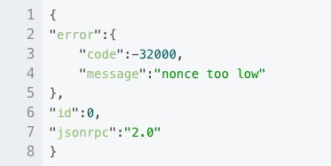
	- 某用户的区块链提交的交易 nonce 已经到 10 了，但依然提交一笔交易 nonce 为 10 的交易，
如果不改变之前交易的任何信息继续提交（两笔交易的hash是一样的），响应如下

		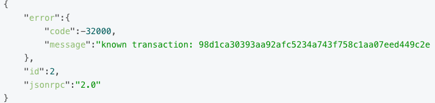
	- 如果改变交易金额提交（交易hash不一样），响应如下
		
		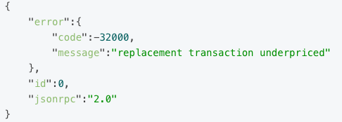
		

## 参考
[有关以太坊nonce问题](https://blog.csdn.net/qq_33764491/article/details/81870510?spm=1001.2101.3001.6650.14&utm_medium=distribute.pc_relevant.none-task-blog-2%7Edefault%7EBlogCommendFromBaidu%7Edefault-14.pc_relevant_default&depth_1-utm_source=distribute.pc_relevant.none-task-blog-2%7Edefault%7EBlogCommendFromBaidu%7Edefault-14.pc_relevant_default&utm_relevant_index=16)